# 🌊 hydraulician

*hydraulician is a work in progress, however, contributions via GitHub issues are welcome.*

**Interactive 2D hydraulics in the vertical plane, in your browser** — draw a
channel with the mouse and watch free-surface Navier–Stokes run through it.

**Try it:** <https://barneydobson.github.io/hydraulician/> — runs in the
browser, nothing to install (live once the repository is public).

**Contents** — [Summary](#summary) · [Exercises](#exercises) ·
[Method](#method) · [Developer](#developer) ·
[Appendix: controls, limits, credit](#appendix--controls-limits-and-credit)

---

## Summary

Draw a channel, a pipe or a tank and the solver runs free-surface flow through
it, measuring depth, discharge, critical and normal depth, the energy line,
jump conjugate depths and velocity profiles as it goes. It is meant for
teaching and outreach — a demonstration to run in a lecture, or at an open
day. It is not meant for research or design: it is a vertical slice one metre
wide, its resistance comes from the mesh rather than from a roughness table,
and pressure cannot fall below zero gauge. Use it to see the shape of a
result, then use a real model to get a number.

## Exercises

*Note, I have not checked the exercises yet!*

Click a picture or an id to open that exercise in the app, set up and ready.
Written briefs, data and plots for each one are in
[`exercises/`](exercises/INDEX.md).

|  |  |  |  |
|---|---|---|---|
| [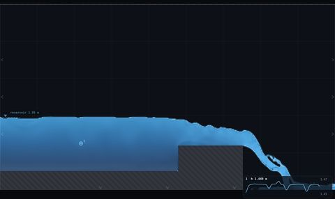](https://barneydobson.github.io/hydraulician/?ex=DA-1)<br>**[DA-1](https://barneydobson.github.io/hydraulician/?ex=DA-1)** · scale ladder | [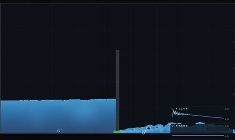](https://barneydobson.github.io/hydraulician/?ex=DA-2)<br>**[DA-2](https://barneydobson.github.io/hydraulician/?ex=DA-2)** · time scales | [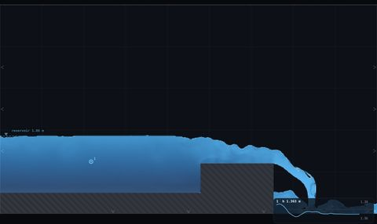](https://barneydobson.github.io/hydraulician/?ex=DA-3)<br>**[DA-3](https://barneydobson.github.io/hydraulician/?ex=DA-3)** · scale effects | [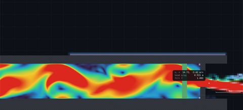](https://barneydobson.github.io/hydraulician/?ex=HP-1)<br>**[HP-1](https://barneydobson.github.io/hydraulician/?ex=HP-1)** · penstock power |
| [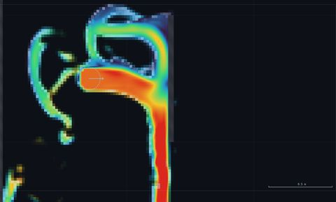](https://barneydobson.github.io/hydraulician/?ex=HP-2)<br>**[HP-2](https://barneydobson.github.io/hydraulician/?ex=HP-2)** · Pelton jet | [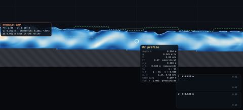](https://barneydobson.github.io/hydraulician/?ex=NC-1)<br>**[NC-1](https://barneydobson.github.io/hydraulician/?ex=NC-1)** · slope–area gauging | [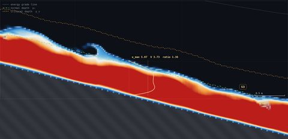](https://barneydobson.github.io/hydraulician/?ex=NC-2)<br>**[NC-2](https://barneydobson.github.io/hydraulician/?ex=NC-2)** · energy coefficient α | [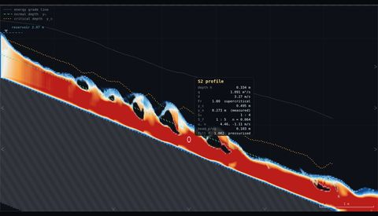](https://barneydobson.github.io/hydraulician/?ex=NC-3)<br>**[NC-3](https://barneydobson.github.io/hydraulician/?ex=NC-3)** · bed shear |
| [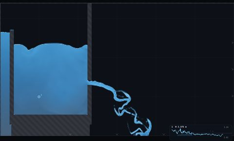](https://barneydobson.github.io/hydraulician/?ex=QS-1)<br>**[QS-1](https://barneydobson.github.io/hydraulician/?ex=QS-1)** · tank draining | [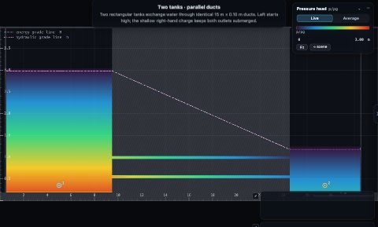](https://barneydobson.github.io/hydraulician/?ex=QS-2)<br>**[QS-2](https://barneydobson.github.io/hydraulician/?ex=QS-2)** · two reservoirs | [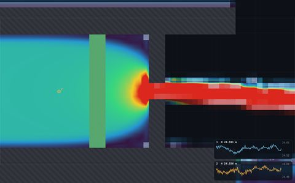](https://barneydobson.github.io/hydraulician/?ex=UN-1)<br>**[UN-1](https://barneydobson.github.io/hydraulician/?ex=UN-1)** · celerity | [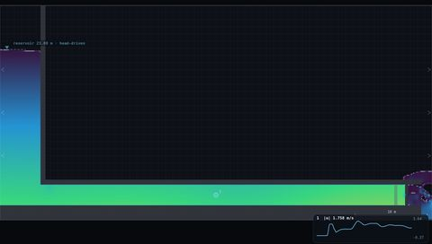](https://barneydobson.github.io/hydraulician/?ex=UN-2)<br>**[UN-2](https://barneydobson.github.io/hydraulician/?ex=UN-2)** · flow establishment |
| [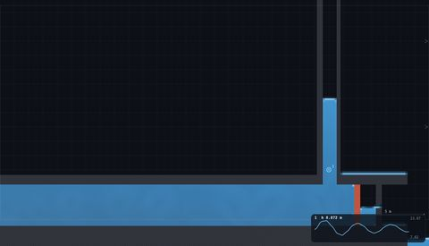](https://barneydobson.github.io/hydraulician/?ex=UN-3)<br>**[UN-3](https://barneydobson.github.io/hydraulician/?ex=UN-3)** · surge tank | [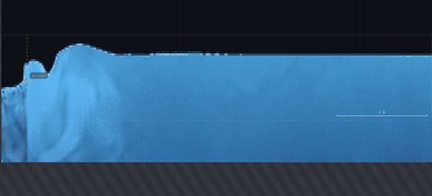](https://barneydobson.github.io/hydraulician/?ex=WV-1)<br>**[WV-1](https://barneydobson.github.io/hydraulician/?ex=WV-1)** · dispersion | [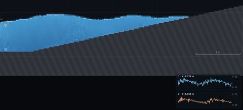](https://barneydobson.github.io/hydraulician/?ex=WV-2)<br>**[WV-2](https://barneydobson.github.io/hydraulician/?ex=WV-2)** · pressure under waves | [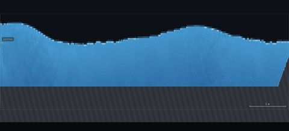](https://barneydobson.github.io/hydraulician/?ex=WV-3)<br>**[WV-3](https://barneydobson.github.io/hydraulician/?ex=WV-3)** · wave reflection |
| [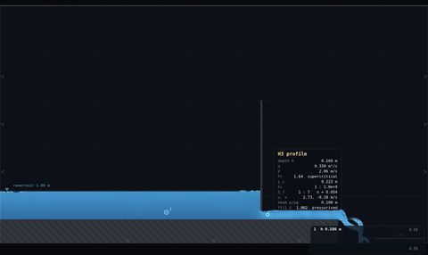](https://barneydobson.github.io/hydraulician/?ex=MO-1)<br>**[MO-1](https://barneydobson.github.io/hydraulician/?ex=MO-1)** · sluice gate | [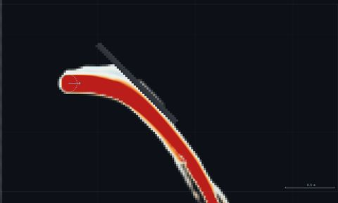](https://barneydobson.github.io/hydraulician/?ex=MO-2)<br>**[MO-2](https://barneydobson.github.io/hydraulician/?ex=MO-2)** · jet on a vane | [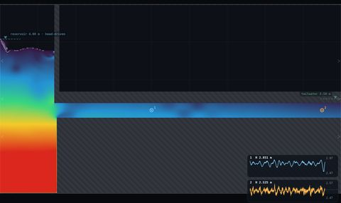](https://barneydobson.github.io/hydraulician/?ex=FR-1)<br>**[FR-1](https://barneydobson.github.io/hydraulician/?ex=FR-1)** · pipe friction | [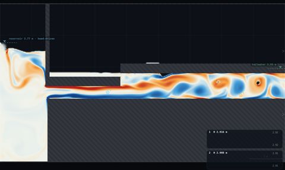](https://barneydobson.github.io/hydraulician/?ex=LL-1)<br>**[LL-1](https://barneydobson.github.io/hydraulician/?ex=LL-1)** · sudden expansion |
| [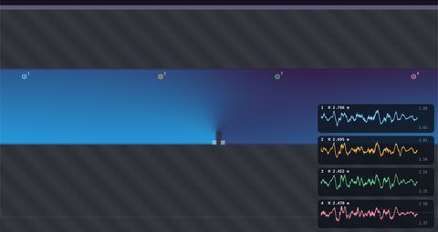](https://barneydobson.github.io/hydraulician/?ex=LL-2)<br>**[LL-2](https://barneydobson.github.io/hydraulician/?ex=LL-2)** · hidden throttle | [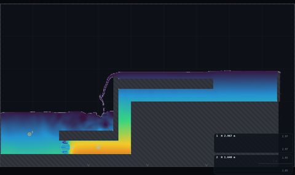](https://barneydobson.github.io/hydraulician/?ex=PU-1)<br>**[PU-1](https://barneydobson.github.io/hydraulician/?ex=PU-1)** · system curve | [](https://barneydobson.github.io/hydraulician/?ex=WE-1)<br>**[WE-1](https://barneydobson.github.io/hydraulician/?ex=WE-1)** · sharp-crested weir | [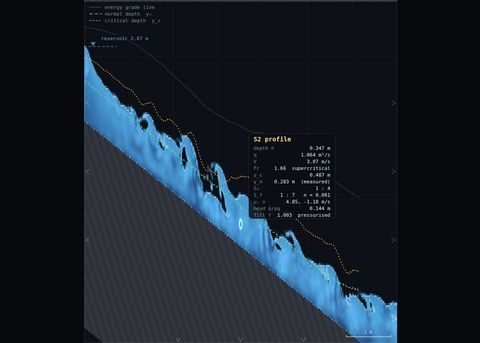](https://barneydobson.github.io/hydraulician/?ex=UF-1)<br>**[UF-1](https://barneydobson.github.io/hydraulician/?ex=UF-1)** · normal depth |
| [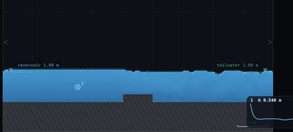](https://barneydobson.github.io/hydraulician/?ex=FB-1)<br>**[FB-1](https://barneydobson.github.io/hydraulician/?ex=FB-1)** · choked hump | [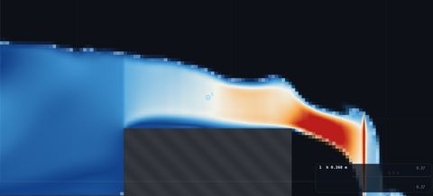](https://barneydobson.github.io/hydraulician/?ex=FB-2)<br>**[FB-2](https://barneydobson.github.io/hydraulician/?ex=FB-2)** · critical depth | [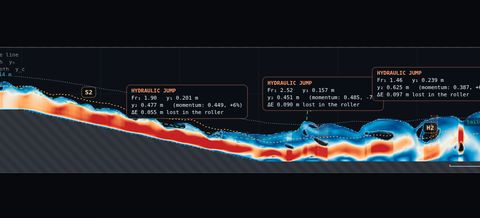](https://barneydobson.github.io/hydraulician/?ex=HJ-1)<br>**[HJ-1](https://barneydobson.github.io/hydraulician/?ex=HJ-1)** · hydraulic jump | [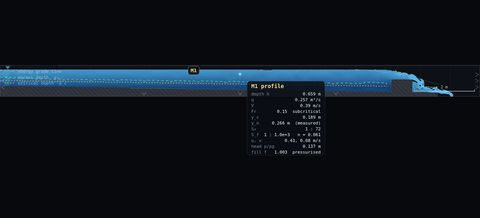](https://barneydobson.github.io/hydraulician/?ex=GV-1)<br>**[GV-1](https://barneydobson.github.io/hydraulician/?ex=GV-1)** · backwater profile |
| [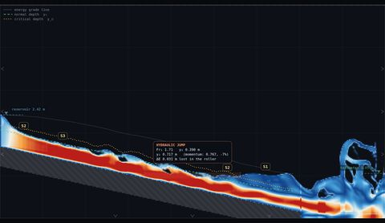](https://barneydobson.github.io/hydraulician/?ex=GV-2)<br>**[GV-2](https://barneydobson.github.io/hydraulician/?ex=GV-2)** · profile classification | [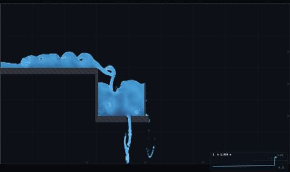](https://barneydobson.github.io/hydraulician/?ex=CS-1)<br>**[CS-1](https://barneydobson.github.io/hydraulician/?ex=CS-1)** · CSO chamber |   |   |

**Backups (B1–B10).** Spares, for a session with time left over.

|  |  |  |  |
|---|---|---|---|
| [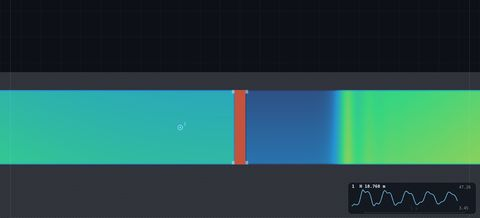](https://barneydobson.github.io/hydraulician/?ex=B1)<br>**[B1](https://barneydobson.github.io/hydraulician/?ex=B1)** · reflection period | [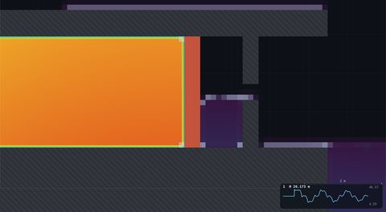](https://barneydobson.github.io/hydraulician/?ex=B2)<br>**[B2](https://barneydobson.github.io/hydraulician/?ex=B2)** · celerity and surge | [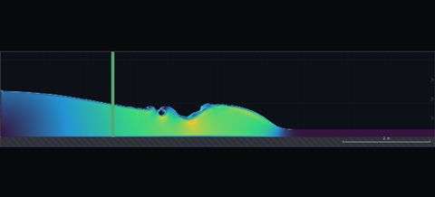](https://barneydobson.github.io/hydraulician/?ex=B3)<br>**[B3](https://barneydobson.github.io/hydraulician/?ex=B3)** · dam break | [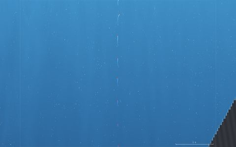](https://barneydobson.github.io/hydraulician/?ex=B4)<br>**[B4](https://barneydobson.github.io/hydraulician/?ex=B4)** · wave orbits |
| [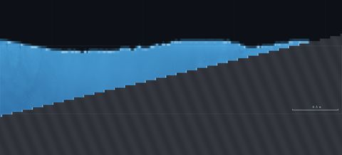](https://barneydobson.github.io/hydraulician/?ex=B5)<br>**[B5](https://barneydobson.github.io/hydraulician/?ex=B5)** · breaker types | [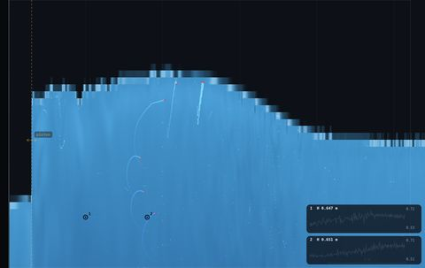](https://barneydobson.github.io/hydraulician/?ex=B6)<br>**[B6](https://barneydobson.github.io/hydraulician/?ex=B6)** · Ursell number | [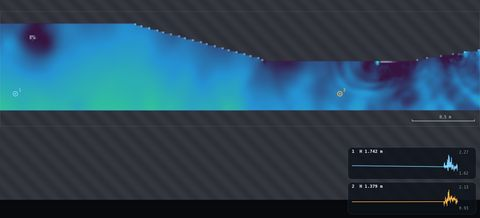](https://barneydobson.github.io/hydraulician/?ex=B7)<br>**[B7](https://barneydobson.github.io/hydraulician/?ex=B7)** · venturi meter | [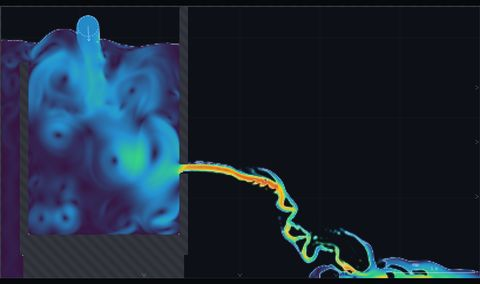](https://barneydobson.github.io/hydraulician/?ex=B8)<br>**[B8](https://barneydobson.github.io/hydraulician/?ex=B8)** · orifice coefficients |
| [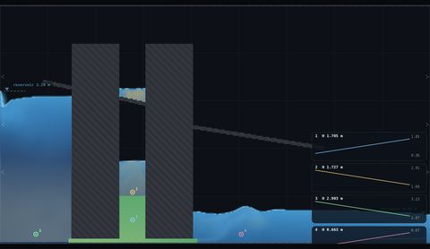](https://barneydobson.github.io/hydraulician/?ex=B9)<br>**[B9](https://barneydobson.github.io/hydraulician/?ex=B9)** · three reservoirs | [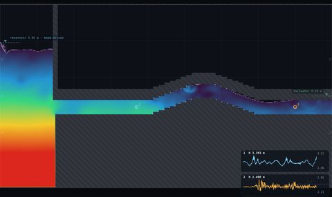](https://barneydobson.github.io/hydraulician/?ex=B10)<br>**[B10](https://barneydobson.github.io/hydraulician/?ex=B10)** · pipe crest and HGL |   |   |

## Method

The solver integrates the Navier–Stokes equations in the vertical plane: mass
is conserved, and fluid accelerates under pressure, gravity, viscosity and bed
drag.

```math
\frac{\partial f}{\partial t} + \nabla \cdot (f \mathbf{u}) = 0
```

```math
\frac{\partial \mathbf{u}}{\partial t} + (\mathbf{u} \cdot \nabla) \mathbf{u}
= -\frac{\nabla p}{\rho} + \mathbf{g} + \nabla \cdot (\nu \nabla \mathbf{u})
- \frac{C_f |\mathbf{u}| \mathbf{u}}{\Delta}
```

Here `u` is velocity, `p` pressure, `ν` viscosity, `C_f` a bed
friction coefficient, and `f` the fraction of a cell occupied by water, which
also serves as the density.

The simplification is in how pressure is obtained. Treating water as
incompressible makes pressure a global unknown: each step needs a Poisson
solve over the whole grid, and the free surface needs a separate interface
scheme. Instead the water is made slightly compressible, so pressure follows
from the local fill fraction alone:

```math
\frac{p}{\rho} = c^{2} \max(f - 1, 0)
```

with `c` the speed at which pressure signals travel. A cell below capacity
(`f<1`) carries no pressure and its water falls under gravity, which is the
free surface condition without tracking an interface; a cell above capacity
(`f>1`) is compressed and pressurised. Open-channel and pressurised flow are
therefore the same equations, surcharge and drain-down need no special case,
and `c` is exposed as a control. This is a two-dimensional Preissmann slot,
the same device used for surcharge in sewer models.

Consequences. Discharges are per metre of width. The celerity is
chosen rather than physical (8–400 m/s against ~1200 m/s in steel pipe), since
the step scales as `Δt ≈ 0.45 Δx/(c+6)`; the scalings
`ΔH = c Δv/g` and period `4L/c` hold regardless. Resistance is
delivered by the mesh, the wall treatment and the eddy viscosity, so
`h_f ∝ V²` holds but Manning's `n` is a property of the grid and is measured
from the computed energy line, `S_f = -dE/dx`, rather than
set. There is no surface tension, and voids carry no pressure, so nothing
pneumatic is represented and breakers spill rather than plunge.

Implementation: a staggered (MAC) grid, velocities on faces and pressure and
fill at centres, with no Poisson solve. Two full-screen GPU passes per
substep: velocity (third-order upwind advection, Smagorinsky eddy viscosity,
wall-aware Laplacian, implicit bed friction, then the pressure gradient from
the equation of state) and volume-of-fluid (van Leer-limited flux-form
advection of `f` with an interface-compression term and a donor-cell
positivity limiter, which conserves volume to machine precision). Three
cheaper passes handle the per-column reduction, particles and display. WebGL2,
no dependencies, no build step, a few thousand substeps per second.

Headless checks: water hammer peaks at 39.0 m against Joukowsky 41.1 m (−5%),
period 3.0 s against `4L/c` = 2.8 s; orifice efflux 5.62 m/s against
`√(2gh)` = 5.8 m/s (`C_v ≈ 0.97`); venturi throat 19.4 m/s against
20.3; conjugate depth 5% under Bélanger; a 14 m flume passes q = 0.251 m²/s in
against 0.215–0.261 out with volume flat. Every scene has been run to
t = 120 s and checked for steadiness, flutter and discharge continuity.

## Developer

Clone, serve, open — there is nothing to build:

```bash
git clone https://github.com/barneydobson/hydraulician
cd hydraulician
python3 -m http.server 8124     # then http://localhost:8124
```

Opening `index.html` from the file system works too. URL parameters:
`?scene=<id>` boots a scene, `?ex=<ID>` boots a set-up exercise. In the app,
`S` opens the scene list and `E` the exercises.

The file map:

| file | what lives there |
|---|---|
| `index.html` | markup, all the CSS, the classic `<script>` tags |
| `js/gl.js` | `GLH` — programs, float textures, FBOs, ping-pong pairs, bufferless draws |
| `js/shaders.js` | `Shaders` — the five passes: `vel`, `vof`, `col`, `part`, `disp` |
| `js/scenes.js` | `SCENES` — `channel()` builds a prismatic GVF reach, `drop()` an approach → chute → apron |
| `js/sim.js` | `SIM` — grid allocation, wall rasterisation, the substep loop, control bands, readbacks |
| `js/overlay.js` | `OVERLAY` — the 2D canvas: y_c, y_n, EGL, profile classification, jump detection, gauges, rake |
| `js/main.js` | boot, the panel spec, pointer tools, view transform, frame loop, `window.APP` |
| `js/exercises.js` | `EXERCISES` — the 40 teaching demos the `E` menu and `?ex=` read |
| `js/exercises-rigs.js` | the drawn rigs (RIG-A duct, RIG-B channel, RIG-C tanks, RIG-D chamber) those demos load |

**No build step or module system.** Everything is a
classic script so that double-clicking `index.html` on a `file://` URL still
works, which is what a lecturer with no terminal will do. Keep it that way, and
keep it dependency-free.

**Read [`CLAUDE.md`](CLAUDE.md) before touching the solver.** It is the
contributor briefing: the model, the state textures, the coordinate and
geometry contracts, and — most valuable — the guard rails, each of which was
bought with an explosion (the transport-consistency cap, the open-boundary
ring, the control bands, the soft level boundaries, the conservation rule in
the VOF pass). The section on conservation in particular is not optional
reading: an earlier positivity clamp invented enough water to triple the
discharge along a flume while the depth sat perfectly steady.

**Adding a scene.** Scenes are plain data in `js/scenes.js` — a physical
domain `W × H`, a wall segment list (`[x0,y0,x1,y1,th]` centrelines with butt
ends), boundary flags, and live parameters. `channel(...)` builds a prismatic
reach from (S₀, C_f, q) plus a control and `drop(...)` builds an approach →
chute → apron, so most new scenes are a call to one of those plus a few drawn
segments. Copy the nearest neighbour and read its comments; the ones about
tailwater ≥ 1.3·y_c and about beds staying above the domain floor are load
bearing.

**Adding an exercise.** Append an entry to `EXERCISES` in `js/exercises.js`.
Each is an object with an `id` (that is the `?ex=` id), `title`, `topic`,
`folder`, `scene`, optional `rig` + `rigParams`, `viewParams`, a `digit` block
that turns the student's last digit into a personalised parameter, `task`,
`submit`, `settle` and `notes`. `HJ-1` is a good template. Then write the
brief in `exercises/<folder>/README.md` and add the row to `exercises/INDEX.md`
— the id must match in all three.

**Testing headless.** `exercises/_runner/runner.py` (stdlib only) drives a
real Chrome over CDP: `launch`, `eval`, `pump --sim-seconds`, `shot`, `bench`,
`status`, `close`. See [`exercises/_runner/HOWTO.md`](exercises/_runner/HOWTO.md)
for the worked example and the concurrency rules. Inside the page, `APP.frames(n)`,
`APP.tick(n)`, `APP.probe(x,y)`, `APP.volume()` and `APP.zoomAt(...)` exist for
scripted runs — the render loop stops when the tab is hidden, so drive it
through those rather than waiting on wall-clock time.

**Where things live.** The teaching pack and its standing rules are in
[`exercises/INDEX.md`](exercises/INDEX.md); per-demo status and measured
caveats in `exercises/_director-status.md`; open proposals — demos that need a
change, and UI changes that have been costed but not made — in
[`exercises/CHANGES-NEEDED.md`](exercises/CHANGES-NEEDED.md); and the reports
for changes already made (the exercise picker, the gauge inspector and CSV,
rig save/share) in `exercises/_code-changes/`.

**Deploying.** `.github/workflows/pages.yml` publishes the repository as-is to
GitHub Pages on every push to `main` — no build, and `.nojekyll` stops Jekyll
touching the folders. It turns Pages on by itself the first time it can run, so
making the repository public is the only manual step; if the first run has not
done it for you, set **Settings → Pages → Source = GitHub Actions**.

---

## Appendix — controls, limits and credit

Water enters at the top left by default; everything else is drawn.

| | |
|---|---|
| **left-drag** | draw a straight edge (hold **shift** to snap to 0°/45°/90°) |
| **right-drag** | pour a larger flow |
| **wheel** / **middle-drag** | zoom about the cursor · pan (**0** resets, **+** / **−** step) |
| **1**–**7** | wall · erase · valve · spout · gauge · rake · tracers |
| **[** **]** | brush size |
| **Z** / **C** | undo edge / clear drawing |
| **V** | open / slam every valve |
| **space** / **R** | pause / reload the scene's water |
| **G** / **P** / **D** / **N** | cycle the field · particles · dye · channel overlay |
| **S** / **E** | scene list · exercise list |

Further limits, beyond those in [Summary](#summary):

- **Zone-3 reaches are short** on mild, horizontal and adverse beds, because
  the high delivered resistance drags the hydraulic jump close to wherever the
  supercritical flow enters. S3 (steep bed) is clean; M3, H3 and A3 appear only
  briefly. A gate that is even slightly drowned puts a roller straight on top
  of its own jet, and the depth-averaged Froude number then never reads
  supercritical — correct physics, poor demonstration.
- **Turbulence is a Smagorinsky closure at metre-ish resolution.** Good enough
  for the shape of a velocity profile and the existence of a roller; not a
  substitute for a boundary-layer calculation.
- **Waves are damped by resolution, not by any parameter.** A wave has to be
  a few cells tall to survive an interface that is itself about two cells
  thick, so short waves decay fast and long waves travel nearly free.
- **Pooled classwork must pin the resolution.** Because the delivered
  roughness depends on cells per depth, everyone in a class has to be on the
  same Resolution setting for their numbers to be comparable — which is why
  the exercise picker sets it.

Credit: inspired by [hydraulics-fun](https://github.com/barneydobson/hydraulics-fun)
(plan-view shallow water, the sibling project) and by Pavel Dobryakov's
[WebGL-Fluid-Simulation](https://github.com/PavelDoGreat/WebGL-Fluid-Simulation),
which is where the "one fullscreen pass per physics step" style comes from.

**License:** [GPL-3.0](LICENSE).
