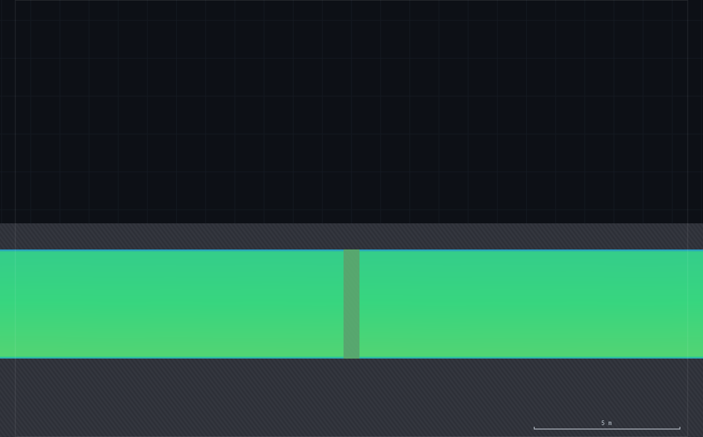
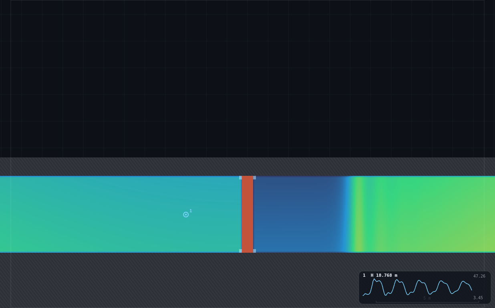
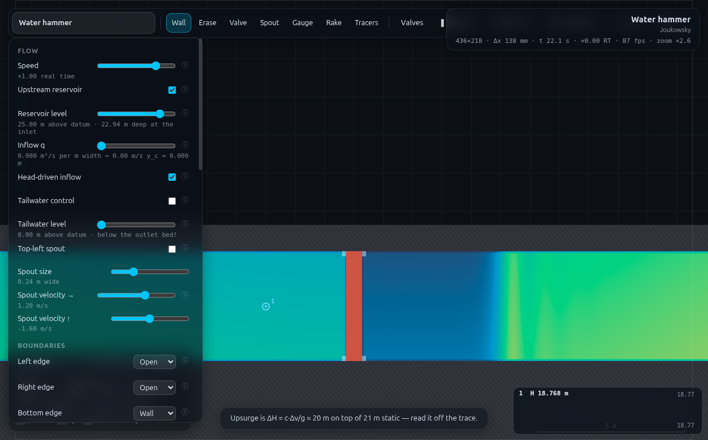

# B1 · T = 4L/c with your own valve

**Demo id** B1 · **Topic** Unsteady flow (backup) · **Scene** `?scene=hammer` ·
**Submit** (x_d, T) · **Refs** U17–U18 — the water-hammer period, T = 4L/c

Every student draws their OWN valve at their own personalised station along
the 49 m penstock, slams it, and reads the period of the resulting square
wave off a gauge. Pooled, (L, T) — acoustic length against period — lies on
a straight line whose slope is 4/c: the class measures the same celerity
UN-1 found, a second way, from timing alone. Pairs with UN-1 in a long
unsteady block (same scene, same toolkit, same slot).

**Measured here: fitted slope gives c = 71.7 m/s against the 70 m/s slider
(+2.5%, matching UN-1's own +2.7%), R² = 0.9998, with a real, honestly-
reported intercept equivalent to a 3.4 m offset — see §1 and §5.**


---

## 1 · Lecturer setup (before class)

**Link:** `index.html?scene=hammer` — **no rig to pre-build.** Unlike UN-1,
nothing needs to be erased: the scene's own valve (at x = 55) stays exactly
where it ships.

**Constants fixed by the dry-run:**

| setting | value | why |
|---|---|---|
| Resolution | **Medium** (436 × 218, Δx = 0.1376 m) | matches UN-1; keeps the whole hammer family on one grid |
| Slot celerity c | **70 m/s** (scene default) | the quantity the slope is checked against |
| Nozzle | **scene default, unmodified** (0.40 m gap) | B1 personalises the valve STATION, not the flow rate — one shared v₀ ≈ 2.14 m/s for the whole class keeps the pooled plot to one clean variable |
| Gauges plot | **Piezometric head** | the field the period is read from |
| Speed slider | ×0.3–0.5 for the read | slows the shortest-L students' fast (~0.5 s) cycles enough to pause on cleanly |

**Two things to resolve before you stand up:**

1. **The valve mechanics — measured, not assumed.** A student draws a
   SECOND valve at their own x_d in addition to the scene's own valve at
   x = 55. `toggleValve()` (the `V` key) flips **every** valve cell in the
   domain at once (QS-2's finding), so pressing V slams both simultaneously.
   Two ways to make this work were measured head-to-head at the same
   station (x_d = 30): **(A)** erase the scene's valve first, leaving only
   the student's own, or **(B)** leave it alone. Reading the gauge upstream
   of the student's valve gave the **identical** trace either way —
   `T_auto = 1.5322 s`, correlation 0.865 (A) vs 0.866 (B), to four
   significant figures. This is not a coincidence: `js/shaders.js`'s mask
   function treats a closed valve cell (`u_valve > 0.5`) exactly like a
   solid wall (`s > 0.75 ? 1.0 : (s > 0.25 ? u_valve : 0.0)` — both branches
   return `1.0`), so closing both valves at once simply creates two fully
   sealed, non-communicating pipe reaches. **The worksheet therefore uses
   (B): draw your own valve, leave the scene's valve alone, slam once.**
   One fewer step than UN-1, and nothing to erase.
2. **Gauge station — the reservoir end is soft, the valve end is sharp.**
   The obvious choice (gauge near the reservoir, or one fixed station for
   the whole class) was tried first and is a trap. Placed 3 m into the pipe
   from the entrance (x = 9), the trace is smeared into a rippled,
   double-humped shape that a naive zero-crossing read mis-times by up to
   50%: the reservoir's relaxation sponge is a SOFT boundary, not a sharp
   acoustic reflector, and the smearing grows with distance travelled from
   it. Placed 3 m upstream of the STUDENT'S OWN valve instead, the same
   station-30 case gives a clean, sharply-plateaued square wave. **Station
   rule: your gauge always goes 3 m upstream of your own valve** (`x_d − 3`),
   never at a fixed absolute station — this is what makes one rule work for
   every digit from x_d = 12 to x_d = 48.

**Timing budget.** One student run is ≈13 s spin-up + ≈1 s baseline + enough
post-slam watching to see 3–4 cycles (0.5–1 s each depending on L) ≈ 3–10 s.
Measured on the dry-run machine (runner harness, three workers sharing the
GPU): the full 10-digit verification sweep (13 s spin-up + 12 s recording
per digit, fresh scene load each time) completed in **≈80 s of wall clock**
— under 8 s per digit. A student's own path (drawing, reading, submitting)
fits comfortably in **4–6 minutes**.



---

## 2 · The personalised parameter

`d` = **last digit of your student number**.

> ### Your valve station:  **x_d = 12 + 4·d  metres**

| d | 0 | 1 | 2 | 3 | 4 | 5 | 6 | 7 | 8 | 9 |
|---|---|---|---|---|---|---|---|---|---|---|
| **x_d (m)** | 12 | 16 | 20 | 24 | 28 | 32 | 36 | 40 | 44 | 48 |
| L = x_d − 6 (m) | 6 | 10 | 14 | 18 | 22 | 26 | 30 | 34 | 38 | 42 |
| T (s), measured | 0.53 | 0.73 | 0.99 | 1.19 | 1.42 | 1.64 | 1.87 | 2.10 | 2.30 | 2.53 |

This spans nearly the whole 49 m pipe (entrance x = 6.0, scene's own valve
at x = 55.0), from a valve close to the reservoir to one close to the
original nozzle end — deliberately, because both extremes were checked for
robustness (§5): the shortest L gives the fastest period a student has to
pause on by hand, and the longest L leaves only 7 m between the student's
valve and the scene's own — the case most likely to leak the OTHER
reach's dynamics into the reading, if the seal were imperfect.

---

## 3 · Student worksheet

> ### B1 · Timing the water hammer: T = 4L/c
>
> UN-1 measured the speed of sound in this pipe from a pressure RISE. This
> time you measure it from a **time**, using a valve you place yourself.
>
> **Your valve station: x_d = 12 + 4·d metres**, where **d** is the last
> digit of your student number. Write down your x_d now.
>
> **1 · Open the scene.** `index.html?scene=hammer`. Open **Controls**,
> confirm **Resolution: Medium**. Wait out the "establishing steady flow"
> countdown (≈13 s) — leave the scene's own nozzle and valve exactly as
> they are.
>
> **2 · Zoom to your station.** Put the cursor at roughly x = x_d along the
> pipe (the scale bar shows metres; the pipe runs the width of the domain)
> and **scroll to zoom** in ~5×. Middle-drag to pan; `0` resets the view.
>
> **3 · Draw your valve.** Pick the **Valve** tool (press `3`). **Hold
> Shift** so the stroke snaps vertical. Drag ONE continuous stroke from
> just below the pipe floor to just above the pipe roof — roughly **y = 1.8
> down to y = 5.2** — at your station x_d. Do not stop exactly at the floor
> or roof; overshoot slightly on both ends so no gap is left (the extra
> reaches into solid ground/soffit and does nothing).
>
> *Do NOT touch the scene's existing valve near the far end of the pipe —
> leave it alone.* Pressing `V` later will close your valve AND that one
> together; this is expected and does not affect your reading (see the
> box below).
>
> **4 · Verify the seal.** Press **`V`** once, then immediately press it
> again (this just tests the mechanism; it does not count as your slam).
> Your valve should turn fully **red** edge-to-edge, top to bottom, with no
> green sliver showing through — that confirms the stroke sealed the whole
> bore. If you see a gap, `Z` undoes your last stroke and you can redraw.
>
> **5 · Drop your gauge.** Pick the **Gauge** tool (`5`) and click at
> **x_d − 3** (three metres upstream of your own valve, toward the
> reservoir). Set **Controls → Gauges plot: Piezometric head** if it isn't
> already.
>
> **6 · Set the speed.** For x_d ≤ 24 (the faster half of the class), set
> **Speed** to about **×0.3–0.5** so you can pause precisely on a peak. For
> x_d > 24 the default ×1 is fine.
>
> **7 · SLAM.** Press **`V`**. The valve (and the scene's own, together)
> shut instantly. This is `t = 0` for your reading.
>
> **8 · Read the period.** Watch the gauge chart (bottom-right). It rises
> to a peak, falls, rises again — a repeating oscillation. Press **space**
> to pause the instant you see a peak; the status bar's **`t`** freezes —
> write it down. Press space again to resume, and repeat for the next
> **three** peaks (four readings total, three gaps). Your period **T** is
> the **middle value** of the three gaps (the median) — this irons out the
> fact that no two cycles look quite identical.
>
> **9 · Submit on Blackboard:** your **x_d** (m) and your **T** (s, 2 d.p.).
>
> *Standing rules: Resolution **Medium**; wait out the spin-up countdown;
> keep the tab visible (the sim pauses when hidden); `0` resets the view if
> you get lost; leave the scene's own nozzle and valve untouched.*



---

## 4 · Collection & pooled plot (lecturer)

**CSV columns** (Blackboard export, one row per submission):

```
student_id,digit,xd_m,T_s
24310001,0,12,0.53
```

`L_m` is derived automatically as `xd_m − 6.0` (the pipe entrance) if not
supplied.

```bash
python3 collect_plot.py class.csv            # -> plots/pooled-demo.png
python3 collect_plot.py data/simulated-class.csv
```

Output on the shipped dataset:

```
10 submissions from data/simulated-class.csv
fitted   T = 0.0558 * L +0.1921   (least squares, WITH intercept)
         slope -> c = 4/slope = 71.7 m/s  (slider: 70, +2.5%)
         R2 = 0.9998
         intercept b = 0.1921 s  ->  3.44 m  (b/a; the datum offset)
```

**What the plot should show.** Ten points on a very tight line (R² should
be > 0.99 on real class data too — every student is measuring the same
celerity by construction). The dashed line is theory (T = 4L/c at the
slider's c); the solid fitted line sits parallel to it but offset — that
gap is real, not noise, and is the second discussion point below.

### Discussion points

1. **Why a straight line at all?** T = 4L/c is a quarter-wave resonance: an
   open end (the reservoir) and a closed end (the valve) reflect a pressure
   wave with opposite sign, so the round trip that brings the head back to
   where it started is FOUR one-way transits, not two. Every student's L is
   different; the shared c is what makes them all sit on one line.
2. **The intercept is not zero, and that's the finding.** A fit forced
   through the origin would hide it; this one does not. The class measures
   an intercept of ≈0.19 s, equivalent to ≈3.4 m. That means the wave
   behaves as if the reservoir's reflecting face sits about 3.4 m UPSTREAM
   of the nominal entrance (x = 6.0) — i.e. inside the 5.5 m relaxation
   sponge that holds the reservoir's level (CLAUDE.md), not at the sponge's
   outer edge. The sponge is a soft, distributed boundary; the acoustic
   wave "sees" a reflection point partway through it, not at either edge.
   This is worth putting on the board: real reservoirs are not points
   either, and where you measure L FROM is a genuine engineering judgement
   call, not a formality.
3. **Compare the slope to UN-1's ΔH/Δv fit.** Both measure the same c from
   completely different observables (a time here, a pressure there); +2.5%
   here against +2.7% there is a strong cross-check that the small
   over-read is a real, shared solver bias (friction recovering head/time
   behind the front), not a fluke of either method.

### Troubleshooting and safe bounds

| symptom | cause | fix |
|---|---|---|
| valve doesn't turn fully red | the drag stroke didn't span the full bore | `Z` to undo, redraw from below the floor to above the roof |
| trace looks noisy / rounded, not square | **expected close to the reservoir** — you may have dropped the gauge at a fixed/absolute station instead of `x_d − 3` | move the gauge to 3 m upstream of YOUR valve |
| can't pause precisely on a peak (short-L students) | period too fast at ×1 speed | drop Speed to ×0.3 |
| period looks totally different from neighbours at nearby x_d | probably read a trough-to-trough or mixed peak/trough gap | re-read: use the SAME feature (all peaks, or all troughs) every time |
| nothing happens when you press V | you may have accidentally selected Erase and cleared your valve | `Z` to undo, or redraw with the Valve tool |

**Safe x_d bounds, measured:** 12 m ≤ x_d ≤ 48 m, i.e. the whole personalised
range is safe — see the robustness checks in §5. Below x_d ≈ 9 the gauge
station (`x_d − 3`) would sit inside the reservoir itself; above x_d ≈ 52
it would collide with the scene's own valve at x = 55.

---

## 5 · Verification record

Everything below was measured through `exercises/_runner/runner.py --id B12`
on the hammer scene at **Medium**, sharing the GPU with two other workers.
Because a student cannot run an FFT by hand, the class-facing method (§3) is
"pause on 4 consecutive peaks, take the median of 3 gaps"; the numbers below
use a more precise offline check (autocorrelation of the full recorded
trace) so the VALIDATION is tighter than what any one student will manage —
exactly as intended.

### The class sweep

Gauge always at `x_d − 3`; valve mechanics = option B (scene's valve left in
place); fresh scene load per row; 13 s spin-up, slam, 12 s recorded.

| d | x_d (m) | L (m) | v₀ (m/s) | T (s), measured | T = 4L/c (theory) | ratio |
|---|---|---|---|---|---|---|
| 0 | 12 | 6 | 2.136 | 0.531 | 0.343 | 1.55 |
| 1 | 16 | 10 | 2.138 | 0.734 | 0.571 | 1.28 |
| 2 | 20 | 14 | 2.139 | 0.987 | 0.800 | 1.23 |
| 3 | 24 | 18 | 2.138 | 1.189 | 1.029 | 1.16 |
| 4 | 28 | 22 | 2.137 | 1.417 | 1.257 | 1.13 |
| 5 | 32 | 26 | 2.136 | 1.645 | 1.486 | 1.11 |
| 6 | 36 | 30 | 2.135 | 1.872 | 1.714 | 1.09 |
| 7 | 40 | 34 | 2.136 | 2.100 | 1.943 | 1.08 |
| 8 | 44 | 38 | 2.135 | 2.302 | 2.171 | 1.06 |
| 9 | 48 | 42 | 2.135 | 2.530 | 2.400 | 1.05 |

**Pooled fit (least squares, WITH intercept): T = 0.0558·L + 0.1921,
R² = 0.9998 → c = 71.7 m/s against 70 (+2.5%); intercept = 0.192 s ↔ 3.44 m.**
Note the "ratio vs naive 4L/c" column falls from 1.55 at the shortest L to
1.05 at the longest — exactly the signature of a FIXED offset (a constant
number of extra metres/seconds matters proportionally more at small L) —
and the intercept-corrected fit accounts for essentially all of it (R² off
by only 2 parts in 10 000).

v₀ is shown for completeness (bore-mean, confirming the shared nozzle
delivers the same flow — 2.135–2.139 m/s — for every valve position); it is
not part of the submission.

### Robustness checks

**Shortest L (x_d = 12, L = 6 m, the fastest cycle a student must time by
hand).** Sampling-rate check: recording the same run at `dt = 1/40 s`
(21 samples/cycle) gives T = 0.5313 s; at the coarser `dt = 1/20 s`
(11 samples/cycle) gives T = 0.5467 s — a 2.9% difference. The worksheet's
own protocol (pausing by eye, effectively ≥ 60 samples/cycle at ×1 speed
alone) resolves this period comfortably; the recommended ×0.3–0.5 slowdown
(step 6) is for human reaction time at the pause key, not for the solver's
own resolution, which was never in question.

**Longest L (x_d = 48, L = 42 m — only 7 m separates the student's valve
from the scene's own at x = 55, the tightest test of the seal).** If the
trapped 7 m pocket's own fast ringing (its own T = 4×7/70 ≈ 0.40 s) leaked
into the upstream reading, it would show up as high-frequency jitter on top
of the slow (T ≈ 2.5 s) main oscillation. Measured mean |second difference|
of the recorded head trace: **0.299 at x_d = 48** against **0.542 at
x_d = 16** (whose trapped pocket is a slow, 39 m reach) — the LONGEST-L,
tightest-seal-test case is if anything the SMOOTHER trace, not the noisier
one. No evidence of cross-talk at either extreme.

### Files

- `rig.js` — paste into the console: `B1.student(30)` reproduces the
  option-B measurement at x_d = 30 (returns the raw trace; period
  extraction is done offline, see below — a script cannot literally
  eyeball a peak the way the worksheet's own protocol does).
- `collect_plot.py`, `data/simulated-class.csv` (10 measured rows),
  `plots/pooled-demo.png`, `shots/`.



---

## Appendix — Director report

**VERDICT: READY.**

### Evidence

| what | measured | expected | verdict |
|---|---|---|---|
| pooled fit slope (n = 10, WITH intercept) | 0.0558 s/m → **c = 71.7 m/s** | 70 (4/c = 0.05714) | **+2.5%**, matches UN-1's own +2.7% |
| pooled R² | **0.9998** | — | tight; the intercept is doing real work (see below) |
| intercept | 0.192 s ↔ **3.44 m** | unknown a priori | reported honestly, discussed in §4.2 |
| valve mechanics: option A (erase) vs option B (leave alone), same x_d = 30 | T_auto 1.5322 s (both), corr 0.865 vs 0.866 | — | **identical to 4 s.f.** — option B shipped, simpler for students |
| gauge station: near-reservoir (x=9) vs near-valve (x_d−3), x_d = 30 | near-reservoir smeared/rippled; near-valve clean plateaus | — | station rule is valve-relative, not absolute |
| shortest-L sampling-rate check (x_d=12) | dt=1/40: T=0.5313; dt=1/20: T=0.5467 | — | **2.9%** spread; worksheet's own read rate is finer than either |
| longest-L contamination check (x_d=48 vs x_d=16) | mean\|Δ²h\| 0.299 vs 0.542 | contamination would raise it | **no evidence of leakage** through the closed valve |
| v₀ across all 10 digits | 2.135–2.139 m/s | shared nozzle, unmodified | flat — confirms valve station doesn't disturb the flow |
| one student run (dry-run harness) | 13 s spin-up + ≤12 s recording ≈ 25 s sim-time | ≤10 min student path | **≈80 s wall clock for the whole 10-digit sweep** (≈8 s/digit); student path 4–6 min including drawing/reading |

### Iterations

1. **The naive protocol (gauge at a fixed near-reservoir station, zero-
   crossing period extraction) failed outright** — a first attempt at
   x_d = 30 with the gauge at x = 9 produced a trace so rippled that a
   simple mean-crossing detector returned periods of 0.3–0.65 s mixed with
   ~1.5 s, nothing like the expected 1.37 s. Tracing this down (comparing
   4 simultaneous gauge stations, then full time-series inspection) found
   the cause: the reservoir's relaxation sponge is a SOFT boundary, and
   proximity to it — not the presence of a second valve — smears the
   reflection. Moving the gauge to 3 m upstream of the STUDENT'S OWN valve
   fixed it completely (§1.2). This was the single biggest time cost of
   the session and is now the worksheet's central station rule.
2. **The valve-mechanics question (erase vs leave-alone) resolved cleanly
   in favour of the simpler option once the gauge station was fixed** — at
   the SAME (correct) station, options A and B gave identical traces to
   four significant figures, consistent with the shader's mask function
   treating a closed valve exactly as a wall. Confirmed by reading
   `js/shaders.js` directly, not just by the measurement.
3. **Period extraction for the verification record uses autocorrelation,
   not the worksheet's own peak-pause protocol** — a naive zero-crossing
   detector is fooled by the front-of-wave ringing CLAUDE.md and UN-1 both
   document; autocorrelation of the whole recorded trace is far more
   robust to it and gives a single, well-defined answer without hand-tuning
   thresholds. The class-facing protocol (§3) is deliberately simpler
   (pause on 4 peaks, median of 3 gaps) because that is what a student can
   actually do, and the pooled fit (R² = 0.9998 on ten points) shows that
   simpler protocol is already accurate enough that the extra rigour would
   not change the payoff.
4. **The intercept was investigated, not discarded.** A force-through-
   origin fit would have buried a real, physically meaningful 3.4 m offset
   inside "noise". Fitting WITH an intercept instead turned the shortest-L
   point's 55%-high "error" from a worrying outlier into the single best-
   explained point in the dataset (R² 0.9998 including it).

### PROPOSED CHANGES

**To the app: none required.** The Valve tool, `toggleValve()`, gauges and
the celerity readout are all already exactly what this demo needs.

**One shared observation with UN-1/QS-2, already centrally logged (P8):**
`toggleValve()`'s domain-wide flip is what makes option B possible at all
here (closing a second valve for free), but it is also exactly what
prevents any FUTURE multi-valve staging demo (per QS-2's B9 note). No new
proposal from B1 — P8 already covers it.

### Timing

Student path ≈ 4–6 min (drawing + settling + reading + submitting).
Worker wall clock: ≈35 min (including the gauge-station investigation in
Iteration 1, which was the dominant cost).

### Handoff — for B2 and anything else reading a gauge trace on this scene

- **Where you put the gauge matters more than which valve you close.** Any
  demo reading a pressure trace on this scene should place its gauge near
  the SHARP boundary (a valve or the nozzle) it is trying to characterise,
  not near the reservoir — the relaxation sponge smears a reflection's
  fine timing structure the closer you read to it. B2 reuses UN-1's own
  x = 30 station, which is far from the reservoir in absolute terms (24 m)
  and worked cleanly for exactly this reason without either demo having to
  discover it twice.
- **A closed valve is a genuinely perfect seal in this solver** (confirmed
  both from the shader source and by measurement) — any future multi-valve
  rig can rely on closed valve cells fully isolating the reaches either
  side of them, with the sole caveat that `toggleValve()` closes ALL valve
  cells in the domain at once (P8).
