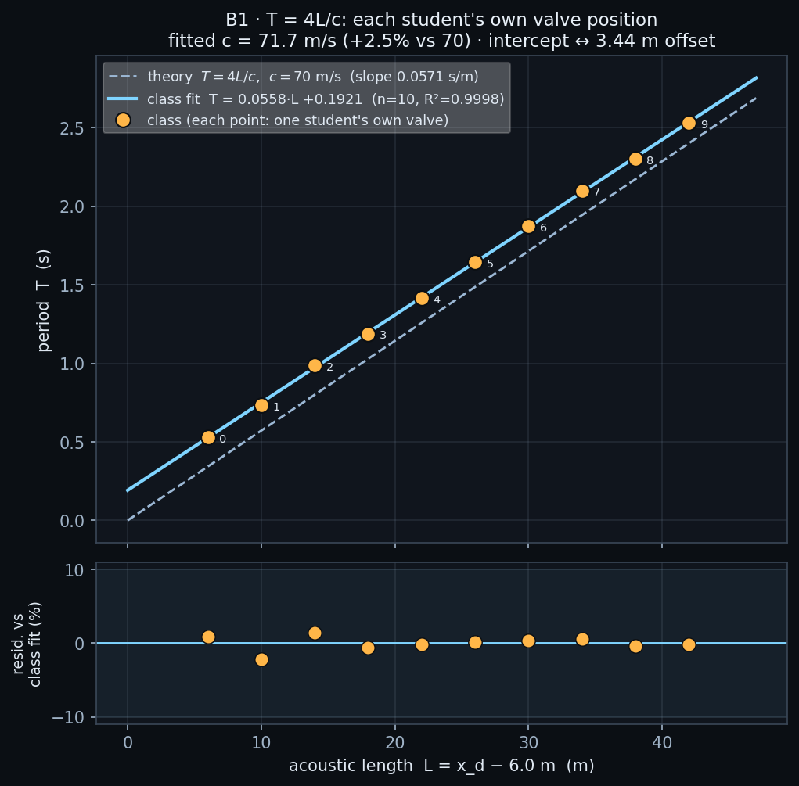

# B1 · T = 4L/c with your own valve

Every student draws their OWN valve at their own station along the 49 m
penstock, slams it, and reads the period of the resulting square wave off a
gauge. Pooled, (L, T) — acoustic length against period — lies on a straight
line whose slope is 4/c: the class measures the pipe's celerity a second
way, from timing alone, with no pressure reading at all.

**Open it:** press **E** in the [app](https://barneydobson.github.io/hydraulician/)
and pick **B1**, or use the direct link
[`?ex=B1`](https://barneydobson.github.io/hydraulician/?ex=B1).
How to run any exercise: see the [teaching pack index](../INDEX.md#running-an-exercise).

## Theory

Shut a valve on a moving column of water and the pressure wave runs back to
the reservoir, reflects, returns, reflects again. The reservoir is an OPEN
end and the valve a CLOSED one, so the two reflections carry opposite signs
and the head does not come back to where it started until **four** one-way
transits have gone by:

    T = 4L/c

L is the acoustic length — from the pipe entrance at **x = 6.0 m** to your
own valve. Everybody runs the shipped nozzle and the shipped celerity
(c = 70 m/s on the slider), so L is the only thing that changes across the
class, and the slope of the pooled line is 4/c.

## Your valve station

**d** is the **last digit of your student number** — your lecturer will
explain the assignment in class.

> **x_d = 12 + 4·d metres.**  Then **L = x_d − 6** and your gauge goes at
> **x_d − 3**.

| d | 0 | 1 | 2 | 3 | 4 | 5 | 6 | 7 | 8 | 9 |
|---|---|---|---|---|---|---|---|---|---|---|
| **x_d (m)** | 12 | 16 | 20 | 24 | 28 | 32 | 36 | 40 | 44 | 48 |
| L (m) | 6 | 10 | 14 | 18 | 22 | 26 | 30 | 34 | 38 | 42 |
| gauge at (m) | 9 | 13 | 17 | 21 | 25 | 29 | 33 | 37 | 41 | 45 |

## What to do

1. Draw your valve at **x_d** — Valve (`3`), Shift-drag one stroke from
   below the pipe floor to above its roof (about z = 1.8 up to 5.2), then
   press `V` twice: it must go fully red, no green sliver. Leave the
   scene's own valve near the far end alone — `V` slams both, which is
   fine, they seal two separate reaches.
2. Drop a Gauge (`5`) at **x_d − 3, z ≈ 3.5 m** — three metres upstream of
   your own valve. Read nearer the reservoir and its soft boundary smears
   the trace into something you cannot time.
3. Press `R` and let it reach steady state — about **13 s**; the card
   counts it down.
4. Press `V` to slam, then pause (space) on four consecutive peaks of the
   head trace, reading the status-bar `t` each time. **T** is the median of
   the three gaps. Submit **x_d, T**.

## For the instructor — pooling the class

Collect one row per student (`student_id,digit,xd_m,T_s`), export the CSV
and run:

```bash
python3 collect_plot.py class.csv                # -> plots/pooled-demo.png
python3 collect_plot.py data/simulated-class.csv # the shipped dry-run class
```

The script derives L = x_d − 6.0, fits T = a·L + b by least squares against
the theory line, and reports the celerity as c = 4/a with the intercept
re-expressed as a distance, b/a metres.



### Discussion points

- **The intercept is not zero, and that is the finding.** The fit is left
  free rather than forced through the origin, and the class measures an
  offset of about 3 m: the wave behaves as if the reservoir's reflecting
  face sits that far UPSTREAM of the nominal entrance at x = 6.0 — inside
  the relaxation zone that holds the reservoir level, not at its edge. Real
  reservoirs are not points either, and where you measure L from is an
  engineering judgement, not a formality.
- **Show them the soft end.** Move a gauge to x = 9 m — three metres inside
  the entrance instead of upstream of a valve — and slam again: the same
  event arrives rippled and double-humped, with no plateau to pause on. A
  sharp reflector gives you a square wave; a reservoir does not.

The full verification record — the erase-versus-leave-alone valve test, the
gauge-station investigation, the ten-digit measured sweep, robustness at
both ends of the range and troubleshooting — is kept locally, out of version control, at `exercises/B1-period-4Lc/_archive/README-full.md`.
