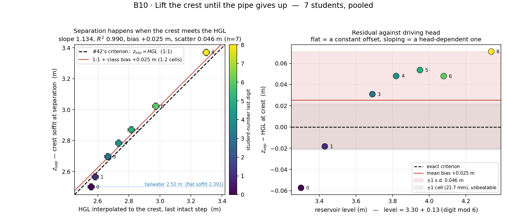

# B10 · Lift the crest until the pipe gives up

A horizontal pressurised pipe is fed from a reservoir. Take a stretch of it in
the middle and carry it over a hill — invert and soffit lifted together, bore
unchanged. Keep going and at one particular height the pipe stops being a
pipe: an air pocket opens under the crown, the crest gauge flattens onto the
soffit, and the discharge stalls. That height is not a property of the pipe
or of the pump — it is the elevation of the **hydraulic grade line** at the
crest, which the class has already measured with two gauges either side.

**Open it:** press **E** in the [app](https://barneydobson.github.io/hydraulician/)
and pick **B10**, or use the direct link
[`?ex=B10`](https://barneydobson.github.io/hydraulician/?ex=B10).
How to run any exercise: see the [teaching pack index](../INDEX.md#running-an-exercise).

## Theory

Inside a full pressurised section the vertical momentum equation reduces to
`∂p/∂z = −ρg`, so the piezometric head is the same at every point of the
section and the pressure is *lowest at its highest point* — the soffit.
Separation begins where that pressure first reaches zero:

    h = z + p/ρg   constant across the section
    p = 0 at the crown   ⇒   h_crest = z_soffit      ← the criterion

Two datums matter and both are bigger than the effect being measured. Compare
against the **soffit**, not the axis (half a bore, 0.196 m). Compare against
the **HGL**, not the energy line (`V²/2g` is roughly 0.3–0.9 m here).

The crest sits at x = 5.60 m, which is 44.2 % of the way from gauge A
(x = 3.70 m) to gauge B (x = 8.00 m), both on the pipe axis at z = 2.20 m:

    HGL at the crest = h₁ + 0.442 · (h₂ − h₁)

The tailwater stays at 2.50 m for everybody, and one cell is **0.0217 m** at
Medium — the quantisation of every elevation in this exercise.

**The 10 m this model does not have.** Its pressure floor is zero and zero is
*gauge* zero: no atmosphere, no vapour pressure, so the criterion appears in
its pure geometric form. Real water carries about 10 m of atmosphere on top of
it, and prudent practice spends only 7 of those 10.

## Your reservoir level

**d** is the **last digit of your student number** — your lecturer will
explain the assignment in class. Look up **d mod 6**:

| d mod 6 | 0 | 1 | 2 | 3 | 4 | 5 |
|---|---|---|---|---|---|---|
| **level (m)** | 3.30 | 3.43 | 3.56 | 3.69 | 3.82 | 3.95 |

## What to do

The pipe arrives flat and you lift the crest yourself. The hump is a 35-stroke
staircase per height, so it is redrawn from the console: paste [`rig.js`](rig.js)
into the browser console once, then run `B10.baseSegCount = APP.sim.segs.length`
so that every later `B10.crest(z)` — which puts the crest soffit at `z` —
undoes back to the flat pipe instead of stacking a second hump on the first.
`B10.record(4).pCrest` reads the crown pressure head.

1. Set **Reservoir level** to your value, press `R` and let it reach steady
   state — about **12 s**; the card counts it down.
2. Drop two gauges (Gauge, `5`) on the pipe axis — A at (3.70, 2.20), B at
   (8.00, 2.20) — read `h₁` and `h₂` off their cards, and interpolate the HGL
   at the crest, `h₁ + 0.442·(h₂ − h₁)`. That number is your prediction of
   where the pipe will give up.
3. Jump the crest to 0.09 m *below* your prediction, then climb: 3-cell
   (0.065 m) steps while the crown pressure head is above 0.06 m, 1-cell
   (0.0217 m) steps after that, settling **12 s** at every step. The 12 s is
   measured — read sooner and you stop on a transient.
4. Stop at the first height where the crown pressure head is below **0.02 m**:
   that is **z_sep**, and **Field → Water** shows the pocket under the crown
   confirming it. Re-read both gauges at the **last full step**, one cell
   lower, for **hgl_crest** — take the reading going up, never coming down.
5. Submit **level, z_sep, hgl_crest**.

## For the instructor — pooling the class

Collect one row per student (`student,digit,level,z_sep,hgl_crest`), export
the CSV and run:

```bash
python3 collect_plot.py class.csv                # -> plots/pooled-demo.png
python3 collect_plot.py data/simulated-class.csv # the shipped dry-run class
```

The script plots `z_sep` against each student's measured HGL at the crest
with the dashed 1:1 line that *is* the criterion, fits the slope, and puts
the residual against driving head in the right-hand panel so the class can
see whether the offset is a constant or a trend.



### Discussion points

- **Where the interpolation cheats.** The hump's loss is concentrated at the
  crest, so a straight line drawn between two distant gauges under-reads the
  local head there: measured at one student's last full step, the crown's own
  head was 2.815 m against 2.742 m interpolated — most of the class's positive
  offset. Ask how they would measure it instead: a tap at the crown, which is
  exactly what a real siphon has.
- **Lower someone's separated crest one cell, live.** The crest un-separates at
  once — the criterion is a threshold, not a trap — but the air pocket lingers,
  still there eight cells below onset: re-priming a siphon is a procedure.

The full verification record — the ramp geometry that keeps the hump from
throttling the pipe, the seven-student sweep, the onset-trigger evidence,
hysteresis, safe bounds and troubleshooting — is kept locally, out of version control, at
`exercises/B10-crest-vs-hgl/_archive/README-full.md`.
