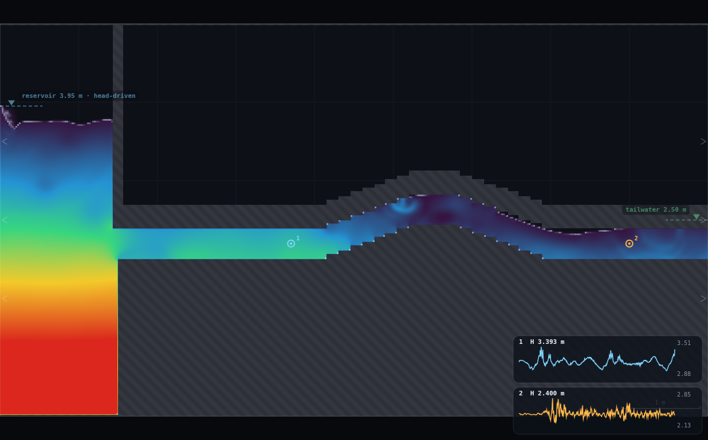
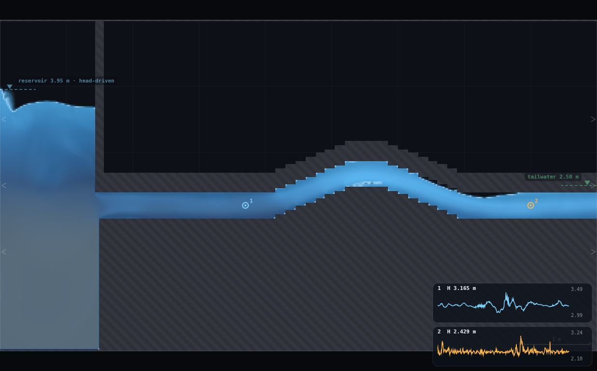
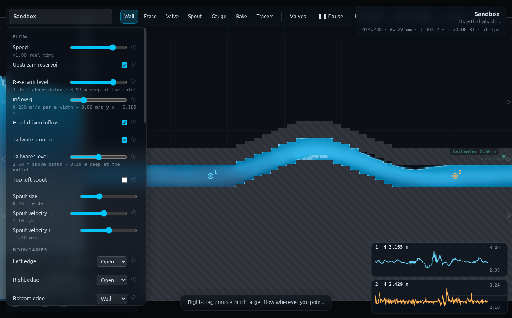

# B10 · Lift the crest until the pipe gives up — full record (archived)

*This is the original long-form brief: the dry-run measurements, the
verification record, the director report and every constant behind the rig.
It is kept for maintainers and future reruns — the student- and
instructor-facing document is now [`../README.md`](../README.md).*

**Demo id** B10 · **Refs** #42–43 · **Rig** RIG-A (FR-1's duct) + a raised
mid-length crest · **Submit-capable** yes (2 numbers)

## How to start (30 seconds)

1. Open the app — **`http://localhost:8124/`** on the lecturer's server, or
   double-click `index.html`.
2. Press **`E`** (or click **`Exercises ▾`** in the top bar) and pick **B10**.
3. Type the last digit of your student number into the card. It prints **your
   reservoir level** (d mod 6) — set it on **Reservoir level** yourself.
4. Let it settle after every change you make — the card gives this demo's
   settle time (12 s of sim time) and counts it down.
5. Do the task printed on the card, then submit **level**, **z_sep** and
   **hgl_crest**.

If your lecturer gives you a link: **`?ex=B10`** (e.g.
`http://localhost:8124/?ex=B10`).

The picker gives everyone the same starting point and no more: the scene,
**Resolution: Medium**, the rig geometry, and the few settings without which
the rig is not a working rig — the card labels those as already set. Your own
values, your instruments and the order you do things in are yours to get
right. If your build ships without the rig pack the card says so; then draw it
by hand from *Manual setup* below.

---

A horizontal pressurised pipe is fed from a reservoir. Take a stretch of it in
the middle and carry it over a hill — invert and soffit lifted together, bore
unchanged, a pipe going over a rise. Nothing happens. Lift it again. Nothing
happens. Keep going and at one particular height the pipe stops being a pipe:
an air pocket opens under the crown, the delivered discharge stalls, and the
crest gauge flattens onto the soffit. The height at which that happens is not
a property of the pipe or of the pump — it is the elevation of the **hydraulic
grade line** at the crest, which the students have already measured with two
gauges either side. Because this solver's zero of pressure is gauge zero, the
criterion appears in its purest form: **the pipe gives up the moment the soffit
touches the HGL.** Real water buys you about another 10 m of crest, and the
whole reason why (atmospheric pressure, down to vapour pressure) becomes the
memorable part of the slide instead of a footnote.

---

## 1 · Manual setup (fallback, or for building it yourself)

*The picker puts you at the same starting point as everyone else — scene,
Resolution Medium and the rig. This section is the record of every constant
behind that, and the build to follow if you are demonstrating it by hand or
the rig pack is missing.*

**Link.** `http://localhost:8124/?scene=sandbox` (or the deployed equivalent).
The sandbox is the only scene with an empty box to build RIG-A in.

**Rig.** The picker draws it. To build it yourself instead, paste `rig.js`
into the dev console, then

```js
B10.build({level: 3.95})   // RIG-A + panel, no crest yet
B10.crest(2.65)            // crest SOFFIT at z = 2.65 m
B10.check()                // bore band at 9 stations across the hump
```

`B10.check().sealed === true` is the go/no-go: it walks the bore at nine
stations across the whole hump and every one must be open and within one cell
of the flat-reach 18 cells.

**Geometry — fixed by the dry-run, do not improvise:**

| constant | value | why this value |
|---|---|---|
| pipe (RIG-A) | invert top 2.00 m, soffit 2.40 m, bore 18 cells = **0.3913 m** | FR-1's card, reproduced exactly |
| reservoir wall / mouth | x = 1.50 m | RIG-A |
| tailwater | **2.50 m**, always ON | RIG-A: must be inside the bore band (2.40, 2.69) or the pipe either de-pressurises or dead-ends |
| eddy viscosity `cs` | 0.40 | RIG-A (the resistance lever; `cf` does nothing in an 18-cell bore) |
| crest centre `XC` | **5.60 m** | mid-length, and the hump toes (4.15 / 7.05) leave both gauges inside FR-1's straight zone x ∈ [3.5, 8.6] |
| crest top width | 0.50 m | flat, so "the crest elevation" is unambiguous |
| ramp length each side | **1.20 m** | see below — this one is load-bearing |
| ramp steps each side | **8** | see below |
| gauges | **x = 3.70** and **x = 8.00**, both at y = 2.20 (pipe axis) | straight zone, clear of the entry development (x < 3.5), the hump toes and the tailwater sponge (x > 8.75) |
| resolution | Medium (414 × 230, Δx = 21.7 mm) | 1 cell = 21.7 mm is the quantisation of every elevation in this demo |

**Why the ramps are long and finely stepped.** The hump is drawn as a
staircase of horizontal strokes (the one join geometry that seals without
capping). A *short, sharp* hump is easy to draw and ruins the demo, because it
throttles the pipe: measured q loss on raising the crest by 0.20 m —

| ramp length / steps | q loss | verdict |
|---|---|---|
| 0.45 m / 3 | **−24.2 %** | the hump, not the crest height, now sets the flow |
| 1.20 m / 3 | −13.3 % | still a throttle |
| 1.20 m / 4 | −6.9 % | borderline |
| **1.20 m / 8** | **−3.6 %** | adopted — HGL essentially unmoved (H₁ 2.783 vs 2.788 flat, H₂ 2.520 vs 2.543) |
| 1.20 m / 16 | −3.0 % | no real gain, twice the strokes |

The demo's whole claim is that lifting the pipe costs *nothing* until the crest
meets the HGL. That is only true if the corner loss is small, so the ramp
geometry is part of the physics, not decoration.

**Timing budget** (laptop holding ≈1× real time):

| stage | sim time | wall |
|---|---|---|
| paste rig.js, read the sheet | — | ~1.5 min |
| set your level, flat pipe, spin-up | 18 s | ~20 s |
| read the two gauges → predict z_sep | — | ~1 min |
| coarse jump to 4 cells below the prediction | 7 s | ~10 s |
| 1-cell climb to onset (typically 5–9 steps × 10 s) | 50–90 s | ~1.5 min |
| confirm, screenshot, jot the two numbers | 10 s | ~1 min |
| **total** | **≈2 min sim** | **≈6 min** |

---

## 2 · Student worksheet (copy-paste to Blackboard)

### The question

A pipeline has to cross a ridge. How high can the ridge be before the pipeline
stops delivering? Your answer, in one number, and then the theory that predicts
it, in a second number.

### Your personal setting

Take **d = the last digit of your student number**. Your reservoir level is

```
level = 3.30 + 0.13 · (d mod 6)        (metres above the domain floor)
```

so d = 0 or 6 → 3.30 m, d = 4 → 3.82 m, d = 5 → 3.95 m. Everything else on
the panel is the same for everybody. (`mod 6` is not decoration: above 3.95 m
the ladder takes two to three times as many steps and the hump itself starts
eating the discharge — measured in §6.6.)

### Steps

1. Press `E` and pick **B10** (or open `?ex=B10`) — it loads the sandbox at
   **Resolution: Medium** and draws the rig. (Fallback, if the rig pack is
   missing: paste `rig.js` into the dev console — the lecturer will show this
   once.)
2. `B10.build({level: <your level>})`. Check the printout says
   `sealed: true`, `boreCells: 18`, `tw: 2.5`.
3. **Flat pipe first.** `B10.crest(2.40)` (no hump). Let it settle ~20 s of
   sim time and watch the two gauge charts flatten. Field: **Head**.
4. **Read your HGL.** Gauge A (x = 3.70) reads H₁, gauge B (x = 8.00) reads
   H₂ — both are *piezometric* heads (elevation + pressure head; the Gauge
   tool adds its own height back, the hover readout does not). The crest is
   44 % of the way from A to B, so
   ```
   HGL at the crest  =  H1 + 0.442 · (H2 − H1)
   ```
   **Write that number down.** It is your prediction of the crest height at
   which the pipe will give up.
5. **Coarse phase.** Jump the crest to about 0.09 m *below* your prediction:
   `B10.crest(<prediction> − 0.09)`. Settle 12 s. The pipe should still be
   completely full and q barely changed — **lifting the pipe cost you
   nothing**, and that is the first thing to notice. Now go up in **3-cell
   (0.065 m) steps**, settling 12 s each time, reading the crown pressure head
   after each: `B10.record(4).pCrest`.
6. **Fine phase.** As soon as the crown pressure drops below **0.06 m**, switch
   to **one-cell (0.0217 m) steps** — same 12 s settle, same reading. (12 s is
   measured, not a guess: read sooner and you catch a transient and stop
   early.) The crown pressure should fall steadily towards zero.
7. **Onset.** Stop at the first height where **the crown pressure head drops
   below 0.02 m** — one cell of water, i.e. as close to zero as this grid can
   resolve. Cross-check with your eyes: switch the field to **Water** and you
   will see an air pocket under the soffit reaching the crest, and the crest
   gauge trace sitting *on* the soffit line. That height is **z_sep**, the
   crest soffit elevation at separation. `B10.check().zcMeas` prints it
   (the *rasterised* soffit, which is the one the water feels).
8. **Re-read your HGL at the LAST FULL step** — one cell below z_sep — and use
   *that* as `hgl_crest`. This matters: the gauges move as the crest rises, and
   the HGL you have to compare against is the one the pipe still had while it
   was full. (Using the flat-pipe value from step 4 instead puts the whole class
   on a line of slope 2.7 rather than 1.)
9. If you overshoot, just lower the crest again — nothing is stuck. But take
   your reading **going up**; coming back down measures something else (the air
   pocket lingers), and the two do not agree.
10. Submit the two numbers below.

The whole ladder, done for you in one call:
`B10.climb(<your digit>, {coarse: 3})` → `{zSep, HcLast, rows}`. Do it by hand
first, at least as far as the coarse phase, or the point is lost.

### Submit on Blackboard

| field | what | example |
|---|---|---|
| `digit` | last digit of your student number | 4 |
| `level` | the reservoir level you set (m) | 3.820 |
| `z_sep` | crest soffit elevation at separation (m) | 2.8043 |
| `hgl_crest` | your step-4 HGL at the crest, re-read at the **last full** step (m) | 2.7416 |

### Think about it before the reveal

- Why the **soffit** and not the pipe axis? The two are 0.196 m apart, which
  is bigger than the whole spread of the class's answers.
- Your pipe was still delivering water at the moment it separated. What
  actually stopped rising?
- A real siphon over a real ridge: how much higher could the ridge be?

### Standing rules

Resolution **Medium** (the picker sets this) for everyone. Wait out the spin-up. **Keep the tab
visible** — the sim pauses when it is hidden. Tailwater stays at 2.50 m; it
must lie inside the bore band (2.40, 2.69) or the pipe stops behaving like a
pipe. If you change the reservoir level, re-settle before reading anything.

---

## 3 · The datum argument — why the SOFFIT

Work this through on the board; it is the part students get wrong.

Inside a full pressurised section the vertical momentum equation reduces to
`∂p/∂z = −ρg` (the vertical accelerations are small compared with g), so the
pressure across one cross-section is hydrostatic and the **piezometric head
`h = z + p/ρg` is the same for every point in that section**. The pressure is
therefore *lowest at the highest point of the section* — the soffit, or crown.

Separation begins where the pressure first reaches the floor of the equation of
state, i.e. `p = 0`. Setting `p = 0` at the crown:

```
h_crest  =  z_soffit          ←  the criterion, and it is purely geometric
```

Three consequences worth spelling out:

- **Quoting the wrong datum is a huge error, not a rounding one.** Using the
  axis puts the criterion half a bore (0.196 m) low; using the invert, a whole
  bore (0.391 m) low. The class's entire spread of `z_sep` is 0.22 m — smaller
  than either mistake.
- **The HGL, not the energy line.** `h` is piezometric. The energy grade line
  sits `V²/2g` above it, and at these numbers V ≈ 2.4–4.1 m/s so `V²/2g` is
  0.29–0.86 m — again bigger than the whole experiment. A student who compares
  the crest with the EGL will be wrong by more than the effect being measured.
- **No local velocity-head correction is needed *here*, and that is a
  deliberate design choice.** The bore is held constant over the hump, so V
  does not change at the crest and the piezometric head has no local venturi
  dip. Had the crest also been a contraction, the local head would dip by
  `Δ(V²/2g)` and separation would arrive *earlier* than the interpolated HGL
  predicts. That is exactly why real siphon crests are made generous in area:
  the criterion is about pressure, and pressure is what velocity steals.

## 4 · The 10 m the model does not have (ref #43)

This solver's equation of state is `p/ρ = c²·max(f − 1, 0)`: pressure has a
hard floor at zero and **zero is gauge zero**. There is no atmosphere pressing
on the water and no vapour pressure to reach — the "air" above a free surface
is a vacuum with no properties. So the crest separates the instant its soffit
touches the HGL, and the criterion is visible in its pure geometric form.

Real water is different, and the difference is a single rigid offset:

```
p_abs = p_atm + p_gauge        p_atm ≈ 101.3 kPa ≈ 10.3 m of water
separation (vaporisation) at p_abs = p_vap ≈ 2.3 kPa ≈ 0.24 m at 20 °C
⇒ the lowest sustainable GAUGE pressure ≈ −(10.3 − 0.24) ≈ −10.1 m
```

So a real crest can stand roughly **10 m above the HGL** before the water
column breaks. Practising engineers do not use the 10 m: siphons and pump
suction lines are limited to about 7 m of crest above the HGL, and the margin
goes on velocity head at the crown, dissolved air coming out of solution well
before vapour pressure is reached, the surge from any valve movement, and
altitude (p_atm falls ~1.2 m per 1000 m of elevation).

The slide, in one line: **the model shows you the criterion; real water shows
you the same criterion with 10 m of atmosphere added, and prudent practice
spends only 7 of those 10.**

---

## 5 · Collection & pooled plot (lecturer)

Expected CSV (Blackboard download; extra columns are ignored):

```
student,digit,level,z_sep,hgl_crest
S001,0,3.300,2.6087,2.5642
...
```

```bash
python3 collect_plot.py class.csv -o plots/pooled-demo.png
```

**What the plot shows.** Left panel: `z_sep` against the measured HGL at the
crest, one point per student, with ±1 cell error bars on both axes and the
dashed 1:1 line that *is* #42's criterion. The class's own points should lie
along it, with a small positive offset (see §6 for the measured value and
where it comes from). Right panel: the residual `z_sep − HGL` against the
driving head, so the class can see whether the offset is a constant (a datum /
quantisation effect) or a trend (a loss effect that grows with q).

**Discussion points.**

1. *The offset is positive, and it should be.* The hump is not loss-free, and
   its loss is **concentrated** at the crest rather than spread along the
   pipe, so a straight line drawn between two distant gauges under-reads the
   local head at the crest. Measured directly at one student's last full step:
   local crown head 2.815 m against 2.742 m from the interpolation — 0.073 m,
   which is most of the offset. Ask the class how they would measure the local
   head instead (answer: a tap at the crown — which is exactly what a real
   siphon has, and it is there to be watched).
2. *Nothing about the pipe changed until it broke.* Plot q against crest
   height from anyone's log: it drifts down a few per cent as the corners are
   added and then stalls. The crest height is not a resistance — it is a
   *limit*. This is why a pumped main over a ridge is designed on the HGL and
   not on head loss alone.
3. *Add 10 m and it is a real design chart.* The same 1:1 line, offset by
   +10 m, is the rule a real siphon is designed to; offset by +7 m, the rule it
   is actually built to.

**Troubleshooting and safe bounds.**

| symptom | cause | fix |
|---|---|---|
| `sealed: false` from `B10.check()` | crest redrawn without the erase (hand-drawn rig), or a stroke off-grid | `B10.crest(z)` again — it undoes to the base rig and redraws from scratch |
| q collapses immediately at the first hump | short/sharp ramps | use `B10.crest`, do not hand-draw the ramps (§1) |
| separation never arrives by `zc` = 2.95 | level set too high for the ladder | raise `kMax`, or check the tailwater is still 2.50 |
| gauge trace ragged, no clear value | reading during the settle | re-settle and re-read; pause then read promptly |
| `z_sep` far above everyone else's | crest jumped in one big step then crept — a *primed* siphon holds a higher crest | restart from a flat pipe; the walk-up must start below the HGL |

Parameter bounds, measured: levels **3.30–4.47 m** all work (d = 0–9);
tailwater must stay in **(2.40, 2.69)**; crest soffit up to ~3.4 m still seals
geometrically, so a runaway ladder fails safe (it just never separates lower).

---

## 6 · Verification record

All measured through `exercises/_runner/runner.py` (dedicated visible Chrome,
hardware GL, CDP), sandbox at Medium, two workers sharing the GPU.

### 6.1 Rig

Base RIG-A reproduced **exactly** from FR-1's card: `dx` 0.021739 m, grid
414 × 230, `dt` 3.494e-4, bore **18 cells = 0.3913 m**, invert top 2.0000,
soffit 2.3913, tailwater band [2.000, 2.391].

Sealing verified by scanning the bore at **every column** from x = 3.4 to 7.4
(not just the 9 stations `check()` samples):

| crest soffit z_c | min bore cells over the hump | verdict |
|---|---|---|
| 2.40 (flat) | 18 | sealed |
| 2.50 | 17 | sealed, 14 columns one cell narrow (step-height rounding at small rise) |
| 2.60 | 17 | sealed, 13 columns one cell narrow |
| 2.70 · 2.80 · 2.90 · 3.00 · 3.10 · 3.20 · 3.40 | **18** | sealed, exactly constant |

So the "pipe over a hill with a constant bore" holds geometrically over the
whole working range and 1.0 m beyond it.

### 6.2 Two geometry bugs the rig had, both of which *looked* like physics

Both presented as "the pipe throttles as you lift it", which is exactly the
demo's subject — worth recording so the next worker does not believe it.

1. **`crest()` never erased the flat soffit it replaced.** Walls are additive,
   so the invert climbed under an unmoved soffit: bore 18 → 13 → 8 → **0**
   cells at the crest as z_c went 2.40 → 2.80. Fixed with an erase stroke,
   which must be laid down *before* both redraws (`rasterise()` replays segments
   in order).
2. **Staircase boundaries landing exactly on a cell centre are claimed by both
   neighbouring steps.** `stampSeg` (js/sim.js:48) tests cell centres with
   `px ∈ [x0, x1]` inclusive at both ends, and the union then takes the *lower*
   soffit and the *higher* invert — a one-column pinch a whole step deep. With
   the crest top ending at x = 5.25 = exactly 241.5·Δx, that was 18 → **12**
   cells at one column: it halved q and de-primed the downstream limb. Fixed by
   snapping every staircase boundary to a cell **edge** (i·Δx). `check()`'s nine
   stations missed it; the every-column scan found it.

### 6.3 Onset criterion — why the crown pressure and not `f`

`p/ρ = c²(f − 1)` with c = 70, so a crown sitting at 0.03 m of pressure head
reads **f = 1.0006**. `f` is unusable as a trigger while the pipe is still
pressurised. The crown **pressure head** is not — it falls cleanly and
monotonically as the crest rises (d = 4, one-cell ladder):

```
z_c   2.565 2.587 2.609 2.630 2.652 2.674 2.696 2.717 2.739 2.761 2.783
p     0.158 0.138 0.118 0.101 0.074 0.082 0.061 0.045 0.030 0.054 0.018  ← onset
nVoid   0     0     0     2     2     5    10     5    16     6    18
```

So the shipped trigger is **p_crown < 0.02 m** (one cell of water). The
student-visible signal — a void under the soffit — corroborates it: the air
pocket opens at the **downstream toe** (x ≈ 7.0) and marches upstream toward
the crest as p_crown → 0. The two coincide in the sense that matters (the
pocket reaches the crest as the crown pressure reaches zero), but they are not
interchangeable: at the two lowest heads separation arrives at the crest with
**no pocket anywhere** (nVoid = 0 at onset for d = 0 and 1), because at low
head the whole soffit sits close to the HGL and the crest is genuinely the
first place to go.

**`q` is NOT a usable trigger** and the worksheet does not use one. It drifts
down a few per cent per 0.1 m of rise from the corner loss and has no knee at
onset: q_sep/q₀ is 1.00 at d = 0 (separation with *no measurable discharge
change at all*) and 0.42 at d = 8.

### 6.4 Simulated class — 7 students, 1-cell ladders throughout

| d | level | q₀ | HGL at crest, flat pipe | HGL at crest, **last intact** | **z_sep** | z_sep − HGL | in cells | ladder steps | q_sep/q₀ |
|---|---|---|---|---|---|---|---|---|---|
| 0 | 3.300 | 0.897 | 2.5444 | 2.5573 | **2.5000** | −0.0573 | −2.6 | 3 | 1.002 |
| 1 | 3.430 | 0.994 | 2.5453 | 2.5835 | **2.5652** | −0.0183 | −0.8 | 6 | 0.999 |
| 3 | 3.690 | 1.202 | 2.6258 | 2.6648 | **2.6957** | +0.0309 | +1.4 | 9 | 0.923 |
| 4 | 3.820 | 1.282 | 2.6535 | 2.7346 | **2.7826** | +0.0480 | +2.2 | 11 | 0.850 |
| 5 | 3.950 | 1.353 | 2.6820 | 2.8160 | **2.8696** | +0.0536 | +2.5 | 14 | 0.785 |
| 6 | 4.080 | 1.416 | 2.7034 | 2.9738 | **3.0217** | +0.0479 | +2.2 | 20 | 0.665 |
| 8 | 4.340 | 1.531 | 2.7452 | 3.2986 | **3.3696** | +0.0710 | +3.3 | 34 | 0.416 |

**Pooled result — the payoff.** `z_sep` against the measured HGL at the crest:

```
slope  1.134   against 1.000 predicted by #42   (+13 %)
R²     0.990
bias   +0.0251 m  =  +1.2 cells
scatter 0.0460 m  =   2.1 cells  (1 s.d. about the mean offset)
```

The criterion is confirmed: a 0.83 m spread of driving head moves `z_sep`
0.87 m and moves the measured HGL 0.74 m, and the two track each other on a
line of slope 1.13 with a bias of just over one cell. `HcFlat` (the HGL of the
flat pipe, before the hump exists) is **not** an acceptable predictor — against
it the slope is 2.7 — which is FB-1's re-timing lesson arriving again: the HGL
you compare against has to be the one the pipe still had at the last full step.

The +13 % over-slope and the +1.2 cell bias have one dominant cause, measured
directly. At d = 4's last intact step the **local** piezometric head at the
crown was 2.815 m while the straight-line interpolation between the two gauges
gave 2.742 m — 0.073 m, most of the discrepancy. The hump's loss is
*concentrated* at the crest, so the HGL is not straight there and an
interpolation across it under-reads the local head; and because that loss grows
as q², the under-reading grows with the driving head. Cell quantisation
(±0.0217 m on both axes) and the 0.02 m onset threshold account for the rest.

### 6.5 Timing

Harness throughput was 2.3–3.8 sim-s per wall-s (two workers). Per student, the
pure 1-cell ladder used above:

| d | sim-seconds | wall (this harness) | student wall at 1× |
|---|---|---|---|
| 0 | 79 | 27 s | 1.3 min |
| 4 | 207 | 55 s | 3.5 min |
| 6 | 351 | 102 s | 5.9 min |
| 8 | 575 | 114 s | 9.6 min |

The **shipped worksheet protocol is coarse-then-fine** (3-cell steps while the
crown still has more than 0.06 m, then 1-cell). `B10.climb(d, {coarse: 3})`
runs it; `{coarse: 1}` reproduces the table above. **Verified to give the same
answer**, on d = 4:

| protocol | steps | z_sep | HGL at last intact | wall |
|---|---|---|---|---|
| pure 1-cell | 11 | 2.7826 | 2.7346 | 55 s |
| coarse 3 → 1 | **7** (k = 8, 11, 14, 15, 16, 17, 18) | **2.7826** | 2.7353 | **23 s** |

Identical z_sep, HGL agreeing to 0.7 mm, 40 % of the time. It is the protocol
to put on the worksheet.
**Re-settle is 12 s per step and that number is load-bearing** — at 7–8 s the
crown pressure has not finished falling when the reading is taken, the trigger
fires on a transient, and the ladder terminates 1–3 cells early and
irreproducibly (d = 0 read 2.565 at 8 s against 2.500 at 12 s).

### 6.6 Robustness — the edges of the range

- **Lowest head (d = 0, level 3.30).** Works, and is the *best* point on the
  plot (residual −2.6 cells). Separation is reached in 3 one-cell steps at
  z_sep = 2.500 m — which is also the tailwater level, so the crest gives up
  almost as soon as it clears the receiving tank. No pocket forms first; the
  crest itself is the first thing to go. Discharge is unchanged at onset.
- **Highest head.** d = 8 (level 4.34) completes but needs 34 one-cell steps
  and has lost 58 % of its discharge to the hump by then, so its HGL
  comparison is the worst in the set (+3.3 cells). **d = 9 (level 4.47) did not
  complete**: it needs more than 40 one-cell steps and overran the harness's
  180 s call limit. With `coarse: 3` it is reachable, but the crest is then
  above 3.4 m and the hump is the dominant resistance in the system rather than
  a perturbation on it. **Recommendation: run the class on d mod 6** (levels
  3.30–3.95), the precedent CHANGES-NEEDED §3 already records for UN-1's
  nozzle ladder. In that band every ladder is 3–14 steps, the hump costs at
  most 22 % of q at onset, and the pooled bias is +0.5 cells with the same
  2.2-cell scatter.
- **Post-separation behaviour.** Nothing explodes and nothing air-locks
  permanently: the separated state is a stable part-full flow under the soffit
  with the pipe still delivering (0.42–1.00 of q₀). Recovery is simply
  `B10.crest(<lower value>)` — no reset, no `R`.
- **Failing safe.** The rig still seals geometrically to z_c = 3.4 m, so a
  runaway ladder does not break the rig; it just never separates lower.

### 6.6b Hysteresis — does it re-prime, and from how far past onset?

From d = 5's separated crest (2.8696 m), lowered one cell at a time:

| z_c on the way down | crown p (m) | void cells | q |
|---|---|---|---|
| 2.8696 (onset) | 0.000 | 19 | 1.072 |
| 2.8478 | 0.042 | 20 | 1.086 |
| 2.8261 | 0.035 | 17 | 1.116 |
| 2.8043 | 0.043 | 11 | 1.132 |
| 2.7826 | 0.070 | 21 | 1.147 |
| 2.7609 | 0.079 | 8 | 1.167 |
| 2.7391 | 0.063 | 6 | 1.211 |
| 2.7174 | 0.090 | 5 | 1.217 |
| 2.6957 | 0.096 | 5 | 1.233 |

Two different recoveries, and it is worth separating them for the class:

- **The crest itself un-separates immediately.** One cell down and the crown
  pressure is back to 0.042 m, above the trigger. There is no latch and no
  air-lock: the criterion is a threshold, not a trap, so a student who
  overshoots simply steps back down. Discharge recovers monotonically
  (1.07 → 1.23 against q₀ = 1.353) as the crest comes down.
- **The downstream air pocket lingers.** It shrinks (19 → 5 cells) but is still
  present eight cells (0.174 m) below onset, and at the same crest height it is
  *larger* on the way down than it was on the way up. That is genuine
  hysteresis in the *extent* of the separated reach — a pocket, once opened,
  has to be swept out — and it is worth a sentence in the lecture: it is why
  real siphons have air-release valves at their crests and why re-priming a
  siphon is a procedure rather than a matter of lowering the water back.

Practical consequence for the worksheet: **read z_sep going up.** Coming back
down measures something else, and the two do not agree.

### 6.7 Screenshots

**Flowing, crest intact** — two cells below onset at d = 5. Head field: the
HGL is the picture, and the crest is under it.



**The separation moment** — the same rig one step higher. Water field, so the
air pocket under the crown is what you see; the crest gauge has come down onto
the soffit.



**Full UI with the panel**, for the lecturer's setup slide.



---

## Appendix — Director report

**VERDICT: READY-WITH-CAVEATS.** The demo works, the pooled payoff is real
(slope 1.13 against 1.00, R² 0.99, bias +1.2 cells, scatter 2.1 cells over
7 students) and the datum argument lands exactly as the programme spec hoped.
Two caveats, both documented and both with a shipped mitigation: the top of the
digit range is too slow and too lossy (use **d mod 6**), and the hump must be
built by `rig.js` rather than hand-drawn (35 strokes per height).

### Evidence

| quantity | measured | expected / reference |
|---|---|---|
| base RIG-A reproduction | D = 0.3913 m, 18 cells, band [2.000, 2.391], 414 × 230 | identical to FR-1's rig.js printout |
| bore constancy over the hump, z_c = 2.7 … 3.4 | 18 cells at **every** column | 18 (constant-bore "pipe over a hill") |
| q penalty of the hump at +0.20 m rise | −3.6 % (1.20 m / 8-step ramps) | as near zero as a staircase gets; −24.2 % at 0.45 m / 3 |
| HGL displacement by the hump | H₁ 2.783 vs 2.788 flat, H₂ 2.520 vs 2.543 | unchanged, so "lifting costs nothing" is true |
| pooled slope, z_sep vs HGL-at-crest | **1.134**, R² 0.990 | 1.000 (#42) |
| pooled bias | **+0.0251 m = +1.2 cells** | 0, ± quantisation |
| pooled scatter (1 s.d.) | **0.0460 m = 2.1 cells** | ±1 cell floor |
| local vs interpolated head at the crown (d = 4) | 2.815 vs 2.742 m | explains most of the bias |
| crown p at onset | 0.000–0.018 m | 0 |
| velocity head at the crown | 0.29–0.86 m | must NOT be added; the criterion is piezometric |
| re-settle per 1-cell step | **12 s** (7–8 s fires on transients) | measured, not guessed |
| coarse-vs-fine protocol agreement (d = 4) | z_sep identical, HGL within 0.7 mm, 40 % of the wall time | — |
| head band that behaves | levels 3.30–3.95 (d ≤ 5): 3–14 steps, ≤22 % q loss | d = 8 needs 34 steps / 58 % loss; d = 9 did not finish |

### Iterations (what had to be found, in order)

1. **The inherited rig.js was broken in a way that mimicked the demo.**
   `crest()` added a raised soffit without erasing the flat one, so the invert
   climbed under an unmoved soffit and the bore closed (18 → 0 cells by
   z_c = 2.80). Its header claimed the bore was "algebraically constant" and its
   own 9-station `check()` reported `sealed: true` at flat and nothing else. The
   header's other claim — that the corner shape "doesn't change what's being
   taught" — is also false and is now corrected in place.
2. **A one-column pinch from an exact rasterisation tie.** Staircase boundaries
   that land on a cell centre are claimed by both neighbouring segments, and
   the union takes the low soffit and the high invert. x = 5.25 was exactly
   241.5·Δx: 18 → 12 cells at one column, which halved q. Boundaries now snap to
   cell edges. **Only an every-column bore scan finds this** — station sampling
   will not.
3. **Ramp geometry is physics here, not cosmetics.** Measured the q penalty
   across five ramp designs (table in §1) and moved from 0.45 m / 3 steps
   (−24 %) to 1.20 m / 8 (−3.6 %).
4. **Crest moved from x = 6.00 to 5.60** so that both gauges (3.70, 8.00) sit
   outside the hump toes and inside FR-1's straight zone.
5. **`f` abandoned as the onset indicator, crown pressure adopted.** With
   c = 70, p = 0.03 m of head reads f = 1.0006. Also rejected: a q-collapse
   trigger (no knee; q_sep/q₀ ranges 1.00 → 0.42 across the band) and a
   "first void anywhere" trigger (fires early, and at the *downstream toe* —
   a corner separation bubble, not the crest).
6. **Bracket and re-settle.** Two false starts: starting the ladder at the
   flat-HGL height or above gives zero intact steps (so no last-intact HGL to
   compare against), and settling 7–8 s per step trips the trigger on a
   transient. Fixed at k₀ = kFlat − 4 and 12 s.

### PROPOSED CHANGES

1. **`level = 3.30 + 0.13·(d mod 6)` for this demo** (not a code change — a
   worksheet decision, flagged because it deviates from FR-1's plain rule).
   Reason measured: at d ≥ 6 the ladder needs 20–34 one-cell steps and the hump
   has taken 33–58 % of the discharge by onset, so it is both too slow for a
   10-minute slot and the least accurate point on the plot. Precedent:
   CHANGES-NEEDED §3 already records `d mod 6` for UN-1's nozzle gaps.
   *Impact on other demos: none.*
2. **A polyline / smooth-ramp drawing tool, or rig save-share.** This demo's
   hump is 35 strokes per crest height at the ramp resolution the physics
   needs, so the student path is `B10.crest(z)` in the console, not hand
   drawing. A sharp 3-stroke hump *is* hand-drawable and is documented, but it
   throttles q by 24 % and turns the demo into a different one. Any of: a
   polyline tool, a "drag the whole selection up by n cells" edit, or rig
   save/load would make B10 (and FB-1's streamlined-hump experiment, and
   LL-2's throttle geometry) hand-buildable. *Impact: benefits every rig-heavy
   demo; no scene physics touched.*
3. **A crest tap would sharpen the demo considerably** — nothing to build, just
   worth saying in the collective worksheet guidance: a third gauge placed at
   the crest crown reads `z + p/ρg` directly, so the student watches one trace
   descend onto one line. The two-gauge interpolation is what carries the
   +1.2-cell bias; a crown tap would remove it, at the cost of making the
   prediction less obviously a *prediction*. Suggest keeping the two-gauge
   version as the submitted number and the crown tap as the reveal.

### Timing

Student path **≈6 min** with the coarse-then-fine protocol (≈1.5 min setup,
≈2 min of simulation for d ≤ 5, ≈2.5 min reading/typing); ≈9 min at d = 8,
which is the other reason for `d mod 6`. Verified against 7 full climbs plus a
protocol cross-check. My own wall clock: ~2 h 15 min, well over the 40-minute
timebox — most of it spent finding and fixing the two inherited geometry bugs
(both of which read as plausible hydraulics) and then measuring the ramp
geometry that makes the criterion clean.

### Handoff notes

- **RIG-A dependants: the `stampSeg` cell-centre tie is a general trap.** Any
  rig built from abutting horizontal segments at *different* elevations can be
  bitten. Snap boundaries to `i·Δx`, and verify by scanning every column, not
  stations.
- **A pressurised bore's `f` carries no usable information.** `p/ρ = c²(f−1)`
  with c = 70 compresses the entire pressure range into the fourth decimal of
  f. Instrument pressure (or a gauge), never `f`, in any pipe demo.
- **Concentrated vs distributed loss decides whether an HGL interpolation is
  legitimate.** Two gauges straddling a local loss do not measure the HGL at a
  point between them. If a demo has to interpolate across a feature, the
  feature's loss has to be made small first — and that is a measurement, not a
  design assumption.
- **Anything with a threshold needs its re-settle measured, not assumed.** A
  transient will trip a threshold and the resulting number looks perfectly
  plausible and is irreproducible.
- FB-1's re-timing lesson generalises cleanly and is now confirmed twice: the
  predictor must be read at the **last step before the event**, not at the
  committed initial state (here, slope 1.13 vs 2.7).
