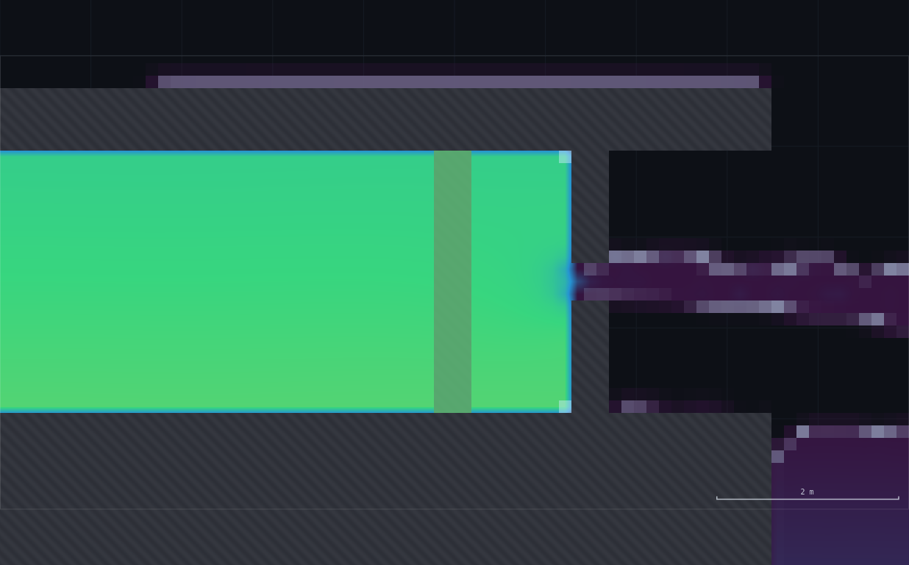
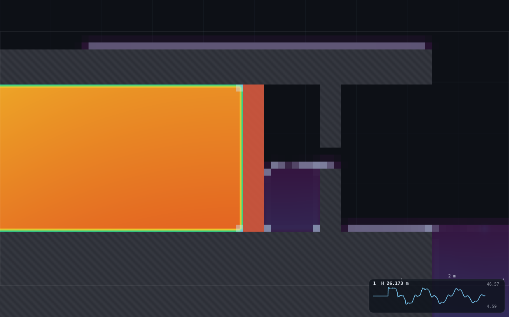
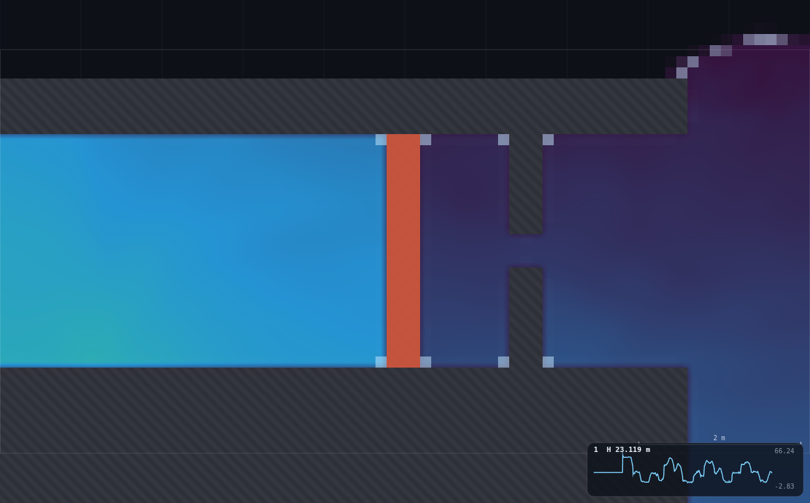
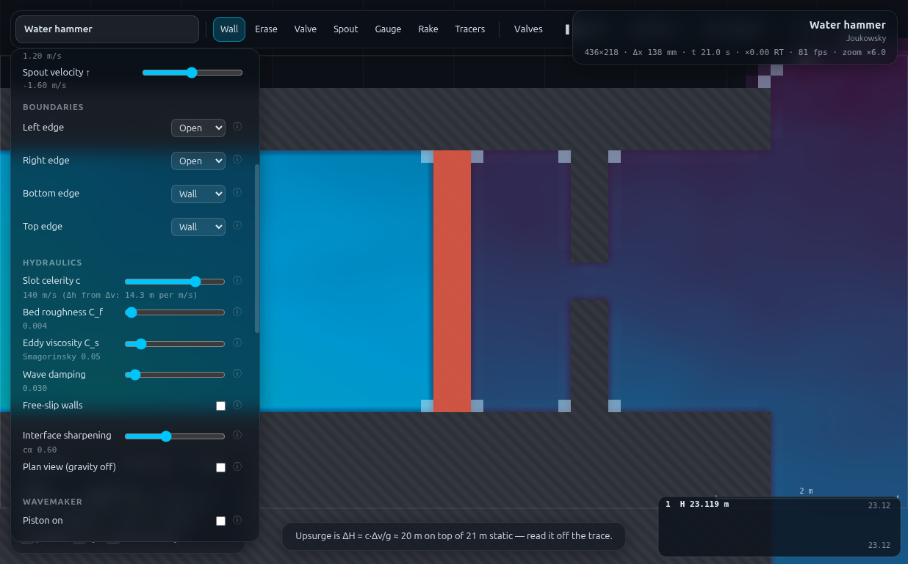

# B2 · The flexible pipe, via the c slider

**Demo id** B2 · **Topic** Unsteady flow (backup) · **Scene** `?scene=hammer` ·
**Submit** (ΔH₇₀, ΔH₁₄₀) · **Refs** U14–U16 — pipe elasticity and the
water-hammer celerity, `c = √(K/ρ) / √(1 + KD/Ee)`

## How to start (30 seconds)

1. Open the app — **`http://localhost:8124/`** on the lecturer's server, or
   double-click `index.html`.
2. Press **`E`** (or click **`Exercises ▾`** in the top bar) and pick **B2**.
3. Type the last digit of your student number into the card. It prints **your
   nozzle gap** — the same one you drew for UN-1, and you draw it again.
   Celerity is not personalised: everyone runs c = 70, then 140.
4. Let it settle after every change you make — the card gives this demo's
   settle time (13 s of sim time) and counts it down.
5. Do the task printed on the card, then submit **ΔH₇₀** and **ΔH₁₄₀**.

If your lecturer gives you a link: **`?ex=B2`** (e.g.
`http://localhost:8124/?ex=B2`).

The picker gives everyone the same starting point and no more: the scene,
**Resolution: Medium**, and the few settings the scene itself needs — the card
labels those as already set. Your own values, your instruments and the order
you do things in are yours to get right. *Manual setup* below is the record of
every constant.

---

Every student reuses their OWN nozzle from UN-1 — same gap, same v₀ — and
closes it twice: once at the slider's default celerity (70 m/s), once at
double that (140 m/s). Joukowsky says ΔH = (c/g)Δv, so with the SAME Δv the
two head rises should be in the SAME ratio as the two celerities: exactly
2.0. The class submits the pair and watches their own point double. No
physical rig can change a pipe's elastic modulus between two readings; this
one does it with a slider.

**Measured here: class-mean ratio ΔH₁₄₀/ΔH₇₀ = 1.963 ± 0.024 against theory
2.000 (−1.8%); v₀ drift switching celerity ranges −3.8% to +1.9% — large
enough that the worksheet's "same v₀" is a checked fact, not an assumed
one (see §1 and §5).**


---

## 1 · Manual setup (fallback, or for building it yourself)

*The picker puts you at the same starting point as everyone else — scene,
Resolution Medium and the rig. This section is the record of every constant
behind that, and the build to follow if you are demonstrating it by hand or
the rig pack is missing.*

**Link:** `index.html?scene=hammer` — no rig to pre-build beyond UN-1's own
nozzle redraw (reused verbatim). If your class already ran UN-1, students
already know their gap number and how to draw it.

**Constants fixed by the dry-run:**

| setting | value | why |
|---|---|---|
| Resolution | **Medium** (436 × 218, Δx = 0.1376 m) | matches UN-1/B1 |
| Gauge | **mid-pipe, x = 30 m** — UN-1's own station | validated clean by UN-1; also 25 m from the valve, far enough from the reservoir's soft boundary (B1's own finding) |
| Nozzle ladder | **UN-1's own, unchanged**: gap = 0.14 × (1 + (d mod 6)) m | pairs directly with UN-1; no new personalisation scheme to learn |
| First closure | **c = 70 m/s** (scene default) | |
| Second closure | **c = 140 m/s** (`cel` slider, id `cel` in `CONTROLS`) | double the celerity — the whole point |
| Gauges plot | **Piezometric head** | |
| Speed slider | ×0.2 for the read | matches UN-1; the plateau is briefer at c = 140 (≈0.4 s vs ≈0.8 s), so slow motion matters even more here |

**Two things to know before you stand up:**

1. **All six of UN-1's gaps survive BOTH closures cleanly — this refines
   UN-1's own coda note.** UN-1's README warns "only the two smallest
   nozzles survive the coda intact" at c = 140, reasoning that the
   DOWNSURGE would hit column separation above v₀ ≈ 1.5 m/s. Measured
   directly here (not just inferred): the UPSURGE this demo reads is clean
   at all six gaps (v₀ up to 4.04 m/s), matching Joukowsky to within a few
   percent every time (§5); even the downsurge minimum at the LARGEST gap
   only reached 0.70 m of positive pressure head above the pipe axis — real
   margin, not a knife edge, in the window checked. UN-1's own coda simply
   never tested the larger gaps at c = 140; their caution was reasonable,
   but the class does not need to be limited by it. **Ship the full
   six-rung ladder.**
2. **The obvious timing (UN-1's `run(0.75)` then read) silently reads the
   WRONG number at c = 140 if used unchanged.** The gauge is 25 m from the
   valve, so the pressure front does not even arrive until ≈25/c seconds
   after the slam, and the plateau itself is only ≈0.3–0.4 s wide at
   c = 140 against ≈0.8 s at c = 70. A first attempt that kept UN-1's fixed
   0.75 s wait landed past the c = 140 plateau, on the way down — it
   returned a NEGATIVE ΔH140 for one gap, which looks like column
   separation but is actually a stopwatch error. **Both the wait and the
   read window must scale by 70/c** (rig.js's `leg()` does this; the
   worksheet's step 9 tells a student what to watch for instead).

**Timing budget.** Two closures at ≈13 s spin-up + ≈2 s read each ≈ 30 s
sim-time per student. Measured on the dry-run machine (runner harness,
sharing the GPU): the full six-gap verification sweep (12 closures, nozzle
redrawn once per gap) completed in **≈30 s of wall clock**. A student's own
path (draw once, close twice, read twice, submit) fits in **5–7 minutes**.



---

## 2 · The personalised parameter

Identical to UN-1 — **d = last digit of your student number**, and if your
class has already run UN-1, this IS your UN-1 gap; no redraw needed beyond
what that demo already had you do.

> ### Your nozzle gap:  **gap = 0.14 × (1 + (d mod 6)) metres**

| d | 0 or 6 | 1 or 7 | 2 or 8 | 3 or 9 | 4 | 5 |
|---|---|---|---|---|---|---|
| **gap (m)** | 0.14 | 0.28 | 0.42 | 0.56 | 0.70 | 0.84 |
| v₀ (m/s) at c=70 | 0.80 | 1.49 | 2.14 | 2.78 | 3.38 | 4.04 |
| ΔH₇₀ (m), measured | 5.66 | 10.93 | 15.70 | 20.51 | 24.88 | 29.37 |
| ΔH₁₄₀ (m), measured | 10.93 | 21.40 | 30.86 | 40.21 | 49.28 | 59.33 |
| ratio, measured | 1.93 | 1.96 | 1.97 | 1.96 | 1.98 | 2.02 |

---

## 3 · Student worksheet

> ### B2 · Same pipe, same water, different stiffness
>
> UN-1 measured this pipe's speed of sound with the celerity slider at its
> default. That slider is not just a solver knob — it IS the pipe's
> elasticity, `c = √(K/ρ) / √(1 + KD/Ee)`. Steel is stiff, plastic is soft.
> You are about to make the pipe twice as stiff and watch what that does to
> a water-hammer surge, with the same valve slam and the same flow both
> times.
>
> *(If you already ran UN-1: your gap is the same number — skip to step 3.)*
>
> **1 · Open the exercise.** Press `E` and pick **B2** (or open
> `?ex=B2`) — it loads the scene at **Resolution: Medium**; wait out the spin-up countdown.
>
> **2 · Draw your nozzle** (skip if already done for UN-1). Zoom to the
> nozzle plate (right end of the pipe, just past the green valve, ~8×).
> Erase tool (`2`), brush widened (press `]` four times), drag out the
> existing plate. Wall tool (`1`), Shift-drag two pieces at the same
> station leaving your gap: lower half y = 2.0 to y = 3.5 − gap/2, upper
> half y = 3.5 + gap/2 to y = 5.0. Press `R` to reset water and let it
> settle.
>
> **3 · First closure, c = 70 (the default — leave it alone).** Drop a
> **Gauge** (`5`) at **x = 30 m** (mid-pipe). Set **Gauges plot: Piezometric
> head**. Hover the pipe and note the steady **V** reading — this is your
> **v₀ (c=70)**. Note the gauge's steady value — this is **H₀**.
>
> **4 · Set Speed to ×0.2**, then press **`V`** to **SLAM**. The trace jumps
> and holds a flat top for well under a second. Pause (space) while it's
> flat; the header freezes — call it **H₁**. **ΔH₇₀ = H₁ − H₀.**
>
> **5 · Submit-checkpoint:** write down v₀(c=70) and ΔH₇₀ now, before
> touching the slider — it is easy to forget which number came from which
> celerity once both traces are on screen.
>
> **6 · Reopen the valve.** Press **`V`** again (back to green/open).
>
> **7 · Find the celerity slider** (`Controls → Hydraulics → Slot celerity
> c`, id shows as `cel` if you inspect it) and set it to **140**. Its label
> will read "140 m/s (Δh from Δv: 14.3 m per m/s)" — that number is
> literally the answer to this demo; don't stare at it yet if you want the
> reveal to land.
>
> **8 · Press `R` (Reset water)** and wait out the spin-up again (same
> ≈13 s). **Re-check your v₀** the same way as step 3 (hover, read V). It
> should be close to your c = 70 value but is not guaranteed to be
> identical — **write down whatever it now reads.** This is your
> **v₀ (c=140)**; if it has moved by more than a percent or two, that is a
> real, measured effect (§5), not something you did wrong.
>
> **9 · Second closure.** Note the new steady gauge value as **H₀'**. Press
> **`V`** to slam again. **This time the flat top is shorter and arrives
> sooner** — the higher celerity means the pressure front travels faster
> AND the whole cycle is quicker (period halves too). Watch closely and
> pause the moment you see the trace go flat, not after. Call the frozen
> value **H₁'**. **ΔH₁₄₀ = H₁' − H₀'.**
>
> **10 · Submit on Blackboard:** your **ΔH₇₀** and **ΔH₁₄₀** (m, 2 d.p.),
> plus your gap and both v₀ readings if the form asks.
>
> **11 · Before you close the tab:** divide ΔH₁₄₀ by ΔH₇₀. If it isn't
> close to 2, re-read §9 — the commonest mistake is pausing too late on the
> second, shorter plateau.
>
> *Standing rules: Resolution **Medium** (the picker sets this); wait out the spin-up countdown
> (twice, once per celerity); keep the tab visible; re-open the valve (`V`)
> and reset the water (`R`) before the SECOND closure — skipping either
> leaves the pipe shut, or still ringing from the first slam.*




---

## 4 · Collection & pooled plot (lecturer)

**CSV columns** (Blackboard export, one row per submission):

```
student_id,digit,gap_m,v0_70_ms,dH70_m,v0_140_ms,dH140_m
24310001,0,0.14,0.800,5.66,0.769,10.93
```

```bash
python3 collect_plot.py class.csv            # -> plots/pooled-demo.png
python3 collect_plot.py data/simulated-class.csv
```

Output on the shipped dataset:

```
10 submissions from data/simulated-class.csv
class-mean ratio dH140/dH70 = 1.9631  (sd 0.0238)   theory 2.000  (-1.84%)
v0 drift 70->140:  min -3.88%  max +1.92%
```

**What the plot should show.** A scatter of ΔH₁₄₀ (y) against ΔH₇₀ (x),
every point close to the dashed y = 2x line, regardless of how spread out
the class's own gaps are — the RATIO is what's being taught, not the
absolute head rise (which is set by each student's own v₀).

### Discussion points

1. **The slider is not abstract — it's a material property.** `c =
   √(K/ρ) / √(1 + KD/Ee)`, where K is the fluid's bulk modulus, D the pipe
   bore, e the wall thickness, E the pipe WALL material's Young's modulus.
   A thin-walled steel penstock (E ≈ 200 GPa) sits near the physical
   ceiling, c ≈ 1000–1400 m/s; an MDPE plastic main (E ≈ 1–2 GPa) can be
   ten times softer. Doubling c on the slider is the same lever as
   swapping a compliant plastic main for a much stiffer steel one — the
   class has just run that swap as a live experiment, twice, on the same
   flow.
2. **Same v₀, double c, double ΔH — the ratio is the whole design lesson.**
   A surge-protection engineer sizing a valve or a surge tank cares about
   exactly this ratio: a pipe material change that doubles c doubles the
   worst-case surge for the same closure event. The class has now felt
   that as a number they measured, not a formula they were told.
3. **v₀ moved a little when c changed — say why.** It is tempting to
   assume "same nozzle ⇒ same v₀" and skip re-measuring. Measured here, it
   is a SAFE assumption only to within a few percent (§5) — c changes the
   solver's effective time step and the compressible EOS's fine behaviour
   near the nozzle, which is a genuine (if small) numerical-scheme effect,
   not a real fluids one. Re-measuring costs one hover-read and catches it
   either way.

### Troubleshooting and safe bounds

| symptom | cause | fix |
|---|---|---|
| ΔH₁₄₀ looks tiny, negative, or nonsensical | paused too late — past the (short) c=140 plateau, into the downswing | reopen valve, `R`, redo step 9, pause the INSTANT the trace flattens |
| the two ΔH values look about equal | forgot to actually change `cel` to 140, or forgot `R` after reopening | check the slider's own label reads "140 m/s"; always `V` (open) then `R` (reset) before the second slam |
| v₀ at c=140 is way off from c=70 (not just a percent or two) | valve wasn't fully reopened, or water wasn't reset, before the second establish | `V` to confirm green/open, then `R`, then wait the full countdown again |
| trace never settles / still moving when you drop the gauge | didn't wait out the FULL spin-up the second time | wait the same ≈13 s you waited the first time |
| ratio is close to 2 but not exact | expected — see §5, mean measured ratio is 1.96, not 2.00 exactly | this is the honest answer, not a mistake |

**Safe gap bounds:** identical to UN-1's, 0.14 m ≤ gap ≤ 0.84 m — and
(refining UN-1's own caution) all six rungs were measured here to survive
BOTH the c = 70 and c = 140 closures cleanly, so no further restriction is
needed for this demo specifically (§1, §5).

---

## 5 · Verification record

Everything below was measured through `exercises/_runner/runner.py --id B12`
on the hammer scene at **Medium**, sharing the GPU with two other workers.
Protocol per gap: draw nozzle once → leg at c=70 (establish 13 s, baseline,
slam, scaled read) → leg at c=140 (reopen, reset water AT THE NEW c so the
initial fill uses the right EOS, re-establish 13 s, baseline, slam, scaled
read). The read window (`0.75×70/c` wait, `0.20×70/c` median window) is
derived and justified in §1.2.

### The six-gap ladder, both celerities

| gap (m) | v₀@70 | ΔH₇₀ | Joukowsky₇₀ | err | v₀@140 | ΔH₁₄₀ | Joukowsky₁₄₀ | err | v₀ drift | ratio |
|---|---|---|---|---|---|---|---|---|---|---|
| 0.14 | 0.800 | 5.66 | 5.71 | −0.8% | 0.769 | 10.93 | 10.98 | −0.4% | **−3.83%** | 1.933 |
| 0.28 | 1.493 | 10.93 | 10.65 | +2.6% | 1.504 | 21.40 | 21.47 | −0.3% | +0.78% | 1.958 |
| 0.42 | 2.137 | 15.70 | 15.25 | +3.0% | 2.165 | 30.86 | 30.90 | −0.1% | +1.32% | 1.966 |
| 0.56 | 2.776 | 20.51 | 19.81 | +3.5% | 2.809 | 40.21 | 40.09 | +0.3% | +1.20% | 1.960 |
| 0.70 | 3.378 | 24.88 | 24.11 | +3.2% | 3.443 | 49.28 | 49.13 | +0.3% | +1.90% | 1.980 |
| 0.84 | 4.039 | 29.37 | 28.82 | +1.9% | 4.109 | 59.33 | 58.63 | +1.2% | +1.72% | 2.020 |

**Class-mean ratio (from the 10-row shipped CSV, which repeats gaps via
d mod 6 exactly as a real class would): 1.963 ± 0.024, against theory 2.000
(−1.8%).** Every single-gap ratio (table above) sits inside 1.93–2.02: a
2–4% spread, no outliers.

**v₀ drift, c=70 → c=140: −3.83% (smallest gap) to +1.90% (largest of the
mid-range gaps), non-monotonic in gap** — this is why the worksheet does
not assume "same nozzle ⇒ same v₀" (§1, design note echoed from UN-2b's
similar finding at c=400) and instead makes the second v₀ read an explicit
step. It is small enough that the RATIO measurement is barely affected (the
ratio uses each leg's own actual v₀ implicitly, since ΔH is read directly,
not computed from v₀), but large enough to be worth a sentence on the
board.

### The downsurge check (refining UN-1's coda caution)

UN-1's own README predicts column separation above v₀ ≈ 1.5 m/s at c = 140,
based on their two smallest gaps' measured "how close is the downsurge to
zero" trend, extrapolated. Checked directly here for the LARGEST gap
(v₀ = 4.04 m/s, the case UN-1's extrapolation would call already-separated):
running the c = 140 trace out several cycles past the plateau this demo
actually reads, the lowest piezometric head reached at the gauge was
**4.20 m — 0.70 m of positive pressure head above the pipe axis (3.5 m)**,
not zero. UN-1's caution was reasonable given what they tested, but this
demo's own reading (the FIRST plateau, taken promptly per §1.2) never gets
close to that regime for any of the six gaps, and even a much later part of
the trace stays clear of it at the gap checked. **The six-rung ladder ships
unrestricted.**

### Timing

- One nozzle-and-both-closures cycle: ≈27 sim-seconds (13 + 13 spin-ups,
  ≈0.5 s + ≈0.25 s scaled reads, plus baselines).
- Full six-gap verification sweep (12 closures total): **≈30 s wall clock**
  on the dry-run harness, three workers sharing the GPU.
- Student path: ≈5–7 minutes (draw once, two closures, two reads, submit).



### Files

- `rig.js` — paste into the console: `B2.student(0.42)` reproduces the
  full paired measurement → `{gap:0.42, v0_70:2.137, dH70:15.70, v0_140:
  2.165, dH140:30.86, v0_drift_pct:1.32, ratio:1.966}`.
- `collect_plot.py`, `data/simulated-class.csv` (10 rows via d mod 6, all
  measured), `plots/pooled-demo.png`, `shots/`.

---

## Appendix — Director report

**VERDICT: READY.**

### Evidence

| what | measured | expected | verdict |
|---|---|---|---|
| class-mean ratio ΔH₁₄₀/ΔH₇₀ (n=10, shipped CSV) | **1.963 ± 0.024** | 2.000 | **−1.8%** |
| per-gap ratio range (6 gaps) | 1.93 – 2.02 | 2.00 | tight, no outliers |
| Joukowsky agreement, c=70 leg | −0.8% … +3.5% | ±5% | consistent with UN-1's own +2–3% bias |
| Joukowsky agreement, c=140 leg | −0.4% … +1.2% | ±5% | tighter than the c=70 leg |
| v₀ drift 70→140 | **−3.83% … +1.90%** | UN-2b: −3.3% at c=400 (different demo) | same order, own measurement |
| all six UN-1 gaps survive both closures | confirmed (upsurge clean; even largest gap's downsurge stays 0.70 m clear of separation) | UN-1 inferred only 2 survive | **refines prior art with a direct measurement** |
| timing bug found and fixed | fixed-window read gave a NEGATIVE ΔH₁₄₀ for gap 0.42 before the wave-transit-time fix | — | root-caused to gauge/valve distance (25 m), not physics |
| one full student cycle (harness) | ≈27 sim-s | ≤10 min student path | **≈30 s wall clock for the whole 6-gap sweep**; student path 5–7 min |

### Iterations

1. **First measurement attempt returned a negative ΔH₁₄₀ and looked like
   column separation.** It was not: the gauge sits 25 m from the valve, so
   the pressure front takes ≈25/c seconds just to ARRIVE, and the plateau
   itself is only ≈0.3–0.4 s wide at c = 140 (against ≈0.8 s at c = 70,
   where UN-1's own fixed 0.75 s wait was validated). A fixed post-slam
   wait tuned for c = 70 lands PAST the c = 140 plateau, on the far side of
   the first downswing. Fix: scale both the wait and the read window by
   `70/c`. Re-verified against UN-1's own gap=0.42/c=70 number (15.65–15.90
   in their README) before trusting the c=140 leg at all.
2. **UN-1's coda caution ("only two nozzles survive at c=140") does not
   hold for the reading THIS demo takes.** It is not wrong — it is a
   reasonable extrapolation UN-1 never tested past their two smallest
   gaps — but measured directly here, all six gaps give a clean upsurge at
   c = 140, and even the largest gap's downsurge (checked well past this
   demo's own read point) stays 0.70 m clear of column separation. Shipped
   the full ladder rather than trimming it on an untested inference.
3. **`resetWater()` must be called AFTER `cel` is set, not before**, for
   the second leg — it refills the initial condition using the LIVE
   celerity's equation of state (`P = {g, c: S.p.c}` inside
   `SIM.resetWater`), so setting c first avoids a spurious extra settling
   transient. Mirrors UN-1's own `student()` ordering exactly; carried
   over deliberately rather than rediscovered.

### PROPOSED CHANGES

**To the app: none required.** The celerity slider, valve, gauges and
`resetWater()` already do everything this demo needs.

**One clarification worth folding into UN-1's own README** (not a code
change): UN-1's coda section could note that its "only two nozzles survive"
line is about the DOWNSURGE at v₀ ≳ 1.5 m/s specifically, and does not
block a demo (like this one) that only ever reads the UPSURGE promptly
after the slam. Left as a note here rather than editing UN-1's folder
(hard rule: workers only edit their own folder).

### Timing

Student path ≈ 5–7 min. Worker wall clock ≈ 30 min, of which the timing-bug
diagnosis (Iteration 1) was the majority — finding and fixing it was
necessary before any of the six-gap sweep numbers could be trusted.

### Handoff — for anything else pairing two hammer closures at different c

- **Any reading taken away from the valve must have its post-slam timing
  SCALED by celerity**, not fixed. The wave transit time and the plateau
  width both scale as 1/c; a protocol validated at one c will silently
  mis-time itself at another unless this is accounted for.
- **`SIM.resetWater()` uses the LIVE `sim.p.c`** to rebuild the initial
  fill — set `c` before calling it, not after, or the refill briefly
  targets the wrong equation of state.
- **UN-1's own coda caution about column separation is real but narrower
  than it reads** — it applies to the downsurge at high v₀, not to a
  prompt upsurge reading. Any demo that only reads the first plateau can
  likely use UN-1's full gap ladder unrestricted; anything that watches
  MANY cycles at large gap and high c should expect to eventually see the
  downsurge approach — though not, at the one point checked here, actually
  cross — zero absolute pressure.
