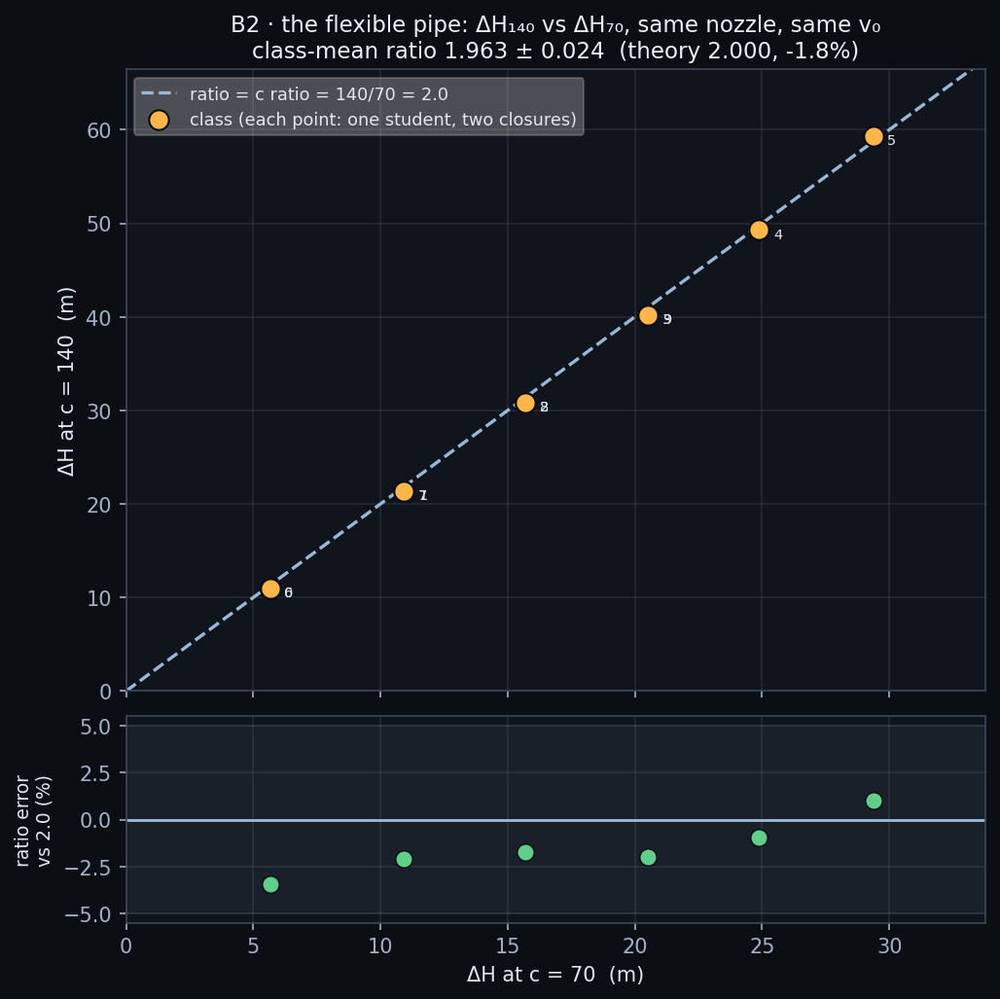

# B2 · The flexible pipe, via the c slider

Every student closes their own nozzle twice: once at the slider's default
celerity (70 m/s), once at double that (140 m/s). Joukowsky says
ΔH = (c/g)Δv, so with the same Δv the two head rises should be in the same
ratio as the two celerities — exactly 2.0. No physical rig can change a
pipe's elastic modulus between two readings; this one does it with a slider.

**Open it:** press **E** in the [app](https://barneydobson.github.io/hydraulician/)
and pick **B2**, or use the direct link
[`?ex=B2`](https://barneydobson.github.io/hydraulician/?ex=B2).
How to run any exercise: see the [teaching pack index](../INDEX.md#running-an-exercise).

## Theory

A valve slammed on a flow of velocity v₀ throws up a surge, and the
celerity that carries it is set by the water AND the pipe wall together:

    ΔH = (c/g)·Δv          c = √(K/ρ) / √(1 + K·D/(E·e))

K is the water's bulk modulus, D the bore, e the wall thickness and E the
Young's modulus of the wall material. That last term is why the slider is
not a solver knob but a material choice: a thin-walled steel penstock sits
near the physical ceiling, an MDPE plastic main an order of magnitude
softer. Same water, same closure, stiffer pipe, bigger surge — and the ratio
of the two ΔH is the ratio of the two celerities, whatever your own v₀ is.

The gauge station is **x = 30 m, y = 3.5 m** — mid-pipe, the same for both
legs and 25 m from the valve.

## Your nozzle gap

**d** is the **last digit of your student number** — your lecturer will
explain the assignment in class. The celerity is not personalised: everyone
runs 70, then 140. Look up **d mod 6**:

| d | 0 or 6 | 1 or 7 | 2 or 8 | 3 or 9 | 4 | 5 |
|---|---|---|---|---|---|---|
| **gap (m)** | 0.14 | 0.28 | 0.42 | 0.56 | 0.70 | 0.84 |

## What to do

1. Redraw the nozzle plate at **your gap** — Erase (`2`) the shipped plate,
   then Wall (`1`) two Shift-dragged pieces at the same station leaving
   your gap centred on the pipe axis at y = 3.5 m (Measure, `8`, sets the
   width).
2. Drop a Gauge (`5`) at **x = 30 m, y = 3.5 m**, press `R` and let it
   reach steady state — about **13 s**; the card counts it down.
3. Note the steady **V** on the hover readout in the pipe (your **v₀**) and
   the steady gauge value (**H₀**); press `V` to slam, pause (space) on the
   flat top of the trace and call it H₁. **ΔH₇₀ = H₁ − H₀.**
4. Press `V` to reopen, set **Slot celerity c** to **140**, press `R` and
   wait the countdown again. Re-read v₀ and H₀ — they move a little, and
   that is real — then slam a second time for **ΔH₁₄₀**.
5. Submit **ΔH₇₀, ΔH₁₄₀**, plus your gap and both v₀ readings if the form
   asks for them.

**Also:** the second leg is the same scene, not another one — but at
c = 140 the front reaches the gauge twice as soon and the plateau is half
as wide (≈0.4 s against ≈0.8 s). Everything after the slam scales by 70/c,
so pause the instant the trace flattens, not a beat later.

## For the instructor — pooling the class

Collect one row per student
(`student_id,digit,gap_m,v0_70_ms,dH70_m,v0_140_ms,dH140_m`), export the
CSV and run:

```bash
python3 collect_plot.py class.csv                # -> plots/pooled-demo.png
python3 collect_plot.py data/simulated-class.csv # the shipped dry-run class
```

The script forms each student's ratio ΔH₁₄₀/ΔH₇₀, prints the class mean
against theory 2.0 along with each leg's Joukowsky error and the v₀ drift
between legs, and plots ΔH₁₄₀ against ΔH₇₀ with the y = 2x line drawn
through the scatter.



### Discussion points

- **The ratio is the design lesson, not the head rise.** Each student's
  absolute ΔH is just their own v₀; what every point shares is the doubling.
  A surge engineer sizing a valve closure time or a surge tank is buying
  exactly that: change the pipe material and the worst-case surge for the
  same closure event scales with c.
- **Watch the front travel.** Switch Field → Pressure head and slam at
  c = 70, then at c = 140: the same 25 m from valve to gauge is crossed in
  half the time, and the whole cycle halves with it. That is the picture
  behind "scale the wait by 70/c" — and the reason a fixed stopwatch tuned
  at one celerity silently reads the wrong number at the other.

The full verification record — the six-gap ladder measured at both
celerities, the Joukowsky agreement per leg, the v₀-drift and downsurge
checks, and the timing bug that scaling fixed — is kept locally, out of version control, at `exercises/B2-flexible-pipe/_archive/README-full.md`.
