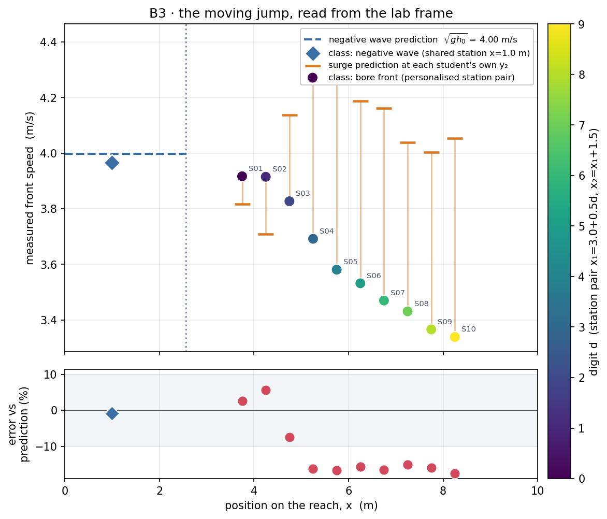

# B3 · Dam break: the moving jump

A column of water is released instantly. Two fronts run away from the gate
in opposite directions: a **negative wave** climbs back into the reservoir
at (nominally) √(g h₀), and a **bore** — a moving hydraulic jump — steepens
and runs downstream. Both are the surge equations' moving-frame momentum
balance, but watched from the fixed lab frame with a stopwatch, which is
exactly what a control-volume analysis normally asks you to imagine rather
than see.

**Open it:** press **E** in the [app](https://barneydobson.github.io/hydraulician/)
and pick **B3**, or use the direct link
[`?ex=B3`](https://barneydobson.github.io/hydraulician/?ex=B3).
How to run any exercise: see the [teaching pack index](../INDEX.md#running-an-exercise).

## Theory

The negative wave runs back into still water of depth h₀ at the small-
disturbance celerity:

    v = √(g·h₀)

The bore advances into still water of depth y₁ and leaves it at y₂ behind
the front; mass and momentum conserved in the frame moving with the front
give

    v = √( g·y₂·(y₁ + y₂) / (2·y₁) )

Measured constants for this scene: the release interface is the dam's
upstream face at **x = 2.56 m**, the reservoir is **h₀ = 1.629 m** deep
(so √(g h₀) = **4.00 m/s**), and the tailrace starts **wet** at
**y₁ = 0.167 m**. Wet matters: this is the moving-surge case, not the
dry-bed front, whose 2√(g h₀) limit does not apply here.

## Your bore stations

**d** is the **last digit of your student number** — your lecturer will
explain the assignment in class.

> **x₁ = 3.0 + 0.5·d m**, and **x₂ = x₁ + 1.5 m**.

| d | 0 | 1 | 2 | 3 | 4 | 5 | 6 | 7 | 8 | 9 |
|---|---|---|---|---|---|---|---|---|---|---|
| **x₁ (m)** | 3.0 | 3.5 | 4.0 | 4.5 | 5.0 | 5.5 | 6.0 | 6.5 | 7.0 | 7.5 |
| **x₂ (m)** | 4.5 | 5.0 | 5.5 | 6.0 | 6.5 | 7.0 | 7.5 | 8.0 | 8.5 | 9.0 |

The negative wave is read at **x = 1.0 m** by everyone. That one is shared,
not personalised: the reservoir is only 1.6 × h₀ long, so it has no clean
travelling front to sample at two stations — the whole pool subsides
together.

## What to do

1. Drop a Gauge (`5`) at **x = 1.0 m** and at your **x₁** and **x₂** —
   position markers only; they survive a reset, so place them once.
2. Press `V` to pull the dam and note the status-bar time as **t₀**. Pause
   the moment the surface at x = 1.0 m has dropped clearly and
   unambiguously below its still-water mark — a visible gap, roughly a
   seventh of a grid square, not the first flicker — and read **t₁**.
   `v_neg = (2.56 − 1.0) / (t₁ − t₀)`.
3. Press `R` to re-arm and re-release (if nothing moves, press `V` once,
   then `R`). This time watch downstream: pause as the bore front reaches
   **x₁**, read the time, resume, pause again at **x₂**.
   `v_bore = (x₂ − x₁) / (t₂ − t₁)`.
4. Submit **x₁, x₂, v_neg** and **v_bore**.

## For the instructor — pooling the class

Collect one row per student — the script reads
`student,digit,x1_bore,x2_bore,v_bore,x_neg,v_neg`, plus `y1_bore,y2_bore`
(or a ready-made `v_bore_pred`) for the per-point surge prediction; any
other columns are ignored. Then run:

```bash
python3 collect_plot.py class.csv                # -> plots/pooled-demo.png
python3 collect_plot.py data/simulated-class.csv # the shipped dry-run class
```

The script draws one spatial picture of the whole reach: the shared
negative-wave reading against the √(g h₀) line over the reservoir, and each
student's bore point at their pair's midpoint with its own surge-formula
prediction on a lollipop tick, the gap between them repeated as a
percentage below.



### Discussion points

- **Pause on a flicker instead of a clear drop, live, and watch the answer
  move.** At the same x = 1.0 m station the negative-wave speed swings from
  +29% (a 0.10 m drop) to −39% (a 0.30 m drop) — the −0.8% agreement the
  class gets is a choice of criterion, not a constant. A short, deep
  reservoir does not owe you a self-similar rarefaction.
- **A tiny precursor arrives long before the wave.** Read at millimetre
  threshold and you recover ≈24 m/s, which is the scene's own acoustic
  celerity re-equilibrating the pressure field, not gravity at work. It is
  invisible on screen, and it is the trap that a "first detectable change"
  stopwatch falls into.

The full verification record — the scene geometry, the self-similarity and
steepest-gradient checks behind the fixed negative-wave station, the
criterion sensitivity table, the ten-digit bore sweep and the safe station
bounds — is archived in the repository at
`exercises/B3-dambreak/_archive/README-full.md`.
