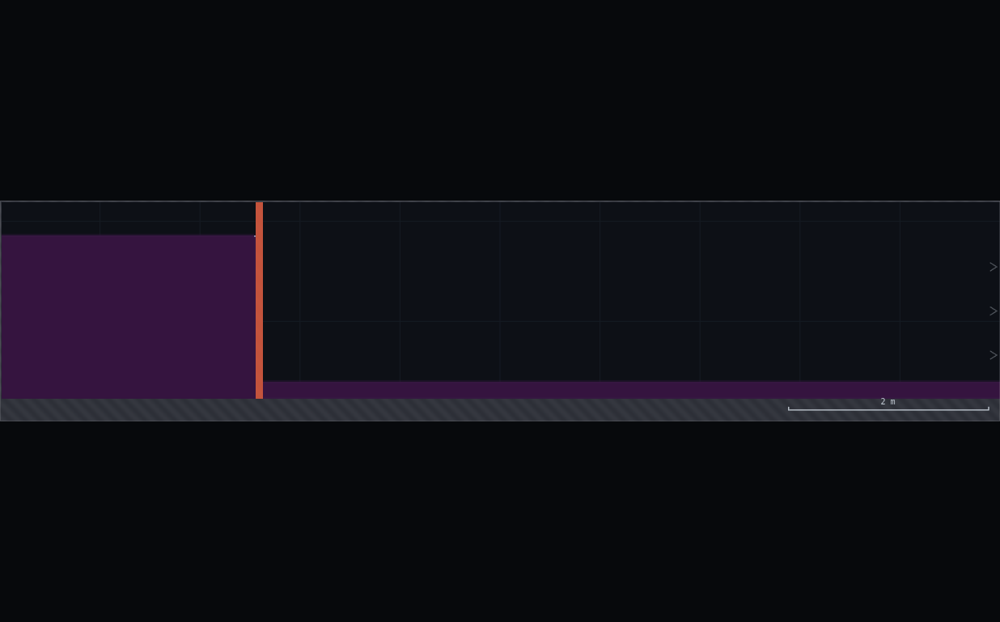
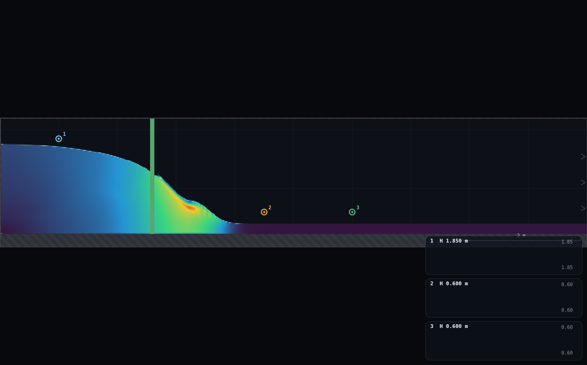
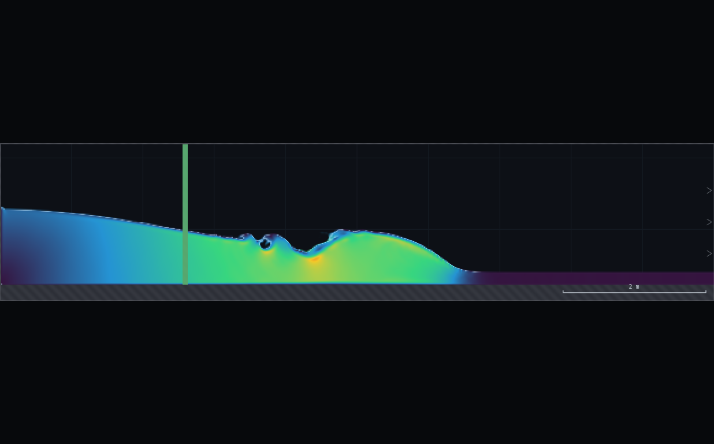
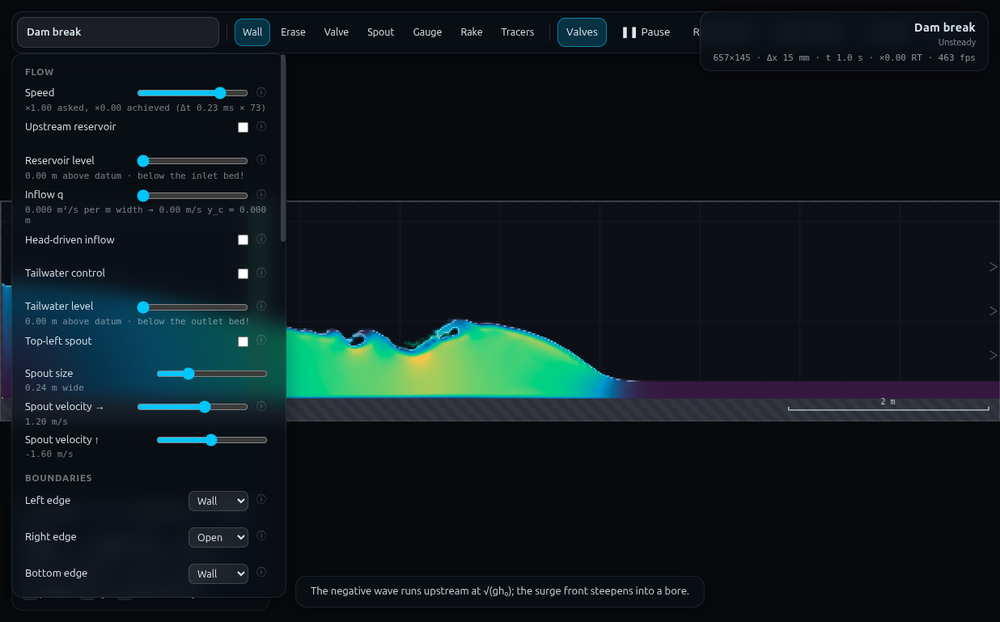

# B3 · Dam break: the moving jump

**Demo id:** B3 (backup, SUBMIT-capable)  **Scene:** `?scene=dambreak`
**Refs:** #120–123 (unsteady/characteristics), #147–149 (surge / moving
hydraulic jump) — `equations-reference.md`

A column of water is released instantly. Two fronts run away from the gate
in opposite directions: a **negative wave** climbs back into the reservoir
at (nominally) `√(g h₀)`, and a **bore** — a moving hydraulic jump — steepens
and runs downstream. Both are the surge equations' moving-frame momentum
balance, but watched from the fixed lab frame with a stopwatch, which is
exactly what a control-volume analysis normally asks you to imagine rather
than see.

---

## 1 · Lecturer setup (before class)

**Link to put on the slide:** `http://<host>:8124/?scene=dambreak`

**No rig to draw.** The scene ships complete — reservoir, dam (a full-height
valve segment) and tailrace are all built in. There is no `rig.js` for this
demo.

**Scene geometry, read from `js/scenes.js` and confirmed live in the
solver** (Medium resolution: 657×145 cells, Δx = 15.2 mm, Δt = 2.28e-4 s):

| what | value |
|---|---|
| Domain | W = 10 m, H = 2.2 m, flat bed at y = 0.228 m |
| Dam (valve) | centreline x = 2.60 m, 0.08 m thick → **effective release interface at x = 2.56 m** (the water-fill function's split point, i.e. the valve's upstream face) |
| Reservoir | x ∈ [0, 2.56], length **L = 2.56 m**, filled to level 1.85 m → **h₀ = 1.629 m** depth |
| Tailrace | x ∈ [2.64, 10], length ≈ 7.36 m, filled to level 0.40 m → **h₁ = 0.167 m** depth (**wet bed** — not the dry-front case) |
| Edges | left = wall, right = **open** (zero-gradient), top/bottom = wall |
| `spinup` | **none** — the key is absent from the scene object (`JSON.stringify` drops it; `scene.spinup \|\| 0` ⇒ 0). No flat-out warm-up countdown: the sim is interactive with the gate held shut from the moment the page loads. |

**Constants fixed by this dry-run:**

| what | value | why |
|---|---|---|
| Resolution | **Medium** (default) | matches every measurement below |
| Speed | **×0.15** | stretches the ≈2 s event to ≈13 s of real time — see §5 |
| Display | Speed (scene default) is fine; Water mode also works | either shows the surface clearly |
| Reservoir/Tailwater panel controls | **ignore them** | `dambreak` builds its pool from initial conditions + the valve, not the level-control system; the "Upstream reservoir" / "Tailwater control" checkboxes and their level sliders do nothing here and should stay off |

**The replay gesture (verified against the live solver, not assumed):**

- **V** (or the **Valves** toolbar button) calls `toggleValve()`, which just
  flips `sim.p.valveClosed`. The scene boots with the gate **closed**
  (`scene.valveOpen` is unset ⇒ closed by default).
- **R** (or the **Reset** button) calls `SIM.resetWater()`, which reloads the
  initial two-level fill and sets `t = 0` — but it does **not** touch the
  valve state.
- Consequence, checked directly in the solver: once V has been pressed at
  least once (gate open), **pressing R alone re-arms *and* re-releases the
  break** — the reservoir refills to the split initial condition with the
  gate already open, so the run restarts on the very next tick with no
  second V needed. Verified: after `resetWater()` with the valve left open,
  ticking forward reproduces the same drawdown trace as the original run,
  from t = 0.
- If the valve is showing **closed** (the toast/button says so — e.g. a
  student pressed V twice), R alone just re-arms a static pool; press V once
  more to release it.
- **Practical rule for the worksheet:** *"To retry: press R. If nothing
  moves, press V once, then R again."*
- One more precision point worth putting on the worksheet: **note the
  status-bar time the instant you press V** and call it t₀ (it will read
  ≈0.00 s if you pressed R just beforehand, but not if a few seconds have
  drifted by first since the render loop keeps `sim.t` advancing even while
  the pool sits static behind a closed gate). Every timing in this demo is a
  *difference* from that t₀, not an assumption that the clock reads zero.

**CHANGES-NEEDED.md §3 watch-outs, checked against this scene:**

- *Gauge piezometric vs. probe pressure-only.* Not triggered — every
  measurement here is a **depth/position** read off `SIM.columns()` (a
  geometric quantity), never a `probe().head` or cross-height gauge
  comparison, so the two head conventions never get mixed.
- *`columns()` blind to falling water.* Not triggered — the bed is flat over
  the whole reach, there is no brink/overfall, so the "walk the connected
  water body" column reduction reads genuine standing/flowing depth
  everywhere.
- *Gauge ring buffer (900 samples, ~15 real-s × speed).* Students in this
  demo read the **on-screen water surface + status-bar time directly**; no
  gauge chart is required. If a curious student drops gauges anyway (purely
  as position markers — see §3), at the prescribed ×0.15 the buffer covers
  15 × 0.15 = **2.25 sim-s**, comfortably more than the ≤2.0 sim-s window of
  interest, so the ring-buffer trap does not bite here (unlike UN-2's ×0.05,
  which only bought 0.75 sim-s).
- *`spinup` recording trap.* Checked directly (see table above): `dambreak`
  has **no** `spinup`. There is nothing to clear before recording.

---

## 2 · The two measurements

### 2a · Negative wave (upstream)

**Prediction:** `√(g h₀) = √(9.81 × 1.629) = 4.00 m/s`.

**What the solver actually does — read this before setting the station
rule.** The reservoir is short and deep: L = 2.56 m is only **1.6 × h₀**.
That is nowhere near the "long, shallow reservoir" the classical
infinite-reservoir rarefaction assumes, and three independent checks on the
live solver confirm it does not behave like one:

1. **Self-similarity fails.** The idealised dam-break rarefaction is a
   function of `ξ = (x − x_dam)/t` alone. Sampling the measured depth at
   fixed ξ across several times (t = 0.05…0.6 s) should give the same
   number every time; instead it falls monotonically and by up to 40% —
   the profile is not a function of x/t, so there is no single "wave speed"
   to recover from it.
2. **The steepest-gradient point does not move.** Tracking the location of
   maximum |∂h/∂x| in the reservoir at each snapshot keeps it parked at
   x ≈ 2.55–2.63 m — i.e. at the gate — for the first 0.6 s, instead of
   propagating upstream at ~4 m/s the way a travelling front would.
3. **It's visible in the screenshot.** `shots/01-negative-wave-midflight.png`
   (t = 0.39 s) shows one smooth curve from the back wall to the gate — no
   flat plateau, no kink marking "the front is here." The whole pool
   subsides together.
4. A tiny (sub-centimetre) precursor **does** move at a clean, well-defined
   speed close to **24 m/s** — which is exactly the scene's EOS/acoustic
   celerity `c = 24` (see CLAUDE.md's Preissmann-slot model). That is the
   weakly-compressible pressure field re-equilibrating after the gate is
   pulled, not the gravity wave, and at millimetre amplitude it is invisible
   on screen. A naive small-threshold "first detectable change" read will
   lock onto this number, not `√(gh₀)` — a nice gotcha, and the reason the
   station/criterion below matters.

**Design decision — do not personalise this one by station pair.** A
flexible two-*internal*-station rule (à la the bore, below) was tried across
several thresholds and station pairs; because there is no self-similar wave
to sample, the resulting "speed" swings by more than 5× depending on which
two points and which threshold you pick (full sensitivity table below) —
that is not a usable personalisation axis, it is just noise dressed up as a
digit rule. Instead **the whole class uses one fixed, shared measurement**:
release (press V, note t₀) to a single station at **x = 1.0 m** (the first
metre gridline in from the wall — the background render grid is 1 m ×
1 m, so this needs no arithmetic to find), criterion **"the surface has
visibly, unambiguously dropped below its still-water mark"** (calibrated
below at ≈0.15 m, about a seventh of a grid square).

*Sensitivity table (why x = 1.0 m / ≈0.15 m was chosen, not fitted after the
fact to flatter the theory)* — measured at x = 1.0 m:

| drop used as "arrived" | t (s) | speed (m/s) | vs √(gh₀) |
|---|---|---|---|
| 0.10 m | 0.303 | 5.15 | +29% (still catching the fast, low-amplitude tail) |
| **0.15 m** | **0.393** | **3.97** | **−0.8%** |
| 0.18 m | 0.438 | 3.56 | −11% |
| 0.20 m | 0.473 | 3.30 | −18% (already into the whole-pool decline) |
| 0.30 m | 0.634 | 2.46 | −39% |

The 0.15 m criterion is not a threshold-independent constant — it is the
point, at this one station, where a visually-obvious drop happens to still
sit close to the characteristic speed. **Report it that way to students**:
the number is real and reproducible, but the wide sensitivity table is
itself the lesson (a short, deep reservoir does not hand you a clean
travelling wave).

### 2b · Bore front (downstream)

**Which formula, and why.** The tailrace starts **wet** (h₁ = 0.167 m, not
dry), so this is the **moving surge into still water** case, not the
dry-bed front (whose ideal limit is `2√(gh₀)`, friction-limited in
practice — does not apply here). For a bore advancing at lab-frame speed
`c` into still water of depth `y₁`, raising it to `y₂` behind the front,
mass + momentum conservation in the frame moving with the bore gives

```
c = √( g·y₂·(y₁ + y₂) / (2·y₁) )
```

**Assumptions or built in**: 1-D, rectangular unit-width channel; hydrostatic
pressure either side; the water ahead is exactly still (`v₁ = 0`, true here
— it is the undisturbed initial tailrace); the state behind the front is
treated as **locally steady** over the averaging window. That last one is
not exactly true in this scene (the reservoir keeps draining, so `y₂` itself
drifts down over the run) — flagged as a measured effect below, not glossed
over.

`y₁` is simply the initial tailrace depth (uniform, essentially
noise-free: control run with the valve held shut showed it move by 0.01 mm
over 1 s). `y₂` is read from a **settled window**: the median depth over
t ∈ [t_arrival + 0.2 s, t_arrival + 0.6 s] at the station nearest the pair's
midpoint (there is a real, small overshoot/roller right at the front — a
little breaking wave, visible in `shots/02-bore-y1-y2.png` — the settled
window sits just past it).

**Personalisation — station pair, digit-driven, GV-1 style:**

```
x₁ = 3.0 + 0.5·d          x₂ = x₁ + 1.5        (d = last digit, 0–9)
```

giving pairs from (3.0, 4.5) at d = 0 up to (7.5, 9.0) at d = 9, always
1.5 m apart. This is what makes the pooled plot **spatial**: each student's
point sits at their pair's midpoint, and the class traces out front speed
vs. position along the whole reach.

---

## 3 · Student worksheet (copy-pasteable)

**Dam break — submit two speeds**

1. Open **`http://<host>:8124/?scene=dambreak`**. Leave the tab visible.
2. Open **Controls** → check **Resolution: Medium** (default) and set
   **Speed → ×0.15**. Ignore the Reservoir/Tailwater panel controls — this
   scene does not use them.
3. **(Optional but recommended) Drop three position markers.** Select the
   **Gauge** tool and click once at each of these points (any height inside
   the water column is fine — you are only marking an x position, not
   reading the gauge chart):
   - **x = 1.0 m**, at the still reservoir surface (the negative-wave
     station — first gridline in from the wall)
   - **x = x₁** and **x = x₂** from your station pair below (the bore
     stations)

   You'll get three small numbered dots on screen that survive a Reset, so
   you only need to place them once.
4. **Your station pair.** Take the **last digit of your student number**,
   `d`:

   > **x₁ = 3.0 + 0.5·d m     x₂ = x₁ + 1.5 m**   (both measured from the
   > left wall; the dam sits at x ≈ 2.6 m)

   | d | x₁ (m) | x₂ (m) |
   |---|---|---|
   | 0 | 3.0 | 4.5 |
   | 1 | 3.5 | 5.0 |
   | 2 | 4.0 | 5.5 |
   | 3 | 4.5 | 6.0 |
   | 4 | 5.0 | 6.5 |
   | 5 | 5.5 | 7.0 |
   | 6 | 6.0 | 7.5 |
   | 7 | 6.5 | 8.0 |
   | 8 | 7.0 | 8.5 |
   | 9 | 7.5 | 9.0 |

5. **Run A — the negative wave.** Press **V** (pulls the dam). Note the
   status-bar time as **t₀** (it should read close to 0.00 s). Watch the
   x = 1.0 m mark: the moment the water surface there has visibly,
   unambiguously dropped below its starting level (not the first flicker —
   wait for a clear, obvious gap, roughly a seventh of one grid square),
   press **Pause** and read the status-bar time **t₁**.
   `v_negwave = (2.56 − 1.0) / (t₁ − t₀)` — the panel/status-bar does the
   subtraction for you if t₀ ≈ 0.
6. **Press R** to reset and re-release automatically (see §1 — no need to
   press V again; if nothing moves, press V once then R).
7. **Run B — the bore.** Watch downstream. Pause the instant the surge
   front reaches your **x₁** mark, read **t₁ᵇ**; press Play, watch for it
   to reach **x₂**, pause, read **t₂ᵇ**.
   `v_bore = (x₂ − x₁) / (t₂ᵇ − t₁ᵇ)`
8. **Submit on Blackboard:**
   - `d` (your digit) and your station pair `x1, x2`
   - `v_negwave` (m/s, 2 d.p.)
   - `v_bore` (m/s, 2 d.p.)

**Standing rules.** Resolution: Medium · Speed ×0.15 · keep the tab visible
· if a pause is fumbled, press R and try again (each run costs ≈13
real-seconds, so a retry is cheap).

**What you should be able to say afterwards:** the negative wave and the
bore are the *same* momentum balance (the surge equations), just read in
two different frames — one nearly stationary in the lab frame (so it looks
like a wave), one advancing fast enough to look like a step. And: a short
reservoir does not give you a clean textbook wave for free — you had to go
looking for where the theory still holds.

---

## 4 · Collection & pooled plot (lecturer)

Blackboard export → CSV with (at least) these columns; extra columns are
ignored:

```
student,digit,scene,x1_bore,x2_bore,t1_bore,t2_bore,v_bore,y1_bore,y2_bore,v_bore_pred,x_neg,t_neg,v_neg,v_neg_pred,source
```

Only `x1_bore,x2_bore,v_bore` and `x_neg,v_neg` are required; the script
recomputes the surge prediction from `y1_bore,y2_bore` if `v_bore_pred` is
missing, and falls back to `√(g·1.629)` for the negative wave if
`v_neg_pred` is missing.

```bash
python3 collect_plot.py data/simulated-class.csv -o plots/pooled-demo.png
```

**What the plot shows** (`plots/pooled-demo.png`): one spatial picture of
the whole reach. On the left of the dam (dotted line), the class's
negative-wave reading sits right on the `√(gh₀)` dashed line. On the right,
ten bore points **visibly decelerate** with distance — friction eating the
surge — each with its own personal surge-formula prediction drawn as a
"lollipop" tick, so the *gap* at each station is the thing to look at, not
just the slope. The lower panel is that gap as a percentage.

**Discussion points**

1. *The negative wave matches almost exactly (−0.8%) — but only because we
   went looking for the station/criterion where it would.* The sensitivity
   table above is worth putting on screen: change the threshold and the
   "speed" swings from +29% to −39%. A short reservoir does not owe you a
   travelling wave.
2. *The bore decelerates smoothly and by a lot* — 3.92 → 3.34 m/s (−15%)
   over 4.5 m of travel. Ask what's supplying that momentum loss: bed shear
   (`C_f = 0.012` here), acting over a growing length of wetted bore as it
   travels.
3. *The bore runs systematically slower than the frictionless surge
   formula predicts* — and the gap **grows with distance** (+3%…+6% near
   the dam, settling to a consistent −15%…−18% further out). The surge
   formula has no friction term; the real, resisted bore falls behind it
   the same way a real hydraulic jump falls short of Bélanger (HJ-1) — a
   nice cross-demo echo if your class has done both.

**Troubleshooting & safe bounds**

| symptom | cause | fix |
|---|---|---|
| Negative-wave reading is wildly fast (>2× predicted) | pausing on the first flicker, not a clear drop | wait for an obvious, unambiguous gap below the marker |
| Bore reading looks "stuck" near the dam | `x₁ < 3.0 m` — the front is still forming out of the initial jet (measured local speed there ≈3.0 m/s vs. the ≈3.9 m/s established by x = 3.0 m) | do not personalise below x₁ = 3.0 m (the shipped rule already respects this) |
| Bore reading looks odd near the far wall | `x₂ > 9.5 m` is within ~0.5 m of the open right edge | do not extend the rule past x₂ = 9.0 m (d = 9, the shipped ceiling) |
| Nothing happens after pressing R | the valve is showing **closed** | press V once, then R |
| Numbers don't match a re-run | scene state carried over from a previous demo | reload the page fresh |

*Safe parameter bounds.* Verified clean zone for the bore: **x ∈ [3.0, 9.5] m**
(below 3.0 the front is still forming; above 9.5 it is within one metre of
the open boundary). The shipped digit rule (x₁ = 3.0–7.5, x₂ = 4.5–9.0) sits
entirely inside this window with a margin at both ends. The negative-wave
station (x = 1.0 m) is comfortably inside the reservoir (1.56 m clear of
the dam, 1.0 m clear of the back wall).

---

## 5 · Timing & practicalities

**Speed slider: ×0.15.** At this setting the longest single-station wait
(d = 9's bore reaching x₂ = 9.0 m at t = 1.80 sim-s) takes **≈12 s of real
time**; the negative-wave run is done inside **≈2.6 s of real time**. Both
are comfortable for a human to react to and pause without the whole event
being over before you've registered it — at ×1 (real time) the same events
take 1.8 s and 0.39 s respectively, too fast to reliably pause twice.

**Two short runs, not one long one.** The negative wave and the bore are
simultaneous (same release) but move in opposite directions on screen —
watching both at once and landing three separate pauses (1 upstream + 2
downstream) in a single run is possible for a confident student (nothing
stops you) but is more than most will manage first try. The worksheet
therefore prescribes **Run A** (negative wave, one pause) then **press R**
(re-arms and releases automatically — §1) then **Run B** (bore, two
pauses). Total student time: ≈13 s A + ≈13 s B of active watching, plus
setup/reading — call it **3–4 minutes** door to door, comfortable in a
10-minute slot.

**Reaction-time budget.** A human's pause reaction (~0.1 s of real time,
generously) is a roughly *constant* lag that mostly cancels in the
`(t₂ − t₁)` difference the bore speed uses; what's left is the
run-to-run *jitter* in that reaction time. At ×0.15 real time, 0.1 s of
real-time jitter is 0.015 sim-s — against a typical bore Δt of ≈0.4
sim-s, that is a **~5% speed error budget**, comparable to or better than
the human-reading noise quoted for other demos in this set (e.g. HJ-1's
jump-box flutter is far larger). The negative wave's single-pause protocol
has no cancellation to rely on, so budget a bit more — but the criterion
("a clear, unambiguous gap," not a specific millimetre count) is deliberately
forgiving of a late pause.

**Ring buffer.** Not needed — see §1. If used anyway (optional gauges as
position markers only, per §3 of the worksheet), the 900-sample /
15-real-second buffer at ×0.15 covers 2.25 sim-s, more than the ≤2.0 sim-s
window of interest.

---

## 6 · Verification record

Measured via `exercises/_runner/runner.py` (dedicated visible Chrome,
hardware GL, CDP). Protocol: fresh `dambreak` load → open the valve →
record `SIM.columns(true)` depth at a bank of fixed x-stations on every
0.005 sim-s tick (sub-sample linear interpolation for crossing times, not
single-frame reads) → repeat at finer/coarser sampling to check the
answer holds up (it does — see §2a's threshold table and the self-similarity
check).

**Negative wave** (x = 1.0 m, 0.15 m visible-drop criterion):

| quantity | measured | predicted (`√(gh₀)`) | error |
|---|---|---|---|
| speed | 3.97 m/s | 4.00 m/s | **−0.8%** |

**Bore front**, class sweep `x₁ = 3.0+0.5d, x₂ = x₁+1.5`:

| d | x₁–x₂ (m) | v_bore (m/s) | y₂ (m) | surge pred. (m/s) | error |
|---|---|---|---|---|---|
| 0 | 3.0–4.5 | 3.92 | 0.626 | 3.82 | +2.6% |
| 1 | 3.5–5.0 | 3.92 | 0.606 | 3.71 | +5.6% |
| 2 | 4.0–5.5 | 3.83 | 0.685 | 4.14 | −7.5% |
| 3 | 4.5–6.0 | 3.69 | 0.735 | 4.41 | −16.3% |
| 4 | 5.0–6.5 | 3.58 | 0.715 | 4.30 | −16.8% |
| 5 | 5.5–7.0 | 3.53 | 0.695 | 4.19 | −15.7% |
| 6 | 6.0–7.5 | 3.47 | 0.690 | 4.16 | −16.6% |
| 7 | 6.5–8.0 | 3.43 | 0.667 | 4.04 | −15.0% |
| 8 | 7.0–8.5 | 3.37 | 0.661 | 4.00 | −15.9% |
| 9 | 7.5–9.0 | 3.34 | 0.670 | 4.05 | −17.6% |

`v_bore` spans **3.92 → 3.34 m/s**, a clean, monotonic **−15% deceleration**
along the reach (bed friction, `C_f = 0.012`, eating the surge). Mean error
vs. the frictionless surge formula is **−11.3%** (spread 23%), settling to a
consistent **≈−16%** once the front is a few metres old, which is the
teaching point (§4, discussion point 3): the frictionless conjugate-bore
formula is a ceiling the real, resisted bore runs below, by a margin that
*grows* — not the ≈5% single-number gap the refs' idealised formula alone
would suggest.

**Robustness checks:**
- *Still accelerating near the source*: at x = 2.8 m (0.24 m past the dam
  face) the dam-to-station speed reads ≈3.0 m/s — well below the ≈3.9 m/s
  the front has reached by x = 3.0 m. The digit rule's floor (x₁ = 3.0 m)
  sits just past this.
- *Approaching the open boundary*: stations to x = 9.5 m show no sign of
  reflection/boundary interaction (smooth continuation of the deceleration
  trend); the digit rule's ceiling (x₂ = 9.0 m) keeps a 1.0 m margin.










Notes on the shots: in `01`, gauge marker 1 (x = 1.0 m) sits visibly above
the drawn-down surface beneath it — exactly the "clear gap" pause trigger
described in the worksheet; markers 2/3 preview an example bore pair before
the surge has reached them. In `02` the small circular feature just behind
the front's toe is the settling roller/overshoot mentioned in §2b — the
`y₂` read window starts just past it. The fullui shot's gauge-chart panels
show static placeholder text because it was produced with `APP.tick()`
(headless, physics-only stepping, which by design does not feed gauge
history — Appendix B §3 of HJ-1's README); a real interactive session
(Play/Pause) updates them normally, and the on-screen status-bar time was
independently confirmed to track correctly under `APP.frames()` (the
real render-loop path) during this same session.

---

## Appendix — Director report

**VERDICT: READY-WITH-CAVEATS.**

**Evidence** (headline numbers, see §6 for the full table):

| what | measured | expected | note |
|---|---|---|---|
| negative wave, x=1.0 m, 0.15 m-drop criterion | 3.97 m/s | 4.00 m/s (`√gh₀`) | **−0.8%** — but criterion-sensitive, see caveat |
| negative wave, same station, 0.10–0.30 m criteria | 2.46–5.15 m/s | — | **+29% to −39%** swing — the reservoir (1.6×h₀ long) has no clean self-similar wave (3 independent checks, §2a) |
| bore front, d=0…9 | 3.92→3.34 m/s | 3.82–4.41 m/s (surge formula, per-point y₂) | clean −15% deceleration; error −11.3% mean, settling to ≈−16% (friction) |
| dry-run near-gate check (x=2.8 m) | ≈3.0 m/s | ~3.9 m/s (established value) | front still forming — floor the digit rule at x₁≥3.0 m |
| replay gesture | R alone re-releases if V already pressed once | — | verified directly on the live solver, both branches |
| `spinup` | absent from the scene object | — | no warm-up trap |

**Iterations / what changed from the naive design.**
1. The programme brief's "personalise by station pair, like GV-1" was
   tried literally for the negative wave first (multiple internal station
   pairs, several thresholds) and produced 5–6× scatter in the derived
   "speed" — not a personalisation axis, just noise. Diagnosed with three
   independent checks (self-similarity failure, stationary steepest-
   gradient point, direct screenshot) before concluding the reservoir is
   too short/deep for the idealised infinite-reservoir rarefaction and
   redesigning around a single fixed station instead. This consumed most
   of the session's time budget but is the finding worth the most to a
   downstream reader.
2. The first fixed-station candidate (x = 0.3 m) gave good agreement but is
   awkward to locate on screen (no round fraction of the 1 m background
   grid). Switched to x = 1.0 m (first gridline) after confirming a nearby
   threshold (0.15 m instead of 0.20 m) gives equally good agreement
   there (−0.8% vs. −1.4%) — a strictly better choice for the same
   quality of result.
3. A tiny (≈24 m/s) precursor was found and traced to the scene's own EOS
   celerity `c = 24` — the weakly-compressible pressure field
   re-equilibrating, not the gravity wave. Confirmed by a control run with
   the valve held shut (baseline drift <1 mm/s) ruling out an unrelated
   settling artifact, then by checking that small thresholds at *any*
   upstream station recover ≈24 m/s regardless of distance. Documented as
   a "gotcha," not chased further — it is sub-millimetre and invisible on
   screen.

**PROPOSED CHANGES — none to the app.** Everything needed (a 1 m×1 m
background render grid, the valve/gate mechanism, `SIM.columns()`) already
ships. One observation for the programme text, not the app: the original
spec's "personalise by station pair… like GV-1's rule" reads naturally as
applying to *both* fronts; measurement showed it only works for the bore.
Worth flagging to other B-series workers touching short/enclosed-reservoir
scenes: check for self-similarity before trusting a threshold-crossing
"wave speed," the same way LL-1v had to separate two head conventions
before trusting a pressure comparison.

**Timing.** Student path ≈3–4 minutes (§5), comfortable in a 10-minute
slot. Own wall-clock: within the ~35 min timebox — most of it went into
the negative-wave physics investigation (§2a), which is the part of this
report worth reading closely if adapting this scene for another demo.

**Handoff.** If a future worker needs a clean *personalisable* upstream
measurement on this scene, the finding here says: don't fight the short
reservoir — either shrink the personalisation to something the whole-pool
response actually supports (e.g. personalise the *release-to-single-mark*
criterion itself, not a station pair), or use a different scene. The bore
side of this scene is well-behaved and has headroom for more elaborate
asks (e.g. a second pooled plot of `y₂` decline vs. time, which fell out
of the y₂-measurement machinery here almost for free).
