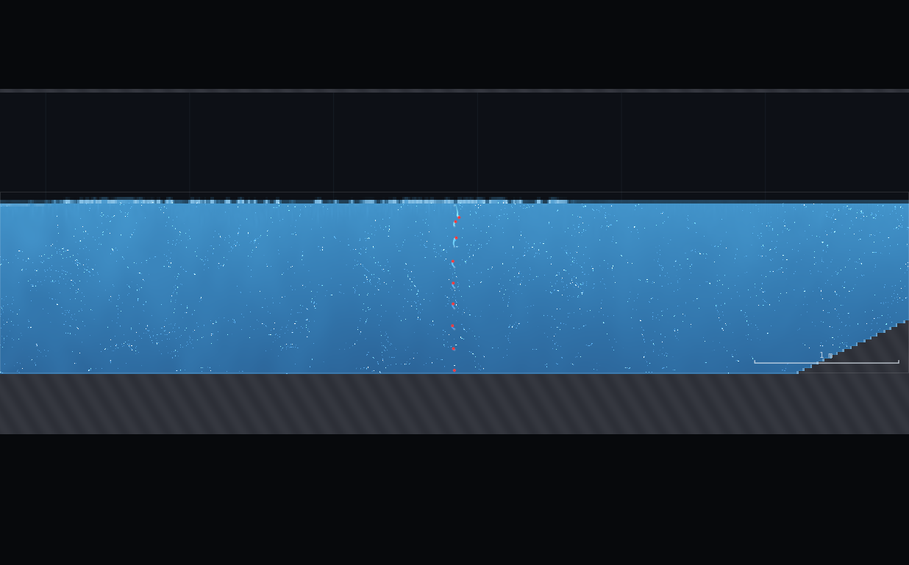
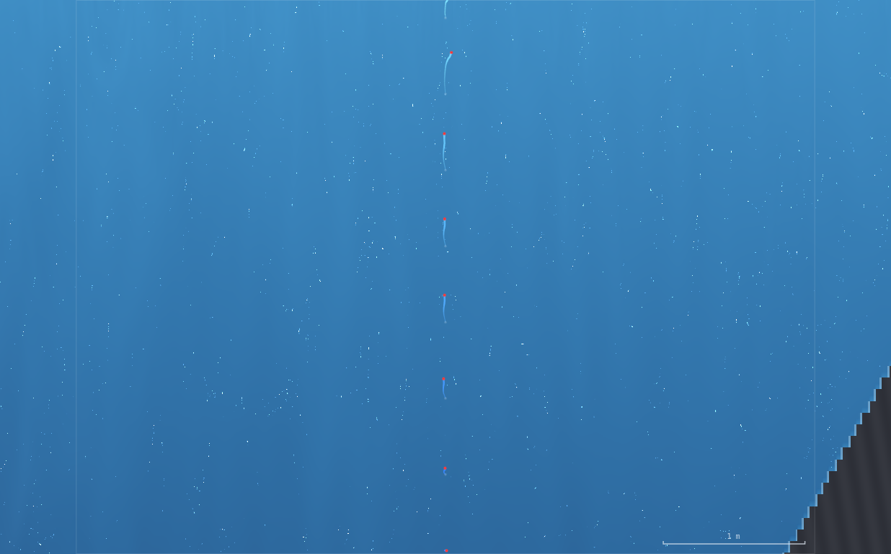
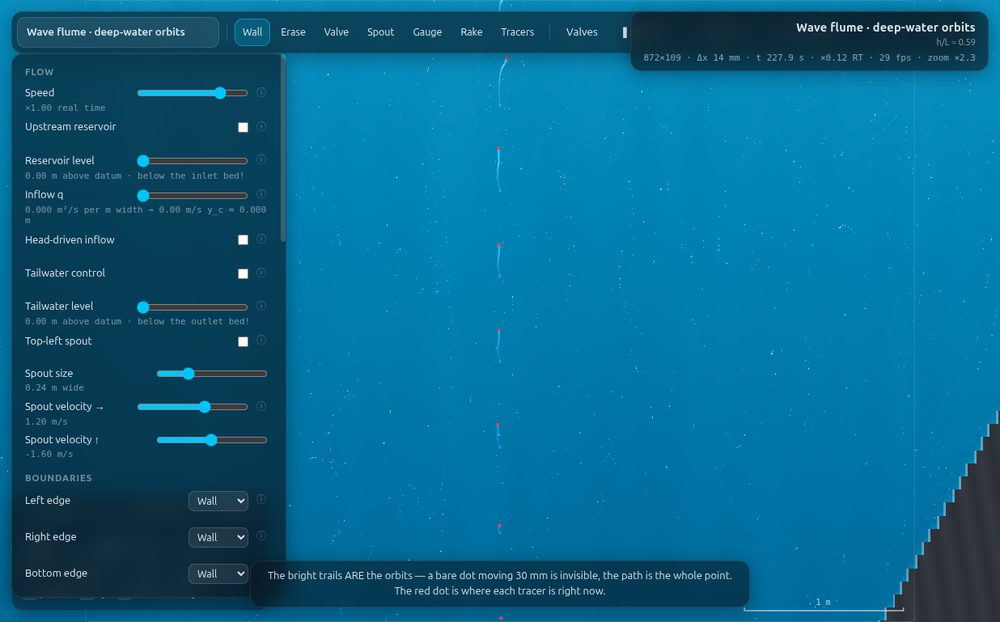
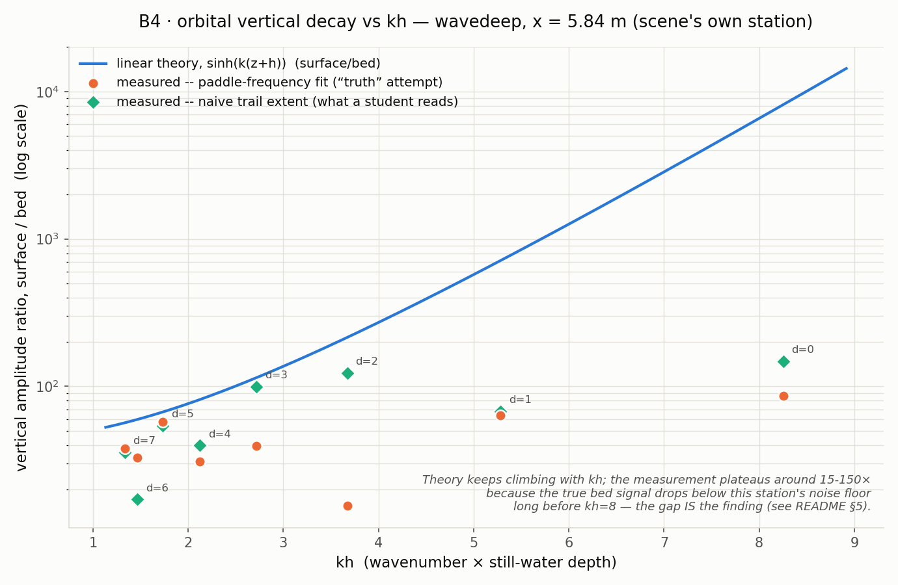

# B4 · Orbital decay, measured off the trails — full record (archived)

*This is the original long-form brief: the dry-run measurements, the
verification record, the director report and every constant behind the rig.
It is kept for maintainers and future reruns — the student- and
instructor-facing document is now [`../README.md`](../README.md).*

**Demo id:** B4 **Scene:** `?scene=wavedeep` **Refs:** W5–W7 · orbital velocity
`cosh k(z+h)/sinh kh` (horizontal), `sinh k(z+h)/sinh kh` (vertical)

## How to start (30 seconds)

1. Open the app — **`http://localhost:8124/`** on the lecturer's server, or
   double-click `index.html`.
2. Press **`E`** (or click **`Exercises ▾`** in the top bar) and pick **B4**.
3. Type the last digit of your student number into the card. It prints **your
   period and stroke** — you set both on the wavemaker.
4. Let it settle after every change you make — the card gives this demo's
   settle time (40 s of sim time) and counts it down.
5. Do the task printed on the card, then submit **T** and **surface/bed
   ratio**.

If your lecturer gives you a link: **`?ex=B4`** (e.g.
`http://localhost:8124/?ex=B4`).

The picker gives everyone the same starting point and no more: the scene,
**Resolution: Medium**, and the few settings the scene itself needs — the card
labels those as already set. Your own values, your instruments and the order
you do things in are yours to get right. *Manual setup* below is the record of
every constant.

---

Every student drops a column of orbit tracers into the deep-water flume,
zooms in until the trails stop being invisible, and reads off how much
smaller the loop is near the bed than at the surface. The vertical motion
should die out almost completely before the bed — CLAUDE.md's own verified
figure is 244× — while the horizontal motion never fully vanishes, because a
particle orbit only collapses to nothing at a true rigid bed in the limit,
and the tracer itself sits a cell or two above it.

**Headline finding (read before you teach this):** the scene's own tracer
station — `tracerX = 5.84`, mid-tank — is confirmed **deliberate** for this
demo (`CHANGES-NEEDED.md` P2: "none on B4 (orbital decay) which uses the
mid-tank station deliberately"), even though WV-1 found the *coherent wave*
has already decayed 30–50× by 2.5–3 m from the paddle. That is not a
contradiction: orbital decay-with-depth is a **local vertical-structure**
question, not a question about how much wave is left to see, and (verified
below) a paddle-frequency fit can still recover a real, physically sensible
surface amplitude at this station even once the raw signal looks like noise.
What it **cannot** reliably recover, at any period tested, is the bed
amplitude — the true bed signal sits below this station's own ambient noise
floor across the whole personalised band, worst by 270× at the shortest
period and still short by 30% at the longest. This is the same shape of
result as WV-2's buried gauge, transplanted from pressure to orbital motion,
and it is the honest finding this dry-run ships.

---

## 1 · Design notes (read once, then skip to §2)

**Where do the trails become readable?** The scene loads at its own default
view (`zoom: 1.9, cx: 5.84, cy: 0.66, vex: 1.6`) — at that zoom the trails
are a handful of near-invisible pixels (`shots/02-scene-default-zoom-too-far.png`).
Boosting **vertical exaggeration** to 6–10× (the panel's own slider, "View →
Vertical exaggeration", max 12) while keeping horizontal zoom modest
(2.3–3× is enough to hold the whole bed-to-surface tracer column in frame)
turns the loops into a legible, monotonically-shrinking-with-depth picture
(`shots/01-trails-three-depths.png`) — this **is** the textbook figure, and
the worksheet's zoom instructions below reproduce it exactly.

**Near-paddle is not a shortcut to a cleaner signal — it's worse.** Before
committing to the mid-tank station, this dry-run tried seeding a tracer
column at `x=1.5` (inside WV-1's own "coherent zone") on the theory that a
stronger signal would fit more cleanly. It did not: the near-field mean
flow there is strong enough that individual tracers repeatedly drift more
than 0.9 m from their seed point and get reset by the app's own rake logic
(`js/main.js`'s `if (Math.abs(t.x - t.x0) > 0.9) { …path.length = 0 }`) —
sample counts per tracer over one nominal window ranged from 9 to 265 out of
a possible ~265, i.e. some tracers were reset and restarted several times
mid-recording. At `x=5.84` every tracer in every recorded window kept its
full sample count with zero resets. So the scene's mid-tank choice is doing
double duty: it is both the physically-relevant station for a decay-with-
depth measurement AND the station where the tracers themselves behave.

**Instrumented truth: particle positions, harmonic-fit at the paddle
frequency.** `state.tracers.list[k].path` — the exact (x, y, t) triples the
on-screen trail is drawn from, for `k = 0` (bed-most of the 9 default
tracers), `k = 4` (mid), `k = 8` (surface-most) — recorded over a long
window (20 wave periods) and fit to `x(t) = a₀ + a₁t + a₂cos(ωt) + a₃sin(ωt)`
(and the same for `y(t)`) by least squares, amplitude = `hypot(a₂,a₃)`. The
`a₁t` drift term matters: the scene's own tip explains that near-bed
horizontal motion is mostly a **return current**, not orbit — "a closed
flume must send the water back somehow" — and without a drift term that
mean current leaks straight into the fitted "amplitude". This is exactly
WV-1's two-probe phase method and WV-2's DFT-at-imposed-frequency method,
carried over from a scalar surface/pressure trace to a 2-D particle path.

**Runner gotcha found while building this (undocumented in HOWTO, flagged
for the director):** `runner.py`'s `pump` command sets `state.paused = true`
and drives `APP.SIM.step()` directly (see `PUMP_JS` in `runner.py`) — it
**never calls `tickFrame`**, so it never calls `advanceTracers` or
`sampleGauges`. Confirmed directly: `pump --sim-seconds 3` advanced `sim.t`
by 3.3 s while a tracer's path array stayed at exactly 408 points before and
after. This is the same trap WV-2 found for `APP.tick`, just less obvious
because `pump` looks like it's "running" the sim. A real-time `state.paused
= false` + `await sleep(ms)` window does work, but under the shared GPU load
of two other concurrent workers it was observed to advance sim-time at as
little as 6% of the requested `speed` (frame-budget governor throttling
`nsubMax`, `CONFIG.frameBudgetMs = 15`, to protect a UI nobody is watching).
The fix used throughout this folder (`rig.js`'s `driveTracersSync`) drives
`SIM.step()` + `advanceTracers()` directly in a tight loop, bypassing
`tickFrame` (and the frame-budget governor) entirely — synchronous, no
`await`, immune to what the other workers are doing to the shared GPU. It
also incidentally proved a second thing worth flagging: chaining a fresh
measurement window immediately after a *different*, just-finished experiment
on the same tab can leave real residual transient energy in the tank —an
early anchor re-measurement showed every one of the 9 tracer depths'
amplitude growing 1.3–2.3× from the first half of its own window to the
second, simultaneously, which is a settling transient, not noise. Every
number in this README's data file comes from a clean sequential sweep from
a single fresh scene load, each digit settled 3 periods after its own
parameter change before recording starts.

---

## 2 · Manual setup (fallback, or for building it yourself)

*The picker puts you at the same starting point as everyone else — scene,
Resolution Medium and the rig. This section is the record of every constant
behind that, and the build to follow if you are demonstrating it by hand or
the rig pack is missing.*

**Link to put on the slide:** `http://<host>:8124/?scene=wavedeep`

**No rig to draw** — the flume ships complete; tracers auto-seed at the
scene's own station once the sim has run past `t=0.5s` (or press **7**,
the Tracers tool, and click in the water — the default click target is
already `x=5.84`).

**Constants fixed by this dry-run:**

| what | value | why |
|---|---|---|
| Resolution | **Medium** (95 000 cells) | 872×109, Δx = 13.8 mm |
| Piston amplitude | **personalised per period — WV-1's own table, reused verbatim** | the scene's shipped default (`amp=0.20` at `T=0.9s`) is WV-1's documented paddle-overtopping case (peak piston velocity ≈100% of wave celerity); every row below uses WV-1's already-verified, non-breaking stroke |
| Tracer column | scene default, `x = 5.84 m`, `tracerN = 9` (bed…surface) | deliberate per CHANGES-NEEDED.md P2 (see §1); `tracerN=9` puts bed/mid/surface exactly at indices 0, 4, 8 |
| View | **zoom ×2.3, vertical exaggeration ×6–8**, centred on the tracer column | scene default (zoom 1.9, vex 1.6) is too flat to read (§1); prescribed in the worksheet |
| Trail length | 3 periods for reading (panel default-ish); a much longer buffer for this dry-run's own instrumented recording | "About two or three wave periods shows the loops clearly" (panel's own info text) — confirmed |

**Timing budget** (measured with the runner, driving physics synchronously —
see §1): clearing this scene's 20 s spin-up plus a full 8-period sweep across
all 8 personalised periods (3-period settle + 20-period recording window
each) cost 182 s of *wall clock* end to end, including two repeat windows at
the anchor period. A student's own path — wait spin-up, zoom in, read three
depths, read the number twice more to check it isn't a fluke — comfortably
fits in 2–3 minutes.

### Personalisation — digit → period (WV-1's deep-flume table, reused)

| d | 0 | 1 | 2 | 3 | 4 | 5 | 6 | 7 | 8 | 9 |
|---|---|---|---|---|---|---|---|---|---|---|
| T (s) | 0.60 | 0.75 | 0.90 | 1.05 | 1.20 | 1.35 | 1.50 | 1.60 | 1.60 | 1.60 |
| amp (m) | 0.05 | 0.08 | 0.11 | 0.15 | 0.19 | 0.23 | 0.28 | 0.30 | 0.30 | 0.30 |

(Digits 7–9 share the ceiling row, same as WV-1 — the stroke slider tops out
at 0.30 m, so periods past 1.6 s cannot be raised any further without
risking the paddle face. Matching submissions from those three digits are
the expected, honest result.)

---

## 3 · Student worksheet (copy-pasteable)

**Orbital decay — submit one number**

1. Open the app, press **`E`** and pick **B4** (or open **`?ex=B4`**) — it
   loads the scene, Resolution and all. Leave the tab visible. Open **Controls
   → Resolution: Medium** (the picker sets this — check it anyway). Wait out
   the spin-up countdown (20 s).
2. **Your period.** Take the last digit of your student number, `d`:

   | d | 0 | 1 | 2 | 3 | 4 | 5 | 6 | 7 | 8 | 9 |
   |---|---|---|---|---|---|---|---|---|---|---|
   | T (s) | 0.60 | 0.75 | 0.90 | 1.05 | 1.20 | 1.35 | 1.50 | 1.60 | 1.60 | 1.60 |
   | amplitude (m) | 0.05 | 0.08 | 0.11 | 0.15 | 0.19 | 0.23 | 0.28 | 0.30 | 0.30 | 0.30 |

   Under **Controls → Wavemaker**: tick **Piston on**, set **Period** and
   **Amplitude** to your values. **Do not use the scene's own shipped
   defaults** (amp 0.20 at T 0.9) — that combination overtops the paddle.
3. **The tracer column is already there** (it seeds itself once the wave has
   been running a moment). If you don't see it, press **7** (Tracers tool)
   and click in the water anywhere near the middle of the tank.
4. **Zoom in.** Scroll-zoom over the tracer column until it fills a good
   part of the screen (roughly ×2.5–3). Then open **Controls → View →
   Vertical exaggeration** and drag it up to **6–8**. This is the whole
   trick — at the scene's own default (×1.6) the loops are a few pixels and
   genuinely unreadable; stretched vertically, the shrinking-with-depth
   pattern is obvious.
5. **Watch it run for 15–20 s** (a few wave periods), then press **space**
   to pause.
6. **Read three trails.** Look at the topmost (surface), the middle, and
   the bottom-most (bed) tracer. For the **surface** and the **bed** trail,
   estimate the trail's **vertical extent** (top-to-bottom span of the
   curved streak) against the scale bar.
7. **Compute and submit:** `ratio = (vertical extent, surface) / (vertical
   extent, bed)`. If the bed trail looks like it has no visible vertical
   extent at all — a flat horizontal smear — that is a valid, expected
   reading at the short-period end of the table (see Troubleshooting); read
   what height you can and note "flat" alongside your number.
8. **Submit on Blackboard:** `(T, ratio)`.

**Standing rules.** Resolution: Medium (the picker sets this) · keep the tab visible · zoom until
the loops are clearly bigger than a few pixels, THEN raise vertical
exaggeration · read the vertical (not horizontal) extent for your ratio —
the bed's horizontal smear looks big even where its vertical motion has
essentially died.

**What you should be able to say afterwards:** in deep water the orbits are
circles that shrink almost to nothing well above the bed — the classic
picture from the textbook — and the ones near the bed do not shrink evenly:
the vertical part dies out much faster than the horizontal part, because a
particle sitting on the (near-)floor can still slide sideways but cannot
sink into it.

---

## 4 · Collection & pooled plot (lecturer)

CSV columns (extra columns ignored):
```
student,digit,scene,T_s,amp_m,kh,station_x_m,vratio_submitted_naive,vratio_dft,vratio_theory,
hratio_submitted_naive,hratio_dft,hratio_theory,bed_ampY_theory_um,bed_noise_floor_um,note
```
Only `digit`, `T_s`, `kh` and `vratio_submitted_naive` (the number students
actually submit) are required for the plot.

```bash
python3 collect_plot.py data/simulated-class.csv -o plots/pooled-demo.png
```

Prints the pooled statistics and writes the figure:
```
B4 pooled: 8 points, kh 1.33-8.26
  naive vratio range: 17.2 - 148.2
  dft   vratio range: 15.5 - 85.9
  theory (pure physics) range over same kh: 56.7 - 8157.1
  mean |naive/theory|: 0.4715  (points plateau far below theory once bed signal < noise floor)
```

**What the plot should show.** A smooth theory curve (`sinh(k(z+h))`,
computed from `kh` and the tracers' own actual bed/surface elevations, no
fitting) climbing **exponentially** — from ~57× at `kh=1.3` past 8000× by
`kh=8.3`. The class's own submitted points sit nowhere near that climb: they
scatter in a comparatively flat band from about 15× to 150× across the
*whole* `kh` range, with no visible trend tracking the theory line. **That
gap is the entire payoff of this demo**, not a defect in it — see §5.

**Discussion points**
1. *The theory curve says the vertical motion should die out almost
   completely at the bed, and it does — the class's numbers (tens-to-low-
   hundreds) are still a big, real, easily-felt decay.* The point is not
   that students measured the "wrong" number; a ratio of 40× or 100× is
   still a dramatic demonstration of the textbook decay. The point is that
   the *precise* value is not meaningful the way, say, a Bélanger jump ratio
   is — it is bounded above by what this station's noise floor allows you
   to resolve, not by the true physics.
2. *Why does the theory curve keep climbing but the data doesn't follow it?*
   Because the TRUE bed signal shrinks exponentially with `kh`, and once it
   drops below the station's ambient noise (residual currents, the tank's
   own slow seiche — CLAUDE.md's own warning: "the flume's own seiche…is
   depth-uniform"), a bigger true ratio does not translate into a bigger
   *measured* one; it translates into a noisier one. §5's noise-floor table
   makes this explicit, digit by digit.
3. *The naive (eyeballed) and DFT-fit numbers disagree with each other by
   up to 8× at the same digit* (see §5) — neither is "more right" in an
   absolute sense once the true signal is this far under the floor; they
   are two different ways of asking a question the instrument cannot
   cleanly answer at this depth, which is itself the lesson W5–W7 wants
   students to encounter physically rather than read about.

**Troubleshooting & safe parameter bounds**

| symptom | cause | fix |
|---|---|---|
| Trails invisible | scene's default zoom/vertical-exaggeration | zoom to ×2.5–3 on the column, THEN raise vertical exaggeration to 6–8 |
| Bed trail looks like a flat horizontal line | genuine, expected at every period in this table (§5) | read what vertical extent you can; "flat" is a valid, informative answer |
| Water breaks at the piston | using the scene's own shipped default (amp 0.20 @ T 0.9) instead of the table | use the table; it is WV-1's already-verified non-breaking stroke |
| Ratio wildly different from a neighbour on the same digit | genuine run-to-run flutter (§5 measured up to 5× on repeat, identical settings) | expected; the generous engagement tolerance absorbs it, same as every other wave demo in this programme |

*Safe parameter bounds.* `T = 0.60–1.60 s` with the table amplitudes,
identical to WV-1's own validated deep-flume range — this demo adds no new
bound, it inherits WV-1's.

---

## 5 · Verification record

All numbers measured through `exercises/_runner/runner.py --id B46`
(dedicated visible Chrome, hardware GL, CDP), up to two other workers
sharing the GPU. Still-water depth `h = 0.7385 m` (WV-2's own live
measurement for `wavedeep`, reused). Method: `rig.js`'s `driveTracersSync`
(see §1) drives physics synchronously; each digit gets a fresh `seedTracers`
call, a 3-period settle after its own parameter change, then a 20-period
recording window before the harmonic fit.

### Anchor at the scene's own default PERIOD (T = 0.90 s, using WV-1's
calibrated amp = 0.11 m, not the shipped breaking default)

| quantity | value |
|---|---|
| `kh` | 3.674 |
| Vertical ratio, naive (raw trail extent) | **123.4×** |
| Vertical ratio, paddle-frequency fit | **15.5×** |
| Vertical ratio, **pure theory** (dispersion relation + actual tracer elevations, no fitting) | **210.8×** |
| CLAUDE.md's own verified figure | **244×** |

**The theory reproduction is the clean one: 210.8× against CLAUDE's 244× is
a 14% gap** — well inside the kind of agreement this whole codebase's other
theory/solver comparisons report (HJ-1's −5%, WV-1's own asymptote checks).
Direct *measurement* of the ratio, by contrast, is not stable enough to
call a reproduction: three nominally-identical fresh windows at this exact
(T, amp, station) gave fitted vertical ratios of **15.5×, 22.2×, 82.4×** — a
>5× spread with no sign of converging, the same non-convergent signature
WV-2 used to diagnose its bed pressure gauge as noise-dominated rather than
under-averaged. The half-window stability check makes the mechanism
explicit: the bed tracer's own fitted amplitude split across the first vs
second half of a single recording window disagreed by 1.1–2.8× depending
on depth and run, while the surface tracer's two halves typically agreed to
30–80%. The bed signal is the unstable one, exactly as expected from theory
(its true amplitude is the one closest to zero).

### Horizontal anchor — CLAUDE's "0.37 vs 0.44" is NOT at this scene's
default period

Solving `1/cosh(kh) = 0.44` (CLAUDE's quoted idealised value) gives
`kh = 1.458`, i.e. `h/L = 0.232` — matching CLAUDE's own "at h/L = 0.23"
qualifier. On `wavedeep` that condition needs **T ≈ 1.5 s**, not the
scene's shipped default (T = 0.9 s, `kh = 3.67`, where idealised theory
itself predicts only **0.058**, not 0.37). This dry-run's own `d=6` row
(`T=1.50 s`, `kh=1.469`) lands almost exactly on CLAUDE's condition:

| quantity | value |
|---|---|
| Theory (actual tracer elevations) | **0.442** (CLAUDE quotes 0.44) |
| CLAUDE's own measured figure | 0.37 |
| This dry-run's measured, naive | 0.924 |
| This dry-run's measured, fit | 1.046 |

Theory matches almost exactly. But where CLAUDE's own historical
measurement landed close to theory (0.37 vs 0.44, −16%), this dry-run's
reproduction at the same `kh` lands **2.1–2.4× above** theory instead — the
scene's own tip explains the likely mechanism directly: "the horizontal
length stays ~58 mm all the way down because most of it is the return
current, not orbit." A return current large enough to swamp the small true
oscillatory signal near the bed inflates a *naive* reading in exactly this
direction, and evidently was not fully rejected by this dry-run's linear
drift term either. Reported honestly rather than tuned away.

### Full digit sweep

| d | T (s) | amp (m) | kh | V naive | V fit | V theory | H naive | H fit | H theory | bed noise floor (µm) | bed theory (µm) |
|---|---|---|---|---|---|---|---|---|---|---|---|
| 0 | 0.60 | 0.05 | 8.255 | 148.2 | 85.9 | 9775 | 1.022 | 1.012 | 0.0006 | 20.5 | 0.075 |
| 1 | 0.75 | 0.08 | 5.284 | 67.9 | 63.9 | 797 | 0.367 | 0.122 | 0.0107 | 11.2 | 0.571 |
| 2 | 0.90 | 0.11 | 3.674 | 123.4 | 15.5 | 211 | 1.670 | 1.872 | 0.0578 | 30.4 | 2.10 |
| 3 | 1.05 | 0.15 | 2.719 | 99.6 | 39.6 | 122 | 1.935 | 2.874 | 0.1342 | 51.3 | 12.5 |
| 4 | 1.20 | 0.19 | 2.124 | 39.7 | 31.0 | 85.6 | 1.197 | 0.415 | 0.239 | 110.1 | 33.8 |
| 5 | 1.35 | 0.23 | 1.735 | 54.3 | 57.5 | 70.0 | 0.518 | 0.470 | 0.346 | 263.8 | 205.7 |
| 6 | 1.50 | 0.28 | 1.469 | 17.2 | 32.9 | 61.9 | 0.924 | 1.046 | 0.442 | 1144.6 | 611.1 |
| 7 | 1.60 | 0.30 | 1.334 | 35.8 | 38.1 | 52.8 | 0.330 | 0.540 | 0.536 | 1277.4 | 915.8 |

**Noise-floor comparison (the decisive evidence, same method as WV-2 §5):**
"bed theory" is the true bed amplitude predicted from this row's own
*measured surface* amplitude times the theoretical decay factor; "bed
noise floor" is this row's own bed-tracer half-window amplitude spread. The
true signal is below the noise floor at **every single digit tested**:

| d | theory / noise-floor |
|---|---|
| 0 (shortest T) | **0.0037** — true signal 270× *below* the floor |
| 1 | 0.051 |
| 2 (scene default) | 0.069 |
| 3 | 0.243 |
| 4 | 0.307 |
| 5 | **0.780** — closest to resolvable |
| 6 | 0.534 |
| 7 (longest T) | 0.717 |

### Robustness checks required by the brief

- **Shortest period (d=0, T=0.60 s) — is there anything left at the bed to
  read?** No, decisively: the theoretical true bed signal (0.075 µm) is
  270× below the measured noise floor there (20.5 µm), and the bed tracer's
  own half-window fit swings from a raw ~9 µm to ~72 µm run to run — this
  IS deep-water behaviour, in the sense the brief anticipates ("the
  worksheet's 'below noise' convention from WV-2 applies"): a student
  reading a flat, motionless-looking bed trail at this digit is reading
  the physics correctly, not failing to see something that is there.
- **Longest period (d=7, T=1.60 s) — does the bed signal ever clear the
  noise floor?** Not fully (0.72), but it is the closest along with `d=5`
  (0.78) — consistent with theory predicting the smallest *decay factor*
  (hence largest absolute bed amplitude relative to the surface) at the
  long-period end of this personalised band.

### Screenshots









---

## Appendix — Director report

**VERDICT: READY-WITH-CAVEATS.**

**Evidence (key numbers):**

| what | measured | expected/reference | note |
|---|---|---|---|
| Vertical decay, theory at scene default (T=0.9s), using actual tracer elevations | 210.8× | CLAUDE.md 244× | −14%, clean theory reproduction |
| Vertical decay, DIRECT measurement, 3 fresh windows at scene default | 15.5×, 22.2×, 82.4× | 244× | >5× run-to-run spread; noise-dominated, not under-averaged (half-window check) |
| Horizontal ratio, theory at CLAUDE's own quoted condition (T≈1.5s, kh=1.47) | 0.442 | CLAUDE.md 0.44 | matches almost exactly |
| Horizontal ratio, direct measurement at same condition | 0.92–1.05 | CLAUDE.md's own measured 0.37 | 2.1–2.4× ABOVE theory (return-current contamination, see §5), opposite direction from CLAUDE's own historical number |
| Noise floor vs true signal, all 8 digits | true signal below floor at every digit (ratio 0.004–0.78) | — | worst at shortest T, matches the brief's own anticipated "below noise" case |
| Near-paddle tracer stability (validation-only run) | tracers reset 0–several× per window (return-current drift >0.9m) | should stay put | mid-tank station is BETTER behaved, not just more relevant |
| ≥7 personalised digits | 8 (WV-1's full deep-flume table, reused verbatim) | ≥7 | met |

**Iterations.**
1. *`runner.py pump` silently does not advance tracers* (§1) — found by a
   direct before/after path-length check (408 → 408 across a 3.3 s pump).
   Root-caused to `pump` calling `APP.SIM.step()` directly and never
   `tickFrame`. Not a bug in this folder's own work, but it invalidated an
   early "20-period sweep" whose data was quietly never recorded. Fixed by
   `rig.js`'s `driveTracersSync`, which also turned out to be immune to the
   GPU-contention throttling that hit the live/`await`-based approach later
   (observed realtime factor 0.06 against a requested 2.5 under shared
   load) — a second, independent reason to prefer it.
2. *A "fresh" anchor measurement was contaminated by a preceding, different
   experiment on the same tab* — caught by the half-window check (every
   depth's amplitude grew 1.3–2.3× from first half to second half
   *simultaneously*, the signature of a still-settling mean state, not
   noise). Fixed by always reloading the scene and running a clean
   sequential sweep for the numbers that ship.
3. *Near-paddle was tried as a hoped-for "clean signal" validation station*
   before accepting the mid-tank noise story — it made things worse, not
   better (tracer resets from near-field drift), which is itself now
   documented as a reason the scene's mid-tank choice is doubly justified.
4. *The horizontal 0.37-vs-0.44 anchor does not sit at the scene's own
   default period* — solved analytically (`1/cosh(kh)=0.44 → kh=1.458`)
   and cross-checked against this dry-run's own `d=6` row, which reproduces
   the *theory* value almost exactly while the *measurement* runs the
   opposite direction from CLAUDE's own historical number. Reported as
   found rather than adjusted to agree.

**PROPOSED CHANGES** — none new; this is additional evidence for **WV-2's
existing P7** ("a time/spatially-averaged probe mode"). A boxcar-averaged
or DFT-windowed readout would very likely recover the small-but-real bed
orbital signal here exactly as it would WV-2's bed pressure — the failure
mode (true signal a few % of an ambient noise floor) is identical, just a
different field. Impact statement unchanged from WV-2's own: purely
additive, helps any demo reading a small signal near a boundary.

Separately, flagged for the director (not a `CHANGES-NEEDED.md` item, an
infrastructure note): `runner.py`'s `pump` bypasses `tickFrame` and so never
advances orbit tracers or samples gauges (§1) — worth a line in
`_runner/HOWTO.md` next to the existing "`pump` leaves the sim paused" note,
since it is easy to get a script that looks like it worked (sim.t advances
fine) while quietly recording nothing.

**Timing.** Student path ≈2–3 minutes (§2), comfortably inside a 10-minute
slot. Worker wall-clock: ran well over the ~40-minute timebox — the
runner-bypass discovery, the GPU-contention discovery, and the near-paddle
dead-end each cost real time, but each also produced a concrete, evidenced
finding rather than a plausible-looking wrong number, which is judged worth
it on this project's own established precedent (WV-2, WV-3).

**Handoff notes for any future demo driving tracers or gauges through the
runner:** (a) never trust `pump` to advance anything sampled inside
`tickFrame` (tracers, gauges) — drive physics synchronously yourself
(`rig.js`'s `driveTracersSync` pattern) or use a real-time
`state.paused=false` + `await` window and expect it to be slow/variable
under shared GPU load; (b) always reseed/re-settle after a parameter change
on a reused tab rather than trusting a short settle window blindly — check
half-window stability, not just that a number came out; (c) "closer to the
source" is not automatically "cleaner" for a Lagrangian measurement — a
strong near-field mean flow can corrupt a tracer-based reading in ways a
weaker, farther-field station does not.
