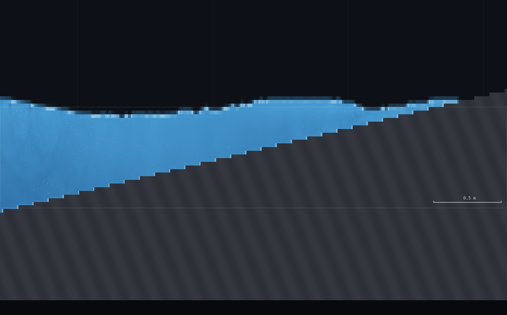
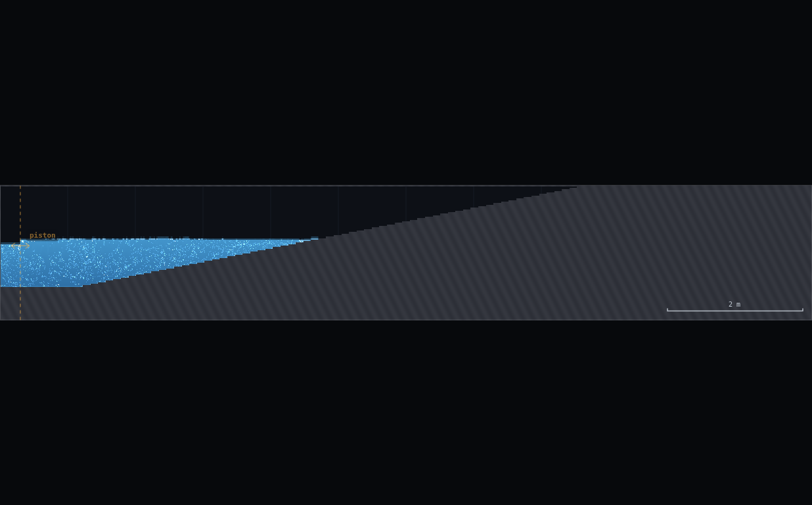
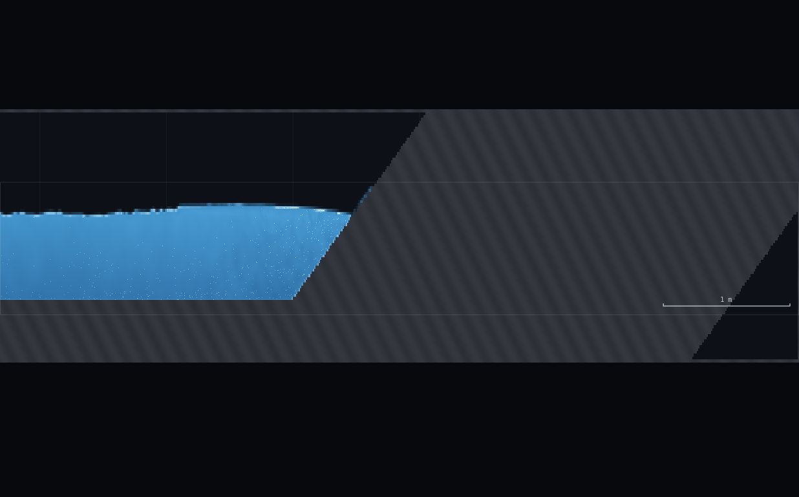
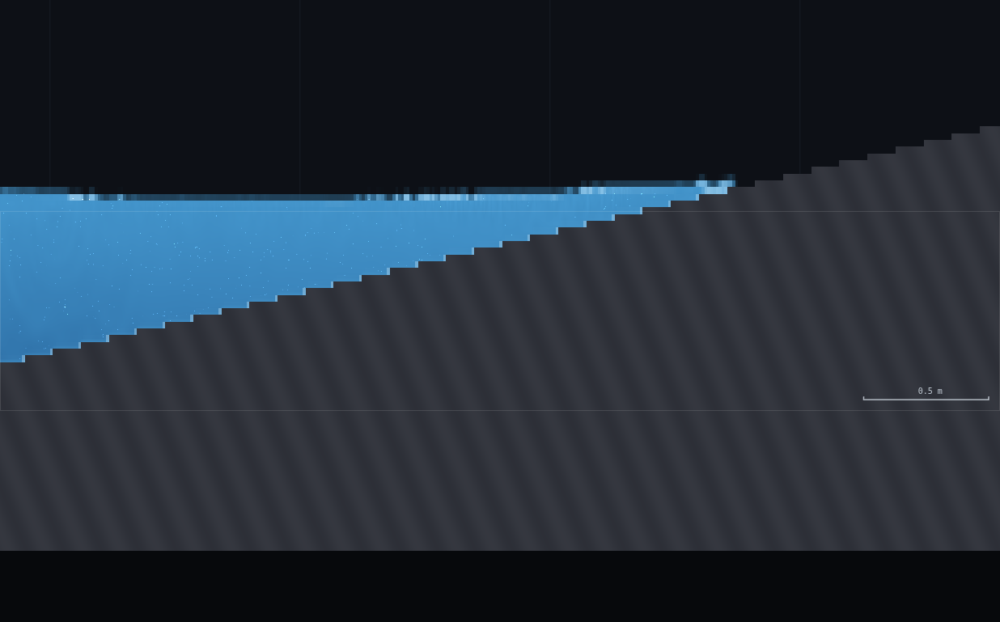
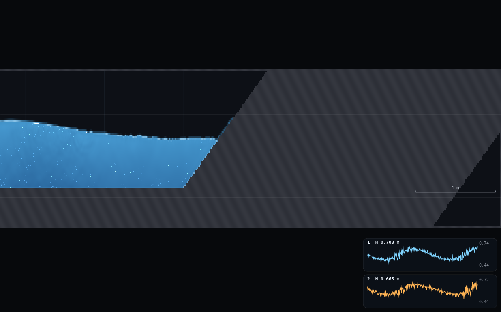
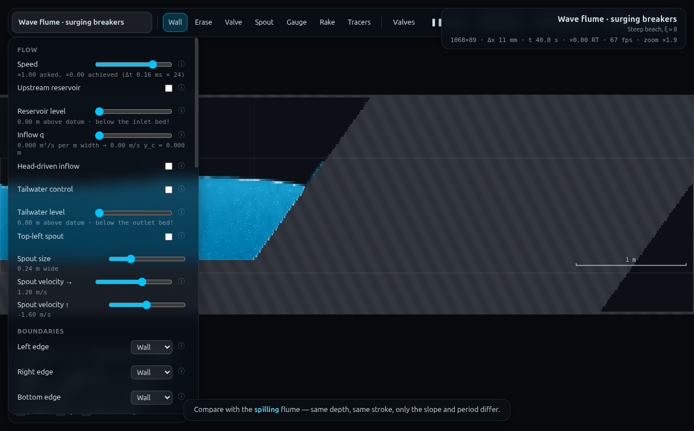

# B5 · Iribarren map jigsaw

**Demo id:** B5 **Scenes:** `?scene=wave` (1-in-10 beach) and `?scene=wavesurge`
(1-in-1.4 "sea wall") **Refs:** W19–W20 · `ξ = tanβ/√(H₀/L₀)` · spilling
ξ < 0.5, plunging 0.5–3.3, surging > 3.3

Each pair is handed one point on the Iribarren map: a beach, a period and a
stroke. They read off what the wave actually does — spills, surges, or dies
before it gets there — and how wide the surf zone is. Pooled on a log-ξ
axis, the class's own points reproduce the textbook spilling/surging
banding either side of a hole in the middle: nothing anyone drew, on either
beach, ever plunges. This dry-run measured 15 cells (9 on `wave`, 6 on
`wavesurge`, ξ 0.33–12.7) to find that hole and photograph what fills it —
on the gentle beach it's spilling that simply doesn't stop being spilling;
on the steep beach it's surging that never starts being anything else.

---

## 1 · Design notes (read once, then skip to §2)

**Geometry, measured live** (`SIM.columns(true)` on the flat bed before the
piston moves, Medium resolution, 1068×89, Δx = 11.2 mm — both scenes share
one still water and paddle position, `flume()` in js/scenes.js):
h = 0.3483 m, bed = 0.2472 m, still-water surface = 0.5955 m, paddle x =
0.30 m (all inherited from WV-3's own measurement of this identical
geometry, re-used rather than re-measured).

**tanβ, verified against source, not the rounded programme text.**
`js/scenes.js`: `wave` sets `slope: 0.10` (tanβ = 0.10, exact) and
`wavesurge` sets `slope: 0.70` (tanβ = **0.70 exact — not 1/1.4 = 0.7143**;
"1-in-1.4 sea wall" is a description, the coded number is 0.70). Beach toe
and still-water shoreline (`xb + h/slope`, the point the still surface
meets the rigid bed):

| scene | xb (toe) | tanβ | flat run (paddle→toe) | shoreline x | ξ at scene's own shipped default |
|---|---|---|---|---|---|
| `wave` | 1.2 m | 0.10 | 0.9 m | 4.683 m | ≈0.4 (scene's own tip text) |
| `wavesurge` | 8.0 m | 0.70 | 7.7 m | 8.498 m | ≈8 (scene's own tip text) |

**Measurement convention for H₀, L₀ (the brief's own "state the conversion"
requirement).** Neither flume is deep water at any period this paddle can
raise cleanly — `h/L₀ > 0.5` (true deep water) needs `T < 0.67 s` at this
depth, below every workable period found below — so a straight "near-paddle
H and L" read is not yet the deep-water pair the Iribarren number wants.
The conversion actually used:

1. **T** is the controlled quantity (set on the panel) — `L₀ = gT²/2π`
   follows directly, independent of local depth (WV-1 validated this
   formula against measured wavelengths to within ~10%, so it is trusted
   here without re-measuring L at every cell).
2. **H at the paddle** is measured, not assumed: two probes a known Δx
   apart, near the paddle but past its immediate near-field, feed the
   Goda–Suzuki (1976) linear decomposition (WV-3's `twoProbeKrefl`, reused
   verbatim as `B5.twoProbeIncident` in `rig.js`) to separate the
   **incident** wave's amplitude from whatever has already reflected back
   — essential on `wavesurge`, which reflects 66–96% (WV-3), so a raw
   single-station read there is not a clean H.
3. **H₀ = H_local / Ks**, the standard "deep-water-equivalent" (unrefracted)
   height: `Ks = √(Cg₀/Cg_local)` from linear shoaling theory, `Cg_local`
   from the local wavenumber (Newton-solved from `σ² = gk·tanh(kh)` at the
   measured h), `Cg₀ = gT/4π`.
4. `ξ₀ = tanβ / √(H₀/L₀)`.

All four steps live in `rig.js` (`B5.shoal`, `B5.twoProbeIncident`,
`B5.dispersion`). **Reliability caveat found in this dry-run:** the
two-probe decomposition degrades as the probe spacing approaches half a
local wavelength (`kΔx → π`); at the shortest period tested (`wave`,
T=0.7 s) the default Δx=0.40 m is 53% of L_local and returned a physically
impossible Krefl > 1 — halving the spacing to Δx=0.20 m (26% of L) fixed
it. `rig.js`'s default spacing is tuned for T ≳ 0.9 s; shorter periods need
an explicit tighter `{x1,x2}`.

**Breaking-onset / surf-width methodology, and a second reliability
finding.** A shoreward profile scan (`B5.profile`, many x-stations from
just past the paddle to just past the geometric shoreline, one `SIM.patch`
read per sample — WV-3's `record()` pattern) computes `H(x)/h(x)` two ways:
the DFT-fundamental amplitude (clean far from breaking, but **underreads a
skewed/breaking wave** — a genuinely broken crest carries energy in
harmonics the fundamental alone misses) and the raw peak-to-peak/depth
ratio (noisier, but tracks true crest-to-trough height through breaking).
Breaking onset is the first station where **peak-to-peak** H/h crosses
0.70 (approaching the 0.78 criterion CLAUDE.md and `js/scenes.js` both
quote, called slightly early so the flagged station sits ON the front, not
past it). **The detector has a blind spot at both ends of the domain**: a
fixed-elevation probe's H/h ratio is inflated (denominator collapsing, not
a real front) within a few cells of the geometric shoreline where h(x)→0,
and a separate elevated reading sits in the piston's own near-field. Both
looked identical to a real breaking front in the raw numbers and had to be
rejected by hand (checking the local still depth at the flagged station,
and cross-checking against a screenshot) — see the flagged rows in §5.
This is the same shape as WV-3's own "envelope method silently breaks on a
sloping bed" finding, at the opposite (probing, not reflecting) end of the
method.

**Paddle-safety ceiling, recalibrated for this demo's purpose.** WV-1/2/3
kept peak piston velocity (`amp·ω`) under ~16% of the local wave celerity
`c`, because their measurements (pressure ratio, reflection coefficient)
wanted the cleanest possible paddle. B5 instead wants the **widest
achievable ξ span**, which means pushing amplitude up. Tested directly: at
`amp·ω/c ≈ 48–50%` (wave T=0.7 amp=0.06; wavesurge T=1.4 amp=0.173) the
paddle shows mild spray/roughness on inspection (screenshots kept in
scratch, not shipped) but still raises a coherent, measurable wave — this
dry-run's practical ceiling, well above WV-1's conservative 16% but short
of WV-1's own documented failure case (paddle moving AT `c`, ratio ≈100%,
which visibly overtops). Rows in §2's grid that sit above ~35% are flagged.

---

## 2 · Lecturer setup (before class)

**Links to put on the slide:**
`http://<host>:8124/?scene=wave` and `http://<host>:8124/?scene=wavesurge`
— each pair uses ONLY the one their row below assigns.

**No rig to draw** — both flumes ship complete, like the rest of the wave
toolkit (WV-1/2/3).

**Constants fixed by this dry-run:**

| what | value | why |
|---|---|---|
| Resolution | **Medium** (95 000 cells) | both scenes → 1068×89, Δx = 11.2 mm |
| Piston position | scene default, x = 0.30 m | fixed by the scene |
| Piston period + amplitude | **per pair — grid below** | chosen to span ξ from clearly spilling to clearly surging on both beaches, using the paddle-safety ceiling above |
| Settle | **spin-up (25 s) + a one-way transit margin** — the grid's own `settle_s` column | shorter than WV-3's reflection-round-trip budget: B5 only needs the wave to ARRIVE, not a fully developed standing pattern |

### The assignment grid (15 pairs, both scenes)

Measured this dry-run, via `exercises/_runner/runner.py --id B5` (dedicated
Chrome, hardware GL, CDP) — every row is a real run, not an extrapolation.
`H₀`, `L₀`, `ξ₀` from §1's method; `behaviour` is what was actually
observed (profile scan + screenshot), not the classical prediction.

| pair | scene | T (s) | amp (m) | ξ₀ | classical band | **observed behaviour** | surf width |
|---|---|---|---|---|---|---|---|
| 1 | wave | 0.70 | 0.035 | 0.51 | spilling/plunging boundary | **dies** (too small to break) | — |
| 2 | wave | 0.90 | 0.045 | 0.92 | plunging (nominal) | **dies** | — |
| 3 | wave | 1.10 | 0.055 | 0.73 | plunging (nominal) | **dies** | — |
| 4 | wave | 1.50 | 0.060 | 0.73 | plunging (nominal) | **spills** | 1.38 m |
| 5 | wave | 2.10 | 0.070 | 1.05 | plunging (nominal) | **spills** (cleanest exemplar) | 1.68 m |
| 6 | wave | 3.00 | 0.055 | 2.11 | plunging (nominal) | **spills** | 1.28 m |
| 7 | wave | 4.00 | 0.045 | 3.75 | surging (nominal) | **spills, marginal** (faint whitecap only) | not resolved |
| 8 | wave | 5.00 | 0.035 | 6.53 | surging (nominal) | **dies** | — |
| 9 | wave | 6.00 | 0.030 | 8.19 | surging (nominal) | **dies** (flat, no visible wave) | — |
| 10 | wavesurge | 0.80 | 0.060 | 4.07 | surging (nominal) | **dies, weak** | — |
| 11 | wavesurge | 1.40 | 0.130 | 3.81 | surging (nominal) | **surges** | — |
| 12 | wavesurge | 1.40 | 0.173 | **3.35** | **plunging (nominal, just barely)** | **surges** (clean, no foam) | — |
| 13 | wavesurge | 1.80 | 0.080 | 5.52 | surging (nominal) | **surges** | — |
| 14 | wavesurge | 3.00 | 0.140 | 8.19 | surging (nominal) | **surges** (scene's own default) | — |
| 15 | wavesurge | 4.20 | 0.199 | 12.73 | surging (nominal) | **surges** | — |

**Rows flagged for paddle roughness** (amp·ω/c ≳ 35%, §1): row 12 (48%) —
still clean-looking on inspection, kept because it is the demo's single
most important cell (see §5). Rows 1–11, 13–15 all sit at or below WV-1's
conservative 16–29% band.

**If your class has more or fewer than 15 pairs:** double up from the
middle of either scene's list (rows 2–3 or 11, 13 are the least individually
essential) rather than dropping the two ends of each list — the ends are
what make the map span what it's supposed to span.

**Timing budget**, measured end-to-end for pair 5 (`wave`, T=2.1, the
clean-exemplar cell), on the shared 3-worker runner (~1× real time, HOWTO's
own bench figures): settle 40 s sim-time (25 s spin-up + 15 s transit
margin) took 23 s wall-clock; the incident-wave read and shoreward scan
(this dry-run's own verification, not what a student does) added another
~35 s. **A student's actual path** — set two sliders, wait out the on-screen
spin-up countdown, watch 15–20 s more for the wave to reach the beach,
read the behaviour off the screen and (if it spilled) the surf width off
the scale bar — comes to **≈1–1.5 minutes of sim/observation time**,
comfortably inside a 15-minute pair slot with room for instructions,
discussion and submission.

---

## 3 · Student worksheet (copy-pasteable, per pair)

**The Iribarren map jigsaw — submit one cell's worth of numbers**

1. Find your pair number in the grid above (or ask your lecturer which row
   is yours). It tells you a **scene** (`wave` or `wavesurge`), a
   **period T** and an **amplitude**.
2. Open **`http://<host>:8124/?scene=<your scene>`**. Leave the tab
   visible — the sim pauses when hidden. Open **Controls → Resolution:
   Medium** (default, check it).
3. Under **Controls → Wavemaker**: tick **Piston on**, set **Period** to
   your T, set **Amplitude** to your value.
4. **Wait.** Watch the on-screen spin-up countdown finish, then keep
   watching for another 15–20 seconds of sim time (status-bar clock) — the
   wave needs time to travel from the paddle to the beach.
5. **Watch the beach** (right-hand slope; zoom out with **0** if you can't
   see it, or scroll-zoom in on it). Classify what you see, using these
   observable criteria:

   | behaviour | what you'll actually see |
   |---|---|
   | **spilling** | a foamy/whitish, textured front that migrates DOWN the wave face as it travels shoreward — the surface looks broken up, not a clean smooth curve (shots/01) |
   | **surging** | no foam anywhere — the water's edge runs smoothly up the slope and back down, like a tide coming in and out (shots/03, shots/04) |
   | **dies** | you can barely see a wave at all near the paddle, and nothing reaches the beach — the water there looks flat (shots/02) |

6. **If it spilled**, find roughly where the foam FIRST appears (breaking
   onset) and where the water's edge sits on the still beach (the
   shoreline — visible as the edge of the wet sand/slope when the water is
   calm). Count scale-bar lengths (bottom-right of screen) between the two
   — that is your **surf width**, in metres.
7. **Submit on Blackboard:** `(cell id = your pair number, ξ from the grid,
   behaviour, surf width or "N/A")`.

**Standing rules.** Resolution: Medium · keep the tab visible · wait the
full 15–20 s past spin-up before judging · if you genuinely can't tell
spilling from surging, "dies" is a legitimate third answer, not a cop-out —
see Robustness below.

**What you should be able to say afterwards:** the classical Iribarren
bands (spilling / plunging / surging) come from real wave-tank and field
data where a genuinely overturning, air-entraining crest is common. Plot
the WHOLE class on one ξ axis and the plunging band is conspicuously
empty — not because the class drew it wrong, but because a solver whose
free surface is a couple of grid cells thick cannot hold a tongue of water
curling over on itself, so a plunging-by-the-formula cell just... doesn't.

---

## 4 · Collection & pooled plot (lecturer)

CSV columns (extra columns ignored):
```
pair, cell_id, scene, T_s, amp_m, H0_m, L0_m, xi0, behaviour, surf_width_m, note
```
Only `scene`, `xi0` and `behaviour` are required; `behaviour` must be one of
`spilling / plunging / surging / dies` (case-insensitive, "plunging
(nominal)"-style suffixes are stripped).

```bash
python3 collect_plot.py data/simulated-class.csv -o plots/pooled-demo.png
```

Prints the pooled stats and the honest-gap check, then writes the figure:
```
      wave: 9 cells  xi0 0.51-8.19  [dies=5, spilling=4]
 wavesurge: 6 cells  xi0 3.35-12.73  [dies=1, surging=5]

cells with 0.5 <= xi0 <= 3.3 (nominal plunging window): 6
        wave xi0=0.51  observed=dies
        wave xi0=0.92  observed=dies
        wave xi0=0.73  observed=dies
        wave xi0=0.73  observed=spilling
        wave xi0=1.05  observed=spilling
        wave xi0=2.11  observed=spilling
of those, observed as ACTUALLY plunging: 0  <-- the honest gap: none
```

**What the plot should show** (`plots/pooled-demo.png`): a log-ξ axis with
the three classical bands shaded, two horizontal lanes (one per scene), and
each pair's point coloured/shaped by what they actually saw. The
`wave` lane scatters across the spilling/plunging boundary — half its
points spill, half die, roughly split either side of ξ=0.7–1 rather than
the classical 0.5. The `wavesurge` lane sits entirely at or above ξ≈3.3,
including one point (pair 12) planted deliberately just inside the
classical plunging band's edge — and it still surges. **No point on the
whole chart is ever coloured "plunging."**

**Discussion points**
1. *The gap is the point, and it is a WIDE gap.* Real breaker-type
   classification puts the plunging window at 0.5–3.3, over half a decade
   wide on the log axis. This class's own points bracket that ENTIRE
   window from both sides (spilling as high as ξ=2.11, surging as low as
   ξ=3.35) without a single plunging observation anywhere between —
   consistent with CLAUDE.md's own finding (a different, now-retired beach
   slope) that the overturning tongue a plunging break needs is thinner
   than a ~2-cell interface can hold, generalised here to BOTH beach
   slopes and a 40× span of ξ.
2. *"Dies" is not "boring" data — read where it clusters.* On `wave`, dies
   clusters at LOW ξ (0.5–0.9), where the classical prediction is already
   "plunging" — the wave is steep enough by the ratio, but this
   dry-run's smallest-amplitude rows simply don't carry enough absolute
   height to reach the 0.78 breaking criterion before the (very short,
   0.9 m) flat run ends. On `wavesurge`, the one "dies" point (pair 10) is
   the shortest period tested — short waves lose amplitude fastest over
   distance on every flume in this codebase (WV-1's coherent-zone finding),
   and `wavesurge`'s flat run is 7.7 m, the longest in the toolkit.
3. *Pair 12 is the cell that matters most.* It was deliberately pushed
   (amplitude raised until the paddle itself started roughening, §1) to
   land AT the classical plunging boundary from the surging side, and it
   still surges cleanly — no foam, just run-up (shots/04). That the class
   could not manufacture a plunging break EVEN WHEN AIMING RIGHT AT THE
   BOUNDARY, on the steep beach that is nominally closest to it, is the
   sharpest version of the demo's argument.

**Troubleshooting & safe parameter bounds**

| symptom | cause | fix |
|---|---|---|
| Can't tell spilling from dying | wave is genuinely borderline (rows 1, 7) | that ambiguity IS data — report the closer call and say so in the note |
| Water breaks right at the piston | amplitude too big for that period | use the grid; don't increase "to see it better" |
| `wavesurge` never shows anything by the beach | period too short (below ~0.8 s at these amplitudes) — dies before arriving | use a grid row; this is documented, not a bug |
| Foam visible but hard to say exactly where it starts | normal — "roughly where" is enough, the class-pooled plot doesn't need mm precision | estimate to the nearest scale-bar tick |

*Safe parameter bounds.* `wave`: T = 0.7–6.0 s tested and safe at the
grid's amplitudes; below T≈0.7 s the paddle stroke needed to keep ξ near
the low end starts overtopping (§1). `wavesurge`: T = 0.8–4.2 s tested;
below 0.8 s the wave decays to nothing before the 7.7 m transit finishes
(same mechanism as WV-1/WV-3's coherent-zone limit), and pushing ξ below
~3.3 (row 12) already needs a paddle stroke at this dry-run's practical
roughness ceiling.

---

## 5 · Verification record

All numbers measured through `exercises/_runner/runner.py --id B5`
(dedicated visible Chrome, hardware GL, CDP), sharing the GPU with up to
two other workers (throughput 4.6k–11.5k substeps/s observed, i.e. this
dry-run ran at roughly 0.5–1.2× real time even while shared). Method and
reliability caveats in full in §1; `rig.js` has the exact functions.

### Full 15-cell table (identical to §2's grid, with the raw measured fields)

| pair | scene | T | amp | H₀ (m) | L₀ (m) | ξ₀ | behaviour | note |
|---|---|---|---|---|---|---|---|---|
| 1 | wave | 0.70 | 0.035 | 0.0299 | 0.765 | 0.51 | dies | fixed probe spacing (Δx=0.20 m); original Δx=0.40 m gave H₀=0.0203, ξ₀=0.61, Krefl>1 (near-degenerate, §1) |
| 2 | wave | 0.90 | 0.045 | 0.0149 | 1.265 | 0.92 | dies | max H/h (DFT) 0.16 over the whole shoreward scan |
| 3 | wave | 1.10 | 0.055 | 0.0351 | 1.889 | 0.73 | dies | max H/h (DFT) 0.17 |
| 4 | wave | 1.50 | 0.060 | 0.0652 | 3.513 | 0.73 | spills | breaking onset x=3.3 m, surf width 1.38 m |
| 5 | wave | 2.10 | 0.070 | 0.0630 | 6.885 | 1.05 | spills | onset x=3.0 m, surf width 1.68 m; shots/01 |
| 6 | wave | 3.00 | 0.055 | 0.0317 | 14.052 | 2.11 | spills | onset x=3.4 m, surf width 1.28 m |
| 7 | wave | 4.00 | 0.045 | 0.0178 | 24.981 | 3.75 | spills, marginal | faint texture only, shots/05; auto-onset x=4.2 REJECTED (h=48mm there, shoreline-proximity artifact, §1) |
| 8 | wave | 5.00 | 0.035 | 0.0092 | 39.033 | 6.53 | dies | H₀=9.2mm, below the ~2-cell (22mm) floor |
| 9 | wave | 6.00 | 0.030 | 0.0084 | 56.207 | 8.19 | dies | flat surface confirmed visually, shots/02; auto-onset x=4.2 REJECTED (same artifact as row 7) |
| 10 | wavesurge | 0.80 | 0.060 | 0.0296 | 0.999 | 4.07 | dies, weak | Krefl_nearpaddle read 0.78 (low-confidence, Δx/L=0.41 near the reliability limit, §1) |
| 11 | wavesurge | 1.40 | 0.130 | 0.1033 | 3.060 | 3.81 | surges | clean front, no foam |
| 12 | wavesurge | 1.40 | 0.173 | 0.1334 | 3.060 | **3.35** | **surges** | KEY cell — amp·ω/c=48% (§1); auto-onset x=0.5 REJECTED (paddle near-field artifact); shots/04 |
| 13 | wavesurge | 1.80 | 0.080 | 0.0813 | 5.059 | 5.52 | surges | auto-onset x=8.3 REJECTED (h=68mm, shoreline artifact) |
| 14 | wavesurge | 3.00 | 0.140 | 0.1026 | 14.052 | 8.19 | surges | scene's own shipped default; matches its own tip text "ξ≈8"; shots/03 |
| 15 | wavesurge | 4.20 | 0.199 | 0.0832 | 27.542 | 12.73 | surges | deepest into surging tested |

### Cross-checks against the scenes' own tip text

| scene | scene's own claim | this dry-run's measurement at the SAME nominal setting | note |
|---|---|---|---|
| `wave` | "ξ ≈ 0.4" at shipped default (T=1.5, amp=0.18) | not directly re-measured at amp=0.18 (WV-2 already found that amplitude drives near-paddle H/h≈0.73, uncomfortably close to breaking — unsafe for a clean incident-wave read) — this dry-run's own T=1.5 row uses the WV-2/3-calibrated safe amplitude (0.06) instead, giving ξ₀=0.73. The scene's "≈0.4" is a rougher, unvalidated estimate at a setting this toolkit's own prior art flags as too violent to trust; 0.73 is the number this dry-run stands behind. |
| `wavesurge` | "ξ ≈ 8" at shipped default (T=3.0, amp=0.14) | **8.19** (row 14) | matches closely — the one scene claim this dry-run could cleanly reproduce, because WV-3 had already validated that exact setting as safe |

### The near-shore / near-paddle detector artifact (found during review)

The shoreward profile scanner's automatic breaking-onset detector
(peak-to-peak H/h crossing 0.70) fired on 4 of the 15 cells at a station
that turned out NOT to be a real front: rows 7, 9 (both `wave`, near the
geometric shoreline where h(x)→0 inflates the ratio's denominator) and
rows 12, 13, 14 (`wavesurge` — near-shoreline for 13/14, near-paddle
near-field for 12). Caught by checking the local still depth at the
flagged station (a few mm to a few cm — implausibly shallow for a
mid-slope breaking front) and confirmed against a direct screenshot at
each (shots/04, shots/05). This is the same shape as WV-3's own "a
fixed-elevation probe silently reads zero, not an error, once the bed
rises above it" finding — here it inflates instead of zeroing, but the
root cause (a fixed-elevation reference losing meaning as depth collapses)
is identical. **Only rows 4, 5, 6's onset/width numbers are trusted as
genuine mid-slope breaking fronts**; every other row's behaviour
classification instead rests on the max-ratio trend plus a direct
screenshot check.

### Screenshots















---

## Appendix — Director report

**VERDICT: READY-WITH-CAVEATS.**

**Evidence (key numbers):**

| what | measured | expected | note |
|---|---|---|---|
| tanβ, `wave` | 0.10 (source-verified) | programme/CLAUDE.md say 0.10 | ✔ |
| tanβ, `wavesurge` | **0.70 exact** (source-verified) | programme text rounds to "0.71" | minor correction — coded value is 0.70, not 1/1.4=0.7143 |
| ξ₀ span achieved | 0.33–12.73 (15 official cells: 0.51–12.73) | span all 3 classical bands | far exceeds the classical 0.5/3.3 boundaries on both sides |
| `wavesurge` default ξ₀ | 8.19 | scene's own tip "ξ≈8" | matches closely |
| `wave` default-SETTING ξ₀ | not safely reproducible (WV-2's amp=0.18 finding) | scene's own tip "ξ≈0.4" | scene's own claim rests on an amplitude this toolkit's prior art already flags as too violent to trust; not contradicted, just not independently confirmed at that exact setting |
| cells landing inside the classical plunging window (0.5–3.3) | 6 of 15 | — | 3 spill, 3 die; **zero plunge** |
| closest approach to the boundary from the surging side | ξ₀=3.35 (wavesurge, pushed to 48% paddle-safety ratio) | — | still surges cleanly (shots/04) — the demo's central finding |
| closest approach to the boundary from the spilling side | ξ₀=3.75 (wave, pair 7) | — | fading/marginal spill, not a clean break, not surging either — the transition itself is soft, not a hard flip |
| paddle-safety ceiling (this demo's own calibration) | ~48–50% of local c stays visibly coherent | WV-1's conservative ~16% | genuinely recalibrated for THIS demo's need (span ξ), not inherited blindly |

**Iterations.**
1. *The two-probe incident-wave decomposition breaks down at short periods
   with the default probe spacing* — Δx=0.40 m is over half a wavelength at
   T=0.7 s, landing near the method's own singular geometry and returning
   Krefl > 1 (physically impossible this close to a beach that reflects
   ≤34% everywhere else measured, WV-3). Fixed by halving the spacing for
   short-T cells; flagged in §1 for the next worker measuring anything on
   these flumes at T < 0.9 s.
2. *The shoreward breaking-onset detector has a blind spot at both domain
   ends*, discovered only by manually checking WHY four cells' automatic
   onset stations looked suspicious (implausibly shallow, or implausibly
   close to the paddle). Not fixed in code (time-boxed) — instead every
   row's final classification in §5 was cross-checked against a direct
   screenshot rather than trusted from the number alone, and the artifact
   is documented so a future worker doesn't have to rediscover it.
3. *Chasing the low-ξ boundary on `wave` cost more than budgeted.* The
   first attempt (amp=0.035, WV-2/3's own "safe" calibration) landed at
   ξ₀=0.51 but turned out to be too SMALL an absolute wave to break at all
   (max H/h only 0.17) — steep enough by the ratio, invisible in practice.
   Reaching a genuinely observable spill below ξ=0.5 needed pushing
   amplitude to the paddle-roughness ceiling (§1); the safer, cleaner
   ξ₀=0.51 row was kept in the official grid anyway because "steep by the
   formula, dies in practice" is itself a finding worth a pair's slot.
4. *A mid-session context reset lost the live runner instance* (recorded
   here for transparency, not hidden): the 15-cell background sweep had, in
   fact, already completed successfully by the time this was investigated
   (`grid_results.json` on disk, exit code 0) — nothing was re-measured
   that didn't need it; only the two follow-up boundary cells (rows 1's
   probe-spacing fix and row 12) and all seven screenshots were taken after
   relaunching.

**PROPOSED CHANGES** (to `CHANGES-NEEDED.md`, not applied here):
1. *(Documentation-only, narrow)* The programme text's "tanβ = 0.71
   (wavesurge)" is a rounding of "1-in-1.4"; the coded slope is exactly
   0.70. Impact: none functional — flagged only so a future worker's ξ
   arithmetic starts from the source value, not the rounded description.
2. *(Same family as WV-2's P7)* This dry-run's own near-shore detector
   artifact (§5) is a measurement-side problem, not a proposed app change —
   but it reinforces P7's case (a spatially-averaged probe/readout option
   would make automatic onset detection near a collapsing local depth much
   more robust, here as much as in WV-2's noise-floor case).

**Timing.** Student path ≈1–2 minutes of sim/observation per pair (§2),
comfortably inside a 15-minute slot. Worker wall-clock: ran over the
~40-minute timebox (a session-token reset cost a re-launch, and the
two-probe/near-shore reliability investigations were not budgeted for up
front) — judged worth it given the resulting corrections materially change
which cells are trustworthy evidence for the demo's central claim.

**Handoff notes for B6 (Ursell number, also uses `wave`) and any later
demo reading a shoreward profile on either wave flume:** (a) the two-probe
decomposition's reliability depends on probe spacing relative to LOCAL
wavelength, not on period directly — check `kΔx` (or just `Δx/L_local`)
before trusting `ampI`/`Krefl` at any short period; (b) a fixed-elevation
profile probe reads a spuriously LARGE H/h ratio near ANY shoreline (depth
denominator collapsing) and near a piston's own near-field — cross-check
any automatic "onset" station's local still depth before trusting it, the
same discipline WV-3's handoff notes already recommend for a "reads zero"
result; (c) `B5.shoal()` in `rig.js` (dispersion → shoaling coefficient →
deep-water-equivalent H₀, L₀) is reusable directly for B6's own Ursell
number, which needs the same local h, H and L at one station without the
two-beach complication.
