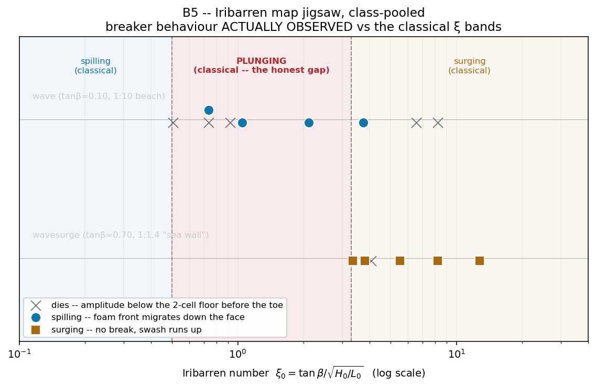

# B5 · Iribarren map jigsaw

Each pair is handed one point on the Iribarren map: a beach, a period and a
stroke. They read off what the wave actually does — spills, surges, or dies
before it gets there — and how wide the surf zone is. Pooled on a log-ξ
axis, the class's own points reproduce the textbook spilling and surging
bands either side of a hole in the middle: nothing anyone runs, on either
beach, ever plunges.

**Open it:** press **E** in the [app](https://barneydobson.github.io/hydraulician/)
and pick **B5**, or use the direct link
[`?ex=B5`](https://barneydobson.github.io/hydraulician/?ex=B5).
How to run any exercise: see the [teaching pack index](../INDEX.md#running-an-exercise).

## Theory

Breaker type is set by one number — the beach slope against the deep-water
steepness of the wave arriving at it:

    ξ₀ = tanβ / √(H₀/L₀)          L₀ = g·T²/2π
    spilling  ξ₀ < 0.5      plunging  0.5–3.3      surging  ξ₀ > 3.3

Two beaches carry the map between them: `wave` is 1-in-10 (**tanβ = 0.10**)
and `wavesurge` is the steep sea wall (**tanβ = 0.70**, the coded slope).
Both stand in **h = 0.348 m** of still water. Every cell's ξ₀ below was
measured on the flume — H₀ is the deep-water-equivalent height, with
shoaling taken back out — so you submit it rather than derive it.

## Your cell

This one is assigned by **cell**, not by digit — your lecturer will explain
the assignment in class. Your row gives a scene, a period, a stroke and the
ξ₀ you submit with your observation.

**`wave` — the 1-in-10 beach**

| cell | 1 | 2 | 3 | 4 | 5 | 6 | 7 | 8 | 9 |
|---|---|---|---|---|---|---|---|---|---|
| **T (s)** | 0.70 | 0.90 | 1.10 | 1.50 | 2.10 | 3.00 | 4.00 | 5.00 | 6.00 |
| **stroke (m)** | 0.035 | 0.045 | 0.055 | 0.060 | 0.070 | 0.055 | 0.045 | 0.035 | 0.030 |
| **ξ₀** | 0.51 | 0.92 | 0.73 | 0.73 | 1.05 | 2.11 | 3.75 | 6.53 | 8.19 |

**`wavesurge` — the steep sea wall**

| cell | 10 | 11 | 12 | 13 | 14 | 15 |
|---|---|---|---|---|---|---|
| **T (s)** | 0.80 | 1.40 | 1.40 | 1.80 | 3.00 | 4.20 |
| **stroke (m)** | 0.060 | 0.130 | 0.173 | 0.080 | 0.140 | 0.199 |
| **ξ₀** | 4.07 | 3.81 | 3.35 | 5.52 | 8.19 | 12.73 |

## What to do

1. Cells 10–15 live on the other beach: switch to **wavesurge** (Scenes
   menu, `S`) before anything else. Cells 1–9 stay on the flume that loads.
2. Set **Period** and **Amplitude** to your cell under Controls →
   Wavemaker, press `R` and let it reach steady state — about **40 s**; the
   card counts it down — then watch 15–20 s more while the wave crosses to
   the beach.
3. Classify what happens at the beach: **spilling**, a foamy broken front
   migrating down the wave face · **surging**, no foam anywhere and the
   water's edge running smoothly up the slope and back · **dies**, nothing
   reaches the beach and the water there stays flat.
4. If it spilled, left-drag **Measure** (`8`) from where the foam first
   appears to the still shoreline for the **surf width**, and submit
   **cell, ξ₀, behaviour, surf width** (or "N/A").

## For the instructor — pooling the class

Collect one row per pair (`pair,scene,T_s,amp_m,xi0,behaviour,surf_width_m`;
only `scene`, `xi0` and `behaviour` are needed), export the CSV and run:

```bash
python3 collect_plot.py class.csv                # -> plots/pooled-demo.png
python3 collect_plot.py data/simulated-class.csv # the shipped dry-run class
```

The script draws one lane per beach on a log-ξ₀ axis with the classical
bands shaded behind them, colours each cell by the behaviour actually
observed, and prints how many cells landed inside the plunging window — and
how many of those actually plunged.



### Discussion points

- **Run cell 12 on the projector** (`wavesurge`, T = 1.40 s, stroke
  0.173 m). Its ξ₀ = 3.35 sits right on the classical plunging boundary and
  it still surges cleanly, no foam: an overturning tongue is thinner than a
  free surface two cells thick can hold, which is why the middle band comes
  out empty for the whole class rather than for one unlucky pair.
- **"Dies" is data — look at where it clusters.** On `wave` it lands at LOW
  ξ₀, where the classical answer is "plunging": those cells are steep enough
  by the ratio but too small in absolute height to break in the 0.9 m of
  flat water between paddle and beach toe.

The full verification record — the 15-cell measurement table with the
observed behaviour of every row, the two-probe incident-wave method behind
each ξ₀, the breaking-onset detector's blind spots at both ends of the
domain and the paddle-safety ceiling — is archived in the repository at
`exercises/B5-iribarren/_archive/README-full.md`.
