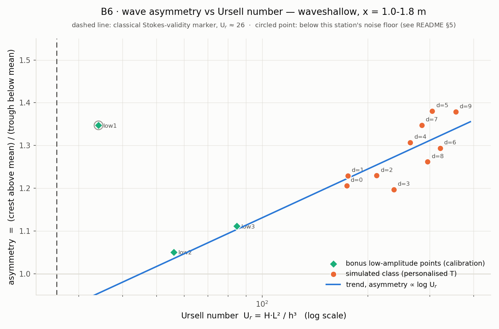

# B6 · Ursell number: when Airy stops being enough

Every student raises a long, shallow wave, measures its height, wavelength
and still-water depth, and computes the Ursell number. The
crest stands up into a peak, the trough spreads out flat, and the longer the
personalised period, the more pronounced that lopsidedness gets.

**Open it:** press **E** in the [app](https://barneydobson.github.io/hydraulician/)
and pick **B6**, or use the direct link
[`?ex=B6`](https://barneydobson.github.io/hydraulician/?ex=B6).
How to run any exercise: see the [teaching pack index](../INDEX.md#running-an-exercise).

## Theory

One number says how far a wave has outgrown linear (Airy) theory:

    U_r = H·L²/h³            Airy is a fair description while U_r ≲ 26
    L = T·Δx/Δt              Δx = 0.8 m between the two gauges, Δt the lag

`H` is the raw crest-to-trough swing, not a fitted sine amplitude: a
single-frequency fit is by construction blind to the harmonics that sharpen
the crest and flatten the trough, and it returns about half the real height.
The still-water depth is **h = 0.348 m** for everyone, so nobody has to
recover it from a wavy trace.

## Your period

**d** is the **last digit of your student number** — your lecturer will
explain the assignment in class. Take your column (the stroke saturates at
the slider's 0.30 m maximum):

| d | 0 | 1 | 2 | 3 | 4 | 5 | 6 | 7 | 8 | 9 |
|---|---|---|---|---|---|---|---|---|---|---|
| **T (s)** | 3.0 | 3.3 | 3.6 | 3.9 | 4.2 | 4.5 | 4.8 | 5.1 | 5.5 | 6.0 |
| **stroke (m)** | 0.25 | 0.265 | 0.28 | 0.29 | 0.30 | 0.30 | 0.30 | 0.30 | 0.30 | 0.30 |

## What to do

1. Set **Period** and **Amplitude** to your column under Controls →
   Wavemaker.
2. Press `R` and let it reach steady state — about **42 s**; the card counts
   it down.
3. Drop two gauges with the **Gauge** tool (`5`) at **x = 1.0 m** and
   **x = 1.8 m**, both around y = 0.20 m. Gauges plot arrives on **Depth**,
   so each card reads `d`.
4. Over 20–30 s of cycles read **H**, a typical crest-to-trough swing of a
   `d` trace, **Δt**, the lag between the two cards' crests, and the
   **crest/trough ratio**, how far the crest rises above the mean divided by
   how far the trough falls below it. Submit **T, H, L = T·0.8/Δt,
   U_r = H·L²/h³** and that ratio.

## For the instructor — pooling the class

Collect one row per student (`student,digit,T_s,H_m,L_m,Ur,asymmetry`; only
`Ur` and `asymmetry` are needed, and any row with a non-empty `note` is
drawn as a calibration point rather than a class digit), export the CSV and
run:

```bash
python3 collect_plot.py class.csv                # -> plots/pooled-demo.png
python3 collect_plot.py data/simulated-class.csv # the shipped dry-run class
```

The script plots crest/trough asymmetry against U_r on a log axis, marks the
classical U_r ≈ 26 Stokes-validity line, and fits the asymmetry ∝ log U_r
trend through everything except the rows flagged as noise-limited.



### Discussion points

- **Nobody in the class gets a linear wave** — every digit lands at
  U_r = 170–360. To show the far side of the marker, drop the stroke to
  0.08 m at T = 3.0 s with a gauge chart up (the shipped `low2` calibration
  point, U_r ≈ 56): the trace goes very nearly symmetric on screen. Put the
  stroke back to 0.25 m and the lopsidedness returns in front of the class.
- **Measure H the wrong way and the demo disappears.** A single-frequency
  fit of the very same trace returns about half the raw crest-to-trough
  height, because it strips out exactly the bound harmonics the exercise is
  about — which is why H here is the raw swing, read over several cycles.

The full verification record — the digit-by-digit sweep, the per-period
median statistics behind H and the asymmetry, the wavelength cross-check
against WV-1's own dispersion measurement, and the low-amplitude bonus
points that anchor the low-U_r end — is kept locally, out of version control, at
`exercises/B6-ursell/_archive/README-full.md`.
