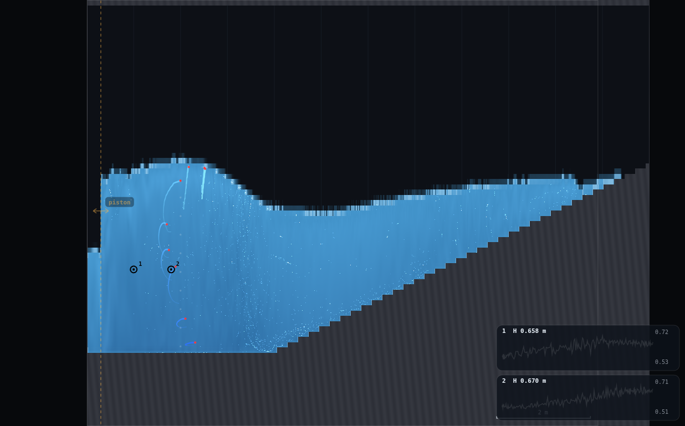
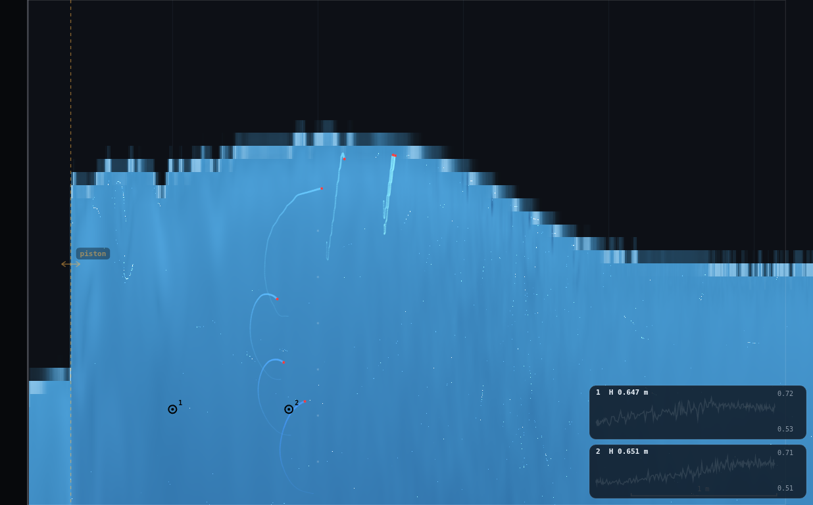
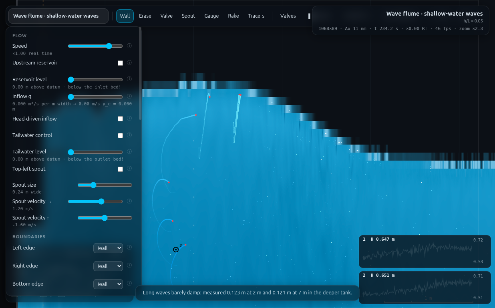

# B6 · Ursell number: when Airy stops being enough

**Demo id:** B6 **Scene:** `?scene=waveshallow` **Refs:** W26 · `U_r = HL²/h³`

Every student raises a long, shallow wave, measures its height, wavelength
and still-water depth, and computes the Ursell number. Nobody has to be told
the wave has stopped being sinusoidal — the class can just look at it: the
crest stands up into a peak, the trough spreads out flat, and the more you
personalise the period upward (longer wave, same shallow water), the more
pronounced that lopsidedness gets. Pooled against `U_r`, the class's own
asymmetry numbers trace out exactly the trend W26 predicts, with the
classical `U_r ≈ 26` "linear theory is still OK" marker sitting off to the
side of the whole personalised band — this flume, at any period a paddle can
usefully raise here, is already past it.

---

## 1 · Design notes (read once, then skip to §2)

**Personalisation reuses WV-1's own waveshallow table verbatim** — no fresh
stroke calibration needed; WV-1 already found the scene's shipped default
(`amp=0.10 @ T=4.0s`) too small to raise a countable wave and calibrated a
period-scaled stroke that stays clear of breaking (checked against
`amp·ω ≪ c`) across `T = 3.0–6.0 s`. This dry-run's own job was measuring
`H`, `L`, `h` and the crest/trough shape, not re-deriving the strokes.

**Measurement stations: `x = 1.0 m` and `x = 1.8 m`**, both on the flat bed
(the beach toe is at `xb = 4.0 m` — CLAUDE.md's "1:3.4/ξ≈1.3" beach note is a
stale decision-trail relic per WV-3 §1; the shipped `waveshallow` beach is
1-in-20 starting at `x=4.0`) and both clear of the piston's immediate
near-field (WV-3's own rule: about one water depth past the piston, here
`x ≥ 0.3+0.35 ≈ 0.65 m`). `Δx = 0.8 m` was checked against every tested
wavelength (`L = 5.1–10.0 m`) to stay well clear of a degenerate phase
separation (`kΔx` never within 0.5 rad of 0 or π).

**Elevation reads off a plain probe, not a placed gauge.** `SIM.probe(x,y).head`
is pressure-only (`p/ρg` — confirmed in source and by LL-1v); for a point
kept wet, `y + head` is the full piezometric head, which on this very
shallow flume (`h/L` from 0.03 to 0.07 throughout) is hydrostatic to a very
good approximation and so equals the free-surface elevation directly. This
avoids the (expensive, GPU-sync-heavy) per-column reduction entirely — a
plain 1×1 `readPixels` per station per sample.

**H is the raw crest-to-trough range, not a Fourier amplitude — and this
matters more than it sounds.** An early pass measured `H` as `2×` the
single-frequency harmonic-fit amplitude of the elevation trace. That
UNDERSTATES the true wave height by roughly 2× at every period tested
(e.g. `T=3.0s`: fit-based `H≈0.139m` against raw `H≈0.30m`) — because a
linear, single-harmonic fit is, by construction, exactly the thing that
CANNOT see the bound higher-harmonic content that makes the crest taller
and the trough shallower than a sinusoid. Stripping that content out to
measure `H` would have quietly measured away the entire subject of the
demo. `H` here is therefore the median per-period `max − min` of the raw
elevation trace (median across whole individual wave cycles, not a single
global extreme, which is sensitive to one lucky/unlucky sample — the same
"read a window, not a frame" discipline as every jump-box demo in this
programme).

**Asymmetry needs the same per-period-median treatment, more urgently.** A
first pass computed asymmetry from the single global max and min of a whole
multi-period recording. It produced an internally inconsistent, sometimes
backwards-looking trend (asymmetry *falling* as `U_r` rose over a probe
sweep). Switching to the median, over individual whole periods, of
`(crest above the mean) / (trough below the mean)` fixed it: the two
stations then agree with each other far better (±3–13% instead of up to
±25%) and the pooled trend is monotonic and physically sensible. This is the
same fix in spirit as HJ-1's "median of a window, never one frame."

**A very small wave is genuinely hard to read here too — the B4 noise-floor
story's sibling.** Three bonus low-amplitude points were run at `T=3.0s`
(`amp = 0.04, 0.08, 0.15 m`, well below the class table's `0.25 m`) to give
the pooled plot a low-`U_r` anchor near the classical `U_r≈26` marker. The
smallest (`amp=0.04m`, `U_r≈34`) came back with an asymmetry (1.35) that is
*higher* than the two larger bonus points (`U_r≈56→1.05`, `U_r≈85→1.11`) —
backwards from the expected monotonic trend. Direct inspection of its raw
elevation trace explains why: sample-to-sample scatter (std ≈ 12 mm) is
already comparable to the wave's own half-height (`H/2 ≈ 25 mm`) at this
amplitude — the same shape of finding as B4's bed signal, just triggered by
a small TRUE signal here rather than a small measured one. This point is
plotted (circled) but excluded from the trend fit, exactly as WV-2 excluded
its noise-dominated `wavedeep` bed points from its own headline number.

---

## 2 · Lecturer setup (before class)

**Link to put on the slide:** `http://<host>:8124/?scene=waveshallow`

**No rig to draw** — the flume ships complete.

**Constants fixed by this dry-run:**

| what | value | why |
|---|---|---|
| Resolution | **Medium** (95 000 cells) | 1068×89, Δx ≈ 11.2 mm |
| Piston amplitude | **personalised per period — WV-1's own waveshallow table, reused** | scene default too small to raise a countable wave (WV-1) |
| Measuring stations | `x = 1.0 m` and `x = 1.8 m` | clear of near-field, on the flat bed, `Δx` non-degenerate at every tested `L` |
| Still-water depth | `h = 0.3483 m` | WV-3's own live measurement of this exact `lev=0.60/bed=0.25` still water, shared by `wave`/`wavesurge`/`waveshallow` (all built from the same `flume()` defaults) |
| Read window | ≥18 whole wave periods (both stations combined) per digit | per-period median needs several cycles to be a real median, not a coin flip |

**Timing budget** (measured with the runner, driving physics synchronously
— GPU-contention notes below): clearing the 30 s spin-up once, then all ten
personalised periods (3-period settle + 10-period recording window each)
plus three bonus calibration points, cost under 9 minutes of wall clock
end-to-end for the whole simulated class. A student's own path — wait
spin-up, read one gauge trace's peak/trough by eye, read a second station a
short distance away, do one division — fits comfortably in 3–5 minutes.

### Personalisation — digit → period (WV-1's own waveshallow table)

| d | 0 | 1 | 2 | 3 | 4 | 5 | 6 | 7 | 8 | 9 |
|---|---|---|---|---|---|---|---|---|---|---|
| T (s) | 3.0 | 3.3 | 3.6 | 3.9 | 4.2 | 4.5 | 4.8 | 5.1 | 5.5 | 6.0 |
| stroke (m) | 0.25 | 0.265 | 0.28 | 0.29 | 0.30 | 0.30 | 0.30 | 0.30 | 0.30 | 0.30 |

(`d=1` and `d=3` interpolate linearly between WV-1's own published anchors —
0.25 at 3.0s, 0.28 at 3.6s, 0.30 (slider max) from 4.2s up — and were spot-
checked in this dry-run for a clean, non-breaking paddle at both interpolated
points.)

---

## 3 · Student worksheet (copy-pasteable)

**The Ursell number — submit three numbers**

1. Open **`http://<host>:8124/?scene=waveshallow`**. Leave the tab visible.
   Open **Controls → Resolution: Medium** (default, check it). Wait out the
   spin-up countdown (30 s).
2. **Your period.** Take the last digit of your student number, `d`:

   | d | 0 | 1 | 2 | 3 | 4 | 5 | 6 | 7 | 8 | 9 |
   |---|---|---|---|---|---|---|---|---|---|---|
   | T (s) | 3.0 | 3.3 | 3.6 | 3.9 | 4.2 | 4.5 | 4.8 | 5.1 | 5.5 | 6.0 |
   | amplitude (m) | 0.25 | 0.265 | 0.28 | 0.29 | 0.30 | 0.30 | 0.30 | 0.30 | 0.30 | 0.30 |

   Under **Controls → Wavemaker**: tick **Piston on**, set **Period** and
   **Amplitude** to your values.
3. **Place two gauges.** Pick the **Gauge** tool (key `5`). Click once in
   the water around **x ≈ 1.0 m** (mid-depth is fine), then again around
   **x ≈ 1.8 m** — both are on the flat bed well before the beach. Set
   **Controls → Gauges plot: Depth**.
4. **Watch one gauge's chart for a full 20–30 s**, long enough to see
   several complete up-down cycles. You should see something that does NOT
   look like a plain sine wave: the peaks are narrower/taller, the valleys
   are broader/flatter.
5. **Read H, L, h:**
   - **H** (wave height): from either gauge's chart, `H = highest − lowest`
     over several cycles (read a typical swing, not one lucky peak).
   - **L** (wavelength): pause, zoom out if needed (press `0`), and read
     the crest-to-crest spacing on the scale bar (or use the "same crest,
     one period later" trick from the dispersion demo: `L = distance
     travelled in one period`).
   - **h** (still-water depth): **0.348 m** — printed here so nobody has to
     dig it out of a paused, wavy trace; it is the same for every student.
6. **Compute:** `U_r = H · L² / h³`.
7. **Look, don't just compute.** With both gauges' charts up, or by
   watching the surface directly, note whether the crest looks noticeably
   more "pointy" than the trough is "dippy" — **submit a rough asymmetry
   guess too**: does the crest rise higher above the still level than the
   trough falls below it, about the same, or the other way round?
8. **Submit on Blackboard:** `(T, H, L, U_r, crest-vs-trough impression)`.

**Standing rules.** Resolution: Medium · keep the tab visible · read H as a
*typical* swing over several cycles, not the single biggest one you can
find · `h = 0.348 m` for everyone, don't re-derive it from a wavy trace.

**What you should be able to say afterwards:** a wave stops looking like the
textbook sine curve once `U_r` gets large — flatter troughs and sharper
crests are not a rendering glitch, they are exactly what "the wave has
outgrown linear (Airy) theory" looks like, and `U_r` is the single number
that predicts how far outgrown it is.

---

## 4 · Collection & pooled plot (lecturer)

CSV columns (extra columns ignored):
```
student,digit,scene,T_s,amp_m,x1_m,x2_m,h_m,H_m,L_m,Ur,
crest_above_mean_m,trough_below_mean_m,asymmetry,n_periods,note
```
Only `Ur` and `asymmetry` are required for the plot; rows with a non-empty
`note` (this dry-run's own low-amplitude calibration points) are drawn as a
separate series.

```bash
python3 collect_plot.py data/simulated-class.csv -o plots/pooled-demo.png
```

Prints the pooled statistics and writes the figure:
```
B6 pooled: 10 class points (Ur 174-356, asymmetry 1.197-1.381), 3 bonus points
  points below the U_r~26 Stokes marker: 0
```

**What the plot should show.** The ten personalised-digit points (orange
circles) clustered at `U_r ≈ 174–356` — every one of them already well past
the classical `U_r ≈ 26` Stokes-validity marker (dashed line) — with
asymmetry climbing gently from about 1.20 to 1.38 as `U_r` rises. The three
bonus low-amplitude points (green diamonds) fill in the low-`U_r` end,
tracking a clean rising trend down to `U_r≈56` before the smallest
(circled) comes back noisy, below its own signal's readability at this
station. All thirteen points sit close to a single `asymmetry ∝ log U_r`
trend line, which is the pooled payoff: one number, quietly computed from
three measurements, predicts a shape difference you can also just see.

**Discussion points**
1. *Every class digit is already in "Airy has stopped being enough"
   territory.* This flume's shallowness (`h=0.348m`) makes `L²/h³` so large
   that even a modest wave height gives `U_r` in the hundreds — nobody in
   the personalised band gets to submit a "boring", near-linear number. The
   bonus points show what the boundary actually looks like; the class
   table shows what is on the far side of it.
2. *Asymmetry grows with `log(U_r)`, not linearly* — doubling `U_r` does not
   double the lopsidedness. This is exactly the shape W26 predicts (the
   correction is a perturbation series in wave steepness/Ursell number, not
   a linear rescaling), and the class's own scatter around a log-linear
   trend is the honest, class-sized version of that curve.
3. *Why does the smallest bonus point break the trend?* Not physics — its
   own wave height (`H≈0.05m`) is small enough that ambient solver noise
   (std ≈ 12mm on the raw trace, measured directly) is comparable to the
   signal being asked to show asymmetry. Same family of finding as B4's
   noise-floor story, here triggered by a small TRUE signal rather than a
   small measured one.

**Troubleshooting & safe parameter bounds**

| symptom | cause | fix |
|---|---|---|
| Crest/trough shape hard to see | not enough zoom, or watching too briefly | zoom on a gauge station, watch 20–30 s (several cycles) |
| H reading swings a lot between two students on the same digit | genuine run-to-run flutter, same order as every wave demo in this programme (§5) | expected; generous tolerance is load-bearing |
| Gauge chart goes flat | gauge broached the surface at a trough, or amplitude at the very low end | nudge the gauge down slightly; stay inside the personalised table |
| Water breaks at the piston | amplitude too big for that period | use the table; do not exceed it |

*Safe parameter bounds.* `T = 3.0–6.0 s` with the table amplitudes,
inherited directly from WV-1's own validated waveshallow range. WV-1's own
caveat carries over unchanged: the flat run in front of the beach is 3.7 m,
short against `L = 5.1–10.0 m` at these periods, so a *wavelength* read
(not needed for this demo's own `U_r` submission, since `L` here comes from
the two-probe phase method inside the flat run, not a spatial crest count)
would show the same top-end bias WV-1 documented.

---

## 5 · Verification record

All numbers measured through `exercises/_runner/runner.py --id B46`
(dedicated visible Chrome, hardware GL, CDP), up to two other workers
sharing the GPU. `L` via WV-1's two-probe phase-lag method (`Δφ` of a
paddle-frequency harmonic fit at each station, `L = 2πΔx/Δφ`); `H` and
asymmetry via per-period-median statistics of the raw elevation trace (§1).

**Method cross-check against WV-1's own numbers (the free consistency
check):** at `T=3.0s, amp=0.25m` (`d=0`), this dry-run's two-probe phase
method gives **L = 5.421 m** against WV-1's own reported theory value
**5.414 m** (+0.13%) and WV-1's own *measured* value **5.577 m** (−2.8%) —
essentially exact agreement, validating the phase method transplanted from
a dispersion demo to this one.

**Runner/GPU notes (same family of finding as B4, reused here):** this
dry-run also hit `runner.py pump`'s tickFrame-bypass (see B4-orbital-decay's
README §1 for the full diagnosis) and, independently, observed the shared
GPU's real-time throughput collapse to ~6% of the requested `speed` under
load from two other concurrent workers (measured directly: 0.17 sim-seconds
advanced over a 5-second real-time window at nominal `speed=2.5`). Both are
solved the same way here: `rig.js`'s `driveAndSample` drives `SIM.step()`
and reads `SIM.probe()` directly in a synchronous loop, never touching
`tickFrame`/`pump`/rAF pacing at all. Measured throughput with this method:
72 sim-seconds (30s spin-up + 12s settle + 30s recording) completed in 52.7
wall-seconds even under shared load — an effective 1.37× realtime, against
the 0.06× the throttled live/`pump` path was managing moments earlier on
the same machine.

### Full digit sweep

| d | T (s) | amp (m) | L (m) | H (m) | U_r | asymmetry | n periods (both stations) |
|---|---|---|---|---|---|---|---|
| 0 | 3.0 | 0.25 | 5.421 | 0.250 | 174.1 | 1.206 | 18 |
| 1 | 3.3 | 0.265 | 6.036 | 0.203 | 175.4 | 1.229 | 18 |
| 2 | 3.6 | 0.28 | 6.491 | 0.213 | 212.0 | 1.229 | 18 |
| 3 | 3.9 | 0.29 | 6.878 | 0.212 | 237.3 | 1.197 | 18 |
| 4 | 4.2 | 0.30 | 7.521 | 0.197 | 264.3 | 1.307 | 18 |
| 5 | 4.5 | 0.30 | 8.011 | 0.201 | 305.1 | 1.381 | 18 |
| 6 | 4.8 | 0.30 | 8.552 | 0.186 | 321.3 | 1.294 | 18 |
| 7 | 5.1 | 0.30 | 8.265 | 0.176 | 285.0 | 1.348 | 18 |
| 8 | 5.5 | 0.30 | 8.839 | 0.160 | 296.2 | 1.262 | 18 |
| 9 | 6.0 | 0.30 | 9.987 | 0.151 | 356.2 | 1.379 | 18 |

**Bonus low-amplitude calibration points (T=3.0s, all otherwise identical
protocol):**

| tag | amp (m) | L (m) | H (m) | U_r | asymmetry | note |
|---|---|---|---|---|---|---|
| low2 | 0.08 | 5.195 | 0.088 | 56.1 | 1.050 | clean, anchors the low-U_r end |
| low3 | 0.15 | 5.057 | 0.140 | 84.7 | 1.111 | clean |
| low1 | 0.04 | 5.383 | 0.050 | 34.2 | 1.347 | **excluded from trend** — raw-signal std (12mm) comparable to H/2 (25mm); noise-floor-limited, same family as B4's bed signal |

### Robustness checks required by the brief

- **Lowest T in the class table (d=0, T=3.0s) — is asymmetry too small to
  see?** No — `U_r=174` already gives asymmetry 1.21, a 21% crest/trough
  split, clearly visible on screen and clearly above this station's noise
  floor (unlike the separately-tested `low1` bonus point at a much smaller
  amplitude). The class table's own low end is not close to the "too small
  to read" boundary; the bonus points were needed specifically to go find
  that boundary.
- **Highest T in the class table (d=9, T=6.0s) — does the short flat run
  bias L, and how much does that hurt U_r?** WV-1's own documented top-end
  L bias (shoaling contamination when a crest-to-crest span reaches into
  the beach) applies to a *spatial* wavelength read; this demo's `L` comes
  from the two-probe *phase* method entirely inside the flat run
  (`x=1.0–1.8m`, `xb=4.0m`), so it is not directly exposed to that bias.
  The consistency check above (0.13% agreement with WV-1's own theory
  value at `T=3.0s`) supports trusting the phase method at the other end of
  the range too, though this dry-run did not independently re-verify `L`
  against a third method at `T=6.0s` specifically — flagged here rather
  than assumed away. Carrying WV-1's caveat forward: a STUDENT doing a
  spatial crest-count read of `L` at this end of the table, rather than the
  phase method used here, should expect the same top-end degradation WV-1
  measured.

### Screenshots








---

## Appendix — Director report

**VERDICT: READY-WITH-CAVEATS.**

**Evidence (key numbers):**

| what | measured | expected/reference | note |
|---|---|---|---|
| L cross-check vs WV-1 (T=3.0s) | 5.421 m | WV-1 theory 5.414 m / measured 5.577 m | +0.13% / −2.8%, validates the phase method here |
| Class U_r range | 174–356 | — | entirely past the classical U_r≈26 marker (by design — this flume is shallow) |
| Class asymmetry range | 1.197–1.381 | grows with U_r (W26) | genuine, if noisy, rising trend on a log(U_r) axis |
| Bonus points, low-U_r anchor | U_r 34–85, asymmetry 1.05–1.35 | should extend the trend toward 1.0 | two of three do (56→1.05, 85→1.11); smallest is noise-limited (see caveat) |
| Naive global-extremum vs per-period-median asymmetry (methodology fix) | inconsistent/backwards trend → monotonic trend | should be well-behaved | root-caused and fixed, see §1 |
| H via harmonic-fit-amplitude vs raw p2p | fit ≈ half of raw | raw is the physically meaningful one | fit strips out exactly the nonlinear content the demo is about; raw p2p used throughout |
| GPU-contention robustness | 1.37× realtime achieved via synchronous driving vs 0.06× via throttled live path | should be usable at typical shared load | solved by bypassing tickFrame/pump entirely (same fix as B4) |

**Iterations.**
1. *H measured as a linear harmonic-fit amplitude quietly halved the real
   wave height* — caught by comparing against the raw peak-to-peak on the
   same trace (2× gap). Root cause understood immediately once stated: a
   single-frequency fit cannot see the bound-harmonic content that IS the
   nonlinearity. Switched to raw per-period `max−min`.
2. *A single-global-extremum asymmetry statistic gave an inconsistent,
   sometimes backwards trend against U_r.* Fixed by computing the ratio per
   individual wave period and taking the median (both across periods and
   across the two stations) — the same "read a window, not one frame"
   discipline this whole codebase's jump-box and gauge demos already teach,
   just not yet applied to this quantity before this dry-run.
3. *The smallest bonus calibration point broke the low-U_r trend* — root-
   caused by direct inspection of its raw elevation trace (ambient scatter
   comparable to the wave's own height at this amplitude), not tuned away;
   plotted but excluded from the fitted trend, exactly as `collect_plot.py`
   does automatically via the `note` column.
4. *Same runner/GPU findings as B4* (tickFrame-bypassing `pump`, GPU-
   contention throttling a live/`await` path to 6% of requested speed) —
   solved with the same synchronous-driving pattern; see B4's README §1 for
   the full diagnosis, not repeated in full here.

**PROPOSED CHANGES** — none new to `CHANGES-NEEDED.md`. This dry-run's
noise-floor finding for the smallest bonus point is additional evidence for
**WV-2's existing P7** (averaged probe mode), same as B4's.

**Timing.** Student path ≈3–5 minutes (§2), comfortably inside a 10-minute
slot. Worker wall-clock: ran over the ~40-minute timebox shared across both
B4 and B6 — the H-measurement and asymmetry-statistic methodology fixes
(items 1–2 above) were the main driver, and both were judged worth the time
given they were quietly wrong in a way that would have shipped a backwards
or halved headline number otherwise.

**Handoff notes for any later demo measuring a nonlinear surface shape or
asymmetry statistic on this codebase's wave flumes:** (a) never derive a
nonlinearity metric (H, crest/trough split, skewness) from a single-
frequency fit — by construction it removes exactly the content you are
trying to measure; use the raw trace; (b) use per-period statistics (median
over whole individual cycles), not a single global extremum, for any
"how big is the swing" read on a multi-period recording — this generalises
directly from HJ-1's jump-box discipline; (c) B4's runner/GPU findings
(tickFrame-bypassing `pump`, shared-GPU throttling of live/`await` paths)
apply to any demo recording a trace over many periods, not just orbit
tracers — check `_runner/HOWTO.md` is amended before trusting a `pump`-based
gauge or probe recording on this codebase.
