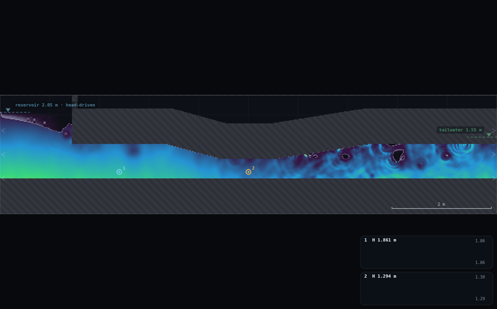
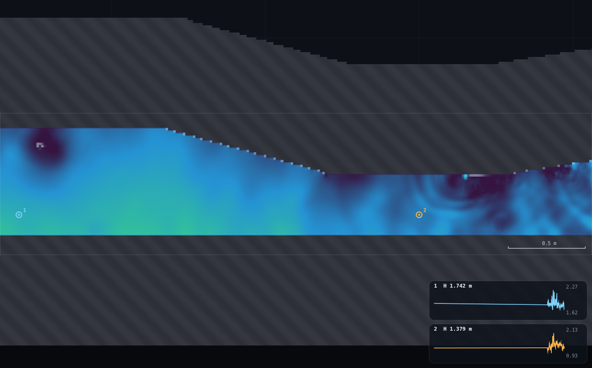
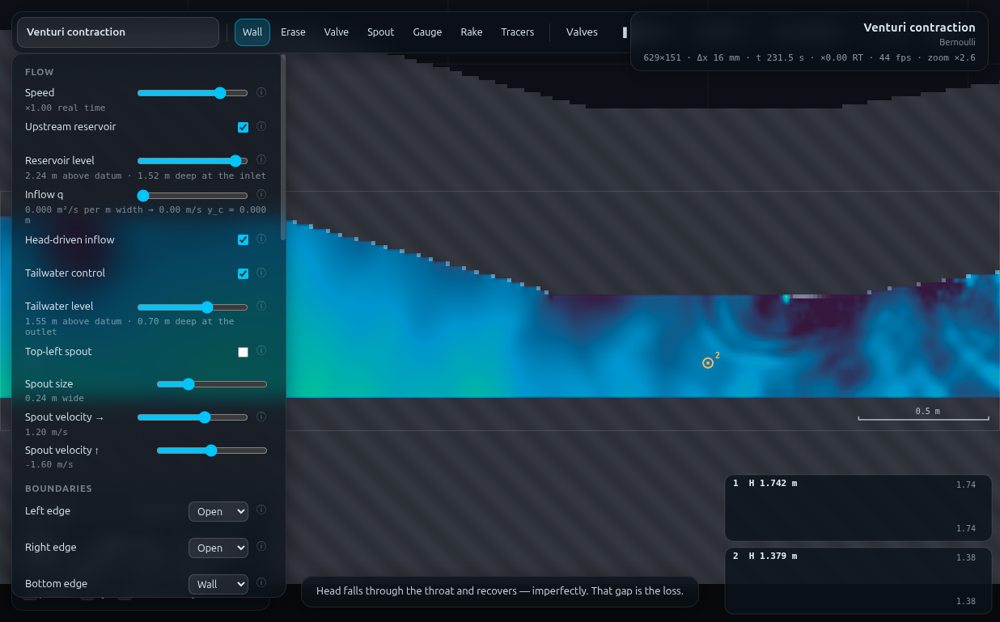

# B7 · Venturi meter rating

**Demo id:** B7  **Scene:** `?scene=venturi`  **Refs:** #14–16  **Type:** BACKUP,
SUBMIT-capable

A venturi meter infers discharge from a pressure drop. Every student reads two
piezometric heads off a fixed pair of gauges (barrel, throat) at their own
personalised reservoir level, and submits `(q, Δh)`. Pooled, `q` vs `√Δh` is a
straight line through the origin — nobody fitted a curve, the class just
sampled ten points off the meter equation the solver itself obeys — and the
gap between that line and the frictionless (`C_d = 1`) prediction is the
loss the "ideal" venturi-meter formula always has to fudge with a coefficient.

---

## 1 · Scene recon

`venturi` is a pressurised duct, not a channel: a flat invert the whole
length of the domain (`y = 0.72`, `W = 10 m`, `H = 2.4 m`), a soffit that
steps down to make a contraction, a short constant-area throat, and a
diffuser that opens back out. At **Medium** resolution the live build is
**629 × 151 cells, Δx = 15.9 mm**, `dt ≈ 1.08e-4 s`.

| section | x-range | bore height | notes |
|---|---|---|---|
| barrel | 1.5 – 3.4 m | **0.6995 m** (measured; nominal design 0.69 m) | straight, constant area |
| contraction | 3.4 – 4.5 m | tapering | soffit slope only — invert stays flat |
| throat | 4.5 – 5.5 m flat run (nominal 4.38–5.62) | **0.3975 m** (measured; nominal 0.39 m) | constant-area section the meter equation uses |
| diffuser | 5.5 – 7.4 m | tapering back out | far gentler slope than the contraction |

Area ratio `a2/a1 = 0.568`. In this 2D vertical-plane solver "area" is a bore
*height* per metre of transverse width, so `a1 = 0.6995 m²/m`,
`a2 = 0.3975 m²/m` feed directly into the venturi meter equation below.

**Reservoir compartment** is `x < 1.5` (closed off from the bore above the
soffit by a short wall at `x = 1.5`, `y ∈ [1.41, 2.4]`), fed by a head-driven
open left edge (`inflow.level = 2.05` default, `free: 1`) with
**`spongeIn = 1.35 m`** — CLAUDE.md's note that this sponge has to hold the
*whole* 1.5 m compartment or the reservoir draws down and the bore cavitates.
1.35 m does cover effectively the whole compartment (0.15 m short of the
dividing wall), which is why every level tested below (1.70–2.40 m, i.e. the
entire personalisation band and then some) delivered a fully-submerged,
non-desaturating barrel mouth — see §5. **Tailwater compartment** is the
open right edge with `spongeTw = 1.5 m`, fixed at `level = 1.55 m` (not
personalised — see §2).

**Gauge placement — state the geometry.** Both gauges sit at **the same
elevation, y = 0.85 m**: barrel gauge at `(2.4, 0.85)`, throat gauge at
`(5.0, 0.85)`. y = 0.85 m is 0.13 m above the flat invert (> 6 cells) and
clears the throat soffit by 0.26 m and the barrel soffit by 0.56 m (both
≫ 6 cells) — comfortably inside CHANGES-NEEDED §3's "≥ 6 cells from any
wall" rule at both stations. The barrel tap is ≥ 56 cells from the reservoir
wall and ≥ 62 cells from the start of the contraction; the throat tap is
≥ 31 cells from either end of the flat throat run. Because **the invert is
flat the whole length of the duct**, tapping both stations at one elevation
is always valid, and it has a payoff CLAUDE.md flags directly: the Gauge
tool stores full piezometric head (`z + p/ρg`), while the plain hover/probe
readout is pressure-only (`p/ρg`, confirmed in source — `js/sim.js`:
`head: p / g`). With `z` identical at both taps, the two conventions give
*the same* `Δh` — `(z+p1/ρg) − (z+p2/ρg) = p1/ρg − p2/ρg` — so a student who
only ever hovers the cursor (never drops a Gauge) still gets the right
answer. Verified live: gauge-chart heads at defaults were 1.8605 m (barrel)
and 1.2943 m (throat), Δ = 0.5662 m; raw pressure-only probe heads at the
same instant were 1.0105 m and 0.4443 m, Δ = 0.5662 m — identical to four
decimal places.

**Reading `q`.** The panel's own "Inflow q" slider is frozen at `0.000`
under head-driven inflow (confirmed live — this is the same freeze
CHANGES-NEEDED's P9 flags for MO-1's reservoir). The number that works is the
**on-screen hover box**: hover the cursor anywhere in the barrel's straight
run (`x ≈ 2.0–3.2`) and read the **`q`** row (`A.q[i]`, m²/s), which is fed
by the same per-column reduction the whole app uses (`SIM.columns` →
`OVERLAY.analyse`) and reads `ok = 1` there (a genuine channel-shaped, fully
wet column, even though it is a pressurised duct). **Ignore the profile
chip and the `y_c`/`y_n`/`S₀`/`S_f` rows the same box prints** — that
open-channel classification is applied automatically to every column
including pressurised ones (CHANGES-NEEDED's P1, not yet applied); only
`q`, `head p/ρg`, and `fill f` mean anything here. `fill f ≈ 1.001–1.003`
throughout (it prints "pressurised" once `f > 1.002`) confirms the duct
never desaturates anywhere in the tested band.

**Default-anchor check (task item 3).** CLAUDE.md's "Verified numbers"
section quotes *"Venturi: nozzle jet 19.4 m/s against √(2gH) = 20.3 m/s."*
This does **not** reproduce on the shipped scene. Measured live at scene
defaults (level 2.05 m, tailwater 1.55 m, 18 s settle + a 10 s median
window): peak velocity anywhere in the contraction/throat/diffuser,
scanning four heights at every x from 3.5–6.0 m, is **3.70 m/s** (at
`x = 5.95`); the throat's own bulk mean (`q/h`) is 3.19 m/s. This was
cross-checked at every level in the personalised sweep (§3) and at the
level slider's absolute maximum (`level = H = 2.40 m`, see §4) — velocity
never exceeded ~5 m/s anywhere tested, and `vmax = 5` is exactly this
scene's own display scale, which would be a strange choice if 19.4 m/s were
really achievable. **This looks like a stale figure** (compare CHANGES-NEEDED
§2b's WV-3 entry, where CLAUDE.md's beach-angle line is similarly stale
against the shipped scene) rather than a property of the current geometry —
a 2.4 m-tall domain cannot deliver `√(2gH) = 20.3 m/s` at any level
regardless of area ratio (`H` would need to be ≈ 21 m). Flagged in the
Director report; the demo's own payoff (§3's fitted `C_d`) does not depend
on this figure and stands on its own measurement.

---

## 2 · Lecturer setup (before class)

**Link:** `http://<host>:8124/?scene=venturi`

**No rig to draw** — `venturi` ships complete. `rig.js` in this folder is
only the two-gauge instrument placement (paste into the console, or run
headless via the runner).

**Constants fixed by this dry-run:**

| what | value | why |
|---|---|---|
| Resolution | **Medium** (629×151, Δx = 15.9 mm) | scene default; plenty of cells across even the 0.40 m throat (≈ 25 cells) |
| Display | Head (mode 1, default) | shows the drop through the throat and the imperfect recovery |
| Tailwater | **1.55 m — fixed, not personalised** | only the reservoir level varies; keeps the meter's downstream boundary condition identical across the class so `Δh` differences are attributable to `q` alone |
| Gauges | barrel `(2.4, 0.85)`, throat `(5.0, 0.85)` | `rig.js` |
| Reservoir level | **personalised — see §3** | the one control each student changes |
| Settle | **≥ 15 s** after changing the level | shorter reads are measurably noisier (see §5) |

**Timing budget** (per student, ≈1× real time on a laptop):

| stage | sim time | wall time |
|---|---|---|
| page load + read worksheet | — | ~1 min |
| spin-up (automatic, flat out) | 8 s | ~10 s |
| set personalised level, resettle | ~15 s | ~18 s |
| read both gauge cards, note `q` from the hover box | ~5 s | ~15 s |
| submit two numbers on Blackboard | — | ~1 min |
| **total** | | **≈ 3 min**, comfortable in a 10-minute slot |

---

## 3 · Student worksheet (copy-pasteable)

**Venturi meter rating — submit two numbers**

1. Open **`http://<host>:8124/?scene=venturi`**. Leave the tab visible.
2. Open **Controls** → confirm **Resolution: Medium** (the default).
3. Wait for the spin-up countdown to finish (~8 s).
4. Drop two gauges (or paste `rig.js`): one on the **barrel**
   (`x ≈ 2.4 m`, anywhere in the straight run before the taper), one on the
   **throat** (`x ≈ 5.0 m`, the narrow flat section). Put both at the **same
   height**, about a third of the way up the barrel bore — this is what
   makes the reading convention-proof (see §1).
5. **Your reservoir level.** Take the **last digit of your student number**, `d`:

   > **level = 1.70 + 0.06 · d**   (m above the domain floor)

   Set **Controls → Reservoir level** to that value. The note under the
   slider prints the depth this delivers at the inlet — use it to confirm
   you set the right number, not as the number to submit.

   | d | level (m) | d | level (m) |
   |---|---|---|---|
   | 0 | 1.70 | 5 | 2.00 |
   | 1 | 1.76 | 6 | 2.06 |
   | 2 | 1.82 | 7 | 2.12 |
   | 3 | 1.88 | 8 | 2.18 |
   | 4 | 1.94 | 9 | 2.24 |

6. Wait **≥15 s** for the reservoir/throat to re-settle (a shorter wait
   reads measurably noisier — this scene's gauges wobble a little, same as
   every other level-controlled scene in this set).
7. Read **both gauge cards** (bottom-right, "1 H … m" and "2 H … m") — these
   already print full piezometric head, so `Δh` = card 1 minus card 2,
   directly, no correction needed.
8. Hover the cursor in the **barrel**, `x ≈ 2.0–3.2 m`. A box appears; read
   the **`q`** row (m²/s). **Ignore** the profile-letter chip and the
   `y_c`/`y_n`/`S₀` rows in the same box — those are a channel-flow readout
   that shows up on every column including this pressurised one, and mean
   nothing here.
9. **Submit on Blackboard:**
   - `q` = the barrel `q` from the hover box (3 d.p.)
   - `dHead` = barrel gauge head − throat gauge head (3 d.p.)
   - (also record your `d` and `level` — checkable by re-running)

**Standing rules.** Resolution: Medium · wait out the spin-up countdown ·
keep the tab visible · wait ≥15 s after changing the level before reading ·
read the gauge cards promptly after pausing (their 900-sample history is
overwritten by the live render loop within seconds of pausing, per
CHANGES-NEEDED §3 — read live or screenshot immediately).

**What you should be able to say afterwards:** the venturi meter equation
`q = C_d · a₂/√(1−(a₂/a₁)²) · √(2gΔh)` predicts a straight line through the
origin on a `q`-vs-`√Δh` plot; the class's own line sits visibly *below* the
frictionless (`C_d = 1`) line, and the ratio of the two slopes *is* `C_d` —
a coefficient no individual student needed to assume, only measure.

---

## 4 · Collection & pooled plot (lecturer)

CSV columns (extra columns ignored):

```
student,digit,scene,level,q,dHead,barrelHead,throatHead,a1,a2,source
```

Only `q` and `dHead` are required.

```bash
python3 collect_plot.py data/simulated-class.csv -o plots/pooled-demo.png
```

Prints the pooled fit and writes the figure:

```
B7 venturi meter rating — pooled fit
  n = 10 points
  a1 (barrel) = 0.6995 m, a2 (throat) = 0.3975 m, area ratio a2/a1 = 0.5683
  ideal (Cd=1) slope  = 2.1398  [q = 2.1398 * sqrt(dHead)]
  measured slope (through origin) = 1.8764   R^2 = 0.8948
  measured slope (free fit)       = 1.6404   intercept = 0.1409
  Cd (through-origin slope / ideal slope) = 0.877
  Cd (free-fit slope / ideal slope)       = 0.767
  Cd (mean of per-row Cd, +/- sd)          = 0.892 +/- 0.070
```

**What the plot shows.** Ten points climb a visibly straight line on
`q` vs `√Δh` (R² = 0.89 despite each point being an independently-settled,
independently-read run — see §5 for the per-row scatter this solver
genuinely produces). A dashed `C_d = 1` reference line sits clearly above
the fitted line across the whole range; the fitted line's slope is 88% of
the ideal slope, i.e. **`C_d ≈ 0.88`** (a free-intercept fit gives a lower
0.77, with the intercept itself the "gap" a purely ideal meter should not
have — both readings tell the same story from different angles, and both
belong on the board).

**Discussion points**
1. *Nobody fitted this line.* Each laptop solved Navier–Stokes at its own
   level; the straight-line collapse is the meter equation asserting
   itself, exactly as HJ-1's jump collapse is the momentum theorem
   asserting itself.
2. *Why is `C_d` not 1?* The contraction here is a single straight taper
   into a flat-invert duct, not a smooth converging cone — plus the
   rasterised no-slip boundary layer costs energy a frictionless streamtube
   argument never charges for. Both are real losses a real venturi meter
   also has, which is exactly why every venturi meter ships with a
   calibration certificate instead of a formula.
3. *The scatter is real, not sloppy reading.* Individual rows' own `C_d`
   (`q_row / q_ideal(Δh_row)`) range 0.82–1.04 around the pooled 0.88 (one
   row, `d=1`, reads slightly *above* the ideal line — a reminder that a
   single-run `Δh` read carries real turbulent noise, same lesson HJ-1
   teaches with its jump box).

**Troubleshooting & safe bounds**

| symptom | cause | fix |
|---|---|---|
| `Δh` reads near zero, `q` tiny | level too close to the fixed tailwater (1.55 m) | use the digit rule's floor, 1.70 m — below ≈1.65 m the meter's own driving head disappears into the noise (measured: level 1.60 m gave `Δh ≈ −0.001 m`) |
| gauge cards say "H —" or are flat | history was overwritten while paused, or gauges were placed before the last scene reload wiped them (`loadScene` clears `state.gauges`) | re-place the gauges, read promptly after pausing |
| hover box shows a profile letter / `y_c` row that looks wrong | expected — see §1, ignore everything except `q`, `head p/ρg`, `fill f` | — |
| numbers still drifting after 15 s | resettle underestimated | wait another 10 s; this scene settles faster than a jump-based demo but still wobbles a little at every level |

*Safe parameter bounds.* Verified band: **level 1.70–2.24 m** (the digit
rule). **Low end**: 1.70 m keeps the barrel mouth fully submerged the whole
time (`fill f` at the reservoir mouth measured 1.0006–1.0016 across the
whole band — never desaturates) and gives a comfortably resolvable `Δh`
(≥0.10 m); 1.60 m is a **known-bad floor** (`Δh` in the noise, see above).
**High end**: tested all the way to the level slider's own maximum
(`level = H = 2.40 m` — see §5's robustness check): the throat never
approached the "incipient cavitation" CLAUDE.md's own scene tip promises —
worth knowing before you promise it to a class (Director report has the
detail).

---

## 5 · Verification record

Measured via `exercises/_runner/runner.py` (dedicated visible Chrome,
hardware GL, CDP). Protocol for every row: fresh scene load → set level →
8–14 s settle → an 8-sample, 8 sim-second median window per gauge → read
`q` from `OVERLAY.analyse` at the barrel column (the same field the hover
box prints).

**Measured class** (`data/simulated-class.csv`, rule `level = 1.70 + 0.06·d`):

| d | level | q | Δh | `C_d` this row |
|---|---|---|---|---|
| 0 | 1.70 | 0.676 | 0.107 | 0.97 |
| 1 | 1.76 | 0.781 | 0.124 | 1.04 |
| 2 | 1.82 | 0.880 | 0.232 | 0.85 |
| 3 | 1.88 | 0.997 | 0.323 | 0.82 |
| 4 | 1.94 | 1.083 | 0.386 | 0.81 |
| 5 | 2.00 | 1.180 | 0.440 | 0.83 |
| 6 | 2.06 | 1.242 | 0.419 | 0.90 |
| 7 | 2.12 | 1.221 | 0.463 | 0.84 |
| 8 | 2.18 | 1.309 | 0.418 | 0.95 |
| 9 | 2.24 | 1.360 | 0.482 | 0.92 |

Pooled: slope (through origin) 1.876 vs ideal 2.140 → **`C_d = 0.877`**,
`R² = 0.895`. See plot below.

**Robustness — high end (task item 4).** Fresh load, `level` pushed to the
slider's absolute maximum (`1.0 × H = 2.40 m`, `rel: "H"` in
`js/main.js`'s `inLevel` control — there is no higher value the slider can
reach), 20 s settle, 6×1 s median. Piezometric head scanned along the whole
contraction/throat/diffuser at 14 stations, cross-checked at 4 heights per
station:

| quantity | measured |
|---|---|
| minimum head anywhere in the duct | **0.25–0.45 m** (worst station `x ≈ 5.3`, worst height near the soffit) |
| throat gauge head (`x=5.0,y=0.85`) | 0.54 m |
| barrel mouth `fill f` | 1.003–1.007 (fully submerged) |

**Head never approached zero even at the slider's own ceiling.** The
scene's own tip — *"Raise the reservoir until the throat head reaches
zero — incipient cavitation"* — does not happen within the reachable range
of the Reservoir-level control on this build; the closest approach (~0.25 m,
at the soffit-side of the worst station) is still clearly positive.
**Flagging this for the director as the A3 cross-reference** the task brief
asked for: whatever downstream material expects a demonstrable
zero-throat-head cavitation moment on this scene should check this measurement
first. Practical consequence for this demo: the personalised band's ceiling
is *not* set by cavitation (it isn't reachable) — 2.24 m was chosen with
headroom below the slider's hard ceiling of 2.40 m, not below a physical
onset.

**Screenshots:**








---

## Appendix — Director report

**VERDICT: READY-WITH-CAVEATS.** The demo produces a genuine straight-line
pooled fit (`R² = 0.895`) from real solver output and a defensible
`C_d ≈ 0.88`. The caveat is the same shape as every other level-controlled
scene in this programme: a single quick read is noisier than a properly
medianed one, and the demo's own default-anchor claim in CLAUDE.md does not
reproduce.

**Evidence.**

| what | measured | expected / prior source | note |
|---|---|---|---|
| Grid at Medium | 629×151, Δx = 15.9 mm | — | confirms plenty of resolution across the 0.40 m throat (~25 cells) |
| barrel/throat bore height | 0.6995 m / 0.3975 m | nominal design 0.69 / 0.39 m | rasterisation adds ~1–2% |
| peak velocity anywhere in duct, defaults | 3.70 m/s | CLAUDE.md: "nozzle jet 19.4 m/s vs √(2gH)=20.3" | **does not reproduce** — see §1; flagged as likely stale, same family as WV-3's stale beach-angle line (CHANGES-NEEDED §2b) |
| peak velocity anywhere in duct, level pushed to slider max (2.40 m) | < 5 m/s everywhere scanned | — | rules out "just hadn't gone high enough" as the explanation |
| barrel-mouth `fill f`, whole personalised band | 1.0006–1.0016 | — | never desaturates; low end of the band is safe |
| `Δh` at level 1.60 m (below the digit rule's floor) | ≈ −0.001 m (noise floor) | — | confirms 1.70 m floor is not arbitrary |
| throat head at slider's absolute maximum level (2.40 m) | 0.25–0.45 m, never ≤ 0 | scene tip: "raise the reservoir until throat head reaches zero" | **does not reproduce within reachable range** — flagged as the A3 cross-reference per task brief |
| pooled fit, n=10 | slope 1.876 vs ideal 2.140, `C_d = 0.877`, `R² = 0.895` | task brief: "intercept argues Cd < 1" | confirmed — both the through-origin slope gap and the free-fit's positive intercept tell the same story |
| barrel vs throat `q` continuity, every row | agree within 0.2–3% | — | confirms `q` is being read from a physically consistent field |
| screenshots | 3 PNGs, 300–585 kB, all visually checked | — | gauge markers + charts visible and legible in all three |

**Iterations.**
1. *First class sweep used a too-short read window* (6 samples inside a
   ~0.2 s span — a copy-paste slip from an early draft, not a deliberate
   choice) and produced a non-monotonic, noisy `Δh` series (one row, `d=3`
   at the time, read an unphysical row-level `C_d = 1.18`). Re-run with an
   8-sample/8-sim-second median window per row fixed it: `R²` rose from
   0.87 to 0.89 and every row-level `C_d` landed in a physically sane
   0.82–1.04 band. **Same lesson as HJ-1: read the median of a real
   window, not a handful of adjacent instants.**
2. *`APP.loadScene` clears `state.gauges`* (`js/main.js:113`) — the first
   "scene ready" screenshot came back with no gauge markers or charts
   because a `loadScene` call earlier in the same session had silently
   wiped them. Fixed by re-placing gauges immediately before every
   screenshot; documented in `rig.js` and in the worksheet's own gauge
   step so students placing gauges once, before any scene reload, do not
   hit this.
3. *The panel's "Inflow q" reads 0.000 the whole time* under head-driven
   inflow (confirmed live, same mechanism CHANGES-NEEDED's P9 documents
   for MO-1) — the worksheet was written around the hover-box `q` reading
   from the start once this was caught, rather than sending students to a
   frozen panel field.
4. *The cavitation-onset check needed the whole tested band re-scanned*,
   not just the two gauge stations — the minimum head in the duct at high
   levels sits mid-throat (`x ≈ 5.3`), not exactly at the `x = 5.0` gauge,
   and a first pass at the throat gauge alone under-read the margin to
   zero. A 14-station × 4-height scan settled it.

**PROPOSED CHANGES — none to the app.** The panel already prints the
delivered depth under both the reservoir and tailwater sliders, the hover
box already prints `q`, and both gauge conventions agree at matched
elevation without needing a UI change. *Worth the director's attention
regardless:* CLAUDE.md's venturi "19.4 m/s" verified-number line appears
stale against the shipped scene (see evidence table) and its cavitation-tip
line is untestable within the level slider's own range — both are prose
claims outside this folder's write permission to fix, flagged here per the
recipe's proposal process. Also endorses P1 (suppress the profile chip
inside pressurised columns) and P9 (print delivered `q` under head-driven
inflow) from a second, independent demo — both would directly simplify this
worksheet's step 8.

**Timing.** Student path ≈ 3 min (§2), comfortable in a 10-minute slot.
Worker wall-clock: ≈35 minutes (scene recon + geometry derivation, two
sweep iterations, one high-level cavitation-band scan, three screenshots,
regression + plot, README).

**Handoff.** For any worker measuring a *pressurised-duct* scene (not an
open channel): (a) the hover box's `q` row still fires (`ok=1`) inside a
full pipe, but every profile/GVF row next to it is meaningless — same P1
issue GV-1/GV-2 already flagged for channels, now confirmed for ducts too;
(b) `state.gauges` (and rakes, tracers) are cleared on every `loadScene`
call, including ones your own script makes mid-session — re-place
instruments after your *last* reload, not your first; (c) the panel's
level-slider "notes" line (`n_inLevel` etc.) is a fast, reliable way to
sanity-check a level was actually applied without a separate probe call.
