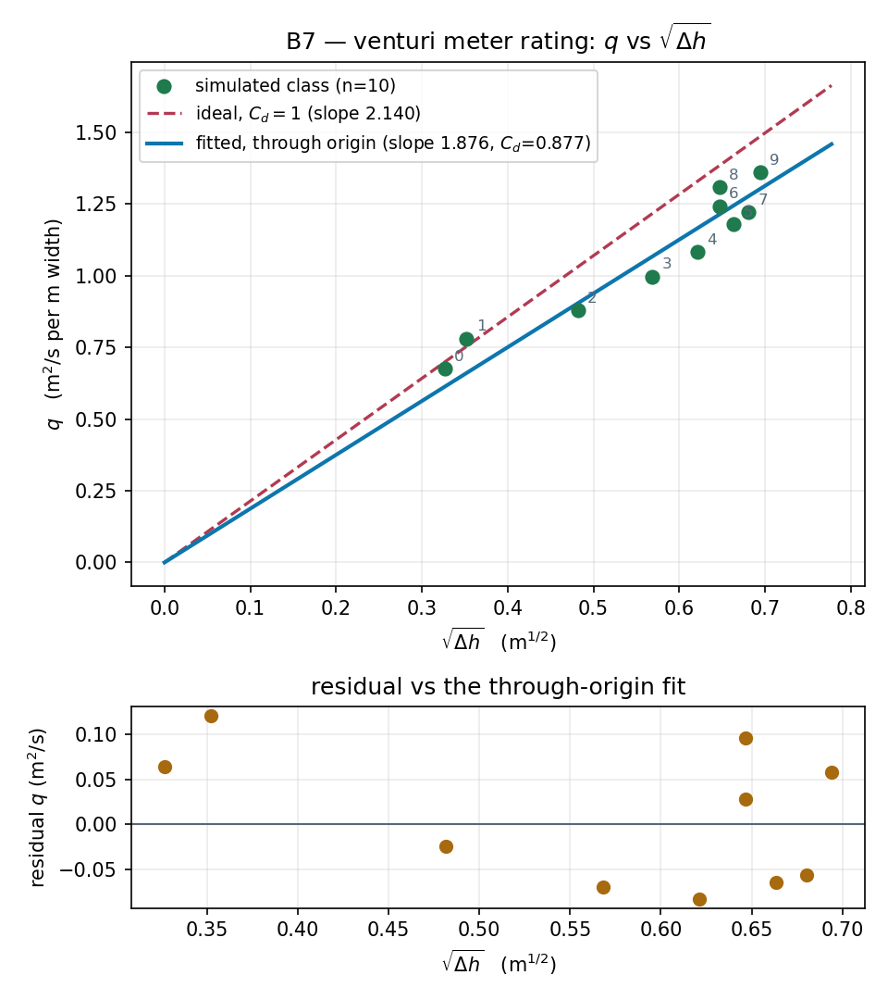

# B7 · Venturi meter rating

A venturi meter infers discharge from a pressure drop. Every student reads two
piezometric heads off a pair of gauges — one in the barrel, one in the throat —
at their own reservoir level, and submits `(q, Δh)`. Pooled, `q` against `√Δh`
is a straight line through the origin: nobody fitted a curve, the class just
sampled ten points off the meter equation the solver itself obeys. The gap
between that line and the frictionless prediction is the loss the "ideal"
venturi formula always has to fudge with a coefficient.

**Open it:** press **E** in the [app](https://barneydobson.github.io/hydraulician/)
and pick **B7**, or use the direct link
[`?ex=B7`](https://barneydobson.github.io/hydraulician/?ex=B7).
How to run any exercise: see the [teaching pack index](../INDEX.md#running-an-exercise).

## Theory

Continuity and Bernoulli between a barrel section `a₁` and a throat section
`a₂` give the meter equation:

    q = C_d · a₂/√(1 − (a₂/a₁)²) · √(2g·Δh)

so `q` against `√Δh` is a straight line through the origin, and `C_d` is the
measured slope divided by the ideal (`C_d = 1`) one. This solver works in the
vertical plane, so an "area" is a bore height per metre of width: the measured
bores are **a₁ = 0.6995 m** (barrel) and **a₂ = 0.3975 m** (throat), area ratio
0.568, giving an ideal slope of **2.140**.

`Δh` is the barrel head minus the throat head. Both gauges must sit at the
**same elevation** — the invert is flat the whole length of the duct, so
y = 0.85 m works at both stations. With `z` identical at the two taps the
elevation term cancels, and the gauge cards and the plain hover readout give
the same `Δh`.

## Your reservoir level

**d** is the **last digit of your student number** — your lecturer will
explain the assignment in class. Your reservoir level, in metres above the
domain floor, is

    level = 1.70 + 0.06 · d

| d | 0 | 1 | 2 | 3 | 4 | 5 | 6 | 7 | 8 | 9 |
|---|---|---|---|---|---|---|---|---|---|---|
| **level (m)** | 1.70 | 1.76 | 1.82 | 1.88 | 1.94 | 2.00 | 2.06 | 2.12 | 2.18 | 2.24 |

The tailwater stays at 1.55 m for everybody, so only your own level changes
what the meter sees.

## What to do

1. Set **Reservoir level** to your value.
2. Press `R` and let it reach steady state — about **15 s**; the card counts
   it down.
3. Drop two gauges (Gauge, `5`) at the **same height**: the barrel at
   (2.4, 0.85) and the throat at (5.0, 0.85). Each card prints a live **H**.
4. Take Δh = barrel **H** − throat **H**, hover the barrel run (x ≈ 2.0–3.2 m)
   and read the **`q`** row — ignore the `y_c` and profile rows beside it, they
   are an open-channel readout and mean nothing in a full pipe — and submit
   **q, dHead**.

## For the instructor — pooling the class

Collect one row per student (`student,digit,level,q,dHead`), export the CSV
and run:

```bash
python3 collect_plot.py class.csv                # -> plots/pooled-demo.png
python3 collect_plot.py data/simulated-class.csv # the shipped dry-run class
```

The script fits `q = m·√Δh` through the origin, divides that slope by the ideal
`C_d = 1` slope to get the class's own `C_d`, and plots the points against both
lines with the residuals underneath.



### Discussion points

- **Where the coefficient comes from.** The field is already Pressure head:
  the drop through the contraction is sharp and the recovery in the diffuser
  is visibly incomplete. That unrecovered head *is* `C_d < 1`, and it is why a
  real venturi ships with a calibration certificate instead of a formula.
- **Walk the level up and watch the throat gauge fall.** That falling number is
  the pressure a real meter has to keep above vapour pressure — but measured
  here it never gets near zero anywhere in the duct, even at the slider's
  ceiling, so cavitation onset is a slide rather than a demonstration.

The full verification record — the measured bore geometry, the head-convention
proof, the ten-student sweep, safe bounds and troubleshooting — is archived in
the repository at `exercises/B7-venturi-rating/_archive/README-full.md`.
