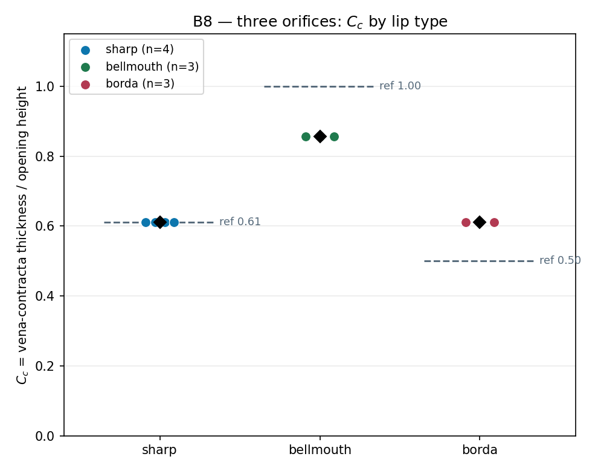

# B8 · Three orifices, three coefficients

A tank with a hole in its wall does not discharge through the hole's own
area — the jet necks down to a **vena contracta** first. C_c is that necking
ratio, and its value depends entirely on the shape of the entry: sharp edge,
rounded bellmouth, or a re-entrant Borda tube. Each student is handed one of
the three, measures C_c off the jet, and the pooled class splits into
clusters. The Borda value is **provable from ten lines of momentum**, with no
empirical coefficient anywhere in the derivation.

**Open it:** press **E** in the [app](https://barneydobson.github.io/hydraulician/)
and pick **B8**, or use the direct link
[`?ex=B8`](https://barneydobson.github.io/hydraulician/?ex=B8).
How to run any exercise: see the [teaching pack index](../INDEX.md#running-an-exercise).

## Theory

    C_c = (jet thickness at the vena contracta) / (opening height)
    C_d = C_c · C_v

The opening is **0.12 m** tall with its centreline at elevation 1.36 m, and
the outer face of the orifice plate is at **x = 2.35 m**. The vena contracta
sits half an opening beyond that face — measure at **x = 2.41 m**, or
**x = 2.44 m** for the Borda tube, whose passage is 0.03 m longer.

Expect ≈0.61 for a sharp edge and ≈1.0 for a well-rounded entry, both
empirical. The Borda tube's **0.5** is not: take a control volume bounded by
the tank walls, the tube and the jet. The only horizontal pressure force is
ρgh·A on the back wall, acting over the **full** area A, because the
re-entrant tube's forward-facing rim has no wall to push on. Set that against
the momentum flux ρ(C_c·A)v² with v² = 2gh, and C_c = ½ drops out in two
lines.

## Your lip

**d** is the **last digit of your student number** — your lecturer will
explain the assignment in class. Look up **d mod 3**; the lip arrives already
drawn for your digit.

| d mod 3 | 0 | 1 | 2 |
|---|---|---|---|
| **lip** | sharp edge | bellmouth | Borda re-entrant |
| **what you see** | the plain plate, as the tank ships | the two upstream corners cut away at 45° | a short stub tube projecting into the tank |

## What to do

1. Check the lip on screen against your row above — that is your assigned
   geometry, and it is the only thing that differs across the class.
2. Let the tank reach its steady level — about **55 s**; the card counts it
   down. This scene settles slower than most, and reading early reads a
   still-draining head.
3. Zoom in (wheel) on the wall exit until the jet fills the view, then read
   the narrowest jet core — **x = 2.41 m**, or 2.44 m for the Borda tube —
   against the drawn opening in the same frame. It is a ratio, so no scale bar
   is needed, and Measure (`8`) will tape both if you want the numbers; read
   the **bright core**, not the paler fringe. Submit **lip type** and **C_c**
   to 2 d.p.

## For the instructor — pooling the class

Collect one row per student — `lip` and `Cc` are the only required columns of
`student,digit,lip,Cc,Cv,Cd,jet_thickness_m,opening_height_m,source` — export
the CSV and run:

```bash
python3 collect_plot.py class.csv                # -> plots/pooled-demo.png
python3 collect_plot.py data/simulated-class.csv # the shipped dry-run class
```

The script groups the submissions by lip type, prints each cluster's mean and
spread against its reference value (0.611 / 1.0 / 0.5), and plots the three
clusters against those reference lines.



### Discussion points

- **The Borda cluster does not land on 0.5** — it measures 0.611, statistically
  the same as the sharp edge, and it did so at two different tube lengths. The
  derivation above is not wrong; this build is not the case it describes. The
  tube discharges into the plate's own confined throat instead of straight
  into open air, so the jet has somewhere to recover before it ever reaches a
  free exit. Do the momentum argument on the board anyway, then ask the class
  what would have to change in the drawing to earn the number.
- **C_c is not the whole story.** Switch **Field → Speed** and hover each
  lip's throat — flipping the digit reloads the geometry, so all three are a
  few keystrokes apart. The bellmouth's efflux is the slowest of the three
  (C_v = 0.81) and the sharp edge's the fastest, so the bellmouth's gain in
  C_d = C_c·C_v is real but distinctly smaller than its gain in C_c alone.

The full verification record — the station scan that fixed x = 2.41 m, the
measured C_c / C_v / C_d table for all three lips, the eye-versus-field bias
in reading the jet, the two failed geometries behind the shipped ones and
troubleshooting — is kept locally, out of version control, at
`exercises/B8-three-orifices/_archive/README-full.md`.
