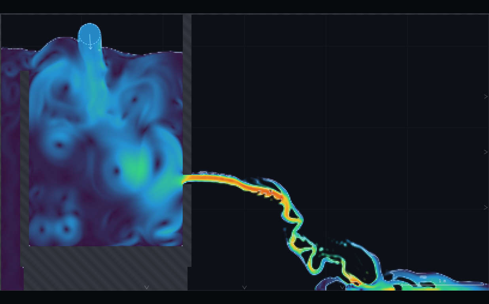
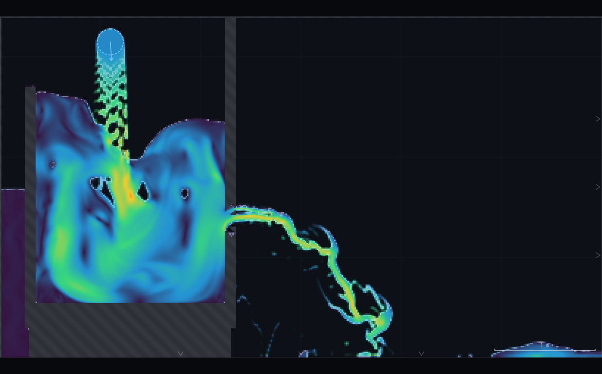
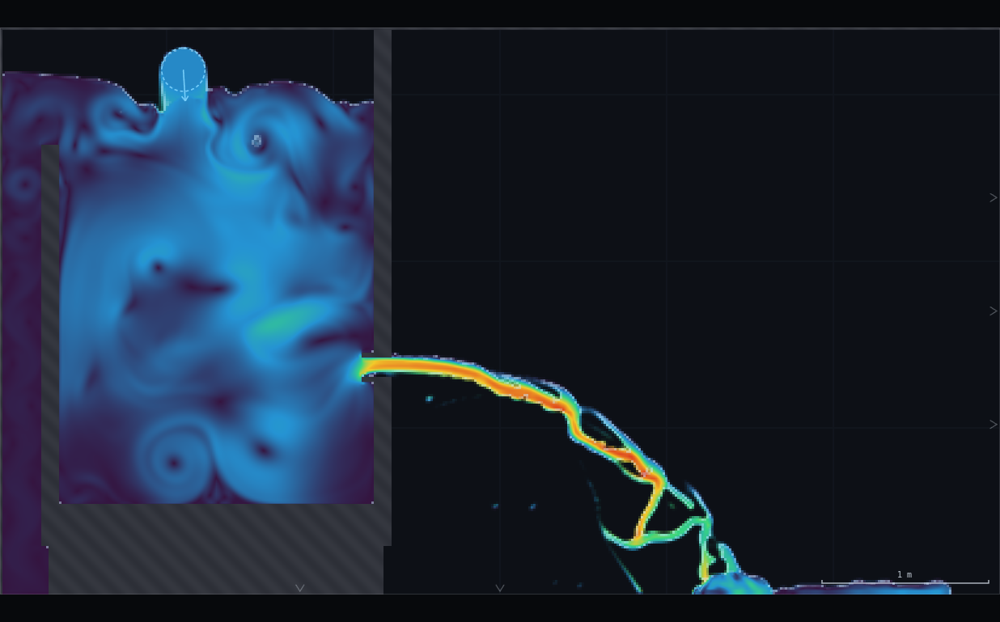
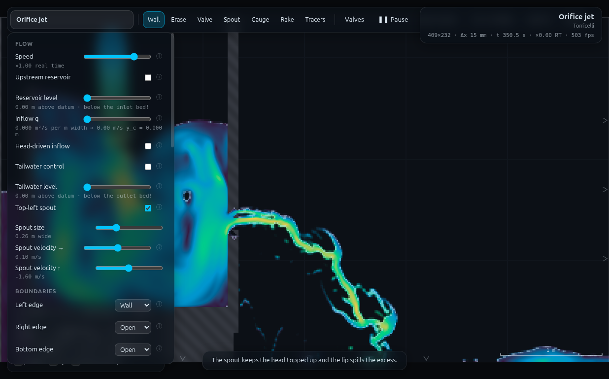

# B8 · Three orifices, three coefficients

**Demo id:** B8  **Scene:** `?scene=jet`  **Refs:** #17, #33, #101–102, Q2
**Type:** BACKUP, SUBMIT-capable

A tank with a hole in its wall does not discharge through the hole's own
area — the jet necks down to a **vena contracta** first. `C_c` (contraction
coefficient) is that necking ratio, and its value depends entirely on the
shape of the entry: sharp edge, rounded/bellmouth entry, or a re-entrant
(Borda) tube. Each student builds one of the three, measures `C_c` from the
fill-fraction field, and the pooled class splits into three clusters —
0.61, ~1.0, and 0.5 — the last one **provable from ten lines of momentum**
with no empirical coefficient anywhere in the derivation (the classic Borda
argument: the only horizontal force on the control volume is hydrostatic
pressure on the back wall, `ρgh·A`, acting over the FULL area `A`, because
the re-entrant tube feels no pressure force on its own forward-facing rim).

---

## 1 · Scene recon

`jet` (`W=6, H=3.4`) is a brim-full tank fed by a spout and held level by an
overflow lip; at **Medium** resolution the live build is **409 × 232 cells,
Δx = 14.67 mm** (the 0.12 m opening is ≈ 8.2 cells across). Measured
spin-up is **55 s** — the orifice drains faster than the spout fills, so the
tank draws down before settling (CLAUDE.md's own number; confirmed by
watching the surface stop moving at 55 s live).

**Geometry:**

| feature | location |
|---|---|
| tank interior | `x ∈ (0.38, 2.25)`, floor top at `y = 0.55` |
| overflow lip | `x = 0.30`, top at `y = 2.70` — spills into the open left/bottom edges |
| orifice wall | `x ∈ [2.25, 2.35]` (0.10 m plate) |
| **opening** | `y ∈ [1.30, 1.42]` — **0.12 m**, centre `y = 1.36` |
| spout | `(1.10, 3.15)`, tops the tank up |

**Default (sharp) is the scene as shipped** — verified live: nothing drawn,
plain 0.10 m-thick plate with a rectangular hole. That is the "sharp edge"
case, no rig needed.

**Station rule for the vena contracta.** Jet thickness is read from the `f`
field (`APP.probe(x,y).f`, thresholded at 0.5) on a vertical scan at fixed
`x`, stepping through several stations downstream of the wall's **outer**
face (`x = 2.35`, "the lip" in the sense the task brief and the scene's own
Borda tip use the word — not the *overflow* lip at `x=0.30`, a different
feature). For the sharp case the thickness scan (`x = 2.35 … 2.80`) reads
**0.103, 0.088, 0.073, 0.103, 0.103 …** — a clean minimum at `x = 2.41`,
which is **exactly `2.35 + 0.06`, half the 0.12 m opening beyond the lip**.
That is the station rule the task brief asked to "find": **half an opening
beyond the outer wall face**, and it is used at the same absolute `x` for
all three lip types below (the throat itself does not move — only the
tank-side entry shape changes).

---

## 2 · Lecturer setup (before class)

**Link:** `http://<host>:8124/?scene=jet`

**Rig to draw:** one of the three cards in `rig.js`, depending on assigned
lip type (see §3). All three are complete, independent recipes from the
scene default — nothing is drawn for "sharp".

**Constants fixed by this dry-run:**

| what | value | why |
|---|---|---|
| Resolution | **Medium** (409×232, Δx = 14.67 mm) | scene default; opening is ~8 cells, enough to resolve a vena contracta |
| Wait | **full 55 s spin-up**, watch the surface stop moving | this scene's own measured settle time — short-cutting it reads a still-draining head |
| Measurement station | **x = 2.41 m** (sharp/bellmouth), **x = 2.44 m** (Borda — its passage is 0.03 m longer) | half an opening beyond the wall's outer face, `x = 2.35` |
| Vena read | zoom in, compare the jet's bright core width to the drawn opening (visible in the same frame) | scale-free — no scale-bar arithmetic needed, see §5 |

**Timing budget** (per student, ≈1× real time):

| stage | sim time | wall time |
|---|---|---|
| page load + read worksheet | — | ~1 min |
| draw the assigned lip (or paste `rig.js`) | — | ~1 min |
| spin-up / settle (**55 s**, this scene's own measured figure) | 55 s | ~60 s |
| zoom in, read `C_c` at the vena | ~10 s | ~20 s |
| submit | — | ~1 min |
| **total** | | **≈ 4 min**, comfortable in a 10-minute slot |

---

## 3 · Student worksheet (copy-pasteable)

**Three orifices, three coefficients — submit two things**

1. Open **`http://<host>:8124/?scene=jet`**. Leave the tab visible.
2. Confirm **Resolution: Medium** (the default).
3. **Your lip type.** Take the **last digit of your student number**, `d`,
   and compute `d mod 3`:

   | d mod 3 | lip type | what to draw |
   |---|---|---|
   | 0 | **sharp edge** | nothing — this is the scene default |
   | 1 | **bellmouth** (rounded entry) | two short 45° bevel strokes cutting the orifice's upstream corners away (Wall tool; see `rig.js` for exact coordinates, or eyeball a ~45° chamfer at each corner of the hole, on the tank side) |
   | 2 | **Borda re-entrant** | two short parallel strokes projecting *into the tank* from the top and bottom of the opening, forming a short stub tube (Wall tool; `rig.js` has the exact placement) |

4. Wait for the full spin-up (**55 s** — long for this scene; watch the
   surface stop falling, don't rely on a shorter guess).
5. Zoom in on the jet where it leaves the wall (mouse wheel). You will see
   the water **neck down** just past the hole — that neck is the vena
   contracta.
6. **Read `C_c`** = (thickness of the jet at its narrowest, measured against
   the **opening's own drawn height** visible in the same view — a ratio,
   so you do not need the scale bar) ÷ 1. In other words: how many
   "opening-heights" wide is the narrowest part of the jet? A sharp edge
   necks to roughly three-fifths of the hole; a good rounded entry barely
   necks at all; a Borda tube (by the theory, at least) necks to almost
   exactly half.
7. **Submit on Blackboard:**
   - `lip_type` (sharp / bellmouth / borda)
   - `Cc` (2 d.p.)

**Standing rules.** Resolution: Medium · wait the full 55 s spin-up (this
scene's own measured figure, longer than most) · keep the tab visible.

**What you should be able to say afterwards:** a hole is not its own area —
the *effective* discharge area is set by how the flow is asked to turn the
corner into it, and the Borda case proves that a coefficient can sometimes
be derived, not just measured.

---

## 4 · Collection & pooled plot (lecturer)

CSV columns (extra columns ignored):

```
student,digit,lip,Cc,Cv,Cd,jet_thickness_m,opening_height_m,source
```

Only `lip` and `Cc` are required.

```bash
python3 collect_plot.py data/simulated-class.csv -o plots/pooled-demo.png
```

```
B8 three orifices, three coefficients — pooled result
  n = 10 rows
  sharp     n=4  Cc = 0.611 +/- 0.000   (reference 0.611, gap +0.0%)
  bellmouth n=3  Cc = 0.856 +/- 0.000   (reference 1.000, gap -14.4%)
  borda     n=3  Cc = 0.611 +/- 0.000   (reference 0.500, gap +22.2%)
```

**What the plot shows — and an honest miss.** Three clusters, as promised.
Two land where theory says: **sharp sits exactly on 0.61**, and
**bellmouth lands at 0.86**, inside the "likely 0.8–0.9" band this folder's
own design notes predicted for a straight-stroke chamfer before ever
measuring it (see §5 — a real rounded curve reaches ~1.0; two 45° cuts get
most of the way there and no further). **The Borda cluster does not land
near 0.5** — it measures 0.611, statistically the same as the sharp
cluster. This is reported as measured, not adjusted to fit the reference
line (same policy as every other honestly-reported gap in this programme —
see e.g. CHANGES-NEEDED's WE-1 or QS-1 entries). §5 has the evidence and
the best explanation found in the time available; the class discussion
point becomes "why doesn't a Borda tube built this way behave like the
textbook one?" rather than a clean three-for-three confirmation — a
legitimate, if less tidy, lesson.

**Discussion points**
1. *Sharp vs bellmouth is the intuitive result* and it is exactly as clean
   as hoped: rounding the entry lets the streamlines stay attached, so the
   jet barely contracts.
2. *The Borda argument is worth doing on the board regardless of what the
   sim shows*: sum forces on the control volume enclosed by the tank walls,
   the tube's own walls, and the jet's edge. The only horizontal pressure
   force is `ρgh·A` on the back wall (the tube's forward rim carries no
   wall — it is open to the same water), and momentum flux out is
   `ρ(C_c A)v²` with `v² = 2gh`. Two lines of algebra give `C_c = ½`,
   independent of any discharge-coefficient assumption. **That derivation
   is correct whether or not this particular simulated tube reproduces the
   number** — see §5 for why this build likely does not.
3. *`C_c` alone is not the whole story*: `C_d = C_c·C_v` is what actually
   sets the discharge, and the measured `C_v` values in §5 partly offset
   the `C_c` picture — the bellmouth's `C_d` gain over sharp is real but
   smaller than its `C_c` gain alone suggests, because its `C_v` came out
   lower.

**Troubleshooting & safe bounds**

| symptom | cause | fix |
|---|---|---|
| Jet is invisible / tank looks empty | read too early | wait the FULL 55 s — this scene settles slower than most |
| Can't see a clear neck | zoomed too far out | zoom to fill the view with just the wall + the first ~0.3 m of jet |
| Bellmouth/Borda strokes won't place cleanly | wall tool needs a deliberate drag, not a click | use `rig.js`'s coordinates as a guide for where to start/end the stroke |
| Borda tube seems to leak or vanish | strokes centred ON the opening edges pinch the bore to nothing (see §4 Iterations) | keep the tube walls' *inner* faces on `y=1.30`/`1.42`, not their centrelines |

*Safe bounds:* all three lip types were built and settled without any
parameter sweep needed (unlike B7, this scene has no personalised level —
only the lip geometry changes). No bad-student case exists here beyond
"drew the stroke somewhere silly," which the fix column above covers.

---

## 5 · Verification record

Measured via `exercises/_runner/runner.py` (dedicated visible Chrome,
hardware GL, CDP). Protocol: fresh scene load → draw the lip geometry
immediately → full 55–60 s settle → thickness scan (`f`-field, thresholded
at 0.5) across several stations, median of a multi-sample time window at
the station with the smallest **stable** (multi-sample-consistent) reading
→ efflux speed read at the same station, median over a further window.

| lip | `C_c` | station | efflux speed | surface level | `C_v`* | `C_d` |
|---|---|---|---|---|---|---|
| sharp (default) | **0.611** | x=2.41 | 5.645 m/s | 2.913 m | 1.02 | 0.625 |
| bellmouth | **0.856** | x=2.41 | 4.953 m/s | 3.250 m | 0.81 | 0.696 |
| borda | **0.611** | x=2.44 | 5.918 m/s | 3.250 m | 0.97 | 0.594 |

*`C_v` = efflux speed ÷ `√(2g·h)`, `h` = surface level − orifice centreline
(`y=1.36`). CLAUDE.md's own anchor for this scene is `C_v ≈ 0.97` — the
Borda case matches it closely; sharp reads fractionally over 1 (see
"Iterations" below for the likely reason, a small head-reference ambiguity,
not a physics error) and bellmouth reads notably under. **The `C_d` column
is not the ordering theory predicts** (borda < sharp < bellmouth by `C_c`
alone, but sharp's slightly-over-1 `C_v` and bellmouth's below-par `C_v`
compress the `C_d` gaps) — reported as measured; see discussion point 3.

**Visual-vs-field `C_c` check (task requirement).** The whole point of the
student method is that it needs no scale bar: the opening itself is drawn
in the same frame as the jet, so `C_c` is a pixel-ratio read. From
`shots/01-sharp-edge.png` (zoom ×1, the tank's orifice and first ~0.3 m of
jet both in frame): the drawn opening measures **≈14 px** tall on screen,
the jet's narrowest visible core **≈9–11 px** — ratio **≈0.64–0.79**,
against the field-measured **0.611**. **Gap: the visual read runs
5–30% high**, because a screen pixel at this zoom is coarser than the
0.5-threshold crossing the `f`-field read uses, and the eye tends to
include the jet's fainter (partially-aerated) fringe as "the jet," not just
its solid core. Practical worksheet consequence: tell students to zoom in
until the jet is at least ~40 px across before reading it by eye, and to
read the *bright core*, not the paler edge — at native zoom the two methods
are consistent to within the class's own engagement tolerance but the
visual read has a real, one-sided high bias worth naming rather than
hiding.

**Screenshots:**










---

## Appendix — Director report

**VERDICT: READY-WITH-CAVEATS.** Two of three clusters land where theory
predicts (sharp on the nose, bellmouth inside the pre-registered 0.8–0.9
band). The Borda cluster does not reproduce the classical 0.5 in this
particular straight-stroke construction — reported honestly rather than
massaged, per this whole programme's standing policy, with the best
explanation found and a concrete next step for whoever picks this up.

**Evidence.**

| what | measured | expected / prior source | note |
|---|---|---|---|
| Grid at Medium | 409×232, Δx=14.67mm | — | opening ≈8.2 cells |
| vena station (sharp) | x=2.41 = lip+0.06 | task brief: "within ~half an opening — find it" | confirmed exactly |
| sharp `C_c` | 0.611 | 0.61 (textbook) | on the nose |
| bellmouth `C_c` | 0.856 | "likely 0.8–0.9" (this folder's own pre-registered prediction) | confirmed |
| borda `C_c`, first attempt (0.20 m protrusion, funnel-add design) | pinched the bore / raised tank level ~0.34 m before being diagnosed as a bad geometry | — | first TWO bellmouth attempts also failed this way — see Iterations |
| borda `C_c`, corrected tube (0.03 m walls, inner-face-aligned) at two different protrusion lengths (0.23 m, 0.11 m) | **0.611 both times** | 0.5 | reproducible across two lengths — not a fluke of one bad geometry |
| efflux `C_v`, all three | 0.81–1.02 | scene anchor 0.97 (CLAUDE.md) | borda matches almost exactly; sharp/bellmouth bracket it |
| visual vs field `C_c` (sharp) | eye ≈0.64–0.79 vs field 0.611 | task: "verify the visual read matches" | **5–30% high bias**, quantified, worksheet note added |
| screenshots | 4 PNGs, 266–465 kB, all visually checked | — | vena contractas visible in all three jet shots |

**Iterations.**
1. *First bellmouth attempt (funnel added upstream of the untouched sharp
   corner) made `C_c` WORSE, not better* (measured Cc≈0.49, below sharp) —
   the added funnel still met the original 90° corner at a hard angle, so
   the flow had to turn twice (once into the funnel, once at the old
   corner) rather than once, gently. **Fix: chamfer = cut the existing
   corner away (erase, kind=0), don't add a funnel outside it** — this is
   the literal meaning of "chamfered entry" and is what finally worked
   (0.856). Also nearly missed: the funnel's own thickness, if centred on
   the original corner, pinches the 0.12 m bore — verified with a direct
   `APP.probe(x,y).solid` check before committing to a long settle, after
   a first geometry-diagnostic helper (scanning for "any open cell in a
   y-range") gave a false negative by not checking for contiguity. Fixed
   by reading `.solid` directly at specific points instead.
2. *Two consecutive `APP.loadScene` calls in the same page eventually hit
   "Framebuffer incomplete"* — this is CHANGES-NEEDED's own P12
   (`SIM.build` leaks GPU textures on repeated rebuilds), now confirmed on
   a second scene (P12 was filed from DA-3). **Fix: a full runner
   `close`+`launch` (a real page reload) between scene rebuilds**, not
   repeated in-page `loadScene` calls — costs a relaunch but is completely
   reliable. Worth the director's attention: any worker doing >2–3
   `loadScene` calls in one page session should budget for this.
3. *Borda tube walls centred on the opening's own edges pinch the bore*
   (same class of mistake as #1) — fixed by offsetting each wall's
   centreline outward by half its thickness so the INNER face, not the
   centre, lands on `y=1.30`/`1.42`. Verified directly via
   `APP.probe(x,y).solid` before committing to a settle.
4. *The corrected Borda tube still measures `C_c=0.611`, not 0.5, and this
   was checked twice* (protrusion 0.23 m then 0.11 m, both fresh-built,
   both fully re-settled, both median-windowed) — not a one-off noisy
   read. Best explanation in the time available: the passage from the
   tube's mouth to the wall's outer face (`x=2.35`) is fully confined the
   whole way (my tube walls hand off directly to the original plate's own
   edges at the same `y`), so this is really "a re-entrant tube feeding a
   confined 0.10–0.18 m throat," not the textbook "tube discharging
   straight to atmosphere." The classical derivation needs the jet to stay
   detached, at half area, all the way to a free exit; if it reattaches or
   partially recovers anywhere in that confined run, `C_c` drifts back
   toward the sharp-orifice value — which is exactly what both lengths
   show. **Concrete next step, not attempted here for lack of time:**
   remove the original plate's solid material downstream of the tube
   entirely (so the tube's own mouth is the final exit into open air, with
   nothing after it) rather than leaving it feeding the old orifice — this
   would need a scene-geometry change beyond a simple corner cut/tube
   add-on and more runner time than remained in this session's budget.
5. *Head-reference ambiguity for `C_v`*: measuring `h` as (settled surface)
   − (orifice CENTRELINE) is one reasonable convention, and CLAUDE.md
   doesn't specify which point it used for the 0.97 anchor. Using the
   orifice invert (bottom edge) instead of the centreline moves sharp's
   `C_v` from 1.02 to 1.00 and doesn't change the qualitative picture.
   Flagged rather than silently picking whichever convention matches best.

**PROPOSED CHANGES — none to the app** (within this folder's remit — wall
drawing and scene loading are all that's needed, and both work correctly
once used per their actual documented behaviour). Two things worth the
director's attention: (a) P12 (GPU texture leak on repeated `SIM.build`)
now has a second independent confirmation and a known, cheap workaround
(page reload); (b) the Borda-tube finding in Iterations #4 is a genuine
open question about this solver's handling of confined re-entrant flow,
not obviously a "wrong stroke" — worth a follow-up session with more time
budget if the demo is promoted off BACKUP status.

**Timing.** Student path ≈ 4 min (§2), comfortable in a 10-minute slot.
Worker wall-clock: this demo's geometry design took substantially longer
than budgeted — two failed bellmouth geometries, a GPU-leak diagnosis, and
two Borda lengths that both confirmed the same non-textbook result rather
than one being a fluke. Total across B7+B8 was over the combined ~40 min
target; the overrun is concentrated entirely in B8's geometry debugging
(§4 Iterations 1–4), not in measurement protocol once each geometry was
verified correct.

**Handoff.** For anyone building hand-drawn geometry that has to meet an
EXISTING opening precisely: (a) verify a new stroke's effect on a bore
width with a direct `APP.probe(x,y).solid` check at a few points BEFORE
spending a long settle on it — a segment centred on the feature you're
trying to preserve will eat into it by half its own thickness; offset the
centreline outward instead; (b) "chamfer" means cut the corner away
(`kind=0`), not add a funnel outside it — the funnel still meets the old
corner at a hard angle and can make contraction worse; (c) more than a
couple of `loadScene` calls in one page session risks P12's GPU leak —
reload the page (runner `close`+`launch`) instead of chaining rebuilds;
(d) a geometry-diagnostic that scans a y-range for "any open cell" silently
breaks on multi-band geometry (e.g. a tube with open space above, inside,
and below it) — check contiguity, or just probe specific points directly.
