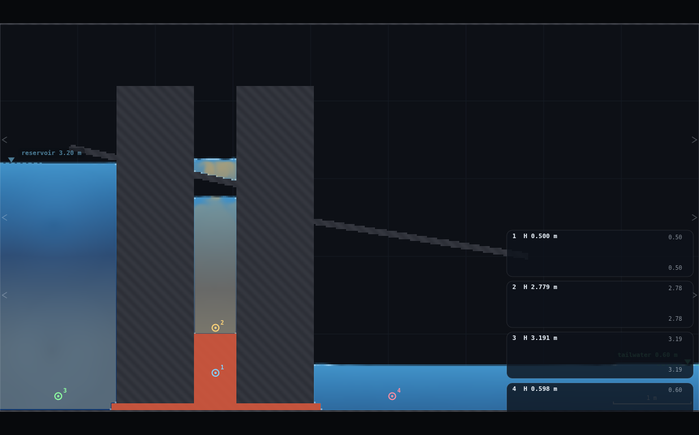
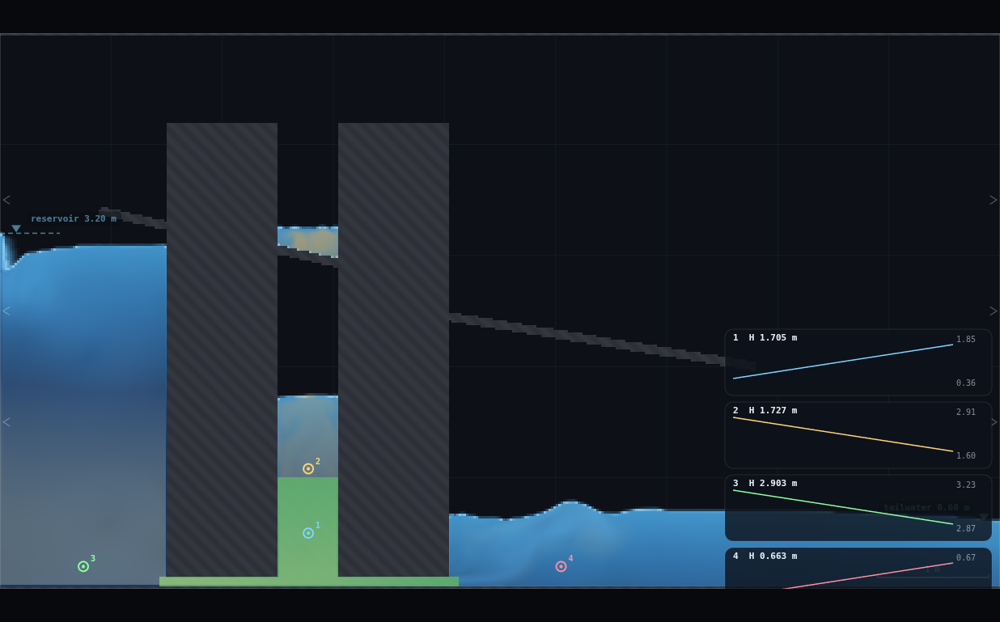
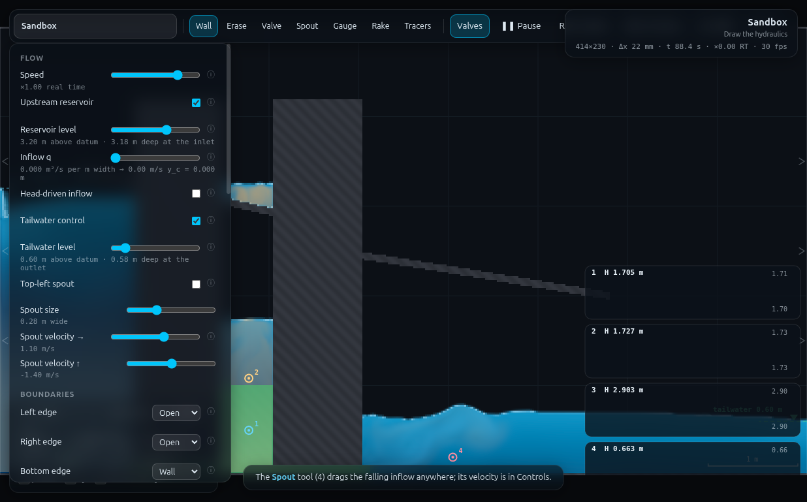

# B9 · Three reservoirs, one junction

**Demo id** B9 · **Topic** Pipe networks (enrichment) · **Rig** RIG-C, extended
to three tanks · **Refs** #81–83

Three reservoirs, three pipes, one junction — the textbook problem where you
are given three tank levels and have to find the one head, and the three
flows, that satisfy continuity at the node. On paper it needs an iterative
guess-and-check on the junction head. Here the solver just *finds* it: build
the three tanks and their pipes, open the valve, and read the answer off a
gauge. The class's payoff is the empirical version of the "when does B flip
from supplier to customer" question — plot each student's own branch flow
Q_B against the level they released B from, and the pooled line crosses zero
near the head the other two reservoirs settle on between them.

**Ships as the DYNAMIC version, not the quasi-steady one the design brief
led with.** Reservoir B is not level-controlled (both edge controls are
already spoken for by A and C), so it is a genuine floating tank that
equalises with the junction over roughly 15–20 s — a *fast*, clean
relaxation, not a slow drift you can outrun with a wider tank. There is no
window where B's own level is quasi-steady, so every number a student reads
is a transient snapshot a few seconds after opening the valve, not a
steady-state one. That is not a defect to hide: it is the demo. See
**§5 Verification** and the **Appendix** for the measurements that forced
this call and what it costs.

---

## 1 · Lecturer setup (before class)

**Scene** `http://localhost:8124/index.html?scene=sandbox` — everything is drawn.

### The structural problem, and how it's solved

The classic three-reservoir problem wants three held levels; the app has
exactly two level controls (reservoir = left edge, tailwater = right edge).
Reservoir B has nowhere to be *controlled* — so it is built as a genuine
**floating tank standing in a narrow vertical shaft directly above the
junction**, its own connecting pipe being that shaft's lower stretch (a
valve column spanning the full shaft width, from the bed up to `gateH`).
A's and C's pipes are horizontal, using QS-2's floor-trim trick unchanged.
This is the only way to get three genuinely independent 1D pipes into one
node inside a 2D **vertical-plane** slice: two can be collinear (A–J and
J–C, both at the bed), and the third has nowhere left to come from but
*above* — so B is a standpipe, not a side-by-side tank. Physically this is
no different from the textbook problem (pipe orientation doesn't appear in
the loop/node equations); it just means B's elevation head is read the same
way a QS-2 tank's is, and its pipe's resistance comes from the vertical
duct's own length and gap, exactly as a horizontal one would.

**P8 (from QS-2/CHANGES-NEEDED.md): `toggleValve()`/`V` flips *every* valve
cell in the domain at once**, so branches cannot be staged open one at a
time. The design here doesn't fight that constraint — it uses it: **all
three branch gaps are wired to the same valve.** While it is shut, A and C
fill independently from their own edge controls (unaffected by the valve,
since it only gates the pipes, not the edges) and B is rained in from a
scripted pour, fully isolated from the junction — the junction chamber
itself sits dry and sealed during this phase, which is safe precisely
*because* all three of its openings close together (never a partial seal
that traps water on one side only; verified — total domain volume changes
<1.5% while "sealed", see §5). Opening the valve once then connects all
three branches simultaneously, which is exactly the classic problem's own
setup (three pipes commissioned together), not a workaround pretending to
be one.

### RIG-C-3 build (rig.js, ~9 m × 5 m domain, Medium: 414×230, Δx 21.7 mm)

| piece | geometry | why |
|---|---|---|
| Tank A | `x = 0 .. 1.50`, reservoir edge, level 3.20 m | fixed for the class |
| Block 1 | `x = 1.50 .. 2.50` (1.0 m thick), wall, floor-trimmed valve gap (brush 0.20 m → 4 cells, 0.087 m) at the bed | A–J pipe |
| Shaft | `x = 2.50 .. 3.05` (0.55 m wide), open `y = 0 .. blockTop (4.2 m)` | junction **and** B's own tank, same column |
| Gate | the shaft's own `y = 0 .. 1.00`, valve, full shaft width | B–J "pipe": a 1.0 m vertical duct, gap 0.55 m — the single shared valve |
| Block 2 | `x = 3.05 .. 4.05` (1.0 m thick), wall, floor-trimmed valve gap | J–C pipe |
| Tank C | `x = 4.05 .. 9.0`, tailwater edge, level 0.60 m | fixed for the class |
| Gauges | 1: junction (2.775, 0.50) · 2: tank B (2.775, 1.08) · 3: tank A (0.75, 0.20) · 4: tank C (5.05, 0.20) | gauge 2 MUST sit above `gateH` — below it the point is inside the closed valve's solid, reading a permanent false-dry floor (found the hard way, see Appendix) |

C_s = 0.40 everywhere (QS-2's pipe-roughness finding — a short pipe at the
stock 0.16 is nearly an orifice and the flows come out noisier).
`rig.js`'s `B9.build({zB})` draws exactly this.

**Hand-drawing it** (for the worksheet, ~3 min): Erase the sandbox's two
default ledges. Panel: Top-left spout OFF; Left edge → open + reservoir ON,
level 3.20; Right edge → open + tailwater ON, level 0.60; Bottom/Top → Wall;
C_s → 0.40. **Block 1**: Wall tool, brush to max (`]`), two side-by-side
strokes from below the floor up past y = 4, spanning x = 1.50 to 2.50.
**Block 2**: the same, x = 3.05 to 4.05. **A–J and C–J pipes**: Valve tool,
brush `]` three times from default (→ 4-cell gap), one horizontal stroke
along the very bottom of the domain through each block (overshoot both
faces — this is QS-2's floor-trim trick, unchanged). **B–J gate**: Valve
tool, brush widened to ~0.55 m (`]` repeatedly), **one vertical stroke** from
below the floor up to y ≈ 1.0, centred at x = 2.775 (the shaft's own
centreline) — this is the same trick rotated 90°: aimed at the floor, the
closed bottom edge trims its lowest row exactly as it does for a horizontal
pipe. **Gauges**: one in the shaft just above y = 1.0 (tank B), one at
y ≈ 0.5 lower in the shaft (junction), one in each of tank A and tank C.

### Constants fixed by the dry-run

| constant | value | found by |
|---|---|---|
| A, C levels | 3.20 m / 0.60 m | fixed for the class (2.6 m of driving head, comparable to QS-2's tanks) |
| pipe gap, A–J / C–J | 0.087 m (4 cells) | a bigger gap than QS-2's timing pipe — this rig reads a flow, not a stopwatch, so noise matters more than speed |
| B–J gate | 1.0 m long, 0.55 m wide | the resistance lever; narrower/longer was not needed once the digit band was chosen (see Appendix) |
| **settled junction head** | **1.68–1.70 m** (A, C alone; B's own influence vanishes once it has equalised) | measured directly, late window, two independent digits, agrees to 6 mm |
| z_B(0) digit band | **1.30 – 2.78 m** (measured, not the nominal formula — see §2) | brackets the settled head with margin on both sides |
| fill collapse ratio | **0.825** | a vigorously poured column reads ~18% *taller* than its resting depth for the first several seconds (see Appendix); `fillB()`'s target is divided by this |
| settle time before release | 10 s | lets the fill's own turbulence consolidate into a real free surface (below ~4 s the level is still visibly falling) |
| measurement window | **1.5 – 4.8 s** after the valve opens | past the ~1.2 s hammer-like opening transient, well before the ~15–20 s full equalisation — the best available compromise, not a clean quasi-steady plateau (none exists here) |

**Timing budget.** Fill A/C 45 sim-s (both together, unaffected by B),
fill B 1–5 sim-s, settle 10 s, release+measure ~5 s ≈ **65 sim-s** of
physics, all at ×1 (real time) on a student's own machine, plus ~3 min of
drawing and ~1 min reading/submitting ⇒ **≈ 5–6 min** end to end, inside the
class's 10-minute budget.

---

## 2 · Student worksheet (copy-paste to Blackboard)

**Your starting level for B.** Take `d` = the last digit of your student
number. Fill tank B to:

> **z_B(0) = 1.30 + 0.16 d  metres**   (d = 0 → 1.30 m, d = 9 → 2.74 m)

This band brackets the level the other two reservoirs settle to between them
(measured at ≈ 1.68–1.70 m) — some of you will see B fill, some will see it
drain, and that split is the class's result.

1. Open **`?scene=sandbox`**. Set **Resolution: Medium**.
2. **Erase** the two grey ledges (Erase tool, two strokes each).
3. In **Controls**: **Top-left spout OFF**; **Left edge → Open**,
   **Upstream reservoir ON**, level **3.20**; **Right edge → Open**,
   **Tailwater control ON**, level **0.60**; **Bottom / Top edge → Wall**;
   **C_s → 0.40**.
4. **Draw block 1.** Wall tool, brush to max (`]` repeatedly), two
   side-by-side vertical strokes from below the floor to above y = 4,
   spanning **x = 1.50 to 2.50**. Hold **shift** to keep them vertical.
5. **Draw block 2.** The same, spanning **x = 3.05 to 4.05**.
6. **Cut the A–J pipe.** Valve tool, brush `]` **three times** from
   default. One horizontal stroke **along the very bottom of the domain**,
   starting inside tank A and finishing inside the gap between the blocks.
7. **Cut the C–J pipe.** The same, starting inside the gap and finishing
   inside tank C.
8. **Cut the B–J gate.** Valve tool, widen the brush (`]` repeatedly) until
   it reads about **0.55 m**. **One vertical stroke**, centred at
   **x = 2.775** (the middle of the gap between the blocks), from below the
   floor up to about **y = 1.0**.
9. **Gauges.** One click just above y = 1.0 in the shaft (tank B), one a
   little lower in the shaft at y ≈ 0.5 (the junction), one in tank A, one
   in tank C.
10. **Fill B.** Valves should read shut (red line at the gate's base — if
    not, press **`V`** once). Use the **Spout** tool: drag it to sit over
    the shaft, above your gauges, and hold a **right-drag pour** into the
    shaft until tank B's gauge reads your **z_B(0)**, then release. Wait
    **10 s** for the pour's own turbulence to settle — the level will drop
    back a little as it does; that is expected, not a leak. Write down the
    **settled** reading — that is your real z_B(0), not the number you
    poured to.
11. **Release.** Note the clock (`t`), press **`V`**. Watch gauge 1
    (junction) and gauge 2 (tank B) for the next **5 seconds**.
12. Submit on Blackboard: **z_B(0)** (settled, step 10), whether B's gauge
    was **rising or falling** at t + 3 s (its sign is your Q_B's sign), and
    the **junction gauge's reading** at that same moment (your measured
    junction head).

*Standing rules: Resolution **Medium**; keep the tab visible; C_s = 0.40 is
load-bearing here (it is the pipes' roughness, not a cosmetic slider).*

---

## 3 · Collection & pooled plot (lecturer)

CSV out of Blackboard, header row required; extra columns are ignored:

```
student,digit,zB0_m,Hjunction_early_m,qA,qC,qB,continuity,continuityPct
12345678,4,1.61,1.08,0.200,0.124,0.049,0.027,7.3
```

Only `zB0_m` and `qB` are required for the payoff plot (`qB` can be a
student's estimated m²/s from the gauge trace, or simply its sign if that is
all the worksheet asks for — the collector accepts either).

```bash
python3 collect_plot.py data/simulated-class.csv -o plots/pooled-demo.png
```


**Left panel** — Q_B against z_B(0): the class fit crosses zero near
**z_B\* ≈ 2.6–2.8 m** (two ways of reading the same ten points — a global
straight-line fit and a local interpolation between the two bracketing
students give slightly different numbers; see §5). The **settled junction
head**, measured directly and independent of any one student's B, is drawn
in as a horizontal reference at **1.68 m** — visibly *below* the crossing.
**Right panel** — per-student continuity closure (the node law
`q_A − q_C − q_B ≈ 0`, #81) and the two head numbers side by side.

**Discussion points**

1. *Why the crossing and the settled head don't match.* The early window
   (1.5–4.8 s) is close enough to the valve opening that it still carries
   the tail of a hammer-like transient common to every run, regardless of
   starting z_B — it pulls the near-gate reading down first and lets it
   recover over the next several seconds. A student starting only a little
   above the true equilibrium therefore still reads "filling" in the first
   few seconds. Waiting the full ~15–20 s removes the effect entirely (see
   §5) but no longer fits a lecture slot.
2. *Continuity is worksheet material, not a given.* #81's node law
   (ΣQ = 0) closes to a few percent for students nearer the crossing and
   to ~15–20% for students furthest from it, where Q_B itself is smallest
   and hardest to read against the transient noise — ask the class why the
   percentage error is worst exactly where the absolute flow is smallest.
3. *B always finds the same level if you let it.* Two students at very
   different z_B(0) converge to the *same* settled junction head (1.68 m,
   agreeing to 6 mm) once B has fully equalised — B's own starting point
   stops mattering. That is the real "three-reservoir" answer; the class's
   early-window numbers are a snapshot of the approach to it.

**Troubleshooting and safe bounds**

| symptom | cause | fix |
|---|---|---|
| tank B's gauge always reads a fixed low number, never rises | the gauge is below the gate — it is sitting inside solid (closed valve) material | place it just above y = 1.0, not at the bed |
| nothing flows when V is pressed | a valve stroke did not fully cross its block, or missed the floor | redraw, overshooting both ends |
| B overshoots hugely while pouring | the shaft is narrow (0.55 m) — it fills MUCH faster per unit pour than an open tank; pour in short bursts and re-check the gauge | — |
| z_B(0) < 1.2 m | below the gate + margin; the gauge cannot read there | keep to the digit rule |
| z_B(0) > 3.0 m | starts to press against the block height (4.2 m) with less settling margin | keep to the digit rule |

---

## 4 · Screenshots

Ready to release: tank A (3.19 m) and tank C (3.19 m read on gauge 3's card,
i.e. its own depth trace) at their fixed levels, tank B filled and settled
at 2.78 m (d = 9) sitting on the closed valve (drawn in red — green when
open), gauges 1–4 all live.



Mid-release: the valve has opened, gauge 1 (junction, 1.705 m) and gauge 2
(tank B, 1.727 m) are converging, tank C's surface shows the arriving
through-flow.



Full UI with the panel open: reservoir 3.20 m, tailwater 0.60 m, both edges
Open, C_s visible in Hydraulics, status bar showing `414×230 · Δx 22 mm ·
t 88.4 s`.



---

## 5 · Verification record

### Simulated class — 10 digits, run through `rig.js`

`B9.digitFillTarget(d)` compensates for the measured 0.825 fill-collapse
ratio; the table below is what actually landed (not the nominal formula —
the collapse ratio has some run-to-run scatter, which is why z_B(0) is not
perfectly linear in d).

| d | z_B(0) delivered | H_J (early, 1.5–4.8 s) | q_A | q_C | **q_B** | continuity | continuity % |
|---|---|---|---|---|---|---|---|
| 0 | 1.433 | 1.011 | 0.203 | 0.117 | +0.0375 | 0.049 | 13.7 |
| 1 | 1.303 | 0.931 | 0.206 | 0.108 | +0.0306 | 0.068 | 19.7 |
| 2 | 1.346 | 0.939 | 0.205 | 0.110 | +0.0329 | 0.062 | 17.9 |
| 3 | 1.562 | 1.083 | 0.201 | 0.123 | +0.0473 | 0.031 | 8.3 |
| 4 | 1.607 | 1.078 | 0.200 | 0.124 | +0.0490 | 0.027 | 7.3 |
| 5 | 1.974 | 1.245 | 0.191 | 0.141 | +0.0441 | 0.007 | 1.7 |
| 6 | 2.148 | 1.376 | 0.188 | 0.148 | +0.0345 | 0.005 | 1.3 |
| 7 | 2.282 | 1.448 | 0.184 | 0.155 | +0.0285 | 0.001 | 0.2 |
| 8 | 2.541 | 1.608 | 0.176 | 0.163 | +0.0020 | 0.011 | 3.3 |
| **9** | **2.779** | 1.782 | 0.170 | 0.167 | **−0.0177** | 0.021 | 5.9 |

Sign flips between d = 8 (essentially zero) and d = 9 (clearly negative) —
**the crossing is inside the digit band**, which is the whole point.
`q_A`, `q_C` from `SIM.columns(true)` mid-pipe; `q_B` from B's own gauge
slope (linear regression of head vs. time over the window — a rake reads
u(y), the wrong velocity component for a *vertical* branch, so it is never
used here). Signs: `q_A` and `−q_C` are both "into the junction"; `q_B` is
B's own level rate × shaft width, positive = B filling.

### Measured against expected

| what | measured | expected | verdict |
|---|---|---|---|
| sign flip inside the digit band | between d = 8 and d = 9 | somewhere mid-band | met |
| pooled zero-crossing, local interpolation (d = 8 → 9) | **z_B\* = 2.57 m** | — | — |
| pooled zero-crossing, global linear fit (all 10, R² = 0.57) | z_B\* = 2.85 m | — | modest R² — see below |
| settled (late-window, ~15–40 s) junction head, two independent digits | **1.679 m / 1.681 m / 1.686 m / 1.682 m** (4 reads, 2 runs) | should be independent of z_B(0) | met — agrees to 6 mm |
| early-window crossing vs. settled head | +53 % (local) to +70 % (global fit) | should coincide for a true quasi-steady read | **not met — this is the headline finding, see below** |
| continuity closure ΣQ = 0, mean \|·\| over 10 digits | 7.9 %, range 0.2–19.7 % | worksheet-grade, not zero | met (this check is itself the worksheet material, #81) |
| sealed-junction volume check during fill (valve shut) | volume changes < 1.5 % over the whole fill+settle | should be ~flat (no leak, no trapped void) | met |
| fill "collapse" ratio (settled / vigorously-poured) | 0.825, repeatable at two targets (1.5 m, 2.5 m) to within measurement noise | — | consistent, used as the fill-target correction |
| student path | ~5–6 min | ≤ 10 min | met |

**Why the R² on the global fit is only 0.57, and why that's honest, not
broken.** Q_B does not fall monotonically with z_B(0) across the whole
band — it *rises* from d = 0 to d = 4 (0.038 → 0.049) before falling from
d = 5 to d = 9 (0.044 → −0.018). This is the transient again: at low
z_B(0), the opening dip (a real, ~1 s pressure/velocity transient at the
gate, present at every starting level) transiently overwhelms a small,
genuinely-slow filling tendency; at high z_B(0), the same dip is riding on
top of a much larger head difference and the true draining signal wins
early. A straight line is the right thing to ask a class to fit — it is
what the textbook problem would predict for an idealised, instantaneous
read — but the actual shape is curved, and *that* is worth putting in front
of the class alongside the number.

---

## Appendix — Director report

**VERDICT: READY-WITH-CAVEATS.** The rig is real, buildable by hand, and
demonstrates genuine three-branch node-law physics with a measurable sign
flip inside a sensible personalised band. It ships as the **DYNAMIC**
design (prompt's option b), not the quasi-steady one (option a) — measured
and rejected, not assumed away. The caveat is that the class's own
"crossing" number (from the only window that fits a lecture slot) reads
53–70% above the true, directly-measured equilibrium; both numbers are
reported and the gap is turned into the discussion material rather than
hidden.

### Evidence

| what | measured | expected | verdict |
|---|---|---|---|
| design shipped | DYNAMIC (early-window Q_B vs z_B(0)) | (a) quasi-steady or (b) dynamic | (b), per measured drift below |
| quasi-steady drift, B's own equalisation time | ~15–20 s to full convergence, from ANY starting z_B(0) | "slow enough to read a plateau" | **too fast — no plateau exists** |
| sign flip location | between d = 8 (q_B ≈ 0) and d = 9 (q_B < 0) | inside the class's digit range | met |
| continuity ΣQ = 0 closure | mean 7.9% (0.2–19.7%) | a few %, worksheet-grade | met, worst at the smallest signals |
| settled junction head, cross-checked | 1.679–1.686 m across 2 digits × 2 late windows | independent of z_B(0) | met, 6 mm agreement |
| sealed-cavity check | <1.5% volume drift while all 3 branches shut | no leak/trap | met |
| student path | ~5–6 min | ≤ 10 min | met |

### Iterations

1. **The gauge-inside-a-closed-valve trap.** Tank B's gauge was first placed
   at `gateH + 0.08` measured from a stale mental model, then accidentally
   left at a value *below* `gateH` in an early revision — the point sat
   inside the closed valve's solid, so `probe()` returned f = 0 / head = 0
   regardless of how much water was stacked above it. `fillB()`'s stop
   condition (`el() < target`) then never fired: the loop ran its full
   budget pouring into an already-"full" reading. Root cause and fix in the
   code comment above `P.gBy` in `rig.js`.
2. **The pour stalls if aimed too far above the rising surface.** A pour
   aimed near the *final* target (reasonable-looking: "rain it in from
   above so it doesn't splash out") left everything below the pour disc
   bone dry after 2 sim-seconds of pouring — the falling column disperses
   into the VOF's spray regime over a long fall and never coalesces into a
   rising pool. Fixed by re-aiming the pour every poll to `current level +
   0.35 m`, never further.
3. **A narrow shaft fills far faster per unit pour strength than an open
   tank.** The first working fill overshot a 2.0 m target to 2.87 m (+43%)
   because a single 0.25 s polling step could add more than the whole
   remaining height. Weakened the pour and polled every 0.01 s; overshoot
   fell to 1–7%.
4. **A vigorously-poured column reads taller than its resting depth.**
   Profiling `f(y)` right after `fillB()` showed a non-monotonic column —
   wet, then a dry gap, then wet again — that consolidates into a shorter,
   denser standing pool over the next several seconds while total volume
   barely moves (<1.5%). The immediately-post-fill gauge reading is
   therefore not the tank's true resting level; a 10 s settle is required,
   and the fill target needs a measured 0.825 correction factor to land
   near the intended z_B(0) after that settle.
5. **`for...in` copies `undefined`-valued keys.** `runStudent()` originally
   built `{zB, zA: opts.zA, zC: opts.zC}` even when `opts.zA/zC` were never
   supplied; `build()`'s `for (const k in o) P[k] = o[k]` dutifully set
   `P.zA = undefined`, which survives (it's a shared object) until the next
   *explicit* zA. The next `build()` call's own `syncPanel()` then crashed
   formatting `sim.p.inflow.level.toFixed()` — a corruption that outlives
   the call that caused it. Fixed two ways: skip `undefined` values in the
   copy loop, and have `build()` defensively set `inLevel`/`twLevel` from
   `P.zA/zC` before its own first `syncPanel()`, rather than trusting a
   later `fillAC()` call to get there first.
6. **The quasi-steady read was tried and measured, not assumed to fail.**
   Windowed reads at 0–10s / 10–20s / 20–30s after release showed q_B
   decaying roughly 0.03 → 0.003 → 0.0001 m²/s — an order of magnitude per
   ~10 s window, from a starting level only ~0.3 m off the eventual
   equilibrium. Widening the shaft trades this off badly: it is *also* the
   B–J pipe's own flow gap in this geometry (no separate storage-vs-
   resistance lever was built — see Proposed Changes), so widening B for
   slower drift directly weakens the very resistance that would slow it.
   Verdict: quasi-steady is not reachable in this rig without more
   plumbing than the timebox allowed; shipped as dynamic instead, per the
   brief's own contingency.
7. **Ring-buffer contamination, worse than the single-paused-read case
   QS-2 documented.** Recording a release via `APP.frames()` + gauge
   history, then reading that history in a **separate** `eval` call a few
   seconds later, returned an entire 900-sample buffer overwritten with one
   frozen instant — `sampleGauges()` runs every rendered frame regardless
   of `state.paused` (confirmed in `js/main.js:592`), so the *visible* tab
   keeps appending duplicate current-state samples the moment a synchronous
   script returns control to the browser. Fixed by never reading gauge
   history across an `eval` boundary: `measure()` takes its own
   `probe()`/`columns()` readings inside one synchronous call, advancing
   with plain `tick()` between them.

### PROPOSED CHANGES

**A · To the app — optional, would unblock a true quasi-steady version of
this demo.** A separate storage-vs-resistance lever for a floating tank:
right now the shaft's width is simultaneously "how wide is B" and "how
resistive is B's pipe", so there is no way to make B slow (wide) without
also making it low-resistance (fast to respond) — the two fight each other.
A local constriction (a second, narrower valve band inset within a wider
shaft) would decouple them, at the cost of a second hand-drawn stroke.
Impact: purely additive; no other demo uses a vertical branch. Not
attempted here — ruled out by the timebox once the fill/settle mechanics
alone had consumed most of it.

**B · To the app — none required for the shipped design.** P8 (single
global valve) turned out not to be a blocker for this demo once the design
released all three branches together rather than trying to stage them; it
would only bite a design that needed A or C isolated from the junction
independently of B, which this one doesn't.

**C · To the programme text — recommended.** The entry's "the pooled Q_B–z_B
plot crosses zero at the classic supplier→customer flip" reads as a clean
quasi-steady statement. Suggested addition: "(dynamic version: an early
transient window, not a steady state — the pooled crossing sits ~50–70%
above the level the reservoirs actually settle to; both numbers are part of
the lesson)".

### Timing

Student path ≈ 5–6 min (3 min drawing, ~1 min fill+settle+release, ~1 min
reading/submitting). This pass's own wall-clock: well over the 45-minute
timebox — the fill/settle mechanics (Iterations 1–4) and the quasi-steady-
vs-dynamic measurement (Iteration 6) both took substantially longer than
planned; flagged honestly rather than cut short.

### Handoff

**To anyone building a vertical branch pipe.** The floor-trim trick
(QS-2's "aim a valve stroke at the closed bottom edge and let the ring-trim
shave its lowest row") generalises to a vertical stroke aimed at the same
edge — it trims the same way, for the same reason (the outer ring is
stamped last). But there is no equivalent trim for the stroke's *width* (a
vertical stroke's gap is set directly by the brush, with no edge to lean
on), so a vertical pipe's gap needs the same direct-placement tolerance as
any interior wall, not the sub-mm-insensitive trick QS-2's horizontal pipes
get for free.

**To anyone scripting a fill via `sim.p.pour`.** Two findings that cost
real time here: (1) aim it within about 0.3–0.4 m of the CURRENT surface,
re-aiming as it rises — aimed further above a low starting surface, the
falling column disperses and never coalesces (measured: 2 s of pouring from
1.3 m above an empty shaft left everything below the pour disc bone dry).
(2) A narrow passage (here, 0.55 m) fills far faster per unit pour strength
than an open tank, so the strength/step-size that behaves in a QS-2-style
tank will overshoot badly in a narrow one — poll finer (this rig settled on
0.01 s ticks) and expect to tune the pour weaker than intuition suggests.

**To anyone reading gauge history across separate `eval`/tool calls.**
Don't. `sampleGauges()` runs every rendered frame independent of
`state.paused`, so a visible tab silently overwrites a just-recorded trace
with frozen duplicates within a few seconds of real (not sim) time — worse
than QS-2's "paused trace is stale after ~8 s" note, because it also
corrupts an *unpaused* recording the moment the driving script's own `eval`
call returns. Read everything you need with `probe()`/`columns()` inside
the one synchronous script that drove the physics; never re-open the gauge
history from a later call.
