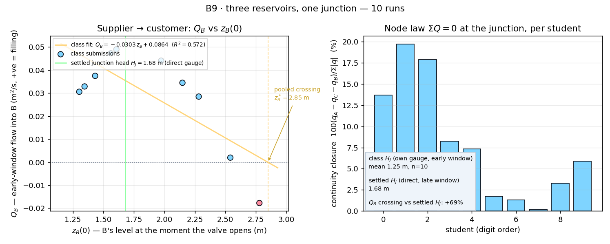

# B9 · Three reservoirs, one junction

Three tanks, three pipes, one junction — the textbook problem where you are
given the tank levels and have to find the one junction head, and the three
flows, that satisfy continuity at the node. On paper it takes an iterative
guess at the head. Here the solver simply finds it: hold A and C, pour your own
level into the middle tank, open the valve and read the answer off a gauge.
Pooled, the class answers the question the textbook only poses — at what level
does B stop supplying the junction and start taking from it?

**Open it:** press **E** in the [app](https://barneydobson.github.io/hydraulician/)
and pick **B9**, or use the direct link
[`?ex=B9`](https://barneydobson.github.io/hydraulician/?ex=B9).
How to run any exercise: see the [teaching pack index](../INDEX.md#running-an-exercise).

## Theory

Three branches meet at one node, so continuity fixes the flows and the head
loss along each branch fixes the head:

    Q_A + Q_B + Q_C = 0             continuity at the junction
    z_i − H_J = k_i·Q_i|Q_i|        head loss down branch i

with every Q counted positive *towards* the junction. Exactly one junction head
H_J satisfies all of them at once, and every sign follows from it: a tank
standing above H_J supplies the junction, one below it takes water from it.
B is the tank on the knife edge.

A is held at **3.20 m** and C at **0.60 m** (levels above the domain floor).
With those two alone the junction settles at **H_J = 1.68 m** — the level your
own B is weighed against. B is a floating tank, not a controlled one, so it
equalises with the junction in 15–20 s; every reading here is taken 3 s after
the valve opens, a snapshot of the approach rather than a steady state.

## Your start level for tank B

**d** is the **last digit of your student number** — your lecturer will explain
the assignment in class.

    z_B(0) = 1.30 + 0.16·d  metres        (d = 0 → 1.30 m, d = 9 → 2.74 m)

You pour B by hand, so the number you submit is the level it **settles** to,
not the one you aimed at.

## What to do

1. Tick **Upstream reservoir** and set **Reservoir level** to **3.20 m**, then
   tick **Tailwater control** and set **Tailwater level** to **0.60 m** — the
   rig loads with both off and the valve shut.
2. Press `R` and let A and C fill to their levels — about 45 s on the clock
   (the card's 20 s countdown times each later change).
3. Place four gauges — Gauge (`5`) — at tank A (x ≈ 0.75, y ≈ 0.20), the
   junction (x ≈ 2.78, y ≈ 0.50), tank B (x ≈ 2.78, just **above** y = 1.0;
   lower is inside the shut valve's solid and reads a false dry) and tank C
   (x ≈ 5.05, y ≈ 0.20). The cards plot piezometric head, `H`.
4. Right-drag into the shaft (x ≈ 2.78) to pour tank B up to your own level,
   keeping the pour just above the rising surface — aimed much higher, the
   falling column disperses instead of pooling. Stop, wait 10 s, and read the
   settled `H` on B's card: that, not the level you aimed at, is your z_B(0).
5. Press `V`: all three branches release together. Three seconds later note
   whether B's gauge is **rising or falling**, and read the junction gauge.
6. Submit **z_B(0)**, the **sign of Q_B** (rising = into B, positive) and the
   **junction head**.

## For the instructor — pooling the class

Collect one row per student (`student,digit,zB0_m,Hjunction_early_m,qB`; the
shipped file also carries `qA,qC,continuity,continuityPct`, which fill the
node-law panel), export the CSV and run:

```bash
python3 collect_plot.py class.csv                # -> plots/pooled-demo.png
python3 collect_plot.py data/simulated-class.csv # the shipped dry-run class
```

The script fits Q_B against z_B(0) and prints where the class's line crosses
zero — B's supplier-to-customer flip — drawing the directly measured settled
junction head beside it; the right-hand panel scores each student's own node
law, ΣQ = 0.



### Discussion points

- **Wait it out.** Leave one run going past the release: whatever level B
  started from, its gauge converges on the same junction head (1.68 m) within
  15–20 s. The pooled crossing sits above that because everybody reads at 3 s,
  with the opening transient still alive — the plot shows the gap, the app
  shows where it comes from.
- **Switch Field → Pressure head before pressing `V`.** The junction is one
  pressure, and each branch reads its own tank against it; that picture is the
  node law the right-hand panel is scoring.

The full verification record — why this ships as the dynamic version rather
than a quasi-steady one, the simulated-class table, the fill-and-settle
mechanics, safe bounds and troubleshooting — is kept locally, out of version control, at
`exercises/B9-three-reservoirs/_archive/README-full.md`.
