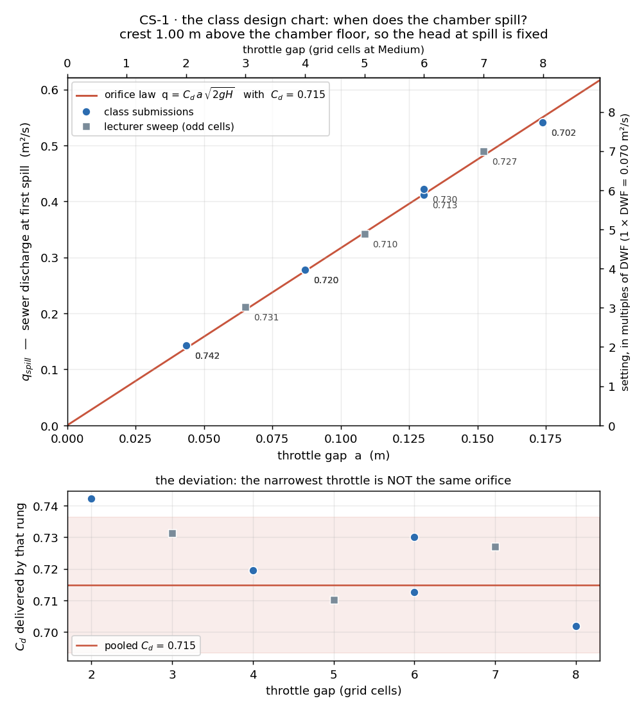
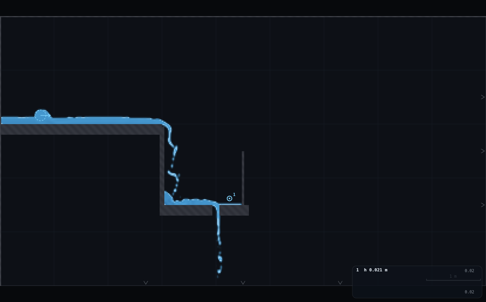
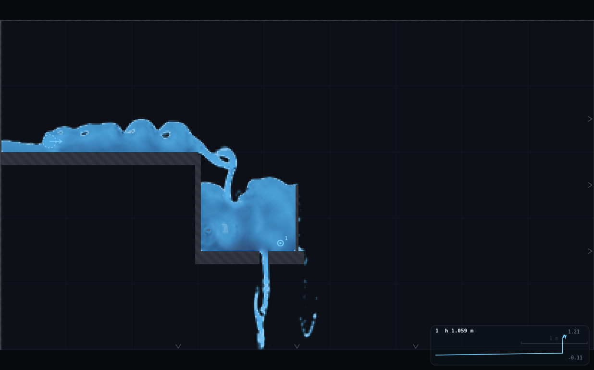
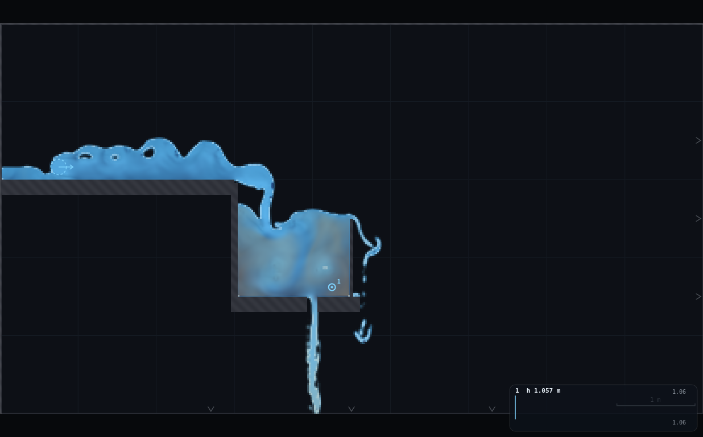
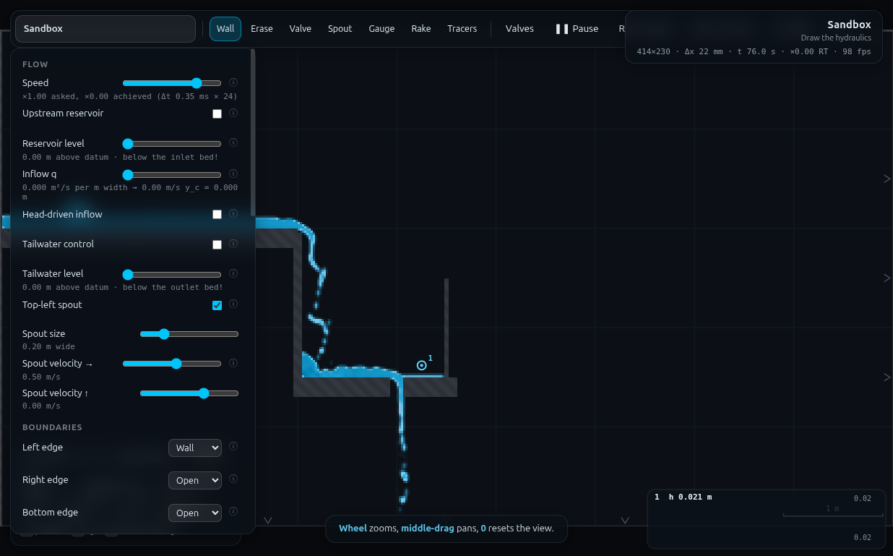

# CS-1 · Setting the overflow: when does your chamber spill? — full record (archived)

*This is the original long-form brief: the dry-run measurements, the
verification record, the director report and every constant behind the rig.
It is kept for maintainers and future reruns — the student- and
instructor-facing document is now [`../README.md`](../README.md).*

**Demo id:** CS-1 · **Scene:** `?scene=sandbox` + **RIG-D (the CSO chamber)** ·
**Refs:** #102 (orifice) and #107 (weir) — *in tandem*, because a CSO chamber is
both at once.

## How to start (30 seconds)

1. Open the app — **`http://localhost:8124/`** on the lecturer's server, or
   double-click `index.html`.
2. Press **`E`** (or click **`Exercises ▾`** in the top bar) and pick
   **CS-1**.
3. Type the last digit of your student number into the card. It prints **your
   throttle width** (r = d mod 4 → 2/4/6/8 cells) and the brush presses that
   cut it — you cut it.
4. Work through the card's **4 numbered steps** in order — this rig needs a
   sequence, and nothing does it for you.
5. Let it settle after every change you make — the card gives this demo's
   settle time (20 s of sim time) and counts it down.
6. Do the task printed on the card, then submit **gap (cells)** and
   **q_spill**.

If your lecturer gives you a link: **`?ex=CS-1`** (e.g.
`http://localhost:8124/?ex=CS-1`).

The picker gives everyone the same starting point and no more: the scene,
**Resolution: Medium**, the rig geometry, and the few settings without which
the rig is not a working rig — the card labels those as already set. Your own
values, your instruments and the order you do things in are yours to get
right. If your build ships without the rig pack the card says so; then draw it
by hand from *Manual setup* below.

---

A combined sewer arrives from the left and drops into a chamber. At the base of
the chamber a small throttle passes flow **to treatment**; a metre above it a
weir crest spills **to the river**. In dry weather the throttle takes everything
and the chamber is a puddle. As the storm grows, the chamber has to stand deeper
and deeper to push flow through the throttle — the orifice law — until the water
reaches the crest and the overflow starts. Every student cuts a **different
throttle width**, ramps their own storm, and logs the discharge at which the
crest first spills. Pooled, `q_spill` against gap is a straight line through the
origin whose slope is `C_d √(2gH)` — **the class has drawn the design chart that
sets a CSO at n × DWF**, and in this rig the arithmetic is a gift: a throttle
`n` cells wide sets the overflow at very nearly **n × DWF**.

Measured here: **C_d = 0.715, R² 0.998 over a 4× range of gap**, with each
rung's own `C_d` between 0.702 and 0.742 — and the narrowest throttle is the
outlier, which is the point of the bottom panel of the chart.

---

## 2 · Manual setup (fallback, or for building it yourself)

*The picker puts you at the same starting point as everyone else — scene,
Resolution Medium and the rig. This section is the record of every constant
behind that, and the build to follow if you are demonstrating it by hand or
the rig pack is missing.*

**Link for the slide:** `http://<host>:8124/?scene=sandbox`

**RIG-D must be drawn** (six strokes, ~2½ minutes). `rig.js` in this folder is
the card: paste it into the dev console and call `CS1.build({presses: 0})` to
reproduce the 6-cell rung exactly, `CS1.build({presses: -2})` for 4 cells, and
so on. Students draw it by hand from §3 — every dimension lands on a metre or
half-metre grid line except the throttle, which is set by a **keyboard-counted
brush width**, not by aim (that is the whole trick, inherited from QS-2).

### Constants fixed by this dry-run (do not change them in class)

| what | value | why |
|---|---|---|
| Resolution | **Medium** → 414 × 230, Δx = **21.739 mm** | standing rule; every elevation below is a whole number of cells |
| Chamber floor, top face | **y = 1.50 m** (69 cells exactly) | high enough that the treatment jet and the spill nappe both fall clear into open air |
| **Overflow crest** | **y = 2.50 m** (115 cells exactly) | so the head over the throttle at first spill is **exactly 1.00 m** — the fixed `H` in the orifice law, and the gauge card reads `h 1.00 m` at the spill point |
| Chamber | x = 3.00 → 4.50, **1.50 m wide** | storage 1.5 m³ per m width → level time constant τ = 2Ah/q ≈ 7 s at spill, so a 20 s hold is 3τ |
| Chamber floor slab | 0.20 m thick | that is the throttle's barrel length. Thin enough to stay orifice-like (measured `C_d` 0.72, matching QS-2's *short*-passage 0.71) rather than duct-like (QS-2's 1.6 m pipe: 0.18) |
| Throttle | vertical **Erase** stroke at **x = 4.00 m**, through the floor slab | width = erase brush = `state.brush × 2.2`; the aim only decides *where*, not *how wide* |
| Incoming sewer invert | **y = 3.00 m**, from off the left edge to x = 3.00 | 0.50 m above the crest, so the inflow can never be drowned by the chamber |
| Inflow | **Top-left spout**, dragged to (0.75, 3.16), **size 0.20 m**, ↑ = 0.00 | **NOT the reservoir** — see the boxed finding below. The storm is ramped on *Spout velocity →* |
| Edges | Left **Wall** · Right **Open** · Bottom **Open** · Top **Wall** | both discharges fall clear and leave through the draining floor; nothing downstream can back up |
| Reservoir / tailwater | **OFF** | — |
| Gauge | **x = 4.25, y ≈ 1.62**, "Gauges plot: **Depth**" | in the weir bay, 12 cells clear of the throttle and 11 of the crest plate (MO-1's ≥6-cell rule) |
| **1 × DWF** | **0.070 m²/s** (spout velocity → = 0.50 m/s) | the rig's dry-weather flow; the ramp starts here |

> **THE FINDING THAT SHAPED THIS RIG — a level-controlled reservoir cannot feed
> a q ramp.** Built the obvious way (reservoir on the left edge, `Inflow q`
> ramped), the *delivered* discharge is set as much by the reservoir level as by
> the slider, because the relaxation sponge makes up any mismatch between the
> pinned level and the level the arriving flow actually wants. Measured at
> `Inflow q` = 0.20 with the level at 3.60 / 3.35 / 3.20 / 3.10 m, the discharge
> actually reaching the chamber was **0.316 / 0.234 / 0.186 / 0.182 m²/s** —
> 0.15 m of level is +17 % of q. A weir/brink control needs its level to track
> `q^(2/3)`, so **no single level serves a 4× ramp**, and a per-step level table
> would be twelve chances to get it wrong. The spout has no level to pin and no
> sponge: its delivered q is repeatable to ~2 % and depends on one slider.

**Timing budget** (per student, laptop holding ≈ 1× real time):

| stage | sim time | wall time |
|---|---|---|
| open the link, read the sheet | — | ~1 min |
| draw RIG-D (6 strokes) | — | ~2½ min |
| fill and settle at 1 × DWF | 45 s | ~45 s |
| **stage 1** — coarse bracket, 10 s holds (2–11 steps by rung) | 20–110 s | same |
| **stage 2** — fine ramp, 20 s holds (≈4 steps) | 80 s | same |
| read q off the sewer, submit | — | ~1½ min |
| **total** | | **≈ 8 min**, of which the ramp itself is **3–3½ min** |

---

## 3 · Student worksheet (copy-pasteable)

**Setting a CSO overflow — submit two numbers**

Your chamber has a small pipe at the bottom going **to treatment** and a weir at
the top going **to the river**. Your job is to find the storm flow at which your
chamber first spills.

1. Open the app, press **`E`** and pick **CS-1** (or open **`?ex=CS-1`**) — it
   loads the scene at **Resolution: Medium** and draws the rig, so the build
   steps below are only for building it by hand. Keep the tab visible — the
   simulation pauses when it is hidden.
2. **Controls → Resolution: Medium** (the picker sets this). The status bar
   should read
   `414×230 · Δx 22 mm`.

### Build RIG-D (six strokes, ~2½ min)

The background grid is **1 m** squares. Hold **shift** while dragging to snap a
stroke horizontal or vertical. `Z` undoes the last stroke.

3. **Clear the sandbox's two grey ledges.** Press **`2`** (Erase), then **`]`**
   nine times (brush to maximum) and sweep across each ledge until both are gone.
4. **The incoming sewer.** Press **`1`** (Wall), then **`[`** four times (a
   ~0.20 m stroke). With shift held, drag from **off the left edge of the
   domain** to **x = 3.00 m**, aiming so the **top of the slab sits on the
   y = 3 m grid line**. Starting outside the domain matters — strokes have butt
   ends, so a stroke begun at x = 0 leaves the first column open.
5. **The chamber's upstream wall.** Same tool, drag straight **down** at
   **x = 3.00** from inside the sewer slab to **y = 1.35**.
6. **The chamber floor.** Drag with shift from **x = 2.95 to x = 4.60**, aiming
   so the **top face is on the y = 1.5 half-grid line** (halfway up the second
   grid square).
7. **The overflow weir.** Press **`[`** twice more (a thin ~0.05 m plate). Drag
   straight **up at x = 4.50 m**, from inside the floor slab (y ≈ 1.35) to the
   **y = 2.5 half-grid line**. That plate top is the crest, and it is exactly
   **1.00 m above the chamber floor**.
8. **YOUR THROTTLE — the personalised bit.** Take the **last digit of your
   student number**, `d`, and work out **`r = d mod 4`** (the remainder after
   dividing by 4). Press **`2`** (Erase). Now set the brush *by the keyboard, not
   by eye*:

   > press **`[` twenty times** (the brush stops at its minimum — extra presses
   > do nothing), then press **`]`** exactly **N** times:

   | `r` | `]` presses **N** | throttle gap | this sets the overflow at |
   |---|---|---|---|
   | 0 | **1** | 2 cells = 0.044 m | ≈ 2 × DWF |
   | 1 | **3** | 4 cells = 0.087 m | ≈ 4 × DWF |
   | 2 | **5** | 6 cells = 0.130 m | ≈ 6 × DWF |
   | 3 | **6** | 8 cells = 0.174 m | ≈ 8 × DWF |

   Then make **one short vertical stroke straight down the x = 4 m grid line**,
   from just above the chamber floor to just below it, cutting a shaft clean
   through the floor slab. **Aim at the grid line**: the *width* of the shaft is
   the brush (which you just set by counting), but which cells it lands on is
   the aim, and being half a cell off the grid line costs you one cell of gap.
9. **Panel setup** (Controls):
   - **Upstream reservoir: OFF** · **Tailwater control: OFF**
   - **Top-left spout: ON**, **Spout size → 0.20 m wide**,
     **Spout velocity ↑ → 0.00**, **Spout velocity → → 0.50**
   - **Left edge: Wall · Right edge: Open · Bottom edge: Open · Top edge: Wall**
   - **Gauges plot: Depth**
10. **Move the spout into the sewer.** Press **`4`** (Spout) and click once
    **inside the incoming sewer, about x = 0.75 m, just above the invert**. The
    inflow should now run left-to-right along the sewer and drop into the
    chamber. Press **`5`** (Gauge) and click once **in the chamber near the weir,
    about x = 4.25 m, just above the floor**. Then press **`1`** so you do not
    add gauges by accident.

### Your run

11. **Dry weather.** Leave *Spout velocity →* at **0.50** (= 1 × DWF) and wait
    until `t` = 45 s. The chamber should be nearly **empty** — a few centimetres
    of water, everything going down the throttle to treatment. That is what a
    throttled chamber does in dry weather, and it is your check that the shaft
    is open.
12. **The storm — stage 1 (bracket it).** Raise **Spout velocity →** in steps of
    **0.25**, waiting **10 seconds** on each step (watch `t` in the status bar).
    Watch the gauge card: the chamber level climbs with every step. Stop at the
    first step where the water reaches the top of the weir plate.
13. **The storm — stage 2 (pin it down).** Drop **back one step** (−0.25), then
    creep up in steps of **0.08**, waiting **20 seconds** each time.
    **First spill** is the first step at which:

    > a continuous sheet runs over the crest for a full 10 seconds — not a single
    > lick from a wave — **and** the gauge card reads **h ≥ 1.02 m**.

    (The crest is 1.00 m above the chamber floor, so the gauge reading *is* the
    head over the throttle: when it passes 1.00, you are spilling.)
14. **Read your discharge.** Leave the slider where it is and **hover the mouse
    over the incoming sewer at about x = 2 m** (the middle of the second grid
    square before the chamber). The readout prints

    > `q   0.xxx m²/s`

    Watch it for a few seconds and take a typical value. **That is `q_spill`** —
    the storm flow your overflow is set at. Do not read it off a slider.
15. **Submit on Blackboard:**
    - `gap_cells` = **2, 4, 6 or 8** (your rung from step 8)
    - `q_spill` = the sewer discharge at first spill (3 d.p.)
    - (also record your `d` and the number of `]` presses you used)

**Standing rules.** Resolution: Medium (the picker sets this) · keep the tab visible, the sim pauses
when hidden · time everything on the status-bar clock `t`, never a wristwatch ·
read the gauge as a *typical* value over several seconds, never a single frame —
a chamber with a plunging inflow slops by ±60 mm.

**What you should be able to say afterwards:** a CSO setting is not a valve you
choose, it is a *hole you size*. Because the chamber must stand a fixed 1.00 m
deep before it can reach the crest, the spill flow is `C_d·a·√(2gH)` — straight
in `a`. Double the throttle and you double the storm the works has to take
before the river gets anything.

### Last five minutes — the first flush (no submission)

16. Set the storm back to a low value and let the chamber part-fill. Now
    **right-drag** along the incoming sewer and through the chamber water: that
    pours dye — the overnight foul load sitting in the sewer and the chamber.
17. Immediately raise the storm to well past your spill point, and watch the
    crest. **The first water over the weir is the dirty water**: the chamber's
    stored foul flow is the first thing the rising level pushes over the crest,
    while the throttle below is still passing its same small clean-water-diluted
    trickle to treatment. That is first flush, and it is the reason a CSO's
    *first* spill is its worst.

---

## 4 · Collection & pooled plot (lecturer)

Blackboard export → CSV; extra columns are ignored:

```
student,digit,presses,gap_cells,gap_m,q_spill,source
```

Only `gap_cells` and `q_spill` are required (`gap_m` is derived from the cell
count if absent; `source` = `lecturer` draws a point as a grey square).

```bash
python3 collect_plot.py data/simulated-class.csv -o plots/pooled-demo.png
```

```
CS-1 pooled CSO design chart -- 13 points, gap 2.0-8.0 cells
  slope through origin   3.166  m2/s per m of gap
  -> C_d (H = 1.00 m)    0.7148
  R^2 (origin fit)       0.99817
  free fit               q = 3.091 a +0.0092   (intercept 1.7 % of range)
  C_d per rung           0.702 - 0.742, mean 0.7231
  setting delivered      2.0 - 7.7 x DWF (DWF = 0.070 m2/s)
```



**What the plot shows.** Top panel: the class's points on a line through the
origin, R² 0.998, with the right-hand axis reading the same points as
*multiples of DWF* — the design language. Bottom panel: each rung's own `C_d`
against its gap in cells, with a ±3 % band round the pooled value.

**Discussion points**

1. *Why is the line straight, and why through the origin?* Because the crest
   fixes the head. At the instant of first spill every chamber in the room is
   standing at exactly 1.00 m over its throttle, whatever the throttle is — so
   `√(2gH)` is a constant and `q_spill ∝ a`. Move the crest and the whole line
   pivots as `√H`; that is the design knob a CSO engineer actually turns.
2. *The narrowest throttle is not the same orifice.* The 2-cell rung returns
   `C_d` = 0.742, **+3.7 %** on the pooled value and the highest of the seven,
   and the 8-cell rung the lowest at 0.702. A 2-cell aperture is resolved by two
   cells and its barrel is nine apertures long; there is no reason for its
   contraction to behave like the 8-cell one, and it does not. Point at it and
   ask which end of the chart you would trust to size a real throttle — then
   note that the *whole chart* is only ±3 %, which is better than most published
   `C_d` bands.
3. *DWF is a definition, not a measurement.* Everything downstream of "n × DWF"
   depends on someone's estimate of DWF. Here 1 × DWF was declared as
   0.070 m²/s, and the whole class's settings inherit it: the same chamber is
   "6 × DWF" or "4 × DWF" depending on a number nobody measured today.
4. *Why the treatment flow barely changes during the storm.* Ask them to watch
   the jet under the chamber as the storm doubles: it hardly widens. `q ∝ √h`,
   so quadrupling the depth only doubles the flow to treatment — which is
   exactly why the rest has to go somewhere, and why the somewhere is a river.

**Troubleshooting & safe bounds**

| symptom | cause | fix |
|---|---|---|
| The chamber never fills, even at high storm | the throttle shaft is wider than you meant (brush not reset) | `Z`, redo step 8 starting from **twenty** `[` presses |
| The chamber fills instantly and spills at 1 × DWF | no shaft at all — the erase stroke missed the floor slab | `Z` and redraw the stroke so it clearly crosses the slab |
| Water leaks out of the chamber's left side | the upstream wall does not reach into the floor slab | `Z`, redraw stroke 5 down to y ≈ 1.35 |
| The whole chamber drains away | Bottom edge is Open *and* your floor slab has a second hole | undo the extra erase stroke |
| The gauge reading jumps around by ±0.06 m | that is real — the plunging inflow slops the chamber | read a typical value over ~10 s; do not chase single frames |
| Gauge trace goes flat after pausing | the chart is a 900-sample ring buffer the render loop keeps filling while paused | read the printed number, promptly |

*Safe parameter bounds (measured).*

| rung | verdict |
|---|---|
| **1 cell** | not reachable from the brush ladder aimed at a grid line (counts come out even); and a 1-cell aperture is at the rasteriser's minimum stroke radius. Not offered |
| **2 – 8 cells** | the shipped ladder. `q_spill` 0.143 → 0.541 m²/s, `C_d` 0.702–0.742, chamber level settles in ≤ 20 s, mass steady |
| **10 cells** | **fails — do not offer.** Needs q ≈ 0.9 m²/s; at that inflow the chamber is a churning plunge pool (level swings 0.5 m, single-window medians came back as 0.65 m and 2.5 m in the same run) and the apparent `C_d` climbs past 0.94, which is not an orifice coefficient, it is a broken measurement |
| spout velocity > ~4.5 m/s | same failure by another route: the jet reaches the far chamber wall. Keep the ladder ≤ 8 cells and it never happens |

---

## 5 · Verification record

Measured through `exercises/_runner/runner.py` (dedicated visible Chrome,
hardware GL, CDP), sandbox at Medium, 5.6× real time solo. Protocol per rung,
matching the worksheet's own order of operations: **fresh sandbox → `CS1.build`
→ 45 s fill at the rung's starting storm → step the spout velocity, hold 14 s,
then read a 6-second time-median of the chamber level, the sewer q and the crest
q → repeat until the median level stands one cell above the crest.** `q_spill`
is linear interpolation between the last two steps.

### Delivered geometry (read off the rasterised mask, never assumed)

| quantity | delivered | intended |
|---|---|---|
| chamber floor top face | **1.5000 m** | 1.50 (69 cells) |
| crest | **2.5000 m** | 2.50 (115 cells) |
| head at first spill, `H` | **1.0000 m** | 1.00 |
| throttle, brush ×1.3^p from 0.055, p = −4…+2 | **2 / 2 / 4 / 4 / 6 / 8 / 10 cells** | a keyboard ladder |
| **the worksheet's ladder** — `[`×20 then `]`× **1 / 3 / 5 / 6** | **2 / 4 / 6 / 8 cells** (erase widths 0.043 / 0.073 / 0.123 / 0.159 m) | the four student rungs, verified from the clamped brush floor |
| shaft position | 3.978 → 3.891 m (centred on x = 4.00) | on the grid line |

The ladder **quantises to even cell counts** when the stroke is aimed at the
x = 4 m grid line, because a stroke centred on a cell *boundary* takes cells
symmetrically: delivered cells = `2·floor(r/Δx + ½)`. Aiming half a cell off
(x = 4.011) yields the odd counts — which is how the lecturer sweep filled in
3, 5 and 7 cells, and why the student ladder is even-only.

### Simulated class (`data/simulated-class.csv`), rule `r = d mod 4`

| gap (cells) | gap (m) | `q_spill` (m²/s) | `C_d` | setting (× DWF) | source |
|---|---|---|---|---|---|
| 2 | 0.0435 | 0.1430 | **0.742** | 2.0 | student rung |
| 3 | 0.0652 | 0.2112 | 0.731 | 3.0 | lecturer sweep |
| 4 | 0.0870 | 0.2773 | 0.720 | 4.0 | student rung |
| 5 | 0.1087 | 0.3419 | 0.710 | 4.9 | lecturer sweep |
| 6 | 0.1304 | 0.4116 | 0.713 | 5.9 | student rung |
| 7 | 0.1522 | 0.4901 | 0.727 | 7.0 | lecturer sweep |
| 8 | 0.1739 | 0.5406 | 0.702 | 7.7 | student rung |

### Measured against theory

| what | measured | expected | verdict |
|---|---|---|---|
| pooled fit, `q_spill` vs `a`, n = 13 | **3.166 a**, R² **0.99817** | straight, through the origin (orifice law at fixed head) | met |
| free fit intercept | +0.0092 m²/s | 0 | 1.7 % of the range |
| `C_d` from the pooled slope | **0.715** | 0.6–0.8 for a short square-edged orifice | met; and QS-2's independent short-passage measurement was **0.71** |
| `C_d` per rung | 0.702 – 0.742 (**±2.8 %**) | constant | met, with a *systematic* excess at 2 cells (+3.7 %) — the worksheet note |
| repeatability, 6-cell rung, 3 independent runs (Δvx 0.10 up / 0.15 up / down-ramp) | 0.4116, 0.4217, 0.4252 | identical | **±1.6 %** about the mean |
| **hysteresis** (6-cell rung) | down-ramp **0.4252** vs up-ramp **0.4116** | — | **+3.3 %**, i.e. inside the run-to-run spread: no meaningful hysteresis at a 20 s hold |
| hold time needed | 14 s hold + 6 s read = **20 s** per fine step | 3τ with τ = 2Ah/q ≈ 7 s at spill | met; at 10 s holds the apparent `C_d` drifts upward through the ramp (0.61 → 0.70 on one run) because the level lags |
| chamber level at 1 × DWF | 1.5206 m, range over 6 s **1.520–1.522** | ~1.52 (throttle passes DWF on 25 mm of head) | dead steady; a clean "dry weather" state |
| chamber level noise at spill | ±0.06 m typical, ±0.16 m worst | — | why every reading in this demo is a 6 s median |
| inflow calibration (spout, 0.20 m wide) | `q ≈ 0.1755·v − 0.019`, sewer-mid vs brink agree to 2–5 % | `q = 2r·v` = 0.20·v | delivered is 0.66–0.88 of the nominal, so **students read q off the hover readout, never off a slider** |
| reservoir alternative | level 3.60/3.35/3.20/3.10 → delivered q 0.316/0.234/0.186/0.182 at slider 0.20 | slider value | **rejected** — see the boxed finding in §2 |
| `rig.js` reproduction | `CS1.build({presses:0})` from a cold paste → 6 cells, crest 2.5000, floor 1.5000, `q_spill` 0.4116 | the class table's 6-cell row | exact |
| one full student run, wall clock | ramp 3–3½ min at 1× real time | ≤ 10 min student path | ≈ 8 min end to end |

### Screenshots

Dry weather, 1 × DWF (spout velocity 0.50, q = 0.065 m²/s), 6-cell throttle: the
chamber is a 21 mm puddle, everything is going down the shaft to treatment, and
the weir plate at x = 4.5 stands high and dry. The gauge card reads `h 0.021 m`.



First spill on the same rung: the chamber is standing at `h 1.059 m` — over the
1.00 m crest — the throttle jet below is unchanged, and a sheet is running over
the crest and falling to the river on the right. This is the moment the student
logs.



The first flush. Dye poured into the sewer and the standing chamber water (the
overnight foul load), then the storm turned up: the chamber's contents are
visibly discoloured and that is what is going over the crest, while the sheet
arriving down the sewer behind it is clean.



Full UI with the control panel: reservoir **off**, spout **on** at 0.20 m wide
and 0.50 m/s, edges Wall / Open / Open, status bar `414×230 · Δx 22 mm · t 76 s`.



---

## Appendix — Director report

**VERDICT: READY-WITH-CAVEATS.** The demo works and its payoff is the cleanest
in the set so far — a line through the origin at R² 0.998 over a 4× lever, with
a `C_d` that independently reproduces QS-2's short-passage number to 1 %. Three
caveats, all documented above: (1) the inflow **cannot** be the reservoir, so
the programme's "ramp the inflow q" becomes "ramp the spout velocity and read q
off the hover readout"; (2) the personalised ladder has **4 hand-drawable rungs,
not 10** (a ten-digit class runs 2–3 students per rung, which doubles as a
mis-drawing detector); (3) the dye finale reads as a *tint*, not a colour.

### Evidence

| what | measured | expected / prior source | note |
|---|---|---|---|
| pooled slope, n = 13 | **3.166 m²/s per m**, R² **0.99817** | `C_d√(2gH)` = 3.1–3.5 | met |
| `C_d` pooled / per rung | **0.715** / 0.702–0.742 | short square-edged orifice, 0.6–0.8 | met; QS-2's short-pipe `C_d` = 0.71 independently |
| gap ladder delivered | presses −4…+2 → **2, 2, 4, 4, 6, 8, 10 cells** | 0.05–0.20 m per the programme | delivered band 0.044–0.174 m; even counts only when aimed at a grid line |
| `n × DWF` framing | 2-cell → 2.0×, 4 → 4.0×, 6 → 5.9×, 8 → 7.7× | — | "n cells ≈ n × DWF" holds to 4 % up to 7 cells |
| hysteresis | down 0.4252 vs up 0.4116 (**+3.3 %**) | — | inside the ±1.6 % run-to-run spread ×2; not a real hysteresis |
| hold time | 20 s per fine step (14 s + 6 s read) | 3τ, τ = 2Ah/q ≈ 7 s | at 10 s holds `C_d` drifts 0.61 → 0.70 across a ramp |
| reservoir inflow | 0.15 m of level ⇒ **+17 %** of delivered q | WE-1 saw ±0.1 m ⇒ 25 % on `C_d` | same pathology, fatal here because the ramp moves the fixed point |
| spout inflow | `q = 0.1755 v − 0.019`; two stations agree to 2–5 % | `2rv` | not proportional — the offset is why q is *read*, not computed |
| 10-cell rung | apparent `C_d` **0.94**, level medians unusable | ≤ 0.8 | out of range; ladder trimmed at 8 |
| dry-weather steadiness | level range 1.520–1.522 m over 6 s | — | 2 mm; the calm end of the demo is genuinely calm |
| storm-flow level noise | ±60 mm typical, ±160 mm worst | — | every number in this demo is a 6 s median |
| screenshots | 4 PNGs, 79–144 kB, all visually checked | — | rig at DWF, first spill, first flush, full UI + panel |

### Iterations

1. **The reservoir had to go.** Two hours of this demo were the reservoir. The
   first rig fed the sewer from a level-controlled left edge and ramped
   `Inflow q`; the *delivered* discharge ran 40–140 % above the slider. A level
   sweep (3.60 / 3.35 / 3.20 / 3.10 at slider 0.20) located the fixed point at
   ≈ 3.26 m — and then the arithmetic killed it: the sponge's conductance
   (≈ 0.8 m²/s per m of level error) is the same order as the feed's own
   head–discharge slope (≈ 1.25), so a level pinned right in mid-ramp is wrong
   by ±0.15 m at the ends, i.e. ±17 % of q. **A pinned level cannot follow a
   q ramp.** The spout has no level, no sponge, and no pairing table.
2. **The spill instrument was measuring the wrong direction.** The first
   criterion was the unit discharge in the column just past the crest plate. It
   reads ~0.002 m²/s while 60 mm of head is pouring over, because the nappe
   there is *falling* — `columns()` integrates the horizontal flux. Replaced
   with the chamber level standing ≥ 1 cell above the crest, which has the large
   side benefit that the instrument and the student's own gauge card are the
   same number.
3. **The throttle geometry.** A horizontal gap under a hanging plate (the
   obvious sluice) is set by *aim*, and aim at default zoom is ±1.4 cells — on a
   2-cell gap that is ±70 %. A **vertical** erase stroke through a horizontal
   floor slab has a width equal to the brush regardless of where it lands, and
   the brush is a keyboard count. That is the QS-2 lesson generalised: *pin the
   dimension to something that is not the pointer*.
4. **The crest elevation was chosen for arithmetic, not looks.** 1.50 m floor
   and 2.50 m crest are 69 and 115 cells exactly, so `H` = 1.000 m and
   `√(2gH)` = 4.4294 — which makes the gauge card read the head directly and
   turns `q_spill/(a·4.4294)` into a `C_d` a student could compute by hand.
5. **The dye finale took four attempts** and is still the weak part. Poured on
   the sewer only, the slug is diluted past visibility before it reaches the
   crest (the chamber's contents turn over in ~4 s at storm flow). What works is
   pouring into the *standing chamber water* and again into the sewer as the
   storm starts. Even then it renders as a grey-brown tint rather than the
   dye's orange, because the plunging inflow mixes hard and the dye advection is
   first-order upwind.

### PROPOSED CHANGES

**A · To the programme, CS-1's Rig and Run lines — required.** "inflow left …
ramp the inflow q slowly upward" cannot be done with the reservoir (evidence
above). Suggested replacement: *"Rig: RIG-D from the card — sewer invert at
y = 3.0 discharging into a 1.5 m chamber, floor at 1.5, crest at 2.5 (so the
head at spill is exactly 1.00 m), throttle cut through the chamber floor by a
vertical Erase stroke whose width is the keyboard brush (2 / 4 / 6 / 8 cells by
`d mod 4`), spout inflow in the sewer. Run: ramp the SPOUT VELOCITY in two
stages (0.25 steps × 10 s to bracket, 0.08 steps × 20 s to pin), read `q` off
the hover readout over the sewer at the moment of first spill. Submit
(gap_cells, q_spill). Expect q_spill 0.14–0.54 m²/s and a pooled `C_d` of
0.715 ± 3 %."*

**B · To the programme, a RIG-D card — required, since this is its first build.**
*"RIG-D · THE CSO CHAMBER — Sandbox, Left/Top edges Wall, Right/Bottom Open,
reservoir and tailwater OFF. A sewer invert slab (top face y = 3.0) from off the
left edge to x = 3.0; a wall down that face to y = 1.35; a chamber floor slab
(top face y = 1.5) from x = 2.95 to 4.60; a thin weir plate at x = 4.50 topped
at y = 2.5. The throttle is a vertical ERASE stroke down the x = 4 m grid line
through the floor slab — its width is the brush, its position is the aim. The
chamber hangs in open air: both discharges fall clear and leave through the
draining bottom edge, so nothing downstream can back up into the measurement.
Inflow is the SPOUT placed inside the sewer (0.20 m wide, ↑ = 0), never the
reservoir."* Impact: B9 and any future storm-sequencing demo inherit both the
throttle trick and the spout-not-reservoir rule.

**C · To the app — none required.** Two that would help, both already proposed
by others: **[P9]** print the *delivered* q next to the inflow slider (this demo
works around it by making students read the hover readout — which turned out to
be pedagogically better, so the workaround is not a hardship); and **[P5]**
cursor coordinates in the hover readout, since step 14 asks a student to hover
"about x = 2 m" and there is no on-screen way to know. One new, low priority:
**a way to reset the brush to a known value** (a keypress, or printing the brush
width in the status bar). Step 8's "press `[` twenty times" is a workaround for
a slider that has no readout; it works because the brush clamps at a floor, but
it is folklore.

### Timing

Student path ≈ **8 min** (2½ min drawing, 45 s fill, 3–3½ min ramp, 1½ min
reading and submitting) — the ramp itself is comfortably inside the 6–8 min the
brief allows. This pass's own wall clock: **~2¼ h against a 45-minute timebox**,
of which ~50 minutes went on the reservoir (iteration 1), ~20 on the spill
instrument (iteration 2) and ~20 on the dye.

### Handoff

**To anyone ramping a discharge.** Do not use the level-controlled reservoir.
Its delivered q depends on the level as strongly as on the q slider, and the
level's fixed point moves with `q^(2/3)`; a single level is wrong by ±17 % at
the ends of a 4× ramp. Use the spout, and *measure* q from the hover readout at
a station ≥ 1 m from anything. (WE-1's q→level table works because WE-1 changes
q **once** per run; the moment you ramp, the table becomes a per-step liability.)

**To anyone measuring flow over a crest or through a brink.** `columns()` gives
the *horizontal* unit discharge, so a falling nappe reads ≈ 0. Measure the
upstream level instead, or move the station to where the flow is still
horizontal. This cost an hour and produced a beautiful wrong answer first
(q_spill 27 % high) before it produced no answer at all.

**To anyone who needs a hand-drawn gap of a few cells.** A gap between two
*aimed* faces inherits the pointer's ±1.4-cell error. A gap that is a stroke's
own **thickness** inherits only the brush, which is a keyboard count: cut it
with one stroke *across* the thing you want a hole in. Delivered cells =
`2·floor(r/Δx + ½)` for a stroke centred on a cell boundary (even counts) and
one less for a stroke on a cell centre (odd) — so a grid-line aim gives you an
even-only ladder, and you get about four usable rungs between 2 and 8 cells.

**To B9 / any storm-sequencing demo.** Everything here is one valve-free
structure, so QS-2's global-`toggleValve` limitation ([P8]) never bites. If you
add a second overflow you will want per-valve toggling.
