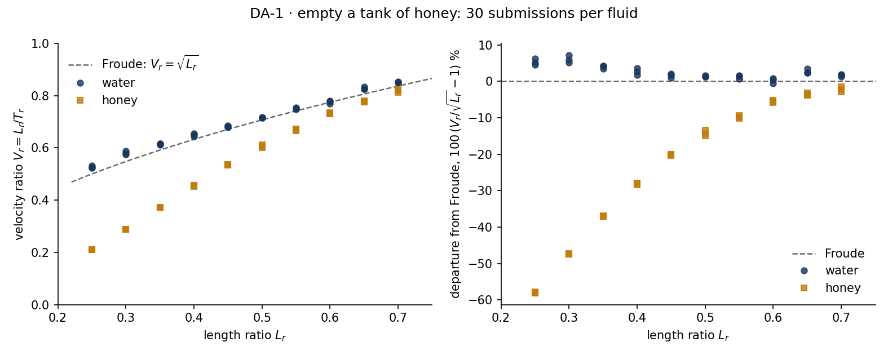

# DA-1 · Empty a tank of honey

## Lecturer notes

A quick in-class exercise, 10–15 minutes, on Froude scaling and what breaks
it. Each student gets their own model scale L_r from their student number
and drains a 4 m tank beside an exact scale copy of itself, twice:

1. **In water.** The model's velocity ratio V_r comes out at Froude's √L_r.
2. **In honey** (ν = 0.03 m²/s, 30 000 times water). Same tanks, same
   prediction, and the model drains too slowly, by more the smaller it is.

Students submit **Lr_water, Vr_water, Lr_honey, Vr_honey**, and the class
pools them into one plot against L_r: water on the Froude line, honey
falling away from it as the model shrinks.

**Open it:** press **E** in the [app](https://barneydobson.github.io/hydraulician/)
and pick **DA-1**, or use the direct link
[`?ex=DA-1`](https://barneydobson.github.io/hydraulician/?ex=DA-1).
How to run any exercise: see the [teaching pack index](../INDEX.md#running-an-exercise).
It runs on the `fluid-tanks` scene; the card sets everything up.

## The rig

The `fluid-tanks` scene is an 8.75 m × 4.0 m slice, per metre width. The
model is the prototype multiplied by L_r about its own bottom-left corner.

| | prototype (left) | model (right) |
|---|---|---|
| outer left edge | x = 0.2 m | x = 5.2 m |
| clear width | 4.0 m | 4.0 L_r m |
| slot in the floor, a | 0.40 m | 0.40 L_r m |
| fill depth above the floor | 2.8 m | 2.8 L_r m |
| gauge station | x = 1.6 m | x = 5.2 + 1.4 L_r m |

Controls → Geometry has two sliders:

- **Length ratio L_r** resizes the model.
- **Fluid** switches BOTH tanks between water (ν = 10⁻⁶ m²/s) and honey
  (ν = 0.03 m²/s).

Changing either refills both tanks. Gauges on **Depth d** read the depth
above each tank's own floor.

## Student-number rule

**d** is the last digit of the student number:

> **L_r = 0.25 + 0.05·d**

| d | 0 | 1 | 2 | 3 | 4 | 5 | 6 | 7 | 8 | 9 |
|---|---|---|---|---|---|---|---|---|---|---|
| **L_r** | 0.25 | 0.30 | 0.35 | 0.40 | 0.45 | 0.50 | 0.55 | 0.60 | 0.65 | 0.70 |

The digit is displayed, not applied. The student sets **Length ratio L_r**
themselves, on the card's field or in Controls → Geometry.

## What the students do

1. Set L_r from the digit. Both tanks refill with water.
2. Place a Depth gauge (`5`) in the prototype at x = 1.6 m. Work out the
   model's station, 5.2 + 1.4 L_r, and place the second gauge there.
3. Press **V** and let both tanks empty.
4. Expand each gauge (⤢) and hover the trace:
   - T_p: the prototype's time to fall from d = 2.50 m to 1.00 m;
   - T_m: the model's time from 2.50 L_r to 1.00 L_r.
5. Work out T_r = T_m / T_p, then V_r = L_r / T_r.
6. Set **Fluid** to honey, which refills both tanks, and repeat steps 3–5 at
   the same L_r. The honey drains more slowly: allow about 15 s.
7. Submit **Lr_water, Vr_water, Lr_honey, Vr_honey**.

## Recalculating the scaling in both cases

### Water: Froude scaling

Every length scales by L_r. With gravity and inertia the forces that matter,
velocities scale as √L_r (V ∼ √(gd), Torricelli or Froude), and a time is a
length over a velocity:

    V_r = √L_r,     T_r = L_r / V_r = √L_r

So the model should take √L_r times as long as the prototype, and the
measured velocity ratio should be √L_r. At L_r = ½:

    T_m = √L_r · T_p = 0.707 × 4.105 s = 2.90 s     measured 2.86 s
    V_r = L_r · T_p / T_m = 0.5 × 4.105 / 2.86 = 0.718     Froude: √½ = 0.707

### Honey: the same prediction, recalculated

Froude's rule does not care what the fluid is, so it predicts the same
V_r = √L_r in honey. With the honey prototype time, at L_r = ½:

    T_m = √L_r · T_p = 0.707 × 3.975 s = 2.81 s     measured 3.28 s
    V_r = 0.5 × 3.975 / 3.28 = 0.606     Froude: 0.707   (−14%)

The model is slow. Froude assumed viscosity is negligible, and in honey it
is not.

### Why: the Reynolds numbers

Add ν to the variable list and the drain time depends on a second group:

    T √(g/L) = φ(Re),    Re = V a / ν

Froude scaling works only while Re is high enough in BOTH tanks that φ no
longer depends on it. Take the jet through the slot at mid-window (d ≈ 1.75 m
in the prototype), V = √(2gd) = 5.86 m/s, a = 0.40 m. With the same fluid in
both tanks Re_r = V_r L_r = √L_r · L_r = L_r^1.5, so:

| | Re in water | Re in honey |
|---|---:|---:|
| prototype | 2.3 × 10⁶ | 78 |
| model, L_r = 0.70 | 1.4 × 10⁶ | 46 |
| model, L_r = 0.50 | 8.3 × 10⁵ | 28 |
| model, L_r = 0.25 | 2.9 × 10⁵ | 10 |

In water every model stays in the hundreds of thousands and the difference
does not matter. In honey the prototype, at Re ≈ 80, drains only 3% slower
than in water, but the models fall into the range where viscosity controls
the flow, and the smaller the model the further they fall.

### The other limit: fully viscous scaling

If viscosity dominated completely, inertia would drop out instead. A
creeping flow through the slot has V ∼ g d a² / (ν × floor thickness), and
every one of those lengths scales by L_r, so with the same fluid:

    V_r = L_r · L_r² / L_r = L_r²,     T_r = L_r / V_r = 1 / L_r

A fully viscous model would take LONGER than the prototype: twice as long at
L_r = ½, four times at ¼. The honey results sit between the two limits. At
L_r = ¼ the model already takes 1.19 times as long as the prototype (Froude:
0.5; fully viscous: 4). The pooled honey points steepen from V_r ∝ L_r^0.5
towards L_r².

### What would restore similarity?

Match Re as well as Fr: Re_r = L_r^1.5 / ν_r = 1, so the model needs a fluid
with ν_m = L_r^1.5 · ν_p. At L_r = ½ that is 0.35 × 0.03 = 0.011 m²/s: a
THINNER honey in the smaller tank. With water in the prototype the model
would need a fluid several times less viscous than water, which is why real
laboratories keep their models large enough that Re stays high. This scene
puts one fluid in both tanks, so it cannot show the fix, only the problem.

## Measured answers

Run on the card's settings; `rig.js` reproduces these. T_p is the same for
every digit: 4.105 s in water and 3.975 s in honey. V_r = L_r · T_p / T_m, with
the departure from √L_r in brackets.

| d | L_r | √L_r | T_m water (s) | V_r water | T_m honey (s) | V_r honey |
|---|---|---:|---:|---:|---:|---:|
| 0 | 0.25 | 0.500 | 1.933 | 0.531 (+6%) | 4.730 | 0.210 (−58%) |
| 1 | 0.30 | 0.548 | 2.139 | 0.576 (+5%) | 4.146 | 0.288 (−47%) |
| 2 | 0.35 | 0.592 | 2.329 | 0.617 (+4%) | 3.737 | 0.372 (−37%) |
| 3 | 0.40 | 0.632 | 2.550 | 0.644 (+2%) | 3.490 | 0.456 (−28%) |
| 4 | 0.45 | 0.671 | 2.697 | 0.685 (+2%) | 3.339 | 0.536 (−20%) |
| 5 | 0.50 | 0.707 | 2.860 | 0.718 (+1%) | 3.281 | 0.606 (−14%) |
| 6 | 0.55 | 0.742 | 3.003 | 0.752 (+1%) | 3.254 | 0.672 (−9%) |
| 7 | 0.60 | 0.775 | 3.155 | 0.781 (+1%) | 3.266 | 0.730 (−6%) |
| 8 | 0.65 | 0.806 | 3.235 | 0.825 (+2%) | 3.309 | 0.781 (−3%) |
| 9 | 0.70 | 0.837 | 3.370 | 0.853 (+2%) | 3.400 | 0.818 (−2%) |

A student hovering the traces reads each time to about ±0.03 s, a few per
cent on V_r: far smaller than the honey departures.

## Pooling the class

Collect one row per student, `student_id,digit,Lr_water,Vr_water,Lr_honey,Vr_honey`
(extra columns are ignored), export the CSV and run:

```bash
python3 collect_plot.py class.csv                 # -> plots/pooled-demo.png
python3 collect_plot.py data/simulated-class.csv  # the shipped dry-run class
```

The dry-run class has three rows per digit: the measured values and two with
±0.03 s of reading noise on each time. The script fits V_r ∝ L_r^n for each
fluid: the dry run gives n = 0.46 in water (Froude: 0.5) and 1.32 in honey,
on its way to the fully viscous 2.



## Discussion points

- **Nobody got V_r = L_r.** A Froude model runs slow in water: a 1:25 model
  of a 2-hour drain takes 24 minutes, not 5.
- **Water stays within a few per cent of Froude at every scale; honey does
  not.** The difference between the two fluids is the whole of the
  exercise: only ν has changed.
- **The smallest honey models take longer than the prototype.** Froude says
  a smaller tank always empties faster; viscosity reverses that.
- **This is the complete-turbulence rule.** A model must keep Re in the
  range where the coefficient (C_d here, λ on the Moody diagram) has stopped
  depending on it.

## Console spot-check

Paste [rig.js](rig.js) into the console and run `await DA1.run(fluid, L_r)`,
fluid 0 for water and 1 for honey: `await DA1.run(0, 0.5)` returns
T_p = 4.105 s, T_m = 2.860 s, and `await DA1.run(1, 0.5, 15)` returns
T_p = 3.975 s, T_m = 3.281 s. Give honey runs at small L_r a longer window
(the third argument, seconds of simulated time).

The honey viscosity was chosen so that the prototype is barely affected:
at L_r = ½, ν = 0.01 m²/s leaves the model on the Froude line (−0.8% in
time), and ν = 0.1 m²/s slows the prototype too.
