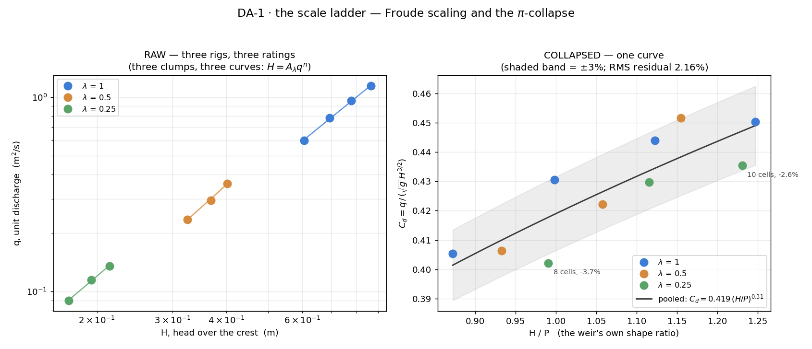

# DA-1 · The scale ladder

The class splits into thirds and builds *the same weir at three sizes* — full
scale, half scale and quarter scale, every length scaled by λ and the
discharge by λ^1.5. Each student reads one number: the head standing over
their own crest. Pooled raw, the three thirds do not even overlap — q spans
12.7×, H spans 5.0×, and each third has its own rating curve. Re-plotted as
two π-groups, with no metres anywhere, the thirty numbers become one curve.
That collapse *is* Buckingham, and the class produces it without anyone being
told what to expect.

**Open it:** press **E** in the [app](https://barneydobson.github.io/hydraulician/)
and pick **DA-1**, or use the direct link
[`?ex=DA-1`](https://barneydobson.github.io/hydraulician/?ex=DA-1).
How to run any exercise: see the [teaching pack index](../INDEX.md#running-an-exercise).

## Theory

Froude scaling shrinks every length by λ, and in this vertical slice it
shrinks the unit discharge by λ^1.5:

    lengths × λ         q × λ^1.5

The head over the crest is the approach-pool depth minus the crest height,
and the weir's discharge coefficient is the π-group that carries it:

    H = h − P           C_d = q / (√g · H^1.5)

Plot H against q in metres and each third has its own dimensional rating,
`H = A_λ q^n`, with A differing by 30% across the ladder. Plot `C_d` against
`H/P` instead and the thirds land on top of each other. One caveat worth a
slide: this is a 2D slice, so per-metre q scales as λ^1.5 — the extra λ that
would make it the textbook λ^2.5 is exactly the width the slice does not
have.

The weir is broad-crested and stands on a bed pedestal whose top face is at
**y = 0.50 m** on every rung; your own crest height **P** is in the table
below.

## Your scale and discharge

**d** is the **last digit of your student number** — your lecturer will
explain the assignment in class. Your third is **d mod 3** (λ = 1, ½ or ¼)
and the drawing loads with your digit. Your q is `q_base = 0.60 + 0.06·d`
already scaled by λ^1.5, and the reservoir level is the one paired with it —
never set one without the other:

| d | λ | q (m²/s) | reservoir level (m) | gauge x, y (m) | P (m) |
|---|---|---|---|---|---|
| 0 | 1 | 0.600 | 1.795 | 2.17, 1.25 | 0.696 |
| 1 | ½ | 0.235 | 1.165 | 1.09, 0.90 | 0.348 |
| 2 | ¼ | 0.090 | 0.840 | 0.54, 0.72 | 0.174 |
| 3 | 1 | 0.780 | 1.890 | 2.17, 1.25 | 0.696 |
| 4 | ½ | 0.295 | 1.210 | 1.09, 0.90 | 0.348 |
| 5 | ¼ | 0.115 | 0.865 | 0.54, 0.72 | 0.174 |
| 6 | 1 | 0.960 | 1.975 | 2.17, 1.25 | 0.696 |
| 7 | ½ | 0.360 | 1.250 | 1.09, 0.90 | 0.348 |
| 8 | ¼ | 0.135 | 0.880 | 0.54, 0.72 | 0.174 |
| 9 | 1 | 1.140 | 2.055 | 2.17, 1.25 | 0.696 |

## What to do

1. Set **Inflow q** and **Reservoir level** to your row — they are a pair.
2. Press `R` and let it reach steady state — about **55 s**; the card counts
   it down (the ½ and ¼ rungs are there in 40 s and 28 s).
3. Drop a Gauge (`5`) at your station in the approach pool and read the
   card's `h` — it should be steady to the last digit or two.
4. Compute **H = h − P** and submit **λ, q, H**.

## For the instructor — pooling the class

Collect one row per student (`student,digit,lambda,q,H`; any extra columns
are ignored), export the CSV and run:

```bash
python3 collect_plot.py class.csv                # -> plots/pooled-demo.png
python3 collect_plot.py data/simulated-class.csv # the shipped dry-run class
```

The script fits each third's own dimensional rating `H = A_λ q^n` for the raw
panel, then re-plots every point as `C_d = q/(√g H^1.5)` against `H/P`, where
the shipped class collapses onto one curve to 2.2% RMS — with a shaded ±3%
band that leaves the λ = ¼ droop visible rather than hiding it.



### Discussion points

- **Run the ladder live.** Pick DA-1 at a digit from each third — 0, then 1,
  then 2 — and the same weir arrives full, half and quarter size in the same
  box. Run all three at one matched base q and the gauge follows the ladder
  down: h = 1.449 / 0.721 / 0.368 m at λ = 1 / ½ / ¼, ratios of 2.01 and 3.94
  against an ideal 2 and 4.
- **The droop is the handover to DA-3.** λ = 1 sits +1.6% above the pooled
  curve, λ = ½ +0.4%, λ = ¼ −2.4% — monotone in λ, and refining the grid
  moves it by only 0.45%, so it is not a mesh artefact. What does not shrink
  with the model is the grid: a free surface always ~2 cells thick is 25%
  of H at λ = ¼ against 6% at λ = 1, and the eddy viscosity is tied to Δx,
  not to λ^1.5. That is this solver's version of Re and We refusing to follow
  Froude.

The full verification record — the cell arithmetic that fixes the discharge
band, the measured q → reservoir-level rule, the junk-floor and
grid-refinement tests, safe bounds and troubleshooting — is kept locally, out of version control, at `exercises/DA-1-scale-ladder/_archive/README-full.md`.
