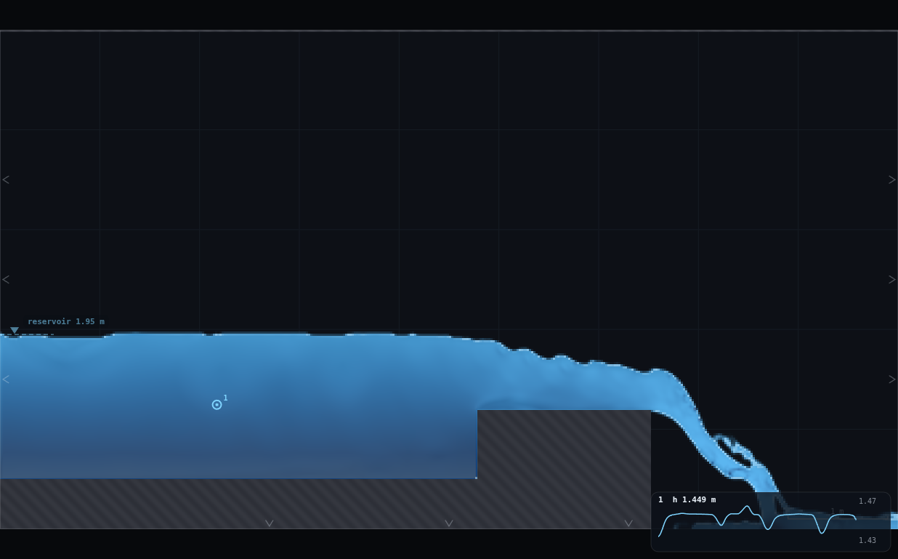
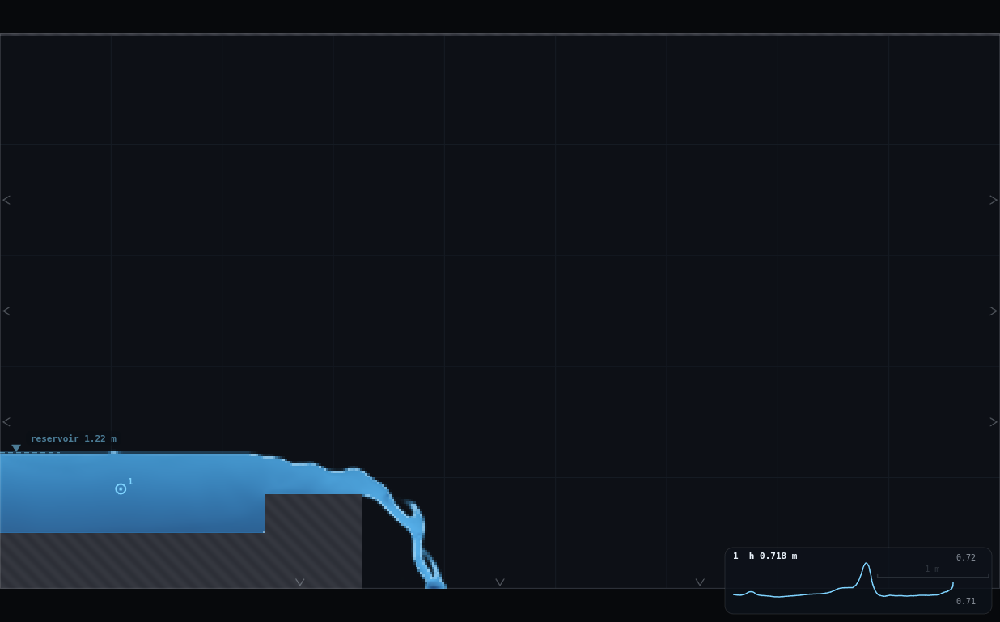
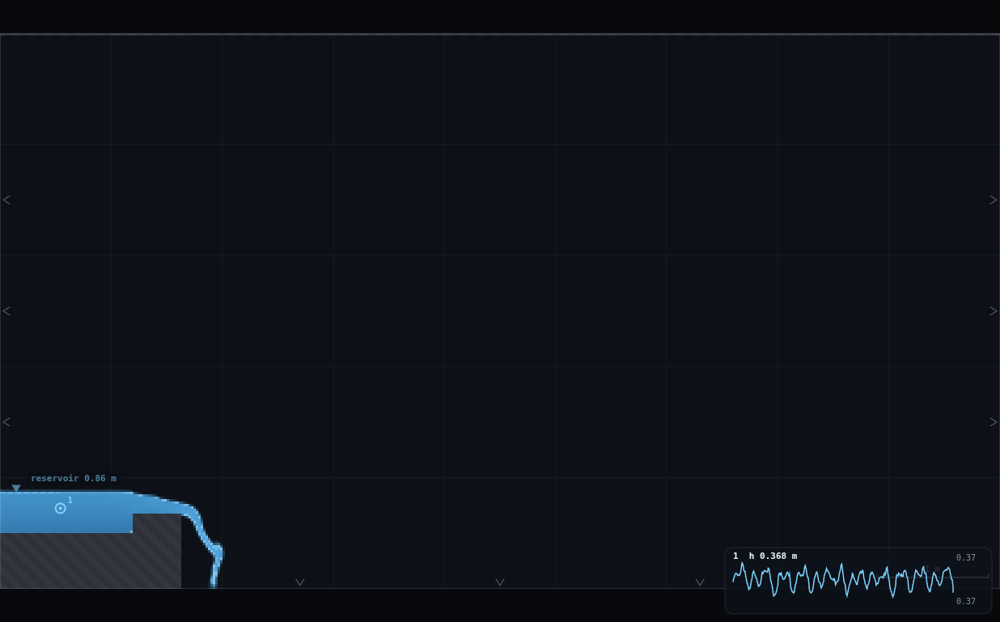
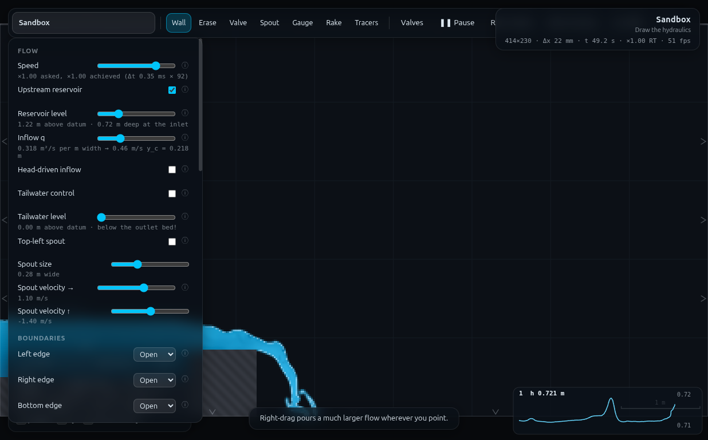
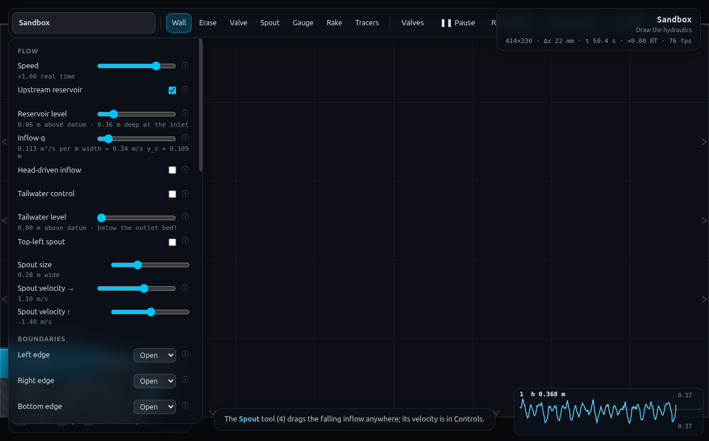

# DA-1 · The scale ladder — full record (archived)

*This is the original long-form brief: the dry-run measurements, the
verification record, the director report and every constant behind the rig.
It is kept for maintainers and future reruns — the student- and
instructor-facing document is now [`../README.md`](../README.md).*

**Demo id:** DA-1  **Scene:** `?scene=sandbox` + **RIG-B** with a broad-crested
weir block  **Refs:** D1, D13, D22–D23, D15 · Froude scaling and the π-collapse

## How to start (30 seconds)

1. Open the app — **`http://localhost:8124/`** on the lecturer's server, or
   double-click `index.html`.
2. Press **`E`** (or click **`Exercises ▾`** in the top bar) and pick
   **DA-1**.
3. Type the last digit of your student number into the card. It prints **your
   λ third** (d mod 3) with the geometry that goes with it, and **your q and
   reservoir level** — you set those two.
4. Let it settle after every change you make — the card gives this demo's
   settle time (55 s of sim time) and counts it down.
5. Do the task printed on the card, then submit **λ**, **q** and **H**.

If your lecturer gives you a link: **`?ex=DA-1`** (e.g.
`http://localhost:8124/?ex=DA-1`).

The picker gives everyone the same starting point and no more: the scene,
**Resolution: Medium**, the rig geometry, and the few settings without which
the rig is not a working rig — the card labels those as already set. Your own
values, your instruments and the order you do things in are yours to get
right. If your build ships without the rig pack the card says so; then draw it
by hand from *Manual setup* below.

---

The class splits into thirds and builds *the same weir at three sizes* — full
scale, half scale and quarter scale, every length scaled by λ and the discharge
by λ^1.5. Each student reads one number: the head `H` standing over their crest.

Pooled raw, the three thirds do not even overlap: `q` spans 12.7×, `H` spans
5.0×, and each third has its own dimensional rating `H = A_λ q^n` with `A`
differing by **30%** across the ladder. Re-plotted as `C_d = q/(√g H^{3/2})`
against `H/P` — two π-groups, no metres anywhere — the thirty numbers become
**one curve**, RMS scatter **2.2%**. That collapse *is* Buckingham, and the
class produced it without anyone being told what to expect.

The residual is the second lesson and it is honest: the λ = ¼ third sits
**2.4% below** the pooled curve, λ = ½ at +0.4%, λ = 1 at +1.6% — a monotone,
λ-ordered droop that survives a grid-refinement test (§5). That labelled
residual is DA-3's opening exhibit.


---

## 2 · Manual setup (fallback, or for building it yourself)

*The picker puts you at the same starting point as everyone else — scene,
Resolution Medium and the rig. This section is the record of every constant
behind that, and the build to follow if you are demonstrating it by hand or
the rig pack is missing.*

**Link for the slide:** `http://<host>:8124/?scene=sandbox`

`rig.js` is the reusable card, and the picker applies it for you. To build it
by hand instead, paste it into the dev console with the sandbox loaded, then `DA1.build(0.25, 0.90)` (λ, base q) or `DA1.student(5)` for one
whole student run. Students draw by hand in ~90 s (§3).

### 2.1 · The cell arithmetic that fixes everything else

This is the design, and it belongs on a slide because it is itself a scale
effect. At **Medium** the sandbox is 414 × 230 cells, **Δx = 21.739 mm**.

WE-1 measured the junk floor for a head on this grid: `H` = **6.9 cells worked**
(`C_d` on trend, mass balance 1.4%), `H` = **4.9 cells failed** (`C_d` = 0.484,
+17% mass imbalance). Re-measured on *this* rig the floor is the same,
**H ≈ 7 cells** (§5.3). `H` scales with λ, so

> the λ = ¼ third's SMALLEST head must be ≥ 7 cells
> ⇒ the same case at λ = 1 must be ≥ **28 cells = 0.609 m**
> ⇒ that case needs **q ≥ 0.61 m²/s** at full scale (measured rating, §2.3)
> ⇒ and the whole band must still fit under the **1.2 m²/s slider cap**.

So the usable base-q window is **0.61 → 1.20**, and the shipped band
`q_base = 0.60 + 0.06·d` (0.60 → 1.14) sits inside it with the λ = ¼ third
(digits 2, 5, 8 → 0.72 / 0.90 / 1.08) starting **18% clear** of the floor.
Delivered: **7.9 / 8.9 / 9.8 cells**.

**The λ = ¼ rung survives, and the arithmetic above is why the λ = 1 rig runs
so close to the slider cap.** The full-scale rig passes 0.60–1.14 m²/s not
because the hydraulics want it but because its quarter-scale twin needs eight
cells of head; the *grid* set the discharge of a rig four times its size. That
is the demo's own scale effect, before a single number is measured.

The ladder closes at three rungs; no fallback (λ = ⅓, or a demonstrative ¼) was
needed.

### 2.2 · What scales, and what does not

Every base dimension is a multiple of **4 cells**, so λ = 1, ½, ¼ rasterise to
**exact** cell counts — DA-2's trick, verified on every build (§5):

| modelled quantity | λ = 1 | λ = ½ | λ = ¼ |
|---|---|---|---|
| crest height `P` above the bed | **32 cells** = 0.6957 m | **16** = 0.3478 m | **8** = 0.1739 m |
| crest length `L_c` | **80 cells** = 1.7391 m | **40** = 0.8696 m | **20** = 0.4348 m |
| block upstream face `x_b` | **220 cells** = 4.7826 m | **110** = 2.3913 m | **55** = 1.1957 m |
| gauge station `x_g` | **100 cells** = 2.1739 m | **50** = 1.0870 m | **25** = 0.5435 m |
| brink `x_e` = `x_b` + `L_c` | 6.5217 m | 3.2609 m | 1.6304 m |
| crest elevation | 1.1957 m | 0.8478 m | 0.6739 m |
| gauge → block face | 2.609 m = **3.0–4.3 H** | 1.304 m = **3.2–4.0 H** | 0.652 m = **3.0–3.8 H** |
| discharge `q` | `q_base` | `q_base` × 0.3536 | `q_base` × 0.125 |

**Deliberately NOT scaled** (name these on the slide — they are where the scale
effects live):

- **The bed pedestal**, top face **y = 0.50 m** (23 cells) on every rung. How
  high the flume floor stands above the domain floor is not part of the modelled
  weir, it is what the model stands on (DA-2's "why the plate does not scale").
  Keeping it fixed also keeps WE-1's 10-second bed self-check valid on all three
  rungs, and keeps the free overfall free at every λ.
- **Δx** — the grid does not know about λ. `H` is resolved in 28–40 cells at
  λ = 1 and 8–10 at λ = ¼. **That is the point of the demo.**
- **The reservoir relaxation sponge** (~10 cells, CLAUDE.md), a fixed number of
  *cells*: it eats 4.5% of the λ = 1 approach and 18% of the λ = ¼ approach.
- **The Smagorinsky eddy viscosity**, ν_t = (C_s Δx)²|S| — tied to the cell, so
  it does not fall as λ^1.5 the way a Froude-similar viscosity would. This is
  the model's own version of "Re cannot follow Froude" (D3–D5).

### 2.3 · The q → reservoir-level rule (per third)

The reservoir **pins** the surface at its level (CLAUDE.md), so it must be set
to what the weir's own backwater wants — WE-1's fixed point, and it is
load-bearing here too because DA-1 measures `H` *in that pool*.

Measured at λ = 1 on this solver: **`H = 0.799 q^0.562`** (four points, §5).
The exponent is **not** 2/3 because `C_d` is not constant — the same story as
WE-1/Rehbock. Exact Froude similarity (`H_λ = λH₁` at `q_λ = q₁λ^1.5`) then
forces the *coefficient* — and only the coefficient — to carry a λ:

> **A_λ = A₁ · λ^(1 − 1.5n) = 0.799 · λ^0.157**
> level = crest elevation + A_λ · q^0.562

| third | crest elevation | A_λ | level rule |
|---|---|---|---|
| λ = 1 | 1.1957 | 0.799 | `1.196 + 0.799 q^0.562` |
| λ = ½ | 0.8478 | 0.717 | `0.848 + 0.717 q^0.562` |
| λ = ¼ | 0.6739 | 0.643 | `0.674 + 0.643 q^0.562` |

That λ^0.157 is **not** a scale effect — it is the price of writing a
*dimensional* rating. Re-plot the same data as `C_d` vs `H/P` and it vanishes.
Worth 60 seconds on the slide: the level table students are handed is itself an
un-collapsed π-group.

**Delivered accuracy:** the rule landed within **7 mm** of the measured fixed
point at every rung and every digit; a WE-1-style correction pass
(`level ← measured surface`) moved `H` by **0.00 m** at λ = ¼ and ≤ 0.001 m at
λ = ½ (§5). Students never iterate.

### 2.4 · The three build cards

All three share: **Resolution Medium**, spout **OFF**, wave piston **OFF**,
**Left / Right / Bottom edges Open, Top edge Wall**, reservoir **ON**,
head-driven inflow **OFF**, **tailwater OFF**, field **Water**.

**Common stroke (all thirds) — the bed pedestal.** Erase the sandbox's two grey
ledges (Erase, `]`×9, one sweep each). Then Wall, brush at maximum (0.5 m),
shift-drag from **off the left edge** to **x = x_e (your third's brink)**,
centred a quarter of the way up the first grid square: **top face y = 0.50 m**,
solid to the domain floor. **The bed must END at the brink** — WE-1's ponding
trap; carried to an Open right edge the whole domain floods and drowns the crest.

| | **λ = 1** | **λ = ½** | **λ = ¼** |
|---|---|---|---|
| bed slab, x = −0.3 → | **6.52 m** | **3.26 m** | **1.63 m** |
| crest block, x = | **4.78 → 6.52 m** | **2.39 → 3.26 m** | **1.20 → 1.63 m** |
| crest top face, y = | **1.196 m** | **0.848 m** | **0.674 m** |
| block strokes needed | **2** (0.5 m brush max: 0.44 → 0.82, then 0.82 → 1.196) | **1** (brush ≈ 0.41, y 0.44 → 0.848) | **1** (brush ≈ 0.24, y 0.44 → 0.674) |
| gauge at x = | **2.17 m** | **1.09 m** | **0.54 m** |
| settle to | **t = 55 s** | **t = 40 s** | **t = 28 s** |
| digits | 0, 3, 6, 9 | 1, 4, 7 | 2, 5, 8 |

Every block stroke starts **inside** the bed slab (from about y = 0.44) so the
joint cannot leak — FB-2's stacked-hump technique, and the reason λ = 1 needs
two strokes (a 0.7 m block exceeds the 0.5 m brush maximum, `js/main.js`). The
union of two overlapping strokes covers exactly the rows one thick stroke would;
`rig.js` stacks them the same way and the rasterised crest is verified on every
build (§5).

**Settle scales as √λ** (DA-2's own result, confirmed here): 55 / 40 / 28 s.
The quarter-scale third is the fastest to run *and* the fastest to draw — worth
saying out loud when you split the room.

**Timing budget** (per student, laptop at ≈ 1× real time):

| stage | λ = 1 | λ = ¼ |
|---|---|---|
| open link, read sheet | ~1 min | ~1 min |
| draw the rig (4–5 strokes) | ~90 s | ~75 s |
| panel + q + level | ~20 s | ~20 s |
| fill and settle | 55 s | 28 s |
| read the gauge card | ~20 s | ~20 s |
| submit three numbers | ~45 s | ~45 s |
| **total** | **≈ 5 min** | **≈ 4 min** |

---

## 3 · Student worksheet (copy-pasteable)

**The scale ladder — submit three numbers**

Everyone in the room is building **the same weir**. A third of you are building
it full size, a third at half size, a third at quarter size — every length
scaled, and the discharge scaled by λ^1.5. Your job is to measure the head
standing over your crest.

1. Open the app, press **`E`** and pick **DA-1** (or open **`?ex=DA-1`**) — it
   loads the scene at **Resolution: Medium** and draws the rig, so the build
   steps below are only for building it by hand. Keep the tab visible — the
   simulation pauses when it is hidden.
2. **Controls → Resolution: Medium** (the picker sets this — check it anyway). The status bar
   should read `414×230 · Δx 22 mm`.

### Your third and your numbers

`d` = the **last digit of your student number**.

> **λ = 1 if d is 0, 3, 6 or 9 · λ = ½ if d is 1, 4 or 7 · λ = ¼ if d is 2, 5 or 8**
> (that is `d mod 3`: 0 → 1, 1 → ½, 2 → ¼)

| d | **λ** | **q to set** | **Reservoir level** | bed ends at x | block x | crest top y | gauge x | settle to |
|---|---|---|---|---|---|---|---|---|
| 0 | **1** | 0.600 | 1.795 | 6.52 | 4.78 → 6.52 | 1.196 | 2.17 | 55 s |
| 1 | **½** | 0.235 | 1.165 | 3.26 | 2.39 → 3.26 | 0.848 | 1.09 | 40 s |
| 2 | **¼** | 0.090 | 0.840 | 1.63 | 1.20 → 1.63 | 0.674 | 0.54 | 28 s |
| 3 | **1** | 0.780 | 1.890 | 6.52 | 4.78 → 6.52 | 1.196 | 2.17 | 55 s |
| 4 | **½** | 0.295 | 1.210 | 3.26 | 2.39 → 3.26 | 0.848 | 1.09 | 40 s |
| 5 | **¼** | 0.115 | 0.865 | 1.63 | 1.20 → 1.63 | 0.674 | 0.54 | 28 s |
| 6 | **1** | 0.960 | 1.975 | 6.52 | 4.78 → 6.52 | 1.196 | 2.17 | 55 s |
| 7 | **½** | 0.360 | 1.250 | 3.26 | 2.39 → 3.26 | 0.848 | 1.09 | 40 s |
| 8 | **¼** | 0.135 | 0.880 | 1.63 | 1.20 → 1.63 | 0.674 | 0.54 | 28 s |
| 9 | **1** | 1.140 | 2.055 | 6.52 | 4.78 → 6.52 | 1.196 | 2.17 | 55 s |

Your **crest height P** (you need it at the end): **λ = 1 → 0.696 m ·
λ = ½ → 0.348 m · λ = ¼ → 0.174 m**.

### Build the rig (4–5 strokes, ~90 s)

The background grid is **1 m** squares and the scale bar is bottom right. Hold
**shift** while dragging to snap a stroke horizontal or vertical.

3. **Clear the sandbox's two grey ledges.** Press **`2`** (Erase) and **`]`**
   nine times (brush to maximum). Sweep once across the upper ledge and once
   across the lower one until both are gone.
4. **Draw the bed.** Press **`1`** (Wall); the brush is still at maximum, which
   is a **0.5 m** thick stroke. Shift-drag from **off the left edge of the
   domain** to **your "bed ends at x"** value, keeping the stroke centred a
   quarter of the way up the first grid square. You want a slab whose **top
   face sits at y = 0.50 m** — the half-grid line — reaching down to the domain
   floor. Start outside the domain: strokes have *butt* ends, so a slab started
   at x = 0 leaves the first column open. **Do not extend it past your x** —
   the water has to fall off the end.
5. **Draw the crest block.** Shift-drag a **horizontal** stroke over your
   "block x" range, starting from *inside* the bed slab (about y = 0.44) up to
   your **crest top y**.
   - **λ = ½ and λ = ¼:** one stroke. Press **`[`** until the brush is about
     right (½: ~0.41 m, four `[` from max; ¼: ~0.24 m, six `[` from max).
   - **λ = 1:** the block is 0.7 m tall and the brush only reaches 0.5 m, so
     draw it as **two overlapping strokes**: brush at max, one from y ≈ 0.44 to
     y ≈ 0.82, then a second from y ≈ 0.82 up to **y = 1.196**. Overlap them.
   *Got it wrong? Press `Z` to undo the last stroke and redo it.*
6. **Panel setup** (Controls):
   - **Upstream reservoir: ON**, **Head-driven inflow: OFF**
   - **Tailwater control: OFF** (there must not be one — your brink is the control)
   - **Top-left spout: OFF**
   - **Left edge: Open · Right edge: Open · Bottom edge: Open · Top edge: Wall**
   - **Gauges plot: Depth**
7. **Self-check the bed (10 s, do not skip).** Set **Reservoir level** to
   **1.00**. The note under the slider must read *"1.00 m above datum ·
   **0.50 m** deep at the inlet"*. If it says 0.48 or 0.52, your bed is a cell
   out: press `Z`, redraw stroke 4 slightly higher or lower, check again.
8. **Place the gauge.** Press **`5`** (Gauge) and click once in the middle of
   the future approach pool at **your gauge x**, about half a grid square above
   the bed. A small chart appears bottom right. Press **`1`** to go back to the
   Wall tool so you do not add gauges by accident.

### Your run

9. Set **Inflow q** and **Reservoir level** from **your row** in the table.
   They are a pair — never set one without the other.
10. **Wait** until **t** in the status bar reaches your settle time. Then look
    at the picture: the approach pool should be **flat all the way back to the
    left edge**, with a smooth drawdown onto the crest and a clean free fall off
    its downstream end. If the surface near the inlet is rippled or visibly
    lower than the rest of the pool, your level is wrong — re-check step 9.
11. **Read the gauge.** The card bottom right prints `1  h 0.xxx m` — the depth
    of the approach pool over the bed. It should be steady to the last digit or
    two. Take a typical value. *(The card's chart auto-scales; at λ = ¼ the
    trace can look violently wiggly while the axis labels show it is moving in
    the 4th decimal. Read the printed number, not the shape of the line.)*
12. **Your head over the crest:**

    > **H = h − P**   (the gauge depth minus your crest height P from §3)

    Sanity check: `H/P` should land between **0.85 and 1.25** whichever third
    you are in — that is the whole point. Outside that, your rig is a cell or
    two out; redo the step-7 self-check.
13. **Submit on Blackboard:**
    - `λ` = your scale (1, 0.5 or 0.25)
    - `q` = the discharge you set (3 d.p.)
    - `H` = head over the crest (3 d.p.)
    - (also record your `d` and `P`)

**Standing rules.** Resolution: Medium (the picker sets this) · wait out your settle time · keep the
tab visible, the sim pauses when hidden · **q and reservoir level are a pair** —
set both from your row, every time.

**What you should be able to say afterwards:** three different-sized weirs
passing wildly different discharges produced *one* rating curve, as soon as the
numbers were written as ratios instead of metres. And one caveat: this is a
**2D slice**, so per-metre `q` scales as λ^1.5 — the extra λ that would make it
the textbook λ^2.5 is exactly the width the slice does not have (D23).

---

## 4 · Collection & pooled plot (lecturer)

Blackboard export → CSV; extra columns are ignored:

```
student,digit,lambda,q_base,q,level,P,h_gauge,H,H_cells,imbalance_pct,freeboard,source
```

Only `lambda`, `q` and `H` are required. `P` is reconstructed from λ if absent.
`H_cells` and `imbalance_pct`, if present, drive the junk-vs-scale-effect
labelling (they come from the dry-run, not from students).

```bash
python3 collect_plot.py data/simulated-class.csv -o plots/pooled-demo.png
```

Prints the pooled statistics and writes the two-panel figure:

```
DA-1 pooled scale ladder -- 10 points, lambda 1/0.5/0.25
  raw span            q 0.090-1.140 (12.7x),  H 0.172-0.868 m (5.0x)
  BEFORE collapse -- one dimensional rating per third, H = A q^n:
      lambda 1     A = 0.8022   n = 0.556   (4 pts)
      lambda 0.5   A = 0.6739   n = 0.502   (3 pts)
      lambda 0.25  A = 0.6178   n = 0.532   (3 pts)
      A spread across the ladder: 29.9%  <- three separate q-H curves
  AFTER  collapse -- C_d = 0.4190 (H/P)^0.313,  R2 = 0.7238
      C_d span            0.4021 - 0.4516  (12.3%)
      residual about the single curve: RMS 2.16%, max 3.73%
      lambda 1     mean residual  +1.58%   H = 27.9-39.9 cells
      lambda 0.5   mean residual  +0.39%   H = 14.9-18.5 cells
      lambda 0.25  mean residual  -2.42%   H = 7.9-9.8 cells
  droop labelling: d=2 (7.92 cells, imbalance 1.51%) -> SCALE EFFECT (trustworthy)
                   d=8 (9.84 cells, imbalance 1.49%) -> SCALE EFFECT (trustworthy)
```

**What the plots show.** *Left (raw):* three clumps that do not touch, each with
its own rating line. There is no way to look at that panel and say the three
thirds built the same weir. *Right (collapsed):* the same ten points on one
`C_d(H/P)` curve, every point inside ±3.7%, RMS 2.2% — and the shaded ±3% band
makes the λ = ¼ droop visible without hiding it.

**Discussion points**

1. **The collapse is arithmetic, not luck.** Three π-groups (`C_d`, `H/P`, and
   implicitly `H/L_c`) exhaust the problem, so a plot in those variables *must*
   collapse if the model is Froude-similar. Point at the "before" panel's 30%
   spread in `A_λ` and then at the λ^0.157 in the level rule (§2.3): both
   disappear the moment the metres are divided out.
2. **`C_d` is not constant, and the class measures its trend.** `C_d` rises from
   0.402 to 0.452 across `H/P` 0.87 → 1.25 (fitted `0.419 (H/P)^0.31`). Same
   lesson as WE-1's Rehbock term, on a different structure.
3. **The absolute value is ~20% under the ideal broad-crest number** —
   `(2/3)^{3/2}` = 0.544 — which is what a square-edged crest with real friction
   and no rounding does. FB-2 found the same family effect from the other side
   (crest depth riding 1.23 `y_c` rather than 1.00). A weir is a *calibration*,
   not a formula.
4. **The residual is the DA-3 hook.** λ = 1 sits +1.6%, λ = ½ +0.4%, λ = ¼
   −2.4% — monotone in λ. It is not measurement junk (§5.3 proves it) and it is
   not solver drift; it is what happens when a model shrinks while the
   *cell-tied* parts of the physics (interface thickness, eddy viscosity, the
   sponge) do not shrink with it.
5. **The 2D caveat, on its own slide.** Per-metre `q` scales as λ^1.5 here. In
   3D it would be λ^2.5, and the missing λ is exactly the width a vertical
   slice does not have (D23). Everything else in the collapse is unaffected.

**Troubleshooting & safe bounds**

| symptom | cause | fix |
|---|---|---|
| The whole domain fills and the crest disappears | bed drawn **past** its `x_e`, so nothing can fall | `Z`, redraw the bed ending at the brink; Bottom edge = **Open** |
| Pool surface ripples near the inlet, or sags below the rest | reservoir level not set from your row | set it; the pool goes flat in ~15 s |
| Gauge depth keeps rising | still filling | wait out your settle time |
| Water leaks *through* the crest block | block stroke does not reach down into the bed slab | `Z`, redraw starting from y ≈ 0.44 |
| `H/P` far outside 0.85–1.25 | bed or crest a cell out | redo the step-7 self-check |
| λ = 1 block looks like a step, not a block | only one stroke drawn (0.5 m brush max) | add the second, overlapping stroke up to y = 1.196 |

*Safe parameter bounds (measured, §5.3).*

| base q | verdict |
|---|---|
| **≤ 0.48 at λ = ¼** (H ≤ 6.3 cells) | **junk** — mass imbalance across the weir −12%, gauge flutter 4.7%, `C_d` off trend. Do not use |
| **0.60 at λ = ¼** (H = 6.95 cells) | the measured floor: still clean (imbalance −2.2%, zero flutter) but no margin |
| **0.72 – 1.08 at λ = ¼** | the shipped third. H = 7.9 → 9.8 cells, imbalance ≤ 1.5% |
| **0.60 – 1.14 at λ = 1** | the shipped band. H = 28 → 40 cells |
| **1.14 at λ = 1** (d = 9) | the measured ceiling: approach still subcritical (Fr = 0.19) and the weir still free, but the plunge splash reaches within 0.11 m of the 1.196 m crest. Do not go higher without lengthening the domain |

---

## 5 · Verification record

Measured through `exercises/_runner/runner.py --id DA1` (dedicated visible
Chrome, hardware GL, CDP), sandbox at Medium, shared with two concurrent
workers. Protocol per digit, matching the worksheet's own order of operations:
**fresh sandbox load → build the rung → set q and the level together (the exact
grid-snapped values from §3, so a submission can be spot-checked by re-running
the table) → settle → read the gauge card's median depth over a 10 s window
(600 samples), i.e. exactly the number on screen, time-averaged.**

### 5.1 · Simulated class (`data/simulated-class.csv`)

| d | λ | q_base | q | level | P | h (gauge) | **H** | H cells | H/P | **C_d** | mass imb. | resid. vs pooled |
|---|---|---|---|---|---|---|---|---|---|---|---|---|
| 0 | 1 | 0.60 | 0.600 | 1.795 | 0.6957 | 1.3023 | 0.6067 | 27.9 | 0.872 | 0.4054 | +2.1% | +0.4% |
| 1 | ½ | 0.66 | 0.235 | 1.165 | 0.3478 | 0.6722 | 0.3243 | 14.9 | 0.932 | 0.4063 | +2.1% | −0.8% |
| 2 | ¼ | 0.72 | 0.090 | 0.840 | 0.1739 | 0.3461 | 0.1722 | **7.9** | 0.990 | 0.4021 | +1.5% | **−3.7%** |
| 3 | 1 | 0.78 | 0.780 | 1.890 | 0.6957 | 1.3898 | 0.6942 | 31.9 | 0.998 | 0.4306 | −0.0% | +3.0% |
| 4 | ½ | 0.84 | 0.295 | 1.210 | 0.3478 | 0.7157 | 0.3678 | 16.9 | 1.058 | 0.4223 | +0.6% | +0.2% |
| 5 | ¼ | 0.90 | 0.115 | 0.865 | 0.1739 | 0.3679 | 0.1940 | **8.9** | 1.116 | 0.4297 | +0.6% | −0.9% |
| 6 | 1 | 0.96 | 0.960 | 1.975 | 0.6957 | 1.4767 | 0.7811 | 35.9 | 1.123 | 0.4440 | +1.3% | +2.3% |
| 7 | ½ | 1.02 | 0.360 | 1.250 | 0.3478 | 0.7494 | 0.4016 | 18.5 | 1.155 | 0.4516 | −0.1% | +2.7% |
| 8 | ¼ | 1.08 | 0.135 | 0.880 | 0.1739 | 0.3879 | 0.2140 | **9.8** | 1.231 | 0.4354 | −1.5% | **−2.6%** |
| 9 | 1 | 1.14 | 1.140 | 2.055 | 0.6957 | 1.5634 | 0.8677 | 39.9 | 1.247 | 0.4503 | +2.0% | +0.6% |

### 5.2 · Anchors

| quantity | measured | expected / prior source | note |
|---|---|---|---|
| **the collapse** | 10 points on one curve `C_d = 0.419 (H/P)^0.313`, **RMS 2.16%, max 3.73%** | programme: "one curve" | met |
| **before the collapse** | three ratings, `A_λ` = 0.802 / 0.674 / 0.618 — **29.9% spread**; `q` span 12.7×, `H` span 5.0×, no overlap between thirds | programme: "three separate q–H curves" | met |
| **`H` scales as λ** (direct test, matched base q = 0.90) | H = 0.7590 / 0.3681 / 0.1939 m at λ = 1 / ½ / ¼ → ratios **0.485** and **0.2555** | 0.500 and 0.250 | **−3.1% / +2.2%** |
| geometry rasterises exactly | `P` = **32 / 16 / 8 cells**, `L_c` = **80 / 40 / 20 cells**, crest elevation = drawn elevation to 4 d.p., **0 holes** on every build | design (exact quarters, DA-2's trick) | met, checked every build |
| q → level rule | seed within **7 mm** of the fixed point at every rung; correction pass moved `H` by 0.0000 m (λ = ¼), ≤ 0.001 m (λ = ½) | WE-1: ±0.1 m moves `C_d` 25% | students never iterate |
| λ = ¼ third clears the junk floor | **7.9 / 8.9 / 9.8 cells** of head | ≥ ~7 (WE-1: 6.9 worked, 4.9 failed) | met, 13% margin at the tightest |
| approach subcritical, worst case (d = 9) | h = 1.563 m, V = 0.75 m/s, **Fr = 0.19**, `y_c` = 0.510 m | subcritical | met |
| overfall free, worst case (d = 9) | steady floor pool 0.15–0.26 m, peak splash 1.09 m, against a **1.196 m** crest; `C_d` on trend, imbalance +2.0% | free | met, but this is the ceiling |
| tailwater needed? | **no** — on every rung the domain volume was flat after settling and the floor drained; the brink is the control (FB-2's pattern) | — | confirmed |
| steadiness | at λ = ¼ the gauge span over 10 s is **0.0001–0.0002 m** (0.05%); at λ = 1, 0.024–0.059 m (2–4%, the plunge splash feeding back as pool slosh) | <1%/s | settled |
| spin-up | 55 / 40 / 28 s (√λ, DA-2's own result); `H` identical at t = 38, 66 and 94 s on the λ = 1 check | — | the sheet's settle times |
| `rig.js` reproduction | `DA1.student(d)` from a cold paste reproduces §5.1 exactly (deterministic solver) | — | the card *is* the rig |

### 5.3 · THE KEY VERIFICATION — honest scale effect vs measurement junk

Two independent tests, both run *outside* the class band.

**(a) The junk-floor ladder** — λ = ¼ driven below the shipped band, everything
else identical. The WE-1 symptoms (mass imbalance across the structure, gauge
flutter, `C_d` falling off trend) all switch on together at the same place:

| base q | q | H (cells) | H/P | `C_d` | **mass imbalance** | gauge flutter | verdict |
|---|---|---|---|---|---|---|---|
| 1.08 *(in band)* | 0.135 | **9.8** | 1.231 | 0.4354 | −1.5% | 0.05% | clean |
| 0.90 *(in band)* | 0.115 | **8.9** | 1.116 | 0.4297 | +0.6% | 0.05% | clean |
| 0.72 *(in band)* | 0.090 | **7.9** | 0.990 | 0.4021 | +1.5% | 0.06% | clean |
| 0.60 | 0.075 | **6.95** | 0.868 | 0.4081 | −2.2% | **0.0%** | the floor — still clean, no margin |
| 0.48 | 0.060 | **6.29** | 0.785 | 0.3794 | **−12.0%** | **4.7%** | **junk** |
| 0.36 | 0.045 | **5.41** | 0.676 | 0.3567 | −5.3% | **5.4%** | junk |
| 0.24 | 0.030 | **4.29** | 0.536 | 0.3366 | +4.6% (approach q −9.3%) | **6.6%** | junk |

The floor is **H ≈ 7 cells**, sharp — the same number WE-1 measured on a
different structure. Every shipped λ = ¼ point is above it.

**(b) The grid-refinement twin** — the *same physical* λ = ¼ rig rebuilt at
three resolutions. Nothing physical changes; only Δx.

| Resolution | grid | Δx | `P` rasterised | `L_c` | H (cells) | `C_d` | mass imb. |
|---|---|---|---|---|---|---|---|
| Low | 285×158 | 31.58 mm | **5 cells = 0.1632 m (−6.2%!)** | 14 cells | 5.2 | 0.4268 | −5.3% |
| **Medium** | 414×230 | 21.74 mm | **8 cells = 0.1739 m (exact)** | 20 cells | 7.9 | **0.4021** | +1.5% |
| High | 561×312 | 16.04 mm | 11 cells = 0.1738 m (−0.06%) | 27 cells | 10.7 | **0.4039** | −0.9% |

**The verdict, point by point.**

| point | H (cells) | mass imbalance | residual vs pooled curve | **label** | evidence |
|---|---|---|---|---|---|
| d = 2 (λ = ¼, q_base 0.72) | 7.9 | +1.5% | **−3.7%** | **scale effect (trustworthy)** | above the 7-cell floor; imbalance 8× under the junk threshold; refining the grid 1.36× moves `C_d` by only **+0.45%**, so the deficit is not resolution-limited noise |
| d = 8 (λ = ¼, q_base 1.08) | 9.8 | −1.5% | **−2.6%** | **scale effect (trustworthy)** | same, with 40% more head |
| d = 5 (λ = ¼, q_base 0.90) | 8.9 | +0.6% | −0.9% | scale effect, within band | not a droop point |
| λ = ¼ at q_base ≤ 0.48 | ≤ 6.3 | −12.0% | — | **under-resolved (excluded)** | the WE-1 signature: imbalance and flutter both jump, `C_d` falls off trend. **Not in the class band** |
| λ = ¼ at **Low** resolution | 5.2 | −5.3% | — | **under-resolved (excluded)** | the *geometry itself* mis-rasterises: `P` comes out 6.2% short and `L_c` 14 cells instead of 20. `C_d` reads 6% HIGH — a different weir, not a worse measurement of the same one |

The two mechanisms are cleanly separated, which is exactly what DA-3 needs: at
λ = ¼ the shipped points are **grid-converged to 0.45%** yet still sit 2.4%
below the pooled curve, so the droop is a property of the *model*, not of the
*mesh*. Its plausible carriers are the cell-tied parts of the physics named in
§2.2 (a ~2-cell interface that is 25% of `H` at λ = ¼ against 6% at λ = 1, and
an eddy viscosity ν_t = (C_s Δx)²|S| that cannot fall as λ^1.5). That is the
2D-solver version of "Re and We cannot follow Froude" — D3–D5, verbatim.

### 5.4 · Screenshots

The same weir at λ = 1 and λ = ¼ — same domain, same view, same base q = 0.90,
same reservoir, same brink. The gauge card reads **h 1.449 m** and **h 0.368 m**:
a factor 3.94 against the ideal 4.00.











The panel note *"0.86 m above datum · 0.36 m deep at the inlet"* is the same
self-check step 7 uses. The two panel shots are the same rig two λ-steps apart
and the sliders show it: reservoir level **above the crest** 1.22 − 0.848 =
**0.372 m** against 0.86 − 0.674 = **0.186 m** (ratio **2.00**, ideal 2), and
inflow **0.318 / 0.113** m²/s (ratio **2.81**, ideal 2^1.5 = 2.83).

---

## Appendix — Director report

**VERDICT: READY.** All three rungs ship. The programme's promised payoff is
delivered exactly as written — three separate raw `q`–`H` curves (30% spread in
the dimensional rating coefficient, no overlap between thirds), collapsing onto
one `C_d(H/P)` curve with 2.2% RMS scatter — and the λ = ¼ droop the programme
predicted for DA-3 is present, measured, and *proved* to be an honest scale
effect rather than under-resolution. No app, panel, scene or solver change is
needed.

**Evidence.**

| what | measured | expected / prior source | verdict |
|---|---|---|---|
| collapse, n = 10 | one curve `C_d = 0.419 (H/P)^0.313`, RMS **2.16%**, max 3.73% | programme: "one curve" | met |
| before collapse | `A_λ` = 0.802 / 0.674 / 0.618, **29.9%** spread; three non-overlapping clumps | "three separate q–H curves" | met |
| `H ∝ λ` direct test (matched base q) | 0.7590 / 0.3681 / 0.1939 m → 0.485, 0.2555 | 0.500, 0.250 | −3.1%, +2.2% |
| λ = ¼ rung survives | **7.9 / 8.9 / 9.8 cells** of head, all above the measured 7-cell floor | brief: "check whether the ladder closes under the 1.2 cap" | **closes**, no fallback needed |
| the cell arithmetic | floor 7 cells at ¼ ⇒ 28 cells at λ = 1 ⇒ q ≥ 0.61; cap 1.2 ⇒ window **0.61–1.20**; shipped 0.60–1.14 | brief's own estimate: ~26 cells ≈ 0.57 m | brief's estimate confirmed within 8% |
| exact-cell scaling (DA-2's trick) | `P` 32/16/8 and `L_c` 80/40/20 cells, every build, 0 holes | exact quarters | met |
| q→level rule, all three rungs | one closed form `crest + 0.799 λ^0.157 q^0.562`, within **7 mm** of the fixed point everywhere | WE-1: table per q, level is load-bearing | met, and the λ^0.157 became a teaching point |
| droop labelling | d = 2 (−3.7%) and d = 8 (−2.6%) both **trustworthy**; sub-band and Low-resolution cases both **excluded**, with the mechanism named | brief: "label each droop point with evidence" | met |
| grid-refinement twin at λ = ¼ | Medium → High shifts `C_d` **+0.45%** while H goes 7.9 → 10.7 cells | DA-2's +4.5% Medium→High on an orifice | met — and *contrasts* with DA-2 (see Handoff) |
| junk floor, re-measured | H = 6.95 cells clean, **6.29 cells = −12% mass imbalance + 4.7% flutter** | WE-1: 6.9 worked, 4.9 failed | reproduced on a second structure |
| biggest-q λ = 1 student (d = 9) | Fr = 0.19 (subcritical), `C_d` on trend, imbalance +2.0%, plunge splash within 0.11 m of the crest | brief: "overfall still free? approach still subcritical?" | met — and this is the measured ceiling |
| smallest-q λ = ¼ student (d = 2) | 7.9 cells, imbalance +1.5%, flutter 0.06%, grid-converged to 0.45% | brief: "the crux — full evidence trail" | met (§5.3) |
| screenshots | 5 PNGs, 69–235 kB, all visually checked | ≥3 | the λ = 1 / ½ / ¼ sequence is the demo's image |

**Iterations.**

1. *A naive downstream check read the nappe as a pond.* The first
   plunge-pool probe took the max column `surf` past the brink, which past a
   brink is the falling sheet (CLAUDE.md: only classify water standing on
   something). It reported the weir "drowned" at every q. Fixed by restricting
   the scan to columns whose bed is the domain floor, ≥ 0.8 m past the brink.
   The unfixed version cost ~5 minutes of chasing a non-existent ponding trap.
2. *The first build inherited the sandbox's own water.* `DA1.build()` alone
   rebuilds geometry but not the water; the domain still held ~200 s of spout
   inflow, which really did drown the crest. Every measurement path now starts
   with `APP.loadScene('sandbox', false)` — as a student does.
3. *`P` had to be chosen against the brush, not just against `H/P`.* 32 cells
   (0.696 m) exceeds the 0.5 m brush maximum, so λ = 1 needs two stacked
   strokes (FB-2's technique). A smaller `P` would have been one stroke
   everywhere but pushed `H/P` to 1.3–1.8 and left only 5 cells of crest at
   λ = ¼. Two strokes on one third was the cheaper price.
4. *Both sliders step by 0.005, so the ladder's exact λ^1.5 discharges are not
   settable.* The shipped table is the rule **snapped to the slider grid**, and
   the whole sweep was re-run on the snapped values so §5.1 is exactly what a
   student reproduces. Worth knowing generally: `q = q_base·λ^1.5` can never
   land on the grid at λ = ½ (0.3536 is irrational-ish), so any λ-ladder demo
   must snap and re-measure rather than quote the ideal number.
5. *Wall-clock lost to the runner client's 2-minute default:* a 10-student
   sweep in one `eval` outlives it and the result is dropped even though the
   browser finishes. Store into a `window` global and read it back — or chunk
   the sweep, as this pass did.

**PROPOSED CHANGES — none required.** Two small observations for the director,
neither blocking:

- *To the programme, DA-1's Rig line — a clarification worth adding.* "class
  split into thirds building it at λ = 1, ½, ¼" is exactly right, but the
  **base-q band is not free**: the λ = ¼ third's head must clear ~7 cells,
  which forces the λ = 1 third to run at 0.60–1.14 m²/s, i.e. up against the
  1.2 slider cap. Worth one line in the card so nobody redesigns the geometry
  and quietly loses the ¼ rung. (Also: this is a *second* independent
  customer for **[P4] raise the q slider cap** — at 2.0 the band could open to
  0.6–1.9 and add real `H/P` range at both ends.)
- *To the programme, DA-1's payoff line — strengthen it.* "Replotted as `C_d`
  against `H/P`: one curve" undersells what is measurable: the class also
  measures the *quality* of the collapse (RMS 2.2%) and a λ-ordered residual
  (+1.6 / +0.4 / −2.4%) which is DA-3's whole opening. Suggested addition:
  *"…one curve to about 2%, with a small λ-ordered residual that is the
  handover to DA-3."*

**Timing.** Student path ≈ 4–5 min (§2). Worker wall clock ≈ 70 min against a
~50 min timebox: ~12 min on required reading, ~15 min on the design arithmetic
and the λ = 1 rating calibration, ~10 min on iterations 1–2, ~20 min of sweeps
(three full passes: calibration, first sweep, and the re-run on slider-snapped
values), the rest on deliverables.

**Handoff.**

**To DA-3 — your two labelled residuals, and what makes them different from
DA-2's.**

1. *Within the λ-ladder at fixed Medium resolution*, `C_d` carries a
   **monotone, λ-ordered residual about the pooled π-curve: +1.6% (λ = 1),
   +0.4% (λ = ½), −2.4% (λ = ¼)** — a ~4% spread from a 4× change in model
   size, on a structure whose π-groups are otherwise matched exactly (`H/P`
   overlaps across all three thirds by construction). Individual droop points:
   d = 2 at −3.7% (7.9 cells) and d = 8 at −2.6% (9.8 cells), both labelled
   **trustworthy** with the evidence trail in §5.3.
2. *Across grid resolution at fixed λ = ¼* (same physical rig, three meshes):
   `C_d` = 0.4268 (Low, 5.2 cells) → **0.4021 (Medium, 7.9 cells) → 0.4039
   (High, 10.7 cells)**. **Medium → High is only +0.45%** — this rig is
   essentially grid-converged at Medium, which is *the opposite* of DA-2's
   orifice (+4.5% Medium → High). Present the two side by side: DA-2's 1-cell
   orifice gap is grid-limited and its λ-ladder is clean; DA-1's 8-cell weir
   head is grid-converged and its λ-ladder droops. **"Small models lie" and
   "coarse grids lie" are related but not identical statements, and DA-1 + DA-2
   together are the experiment that separates them.**
3. The Low-resolution row is the third exhibit and the most visual: at Low the
   *geometry itself* mis-rasterises (`P` 5 cells instead of 8 — 6.2% short,
   `L_c` 14 instead of 20) and `C_d` reads **6% high**. That is not a worse
   measurement of the same weir, it is a different weir. Show it right after
   the Medium/High pair to make the distinction between "under-resolved
   measurement" and "under-resolved *model*" concrete.
4. Reproduce any of it with `rig.js`: `DA1.C("budget").set(b); syncPanel();`
   then `DA1.build(0.25, 0.72)` — the physical geometry is pinned to the design
   grid (`9/414`), not to the live Δx, so changing resolution is a genuine
   single-variable experiment.

**To anyone else building a λ-ladder on RIG-B.**

- **Do the cell arithmetic first, backwards from the smallest rung.** The
  smallest model's resolved length sets the largest model's discharge, and the
  slider cap decides whether the ladder closes at all. Ten minutes of that
  arithmetic before drawing anything is what let this demo ship all three rungs.
- **Make every base dimension a multiple of 4 cells** (DA-2's trick). It cost
  nothing and it removed rasterisation entirely as a confound — `P` and `L_c`
  came out exact on all three rungs, so the residual could be attributed
  honestly.
- **Decide explicitly what does *not* scale, and write the list down.** Bed
  pedestal, Δx, the reservoir sponge, the eddy viscosity: that list *is* the
  scale-effect story, and it is much easier to defend a residual when the
  candidate mechanisms were named before it was measured.
- **A dimensional rating's coefficient must carry λ^(1−1.5n)** if its exponent
  `n` is not 2/3. Deriving that (§2.3) turned three separate measured level
  tables into one closed form good to 7 mm, and turned an inconvenience into
  the demo's clearest illustration of why you dedimensionalise.
- **The free-downstream pattern (WE-1's bed-ends-at-the-structure + Open bottom
  edge, FB-2's crest-ends-at-the-brink) works unmodified at all three scales**
  and needs no tailwater at any of them. Total volume was flat after settling on
  every rung.
