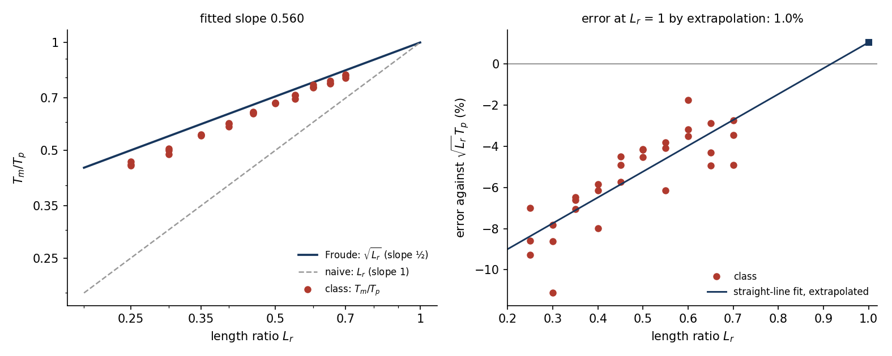

# DA-2 · Time scales as √L_r

## Lecturer notes

A quick in-class exercise, 10–15 minutes, on the Froude time scale. Each
student gets their own model scale L_r from their student number and runs a
4 m prototype tank beside an exact scale copy at length ratio L_r. Both drain through a slot
in the floor, and V opens the two slots together. Students do three things:

- scale a gauge station and two depth marks by L_r, which is length scaling;
- time both tanks between their marks;
- compare the model time with Froude's prediction T_m = √L_r·T_p.

They submit the percentage error. The class then pools the errors into one
plot against L_r.

It is the quick-exercise partner of DA-1, the lecturer demo on the same
scene. The DA-1 vote establishes *that* a quarter-scale tank drains in about
half the time. DA-2 makes every student do the scaling, and the pooled
errors reveal a scale effect that nobody is told to look for.

**Open it:** press **E** in the [app](https://barneydobson.github.io/hydraulician/)
and pick **DA-2**, or use the direct link
[`?ex=DA-2`](https://barneydobson.github.io/hydraulician/?ex=DA-2).
How to run any exercise: see the [teaching pack index](../INDEX.md#running-an-exercise).
The card carries everything a student needs: the rule, the stations, the
marks, the formula and what to submit.

## The rig

The `scale-tanks` scene is a 9.5 m × 4.0 m slice, per metre width, with
Δx = 0.02 m exactly at Medium (475 × 200 cells).

| | prototype (left) | model (right) |
|---|---|---|
| outer left edge | x = 0.2 m | x = 5.2 m |
| clear width B | 4.0 m | 4.0 L_r m |
| walls, floor | 0.4 m thick | 0.4 L_r m |
| floor top | z = 0.8 m | z = 0.8L_r m |
| slot in the floor, a | 0.40 m (20 cells) | 0.40 L_r m (5 cells at L_r = ¼) |
| fill depth above the floor | 2.8 m | 2.8 L_r m |
| gauge station | x = 1.6 m | x = 5.2 + 1.4 L_r m |

The whole model is the prototype multiplied by L_r about the model's
bottom-left corner. That includes the shaft under the slot, which drains to
an outfall floor. Every base dimension is a multiple of 20 cells and L_r moves
in steps of 0.05, so every scaled edge lands on a cell face. At L_r = ¼ the
slot is exactly 5 cells wide. Changing L_r (Controls → Geometry) restarts the
water with both tanks full. V opens both slots at once.

**Gauges read depth.** A gauge on **Depth d** reads the water above the
floor of its own column, so neither tank needs a datum correction. Only the
x of the gauge matters: any height below the water gives the same d.

## Theory

Torricelli drainage of a tank of plan width B through a slot of width a,
per metre width, with η the water level and Δh the head over the slot:

    B dη/dt = −C_d a √(2gΔh)   ⇒   T = 2B/(C_d a √2g) · (√Δh₀ − √Δhₜ)

between heads Δh₀ and Δhₜ (the marks). Scale every length by L_r (B, a, Δh₀,
Δhₜ). The ratio B/a is unchanged and √Δh₀ − √Δhₜ scales as √L_r, so

    T_m / T_p = √L_r   (if C_d is the same at both scales)

This is the Froude time scale, T_r = L_r/V_r = L_r/√L_r = √L_r, reached
from a formula the class already knows. The naive guesses are T_m/T_p = L_r
("it's four times smaller") or 1 ("same shape, same time"). Both are off by
far more than any scatter.

## Student-number rule

**d** is the last digit of the student number:

> **L_r = 0.25 + 0.05·d**

| d | 0 | 1 | 2 | 3 | 4 | 5 | 6 | 7 | 8 | 9 |
|---|---|---|---|---|---|---|---|---|---|---|
| **L_r** | 0.25 | 0.30 | 0.35 | 0.40 | 0.45 | 0.50 | 0.55 | 0.60 | 0.65 | 0.70 |

The digit is displayed, not applied. The student sets **Length ratio L_r**
themselves, on the card's field or in Controls → Geometry.

## What the students do

1. Set L_r from the digit. The water restarts, full.
2. Place a Depth gauge (`5`) in the prototype at x = 1.6 m. Work out the
   model's station, 5.2 + 1.4 L_r, and place the second gauge there.
3. Press **V** and let both tanks empty, about 10 s of simulated time.
4. Expand each gauge (⤢) and hover the trace. Read the prototype's time
   passing d = 2.50 m and 1.00 m, and the model's passing 2.50 L_r and 1.00 L_r.
   The two differences are T_p and T_m. The absolute clock does not matter,
   only differences, so nobody has to note when V was pressed.
5. Predict √L_r·T_p, compute the error 100·(T_m − √L_r·T_p)/(√L_r·T_p), and submit
   **L_r, T_p, T_m, error**.

The upper marks are clear of the valve-opening transient: the prototype
passes 2.50 m at 0.71 s. The lower marks are clear of the last few cells
over the slot.

## Measured answers

Headless at Medium, sampling depth every 5 ms of simulated time; `rig.js`
reproduces these. T_p = **4.056 s** for every digit, because the prototype
does not change with L_r.

| d | L_r | √L_r·T_p (s) | T_m (s) | error (%) |
|---|---|---:|---:|---:|
| 0 | 0.25 | 2.028 | 1.840 | −9.3 |
| 1 | 0.30 | 2.222 | 2.030 | −8.6 |
| 2 | 0.35 | 2.400 | 2.244 | −6.5 |
| 3 | 0.40 | 2.565 | 2.415 | −5.9 |
| 4 | 0.45 | 2.721 | 2.587 | −4.9 |
| 5 | 0.50 | 2.868 | 2.738 | −4.5 |
| 6 | 0.55 | 3.008 | 2.885 | −4.1 |
| 7 | 0.60 | 3.142 | 3.031 | −3.5 |
| 8 | 0.65 | 3.270 | 3.176 | −2.9 |
| 9 | 0.70 | 3.394 | 3.300 | −2.8 |

A student hovering the traces reads each time to about ±0.02–0.03 s. That
puts roughly ±2% of scatter on an individual error, smaller than the trend
across the class.

## Pooling the class

Collect one row per student, `student_id,digit,L_r,T_p_s,T_m_s,error_pct`
(extra columns are ignored), export the CSV and run:

```bash
python3 collect_plot.py class.csv                 # -> plots/pooled-demo.png
python3 collect_plot.py data/simulated-class.csv  # the shipped dry-run class
```

The dry-run class has three rows per digit: the measured value and two with
±0.03 s of reading noise on each time. The script recomputes each error from
the times and flags any submitted error that disagrees. It fits T_m/T_p ∝ L_rⁿ
(the dry run gives n = 0.56 against Froude's 0.5), and it extrapolates a
straight line through the errors to L_r = 1, where the model *is* the
prototype. The dry run lands at +1%, i.e. zero within the scatter.



## Discussion points

- **Nobody got a quarter.** Every row sits within 10% of √L_r and a factor of
  two or more from L_r. A Froude model runs slow: a 1:25 model of a 2-hour
  prototype drain takes 24 minutes, not 5.
- **The errors are not noise: they trend with L_r.** The smaller the model,
  the faster it drains relative to Froude, and the line heads to zero at
  L_r = 1. This is a scale effect: something about the model does not shrink
  with it.
- **What does not shrink here is the grid.** The slot is 20 cells wide in
  the prototype and 5 at L_r = ¼, and the solver's effective viscosity is tied
  to the cell size. That is this model's Reynolds number, and it is
  Froude-scaled no better than a real flume's. The mechanism was checked on
  this rig:
  - Raising the slot celerity c from 40 to 80 m/s moves the errors by under
    0.5%, so it is not compressibility.
  - Switching off the Smagorinsky term or the wall friction changes nothing.
  - The shaft under the slot is irrelevant.
  - At High resolution the L_r = ½ error falls from −4.5% to +1.2%.
  - The L_r = ¼ error stays near −9% at High, so the smallest model is still
    short of cells.
- **In a real laboratory** the same role is played by viscosity and surface
  tension in a small orifice: Re and We fall as L_r^1.5 and L_r² under Froude
  scaling. The rule of thumb is the same: keep the model large enough that
  those groups stay in the range where C_d no longer depends on them.
