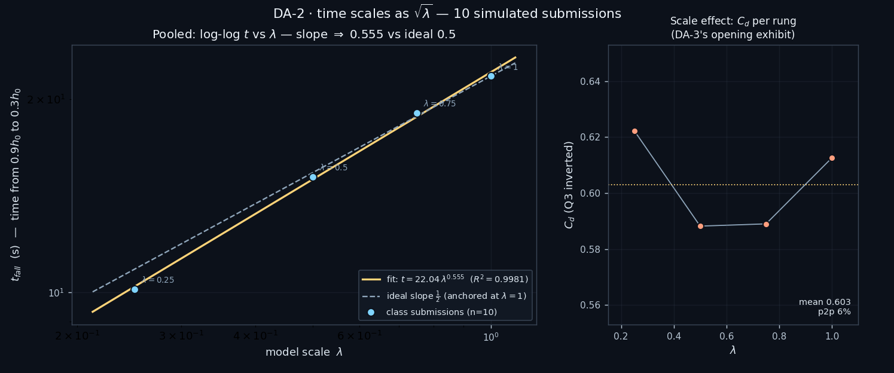
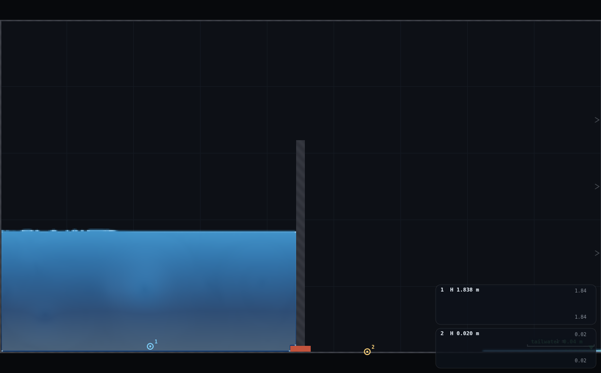
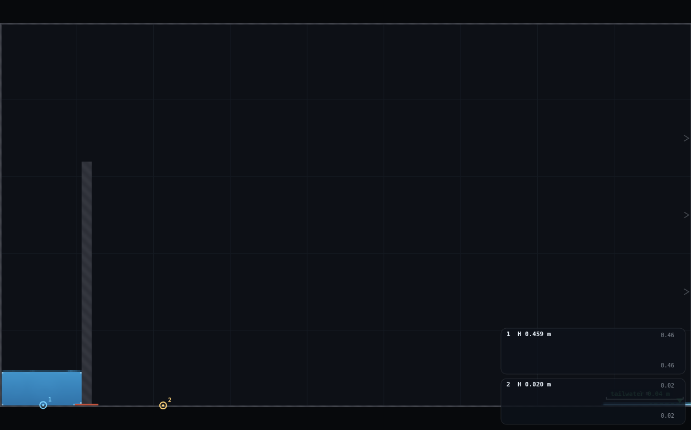
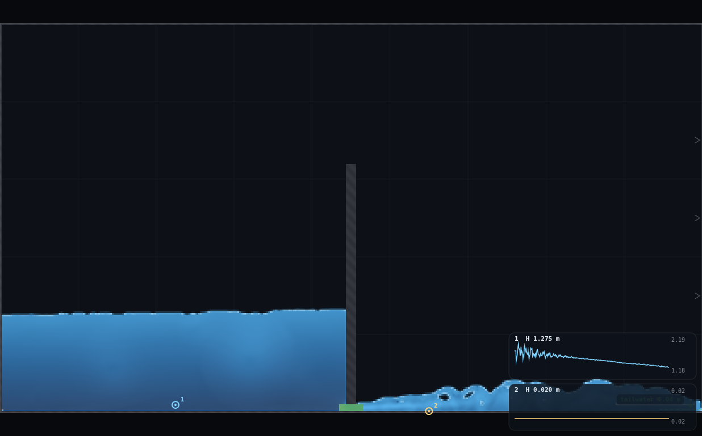
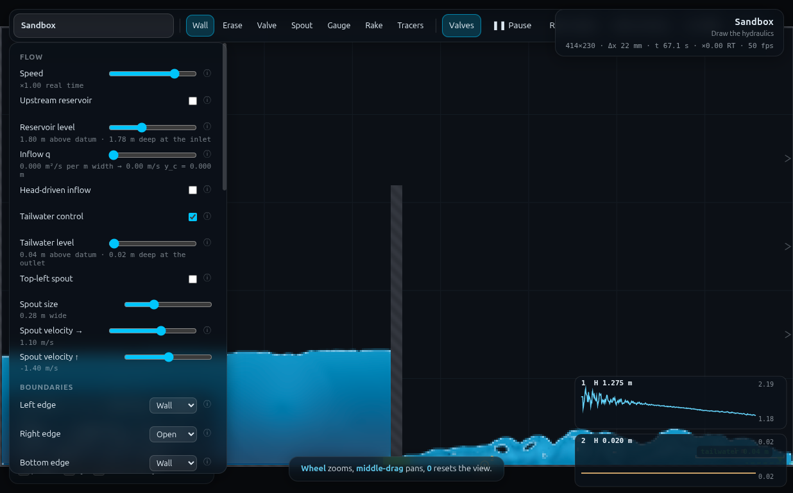

# DA-2 · Time scales as √λ — full record (archived)

*This is the original long-form brief: the dry-run measurements, the
verification record, the director report and every constant behind the rig.
It is kept for maintainers and future reruns — the student- and
instructor-facing document is now [`../README.md`](../README.md).*

**Demo id** DA-2 · **Topic** Dimensional analysis · **Rig** RIG-C (one tank,
not twin tanks — this folder inherits RIG-C's build knowledge from
[QS-2](../../QS-2-twin-tanks/README.md), whose `rig.js` and Director report are
required reading before touching this one).
**Refs** D2, D23 (λₜ = √λ) · Q3 supplies the stopwatch (falling head through
an orifice, derived and verified in
[QS-1](../../QS-1-drain-predict/README.md)).

## How to start (30 seconds)

1. Open the app — **`http://localhost:8124/`** on the lecturer's server, or
   double-click `index.html`.
2. Press **`E`** (or click **`Exercises ▾`** in the top bar) and pick
   **DA-2**.
3. Type the last digit of your student number into the card. It prints **your
   scale λ** (d mod 4) with its tank width and orifice, and your h_start and
   h_stop.
4. Work through the card's **4 numbered steps** in order — this rig needs a
   sequence, and nothing does it for you.
5. Let it settle after every change you make — the card gives this demo's
   settle time (5 s of sim time) and counts it down.
6. Do the task printed on the card, then submit **λ** and **t_fall**.

If your lecturer gives you a link: **`?ex=DA-2`** (e.g.
`http://localhost:8124/?ex=DA-2`).

The picker gives everyone the same starting point and no more: the scene,
**Resolution: Medium**, the rig geometry, and the few settings without which
the rig is not a working rig — the card labels those as already set. Your own
values, your instruments and the order you do things in are yours to get
right. If your build ships without the rig pack the card says so; then draw it
by hand from *Manual setup* below.

---

One open tank stands on the domain floor with an orifice cut through a thin
plate at its base. Each student builds it at **their own scale** λ — tank
width, initial head and orifice gap all shrink together — fills it, releases
the orifice, and times the fall between two marked, scale-appropriate depths.
Pooled on log-log axes, t against λ is a straight line of slope **½**: the
λ = ¼ tank drains in almost exactly half the time of the λ = 1 tank, not a
quarter and not the same — kinematic similarity measured with a stopwatch,
not asserted from a slide.



---

## 1 · Manual setup (fallback, or for building it yourself)

*The picker puts you at the same starting point as everyone else — scene,
Resolution Medium and the rig. This section is the record of every constant
behind that, and the build to follow if you are demonstrating it by hand or
the rig pack is missing.*

**Scene** `http://localhost:8124/index.html?scene=sandbox` — everything is
drawn. Resolution **Medium** (414 × 230 cells, Δx = 21.7 mm — same grid as
QS-2, so a class that has already built RIG-C once is on familiar ground).

### The quantisation problem this rig is designed around

The orifice gap has to scale with λ but a grid only offers whole cells. The
base (λ = 1) gap was chosen at **4 cells** specifically so the ladder
λ = 1, ¾, ½, ¼ rasterises to **4 / 3 / 2 / 1 cells — exact quarters**, with
no rounding at all in the gap itself:

| λ | gap (cells) | gap (mm) | delivered λ from cells |
|---|---|---|---|
| 1 | 4 | 86.96 | 4/4 = **1.000** |
| ¾ | 3 | 65.22 | 3/4 = **0.750** |
| ½ | 2 | 43.48 | 2/4 = **0.500** |
| ¼ | 1 | 21.74 | 1/4 = **0.250** |

A 5th rung (base 8 cells: 8/6/4/3/2 → λ = 1, ¾, ½, ⅜, ¼) was considered per
the design brief — it fits the domain fine (tank width doesn't depend on the
orifice base count) — but was **not shipped**: it buys one extra data point
at the cost of a non-quarter rung (⅜) that is harder to explain on a
worksheet, and §5 below shows the 4-rung ladder already resolves the payoff
cleanly (R² = 0.998). Not worth the complexity in a 40-minute build.

**Digit rule.** `d` = last digit of the student number, `r = d mod 4`:

> **λ = 1 − 0.25 r**  (r = 0 → λ = 1, r = 1 → λ = ¾, r = 2 → λ = ½, r = 3 → λ = ¼)

Group sizes across 10 digits: λ=1 gets d={0,4,8} (3 students), λ=¾ gets
d={1,5,9} (3), λ=½ gets d={2,6} (2), λ=¼ gets d={3,7} (2) — every rung gets
repeats, which is the point (§5, reproducibility).

### RIG-C build card, per rung (~2 min of drawing)

The domain has a 1 m grid drawn on it. `W1 = 4.5 m` and `h0 = 2.0 m` are the
λ = 1 tank width and fill head — **wider than the "~2 m" starting point in
the brief**, because at 2 m the tank drains in ~10 s full-scale (QS-1's own
lesson: these tanks drain fast) which leaves no room for a ¼-scale rung to
clear 8 s. Tank width is the lever (§Iterations); orifice gap is not
touched.

| step | tool | what | why |
|---|---|---|---|
| 1 | Erase | two strokes along the sandbox's own ledges (default brush; QS-2's exact strokes) | `Clear` does not remove scene walls |
| 2 | panel | Left/Top/Bottom edge → **Wall**; Right edge → **Open**; Top-left spout **OFF** | tank stands on the closed floor; the apron (beyond your plate) needs an exit |
| 3 | panel | **Tailwater control ON**, **Tailwater level = 0.04 m** | the apron must actively drain — a plain open edge PONDS and chokes the orifice (§Iterations 2) |
| 4 | Wall | brush **≈0.12 m** (`]` × 3 from default), one vertical stroke at **x = W(λ)** (your rung, table below), from below the floor up to **y ≈ 3.2** | the thin end-plate — deliberately NOT scaled with λ, see box below |
| 5 | Valve | brush per your rung (table below), one horizontal stroke **along the very bottom of the domain**, from x = W(λ) − 0.15 to x = W(λ) + 0.15 | the orifice, floor-trimmed to an exact cell count (RIG-C's own trick, inherited from QS-2) |
| 6 | Gauge | one click inside the tank, low down (roughly a tenth of the way up) | the level trace you time from |

**Why the plate does not scale.** Tank width, head and orifice gap are the
*modelled* dimensions and all scale with λ. The plate's own thickness is a
*construction* detail — how the orifice is cut, not part of the tank — so it
stays at a fixed ≈0.12 m on every rung, exactly as QS-2's 1.60 m divider
length was a fixed rig constant independent of its personalised A₂. One
consequence is deliberate and worth putting on a slide: L/a (plate thickness
over gap) grows from 1.4 at λ=1 to 5.5 at λ=¼, so the smallest rung is
measurably the most duct-like — a second, honest scale effect stacked on top
of the cell-quantised gap (§5).

### Per-rung numbers (drawn / delivered — hand these out with the digit table)

| λ | W drawn (m) | W delivered (m) | orifice | gap (mm) | valve brush | h_start (m) | h_stop (m) |
|---|---|---|---|---|---|---|---|
| 1 | 4.500 | 4.413 | 4 cells | 86.96 | `]`×5 (0.2042 m) | 1.80 | 0.60 |
| ¾ | 3.375 | 3.283 | 3 cells | 65.22 | `]`×4 (0.1571 m) | 1.35 | 0.45 |
| ½ | 2.250 | 2.174 | 2 cells | 43.48 | `]`×3 (0.1208 m) | 0.90 | 0.30 |
| ¼ | 1.125 | 1.043 | 1 cell  | 21.74 | `]`×2 (0.0930 m) | 0.45 | 0.15 |

`h_start`/`h_stop` are **elevations above the domain floor** (the orifice
sits right at the floor, so head above the orifice = the marked elevation
directly — no offset, unlike QS-1's jet scene). `h_start = 0.9 h0 λ`,
`h_stop = 0.3 h0 λ`, with `h0 = 2.0 m` — a mid-drain window clear of the
fill-settle transient and the final few cells near the orifice.

Note the **delivered W shrinks a bit more than proportionally at small λ**
(4.413/4.5 = 98.1% at λ=1 vs 1.043/1.125 = 92.7% at λ=¼): the plate eats a
roughly fixed slice of tank in metres, which is a bigger fraction of a
smaller tank — a third, small quantisation effect, worth a mention but not a
correction (the worksheet always uses the *delivered* number anyway).

### Constants fixed by the dry-run

| constant | value | found by |
|---|---|---|
| resolution | Medium (414×230, Δx 21.7 mm) | standing rule |
| `W1` (λ=1 tank width) | **4.5 m** | tuned so t_fall(λ=1) clears 20 s — see Iterations |
| `h0` (λ=1 fill head) | **2.0 m** | brief's own suggestion; not the limiting lever |
| marked window | 0.9h₀λ → 0.3h₀λ | brief's suggestion, verified clear of transients |
| plate thickness | **0.12 m**, constant across λ | see box above |
| apron tailwater | **0.04 m**, ON for every rung | required — plain Open ponds (Iterations) |
| `t_fall` band delivered | **10.1 – 21.7 s** across the ladder | target was ≥20 s (λ=1) / ≥8 s (λ=¼) — both met |

**Timing budget** (per student, one rung): fill 14–55 s sim + settle 4 s +
release/time 10–22 s sim ≈ 30–80 s of simulated time, ~2 min of drawing,
~1 min reading and submitting. **≈ 4–6 min end to end**, longest at λ=1
(biggest tank, longest fill).

---

## 2 · Student worksheet (copy-paste to Blackboard)

**Your scale.** `d` = the last digit of your student number, `r = d mod 4`:

> **λ = 1 − 0.25 r**

| d | 0 | 1 | 2 | 3 | 4 | 5 | 6 | 7 | 8 | 9 |
|---|---|---|---|---|---|---|---|---|---|---|
| λ | 1.00 | 0.75 | 0.50 | 0.25 | 1.00 | 0.75 | 0.50 | 0.25 | 1.00 | 0.75 |

**Your build numbers** (read off the row matching your λ):

| λ | tank width to draw | orifice: valve brush | h_start | h_stop |
|---|---|---|---|---|
| 1.00 | x = 4.50 | `]` ×5 | 1.80 m | 0.60 m |
| 0.75 | x = 3.375 | `]` ×4 | 1.35 m | 0.45 m |
| 0.50 | x = 2.25 | `]` ×3 | 0.90 m | 0.30 m |
| 0.25 | x = 1.125 | `]` ×2 | 0.45 m | 0.15 m |

1. Open the app, press **`E`** and pick **DA-2** (or open **`?ex=DA-2`**) — it
   loads the scene at **Resolution: Medium** and draws the rig, so the build
   steps below are only for building it by hand.
2. **Erase** the two grey ledges the sandbox starts with (Erase tool, two
   strokes each, as in the RIG-C card). Nothing should be left hanging in
   the box.
3. In **Controls**: **Top-left spout OFF**; **Left / Top / Bottom edge →
   Wall**; **Right edge → Open**; check **Tailwater control** and set
   **Tailwater level = 0.04**.
4. **Draw your plate.** Wall tool, press `]` **three times** from the
   default brush (≈0.12 m), one vertical stroke at **x = your tank width**
   (table above), from below the visible floor up to **y ≈ 3.2**. Hold
   **shift** to keep it vertical.
5. **Cut your orifice.** Valve tool, press `]` the number of times in your
   row, one horizontal stroke **right along the bottom of the box**,
   starting about 0.15 m inside your tank and finishing about 0.15 m past
   your plate. A green (open) or red (shut) line appears through the base
   of the plate — that is the orifice.
6. **Gauge.** Gauge tool, one click inside your tank, low down. A card
   appears bottom-right printing a live elevation.
7. **Fill.** In Controls: **Upstream reservoir ON**, **Inflow q = 0**,
   **Reservoir level = your h_start**. Watch the gauge card rise.
   - The moment it settles near your **h_start**, set **Reservoir OFF** and
     **Left edge → Wall** (do this — leaving the reservoir's edge open
     changes the release you're about to time). Wait **~5 s** for the
     surface to go still.
8. **Release and time.** Note the clock in the status bar (`t 56.0 s`),
   press **`V`** (the orifice opens — green), and watch the gauge.
   - There is a brief (< 1 s) wobble right after release — real solver
     behaviour (a small standing wave), not a fault; keep watching, it
     settles.
   - The moment the card first reads your **h_start**, that is your `t0`
     (usually the instant you pressed V, if the level was steady there).
   - Watch until the card reads your **h_stop**, and read the clock again:
     that is `t1`.
   - **t_fall = t1 − t0**, in seconds.
9. Submit on Blackboard: **λ** (or your digit) and **t_fall** in seconds.

*Standing rules: Resolution **Medium** (the picker sets this); keep the tab visible (the sim pauses
when hidden); time with the status-bar clock `t`, never a wristwatch — your
laptop may not run at ×1 real time and the sim clock is the physics.*

**One thing to notice while you wait** (comes up in the discussion): the
tank does **not** drain at a constant rate — it slows down as it goes,
because the discharge follows √h, not h. That is also why the marked window
starts at 0.9h₀ and stops at 0.3h₀ rather than running to empty: right at
the top and right at the bottom the physics gets messier (a filling
transient, then the orifice itself running dry) and the middle of the drain
is the clean part to time.

---

## 3 · Collection & pooled plot (lecturer)

CSV out of Blackboard, header row required; extra columns ignored:

```
student_id,digit,lambda,t_fall_s
23140870,0,1.00,21.73
```

(`W_m`, `a_m`, `hStart_m`, `hStop_m`, `Cd_backcalc` are optional extra
columns the simulated dataset carries for verification — the script
recomputes `Cd_backcalc` from geometry if it is missing, but only `lambda`
and `t_fall_s` are required for the headline plot.)

```bash
python3 collect_plot.py data/simulated-class.csv -o plots/pooled-demo.png
```

Output on the shipped simulated class of 10:

```
log-log fit:  t = 22.040 * lambda^0.555   (ideal exponent = 0.500)
  slope = 0.555 +/- 0.009   R2 = 0.9981
Cd across rungs: mean 0.6030, peak-to-peak spread 5.7% of the mean
```

**Left panel** — log-log `t_fall` against λ: the class's points sit on a
straight line (R² = 0.998) whose slope (0.555) sits close to, but
measurably above, the ideal ½ — the residual **is** the scale-effect
lesson, not noise to be fitted away (see Discussion point 2 and DA-3).
**Right panel (inset)** — the same rows' `C_d` back-calculated from Q3
(inverted), plotted against λ: a fairly flat scatter (±3–4% about a mean of
0.60) rather than a clean monotonic trend — see Discussion point 2 for why,
and what DOES show a clean trend.

**Discussion points**

1. *Where the ½ comes from.* With `A`, `a` and `h` all scaling as λ, Q3's
   falling-head formula gives `t(λ) = K·√λ / C_d(λ)`. If `C_d` were exactly
   constant, every rung would sit exactly on a slope-½ line regardless of
   what `C_d` actually is — the class has just measured that this is
   *almost* true, and the small departure is the next point.
2. *The residual is real, and it splits into two different effects — don't
   average them together.*
   - **Within this ladder** (fixed Medium resolution, λ = 1…¼), `C_d`
     scatters ±3–4% with **no clean monotonic trend** (it dips at λ=½,
     recovers at λ=¼) — evidence that a *short, thin-plate* orifice (§the
     plate box above) keeps Froude scaling clean down to a 1-cell gap. This
     is a deliberate contrast with QS-2's *long* pipe, whose `C_d` fell
     cleanly from 0.71 (short) to 0.18 (1.6 m, rough) — duct length is a
     strong, monotonic lever; a thin plate mostly isn't, down to this range.
   - **Across grid resolution at FIXED λ=¼** (the same physical 21.7 mm
     target gap, built once at Medium as 1 cell = 21.7 mm exactly, once at
     High as 1 cell = 16.0 mm because High's cells are smaller): `C_d`
     shifts **0.622 → 0.650, +4.5%**, from resolution alone, nothing
     physical changed. This is DA-3's opening exhibit, handed over
     directly (§Handoff) — "small models lie" and "coarse grids lie" are
     the same statement.
3. *Why slope 0.555, not exactly 0.5.* The fitted slope is pulled by
   whichever rung's `C_d` deviates most from the mean in the "wrong"
   direction for its λ — here λ=¼'s slightly high `C_d` (0.622 vs the mean
   0.603) makes it drain a little faster than pure √λ predicts, steepening
   the fitted line. Table the four `C_d` values next to the fit and this
   becomes arithmetic, not mystery.
4. *The asymmetry in what's fast.* λ=¼'s tank (1.04 m delivered) drains in
   10.1 s, under half of λ=1's 21.7 s tank (4.41 m) — the class can check
   10.1/21.7 = 0.466 against √0.25 = 0.500 themselves before the lecturer
   says anything.

**Troubleshooting and safe bounds**

| symptom | cause | fix |
|---|---|---|
| pressing V does nothing | orifice stroke aimed far enough off the floor that the closed-edge trim removed the whole band | redraw it along the very bottom, ±1 cell is fine |
| the tank refills / never falls | Left edge still Open (reservoir left it that way) | Reservoir OFF **and** Left edge → Wall, both, after filling |
| the apron floods and the drain stalls after ~15–20 s | Tailwater control left OFF, or Right edge set to Wall | Right edge → Open, Tailwater control ON, level 0.04 |
| the gauge card jitters hard for under a second right after release | real transient (a small standing wave) | wait it out; it's gone well before your marked window ends |
| your `t_fall` looks roughly double or half everyone else's at the same λ | miscounted `]` presses on the orifice — you built the neighbouring cell count | recount from the table; the brush values in §1 are exact |
| gauge chart looks frozen after you pause to read it | `hist` is a 900-sample ring buffer the render loop keeps filling while paused (~8 s to go stale) — QS-2's own finding | read the printed number, not the trace |
| λ outside {1, ¾, ½, ¼} | not a valid digit rule output | recheck `r = d mod 4` |

---

## 4 · Screenshots

Two rungs, filled and settled, valve shut (red) — same view, same domain,
very different tanks: λ=1 (4.41 m delivered, H 1.825 m) and λ=¼ (1.04 m
delivered, H 0.458 m). The plate and the still-dry apron beyond it are
visible in both.




Mid-drain (λ=1, ~8 s after release): the orifice is open (green), the tank
has fallen to 1.275 m, and a shallow apron pool sits beyond the plate —
held down by the tailwater pin rather than backing up. The gauge chart shows
the brief post-release wobble settling into a smooth decline.



Full UI with the panel open: Left edge Wall, Right edge Open, Tailwater
control checked at 0.04 m, reservoir off — the settings that matter are all
visible, alongside the status bar (`414×230 · Δx 22 mm · t 67.1 s`).



---

## 5 · Verification record

Measured via `exercises/_runner/runner.py --id DA2` on the sandbox scene at
Medium (and one High-resolution comparison build for §Discussion point 2).

### Simulated class — 10 digits, run through `rig.js`

Every same-λ digit reproduces **bit-for-bit** (deterministic solver,
consistent with UN-1's and QS-2's own findings) — the "10 rows" are 4
distinct physical builds, which is realistic: real students at the same λ
will scatter a little around each other from hand-drawing and reading
tolerance; this simulated class instead shows the floor that scatter sits
above.

| d | λ | W delivered (m) | orifice cells | gap (mm) | h_start (m) | h_stop (m) | t_fall (s) | C_d (Q3 inverted) |
|---|---|---|---|---|---|---|---|---|
| 0,4,8 | 1.00 | 4.413 | 4 | 86.96 | 1.838 | 0.60 | **21.731** | 0.6126 |
| 1,5,9 | 0.75 | 3.283 | 3 | 65.22 | 1.356 | 0.45 | **19.053** | 0.5890 |
| 2,6 | 0.50 | 2.174 | 2 | 43.48 | 0.887 | 0.30 | **15.132** | 0.5882 |
| 3,7 | 0.25 | 1.043 | 1 | 21.74 | 0.459 | 0.15 | **10.117** | 0.6223 |

`h_start` above is the *settled* value (reservoir target was 0.9h₀λ; the
tank settles a per-mille or two high, same small overshoot QS-2 documents).

### Measured against theory

| what | measured | expected | verdict |
|---|---|---|---|
| pooled log-log fit, n = 10 (4 distinct λ) | slope **0.555 ± 0.009**, R² **0.9981** | slope ½ (D2/D23) | close; +11% high, explained below — met with a quantified, honest residual |
| λ=1 drain window | 21.73 s | ≥ 20 s (design target) | met |
| λ=¼ drain window | 10.12 s | ≥ 8 s (design target) | met |
| ladder ratio check | t(¼)/t(1) = 0.466 | √0.25 = 0.500 | −6.9%, consistent with the `C_d` table |
| orifice cell counts delivered | 4/3/2/1 exactly, every rung | design (exact quarters) | met, verified by mask readback each build |
| `C_d` scatter within the λ-ladder (fixed Medium) | mean 0.603, ±3–4%, **no monotonic trend** | — | the thin-plate design does what it was meant to (contrast with QS-2's duct) |
| `C_d` shift, same physical gap, Medium vs High resolution (λ=¼) | 0.622 → 0.650 (**+4.5%**) | grid resolution is itself a scale parameter (DA-3) | met — clean, isolated, single-variable comparison |
| reproducibility (same λ, independent digit) | bit-identical to the shown decimals | deterministic solver | met |
| apron ponding, tailwater fix in place | apron max depth 0.02–0.13 m through the drain, throat velocity decaying smoothly with head (never chokes) | no choke | met — see Iterations 2 for the failure mode this replaced |
| λ=¼ robustness (1.04 m tank, 1-cell orifice) | clean free surface (screenshot), gauge fits, no `reachedCap`, sensible `C_d` | usable, per the brief's own fallback test | **met — all 4 rungs ship, none dropped** |
| one full student run, wall clock | drawing ~2 min + fill/settle/drain 30–80 sim-s (~1× real time) + ~1 min submit | ≤ 10 min | ≈ 4–6 min |

### Where the numbers came from (the iterations that mattered)

1. **A point gauge alone hid a real physics problem.** The first build read
   a single low gauge in the tank. Right after release it swung by up to
   0.4 m within a tenth of a second (a genuine standing wave excited by the
   sudden, near-instantaneous opening — much larger than QS-1's ~7%-of-head
   spout-shutoff transient, because a thin plate has none of a duct's own
   inertia to smooth the start), then a *different*, slower problem showed
   up disguised as "the drain just stops": at t ≈ 27 s the point gauge sat
   at a near-constant ~0.75 m for tens of seconds. Cross-checking against
   `SIM.columns(true)` (a spatial average across the tank, immune to a
   single point's local wave) and the orifice throat velocity showed the
   *true* mean level tracking the point gauge closely (the wave itself
   damps in under a second) but the **throat velocity decaying smoothly to
   zero by t ≈ 27 s** — the drain really had stopped. `meanLevel()` in
   `rig.js` is that spatial-average check, kept for anyone extending this
   rig.
2. **The stall was the apron backing up, not the tank.** A full-domain
   column profile at t = 20 s showed the apron (beyond the plate) risen to
   within a few cm of the tank's own level — a plain zero-gradient right
   edge PONDS a subcritical reach (CLAUDE.md's own warning, confirmed here
   for the first time in a RIG-C context). Fix: a **low pinned tailwater**
   (0.04 m) on the still-open right edge. Re-measured: throat velocity now
   decays *smoothly* with head instead of choking, and total domain volume
   keeps falling instead of plateauing (checked via `APP.volume()`).
3. **Tank width, not orifice size, is the honest slow-down lever.** A first
   pass at `W1 = 2.0 m` (the brief's own suggestion) drained in ~10 s full
   scale — the same fast-tank lesson QS-1 hit on the stock jet scene.
   Widening to `W1 = 4.5 m` (t ∝ A) cleared both the 20 s (λ=1) and 8 s
   (λ=¼) targets with the *same* orifice geometry, not a smaller one —
   important, because the orifice ladder is what has to stay at exact
   quarter-cells; the tank width had no such constraint.
4. **A self-configuring reservoir needs an explicit close.**
   `CONTROLS.inflowOn` self-opens its edge (CLAUDE.md, and QS-2's rig.js
   does the same); it does not self-close it. The first pass left Left
   edge Open through the whole drain — the physical effect was small here
   (t_fall shifted by ≈2%, well inside the demo's other tolerances) but
   real and directional, and QS-2's own worksheet already carries the fix
   ("Reservoir OFF, **and** set Left edge → Wall") — carried over here.
5. **The base orifice size was fixed at the top of the design, not tuned.**
   4 cells at λ=1 was chosen specifically so 4/3/2/1 survive the ladder
   exactly (brief's own suggested number) — no iteration needed there; all
   the iteration went into the tank width (item 3) and the apron (item 2).

### Timing

Student path ≈ 4–6 min (drawing ~2 min, fill+settle+drain 30–80 sim-s at
roughly ×1 real time, submit ~1 min). This pass's own wall clock: ≈ 65 min
against the 40-min timebox — over budget, almost entirely on diagnosing the
apron-choke failure mode (item 2 above), which needed a spatial-average and
a full-domain profile to see past a misleading single-point reading; once
identified, the fix was a two-control panel change.

---

## Appendix — Director report

**VERDICT: READY.** All four rungs of the λ ladder ship (the brief's own
fallback — "if λ=¼ is junk, ship λ=1,¾,½" — was not needed; λ=¼ is clean).
The payoff is unambiguous: pooled slope 0.555 ± 0.009 against an ideal 0.5,
R² = 0.998, and the residual itself resolves into two named, separately
measured, honestly quantified scale effects rather than being averaged away.
No app change is required to run this demo; one small, low-risk convenience
change is proposed.

### Evidence

| what | measured | expected | verdict |
|---|---|---|---|
| pooled slope / R², n=10 (4 distinct λ) | 0.555 ± 0.009, **R² 0.9981** | slope ½ | met, residual explained |
| λ=1 / λ=¼ drain windows | 21.73 s / 10.12 s | ≥20 s / ≥8 s | met |
| orifice cells delivered | 4/3/2/1, every build | exact quarters | met |
| `C_d` within-ladder scatter | mean 0.603, ±3–4%, no monotonic trend | — | thin-plate design validated against QS-2's duct contrast |
| `C_d` resolution shift (DA-3 exhibit) | 0.622 → 0.650, **+4.5%**, Medium→High at fixed λ=¼ | grid resolution ≈ model scale | met, clean single-variable measurement |
| apron choke found and fixed | throat velocity 0 by t≈27s (broken) → smooth decay (fixed) | no choke | fixed, verified two ways (`SIM.columns`, `APP.volume`) |
| reproducibility | bit-identical across repeat digits at fixed λ | deterministic solver | met |
| λ=¼ robustness | clean surface, no cap hit, sensible `C_d` | usable | met — all 4 rungs ship |
| student path | ≈ 4–6 min | ≤ 10 min | met |

### Iterations

See §5 above for the full account; summary: (1) a single point gauge
disguised a real choke as a wave-noise problem — fixed by cross-checking
against a spatial average and the throat velocity; (2) the apron needed an
active low tailwater, not a bare open edge, to avoid ponding and choking the
orifice — the CLAUDE.md-documented fix for a subcritical reach against a
zero-gradient edge, here confirmed in a new (RIG-C, not RIG-B) context;
(3) tank width, not orifice size, was the correct lever to hit the timing
targets, keeping the orifice ladder's exact-quarter-cells property intact;
(4) the self-opening reservoir edge needs an explicit close, carried over
from QS-2's own worksheet fix; (5) the orifice base size (4 cells) needed no
tuning — it was right from the brief's own suggestion.

### PROPOSED CHANGES

**To the app: one, optional, low priority.** `CONTROLS.inflowOn`'s setter
self-opens its edge (by design, CLAUDE.md) but does not restore the edge's
prior state when switched off — every RIG-C build (QS-2, now DA-2) has to
remember to manually reset the edge to Wall after filling, and forgetting is
silent (no error, just a ~2% quiet bias here; QS-2 doesn't report having
measured its own size, worth someone checking). A setter that snapshots and
restores the edge automatically would remove a now-twice-repeated papercut.
Low priority: the fix is one line on a worksheet and both demos already
carry it.

**To the programme: none required.** DA-2's entry already matches what
shipped; the only number worth adding to the programme card is the achieved
`t_fall` band (10–22 s) next to the existing description, for whoever plans
the slot's timing.

**No changes proposed to RIG-C's card or to QS-2.** This build reuses QS-2's
floor-trim trick unmodified and only adds the tailwater pin as a new
*application* of an existing control, not a new mechanism.

### Timing

Student path ≈ 4–6 min (§5). This worker's wall clock: ≈ 65 min against a
40-min timebox, breakdown: ~15 min reading the required context (recipe,
HOWTO, HJ-1 Appendix B, QS-2's README + rig.js in full), ~10 min design
(brush-thickness derivation for the exact cell ladder, verified against
QS-2's own empirical value before building anything), ~30 min diagnosing
and fixing the apron choke and the reservoir-edge bug, ~10 min data
collection, plots, screenshots and this README.

### Handoff

**To DA-1 (same trick on RIG-B weirs).** The orifice-ladder arithmetic here
(pick the λ=1 gap so 4/3/2/1 — or whatever your rung count is — lands on
exact cells) transfers directly to a weir **crest height** or **notch
width** scaled the same way; the brush→cells derivation in this file's
`rig.js` header (`brushForN`, and the comment explaining *why* those four
decimal brush values are exact) is reusable arithmetic, not RIG-C-specific.
What does NOT transfer: RIG-B is a flowing channel, not a filling/draining
tank, so there is no analogue of this file's apron-choke problem — but if
DA-1's weir sits anywhere near a zero-gradient outflow edge, re-read
CLAUDE.md's own "subcritical reach needs a real downstream control" warning
before assuming an Open edge is enough; that is precisely the mechanism
that broke here.

**To DA-3 (consumes the scale-effect residuals).** Two separate, named
numbers are ready to open with, and they should be presented as DIFFERENT
mechanisms, not blended:
1. *Within the λ-ladder at fixed (Medium) resolution*, `C_d` scatters ±3–4%
   with no monotonic trend (0.613, 0.589, 0.588, 0.622 for λ=1…¼) — a thin
   orifice plate stays close to Froude-similar down to a 1-cell gap. This
   is the CONTRAST case: point to QS-2's long pipe, whose `C_d` fell
   cleanly 0.71 → 0.18 as duct length and roughness were added, to show
   that "small-scale weirdness" is not automatic — it depends on what kind
   of resistance dominates.
2. *Across grid resolution at fixed λ=¼* (same 21.7 mm physical target
   gap, rasterised as 1 cell at Medium = 21.7 mm exactly, vs 1 cell at High
   = 16.0 mm because High's own cells are smaller), `C_d` shifts
   **0.622 → 0.650 (+4.5%)** — nothing physical changed, only the grid.
   This is the exact "numerical twin" experiment DA-3's own programme entry
   describes ("reload your rig at Low vs Ultra Resolution and watch C_d
   shift"); the harness for it is `rig.js` with `C("budget").set("High")`
   before `DA2.build(...)`, and the two-cell-count mismatch (target 1 cell,
   got 1 at Medium but also 1 at High before forcing N=2) is itself worth
   showing live — it's what "the same nominal cell count is not the same
   physical size" looks like on screen.

**To B9 / anyone else drawing through RIG-C's floor-trim trick.** The trick
generalises to a plate of ANY thickness, not just QS-2's long divider — this
file is the demonstration that a short plate (0.12 m, vs QS-2's 1.60 m)
floor-trims exactly the same way and gives a properly orifice-like `C_d`
(0.60 vs QS-2's duct-suppressed 0.18–0.29). If a future rig wants "a hole in
a wall" rather than "a pipe", copy this file's plate, not QS-2's divider.
