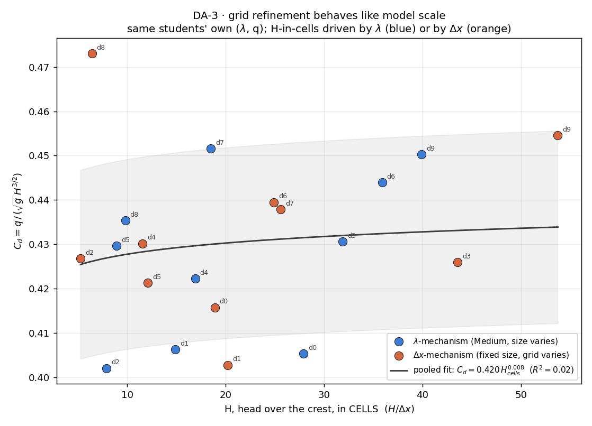

# DA-3 · Scale effects, live

DA-1 pooled thirty raw numbers into one `C_d(H/P)` curve and left a small,
honest, λ-ordered residual living underneath it. DA-3 reproduces the *same
shape of effect* without changing a single physical dimension: keep your own
weir, your own q and your own level, change **only the Resolution**, and
watch `C_d` move on its own. Grid spacing behaves like model scale because
mechanically it is one — `H/Δx` is no different in kind from `H/λ`. Re and We
cannot follow Froude in a physical model for the same reason a coarser mesh
cannot follow it here: the things that do not shrink with the model write the
residual.

**Open it:** press **E** in the [app](https://barneydobson.github.io/hydraulician/)
and pick **DA-3**, or use the direct link
[`?ex=DA-3`](https://barneydobson.github.io/hydraulician/?ex=DA-3).
How to run any exercise: see the [teaching pack index](../INDEX.md#running-an-exercise).

## Theory

The measurement is DA-1's, unchanged — the approach-pool depth minus the
crest height, and the coefficient that goes with it:

    H = h − P           C_d = q / (√g · H^1.5)

What changes is how many cells that head is resolved in:

    H_cells = H / Δx

On this 9 m × 5 m domain Δx is **31.6 mm** at Low, **21.7 mm** at Medium and
**16.0 mm** at High (the status bar prints the grid and Δx). Halving λ and
coarsening Δx both take cells out from under H — the question the class pools
is whether the two cost `C_d` the same.

## Your resolution

**d** is the **last digit of your student number** — your lecturer will
explain the assignment in class. **Even digits go to Low, odd digits to
High**; set it *after* the rig has loaded, and never Very high or Ultra —
DA-1's weir will not settle there. Everything else is your own DA-1 row,
unchanged between the two runs:

| d | λ | q (m²/s) | reservoir level (m) | Resolution | gauge x (m) | P (m) |
|---|---|---|---|---|---|---|
| 0 | 1 | 0.600 | 1.795 | Low  | 2.17 | 0.696 |
| 1 | ½ | 0.235 | 1.165 | High | 1.09 | 0.348 |
| 2 | ¼ | 0.090 | 0.840 | Low  | 0.54 | 0.174 |
| 3 | 1 | 0.780 | 1.890 | High | 2.17 | 0.696 |
| 4 | ½ | 0.295 | 1.210 | Low  | 1.09 | 0.348 |
| 5 | ¼ | 0.115 | 0.865 | High | 0.54 | 0.174 |
| 6 | 1 | 0.960 | 1.975 | Low  | 2.17 | 0.696 |
| 7 | ½ | 0.360 | 1.250 | High | 1.09 | 0.348 |
| 8 | ¼ | 0.135 | 0.880 | Low  | 0.54 | 0.174 |
| 9 | 1 | 1.140 | 2.055 | High | 2.17 | 0.696 |

## What to do

1. Set **Inflow q** and **Reservoir level** to your row — the same pair you
   used in DA-1 — and drop a Gauge (`5`) at the same station.
2. **Controls → Resolution →** your assigned value — it loads at Medium, and
   that reading is the one you already took for DA-1. Touch nothing else; the
   rig re-rasterises and the water starts again from empty.
3. Press `R` and let it reach steady state — about **55 s**; the card counts
   it down (40 s at λ = ½, 28 s at λ = ¼).
4. Read the card's `h`, work out **H = h − P** and **C_d = q/(√g·H^1.5)**,
   and submit **λ, q, resolution, C_d**.

## For the instructor — pooling the class

Collect one row per student (`digit,lambda,q,resolution,H,Cd`), add
`H_cells` = H/Δx and `mechanism` = `dx`, and pool DA-1's original ten rows in
as `mechanism` = `lambda`. Then run:

```bash
python3 collect_plot.py class.csv                # -> plots/pooled-demo.png
python3 collect_plot.py data/simulated-class.csv # the shipped dry-run class
```

The script plots `C_d` against H-in-cells with the two mechanisms coloured
apart, and reports each group's mean residual about the pooled fit and about
DA-1's own `C_d(H/P)` collapse: on the shipped class the gap between the two
groups (1.2–1.5%) is smaller than the scatter about the curve itself
(2.8–4.3% RMS), so the two mechanisms overlay on one curve.



### Discussion points

- **Do the reload in front of them.** Take a λ = ¼ rig to **Resolution: Low**
  and the crest itself changes — P rasterises to 5 cells instead of 8, 6.2%
  short, and `C_d` reads 6% high. That is a *different weir*, not a worse
  measurement of the same one. Back to **High** and it sharpens again: about
  15 seconds of wall clock for the whole pair, and nothing but a dropdown
  moved.
- **The one outlier is the lesson, not noise.** d = 8's Low re-run lands at
  6.4 cells of head, under the ~7-cell floor DA-1 measured on this same rig
  by lowering q instead — two entirely different ways of taking cells out
  from under H arrive at the same failure threshold.

The full verification record — the five-resolution sweep on both rigs, the
resolutions that break DA-1's weir and DA-2's orifice and why, the timings of
the live moment and the troubleshooting table — is kept locally, out of version control, at `exercises/DA-3-scale-effects/_archive/README-full.md`.
