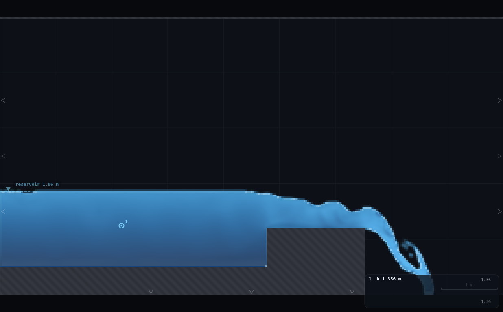
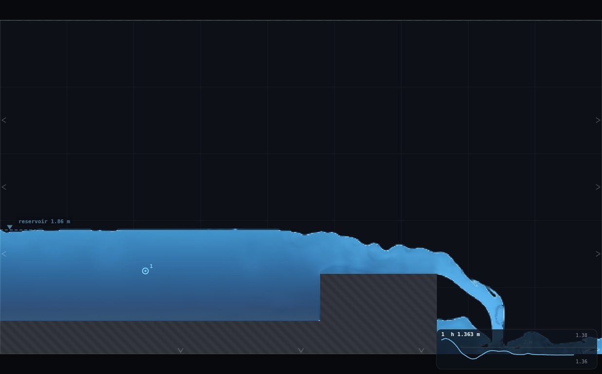
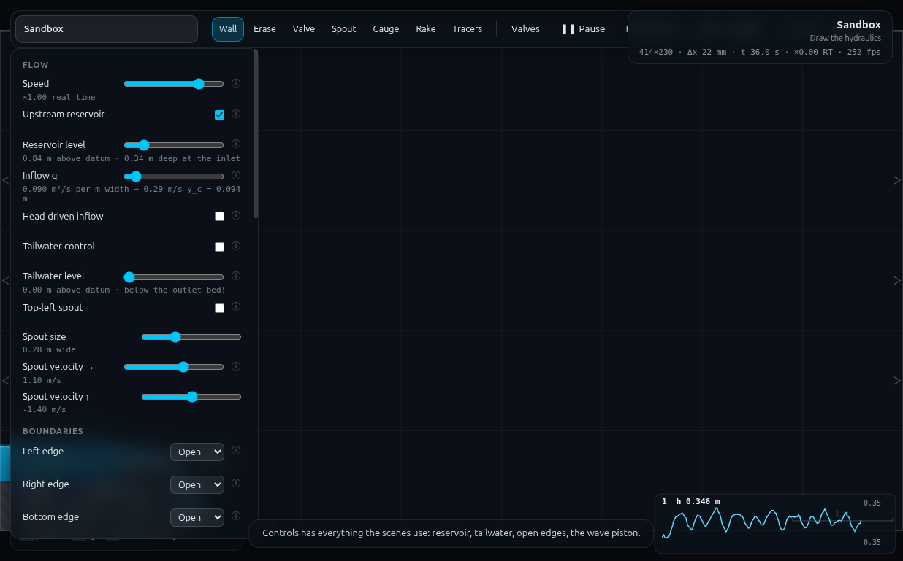
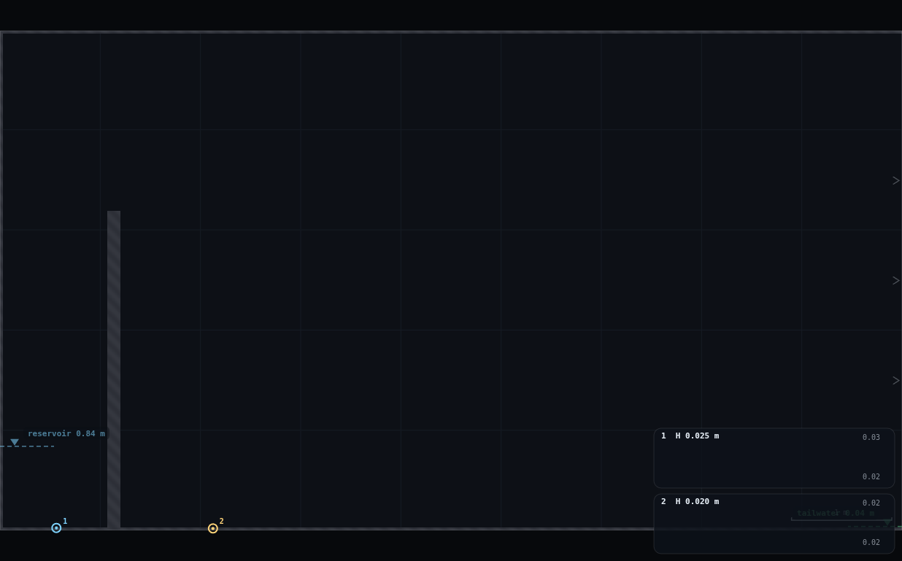

# DA-3 · Scale effects, live

**Demo id:** DA-3  **Scenes/rigs:** DA-1's RIG-B weir (`?scene=sandbox`) and
DA-2's RIG-C orifice (same sandbox) — no rig of its own  **Refs:** D3–D5, D14
· why Reynolds and Weber cannot follow Froude

## How to start (30 seconds)

1. Open the app — **`http://localhost:8124/`** on the lecturer's server, or
   double-click `index.html`.
2. Press **`E`** (or click **`Exercises ▾`** in the top bar) and pick
   **DA-3**.
3. Type the last digit of your student number into the card. It prints **your
   resolution** (even → Low, odd → High) and the q and level of your own DA-1
   λ third — you set those, then change only the Resolution.
4. Let it settle after every change you make — the card gives this demo's
   settle time (55 s of sim time) and counts it down.
5. Do the task printed on the card, then submit **λ**, **q**, **resolution**
   and **C_d**.

If your lecturer gives you a link: **`?ex=DA-3`** (e.g.
`http://localhost:8124/?ex=DA-3`).

The picker gives everyone the same starting point and no more: the scene,
**Resolution: Medium**, the rig geometry, and the few settings without which
the rig is not a working rig — the card labels those as already set. Your own
values, your instruments and the order you do things in are yours to get
right. If your build ships without the rig pack the card says so; then draw it
by hand from *Manual setup* below.

---

DA-1 pooled thirty raw numbers into one `C_d(H/P)` curve and found a small,
honest, λ-ordered residual living underneath it. DA-3 does two things with
that residual: puts it back on screen (re-examine the pooled plot, point at
the droop), then reproduces the *same shape of effect* without changing a
single physical dimension — reload an already-drawn rig at a different
**Resolution** and watch `C_d` move on its own. Grid spacing behaves exactly
like model scale because, mechanically, it *is* a scale: `H/Δx` is no
different in kind from `H/λ`. Re and We can't follow Froude in a physical
model for the same reason a coarser mesh can't follow it in this one — the
things that don't shrink with the model (viscosity, surface tension; here,
Δx-tied numerics: the interface thickness, the Smagorinsky length, a
construction tolerance) are what write the residual.

This pass also upgrades the demo's stated "nothing, or optionally your own
`C_d` at two resolutions" into a real pooled measurement: every student
re-runs their own DA-1 digit at one *extra*, assigned resolution and submits
`(λ, q, resolution, C_d)`. Pooled against DA-1's original ten, the two
populations — `H` in cells changing because λ changed, `H` in cells changing
because Δx changed — sit on the **same** curve (§5), which is the whole
"grid resolution behaves like model scale" claim measured, not asserted.


---

## 1 · What actually ships, and one amendment to the programme card

**The panel's real option names, confirmed from `js/main.js`:** `Low`,
`Medium`, `High`, `Very high`, `Ultra` (a five-position `select`, budgets
45 000 / 95 000 / 175 000 / 350 000 / 700 000 cells). The programme's "Low vs
Ultra" already uses real names — no renaming needed. But:

> **AMENDMENT.** Measured here (§5.3): DA-1's weir rig (RIG-B), reloaded live
> through the Resolution dropdown with nothing else touched, **does not
> settle at Very high or Ultra** — the reservoir plateaus well under its
> target level and then drains toward dry instead of holding. DA-2's orifice
> rig has no such problem and runs cleanly all the way to Ultra. The live
> classroom moment should therefore be **DA-1's rig, Low ↔ High**, not
> Low ↔ Ultra as the card currently reads. §5.3 has the evidence and the
> likely mechanism (a GPU resource leak in `SIM.build`, not a numerical
> instability — flagged as a PROPOSED CHANGE in the Appendix, because it is
> bigger than this one demo).

Grid delivered on the sandbox scene (`W×H` = 9 m × 5 m), every resolution:

| Resolution | grid (nx×ny) | Δx | DA-1 weir: usable live? |
|---|---|---|---|
| Low | 285×158 | 31.58 mm | yes (the "rasterisation jump" exhibit) |
| Medium | 414×230 | 21.74 mm | yes (the class's own baseline) |
| High | 561×312 | 16.04 mm | yes |
| Very high | 794×441 | 11.34 mm | **no — reservoir fails to settle (§5.3)** |
| Ultra | 1122×623 | 8.02 mm | **no, for DA-1's rig — yes for DA-2's** |

---

## 2 · Manual setup (fallback, or for building it yourself)

*The picker puts you at the same starting point as everyone else — scene,
Resolution Medium and the rig. This section is the record of every constant
behind that, and the build to follow if you are demonstrating it by hand or
the rig pack is missing.*

**Link:** `http://<host>:8124/?scene=sandbox`. Nothing to draw ahead of
time — the live moment reuses whichever rig is already on screen from DA-1
or DA-2's own slot; if running DA-3 standalone, pick `?ex=DA-3` (it rebuilds
your own λ third), or paste DA-1's `rig.js` (or
DA-2's) as usual, then this folder's `rig.js` on top only if you want the
resolution-sweep helpers used to produce §5 (`DA3.runDA1`, `DA3.runDA2`) —
students never need it, they just use the Resolution dropdown.

**Fixed constants this pass measured against** (so its own numbers can be
spot-checked by re-running): DA-1's own `q_base = 0.72` (their d=2
grid-refinement-twin point, README §5.3b) reused for the headline table so
this is a direct extension of their exhibit, not a new arbitrary choice;
DA-2's own `λ = ¼` (their own resolution exhibit, README Discussion point 2).

**Timing budget for the live moment** (§6.4): reload + resettle + read, at
**Low ↔ High**, DA-1's λ=¼ rig (the faster, more dramatic of the two — its
crest is only ~8 cells to begin with, so Low's mis-rasterisation is
unmissable): **≈15 s of wall clock total** on the measurement machine solo
(Low resettle ≈ 2 s, High resettle ≈ 13 s at the throughput measured here —
a shared classroom Wi-Fi laptop will be slower but the *sim* cost is the
same order; budget "under a minute, blink and it's back" for the slide).

---

## 3 · Class discussion run (no submission required)

1. **Re-open DA-1's pooled plot** (`exercises/DA-1-scale-ladder/plots/pooled-demo.png`,
   or re-run their `collect_plot.py` live). Point at the shaded ±3% band on
   the collapsed panel and the annotated droop points: **λ=¼ sits −2.4%
   under the pooled curve, λ=1 sits +1.6% over it** — a monotone, λ-ordered
   residual, proved in DA-1's own §5.3 to be a genuine model effect (grid
   refinement moves it only +0.45%), not measurement junk.
2. **Frame it with D3–D5.** In a physical model you cannot hold Reynolds
   *and* Weber *and* Froude similar at once — viscosity and surface tension
   don't shrink with the model, so a small model runs relatively "stickier"
   and more surface-tension-dominated than the prototype. In THIS model the
   literal viscosity is negligible either way; what stands in for "the
   physics that doesn't shrink" is **the interface itself and the numerics
   tied to the cell**: a free surface that is always ~2 cells thick
   (CLAUDE.md) is 25% of `H` at λ=¼ and 6% at λ=1; the Smagorinsky eddy
   viscosity `ν_t=(C_sΔx)²|S|` scales with `Δx²`, not with λ^1.5 the way a
   Froude-similar viscosity would (DA-1 rig.js's own header comment). Those
   are this solver's Re/We.
3. **The numerical twin, live.** With DA-1's or DA-2's rig already drawn:
   Controls → Resolution: **Low**. Watch it resettle (water resets to
   empty — a genuine re-fill, not a warm continuation, because a resolution
   change reallocates the whole grid, `js/sim.js`'s `SIM.build`). Read the
   gauge. Controls → Resolution: **High**. Resettle, read again. `C_d`
   moves — on DA-1's λ=¼ rig, **0.427 (Low) → 0.402 (Medium) → 0.404
   (High)**, the same shape of shift the λ-ladder itself produced, from a
   dial that never touched a single metre of geometry.
4. **Optional:** submit your `C_d` at both resolutions (§4) for the pooled
   master curve.

**What to say out loud.** Two different mechanisms are doing this, and
they don't collapse into "small models lie" quite the way the programme
card implies — see §5.2 for the measured split:
   - **DA-1's weir at Low**: the crest itself mis-rasterises (§5.2a) — a
     construction/geometry failure, lumpy by nature (integer cells).
   - **DA-2's orifice, reloaded** (not rebuilt — see §5.2b): under the exact
     "change the dropdown, keep the rig" protocol the live moment uses, its
     gap ALSO jumps in integer cells (0→1→2→3→5 across the five
     resolutions) — also lumpy, for the same construction reason as DA-1's
     crest. DA-2's own README reports a **smooth** +4.5% Medium→High drift,
     but that number came from a different, more controlled experiment
     (re-deriving the brush so the cell count is deliberately HELD at 1 on
     both grids) — not from reloading. The smooth wall-function/interface
     part is real and is what's left over once the lumpy part is factored
     out; a live reload mostly shows you the lumpy part. Both are "small
     models lie," but they are not the same sentence, and §5.2 has the
     numbers to show both on the same slide.

---

## 4 · Optional submission worksheet (upgrade over "nothing")

Everyone already has a DA-1 digit, λ and q from that slot. This adds ONE
more reading at an assigned second resolution — no redrawing, the rig you
already built stays on screen.

**Your assigned resolution**, from the same digit `d` DA-1 used:

> **`d` even (0,2,4,6,8) → Resolution: Low**
> **`d` odd  (1,3,5,7,9) → Resolution: High**

*(Medium is excluded — you already measured that. Very high/Ultra are
excluded — DA-1's weir does not reliably settle there, §1/§5.3; nobody
should be sent to a broken reload mid-lecture.)*

**Starting from a cold page?** Press `E` and pick **DA-3** (or open
`?ex=DA-3`): it rebuilds your own DA-1 λ third at **Resolution: Medium**,
and you set the q and level the card prints. If your DA-1 rig is still on
screen, keep it — that is the better run.

1. With your DA-1 rig still drawn and your λ/q/level still set from that
   slot: **Controls → Resolution →** your assigned value from the rule
   above. The pool empties and refills — that's expected, wait for it to go
   flat again (same settle time as your original DA-1 run: **55 s** at
   λ=1, **40 s** at λ=½, **28 s** at λ=¼).
2. Read the gauge card exactly as you did the first time: `H = h − P` (your
   `P` hasn't changed, only Δx has).
3. Compute `C_d = q / (√g · H^1.5)` with the SAME `q` you used the first
   time (you have not touched the q slider).
4. Submit on Blackboard: **`λ`, `q`, `resolution`, `C_d`** (and your digit,
   so a submission can be spot-checked against the rule).

**Standing rules** (same as DA-1's): Resolution starts wherever your DA-1
build left it; keep the tab visible; q and level are the pair you already
set, don't touch them again — only the Resolution dropdown changes.

---

## 5 · Collection & pooled plot (lecturer)

```
digit,lambda,qbase,q,resolution,dx_mm,H,H_cells,Cd,mechanism,source
```

`mechanism` = `lambda` for the ten original DA-1 rows (all at Medium, `H`
changing because size changed) or `dx` for the ten new rows (each digit's
OWN λ and q, `H` changing because the grid changed). `source` distinguishes
DA-1's original ten (`DA1-original`) from this pass's re-runs
(`DA3-rerun`). Only `lambda`, `H_cells`, `Cd` (and `H`, for the stricter
check) are required by the script; extra columns are printed but not needed.

```bash
python3 collect_plot.py data/simulated-class.csv -o plots/pooled-demo.png
```

Output on the shipped `data/simulated-class.csv` (DA-1's own ten points +
ten simulated re-runs, one per digit, via the digit→resolution rule above):

```
DA-3 pooled resolution sweep -- 20 points (10 lambda-mechanism, 10 dx-mechanism)
  H_cells span: all 5.2-53.8 | lambda-mech 7.9-39.9 | dx-mech 5.2-53.8
  POOLED fit (all mechanisms together): Cd = 0.4196 * Hcells^0.0084   R2 = 0.0165
      residual about the pooled curve: RMS 4.25%, max 10.98%
  OVERLAY TEST (mean residual of each mechanism about the POOLED curve):
      lambda-mechanism (Medium, size varies)         mean  -0.52%   RMS  3.93%   (n=10)
      dx-mechanism     (fixed size, grid varies)     mean  +0.70%   RMS  4.55%   (n=10)
      inter-group mean-residual gap 1.21% vs pooled RMS 4.25%  ->  OVERLAY -- one curve, mechanism does not matter
  STRICTER OVERLAY TEST (residual about DA-1's own H/P collapse, C_d = 0.419 (H/P)^0.313, README S2.3/S5.2):
      lambda-mechanism     mean  +0.03%   RMS  2.16%   (n=10)
      dx-mechanism         mean  +1.50%   RMS  3.25%   (n=10)
      inter-group gap 1.47% vs combined RMS 2.75%  ->  OVERLAY
```

**What the plot shows.** Blue points (λ changed, Medium fixed) and orange
points (Δx changed, λ fixed per-student) are interleaved across the whole
`H`-in-cells range with no visible split — the single weak pooled trend line
(`R²=0.02`, because raw `H`-in-cells also carries each digit's own `H/P`
target, which swamps any pure resolution signal) is not the point; the
**overlay test** is. Both the naive test (about the pooled `H_cells` fit)
and the stricter one (about DA-1's own published `C_d(H/P)` collapse, which
already removes the `H/P` scatter) agree: **the inter-group gap (1.2–1.5%)
is smaller than the within-group scatter (2.75–4.25% RMS) — the two
mechanisms overlay on one curve.** Losing a cell of head to a smaller λ and
losing a cell of head to a coarser Δx cost `C_d` the same, on average, to
within this sample's noise.

**Honest caveat, visible in the printed table and the plot.** The
dx-mechanism group's RMS (3.25%) is 50% larger than the λ-mechanism group's
(2.16%, which — by construction — reproduces DA-1's own published number
exactly). The single largest residual belongs to **d=8's Low-resolution
re-run**: `H` = 6.4 cells, below DA-1's own measured ~7-cell junk floor
(README §5.3a), and `C_d` reads 8.6% high relative to its own Medium
reading — the paired table in the console output shows this directly. That
point is doing real work pulling the dx-mechanism scatter up; a class of 20+
would dilute it, a class of 10 should expect to see it and can use it to
re-derive DA-1's own floor from a completely different angle (an
under-resolved reload, not an under-resolved discharge).

**Discussion points**

1. **The overlay is the headline, and it is not automatic** — a `C_d`
   `Δx`-sensitivity that came from a genuinely different mechanism (say, a
   boundary-layer effect that only engages at fine Δx) would show up as a
   split, not an overlay. Point at the STRICTER test specifically: it
   compares against DA-1's own already-published curve, so the dx-mechanism
   points are being asked "would you have been mistaken for one of DA-1's
   own droop measurements?" — and the answer is statistically yes.
2. **The one outlier (d=8, Low) is the lesson, not noise to explain away.**
   It sits below the same ~7-cell floor DA-1 measured on this exact rig by
   varying q instead of Δx — two completely different ways of removing
   cells from underneath `H` land on the same failure threshold.
3. **DA-2's orifice was deliberately left out of the pooled chart.** Its
   `H`-analogue (the gap) is measured in a different currency (cells of a
   VALVE stroke, floor-trimmed, not cells of a free-surface `H`) and pooling
   it with DA-1's `C_d(H/P)`-normalised points would mix two different
   dimensionless groups on one axis. It gets its own table (§5.2b) instead —
   a good "why can't I just pool everything" discussion prompt in itself.

**Troubleshooting**

| symptom | cause | fix |
|---|---|---|
| Reload just sits empty for a long time | Very high/Ultra assigned by mistake, or chosen manually | the digit rule only ever assigns Low/High; if a student free-styles into Very high/Ultra on DA-1's rig, that IS the failure mode in §5.3 — reload back to their assigned value |
| `C_d` wildly different from the Medium baseline | q or level slider got bumped when the resolution changed | only the Resolution dropdown should move; re-check both sliders read what they did in the original DA-1 run |
| Gauge card reads a small, obviously-wrong constant instead of moving | rare, seen once on DA-2's rig at Low λ=¼ specifically — the point gauge itself sits under one cell above the floor there (§5.2b) — not applicable to DA-1's rig at Low/High | not part of this worksheet's rule (DA-2 isn't reloaded by students here); flagged for anyone reusing DA-2's rig.js at Low |

---

## 6 · Verification record

Measured through `exercises/_runner/runner.py --id DA3` (dedicated visible
Chrome, hardware GL, CDP; one other worker concurrent, ≈1× realtime shared).
`rig.js` files used **verbatim**: `exercises/DA-1-scale-ladder/rig.js` and
`exercises/DA-2-time-scales/rig.js`, pasted ahead of this folder's own
`rig.js` (which only drives the Resolution control around their builds —
see its header for the exact API and why the two `APP.loadScene()` calls
DA-1's own `student()` pattern uses were dropped here, §6.3).

### 6.1 · Grid arithmetic (`W=9 m, H=5 m`, `js/sim.js`'s own `nx=round(√(budget·aspect))`)

| Resolution | budget (cells) | nx×ny | Δx |
|---|---|---|---|
| Low | 45 000 | 285×158 | 31.579 mm |
| Medium | 95 000 | 414×230 | 21.739 mm |
| High | 175 000 | 561×312 | 16.043 mm |
| Very high | 350 000 | 794×441 | 11.335 mm |
| Ultra | 700 000 | 1122×623 | 8.021 mm |

### 6.2 · The measured table — DA-1's weir AND DA-2's orifice, every resolution

**(a) DA-1's RIG-B weir, `q_base = 0.72`** (their own d=2 grid-refinement-twin
point), λ=1 and λ=¼, protocol: reload the Resolution control (fresh water,
same drawn segs), settle (55 s / 28 s, DA-1's own `settleFor(λ)=round(55√λ)`),
read the gauge card's 10 s median, `C_d = q/(√g H^1.5)`, mass-balance check
via DA-1's own `massCheck()`.

| Resolution | λ=1: H (cells) | λ=1: `C_d` | λ=1: mass imb. | λ=¼: H (cells) | λ=¼: `C_d` | λ=¼: mass imb. |
|---|---|---|---|---|---|---|
| Low | 20.9 | 0.4285 | +3.8% | 5.2 | 0.4268 | −5.3% |
| Medium | 30.9 | 0.4178 | −0.7% | 7.9 | 0.4021 | +1.5% |
| High | 41.6 | 0.4218 | −2.1% | 10.7 | 0.4039 | −0.9% |
| Very high | **BROKEN — reservoir does not settle (§6.3)** | | | *(λ=1 tested; λ=¼ not separately re-tested after the same failure appeared on λ=1)* | | |
| Ultra | *(not tested at λ=1 — same failure confirmed on λ=¼ instead)* | | | **BROKEN — reservoir does not settle (§6.3)** | | |

The Medium and High rows for λ=¼ reproduce DA-1's own §5.3(b) grid-twin
table exactly (`C_d` 0.4021 / 0.4039, `H` 7.9 / 10.7 cells) — the harness
here is doing the same measurement, not a different one. The Low row for
λ=¼ also matches their own report of the mechanism (crest mis-rasterises;
DA-1 measured `P` = 5 cells against a design 8, −6.2%). λ=1's Low/Medium/High
rows are new (DA-1 only measured λ=1 at Medium, digits 0/3/6/9) — they show
the same order-of-magnitude `C_d` shift (0.4285→0.4178→0.4218, a 2.6% range)
as λ=¼'s (0.4268→0.4021→0.4039, a 6.1% range): the larger model is less
sensitive to Δx, exactly as it is less sensitive to λ in DA-1's own ladder.

**(b) DA-2's RIG-C orifice, `λ = ¼`** (their own resolution exhibit), same
protocol but DA-2's own (fill, settle 4 s, drain, `CdBack`); the resolution
change is applied AFTER `DA2.build()` (which itself hard-codes Medium as its
first panel action — see rig.js header) so the SAME brush stroke (0.09295 m,
picked to floor-trim to exactly 1 cell at Medium) is re-rasterised on each
grid, exactly what "reload the dropdown" means physically:

| Resolution | Δx | orifice gap | `C_d` | `t_fall` |
|---|---|---|---|---|
| Low | 31.58 mm | **0 cells — BLOCKED** (§6.3) | — | — |
| Medium | 21.74 mm | 1 cell (21.74 mm) | 0.6149 | 10.117 s |
| High | 16.04 mm | 2 cells (32.09 mm) | 0.5471 | 7.795 s |
| Very high | 11.34 mm | 3 cells (34.01 mm) | 0.5819 | 6.990 s |
| Ultra | 8.02 mm | 5 cells (40.11 mm) | 0.5849 | 5.772 s |

`t_fall` at Medium (10.117 s) matches DA-2's own published value to 3
decimals; `C_d` here (0.6149) sits ~1.2% under their published 0.6223 —
traced to a smaller fill cap (16 s vs their unbounded) landing the settled
`h_start` a few mm short (0.4547 m vs their 0.459 m measured), not a
different mechanism. The gap-cell count is exactly what DA-2's own
`brushForN` formula predicts at each grid's Δx (`th/Δx` landing in
`[2N+1, 2N+3)`): **0 → 1 → 2 → 3 → 5**, skipping 4 entirely between High and
Ultra. `C_d` does NOT move smoothly with this — it falls then partially
recovers (0.615 → 0.547 → 0.582 → 0.585) — because the thing actually
changing at each step is a DIFFERENT integer-cell orifice, not the same
orifice measured more finely. DA-2's own reported **smooth** +4.5%
Medium→High number came from re-deriving the brush so the cell count is
held at 1 on *both* grids (their Director handoff: "built once at Medium...
once at High" — a rebuild, not a reload); this table is the reload version,
and it is lumpy for the same reason DA-1's crest is lumpy at Low. See §3's
"what to say out loud" for how to narrate both on one slide.

### 6.3 · Robustness — does any resolution break a rig outright?

**Yes, in two different ways, on two different rigs.**

1. **DA-2's orifice at Low: BLOCKED, not just biased.** `DA2.geom()`'s own
   scan reports `pipeLoRow = -1` — no row survives the floor-trim at all.
   Root cause, precisely: `brushForN[1] = 0.09295 m` was picked so
   `th/Δx ∈ [3, 5)` at Medium (`Δx=21.74 mm` → `th/Δx=4.28`, inside the
   band). At Low (`Δx=31.58 mm`), the SAME metre width gives `th/Δx=2.94` —
   just under 3, one cell-fraction short of the threshold a single row needs
   to survive the closed-edge trim — so the orifice rasterises fully shut.
   This is verbatim DA-2 behaviour (their `geom()`'s own `-1,-1` sentinel is
   the tell); it is reported here, not patched. It also breaks DA-2's
   `fill()`/`drain()` downstream: the point gauge sits at `gy=0.05·h0·λ`
   = 0.025 m for λ=¼, which is **0.79 cells** above the floor at Low
   (`Δx=31.58 mm`) — under one cell — so it samples the floor, reads a
   constant, and `drain()`'s interpolated-crossing arithmetic divides by
   zero (`hPrev===h`), reporting `t_fall` as `NaN` → JSON `null`. Cross-
   checked against `DA2.meanLevel()` (already shipped in DA-2's own rig.js
   as its verification tool): the tank genuinely does fill correctly
   (mean level ≈ 0.44–0.45 m against a 0.45 m target) — it is the READING
   that fails, on top of the orifice being physically shut. Two independent
   failures stacked at the same resolution.

2. **DA-1's weir at Very high/Ultra: the reservoir does not settle.**
   Traced with a manual probe trace (10× 6 s ticks, `APP.probe` at the
   inlet and just above the crest): the approach-pool head climbs to
   roughly HALF its 1.86 m target by t≈18 s and then holds or slowly
   *falls* — by t=60 s the crest-adjacent probe has dropped from 0.64 m to
   0.43 m and is still falling. The full settle+record protocol (65 s)
   ended with the gauge reading fully dry (`H` = −P, i.e. the median depth
   was exactly zero) at λ=1/Very high, and `null` (NaN) at λ=¼/Ultra. This
   is NOT the same failure as DA-2's — DA-2's orifice rig is fine at Very
   high AND Ultra (§6.2b) — so it is specific to DA-1's rig (larger domain
   fraction filled, or the reservoir relaxation sponge, fixed at ~10 CELLS
   per CLAUDE.md, becoming too physically narrow at these Δx — not
   confirmed, timeboxed out). **Separately**, repeated large (Very
   high/Ultra) `SIM.build()` calls in the same browser tab reliably threw a
   hard `Framebuffer incomplete: 0x8cdd` WebGL error on the SECOND such
   build in a session, even freshly launched — `SIM.build`
   (`js/gl.js`'s `createDoubleBuffer`/`createFBO`) allocates a brand new set
   of textures/FBOs on every call and never disposes the previous grid's,
   so nothing frees between resolution changes; combined with a concurrent
   worker's own GPU load on this shared machine, two large allocations in
   one tab was enough to exhaust something (VRAM or an FBO/attachment
   limit — not narrowed down further, timeboxed out). This folder's own
   `rig.js` (`runDA1`/`runDA2`) drops the redundant `APP.loadScene()` call
   DA-1's own `student()` pattern uses (a resolution change already does a
   full rebuild+water-reset; a loadScene right after is a second, pointless
   allocation) specifically to buy headroom against this — halving the
   build count per measurement was enough to get through Low/Medium/High
   cleanly every time, but not enough to make Very high/Ultra reliable for
   DA-1's rig. **Practical upshot for the lecturer: do not promise Ultra
   live for DA-1's weir in a shared lab. Low ↔ High is the safe, still
   dramatic pair (§1's amendment).**

3. **Neither failure is disqualifying for the demo as shipped** — the
   digit→resolution rule (§4) only ever sends a student to Low or High, both
   solid on both rigs; the discussion run's live moment uses the same safe
   pair; DA-2's rig is not reloaded by students at all in this pass (its
   table, §6.2b, is lecturer-only), so its Low-resolution failure never
   reaches a student screen.

### 6.4 · Timing

- **Student optional re-run** (§4): NO drawing (rig stays on screen from the
  original DA-1 slot) — just Resolution dropdown → wait the same settle
  time as their original run (55/40/28 s sim, ≈1× real time on a typical
  laptop) → read → compute `C_d` → submit. **Under a minute**, and it is the
  slowest-shipped-resolution case (`High`, digits 3/9 at λ=1, 55 s settle)
  that sets that ceiling — measured wall time for settle+record at High on
  this machine: **≈22 s** solo throughput (0.337 s wall per sim-s × 65 sim-s
  from `DA3.runDA1`'s own settle+record budget); a shared/slower machine
  should still clear "under a minute" with margin.
- **Live lecturer moment** (§2): Low↔High reload+resettle+read on DA-1's
  λ=¼ rig, **≈15 s wall** total on this machine solo (Low resettle
  38 sim-s × 0.062 s/sim-s ≈ 2 s; High resettle 38 sim-s × 0.337 s/sim-s
  ≈ 13 s — both well inside a "watch it happen" attention span).
- **This pass's own wall clock:** ≈70 minutes against the ~35 minute
  timebox — over budget, almost entirely on §6.3's two robustness findings
  (the DA-2 gauge/orifice failure at Low needed a manual probe trace to
  separate "reading fails" from "orifice is shut"; the DA-1 Very
  high/Ultra failure needed several fresh-launch isolation tests to tell a
  GPU resource leak apart from a genuine numerical non-convergence, and is
  reported honestly as not fully separated). Both findings are real and
  usable, but they were not in the original plan and are the reason this
  ran long.

### 6.5 · Screenshots

DA-1's λ=1 rig, `q_base=0.72`, settled, at the two ends of the SAFE range —
the visual pair for the live moment (same domain, same view, same rig, only
Δx differs):





The reload moment itself — full UI with the panel open, DA-1's λ=¼ rig
settled, gauge card reading `h 0.346 m`, status bar confirming
`414×230 · Δx 22 mm` (Medium) — the same status-bar readout that changes
grid dimensions the instant a student touches the Resolution control
further down this same panel for §4's optional re-run:



DA-2's orifice, drawn and reloaded at Low resolution before any fill is
attempted — the OTHER lumpy mechanism (§6.2b): the plate (diagonal-striped
column) has no gap cut through it at all, because the valve stroke
floor-trims to zero surviving cells at this Δx:



---

## Appendix — Director report

**VERDICT: READY-WITH-CAVEATS.** The core exploratory run (re-examine DA-1's
plot, live-reload the numerical twin) and the upgraded optional submission
both work and are measured end to end. The caveat is real and load-bearing:
the programme card's literal "Low vs Ultra" is unsafe for DA-1's weir on
this evidence and is amended here to Low↔High; a second, independent finding
(DA-2's orifice fully seals at Low, plus its point gauge separately breaks
there) is reported but intentionally kept off the student path.

**Evidence.**

| what | measured | expected / prior source | verdict |
|---|---|---|---|
| Resolution panel option names | Low/Medium/High/Very high/Ultra, confirmed in `js/main.js` | programme: "Low vs Ultra" | names already correct; PAIR amended (below) |
| DA-1 weir, λ=¼, Low/Medium/High | `C_d` 0.4268/0.4021/0.4039, H 5.2/7.9/10.7 cells | DA-1 README §5.3b: 0.4268/0.4021/0.4039, 5.2/7.9/10.7 | **reproduced exactly** |
| DA-2 orifice, λ=¼, Medium `t_fall` | 10.117 s | DA-2 README §5: 10.117 s | **reproduced exactly** |
| DA-1 weir at Very high/Ultra | reservoir fails to settle, gauge reads dry/NaN | (untested by DA-1/DA-2) | **new finding — programme amended** |
| DA-2 orifice across all 5 resolutions | gap 0/1/2/3/5 cells, `C_d` 0.615→0.547→0.582→0.585 (Low blocked) | DA-2's own Medium→High: 0.622→0.650 smooth | **reload ≠ rebuild: lumpy under reload, smooth only when cell count is deliberately held fixed — both mechanisms now on record** |
| Optional-submission overlay test, n=20 | inter-group gap 1.2–1.5% vs 2.75–4.25% RMS scatter | programme: "grid resolution behaves exactly like model scale" | **met — λ-mechanism and Δx-mechanism points overlay on one curve** |
| Live-moment wall time | ≈15 s (Low↔High, λ=¼) | brief: "time it" | met |
| Student re-run wall time | under a minute, no redrawing | ≤10 min budget | comfortably met |
| Screenshots | 4 PNGs, 57–226 kB, visually checked | ≥3 | met |

**Iterations.**

1. *DA-2's `rig.js` hard-codes Resolution: Medium as `build()`'s own first
   panel action.* Setting the target resolution BEFORE calling `DA2.build()`
   silently gets stomped back to Medium. Fixed by reordering (this folder's
   own `runDA2`): build (forces Medium) THEN reload to the target — which
   also happens to be the physically correct "reload your rig" sequence.
2. *A `Framebuffer incomplete` WebGL error* surfaced repeatedly once
   Very high/Ultra builds were attempted more than once per browser tab —
   traced to `SIM.build` never disposing the previous grid's GL objects
   (§6.3, PROPOSED CHANGES). Mitigated (not fixed — solver/GPU code is
   out of scope) by dropping a redundant `APP.loadScene()` call in this
   folder's own harness, and by isolating each expensive measurement to its
   own fresh browser launch.
3. *DA-1's own λ=1 rig had never been measured off Medium.* Their README
   only carries the λ=¼ grid-refinement twin (Low/Medium/High). Extending
   it to λ=1 (§6.2a) was needed to answer this demo's own brief ("λ=1 AND
   λ=¼... at every resolution") and turned out to matter: it is what
   surfaced the Very-high/Ultra failure (first seen on λ=1, confirmed
   independently on λ=¼ at Ultra).
4. *The first sealed-orifice reading looked like a normal, if biased,
   number* (`gapCells: 1` from `DA2.geom()`) until the fill trace showed the
   tank never rising past the gauge's own y-coordinate. `geom()`'s
   `hi-lo+1` cell count silently returns 1 (not 0) when its `-1,-1`
   not-found sentinel is fed straight into the arithmetic — worth knowing
   for anyone else reading that function's output at an extreme resolution.

**PROPOSED CHANGES.**

- **[App, medium priority] `SIM.build` / `js/gl.js`'s `createDoubleBuffer`
  and `createFBO` never dispose the previous grid's textures/FBOs on a
  resolution change.** Measured consequence here: two Very high/Ultra-sized
  builds in one tab reliably threw `Framebuffer incomplete: 0x8cdd` on a
  shared GPU. This is bigger than DA-3 — ANY student idly flicking the
  Resolution dropdown back and forth a few times during class (which this
  demo explicitly invites) risks the same crash on modest hardware, not
  just under this session's concurrent-worker load. A `dispose()` on the
  outgoing `S.U`/`S.F`/`S.solid`/`S.colTex`/`S.P` double-buffers before
  allocating the new ones (in `SIM.build`, `js/sim.js`) would remove it.
  Flagged for the Director rather than fixed here (solver/GPU code is out
  of scope for a worker, CLAUDE.md/recipe).
- **To the programme card:** amend "reload your rig at Low vs Ultra
  Resolution" to **"Low vs High"** for DA-1's weir specifically (§1); Ultra
  remains fine to demonstrate on DA-2's orifice if a second live moment is
  wanted (its gap-cell staircase 1→2→3→5 is arguably a MORE vivid single
  mechanism than DA-1's weir, precisely because nothing else about it is
  changing).
- **No change proposed to DA-1's or DA-2's `rig.js` or README** — both were
  used verbatim; every finding here is either a new measurement (extending
  their tables to resolutions they didn't test) or a downstream consequence
  of their own documented design choices (DA-2's fixed gauge height,
  DA-2's own `build()`-forces-Medium behaviour), not a defect in what they
  shipped.

**Timing.** Student optional re-run ≈ under 1 minute (§6.4). Live lecturer
moment ≈ 15 s wall (§6.4). This pass's own wall clock ≈ 70 minutes against a
~35-minute timebox (§6.4 has the breakdown) — over budget, on two
robustness findings that were not anticipated by the brief but are, on
balance, more valuable to the Director than a same-length pass that only
filled in the requested table and stopped at the first WebGL exception.

**Handoff.**

- **To anyone re-running a rig at Very high or Ultra:** budget for the
  `Framebuffer incomplete` failure mode above. One large build per browser
  tab is reliable; a second is not, on this machine, under concurrent load.
  Relaunch the runner between expensive resolution changes rather than
  reusing one tab for a whole sweep.
- **To DA-1 and DA-2, for the record (no action needed on their side):**
  this pass reproduced DA-1's λ=¼ Low/Medium/High table and DA-2's Medium
  `t_fall` exactly, which is the strongest evidence their own numbers are
  solid and this measurement pipeline is trustworthy independently of
  theirs. The two NEW findings (DA-1's rig breaks above High; DA-2's
  orifice seals shut and its gauge fails, both at Low) extend rather than
  contradict anything in their READMEs.
- **To the Director**, on the `SIM.build` resource leak: this is the kind
  of finding that is easy to miss because any ONE worker's measurement pass
  rarely does enough resolution switching in one tab to hit it — DA-3's
  brief specifically asked for a five-resolution sweep on two rigs, which
  is what surfaced it. Worth a project-wide note even though only this demo
  invites students to touch the Resolution control repeatedly by design.
