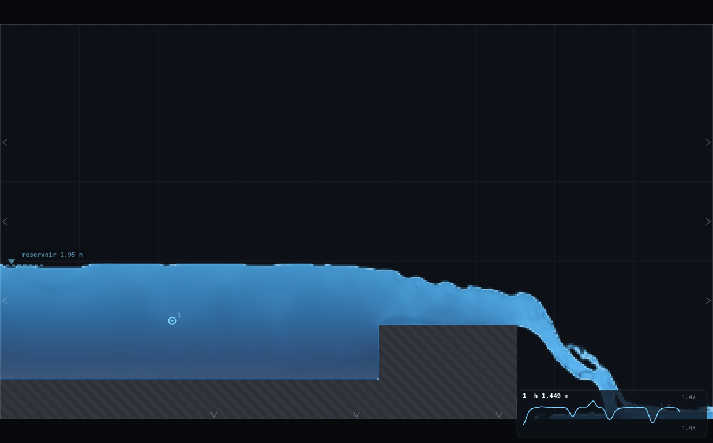

# DA-3 · A weir model study

## Lecturer notes

The tutorial-sheet exercise for dimensional analysis. Students take a
broad-crested weir through a model study on paper, then check it in the app:

1. Buckingham's Π theorem for the discharge over the weir.
2. Designing Froude-scaled 1:2 and 1:4 models: crest, discharge, settle
   time.
3. Predicting the model heads.
4. Measuring the prototype and both models in the app and comparing.
5. Re and We for a real model in water.
6. The simulation's own scale effect.

The three rungs are the same weir drawn at λ = 1, ½ and ¼. Loaded in turn,
they reproduce the prototype to within 0.3% in H: this solver's weir is
Froude-similar across the ladder.

**Open it:** press **E** in the [app](https://barneydobson.github.io/hydraulician/)
and pick **DA-3**, or use the direct link
[`?ex=DA-3`](https://barneydobson.github.io/hydraulician/?ex=DA-3).
How to run any exercise: see the [teaching pack index](../INDEX.md#running-an-exercise).
The student handout is [`tutorial-sheet-questions.docx`](tutorial-sheet-questions.docx).
The tutor copy, [`tutorial-sheet.docx`](tutorial-sheet.docx), has an
[Answer: …] line under every question and the measured column filled in.
`tutorial-sheet.py` regenerates both from the constants below and draws
`weir.png`. Edit the script, not the documents.

This replaces the scale-ladder and scale-effects exercises of the earlier
pack. The ladder's class-pooled Buckingham collapse and the resolution sweep
survive as Questions 4 and 6.

## The rig

RIG-B stripped to a flume: a q-driven reservoir at the left edge, a bed
pedestal (top face z = 0.50 m, not scaled), and a broad-crested block ending
at a free brink. The card's box picks the rung (0, 1, 2 → λ = 1, ½, ¼). Each
rung is a captured drawing (`DA-3@1`, `DA-3@0.5`, `DA-3@0.25` in
`js/exercises-rigs.js`) built by `rig.js`. Every base dimension is a multiple
of 4 cells at Medium, so the three rungs rasterise to exact cell counts.

| | λ = 1 | λ = ½ | λ = ¼ |
|---|---:|---:|---:|
| crest height P (m) | 0.696 | 0.348 | 0.174 |
| crest length L_c (m) | 1.739 | 0.870 | 0.435 |
| q (m²/s), Froude-scaled from 0.780 | 0.7800 | 0.2758 | 0.0975 |
| reservoir level (m) | 1.891 | 1.195 | 0.848 |
| gauge station x (m) | 2.17 | 1.09 | 0.54 |
| settle (s) | 55 | 40 | 28 |

The reservoir **pins** the free surface, so its level has to be the one the
weir's own backwater wants. `rig.js` holds the measured rule,
level = crest + 0.799·λ^0.157·q^0.562, rounded to the millimetre. Students
are given the level. Setting it is plumbing, not part of the model design.
The q values are typed into the card's field: the slider moves in 0.005 m²/s
steps and would miss 0.2758 and 0.0975. The card's settle is about **55 s**
at λ = 1. The models settle in √λ of that, which Question 2(c) asks for.

## Measured column

Measured at Medium: settled, then the median of 8 s of approach-pool depth
(`rig.js`, `DA3.tutorial()`; the tutor copy prints the same numbers).

| | λ = 1 | λ = ½ | λ = ¼ |
|---|---:|---:|---:|
| d measured (m) | 1.3894 | 0.6939 | 0.3469 |
| H = d − P (m) | 0.6937 | 0.3461 | 0.1730 |
| H predicted = λ·H_p (m) | — | 0.3469 | 0.1734 |
| difference | — | −0.23% | −0.26% |
| C_d = q/(√g·H^1.5) | 0.4310 | 0.4325 | 0.4327 |
| H in cells (Δx = 21.7 mm) | 32 | 16 | 8 |
| Re_H = √g·H^1.5/ν (water) | 1.8 × 10⁶ | 6.4 × 10⁵ | 2.2 × 10⁵ |
| We_H = ρgH²/σ (water) | 6.5 × 10⁴ | 1.6 × 10⁴ | 4.0 × 10³ |

The ideal broad-crested coefficient is (2/3)^1.5 = 0.544, which predicts
H_p = 0.594 m against 0.694 measured. The weir passes 21% less than ideal.
That makes a good discussion point (Question 4): a sharp upstream corner that
separates, a crest only 2.5 H long so the flow never becomes parallel over
it, and energy lost before the critical section.

## Teaching sequence

1. Hand out the question sheet a week ahead. Questions 1–3 are done before
   the session: the Π groups, the model design (P, L_c, q at each scale,
   settle times) and the predictions H_m = λH_p.
2. In the session each student loads the three rungs in turn, types their q
   and the card's level, presses R, waits out the settle and reads the pool
   depth. About ten minutes of simulated time in all. Groups of three can
   take one rung each.
3. Compare. The two models land within 0.3% of λH_p and within 0.4% in C_d.
   That is the result a real model study hopes for, and the anchor for
   Questions 5–6.
4. Questions 5 and 6 afterwards. A real 1:4 model in water is safe: both Re_H
   and We_H are large. It could go down to about 1:23 before a 30 mm head
   limit bites. The *simulation* could not: at Medium, H spans 8 cells at
   λ = ¼, right at the floor below which this weir's C_d drifts.

## Optional extension: the grid as the scale effect

This was the old scale-effects exercise, measured again for the tutorial's
q. Load the 1:4 rung, set its q and level, then change **Resolution** (after
the rig has loaded) and re-read. At λ = ¼ the pool depth reads:

| Resolution | Δx (mm) | d (m) | H = d − P (m) | C_d |
|---|---:|---:|---:|---:|
| Low | 31.6 | 0.3448 | 0.1708 | 0.441 |
| Medium | 21.7 | 0.3469 | 0.1730 | 0.433 |
| High | 16.0 | 0.3516 | 0.1777 | 0.416 |

C_d moves by a few per cent with nothing physical changed. Part of that is
the rasterisation of the pedestal and crest themselves (the bed lands at
0.505 m at Low and 0.497 m at High), which is the point: a coarser grid is a
different weir. Never go to Very high or Ultra on this rig, because the
weir does not settle there. Grid spacing behaves like model scale for the
same reason Re and We cannot follow Froude: something does not shrink with
the model.

## Console spot-check

Paste [rig.js](rig.js) into the console and run `DA3.tutorial()`. It builds
each rung from scratch, sets the tutorial's q and level, settles for 55/40/28 s
and prints d, H, the prediction and C_d. `DA3.build(λ, qb)` and `DA3.check()`
remain for rebuilding and auditing a rung (crest cells, seal, mass balance
across the weir).
