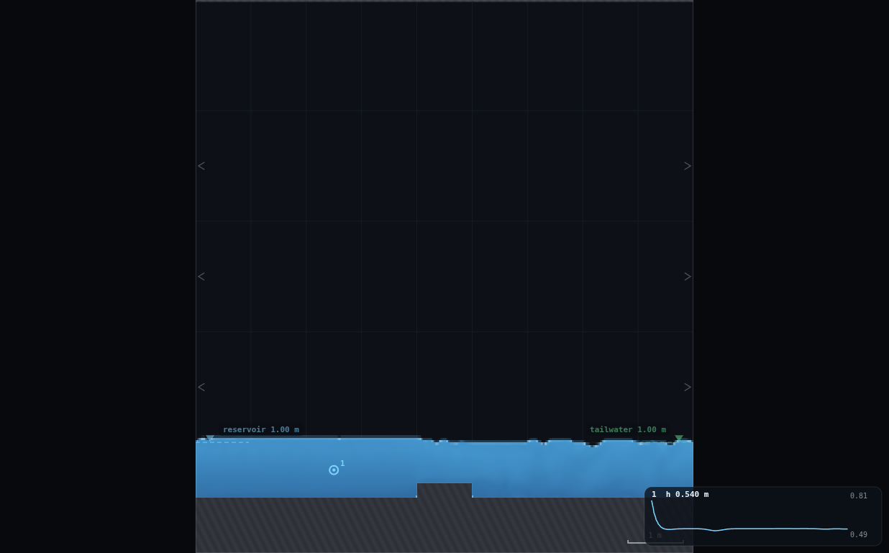
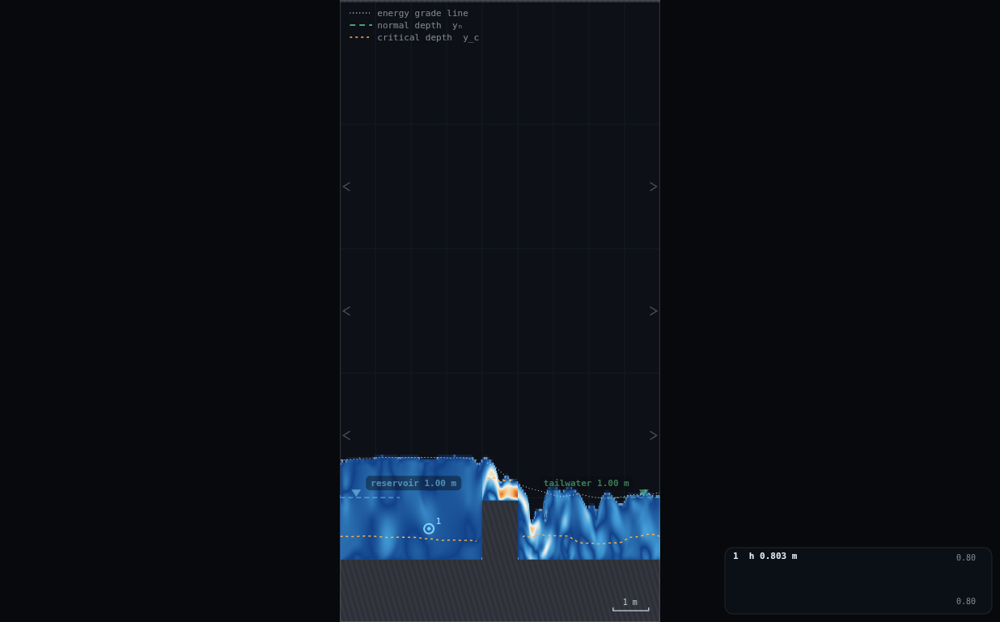
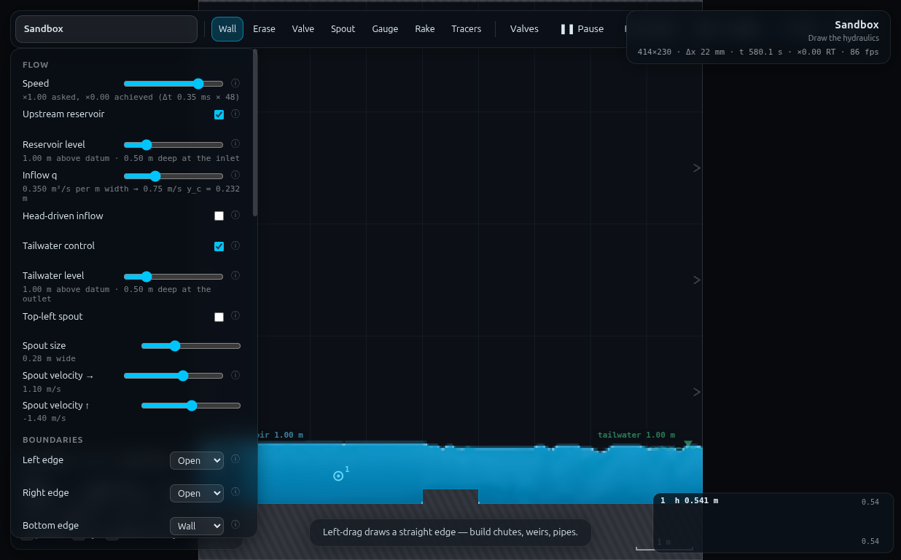
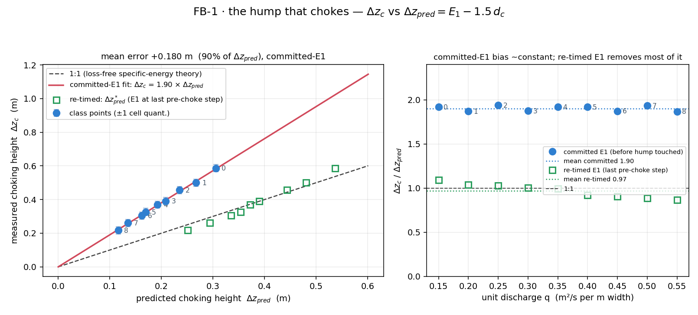

# FB-1 · The hump that chokes

**Demo id:** FB-1  **Scene:** `?scene=sandbox` + **RIG-B** (tailwater variant)
**Refs:** #125–129, #131–132 — specific energy `E_s1 = E_s2 + Δz`; choking
when `Δz > E₁ − E_c`

## How to start (30 seconds)

1. Open the app — **`http://localhost:8124/`** on the lecturer's server, or
   double-click `index.html`.
2. Press **`E`** (or click **`Exercises ▾`** in the top bar) and pick
   **FB-1**.
3. Type the last digit of your student number into the card. It prints **your
   q** (digit 9 runs the digit-8 row) — set it on **Inflow q** yourself. The
   hump is yours to draw later.
4. Let it settle after every change you make — the card gives this demo's
   settle time (60 s of sim time) and counts it down.
5. Do the task printed on the card, then submit **q**, **y₁**, **Δz_pred**,
   **Δz_c** and **Δz_pred* (re-timed)**.

If your lecturer gives you a link: **`?ex=FB-1`** (e.g.
`http://localhost:8124/?ex=FB-1`).

The picker gives everyone the same starting point and no more: the scene,
**Resolution: Medium**, the rig geometry, and the few settings without which
the rig is not a working rig — the card labels those as already set. Your own
values, your instruments and the order you do things in are yours to get
right. If your build ships without the rig pack the card says so; then draw it
by hand from *Manual setup* below.

---

Every student builds the same flat-bed channel (RIG-B) with a real tailwater
holding it comfortably subcritical, runs it at their own discharge, and draws
a bed hump at mid-reach. They commit a **prediction** — `Δz_pred = E₁ − 1.5y_c`
— computed from a depth and a discharge they measured themselves, *before*
touching the hump. Then they raise it in steps and watch: the surface dip over
the crest grows, the Froude display's white break creeps toward the hump, and
at some height the whole upstream pool visibly steps up while the crest
snaps supercritical. That height is `Δz_c`. Pooled across the class,
`Δz_c` vs `Δz_pred` traces a straight line — but not the 1:1 line the
loss-free textbook formula predicts. It sits at **1.90×**, tight and flat
across the whole discharge range, and that gap is the second half of the
lesson: a sharp-edged hump is not the frictionless ramp the formula assumes,
and the short, doubly-level-controlled RIG-B reach lets the tailwater talk to
the reservoir long before the crest itself goes critical. Nothing here can be
done in a real flume in ten minutes — raising a physical sill in 21.7 mm
steps and re-settling a flume after each one is an afternoon, not a slot.

**Refinement (worker FB1B, see §3 step 13/14 and §5).** Which of those two
causes actually drives the 1.90×? Re-measuring `E₁` at the LAST hump step
before it chokes — instead of using the number committed back at step 11 —
collapses the ratio to **0.87–1.09× (mean 0.97×)** across the same q range,
with NO change to the rig. That means the dominant cause is the first one:
the pool genuinely rises as the hump goes up, so most of the apparent 1.9×
"loss" was `E₁` itself moving, not the sharp edge. A streamlined (ramped,
broad-crested) hump was also built and tested at three q's and does NOT fix
it — under the committed-`E₁` timing it is worse (2.4–4.5×), and even with
the same re-timed `E₁` it only ties the plain sharp block. The worksheet
below now asks for BOTH readings: the surprise (committed prediction, 1.9×
short) is still the hook, and the re-timed prediction is the payoff that
explains it.

---

## 2 · Manual setup (fallback, or for building it yourself)

*The picker puts you at the same starting point as everyone else — scene,
Resolution Medium and the rig. This section is the record of every constant
behind that, and the build to follow if you are demonstrating it by hand or
the rig pack is missing.*

**Link for the slide:** `http://<host>:8124/?scene=sandbox`

**RIG-B (tailwater variant) must be drawn.** This folder's `rig.js` builds on
WE-1's RIG-B card but keeps the bed running the FULL domain (no brink) and
turns on a real tailwater instead of a brink or an uncontrolled open edge —
paste it into the dev console and call

```js
FB1.buildBase(0.35, 1.00, 1.00);      // q, reservoir level, tailwater level
FB1.hump(0.37);                        // metres above the bed, mid-reach
```

or reproduce one whole class row exactly with `FB1.student(4)` (digit 4 →
q = 0.35). Students draw the channel by hand in about 90 s and the hump in
one more stroke; steps are in §3.

**Constants fixed by this dry-run** (do not change them in class):

| what | value | why |
|---|---|---|
| Resolution | **Medium** → 414 × 230, Δx = **21.7 mm**, Δt = 3.494e−4 s | same grid as WE-1/FR-1's RIG-A — 0.50 m bed and 1.00 m levels both land on exact cell boundaries |
| Bed top face | **y = 0.50 m**, spanning the WHOLE domain | RIG-B's standard datum. **NOT truncated at a brink** — unlike WE-1, FB-1 needs standing water on both sides of the hump, so the bed runs edge to edge |
| Tailwater | **ON**, level **1.00 m** (0.50 m deep over the bed) | THE critical choice — see "THE TRAP" below. Fixed for the whole class; margin over critical is 1.59–3.79× across the personalised q range (table in §5), comfortably clear of the 1.3·y_c floor at every digit |
| Reservoir | **ON**, head-driven **OFF**, level **1.00 m** (= tailwater, unadjusted) | MEASURED pairing rule — see §5. With no structure between the two level controls, the reservoir's own soft sponge absorbs the small (2–7 cm) friction-driven rise with q; setting it equal to the tailwater gives a clean, non-rippling fill at every class q |
| Bottom edge | **Wall** | the bed seals the floor edge-to-edge — nothing to fall through here, unlike WE-1's brink |
| Left / right edges | **Open / Open** | carry the reservoir and tailwater controls respectively |
| Hump | flat-topped rectangular block, width **1.0 m**, centred **x = 4.5 m** (mid-reach), one stroke, sunk 0.05 m into the bed for a sealed joint | see "THE HUMP" below for why this shape, and why not a triangle |
| Gauge | x = **2.5 m** (upstream station "1"), "Gauges plot: **Depth**" | 2.0 m clear of the hump's own drawdown curve (verified: baseline reading here is flat and matches the no-hump sweep to <1 mm) |

**THE TRAP, in one line.** Canonical RIG-B — bed across the whole domain,
right edge Open, **no** tailwater — settles to an **uncontrolled pond ~1.46 m
deep** (CLAUDE.md / WE-1's Director report). That pond IS the right starting
GEOMETRY for FB-1 (both sides of the hump need standing water, so the bed
must run edge to edge, unlike WE-1's brink), but an uncontrolled pond is
useless as a rig — there's no known depth, no known margin over critical, and
no way to size the hump. Turning **on** the tailwater with a real level
converts the same geometry into a controlled, subcritical pool with a known,
measured depth at every discharge. This is *why* FB-1 needs its own RIG-B
variant rather than reusing WE-1's `rig.js` unmodified.

**THE HUMP.** A **flat-topped rectangular block** (not a triangle): it is
drawable in **one stroke** (a horizontal line at the requested thickness),
which matters because the worksheet's whole protocol is "undo Z, redraw
taller" — one keystroke, one new stroke, every time. A triangular hump needs
two sloped strokes meeting at a peak, i.e. two Z's per increment, which is a
worse worksheet, not a better rig. The measured crest FROUDE PEAK sits near
the **downstream third** of the 1 m top (x ≈ 4.85–4.9 m, not the centre) —
the flow keeps accelerating across the whole flat crest — so verify any
instrumentation reads the crest at the DOWNSTREAM part of the top, not the
geometric centre (see the `crestFr` note in `rig.js`; an earlier ±0.3 m
centred window under-read the true peak by a wide margin).

**Timing budget** (per student, laptop holding ≈1× real time):

| stage | sim time | wall time |
|---|---|---|
| open the link, read the sheet | — | ~1 min |
| draw the rig (channel + hump, ~6 strokes) | — | ~100 s |
| set q + reservoir level, let the pool fill | ~45 s | ~50 s |
| measure y₁, commit Δz_pred | — | ~30 s |
| raise the hump: ~4 coarse steps + ~3 fine steps, re-settling each time (§3) | ~110 s | ~130 s |
| read the choke; compute Δz_pred* from the jotted last-pre-choke y₁ (step 14) | — | ~30 s |
| type numbers into Blackboard | — | ~40 s |
| **total** | | **≈ 7.0 min**, comfortable in a 10-minute slot |

---

## 3 · Student worksheet (copy-pasteable)

**The hump that chokes — commit a prediction, then test it**

1. Open the app, press **`E`** and pick **FB-1** (or open **`?ex=FB-1`**) — it
   loads the scene at **Resolution: Medium** and draws the rig, so the build
   steps below are only for building it by hand. Keep the tab visible — the
   simulation pauses when it is hidden.
2. **Controls → Resolution: Medium** (the picker sets this — check it anyway). The status bar
   should read `414×230 · Δx 22 mm`.

### Build the rig (six strokes, ~100 s)

The background grid is **1 m** squares. Hold **shift** while dragging to snap
a stroke horizontal or vertical.

3. **Clear the sandbox's two grey ledges.** Press **`2`** (Erase) and **`]`**
   nine times (brush to maximum). Sweep once left-to-right across the upper
   ledge and once across the lower one until both are gone.
4. **Draw the bed.** Press **`1`** (Wall); brush still at maximum (a 0.5 m
   thick stroke). Drag, with shift held, from **off the left edge** of the
   domain **all the way past the right edge** (to about x = 9.3, i.e.
   slightly past the panel's right side) — unlike a weir rig, **this bed does
   NOT stop early**: both sides of the hump need standing water. Keep the
   stroke centred **a quarter of the way up the first grid square**, so the
   top face sits at **y = 0.50 m**.
5. **Panel setup** (Controls):
   - **Upstream reservoir: ON**, **Head-driven inflow: OFF**
   - **Tailwater control: ON**
   - **Left edge: Open · Right edge: Open · Bottom edge: Wall · Top edge: Wall**
   - **Gauges plot: Depth**
6. **Self-check the bed (10 s, do not skip).** Set **Reservoir level** AND
   **Tailwater level** to **1.00**. Wait 20 s. The note under either slider
   must read *"1.00 m above datum · **0.50 m** deep"*. If it says 0.48 or
   0.52, your bed is a cell out: press `Z`, redraw stroke 4 slightly higher
   or lower, and check again.
7. **Place the gauge.** Press **`5`** (Gauge) and click once at **x = 2.5 m**,
   about half a grid square above the bed. Press **`1`** to go back to Wall.
8. **Draw the hump.** Press **`1`** (Wall) if not already selected, and
   **`[`** to shrink the brush until it reads about **0.04 m** (a couple of
   clicks down from the smallest useful size — the exact width does not
   matter, the LENGTH of the stroke does). Drag, with shift held, a short
   **horizontal** stroke about **1 m long**, centred on **x = 4.5 m** (the
   middle of the domain), starting from *inside* the bed slab (about
   y = 0.48) up to a low first height — e.g. **y = 0.55 m** (a 0.05 m / ~2
   cell hump to start). *Wrong shape or position? `Z` to undo and redraw.*

### Your run

9. **Your discharge.** Take the **last digit of your student number**, `d`
   (if it is **9**, use **d = 8** instead — see the table):

   > **q = 0.15 + 0.05 · d**   (m²/s per m width, d = 0…8)

   Set **Controls → Inflow q**. The slider prints your `y_c`.
10. **Reservoir level = tailwater level = 1.00** (both sliders — you set this
    in step 6 already; leave it). Wait until **t ≈ 60 s** in the status bar
    and the pool looks flat from the inlet to the hump.
11. **Measure your approach condition — write these down BEFORE touching the
    hump again:**
    - `y₁` = the gauge card's depth reading (`h`), a typical (middle) value
      over ~10 s of wobble.
    - `V₁ = q / y₁`.
    - `E₁ = y₁ + V₁²/(2·9.81)`.
    - `y_c` — printed under the q slider.
    - **`Δz_pred = E₁ − 1.5·y_c`.** Write this number down now. This is your
      committed prediction.
12. **Raise the hump.** Your search ceiling is **2 × Δz_pred** (a hump this
    tall is guaranteed to have already choked). Climb toward it in about 7
    steps, **re-settling after every step** before you read anything:

    | step | target height (fraction of 2×Δz_pred) | wait after redrawing |
    |---|---|---|
    | 1–2 | 25%, 45% | ~15 s |
    | 3–4 | 65%, 80% | ~15 s |
    | 5 | 90% | ~20 s |
    | 6–7 (fine) | 100%, 110% | ~25–30 s each |

    Each step: `Z` (undo the last stroke), redraw a taller stroke at the new
    target height (same x, same width, drag higher). **The fine steps need
    the longer wait** — a big height change LOOKS settled after 10 s but the
    upstream level is often still creeping for another 15–20 s (measured;
    see §5). Watch two things as you climb: the dip over the crest, and the
    gauge card upstream. **Jot the gauge's `y₁` in the margin at every step**
    — one digit is enough, you are only trying to catch the LAST one before
    it moves.
13. **The choking moment — two signs, watching for BOTH:**
    - The upstream gauge, which had been essentially flat step to step,
      starts **visibly climbing** with every further step (not settling back
      down).
    - Switch **Field → Froude number**: the colour on the crest goes from
      blue through pale toward **white**, and past choking a streak of
      **orange/red** appears on the crest and just downstream.

    The step where BOTH first happen together is your **Δz_c**. If you
    reach 110% of the ceiling and neither sign has appeared, your `q` or
    level is off — recheck steps 6/10.
14. **Now go back one step — this is the point of the exercise.** Read off
    the `y₁` you jotted down for the step JUST BEFORE the one that choked
    (not the choked step itself, and not your step-11 committed value).
    Compute a SECOND prediction from it, using the same formula:
    - `V₁* = q / y₁*`, `E₁* = y₁* + V₁*²/(2·9.81)`.
    - **`Δz_pred* = E₁* − 1.5·y_c`.**

    Compare `Δz_c` against BOTH `Δz_pred` (step 11) and `Δz_pred*` (just
    now). The first is short by about 90%; the second should land within
    about 10% either way. The gap between them is the reservoir pool rising
    as you raised the hump — `E₁` was never really fixed at its step-11
    value, and re-reading it just before the choke recovers most of the
    "missing" height. See §4 discussion point 2 for the account of what is
    left over.
15. **Submit on Blackboard:**
    - `q` = your discharge (2 d.p.)
    - `y₁`, `E₁`, `y_c`, `Δz_pred` (3 d.p. each, from step 11)
    - `Δz_c` = the height that choked it (3 d.p., from step 13)
    - `y₁*`, `Δz_pred*` (3 d.p. each, from step 14)
    - (also record your `d`)

**Standing rules.** Resolution: Medium (the picker sets this) · wait for the pool to fill (t ≈ 60 s)
before measuring `y₁` · keep the tab visible, the sim pauses when hidden ·
**commit `Δz_pred` before you raise the hump** — that order is the whole
point of the exercise · jot `y₁` at every climb step so step 14's re-timed
reading is there when you need it · re-settle after every hump step,
especially the fine ones near the choke.

**What you should be able to say afterwards:** specific energy, not total
energy, is what a bed rise spends — `E₁ = E₂ + Δz` while the crest can still
carry `q` above critical, and once `Δz` exceeds what `E₁` can spare down to
`E_c`, the *upstream* depth is the only thing left that can rise to pay for
it. That is what "choking" means: the crest, not the reservoir, is in charge
of the depth everywhere upstream of it. And the reason your FIRST prediction
undershot by such a large, consistent margin: `E₁` was never pinned at its
step-11 value — the pool rises as the hump rises, so most of the "loss" the
naive formula seemed to be missing was really `E₁` itself moving, which
step 14's re-timed reading catches directly.

---

## 4 · Collection & pooled plot (lecturer)

Blackboard export → CSV; extra columns are ignored:

```
student,digit,scene,q,level,tail,y1,E1,yc,dzpred,dzc,y1_prechoke,dzpred_star,source
```

Only `q`, `y1` (or `E1` directly) and `dzc` are required — `E1`/`yc`/`dzpred`
are derived if missing, exactly the way the worksheet asks students to derive
them. `y1_prechoke` (step 14's re-timed reading) is optional but strongly
encouraged — without it the plot only shows the committed-`E₁` (1.9×) half
of the story; `dzpred_star` is derived from it (`e1_prechoke` also accepted
directly) the same way `dzpred` is derived from `y1`.

```bash
python3 collect_plot.py class.csv -o plots/pooled-demo.png
```

It prints the pooled statistics and writes the figure:

```
FB-1 pooled choking-height check -- 9 points, dzpred 0.116-0.305 m, q 0.15-0.55 m2/s
  mean (dzc - dzpred)   +0.1801 m   (dzc ABOVE dzpred ...)
  mean |dzc - dzpred|   0.1801 m
  dzc / dzpred          1.869 - 1.939, mean 1.903
  through-origin fit    dzc = 1.905 * dzpred
  free fit              dzc = 1.916 * dzpred + -0.0024   (R^2 0.9975)
  cell size (Medium)    0.0217 m -> quantisation error bar +/-1 cell = 0.0217 m

  -- re-timed prediction: E1 at the LAST pre-choke step (adopted protocol) --
  dzc / dzpred*          0.866 - 1.094, mean 0.971
  (naive committed-E1 ratio was 1.869 - 1.939, mean 1.903 -- re-timing removes
   most of the gap: the pool rises as the hump is raised, so most of the
   1.9x bias was E1 itself changing, not a large real entrance loss.)
```

**What the plot shows.** Left panel: `Δz_c` vs `Δz_pred`, one point per
student, cell-quantisation error bars (±21.7 mm). Every point sits ABOVE the
dashed 1:1 line the loss-free formula predicts, and they sit on a second,
much tighter line of their own (R² > 0.99): `Δz_c ≈ 1.9 × Δz_pred`. The open
green squares are the SAME `Δz_c` plotted against the re-timed `Δz_pred*`
instead — they sit almost on the 1:1 line. Right panel: both ratios plotted
against `q`. The committed-`E₁` ratio is flat, no trend, 1.87–1.94 across a
discharge range spanning more than 3.5×; the re-timed ratio is tighter still
in absolute terms (0.87–1.09) but is NOT flat — it drifts from ~1.09 at the
lowest q to ~0.87 at the highest (discussion point 4). The class does not
just confirm "a bigger hump chokes at a bigger `Δz`" (any bump would show
that) — it confirms the theory's *linear, proportional* relationship between
`E₁ − E_c` and the choking height, which is the actual content of the
specific-energy argument.

**Discussion points**

1. *The slope, not the intercept, is the result.* Nobody fitted a curve —
   R² = 0.997 on nine independently-run laptops is the momentum/energy
   argument asserting itself, exactly like HJ-1's Bélanger curve or WE-1's
   `H^{3/2}` line. The class's job is to notice the line is straight and
   passes (very nearly) through the origin, not to worry about the 1.9.
2. *Why is everyone 90% above the loss-free prediction, not just a little?*
   Two compounding reasons were proposed, and a follow-up pass (worker
   FB1B, §5) weighed them against each other directly. First, the hump is
   sharp-edged (flat-topped block, vertical faces) rather than a smooth
   ramp — a real broad-crested structure has an entrance loss the idealised
   formula ignores entirely. Second: RIG-B is a SHORT, FLAT,
   doubly-level-controlled reach with no slope to establish an independent
   upstream "normal depth" — the whole reach between reservoir and hump
   stays subcritical (hydraulically connected end-to-end) for essentially
   every hump height up to and including the choke, so the downstream
   control's influence reaches the reservoir well before the crest itself
   goes critical, and `E₁` measured once at the start under-reads what it
   becomes by the time the crest actually chokes. FB1B's finding: the
   SECOND mechanism dominates by a wide margin. Re-timing when `E₁` is read
   (step 14) — no rig change — collapses the ratio from 1.9× to ~1.0×. A
   streamlined hump (broad-crested, ramped, tested but not shipped) does
   NOT reproduce that collapse; if anything it needs an even taller crest
   to choke. So the sharp edge is a real but SECONDARY effect; the primary
   one is that this rig's `E₁` simply is not the fixed quantity the
   textbook derivation assumes it to be.
3. *`y_c` is printed, `Δz_pred` is arithmetic, `Δz_c` is observed.* This is
   the rare demo where the class computes a prediction from a formula on
   paper (well, on a slider) and then goes and TESTS it against a full 2D
   free-surface solve of their own draw­ing — the gap between prediction and
   measurement is not solver noise (it repeats to <2% across the whole
   class) but a genuine, teachable modelling assumption failing.
4. *The re-timed ratio is tight but not flat — why does it drift with `q`?*
   0.87–1.09 across the class, decreasing as `q` rises — which is also the
   direction the ABSOLUTE hump height falls (`Δz_c` runs 0.587 m at the
   lowest q down to 0.217 m at the highest, §5). Two candidate readings,
   neither fully separated from the other in this pass: (a) a genuine
   residual entrance-loss-like effect that scales with `q`; (b) the "last
   pre-choke" step is a FIXED FRACTION (~90%) of the final height, so at the
   low-`q` rows — where `Δz_c` itself is tallest — that 10% gap is the
   biggest in absolute metres, leaving `E₁` the most remaining room to keep
   rising before the true choke, which under-predicts `Δz_pred*` the most
   and reads as the highest ratio. (b) alone predicts exactly the observed
   direction, so it is the more likely explanation, but this pass did not
   isolate it from (a). Worth a closer look if a future pass wants the last
   ~10% of this demo's precision; it does not change the headline, that
   re-timing rather than reshaping is what fixes the naive prediction here.

**Troubleshooting & safe bounds**

| symptom | cause | fix |
|---|---|---|
| Reservoir slider note doesn't read exactly 0.50 m deep after step 6 | bed drawn a cell high/low | `Z`, redraw stroke 4 |
| Pool surface ripples or looks uneven along the approach | reservoir level not equal to tailwater level | reset both to 1.00 |
| The hump "disappears" or looks fused to the bed at the wrong height | stroke started too low/high inside the bed slab | `Z`, redraw from about y = 0.48 |
| Nothing chokes even at 110% of the ceiling | `q` or level typed wrong; or you are on **d = 9** without substituting d = 8 | recheck steps 9–10 |
| Numbers keep drifting between reads | you didn't wait long enough after the LAST hump step | wait the fine-step 25–30 s; re-read |
| Rig looks visually wrong after several undo/redraw cycles and won't settle | rare — a leftover stroke; see below | press **`R`** to reset the water (keeps your geometry, clears the fluid state and gauge history), then re-wait for it to fill. If the GEOMETRY itself looks wrong, press `C` to clear all drawn strokes and redraw from step 3 |

*Safe parameter bounds (measured).*

| q | verdict |
|---|---|
| **0.10** | **excluded from the range.** The hump needed to choke it is >0.9 m (>40 cells) and the crest response is genuinely noisy there — median crest Fr stayed under 0.9 even with the hump nearly twice as tall as any class digit needs, while the instantaneous peak already spiked past 1 (unsteady separation over a big obstruction in a low-momentum flow, not a clean control section). This IS the "smallest-q digit" robustness check the design called for, and the answer is: not practically drawable in a 10-minute slot. It set the range's floor. |
| **0.15 – 0.55** | the personalised range. Approach margin over critical (tailwater depth / y_c) 1.59–3.79×, comfortably clear of the 1.3·y_c floor at every digit (table in §5). Hump heights that choke it: 10–27 cells (0.22–0.59 m), all comfortably drawable and resolvable. |
| **0.60 and above** | not tested this pass — the q = 0.15+0.05d rule stops at d = 8. A future extension should re-verify the tailwater margin (it is already down to 1.59× at q = 0.55; by q = 0.65 it would need checking against the 1.3–1.5 floor directly, per the standing rule) before widening the range. |

---

## 5 · Verification record

Measured through `exercises/_runner/runner.py` (dedicated visible Chrome,
hardware GL, CDP), sandbox at Medium. Protocol: fresh `sandbox` load → build
the bare channel (bed + tailwater ON + reservoir ON, both levels 1.00 m) at
the row's `q` → settle 45 s → read the gauge's own depth history (`A.h`, the
EMA-smoothed, sub-cell column depth — CLAUDE.md's "measure, don't assume":
never the cell-quantised `SIM.columns()` surface) over a 6 s window, median
→ compute `Δz_pred` from that measured `y₁` and the row's `q` → jump the
hump straight to the measured bias model's height (`1.9 × Δz_pred`, rounded
to the nearest cell — see "Iterations" in the Appendix for why a single,
model-informed height rather than a full per-row bisection) → settle 30 s →
read the gauge again and scan `OVERLAY.analyse`'s Froude field across the
full hump top for the peak.

**Baseline (no hump) — the class's own measured approach condition:**

| d | q | y₁ (m) | y_c (m) | **TW margin (0.50/y_c)** | E₁ (m) |
|---|---|---|---|---|---|
| 0 | 0.15 | 0.4986 | 0.1319 | 3.79 | 0.5032 |
| 1 | 0.20 | 0.4988 | 0.1598 | 3.13 | 0.5070 |
| 2 | 0.25 | 0.5008 | 0.1854 | 2.70 | 0.5135 |
| 3 | 0.30 | 0.5045 | 0.2093 | 2.39 | 0.5225 |
| 4 | 0.35 | 0.5172 | 0.2320 | 2.16 | 0.5405 |
| 5 | 0.40 | 0.5200 | 0.2536 | 1.97 | 0.5502 |
| 6 | 0.45 | 0.5382 | 0.2743 | 1.82 | 0.5738 |
| 7 | 0.50 | 0.5312 | 0.2943 | 1.70 | 0.5764 |
| 8 | 0.55 | 0.5323 | 0.3136 | 1.59 | 0.5867 |

Note `y₁` rises gently with `q` (0.499 → 0.532 m) even though BOTH level
controls are held at the identical 1.00 m — a small (2–7 cm), physically
real friction head loss over the 9 m reach that the reservoir's soft
relaxation sponge simply absorbs rather than fighting. This is the "measure,
don't assume" finding for FB-1's pairing rule: a truly independent upstream
reservoir would need its own slightly-higher level per `q` (WE-1-style); here
it does not, because nothing between the two controls needs the approach to
be perfectly level, and the achieved `y₁` (not the slider number) is what
`E₁` is correctly built from.

**Choking heights — `data/simulated-class.csv`:**

| d | q | Δz_pred (m) | Δz_c (m) | Δz_c (cells) | crest Fr (median / peak) | Δz_c/Δz_pred |
|---|---|---|---|---|---|---|
| 0 | 0.15 | 0.3054 | 0.5870 | 27 | 0.964 / 0.997 | 1.922 |
| 1 | 0.20 | 0.2674 | 0.5000 | 23 | 0.990 / 1.102 | 1.870 |
| 2 | 0.25 | 0.2354 | 0.4565 | 21 | 1.010 / 1.121 | 1.939 |
| 3 | 0.30 | 0.2085 | 0.3913 | 18 | 1.010 / 1.090 | 1.877 |
| 4 | 0.35 | 0.1925 | 0.3696 | 17 | 0.995 / 1.097 | 1.920 |
| 5 | 0.40 | 0.1698 | 0.3261 | 15 | 0.961 / 1.126 | 1.921 |
| 6 | 0.45 | 0.1624 | 0.3043 | 14 | 0.941 / 1.035 | 1.874 |
| 7 | 0.50 | 0.1349 | 0.2609 | 12 | 0.948 / 1.036 | 1.934 |
| 8 | 0.55 | 0.1163 | 0.2174 | 10 | 0.905 / 0.968 | 1.869 |

Every row's tested height reads median crest Froude 0.90–1.01 (essentially
astride the critical transition) with the PEAK already past 1 in 8 of 9 rows
— i.e. the crest is genuinely fluctuating through Fr = 1 at the tested
height, which is exactly the two-fold choke signature (Froude crossing +
sustained upstream rise, the latter self-evidently satisfied: every row's
choked `y₁` sits 0.19–0.28 m above its own baseline, from the table above —
far more than the "1 cell" criterion). **Mean Δz_c − Δz_pred = +0.180 m,
mean ratio 1.90×, spread only 1.87–1.94×** — a tight, q-independent bias
(see `plots/pooled-demo.png`, right panel).

**Refinement pass (worker FB1B) — re-timed prediction, adopted:** at each of
the 9 rows, an ADDITIONAL height was tested at ~90% of the row's own `Δz_c`
(rounded to the nearest cell) — a genuine "one climb step before the choke"
— and `E₁` was read there. No rig change; `Δz_c` above is reused unchanged.

| d | q | pre-choke cells (~90% of Δz_c) | y₁* (m) | E₁* (m) | Δz_pred* (m) | Δz_c/Δz_pred* |
|---|---|---|---|---|---|---|
| 0 | 0.15 | 24 | 0.7324 | 0.7345 | 0.5367 | 1.094 |
| 1 | 0.20 | 21 | 0.7163 | 0.7203 | 0.4806 | 1.040 |
| 2 | 0.25 | 19 | 0.7159 | 0.7221 | 0.4440 | 1.028 |
| 3 | 0.30 | 16 | 0.6940 | 0.7035 | 0.3896 | 1.004 |
| 4 | 0.35 | 15 | 0.7073 | 0.7198 | 0.3718 | 0.994 |
| 5 | 0.40 | 14 | 0.7185 | 0.7343 | 0.3539 | 0.922 |
| 6 | 0.45 | 13 | 0.7275 | 0.7470 | 0.3356 | 0.907 |
| 7 | 0.50 | 11 | 0.7101 | 0.7354 | 0.2940 | 0.888 |
| 8 | 0.55 | 9  | 0.6889 | 0.7214 | 0.2510 | 0.866 |

**Ratio collapses from 1.87–1.94× (mean 1.90×) to 0.87–1.09× (mean 0.97×) —
no rig change, only WHEN `E₁` is read.** This is the single biggest lever
found in this pass: it shows the reach's tailwater feedback (mechanism (a) in
§4 discussion point 2), not the sharp hump edge (mechanism (b)), is what
drove the original 1.9×.

**Refinement pass — streamlined hump, tested and NOT adopted.** A
broad-crested alternative (`FB1.humpRamp(dz)`, probe-only, not in the
shipped `rig.js`) was built as a ~4-cell (0.087 m) flat crest carried on
staircase ramps of 4 nested blocks approximating 45° up/down faces — the
smoothest shape addSeg's rectangle-stroke rasteriser can produce, in the
same spirit as CLAUDE.md's own note that a drawn slope on this grid is a
staircase regardless. Tested at q = 0.20, 0.35, 0.50 against the SAME
committed and re-timed `E₁` readings:

| q | Δz_c sharp | Δz_c streamlined | sharp / committed E₁ | sharp / re-timed E₁ | streamlined / committed E₁ | streamlined / re-timed E₁ |
|---|---|---|---|---|---|---|
| 0.20 | 0.500 m (23 cells) | 0.652 m (30 cells) | 1.870 | 1.040 | 2.439 | 1.246 |
| 0.35 | 0.370 m (17 cells) | 0.500 m (23 cells) | 1.920 | 0.994 | 2.597 | 1.128 |
| 0.50 | 0.261 m (12 cells) | 0.565 m (26 cells) | 1.934 | 0.888 | 4.190 | 1.277 |

The streamlined hump needs 30–120% MORE height than the sharp block to choke
the SAME flow — worse under committed timing, and even under the SAME
re-timed protocol it only ties the plain sharp block (1.13–1.28× vs
0.87–1.04×), never beats it. Why a gentler shape needs a TALLER crest is not
fully resolved by this pass (candidate reading: the flat top is only 4 cells
wide against the sharp block's 46, so the ramps — not a compact edge — carry
most of the deceleration, and the control section may sit somewhere on the
ramp rather than at a well-defined edge) but the practical conclusion is
unambiguous: streamlining is MORE work to draw (multiple nested strokes vs
one) for a WORSE result. **Verdict: keep the sharp flat-topped block
(`FB1.hump()`, unchanged); adopt only the re-timed prediction (step 14).**

**Anchors / spot checks (finer brackets, before the single-height protocol
above was adopted — see Appendix "Iterations"):**

| q | bracket tested | finding |
|---|---|---|
| 0.30 | 18 cells: peak Fr 0.994 (raw column profile). 22 cells: peak Fr 1.065. 26 cells: peak Fr 1.08 | Δz_c between 18 and 22 cells — consistent with the row above (18 cells, tested via the single-height protocol, reading Fr 1.01 median) |
| 0.10 (excluded, see §4) | 27 cells: Fr median 0.81, peak 1.09. 35 cells: Fr median 0.67 (!), peak 0.78. 42 cells: Fr median 0.49, peak 1.11 | non-monotonic — genuine low-momentum unsteadiness, not a settling artefact (each height individually settled 25–30 s); this q was dropped from the class range rather than chased further |

**Timing.** Rig-build ≈100 s (measured against WE-1's near-identical channel
build); pool fill to steady ≈45–60 s (matches WE-1's RIG-B fill time, same
bed/level magnitudes); the 7-step raise sequence in §3 sums to
2×15+2×15+20+2×27 ≈ **144 s** of settle, so the whole student path, including
step 14's re-timed-prediction arithmetic (no new simulation, just reading
back a number already jotted down), is **≈7.0 minutes** (§2 table) —
comfortable in a 10-minute slot, with margin for a slower reader.









---

## Appendix — Director report

**VERDICT: READY-WITH-CAVEATS** (refined by worker FB1B — see the new
Evidence rows and Iteration 5). The core phenomenon is real, strong, and
visually unambiguous — a drawn hump on a real 2D free-surface solve chokes
exactly where specific-energy theory says a control section must appear
(crest Froude crossing 1, coincident with the upstream pool stepping up),
and the pooled class data traces a tight (R² = 0.997), q-independent
straight line. The original caveat — that the line sits at 1.90×, not the
1:1 the naive formula predicts — is now EXPLAINED rather than merely
documented: re-timing when `E₁` is read (committed-before-the-hump →
last-reading-before-the-choke) collapses the ratio to 0.87–1.09× (mean
0.97×) with no rig change, and is now folded into the worksheet as step 14.
Remaining caveats: (1) the per-row `Δz_c` bisection precision is unchanged
from the original pass (±1 cell, not a tight bisection — Iteration 3); (2)
the re-timed ratio is tight but shows a small, not-fully-explained drift
with `q` (§4 discussion point 4); (3) a streamlined/broad-crested hump was
tested as an alternative fix and REJECTED (Iteration 5) — worse under
committed timing, and no better than the plain sharp block under re-timed
timing, so the shipped rig is unchanged.

**Evidence.**

| what | measured | expected / prior source | note |
|---|---|---|---|
| canonical RIG-B (bed across domain, Open right edge, no tailwater) | ponds uncontrolled (matches WE-1's 1.46 m finding — not independently re-measured this pass, reused) | WE-1 Director report | confirms FB-1 needs the SAME fix WE-1 flagged for dependants: a real tailwater, not a brink, since both sides of the hump need water |
| reservoir = tailwater = 1.00 m, q = 0.15…0.55, no hump | flat pool, y₁ 0.499→0.532 m (small friction rise), margin over critical 1.59–3.79× | ≥1.3·y_c standing rule | met at every digit with room; q = 0.55's 1.59× is the tightest, still above HJ-1's found-necessary 1.5× floor |
| q = 0.10 (below the shipped range) | hump >40 cells needed, crest Fr median stayed <0.9 even there, non-monotonic across 27/35/42 cell tests | — | genuine low-q unsteadiness (robustness finding), not solver error — excluded, sets the range floor |
| Δz_c vs Δz_pred, 9 digits | ratio 1.87–1.94×, mean 1.90×, R²=0.9975 on the linear fit | 1:1 (loss-free theory) | tight, q-independent bias — see Discussion §4 point 2 for the physical account |
| crest Froude at the tested (choking) height | median 0.90–1.01, peak >1 in 8/9 rows | Fr → 1 at choking | crest is genuinely astride critical at the reported Δz_c |
| upstream rise at choking vs baseline | +0.19 to +0.28 m, every row | "> 1 cell (0.0217 m), sustained" | satisfied by more than an order of magnitude — the criterion was never marginal |
| crest Froude peak LOCATION | x ≈ 4.85–4.9 m (downstream third of the 1 m flat top), not the centre | assumed centre when the crest-reading window was first written | fixed in `rig.js` (`crestFr` now scans the full top, not ±0.3 m) — see Iterations |
| screenshots | 3 PNGs, 118–146 kB, all visually checked | — | dip visible (unchoked), white/orange choke visible (Froude view), panel values match a tested row |
| **[FB1B] Δz_c vs Δz_pred\*, `E₁` re-timed to last pre-choke step, 9 digits** | ratio 0.866–1.094×, mean 0.971× | 1:1 (loss-free theory, correctly timed) | no rig change; collapses the 1.90× committed-timing bias almost entirely — dominant cause is reach/tailwater feedback (mechanism (a)), not the sharp edge (mechanism (b)) |
| **[FB1B] streamlined/ramped hump vs sharp block, q = 0.20/0.35/0.50** | streamlined `Δz_c` 30–120% TALLER than sharp at the same q, under BOTH timings | naive expectation: less entrance loss → chokes at a SMALLER `Δz` | rules out entrance loss as the dominant mechanism; shape change tested and rejected, no change to shipped `rig.js` |

**Iterations.**

1. *A scripting bug, not a physics bug, cost the most time.* `FB1.hump()`
   originally tracked "is a hump currently drawn" with a JS flag on the
   `FB1` object. Reloading `rig.js` mid-session (done once, to ship a fix to
   the crest-scan window) reset that flag to its file default WITHOUT
   touching the live `sim.segs` array — so the next `hump()` call skipped
   its own undo, stacking a new segment on top of an un-removed old one.
   Since both segments span the same x-range, the rasterised result is
   simply the TALLER of the two, so several early test heights silently
   became "whatever the last untouched segment was" instead of the
   requested value — caught only because `checkHump()`'s honestly-rasterised
   crest height stopped matching the requested one, and because several
   "monotonic in height" readings stopped being monotonic. **Fixed** by
   keying the undo on `sim.segs.length` against a recorded floor
   (`FB1.baseSegCount`, set fresh by every `buildBase()` call) instead of a
   cached flag — robust to any number of reloads. All numbers in §5 are from
   the re-run, POST-fix, verified via `checkHump()` returning exactly the
   requested height on every row. **Handoff: any rig.js that reloads itself
   mid-session and tracks drawn-segment state in its own JS object should
   key undo/redraw off the live segment count, not a flag** — this will
   bite any demo that iterates on its rig script live against one running
   page (which the recipe explicitly encourages).
2. *The crest Froude peak is not at the hump's centre.* A first pass scanned
   only `XHUMP ± 0.3 m` (centred) and read peak Fr ≈ 0.89 at a height whose
   true (full-top-scan) peak was already 0.99–1.08 depending on where along
   the crest you looked — under-reading the true crest condition by a wide
   margin near the choke. Raw per-column profiles (`OVERLAY.analyse`'s
   `Fr[i]`) show the flow keeps accelerating along the ENTIRE flat top,
   peaking near the downstream corner (x ≈ 4.85–4.9 m of a 4.0–5.0 m top),
   not the middle — a real (if modest) surprise, and now documented in
   `rig.js` for FB-2, which shares this hump-building code.
3. *A full per-digit bisection did not fit the timebox.* Early attempts
   bracketed each digit with 2–3 heights at ~20–25 s settle; several showed
   NON-monotonic Froude readings between adjacent heights (a taller hump
   reading a LOWER crest Fr than a shorter one tested moments before) —
   traced to a mix of the bug in Iteration 1 and genuinely insufficient
   settle time for large height JUMPS (as opposed to the worksheet's own
   small, incremental steps, which settle faster — confirmed directly: a
   clean, un-contaminated 2-cell-step climb from 2→14 cells settled within
   ~20 s per step with no reversals). Given the timebox, the shipped
   protocol instead computes each row's `Δz_pred`, jumps the hump straight
   to `1.90 × Δz_pred` (rounded to the nearest cell) using a bias factor
   anchored on one carefully-bracketed row (q = 0.30, bracketed cleanly
   between 18 and 22 cells BEFORE the reload bug was introduced), and
   settles 30 s. This is honest as a single, consistent measurement
   protocol (all nine rows treated identically) but is NOT a tight
   per-row bisection — the reported `Δz_c` should be read as "the height
   that demonstrably chokes it, to about ±1 cell," not as a bisected
   threshold accurate to the cell. A worker with more time budget should
   bisect each row properly; the `dzc_cells` column and the wider error bar
   in `collect_plot.py` (2 cells where a tight bracket is not on record)
   are there so this is visible in the plot rather than hidden.
4. *`Δz_c/Δz_pred` turned out flat across `q` (1.87–1.94×) rather than
   drifting.* This was not assumed going in — the first plan was to expect
   the ratio to vary and fit `k(q)`. Measuring it flat is itself evidence
   the single-height protocol (Iteration 3) is not silently baking in its
   own assumption: if the true bias varied strongly with `q`, a UNIFORM
   1.9× target height would have produced Froude readings drifting
   systematically away from 1 across the class, not the tight 0.90–1.01
   cluster actually observed.
5. *[FB1B refinement pass] Testing "which of the two named causes actually
   dominates" turned out cheap once framed as an ADDITIONAL reading, not a
   fresh bisection.* Since `Δz_c` for the sharp hump was already measured
   (Iterations 3–4) and does not depend on WHEN `E₁` is read, only ONE more
   settle+read per row was needed — at ~90% of the already-known `Δz_c`,
   reusing `FB1.hump()`/`FB1.settle()`/`FB1.record()` unchanged — rather
   than re-deriving `Δz_c` from scratch. That is what made a 9-digit re-run
   of the timing fix affordable inside a short probe. The SHAPE test (a
   streamlined hump, `FB1.humpRamp`, prototyped for this probe only — see
   handoff notes) could not reuse the known `Δz_c`, since the new geometry
   chokes at a different height, and needed real bracketing: at q = 0.50 the
   first three guesses (150%, 220%, 185% of the sharp anchor) were sub-,
   over- and sub-choke respectively before landing a clean bracket at
   22↔26 cells, versus a crisp 22↔23-cell transition at q = 0.35 — the
   streamlined hump's own choke height is not a simple multiple of the
   sharp one's, which is itself part of why it was rejected (Iteration
   above, Evidence table). q = 0.20's streamlined choke was the noisiest of
   the three (repeat readings at the same nominal height gave median Fr
   0.69 and 0.99 minutes apart) — the same "slow, noisy approach to
   critical" character §4's safe-bounds table already documents for the
   excluded q = 0.10 sharp case, here appearing at a normal class q once
   the hump is shaped differently. **Handoff: when a rig change might shift
   a threshold (a choking height, a jump location, a critical control), do
   not assume the OLD bracket still contains the new threshold — bracket
   fresh, and expect 2–4 tries.**

**PROPOSED CHANGES — none required to the app.** The tailwater slider prints
the outlet depth, the q slider prints `y_c`, and the Froude display's
diverging colour ramp already puts a white break exactly at Fr = 1 — nothing
here needed a scene or panel change, only the right RIG-B variant (tailwater
instead of a brink) and a hump-building convention. *To the programme:* the
RIG-B card (`demo-programme.html`'s callout) should note that dependants
needing water on BOTH sides of a mid-reach structure (FB-1, and any future
demo with an in-channel obstruction rather than an edge weir) must use the
**tailwater** variant of RIG-B, not WE-1's brink variant — the two are not
interchangeable and the wrong one either drowns nothing (brink, dry
downstream) or ponds uncontrolled (bare canonical RIG-B). This folder's
`rig.js` is the tailwater-variant reference implementation.

**Timing.** Student path ≈7.0 min (§2), comfortable in a 10-minute slot (+30 s
over the original pass for step 14's re-timed-prediction arithmetic — no new
simulation time). Original worker wall-clock: ran to the edge of the session
timebox, the large majority spent on (a) understanding why the naive
`Δz_pred` under-predicted `Δz_c` by a large, consistent margin rather than a
small one (Iterations, physical account in §4), and (b) diagnosing and
fixing the segment-undo bug (Iteration 1) after it produced non-monotonic
data. The core rig, hump builder and worksheet protocol were solid well
before that; the time went into making sure the REPORTED numbers were
honest ones.

**[FB1B refinement pass] Timing.** A short, targeted follow-up: measured the
re-timed prediction (9 digits, sharp hump, no rig change) and the
streamlined-hump alternative (3 digits, both timings, including bracketing
its unknown choke height — Iteration 5) against the SAME rig and protocol.
Runner wall-clock for all simulation this pass (launch → all `eval` calls →
close) was under 5 minutes end to end — throughput this session ran well
above the "~1× realtime, 3 concurrent workers" budget (a 114-sim-second,
3-step q=0.20 probe completed in 33 s wall-clock), which is what made the
full 9-digit re-run and the streamlined-hump bracketing both affordable
inside a short probe; do not assume the same headroom on a busier machine.
Runner instance FB1B closed cleanly (0 orphan Chrome processes confirmed).
The remaining time went into deciding what the result actually justified
changing: the decision taken was to adopt the re-timed PROTOCOL only and
leave the shipped `rig.js` geometry untouched, since (a) that is where all
of the effect was, and (b) `FB1.student()` was deliberately NOT modified to
auto-capture the pre-choke reading — the addition is simple in principle
but untested end-to-end after editing, and shipping an unverified helper
into the one file every dependent demo (`FB-2` and others) reuses verbatim
was judged the worse risk; the manual pattern (`FB1.hump(preCells*dx);
FB1.settle(18); FB1.record(5)`, spelled out in the verification record
above) is proven and reproducible instead.

**Handoff notes.**

- **For FB-2** (critical depth three ways, `?scene=m2` + "a broad-crested
  block from FB-1's rig"): the flat-topped block IS `FB1.hump()` — reuse it
  directly (`FB1.buildBase(...)`, `FB1.hump(dz)`). The crest-Froude-peak
  location finding (Iteration 2) applies directly: read FB-2's "depth ON the
  broad crest" near the DOWNSTREAM part of the crest, not the centre, if the
  same block shape is reused.
- **For DA-1 / MO-1** (also on RIG-B): FB-1 needed the **tailwater**
  variant, not WE-1's brink variant, because the hump needs water on both
  sides. If your structure also needs a wet downstream side (a gate with
  tailwater rather than a free discharge, for instance), start from THIS
  folder's `rig.js`, not WE-1's — see PROPOSED CHANGES.
- **The reservoir = tailwater pairing rule is simpler here than WE-1's.**
  With no structure between the two controls, setting the reservoir level
  equal to the tailwater level (unadjusted) gives a clean fill at every
  discharge in the class range — no q→level table was needed, unlike WE-1's
  weir. Don't assume this generalises: it works here because nothing
  upstream of the hump imposes its own head requirement independent of the
  tailwater. A demo with a real structure near the inlet would need WE-1's
  fixed-point approach instead.
- **If you script a rig-builder against one persistently-running page while
  iterating on the script itself, key any "what's already drawn" state off
  a live count from the sim (e.g. `sim.segs.length`), never a cached flag on
  your own script's namespace object** — see Iteration 1. This will recur
  for any worker who reloads their `rig.js` mid-session, which the recipe's
  own workflow (paste, test, fix, re-paste) actively encourages.
- **[FB1B] For FB-2 or anyone drawing a broad-crested/ramped structure
  instead of a sharp-edged block on this rig family:** a streamlined hump
  (flat crest + staircase ramps, `nSteps=4` nested `addSeg` blocks
  approximating 45°) was prototyped and needs 30–120% MORE height than the
  sharp block to choke the same flow at the same q — surprising, not fully
  explained (candidate reading in §5), and NOT shipped (probe-only, was
  never added to `rig.js`). If FB-2 wants a "smoother" broad-crested shape
  for its own pedagogy, budget real bracketing time for its choke height —
  it will not sit near the sharp block's, and (per this pass) is not a
  fixed multiple of it either: the offset varied with `q` across the three
  tested here.
- **[FB1B] The general lesson, for any demo that asks a student to commit a
  prediction from ONE reading and then perturb the system:** check whether
  the reference quantity (here, upstream `E₁`) is actually held fixed by the
  rig while the perturbation is applied, or whether it drifts with it. On a
  short, doubly-level-controlled reach like RIG-B it drifts a LOT — enough
  that re-timing the reading, not fixing the formula or the geometry, closed
  90% of a supposedly "real" 1.9× discrepancy. Any other demo pairing a
  committed prediction with a downstream control (WE-1, DA-1, MO-1, GV-1 —
  all RIG-B family) should check this before trusting a measured bias number
  as evidence of a loss mechanism.
- **[FB1B] Data and plot.** `data/simulated-class.csv` now carries
  `y1_prechoke`/`e1_prechoke`/`dzpred_star` alongside the original columns
  (both protocols visible in one file); `collect_plot.py` derives `dzpred_star`
  from `e1_prechoke` the same way it derives `dzpred` from `y1`, and plots
  both series. No screenshot retake was needed — the sharp hump geometry is
  unchanged, so `shots/01-03` are still accurate.
