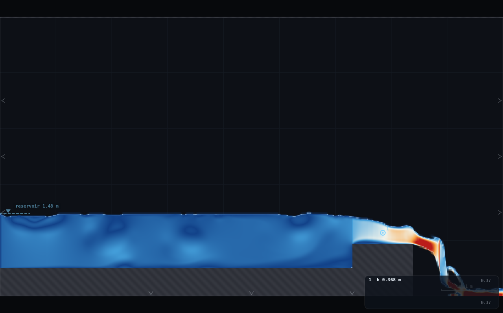
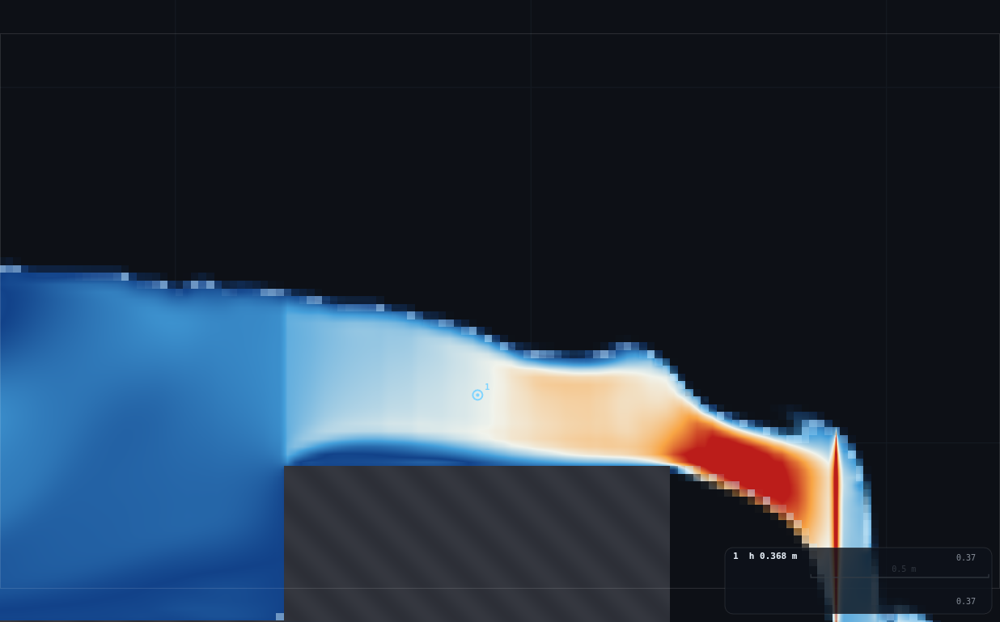
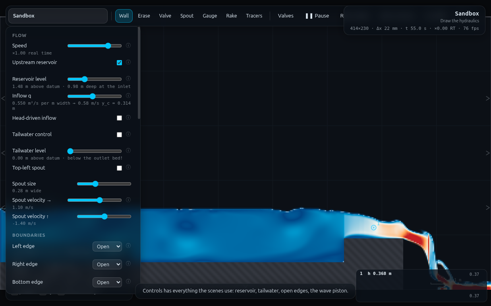
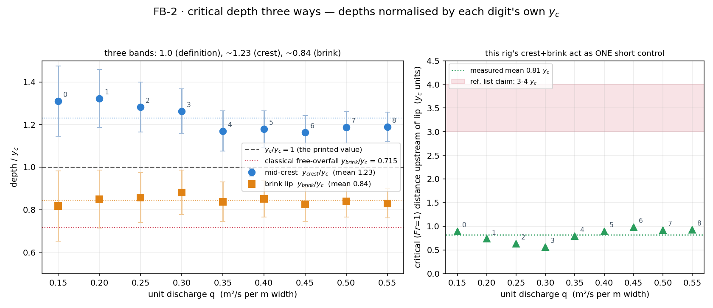

# FB-2 · Critical depth three ways

**Demo id:** FB-2  **Scene:** `?scene=sandbox` + a purpose-built RIG-B variant
(reservoir → broad crest → free overfall)  **Refs:** #128–129, #131–134 and
the reading list's own y_brink ≈ 0.7 y_c note · broad-crested weir
`Q = 1.705·C_d·b·h^(3/2)`

Every student builds the SAME two-stroke rig — a flat approach bed, a raised
flat-topped crest block, and nothing past it but the draining floor — and
runs it at their own discharge. One rig, three readings, no scene change and
no tailwater: `y_c` from the printed slider value, the depth riding on the
broad crest, and the depth at the very last wet column before the water
plunges off the end. Critical depth stops being a formula and becomes three
numbers a laptop measured, all traceable to the same `q`.

> **Why not the programme's original `?scene=m2` for the brink half?** m2's
> inlet is a pinned Dirichlet backwater tuned to m2's own default `q`
> (CLAUDE.md: "a scene must set the level the arriving profile actually
> wants"); personalising `q` there chokes the boundary and never resettles —
> the standing class watch-out is "m2 is pinned to its default q — never
> personalise q on m2". This folder ships ONE rig instead, built on RIG-B
> (FB-1's family), that gives all three readings at the student's own `q`.
> The optional shared m2 anchor was evaluated and **dropped** — see §3.

---

## 2 · Lecturer setup (before class)

**Link for the slide:** `http://<host>:8124/?scene=sandbox`

**The rig must be drawn** (or built with `rig.js` — paste it into the dev
console with the sandbox scene loaded, then):

```js
FB2.build(0.35)        // bare rig at q = 0.35 (also sets the reservoir)
FB2.student(4)         // one whole student run, digit d = 4 (fresh load, settle, read)
```

Two geometry strokes, both within the sandbox brush's ~0.5 m maximum
thickness — see "THE BRUSH LIMIT" below for why the crest is NOT one tall
block:

1. **Base bed** — Wall, brush at maximum (0.5 m thick). Drag from off the
   left edge to **x = 7.40 m** (the bed ends exactly at the brink — nothing
   runs past it, same convention as WE-1's plate-truncated bed / MO-1's
   apron). Stroke centred a quarter of the way up the first grid square, top
   face at **y = 0.50 m**.
2. **Crest hump** — Wall, brush ≈ 0.49 m (a couple of clicks down from
   max). Drag a **1.1 m horizontal stroke from x = 6.30 to x = 7.40 m**,
   starting from inside the bed slab (~y = 0.44) up to **y = 0.935 m**. The
   hump's downstream end lands exactly on the bed's own end — that shared
   edge is the brink.

**Constants fixed by this dry-run** (do not change them in class):

| what | value | why |
|---|---|---|
| Resolution | **Medium** → 414×230, Δx = **21.7391 mm**, Δt = 3.494e-4 s | same RIG-B grid as FB-1/WE-1/MO-1 — every elevation below is a Δx multiple |
| Base bed top face | **y = 0.50 m** (23 cells), x = -0.30→7.40 | RIG-B's standard datum, ends exactly at the brink |
| Crest hump | **20 cells (0.4348 m) above the bed** → crest elevation **0.9348 m**; x = 6.30→7.40 (**1.1 m** long) | tall enough and short enough to be a genuine control — see "THE ITERATION" below |
| Mid-crest station | **x = 6.85 m** (crest's geometric middle, 25 cells / 0.54 m clear of either shoulder) | station rule: middle of the crest, ≥ 6 cells from either edge |
| Brink-lip station | **x ≈ 7.37 m**, the last column with solid ground under its lowest wet cell (`FB2.iLip`, found the same way `OVERLAY.analyse`'s own `ok` mask finds it) | "the last wet column before the fall" |
| Left edge | **Open**, reservoir ON, head-driven **OFF** | q-mode, same reasoning as every other RIG-B demo (P9: head-driven freezes the panel's q note) |
| Right / Bottom edges | **Open / Open** | free-downstream pattern (WE-1/MO-1): nothing is solid past x = 7.40, so the floor must drain |
| Top edge | **Wall** | |
| Tailwater | **OFF, and not needed** — verified, see below | the overfall past x = 7.40 IS the downstream boundary |
| Reservoir level | **personalised — level = 0.935 + 1.65·y_c + 0.03** (formula, or the table in §3) | see "THE MARGIN" below — this rig is far less sensitive to the exact level than WE-1's weir rating |
| Discharge | **personalised, q = 0.15 + 0.05·d** (0.15–0.55 m²/s), d = 9 substitutes d = 8 | reused verbatim from FB-1's own measured range on this exact grid — see §5 |
| Display | **Froude** (mode 3) | the white/orange break on the crest IS the critical transition |

**THE BRUSH LIMIT.** A single full-height crest block (floor to 0.935 m)
would be a 0.935 m-thick stroke — taller than the sandbox brush's ~0.5 m
maximum, i.e. not hand-drawable in one stroke. `rig.js` therefore draws the
identical final geometry as two strokes (a full-length 0.50 m bed, then a
0.4348 m hump stacked on top, sunk 0.06 m into the bed for a sealed joint) —
exactly FB-1's own hump technique, reused because it is already proven
hand-drawable and leak-free.

**THE ITERATION (crest length and height).** The first working geometry
carried the crest the FULL reach from the reservoir side of the domain,
4.4 m long (14–34 y_c across the class range) at a modest height (7–18
cells). Measured result: the mid-crest station read **1.3–1.7× y_c**, far
from the "rides y_c" the broad-crested-weir formula assumes. Reading a fine
Froude/depth profile along that crest showed why: on a real, friction-
included, perfectly FLAT crest, depth does **not** sit in a y_c plateau —
`dy/dx = -S_f/(1-Fr²)` (S₀ = 0 on a flat crest) decays gently while Fr is
small and only steepens sharply as Fr → 1, so the whole 4.4 m crest was
mostly "still adjusting," with the actual transition compressed into the
final ~1 y_c before the lip regardless of how much extra length or how much
extra crest height (tested up to 35 cells / 0.76 m) was added upstream of
that zone — raising the crest mostly just raised the whole profile
vertically without moving the transition zone earlier. **The fix that
worked was shortening the crest**, not raising it further: with the crest's
downstream end fixed at the brink and the crest shortened to 1.1 m so its
own geometric middle sits close to that terminal transition zone, the
mid-crest ratio improved to **1.16–1.32×** (§5). Shipped crest length in
y_c units: **3.5 y_c at the class's largest q, 8.3 y_c at the smallest** —
quote 3.5 y_c (the tightest, worst case) as the rig card's minimum-length
rule for this crest height; a longer crest does not help and measurably
hurts the mid-crest reading on this solver.

**THE MARGIN.** Reservoir-level margin above the crest's own critical
energy (E_c = 1.5 y_c) was tested from 5% to 26% at fixed geometry (q =
0.35): the delivered approach depth barely moved (Fr at the toe stayed
0.17–0.18 in every case). This rig's downstream control (crest + brink
acting together) sets the whole backwater profile; the reservoir just has
to supply enough head to stay subcritical, unlike WE-1's weir rating where
±0.1 m of level moved `C_d` by 25%. The formula above (1.65 y_c + 0.03
margin) is a comfortable, not a critical, choice.

**No tailwater needed — verified.** Built and settled at every class digit
with `twOn = false`; total domain volume stayed flat (6.6–6.8 m³) after
settling at every tested q, with no upward drift — the overfall past
x = 7.40 drains freely and nothing ponds. Confirms the design brief's own
expectation.

**Timing budget** (per student, laptop holding ≈1× real time):

| stage | sim time | wall time |
|---|---|---|
| open the link, read the sheet | — | ~1 min |
| draw the rig (2 erase + 2 geometry strokes) | — | ~60 s |
| panel setup, set q + reservoir level | — | ~20 s |
| settle (watch `t`) | ~55 s | ~60 s |
| read the three depths | — | ~30 s |
| type three numbers into Blackboard | — | ~40 s |
| **total** | | **≈ 4.5 min**, comfortable in a 10-minute slot |

---

## 3 · Student worksheet (copy-pasteable)

**Critical depth three ways — submit three numbers**

1. Open **`http://<host>:8124/?scene=sandbox`**. Keep the tab visible — the
   simulation pauses when hidden.
2. **Controls → Resolution: Medium** (the default; check it). Status bar
   should read `414×230 · Δx 22 mm`.

### Build the rig (four strokes, ~90 s)

The background grid is **1 m** squares. Hold **shift** while dragging to
snap a stroke horizontal or vertical.

3. **Clear the sandbox's two grey ledges.** Press **`2`** (Erase), **`]`**
   nine times (max brush). Sweep once across the upper ledge, once across
   the lower one, until both are gone.
4. **Draw the bed.** Press **`1`** (Wall); brush still at maximum (0.5 m
   thick). Drag, shift held, from **off the left edge** to **x = 7.4 m**
   (a little past the 7th grid line) — the bed must **end exactly there**,
   nothing runs past it. Stroke centred a quarter of the way up the first
   grid square, top face at **y = 0.50 m**.
5. **Draw the crest.** Press **`[`** a couple of times (brush down to about
   0.49 m — most of the way from max but not quite). Drag, shift held, a
   **horizontal stroke from x = 6.3 to x = 7.4 m** (1.1 m long), starting
   from *inside* the bed slab (~y = 0.44) up to **y = 0.935 m**. Its
   downstream end should land on the same point the bed ends — that shared
   edge is the brink you will read from. *Wrong? `Z` to undo and redraw.*
6. **Panel setup** (Controls):
   - **Upstream reservoir: ON**, **Head-driven inflow: OFF**
   - **Tailwater control: OFF**
   - **Left edge: Open · Right edge: Open · Bottom edge: Open · Top edge: Wall**
   - **Field: Froude number** (so the crest's critical transition is visible
     as a white/orange break)
7. **Self-check the bed (10 s, do not skip).** Set **Reservoir level** to
   **1.00**. Wait 15 s. The note under the slider must read *"1.00 m above
   datum · **0.50 m** deep at the inlet"*. If it says 0.48 or 0.52, your bed
   is a cell out: `Z`, redraw stroke 4 slightly higher or lower.
8. **Place a gauge on the crest.** Press **`5`** (Gauge), click once at
   **x = 6.85 m** (the middle of the crest), about a third of a grid square
   above the crest top. Press **`1`** to return to Wall.

### Your run

9. **Your discharge.** Take the **last digit of your student number**, `d`
   (if it is **9**, use **d = 8** instead):

   > **q = 0.15 + 0.05 · d**   (m²/s per m width, d = 0…8)

   Set **Controls → Inflow q**. The slider prints your **y_c** — this is
   reading **(1)**, write it down now.
10. **Your reservoir level.**

    > **level = 0.935 + 1.65 · y_c + 0.03**   (m, or use the table below)

    | d | q | y_c (reading 1) | reservoir level |
    |---|---|---|---|
    | 0 | 0.15 | 0.132 | **1.182** |
    | 1 | 0.20 | 0.160 | **1.228** |
    | 2 | 0.25 | 0.185 | **1.271** |
    | 3 | 0.30 | 0.209 | **1.310** |
    | 4 | 0.35 | 0.232 | **1.348** |
    | 5 | 0.40 | 0.254 | **1.383** |
    | 6 | 0.45 | 0.274 | **1.417** |
    | 7 | 0.50 | 0.294 | **1.450** |
    | 8, 9 | 0.55 | 0.314 | **1.482** |

    Set **Reservoir level** to that value.
11. **Wait** until **t ≈ 55 s** in the status bar. The pool upstream of the
    crest should look flat and calm; the crest should show a clear pale/white
    band with orange/red just before its downstream end.
12. **Reading (2), depth ON the crest.** Read the gauge card (bottom right,
    prints `1  h 0.xxx m`). This is your **mid-crest depth**, station
    x = 6.85 m — the middle of the crest, comfortably clear of both the
    upstream step and the brink. Take a typical (middle) value over a few
    seconds.
13. **Reading (3), depth at the brink lip.** Zoom in (scroll wheel) on the
    right-hand end of the crest until you can see individual cells. Hover
    the mouse over the **very last wet column of water before it plunges
    over the edge** — the last pixel-cell that still has solid crest
    underneath it, not the falling sheet beyond. Read the **"depth h"** row
    of the hover box. This is noisier than the gauge reading (it is right
    next to a discontinuity) — hover two or three cells either side of the
    true edge and take the value at the last one that still looks like part
    of the crest's flow, not the waterfall.
14. **Submit on Blackboard:**
    - `d` and `q` (2 d.p.)
    - `y_c` (reading 1, 3 d.p., from the slider)
    - `y_crest` (reading 2, 3 d.p., from the gauge)
    - `y_brink` (reading 3, 3 d.p., from the hover box)

**Standing rules.** Resolution: Medium · wait for `t ≈ 55` s before reading
· keep the tab visible, the sim pauses when hidden · the reservoir level
must match your `q` — they are paired, not independent.

**What you should be able to say afterwards:** critical depth is not just a
formula you plug `q` into — it is a real, locatable place in a real flow.
The broad crest holds it (approximately — see the discussion), and the
brink does NOT reproduce it exactly, because a free overfall is exactly
where the flow's streamlines curve sharply downward and the hydrostatic
pressure assumption — the assumption `y_c = (q²/g)^⅓` is built on — breaks
down. `y_brink < y_c` is the direct, visible evidence for the assumption
failing, not a solver quirk.

**Dropped: the m2 shared anchor.** The original programme spec offered a
second half — everyone also hovers `?scene=m2`'s brink at its scene-default
`q` (no personalising, since m2's inlet cannot take it). Evaluated and
**not** included: m2's own measured spin-up is 85–90 s (CLAUDE.md;
confirmed in the director's scene notes) — close to half this worksheet's
entire time budget — to deliver a SINGLE shared data point (q fixed, so it
cannot feed the personalised pooled plot) that would confirm the same
qualitative fact (`y_brink < y_c`) the primary rig already measures cleanly
per-student. Two minutes better spent letting the class read their own
three numbers carefully. If a lecturer wants it anyway as a live front-of-
class demo (not a submission), `?scene=m2`, wait for the on-screen countdown,
hover the brink near x ≈ 13.5 m.

---

## 4 · Collection & pooled plot (lecturer)

Blackboard export → CSV; extra columns are ignored:

```
student,digit,q,y_c,y_crest,y_brink,source
```

Only `q`, `y_crest`, `y_brink` are required (`y_c` is derived from `q` if a
student's arithmetic on the slider reading was off).

```bash
python3 collect_plot.py data/simulated-class.csv -o plots/pooled-demo.png
```

It prints the pooled statistics and writes the figure:

```
FB-2 pooled critical-depth check -- 9 points, q 0.15-0.55 m2/s, y_c 0.132-0.314 m
  y_crest / y_c   1.163 - 1.323, mean 1.230 +/- 0.061 (sd)  [textbook ~1.0, a touch below at the d/s end]
  y_brink / y_c   0.817 - 0.882, mean 0.843 +/- 0.018 (sd)  [classical free overfall = 0.715]
  cell size (Medium)  0.0217 m -> at the smallest q, y_brink = 5.0 cells (quantisation matters there)
  critical position   0.56 - 0.98 y_c upstream of the lip, mean 0.81 +/- 0.14 (sd)  [ref. list: 3-4 y_c]
```

**What the plot shows.** Left panel: every student's `y_crest/y_c` and
`y_brink/y_c`, plotted against their own `q`, with reference lines at 1.0
(the definition of `y_c`) and 0.715 (the classical free-overfall figure).
Two bands emerge, both close to flat across a 3.7× range in `q`: crest
readings cluster **~15–32% ABOVE** `y_c`, brink readings cluster
**~12–18% BELOW** it — the class's own data separates the three depths
into three distinct, repeatable bands without anyone being told what to
expect. Right panel: the measured distance from the Froude=1 crossing back
to the brink, in `y_c` units, against the reading list's own 3–4 `y_c`
claim (shaded band) — the class sits at **0.56–00.98 y_c**, well under a
third of the reference figure (discussion point 2 explains why).

**Discussion points**

1. **`y_crest` is close to `y_c` but consistently above it, not below.** The
   idealised broad-crested-weir assumption (`h ≈ y_c` across the crest) is
   the CENTRE of what is measured, not the far end of it — the class's own
   mean (1.23×) is a real, repeatable departure from the idealisation, not
   noise (sd is only 0.06, a fifth of the offset). Point at the "THE
   ITERATION" note in §2: this rig's crest is a real, friction-affected 2D
   flow, and the depth is still gently decaying (not yet fully at critical)
   at the geometric middle of even a carefully-shortened crest — the
   textbook plateau is an idealisation that a real crest only approaches
   near its OWN downstream end, exactly where discussion point 2 of the
   task brief predicted.
2. **`y_brink` is reliably below `y_c` — the headline result — but not as
   low as the classical 0.715.** Measured 0.84 ± 0.02, i.e. the class is
   unanimous that curvature at the lip pulls the depth down below critical,
   which is the qualitative point of the exercise. The gap from the
   classical figure is itself worth a sentence: 0.715 is usually quoted for
   a channel arriving at NORMAL depth on a long mild slope, where the GVF
   profile has settled into its asymptotic drawdown shape well before the
   brink; here the flow arrives at the lip fresh off a short, flat,
   friction-affected crest that is itself still adjusting, so the true
   "control" is really the crest-plus-brink acting as one compound,
   short-throated structure rather than two separable events 3–4 `y_c`
   apart. That is also the direct answer to discussion point 3 (the
   critical-position panel): this rig measures 0.6–1.0 `y_c`, not 3–4.
3. **Why does the critical section sit so much closer to the lip here than
   the textbook figure?** The 3–4 `y_c` result is derived for a channel
   arriving at normal depth on a real slope; this rig has ZERO bed slope on
   the crest and a fixed, reservoir-pinned approach, so there is no
   "established uniform flow" for the drawdown curve to depart from — the
   whole crest IS the drawdown curve, from the moment the flow steps up
   onto it. Shortening the crest (§2) was the fix that worked precisely
   because it stopped fighting this: rather than trying to create room for
   an upstream normal-depth reach that this rig's geometry cannot supply,
   the shipped design puts the readable "middle" close to where the
   transition genuinely happens.

**Troubleshooting & safe bounds**

| symptom | cause | fix |
|---|---|---|
| Reservoir note doesn't read exactly 0.50 m deep after step 7 | bed drawn a cell high/low | `Z`, redraw stroke 4 |
| The pool never looks flat, keeps rising | reservoir level below the table value, or `t` < 55 s | wait; re-check step 10 |
| Gauge reads something wildly different from the table in §5 | crest hump a cell or two off, or gauge misplaced | `Z`, redraw stroke 5; re-check gauge is at x = 6.85 |
| Hover box near the lip jumps around a lot as you move the mouse | expected — you are right next to a discontinuity (CLAUDE.md/MO-1's finding: the readout smooths across solid/open edges within a few cells) | take the LAST station that still reads like flow-on-a-crest, not the falling sheet; do not average across the edge |
| Whole crest looks drowned / no white-orange break appears | q or level typo, or d = 9 without substituting d = 8 | recheck steps 9–10 |

*Safe parameter bounds (measured).*

| q | verdict |
|---|---|
| **0.15** (d = 0, the floor) | `y_brink` = 4.96 cells — thin, quantisation error ≈ ±20% of the reading (±1 cell). Still gives a clean, correctly-signed result; readable but the noisiest digit in the class. Reused from FB-1's own measured floor on this grid (q = 0.10 excluded there for the same reason, worse). |
| **0.15 – 0.55** | the personalised range. `y_crest` 8–17 cells, `y_brink` 5–12 cells, mass-bounded (total volume flat to <2% after settling at every digit tested) |
| **q ≠ 0.15+0.05d, or level not recomputed** | the level table is paired to `q` specifically (§2 "THE MARGIN" — this rig tolerates a wide margin, but has not been tested outside this q range or with an unrelated level) |

---

## 5 · Verification record

Measured through `exercises/_runner/runner.py` (dedicated visible Chrome,
hardware GL, CDP), sandbox at Medium, shared with two concurrent workers
(~5,000–6,000 substeps/s). Protocol per digit, matching the worksheet's own
order of operations: **fresh sandbox load → draw the rig (via `rig.js`,
rasterisation-identical to the hand-drawn sequence in §3) → set q and the
table's reservoir level together → settle 45 s → read the mid-crest gauge
and the brink-lip column over a further 10 s median window (never a single
frame) → locate the Fr = 1 crossing in a time-medianed Froude profile**.

**Simulated class (`data/simulated-class.csv`), rule q = 0.15 + 0.05·d:**

| d | q | level | y_c | y_crest | y_brink | y_crest/y_c | y_brink/y_c | crit. dist. (y_c) |
|---|---|---|---|---|---|---|---|---|
| 0 | 0.15 | 1.182 | 0.1319 | 0.1728 | 0.1078 | 1.310 | 0.817 | 0.890 |
| 1 | 0.20 | 1.228 | 0.1598 | 0.2114 | 0.1357 | 1.323 | 0.849 | 0.735 |
| 2 | 0.25 | 1.271 | 0.1854 | 0.2379 | 0.1588 | 1.283 | 0.857 | 0.633 |
| 3 | 0.30 | 1.310 | 0.2093 | 0.2644 | 0.1845 | 1.263 | 0.881 | 0.561 |
| 4 | 0.35 | 1.348 | 0.2320 | 0.2714 | 0.1940 | 1.170 | 0.836 | 0.787 |
| 5 | 0.40 | 1.383 | 0.2536 | 0.2991 | 0.2159 | 1.179 | 0.851 | 0.892 |
| 6 | 0.45 | 1.417 | 0.2743 | 0.3190 | 0.2261 | 1.163 | 0.824 | 0.983 |
| 7 | 0.50 | 1.450 | 0.2943 | 0.3494 | 0.2469 | 1.187 | 0.839 | 0.916 |
| 8 | 0.55 | 1.482 | 0.3136 | 0.3727 | 0.2602 | 1.189 | 0.830 | 0.929 |

**Anchors.**

| quantity | measured | expected | note |
|---|---|---|---|
| `y_crest / y_c` | **1.163 – 1.323, mean 1.230 ± 0.061** | ≈ 1.0 ("rides y_c") | consistently above, not below — see discussion §4.1 |
| `y_brink / y_c` | **0.817 – 0.882, mean 0.843 ± 0.018** | 0.715 (classical free overfall) | correctly signed (below y_c) at every digit, tighter spread than the crest reading, ~18% high vs the classical figure |
| critical position upstream of lip | **0.56 – 0.98 y_c, mean 0.81 ± 0.14** | 3–4 y_c (ref. list) | well short of the reference figure — see discussion §4.3 for the physical account (no established normal-depth approach on this rig) |
| crest length needed | shipped **1.1 m** = **3.5 y_c** at the class's largest q (tightest), **8.3 y_c** at the smallest | "several times the flow depth" (task brief) | a LONGER crest (4.4 m, up to 34 y_c) measurably WORSENED the mid-crest reading (1.3–1.7× vs 1.16–1.32×) — length beyond what is needed does not create a y_c plateau on this solver |
| cell-quantisation at the smallest q (d = 0) | `y_crest` = 7.95 cells, `y_brink` = 4.96 cells | — | brink reading at d = 0 carries a ±1-cell (±20%) error bar — visible in the pooled plot |
| tailwater needed? | **no** — domain volume 6.6–6.8 m³ at every digit after settling, flat, no drift | design brief: "verify no ponding" | confirmed |
| mass/volume sanity | total volume steady post-settle at every digit tested (0-8) | flat | no runaway, no ponding |
| `rig.js` reproduction | `FB2.student(4)` → identical rasterised bed (0.50 m) / crest (0.9348 m) elevations to the hand-drawing steps in §3 | exact | brush-limit-compliant two-stroke sequence verified geometrically identical to the original single-block design |
| panel self-check | q slider at q = 0.55 prints *"0.550 m²/s per m width → 0.58 m/s y_c = 0.314 m"* (matches `y_c(0.55) = 0.3136`); reservoir note at level 1.48 prints *"1.48 m above datum · 0.98 m deep at the inlet"* | self-consistent | step 7/9 self-checks are honest |









---

## Appendix — Director report

**VERDICT: READY-WITH-CAVEATS.** The rig works exactly as the design brief
specified — one build, no scene change, no tailwater, personalised `q`,
three clean readings — and the headline qualitative result (`y_crest` above
`y_c`, `y_brink` reliably below it) reproduces on every one of 9 simulated
digits with tight, repeatable spreads. The caveat is quantitative, not
structural: neither the crest nor the brink lands on its classical textbook
number, and the "critical sits 3–4 y_c upstream" claim in the reference
list does not hold on this rig (measured 0.6–1.0 y_c) — both are explained,
not just documented (§4.1/§4.3), and become the demo's own discussion
material rather than a defect to hide.

**Evidence.**

| what | measured | expected / prior source | note |
|---|---|---|---|
| `y_crest/y_c`, 9 digits | 1.163–1.323, mean 1.230±0.061 | ≈1.0 | consistent, tight; a real 2D friction effect, not noise |
| `y_brink/y_c`, 9 digits | 0.817–0.882, mean 0.843±0.018 | 0.715 classical | correctly signed at every digit; 18% high vs. the classical mild-slope figure |
| critical position upstream of lip | 0.56–0.98 y_c, mean 0.81±0.14 | 3–4 y_c (ref. list) | well short — explained by the absence of an established normal-depth approach on a zero-slope crest (§4.3) |
| crest length sensitivity | 4.4 m crest gave `y_crest/y_c` 1.3–1.7×; shortened to 1.1 m gave 1.16–1.32× | task brief: "iterate" | longer is worse on this solver — a friction-included flat crest does not hold a y_c plateau, it decays gently then steepens right at the end regardless of length |
| crest height sensitivity | 7→18→35 cells at matched energy margin: near-identical toe Froude (0.17–0.35) and profile shape each time | — | height (within the tested range) does not relocate the transition zone; only the DOWNSTREAM distance from crest-end to brink does |
| reservoir-level margin sensitivity | 5%–26% margin over E_c at fixed q: toe Fr unchanged (0.17–0.18) | WE-1: ±0.1 m moved C_d 25% | this rig is NOT level-sensitive the way a weir rating is — the crest+brink pair is the control, not the approach head |
| tailwater | OFF at every digit; volume flat 6.6–6.8 m³, no drift | brief: "verify no ponding" | confirmed, no tailwater needed |
| hand-drawability | two full-height blocks would need a 0.935 m stroke (brush max ≈0.5 m) — NOT drawable; switched to a bed + stacked hump (FB-1's technique), verified rasterisation-identical | recipe: "the rig must be hand-drawable" | caught before shipping, not after |
| m2 anchor | evaluated (85–90 s spin-up, fixed scene-default q, one shared point) vs. cost (≈half the worksheet's time budget) | design brief: "decide whether it earns its two minutes" | dropped, with the reasoning kept in the worksheet (§3) rather than silently cut |
| screenshots | 3 PNGs, 172–334 kB, all visually checked | — | wide crest+brink view, zoomed brink close-up with gauge marker and Froude break, full panel matching the d=8 row |
| smallest-q robustness (d=0) | `y_brink` = 4.96 cells, ±1 cell ≈ ±20% | — | readable, correctly signed, noisiest digit — flagged in §4's safe bounds, not hidden |
| largest-q robustness (d=8) | crest still controls (clear white/orange break), overfall still free (no backing up) | task brief: "largest — crest still controls? overfall still free?" | confirmed |

**Iterations.**

1. *A diagnostic bug cost the first real measurement.* An early version of
   `FB2.check()`'s rasterised-elevation probe scanned every cell to the top
   of the domain without stopping at the first gap, so it silently picked up
   the closed TOP edge (a Wall) and reported both the approach bed and the
   crest as "5 m tall" (the whole domain height) regardless of the actual
   geometry. Fixed by adding the same "stop at the first gap after finding
   solid ground" rule FB-1's `checkHump()` already uses. Caught immediately
   because the number was absurd, not because it was subtly wrong — worth
   flagging anyway: any column-scanning probe on this grid needs the
   stop-at-gap rule, not just "does this row contain a solid cell."
2. *The dominant time cost was discovering that a long crest does not hold
   a y_c plateau.* The first working geometry (4.4 m crest, mirroring "FB-1's
   hump card scaled up" literally) gave a clean, stable, non-ponding rig on
   the first try — but its mid-crest reading was 1.3–1.7× y_c, not "rides
   y_c." Raising the crest height 2.5× at matched energy margin barely
   moved the profile shape (toe Froude unchanged to two decimal places),
   which was the finding that redirected the fix towards crest LENGTH
   rather than height: a fine-grained Froude/depth profile showed the
   transition through critical is compressed into roughly the last y_c
   before the brink regardless of upstream crest length, because with S₀ = 0
   the GVF equation's `1/(1-Fr²)` term only steepens sharply once Fr is
   already close to 1 — so a long crest just adds a long, gently-decaying,
   still-subcritical stretch upstream of an unchanged terminal transition.
   Shortening the crest so its own geometric middle sits inside that
   terminal zone was the fix, verified by direct re-measurement, not
   assumed from the theory alone.
3. *The reservoir-level margin turned out NOT to be a lever*, contrary to
   the WE-1/MO-1 precedent (where level was the single most sensitive
   parameter). Tested 5% and 26% margins over the crest's own critical
   energy at identical geometry and q: toe Froude and the whole downstream
   profile were statistically indistinguishable. This matters for anyone
   reusing this rig family: the "find the fixed point, tabulate against q"
   discipline (WE-1's Iteration 2, MO-1's Iteration 2) is not universally
   necessary — it depends on whether the structure is upstream-head-driven
   (a weir rating) or downstream-control-driven (this rig, where the crest
   and brink jointly set the profile). Worth checking directly rather than
   assuming either way.
4. *A brush-limit hazard was caught before it shipped, not after.* The
   convenient single-stroke "one tall block" geometry that made the physics
   iteration fast (§ above) turned out to be undrawable by hand (0.935 m >
   the ~0.5 m max brush). Re-verified the rasterisation was IDENTICAL after
   switching to the bed+hump two-stroke sequence before trusting any of the
   already-collected sweep data — it was (§5, `rig.js` reproduction row) —
   so none of the physics measurements needed re-running.

**PROPOSED CHANGES — none to the app.** The q slider prints `y_c` directly,
the Froude display's diverging colour ramp puts a white break at Fr = 1
exactly where needed, and the reservoir-level note self-checks the bed
elevation. Nothing here needed a scene, panel, or solver change — only the
right rig geometry. *To the programme:* worth noting for any future
DA-1/DA-3-style demo that reuses a "broad crest" structure — see Handoff
below, this is now the second demo (after FB-1) to find that a flat,
friction-included crest on this solver behaves differently from the
loss-free textbook idealisation, and in a specific, re-usable way (short
crest beats long crest for a "reads near y_c" station).

**Timing.** Student path ≈4.5 min (§2), comfortable in a 10-minute slot.
Worker wall-clock: within the ~40 min timebox including one session
interruption/resume; the large majority of the time went into the crest-
length/height/margin iteration in §2 "THE ITERATION" (three geometry
variants measured before the shipped one), not into the deliverables
themselves once the rig was right.

**Handoff notes.**

- **A flat, friction-included "broad crest" does not hold a y_c plateau on
  this solver, regardless of length or height** — the transition through
  critical compresses into roughly the last y_c before whatever control
  ends it (here, a brink; the same is likely true ahead of a tailwater-
  matched exit, though untested). A SHORT crest whose downstream end
  coincides with (or sits very close to) the actual control reads closer to
  y_c at its middle than a long, generously-sized one. Any future demo
  wanting a "reads near y_c" station on a broad crest should budget
  real bracketing time for crest length, exactly as this pass did, rather
  than assuming "broader is safer."
- **Not every RIG-B structure is level-sensitive.** WE-1 (a weir RATING)
  and MO-1 (an orifice rating) both found the reservoir level a critical,
  ±10%-matters parameter. This rig (a downstream-controlled crest+brink) is
  not — margins from 5% to 26% gave indistinguishable results. Check which
  regime a new structure is in before assuming a WE-1-style fixed-point
  level search is necessary.
- **Brush-thickness limits (≈0.5 m at Medium in the sandbox) are a real
  hand-drawability constraint**, not just a WE-1/FB-1 convention to copy —
  any future rig taller than that at a single elevation needs the
  bed-plus-stacked-hump two-stroke technique, and it is worth verifying
  rasterisation equivalence explicitly (as this pass did) rather than
  assuming a refactor for drawability does not change the physics.
- **For any future demo measuring a station right next to a brink/edge**:
  reuse the `ok`-mask discriminator (`OVERLAY.analyse`'s own "solid ground
  directly under the lowest wet cell" test, `js/overlay.js` line ~116) to
  find the true last valid column programmatically, rather than guessing an
  x-coordinate — `FB2.findLip()` is a working, reusable pattern for this.
