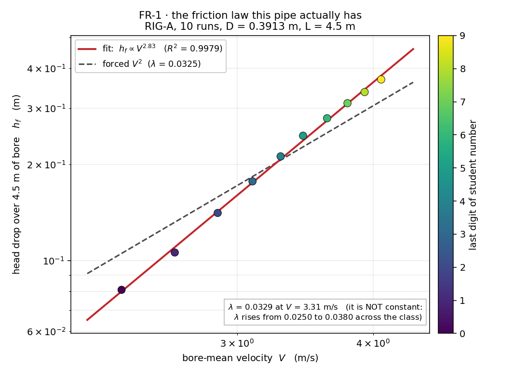

# FR-1 · The friction law without the Moody chart

Every student drives the *same* pipe at a *different* head, reads the velocity
and the head drop between two gauges, and submits them. Pooled on log–log axes
the class draws this pipe's own resistance law in one line — no chart, no
Reynolds number, no ε/D. The payoff has two halves. The first is that the
points fall on a straight line at all: head loss really is a power law in
velocity, and you can *measure* the power. The second is that the line this
pipe gives you is **not** the one the textbook promises — the exponent comes
out near 2.8, not 2, and λ is not a constant but climbs across the class. That
is the honest half of the hour: you calibrate a network because the resistance
of a real conduit is a property of *that conduit*, not of a formula.

**Open it:** press **E** in the [app](https://barneydobson.github.io/hydraulician/)
and pick **FR-1**, or use the direct link
[`?ex=FR-1`](https://barneydobson.github.io/hydraulician/?ex=FR-1).
How to run any exercise: see the [teaching pack index](../INDEX.md#running-an-exercise).

## Theory

Head loss along a pipe running full, and the friction slope it draws on the
hydraulic grade line:

    h_f = λ·(L/D)·V²/2g          S_f = h_f/L

Two gauges **L = 4.5 m** apart give h_f = H₁ − H₂ directly, and the readout's
**V** is already the bore-mean velocity, so a class-wide fit of log h_f
against log V measures the exponent instead of assuming it. The bore is
**D = 0.3913 m** (the nominal 0.40 m rasterises to 18 cells at Medium), and
the pipe discharges into a tank held at **2.50 m** — without that downstream
control the bore does not stay pressurised.

## Your reservoir level

**d** is the **last digit of your student number** — your lecturer will
explain the assignment in class.

> **level = 3.30 + 0.13·d   metres**

(d = 0 → 3.30, d = 5 → 3.95, d = 9 → 4.47.) Set it to the nearest 0.005 m.

## What to do

1. Raise **Reservoir level** to your own value — the bench idles with the
   reservoir level equal to the tailwater, so nothing flows until you do.
2. Drop two gauges — Gauge (`5`) — at **x = 4.0 m** and **x = 8.5 m**, both at
   **y = 2.20 m**, mid-height in the bore.
3. Press `R` and let it reach steady state — about **22 s**; the card counts
   it down.
4. Read **H₁** and **H₂** as the value each gauge trace is *centred* on (not
   the wobbling header number), hover mid-pipe for **V**, and submit
   **level, H1, H2, V**.

## For the instructor — pooling the class

Collect one row per student (`student,digit,level_m,H1_m,H2_m,V_ms`), export
the CSV and run:

```bash
python3 collect_plot.py class.csv                # -> plots/pooled-demo.png
python3 collect_plot.py data/simulated-class.csv # the shipped dry-run class
```

The script takes h_f = H₁ − H₂, fits log₁₀ h_f against log₁₀ V, and plots the
class on log–log axes with the fitted power law and the forced-V² line
through it, printing λ both ways (free fit at the class-mean V, and with the
exponent forced to 2).



### Discussion points

- **What the friction slope looks like.** Field is already on Pressure head:
  the HGL is *visibly* a straight fall along the bore, and S_f = h_f/L is the
  gradient of that fall. Hover along the pipe at a fixed height: `head p/ρg`
  drops linearly — that picture is what the equation is about.
- **Why the exponent is steeper than 2.** The wall stress here comes from a
  sub-grid eddy viscosity that itself strengthens as the flow speeds up, so λ
  climbs with V rather than sitting still. A real rough pipe does the opposite
  (λ *falls* with Re, then flattens). Same lesson, opposite sign: the exponent
  belongs to the conduit, not to the algebra — which is exactly why the Moody
  chart is a chart of measurements and not a formula.

The full verification record — why the pipe needs a tailwater and where that
level has to land, why C_s and not C_f is the roughness knob, why the gauges
sit 4.5 m and not 6 m apart, the measured ten-level ladder, safe bounds and
troubleshooting — is kept locally, out of version control, at
`exercises/FR-1-friction-law/_archive/README-full.md`.
