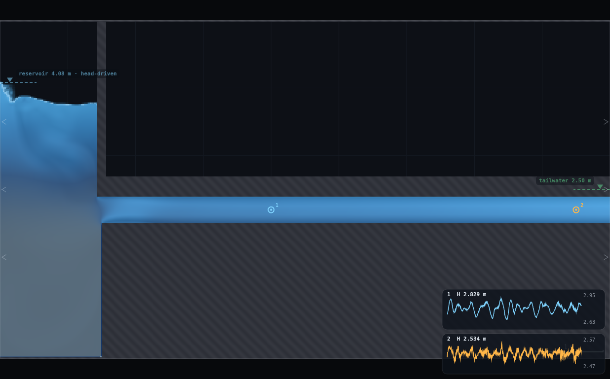
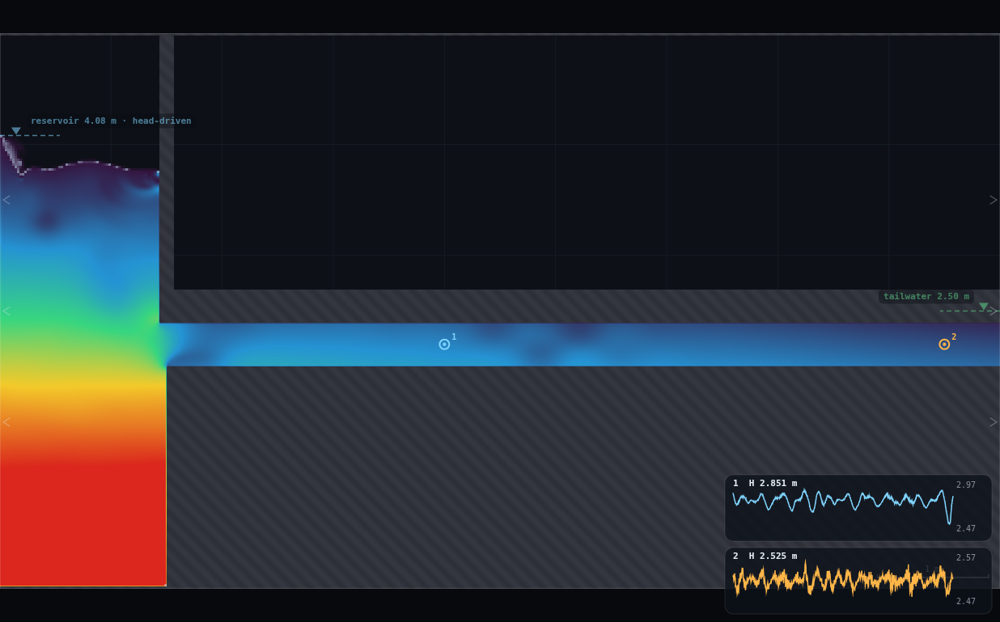
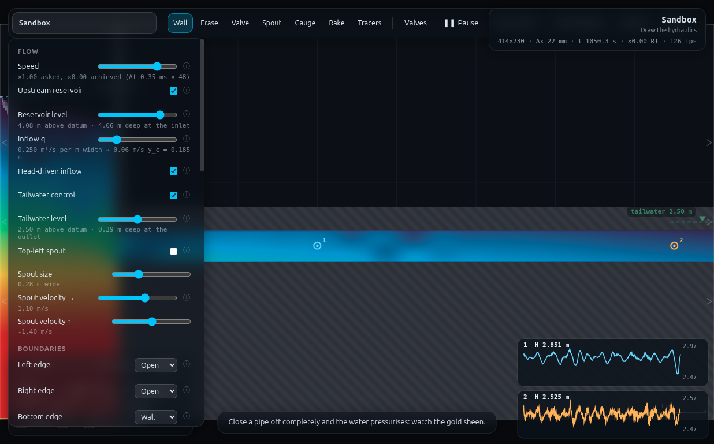

# FR-1 · The friction law without the Moody chart — full record (archived)

*This is the original long-form brief: the dry-run measurements, the
verification record, the director report and every constant behind the rig.
It is kept for maintainers and future reruns — the student- and
instructor-facing document is now [`../README.md`](../README.md).*

**Refs** #18–19, #25, #40, D17–D18 · `h_f = λ(L/D)V²/2g`; `S_f` from the HGL
**Rig** RIG-A (this folder is also the rig's first build — see `rig.js`)
**Submit** three numbers · **Personalised** reservoir level from the student number

## How to start (30 seconds)

1. Open the app — **`http://localhost:8124/`** on the lecturer's server, or
   double-click `index.html`.
2. Press **`E`** (or click **`Exercises ▾`** in the top bar) and pick
   **FR-1**.
3. Type the last digit of your student number into the card. It prints **your
   reservoir level** — you set it, and you place the two gauges (x = 4.0 and
   8.5 m).
4. Let it settle after every change you make — the card gives this demo's
   settle time (22 s of sim time) and counts it down.
5. Do the task printed on the card, then submit **level**, **H₁**, **H₂** and
   **V**.

If your lecturer gives you a link: **`?ex=FR-1`** (e.g.
`http://localhost:8124/?ex=FR-1`).

The picker gives everyone the same starting point and no more: the scene,
**Resolution: Medium**, the rig geometry, and the few settings without which
the rig is not a working rig — the card labels those as already set. Your own
values, your instruments and the order you do things in are yours to get
right. If your build ships without the rig pack the card says so; then draw it
by hand from *Manual setup* below.

---

Every student drives the *same* pipe at a *different* head, reads the velocity
and the head drop between two gauges, and submits them. Pooled on log–log axes
the class draws the pipe's own resistance law in one line — no chart, no
Reynolds number, no ε/D. The payoff has two halves. The first is that the points
fall on a straight line at all (R² = 0.998 over 10 runs): head loss really is a
power law in velocity, and you can *measure* the power. The second is that the
line this pipe gives you is **not** the one the textbook promises — the exponent
is 2.8, not 2, and λ is not a constant but climbs from 0.025 to 0.038 across the
class. That is the honest half of the hour, and it is the origin story of D18:
you calibrate a network because the resistance of a real conduit is a property
of *that conduit*, not of a formula.

> ⚠ **Read §5 before you teach this.** The programme sheet promises a pooled
> slope of "2.0 ±". This rig delivers **2.83 ± 0.05**. The demo is sound, tight
> and reproducible; the *slide* has to say the right thing.

---

## 1 · What the student ends up looking at



A 0.40 m pipe, 7.5 m long, running full from a reservoir into a receiving tank,
with two gauges on the axis 4.5 m apart. Gauge 1 reads ≈ 2.83 m of piezometric
head, gauge 2 ≈ 2.53 m; the difference is h_f.

---

## 2 · Manual setup (fallback, or for building it yourself)

*The picker puts you at the same starting point as everyone else — scene,
Resolution Medium and the rig. This section is the record of every constant
behind that, and the build to follow if you are demonstrating it by hand or
the rig pack is missing.*

### Link

**`http://localhost:8124/`** — no `?scene=`. FR-1 is built in the **Sandbox**
(W = 9 m, H = 5 m). Everything else is drawn and dialled by hand.

### Constants fixed by the dry-run

| what | value | why this value (all measured, §5) |
|---|---|---|
| resolution | **Medium** | 414 × 230, Δx = **21.7 mm**, Δt = 3.49e−4 s |
| bore | **18 cells = 0.3913 m** | the nominal 0.40 m rasterises to 18 cells; use 0.3913 as D |
| invert top face | y = 2.00 m | slab solid from y = 0 — a thin one gives the reservoir a second path |
| soffit bottom face | y = 2.40 m | |
| **tailwater** | **ON, level 2.50 m** | *not in the programme's RIG-A card and not optional* — see §5 |
| eddy viscosity **C_s** | **0.40** (slider max) | the rig's roughness knob. `C_f` is inert here (§5) |
| bed roughness C_f | 0.02 (sandbox default) | leave it; 0.02 → 0.20 changes λ by nothing |
| celerity c | 22 m/s (sandbox default) | leave it; 80 made the traces noisier and the bore emptier |
| gauges | **x = 4.00 and x = 8.50, y = 2.20** | L = **4.5 m**, not 6 — see §5 |
| level rule | **3.30 + 0.13·d** m | d = last digit; V 2.35 → 4.07 m/s, h_f 81 → 369 mm |
| settle after a level change | **20 s** simulated | V flat to ±0.5 % from t = 10 s to t = 70 s |

### Building RIG-A by hand (≈ 90 s, six strokes)

Do it once on the projector; the class copies it. Zoom out first (`0` resets the
view — the whole 9 × 5 m box is on screen).

1. **Widen the brush** — hold `]` until the cursor circle stops growing (max
   0.5 m). Choose **Erase**, and clear the sandbox's two grey ledges with two
   fat horizontal strokes across the middle of the box, roughly
   `(0.6, 2.5) → (7.2, 2.5)` and `(0.6, 3.2) → (7.2, 3.2)`. They must be gone:
   the lower one slices straight through where the pipe will be.
2. **Wall** tool, still at max brush, **shift held** (snaps horizontal). Draw the
   **invert** as four stacked strokes from x = 1.5 to past the right edge, at
   y ≈ 1.75, 1.25, 0.75, 0.25. A 0.5 m brush covers ±0.25 m, so those four
   strokes tile 0 → 2.0 m exactly: the top face lands at **2.0 m** and the block
   reaches the floor. (It has to: a thin slab leaves a void the reservoir fills,
   and the flow simply runs underneath the pipe.)
3. **Narrow the brush: press `[` twice** (0.5 → 0.30 m, which covers ±0.15 m).
   Still Wall, still shift: the **soffit**, one stroke from x = 1.5 to past the
   right edge at **y ≈ 2.55** — its *bottom* face at 2.40 leaves the 0.40 m bore.
   *(At the max brush this stroke would reach down to 2.30 and give a 0.30 m
   bore — the single easiest mistake to make in this rig.)*
4. Still Wall at 0.30: the **reservoir wall**, one vertical stroke at
   **x = 1.5** from y = 2.4 up past the top of the box.
5. **Panel** (`Controls`): Upstream reservoir ✔, Head-driven inflow ✔,
   Tailwater control ✔, Tailwater level **2.50**, Top-left spout ✘,
   **Bottom edge = Wall**, Right edge = Open, Eddy viscosity **0.40**,
   Field = *Head*.
6. **Gauge** tool: one click at (4.0, 2.2), one at (8.5, 2.2) — mid-height in the
   pipe, near the left third and near the right end.

`rig.js` in this folder is what the picker applies, and the same thing as a
console paste
(`RIGA.build()`), and is what the numbers in §5 were taken from. It is the
canonical RIG-A card: LL-1, LL-2, PU-1, B7 and B10 should start from it.

**Self-check:** hover anywhere in the pipe. The readout's `h` must say
**0.39 m**. If it says 0.35 or 0.44 the soffit is a cell or two out — press `Z`
and redraw stroke 3. (Ignore the "H2 profile / y_c / y_n / n" block the readout
prints inside the pipe: it is a free-surface classifier being shown a
pressurised duct. Known display quirk, harmless.)

### Timing budget

| | |
|---|---|
| draw the rig + panel + gauges | ≈ 2 min (2.5 with a class asking questions) |
| cold spin-up | 10 simulated s — flow is at its final velocity by then |
| settle after setting your own level | 20 simulated s |
| watch the traces and read them | 15 simulated s |
| **one student run** | **45 simulated s ≈ 25–50 s of laptop time** |
| whole student path | **≈ 5 min**, comfortably inside the slot |

---

## 3 · Student worksheet (copy-paste to Blackboard)

> ### FR-1 · What is this pipe's friction law?
>
> You are given a 0.40 m pipe running full out of a reservoir. Your reservoir
> level depends on your student number, so everybody's pipe runs at a different
> speed. Between us we will measure the law that connects head loss to velocity —
> the thing the Moody chart is a picture of — without using the chart.
>
> **1. Open the exercise.** Press `E` and pick **FR-1** (or open `?ex=FR-1`)
> — it loads the sandbox at **Resolution: Medium** and draws the rig, so
> step 2 is only for building it by hand. Press `0` to fit the whole box on screen.
>
> **2. Build the pipe** (your lecturer will demo this; ~90 seconds):
> - Hold `]` until the brush stops growing. With **Erase**, wipe out the two grey
>   ledges in the middle of the box (two fat horizontal strokes).
> - With **Wall** + `shift` held (still max brush), draw four stacked horizontal
>   strokes from x = 1.5 out past the right-hand edge at heights ≈ 1.75, 1.25,
>   0.75, 0.25 m. This is the pipe floor; it must be solid all the way down to
>   the bottom of the box and its **top must be at 2.0 m**.
> - **Press `[` twice** to narrow the brush to 0.30 m, then one horizontal stroke
>   at **2.55 m** from x = 1.5 out past the right edge: the pipe roof. The gap
>   you have left is the 0.40 m bore. *(Do not draw the roof at the fat brush —
>   it would reach down to 2.30 and leave you a 0.30 m pipe.)*
> - One vertical stroke at **x = 1.5** from 2.4 m upwards: the reservoir wall.
>
> **3. Panel settings** — in `Controls`:
> `Upstream reservoir` ✔ · `Head-driven inflow` ✔ · `Tailwater control` ✔ ·
> `Tailwater level` **2.50** · `Top-left spout` ✘ · `Bottom edge` **Wall** ·
> `Eddy viscosity C_s` **0.40** · `Field` **Head**.
>
> **4. Your reservoir level.** Take **d = the last digit of your student
> number** and set `Reservoir level` to
>
> > **level = 3.30 + 0.13 × d   metres**
>
> (d = 0 → 3.30, d = 5 → 3.95, d = 9 → 4.47). Set it to the nearest 0.005.
>
> **5. Drop two gauges.** `Gauge` tool, one click at **x = 4.0**, one at
> **x = 8.5**, both at mid-pipe height (**y = 2.2**). They are **L = 4.5 m**
> apart. Two charts appear bottom-right, numbered 1 and 2.
>
> **6. Let it settle** for about 20 simulated seconds (watch `t` in the top-right
> status bar), then watch the two traces for another 15 s. **Keep the tab
> visible — the simulation pauses when it is hidden.**
>
> **7. Read three numbers.**
> - **H₁** — the head at gauge 1. The chart header prints the *instantaneous*
>   value and it wobbles; write down the value the trace is **centred on**, to
>   0.01 m. (The gauge axis limits are printed at the right of each chart, which
>   helps you judge the middle.)
> - **H₂** — the same for gauge 2. It is much steadier.
> - **V** — hover the mouse in the middle of the pipe and read the **`V`** line
>   of the readout: the *average* velocity across the bore. Do not use the
>   `speed` gauge or the arrow — a single point in the pipe swings ±40 %.
>   *(Ignore the "H2 profile" line the readout prints inside the pipe. It is a
>   free-surface label being applied to a pressurised pipe. Harmless.)*
>
> **8. Submit on Blackboard:** your `level`, `H1`, `H2`, `V`.
>
> Your own arithmetic for the discussion: **h_f = H₁ − H₂**, and
> **S_f = h_f / 4.5** is the slope of the hydraulic grade line — the thing the
> `Head` colour map is showing you fading along the pipe.
>
> ---
> *Standing rules: Resolution **Medium** (the picker sets this); wait out the spin-up; keep the tab
> visible; if you change anything else, change it back. Your digit is checked
> against your submission — the solver is deterministic, so a neighbour's numbers
> will not match your digit.*

---

## 4 · Collection & pooled plot (lecturer)

Blackboard CSV, header row required, column order free:

```
student,digit,level_m,H1_m,H2_m,V_ms
```

```bash
python3 collect_plot.py class.csv                 # → plots/pooled-demo.png
python3 collect_plot.py data/simulated-class.csv  # the verification run
```

It flags any row whose `level_m` does not match `3.30 + 0.13·digit`, drops rows
with h_f ≤ 0, fits log₁₀ h_f against log₁₀ V, and prints:

```
n = 10
fitted   log h_f = 2.832 log V  -2.147      R2 = 0.9979   (slope s.e. 0.046)
exponent m = 2.83          (textbook quadratic: 2.00)
lambda at the class-mean V = 3.31 m/s : 0.0329
lambda if m is FORCED to 2           : 0.0325
```


### Three discussion points

1. **The straight line is the result.** Ten laptops, ten heads, one line, R² =
   0.998. Before anything else, that is the empirical content of `h_f ∝ Vⁿ`: you
   did not assume the exponent, you measured it. Show them `S_f = h_f/L` on the
   `Head` map — the HGL is *visibly* a straight fall along the bore, and that is
   what "friction slope" means.
2. **The exponent is 2.83, not 2.** Ask why a model would deliver a *steeper*
   law than the quadratic. The answer is the model's own resistance: the wall
   stress here comes from a sub-grid eddy viscosity that itself strengthens as
   the flow speeds up, so λ is not constant — it climbs 0.025 → 0.038 across the
   class and is still climbing at the fast end. A real rough pipe does the
   opposite (λ *falls* with Re, then flattens). Same lesson, opposite sign: **the
   exponent belongs to the conduit, not to the algebra.**
3. **So what is λ?** Force m = 2 on the data and you get λ = 0.0325 for this
   pipe — a perfectly usable design number *for the velocity range it was
   measured over*, and meaningless outside it. That is exactly what a calibrated
   network coefficient is (D18), and exactly why the Moody chart is a *chart* of
   measurements and not a formula.

> **D convention for a 2D pipe.** The solver is per-metre-of-width, so the bore
> is a slot, not a circle. Everything here uses **D = the bore height =
> 0.3913 m** (18 cells), which is what a student measures with the hover
> readout. If you want the strict hydraulic diameter of a wide slot,
> D_h = 4A/P = 2 × bore = 0.783 m, and every λ above **doubles**. Say which one
> you mean on the slide; the *exponent* is unaffected either way.

### Troubleshooting and safe bounds

| symptom | cause | fix |
|---|---|---|
| water pouring out of the bottom of the box | `Bottom edge` still **Open** | set it to **Wall** |
| water running *under* the pipe | invert not solid to the floor | more stacked strokes |
| pipe empties / flow dies away to nothing | `Tailwater control` off | tick it, level **2.50** |
| h_f is a couple of millimetres | level below ≈ 3.2 m | that is the floor of the useful range |
| readout says `h` = 0.35 or 0.44 in the pipe | soffit a cell out | `Z`, redraw the roof |
| the flow never starts | `Head-driven inflow` unticked | tick it |

**Safe reservoir levels: 3.30 – 4.90 m.** Measured at both ends:

| level | V (m/s) | h_f (m) | verdict |
|---|---|---|---|
| 2.60 | 0.74 | **0.003** | stable, full bore, but unreadable — h_f is 3 mm |
| 2.90 | 1.51 | 0.031 | marginal; the trace wobble is the same size as the signal |
| 3.30 (d = 0) | 2.35 | 0.081 | the floor of the rule — fine |
| 4.47 (d = 9) | 4.07 | 0.369 | the top of the rule |
| 4.90 | 4.42 | 0.429 | still stable, still full bore — 0.1 m of freeboard left |

Nothing in this range explodes, drains or cavitates; the failure mode at the
bottom is purely that the number becomes too small to read. Above ≈ 4.9 m the
reservoir reaches the roof of the box.

---

## 5 · Verification record

Runner: `python3 exercises/_runner/runner.py … --id FR1`, Chrome on the real
display, hardware GL, 5 000 – 20 800 substeps/s depending on how many workers
were pumping. Grid 414 × 230, Δx 21.739 mm, Δt 3.4938e−4 s → **2 862 substeps
per simulated second**.

### The simulated class (10 students, all measured)

Levels `3.30 + 0.13·d`; each run = level set → 22 s settle → 12 s of recorded
gauge history, means over that window. `data/simulated-class.csv`.

| d | level (m) | H₁ (m) | H₂ (m) | h_f (m) | V (m/s) | λ | bore full? |
|---|---|---|---|---|---|---|---|
| 0 | 3.30 | 2.5798 | 2.4991 | 0.0807 | 2.349 | 0.0250 | ✔ 0.3910 |
| 1 | 3.43 | 2.6099 | 2.5038 | 0.1061 | 2.632 | 0.0261 | ✔ 0.3913 |
| 2 | 3.56 | 2.6485 | 2.5080 | 0.1404 | 2.885 | 0.0288 | ✔ |
| 3 | 3.69 | 2.6884 | 2.5114 | 0.1770 | 3.097 | 0.0315 | ✔ |
| 4 | 3.82 | 2.7274 | 2.5146 | 0.2127 | 3.292 | 0.0335 | ✔ |
| 5 | 3.95 | 2.7633 | 2.5173 | 0.2460 | 3.453 | 0.0352 | ✔ 0.3900 |
| 6 | 4.08 | 2.7988 | 2.5201 | 0.2786 | 3.630 | 0.0361 | ✔ |
| 7 | 4.21 | 2.8341 | 2.5231 | 0.3110 | 3.791 | 0.0369 | ✔ |
| 8 | 4.34 | 2.8630 | 2.5256 | 0.3375 | 3.928 | 0.0373 | ✔ |
| 9 | 4.47 | 2.8978 | 2.5285 | 0.3693 | 4.069 | 0.0381 | ✔ |

**Pooled fit: log h_f = 2.832 log V − 2.147, R² = 0.9979, slope s.e. 0.046.**
λ at the class-mean V (3.31 m/s) = 0.0329; λ with the exponent forced to 2 =
0.0325. Expected slope per the programme: 2.0. **Measured 2.83.**

### Measured vs expected

| what | measured | expected | verdict |
|---|---|---|---|
| pooled log–log slope | **2.83 ± 0.05** | 2.0 | **+42 % — the headline caveat** |
| pooled R² | 0.9979 | — | the power law itself is excellent |
| λ (forced m = 2) | 0.0325 | "not Colebrook's" | delivered, and it is a plausible pipe value |
| λ across the class | 0.0250 → 0.0381 | constant | rises with V; saturating at the top |
| bore | 18 cells, 0.3913 m | 0.40 m nominal | −2.2 % quantisation |
| full-bore over the gauge run | min h 0.3900–0.3913 | 0.3913 | every run, every rung |
| steadiness of V | 3.628–3.662 over t = 10 → 70 s | — | **±0.5 %** |
| steadiness of h_f | 0.0246 / 0.0256 / 0.0286 over three consecutive 12 s windows (d ≈ 0 conditions) | — | ±8 % *at the noisiest rung*, ±2 % higher up |
| gauge trace scatter (s.d.) | 0.03–0.08 m at gauge 1; 0.008–0.019 m at gauge 2 | — | h_f/σ ≈ 3 at d = 0, ≈ 8 at d = 9 |
| rig.js reproduces the table | d = 6: h_f 0.2774 vs 0.2786, V 3.626 vs 3.630 | — | **0.4 % / 0.1 %** |
| cold spin-up | at final V by t = 10 s | — | 20 s settle is generous |
| one student run | 45 simulated s | ≤ 10 min student path | ~5 min including drawing |


*Head field at d = 6. Gauge 1 (blue, x = 4.0) is centred on ≈ 2.80 m and gauge 2
(orange, x = 8.5) on ≈ 2.52 m; the header prints the instantaneous value, which
is why the worksheet asks for the centre of the trace and not that number.*


*Every panel setting the worksheet asks for, and the status bar confirming
414 × 230 · Δx 22 mm.*

---

## Appendix — Director report

**VERDICT: READY-WITH-CAVEATS.** The demo runs, is fast, is deterministic, is
robust across and beyond its whole personalised range, and produces a textbook-
quality straight line on log–log axes. It does **not** produce the promised
slope of 2. The programme entry must be reworded (see PROPOSED CHANGES), and
RIG-A's definition needs one addition (a tailwater) that I have baked into
`rig.js`.

### Evidence

| what | measured | expected | verdict |
|---|---|---|---|
| pooled slope, n = 10 | **2.832**, s.e. 0.046, R² 0.9979 | 2.0 ± | **NOT met** — tight, but the wrong exponent |
| λ (m forced to 2) | **0.0325** (D = bore = 0.3913 m) | "this pipe's λ" | met |
| λ across the class | 0.0250 → 0.0381, ∝ V^0.87 | constant | not constant — this IS the exponent story |
| V delivered | 2.35 → 4.07 m/s over 10 rungs | — | 1.73× lever, all rungs distinct |
| h_f delivered | 0.081 → 0.369 m | readable | 4.6× lever |
| bore | 18 cells = 0.3913 m at Medium | 0.40 | quantisation −2.2 % |
| full-bore check | min column depth ≥ 0.3900 on every rung | required | met on all 10 + both edge cases |
| steadiness | V ±0.5 % from t = 10 s to t = 70 s | — | met |
| safe levels | 3.30 – 4.90 m | — | nothing unstable anywhere in 2.60 – 4.90 |
| rig.js reproduction | 0.4 % on h_f, 0.1 % on V | — | met |
| one student run | 45 sim-s ≈ 25–50 s wall + ~2 min drawing | ≤ 10 min | ≈ 5 min |

### Iterations (what had to be found, and what it cost)

1. **The sandbox's own two ledges cut through the bore.** `clearSegs()` does not
   remove scene walls — the rig must open with two fat erase strokes. Cost: the
   first build had an 11-cell bore at x = 5 and I nearly believed it.
2. **A zero-gradient right edge (`open` = 1) with no downstream control is a
   dead end for pressure.** The ghost mirrors the interior, so ∂p/∂x = 0 at the
   exit: the pipe fills to reservoir head, the gradient vanishes and the flow
   *decays*. Measured V 3.0 m/s at t = 20 s → 0.28 m/s at t = 41 s with the HGL
   dead flat at 1.345 m along the whole pipe. It looks like a working steady
   state for the first 20 s. **This is the single most dangerous trap in RIG-A.**
3. **An outfall right edge (`open` = 2) is the opposite failure.** p = 0 at the
   exit pulls the HGL below the soffit and the last third of the bore
   de-pressurises (column depth 0.32 against a 0.391 bore, headSoffit → 0 at
   x = 7.0, 8.5, 8.8). Consistent with CLAUDE.md's warning, for a new reason.
4. **RIG-A therefore needs a tailwater** whose level lands inside the *bore's*
   column band. `columnBand` at x = 8.96 has two open runs — the bore
   [2.000, 2.391] and the air above the soffit [2.70, 5.0]. A level in
   (2.40, 2.69) selects the bore and sits above all of it, which pins the outlet
   HGL and holds the pipe pressurised. Above 2.70 the control jumps to the air
   run and does nothing. **2.50 m, and the window is 2.40 < tw < 2.69.**
5. **`C_f` is inert in an 18-cell bore.** 0.02 → 0.10 → 0.20 moved V by 0.5 %
   and h_f not at all: the shader applies bed drag only to wall-adjacent cells,
   whose velocity saturates, after which the eddy viscosity sets the wall stress.
   **The roughness knob for a pipe is `C_s`.** C_s 0.16 → 0.40 multiplied h_f by
   2.6, made the HGL dead straight, kept the bore full at every rung and *shrank*
   the entry length from ~2.1 m to ~1.1 m. That one setting turned an
   unmeasurable demo into a good one.
6. **The gauges cannot be 6 m apart.** With a 7.5 m pipe, 6 m of separation puts
   the upstream gauge at x = 2.85 — inside the entry region, whose length grows
   with velocity (HGL peak at x = 2.6 at V = 1.7 m/s, x = 3.6 at V = 4.2 m/s at
   C_s = 0.16). Because the contamination is V-dependent it *bends the fitted
   exponent*: the same class measured 4.21 at 2.85/8.85 and 2.83 at 4.0/8.5.
   The downstream limit is the tailwater sponge, the last 10 cells (x > 8.75).
   **4.0 → 8.5, L = 4.5 m** is the only clean window in RIG-A. Any demo reading
   an HGL in this rig must live inside it.
7. **Raising the celerity does not help.** c = 80 tripled the substep count,
   raised the trace scatter from 0.15 to 0.23 m and left part of the bore
   unfilled. Sandbox c = 22 is right.
8. Tried and rejected: reading h_f from `APP.probe` at a single instant (the
   scatter is ±0.15 m, larger than h_f at half the rungs — everything here is a
   time mean over ≥ 12 s of frames); a 6 m separation with the upstream gauge
   nudged to 2.9 (same V-dependent bias).

### PROPOSED CHANGES

**A · To the programme, FR-1's entry — required.** "Pooled log h_f vs log V:
slope 2.0 ±" is not what the rig gives. Suggested replacement: *"Pooled log h_f
vs log V: a straight line (R² ≈ 0.998) whose slope the class measures — it comes
out near 2.8, not 2. Forcing the quadratic gives this pipe's λ ≈ 0.033. The gap
between the measured exponent and the textbook one is the lesson, and D18's
argument for calibration lands harder for it."* Also: "two gauges 6 m apart"
→ **"two gauges 4.5 m apart, at x = 4.0 and x = 8.5"**, for the reason in
iteration 6.

**B · To the programme, the RIG-A card — required.** Add: *"Tailwater ON at
2.50 m (the receiving tank). Without it the pipe has no downstream pressure
control: an open right edge lets the bore pressurise to reservoir head and the
flow decays to nothing over ~40 s, and an outfall right edge de-pressurises the
downstream third."* And: *"Bottom edge = Wall (the sandbox default drains), spout
OFF, eddy viscosity C_s = 0.40 — C_f does nothing at this bore."* Impact: LL-1,
LL-2, PU-1, B7 and B10 all inherit this; without it every one of them will spend
its first half hour on the same three failures.

**C · To the app, optional, in priority order.**
1. **Expose the reservoir sponge width** (`scene.spongeIn`) as a panel control,
   or auto-size it to the width of the compartment the level control feeds. The
   default 10 cells = 0.22 m cannot hold a 1.5 m reservoir compartment: measured
   drawdown is 0.16 m at level 3.0 and 0.30 m at 4.35, i.e. the reservoir sits
   up to 0.3 m below the number on the slider. FR-1 is immune (it measures V and
   h_f directly and never uses the head) but **PU-1 and B10 will not be** — a
   pump rig that quotes a static lift needs the lift to be what the slider says.
   Impact: `spongeIn`/`spongeTw` are per-scene and unset in the sandbox, so a
   panel control would be additive.
2. **The hover readout labels a pressurised pipe "H2 profile"** and prints y_c,
   y_n, S₀, S_f for it. Already raised by UN-1; FR-1 confirms it, and every
   RIG-A demo will show it. Suppressing the free-surface block when the probed
   cell is pressurised would remove the one confusing thing on the screen.
3. **A gauge chart prints the instantaneous value, not a running mean.** The
   number in the header is `hist[last]`, which for gauge 1 swings ±0.05 m about
   its mean. A second, smaller "⌀ 2.80" for the mean of the visible window would
   turn a judgement call into a reading — worth more here than anywhere, because
   h_f is a *difference* of two such numbers.

### Timing

Student path ≈ 5 min (2 min drawing, 20 s settle, 15 s reading, submit).
Worker wall clock ≈ 80 min, of which ~35 went on iterations 2–6 — establishing
what a pressurised duct needs at its downstream end, and that the entry length
moves with velocity.

### Handoff — for LL-1, LL-2, PU-1, B7, B10 (everything on RIG-A)

Start from `rig.js` (`RIGA.build({level: …})`). It is parameterised on level,
tailwater, C_s, C_f and gauge positions, self-checks the bore, and prints Δx,
Δt, the rasterised D and the tailwater band. The facts you will otherwise
rediscover the hard way:

- **Grid.** Sandbox at Medium is 414 × 230, **Δx = 21.7 mm**, Δt = 3.494e−4 s →
  2 862 substeps per simulated second. That is 2.3× the hammer scene's cost per
  simulated second; a 45 s run is ~4 s of wall clock solo, ~25 s with three
  workers pumping. Cheap enough for long traces.
- **The 0.40 m bore is 18 cells = 0.3913 m.** Quote that as D. A 0.20 m bore
  would be 9 cells and a 0.10 m bore 5 — LL-1's "bore steps 0.4 → 1.0 m" is 18 →
  46 cells, both comfortable.
- **The rig needs a tailwater in (2.40, 2.69).** See iterations 2–4. Check
  `SIM.bands().twB` after any geometry change: if it does not return
  `[2.0, 2.391]` your control is acting on the air above the pipe.
- **The floor must be `Wall` and the invert solid to y = 0.** The sandbox's
  bottom edge is Open by default and the reservoir sits on the domain floor.
- **The HGL is straight only over x ∈ [3.5, 8.6].** Entry development runs
  ~1.1 m past the mouth at C_s = 0.40 (~2.1 m at C_s = 0.16, and it *lengthens
  with velocity*); the tailwater relaxation sponge owns the last 10 cells
  (x > 8.75). LL-1's step and LL-2's hidden obstruction should sit near mid-span
  with their gauges inside that window, and any "loss coefficient" measured
  outside it will drift with the driving head.
- **C_s is the roughness knob, C_f is not.** At 18 cells of bore, C_f 0.02 →
  0.20 changes nothing; C_s 0.16 → 0.40 multiplies h_f by 2.6. If a demo needs a
  *smooth* pipe (PU-1 wants the pump curve, not the pipe), drop C_s to 0.16 and
  expect λ ≈ 0.012–0.024.
- **λ is not constant — the delivered law is h_f ∝ V^2.83, λ ∝ V^0.87** over
  V = 2.3–4.1 m/s at C_s = 0.40, λ ≈ 0.025–0.038 and flattening at the fast end.
  Any demo that predicts a friction loss at a *different* velocity from the one
  it calibrated at will be wrong, and wrong in a way that looks like a bug.
- **Everything must be time-averaged.** Single-instant probes and the gauge
  header swing ±0.05–0.15 m. 12 s of `APP.frames(1, 1/60)` is the working
  window; gauge `hist` is filled by `tickFrame` only, so `APP.tick`, `SIM.step`
  and the runner's `pump` record nothing (UN-1's finding, confirmed here).
- **V is the bore mean**, `OVERLAY.analyse(...).V[i] = q/h` with h = the full
  bore; the column reduction handles a roofed pipe correctly. Never
  `probe().u`.
- **Reservoir drawdown is real:** 0.16–0.30 m below the slider value, growing
  with level, because the inflow sponge is 10 cells against a 1.5 m compartment.
  Do not build a demo whose *answer* depends on the driving head being the
  number on the slider until proposal C1 lands. Measure the reservoir surface
  with `SIM.columns(true)` at x ≈ 0.8 instead.
