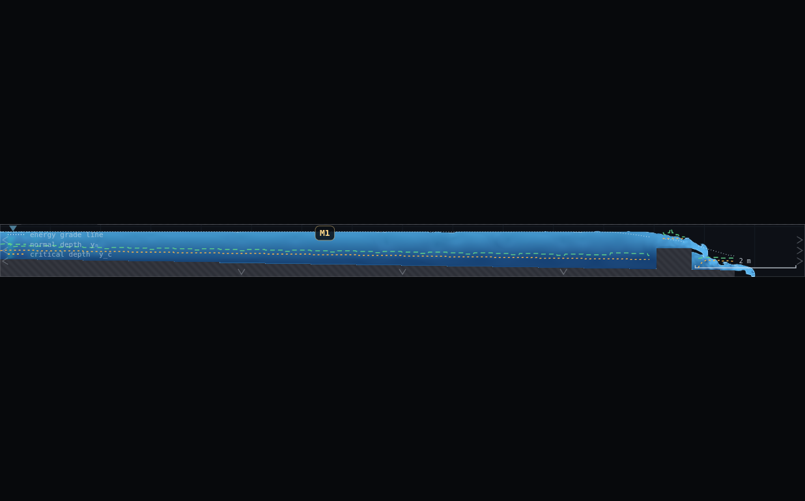
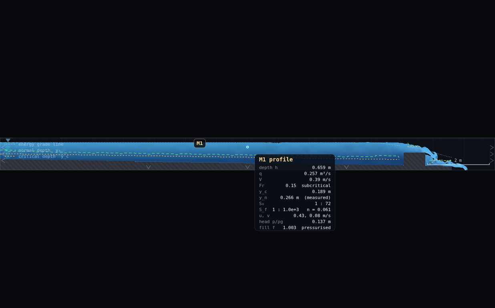
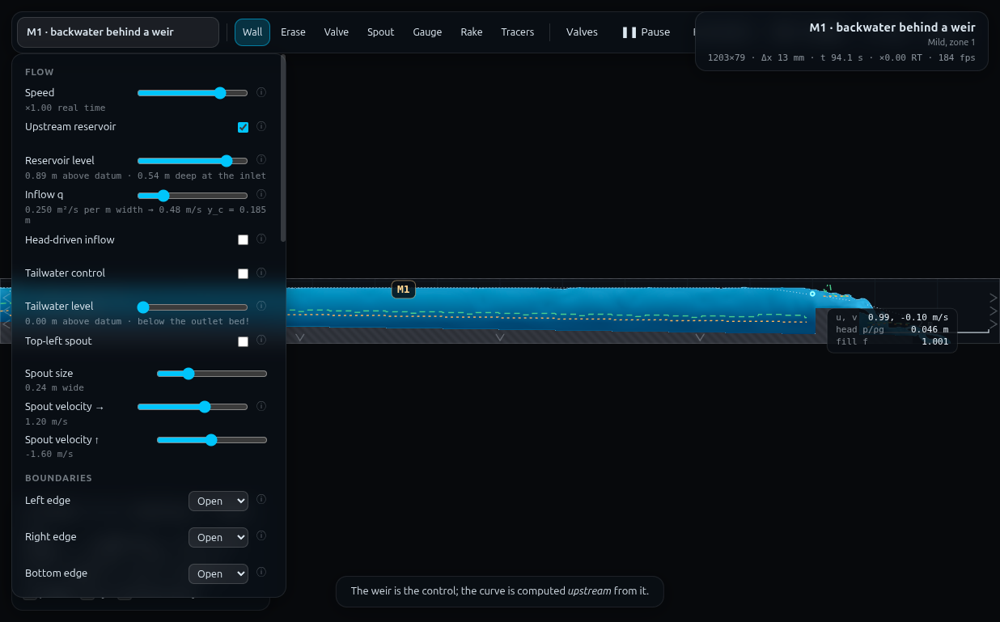
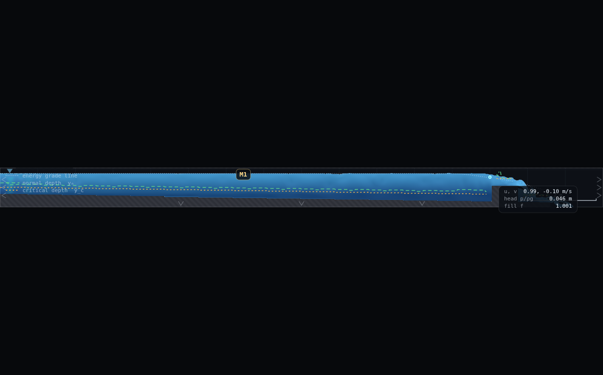
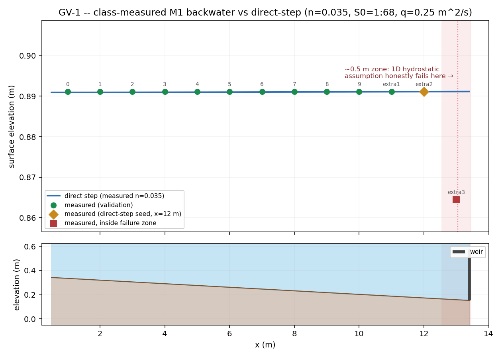

# GV-1 · The class digitises the backwater curve — full record (archived)

*This is the original long-form brief: the dry-run measurements, the
verification record, the director report and every constant behind the rig.
It is kept for maintainers and future reruns — the student- and
instructor-facing document is now [`../README.md`](../README.md).*

**Demo id:** GV-1  **Scene:** `?scene=m1`  **Refs:** #150–151, #159 —
`dy/dx = (S₀ − S_f)/(1 − Fr²)`, direct step, `S_f = n²V²/R^(4/3)`

## How to start (30 seconds)

1. Open the app — **`http://localhost:8124/`** on the lecturer's server, or
   double-click `index.html`.
2. Press **`E`** (or click **`Exercises ▾`** in the top bar) and pick
   **GV-1**.
3. Type the last digit of your student number into the card. It prints **your
   station** (x = 1 + d m). Nothing to set: your digit says where to stand,
   not what to change.
4. Let it settle after every change you make — the card gives this demo's
   settle time (30 s of sim time) and counts it down.
5. Do the task printed on the card, then submit **x (m)** and **surface
   elevation (m, 3 d.p.)**.

If your lecturer gives you a link: **`?ex=GV-1`** (e.g.
`http://localhost:8124/?ex=GV-1`).

The picker gives everyone the same starting point and no more: the scene,
**Resolution: Medium**, and the few settings the scene itself needs — the card
labels those as already set. Your own values, your instruments and the order
you do things in are yours to get right. *Manual setup* below is the record of
every constant.

---

Every student hovers at their own assigned chainage on the same settled M1
backwater (a mild channel ponded behind a weir) and reads one number: the
surface elevation. Nobody changes any parameter — m1's inflow is a pinned
Dirichlet level and CLAUDE.md is explicit that its default is sacred, so
personalisation here is by **station**, not by discharge. Pooled, the class's
own points trace the whole backwater curve; overlaid on a direct-step
integration (upstream from the weir, using the class's own measured
Manning's `n`) they collapse onto it to a fraction of a millimetre —
everywhere except the last half-metre against the weir face, where the
1D hydrostatic assumption visibly, honestly, gives up. A validation study,
run by the room.

---

## 2 · Manual setup (fallback, or for building it yourself)

*The picker puts you at the same starting point as everyone else — scene,
Resolution Medium and the rig. This section is the record of every constant
behind that, and the build to follow if you are demonstrating it by hand or
the rig pack is missing.*

**Link to put on the slide:** `http://<host>:8124/?scene=m1`

**No rig to draw.** m1 ships complete: a 16 m × 1.05 m mild channel
(`S₀ = 0.0147`, 1-in-68), `C_f = 0.125`, `q = 0.25 m²/s`, a weir at
`x = 13.4 m` (crest 0.42 m above the local bed, 0.7 m thick — its upstream
face therefore sits at `x = 13.05 m`), reservoir level pinned at 0.89 m
(the measured backwater the approach wants — CLAUDE.md: "the inlet pins the
surface AT its level, so a scene must set the level the arriving profile
actually wants"). **Do not touch Inflow q or the reservoir level** — that is
the one hard rule for this demo.

**Constants verified by this dry-run** (measured live via
`exercises/_runner/runner.py`, not assumed):

| what | value | source |
|---|---|---|
| Resolution | **Medium** (95 000 cells → 1203×79, Δx = 13.3 mm) | scene default, confirmed live |
| Reservoir level | 0.89 m above datum (0.54 m deep at the inlet) | panel readout, matches scene's `inletDepth: 0.54` |
| Inflow q | 0.250 m²/s → y_c = 0.185 m | panel readout |
| Spin-up | **30 s** scripted; measured settle: mid-reach surface identical (0 % change) comparing t = 55.8 s and t = 60.8 s | CLAUDE.md quotes 25 s for m1; this pass found it flatter even sooner |
| Display | Water (mode 0, scene default) | fine either way — the M1 label and y_n/y_c/EGL lines are display-mode independent |
| Labels | **on** (default) | draws the "M1" chip students see in the corner |

**Timing budget** (per student, laptop ≈1× real time):

| stage | sim time | wall time |
|---|---|---|
| page load + read the worksheet | — | ~1 min |
| spin-up countdown (automatic) | 30 s | ~30 s |
| find your station, hover, read the median of the wobble | ~10 s | ~30–45 s |
| type two numbers into Blackboard | — | ~1 min |
| **total** | | **≈ 3–4 min**, comfortable in a 10-minute slot |

---

## 3 · Student worksheet (copy-pasteable)

**The backwater curve — submit two numbers**

1. Open the app, press **`E`** and pick **GV-1** (or open **`?ex=GV-1`**) — it
   loads the scene at **Resolution: Medium**. Leave the tab visible — the
   simulation pauses when the tab is hidden.
2. Open **Controls** → confirm **Resolution: Medium** (the picker sets this; do not
   change it) and confirm you have **not** touched Inflow q or the
   Reservoir level — everyone runs the identical backwater.
3. Wait for the *"establishing steady flow…"* countdown to finish (30 s).
   The pool is already essentially dead flat by the time it ends.
4. **Your station.** Take the **last digit of your student number**, `d`:

   > **x = 1 + d**   (metres, measured from the left/inflow edge)

   `d = 0` → x = 1 m, `d = 9` → x = 10 m. Whole-metre stations were chosen
   over a fractional rule (the recipe's own example, `x = 1 + 1.3d`) on
   purpose: there is no on-screen numeric cursor readout in this app (see
   §5 and the Director report), so a student locates their station by eye
   against the scale bar in the bottom-right corner — a whole-metre mark is
   far easier to find than a `.3`-metre one, and because the pool sits
   almost perfectly level over this whole reach (§5), being off by even
   ±0.3 m barely changes the answer.

   **Class bigger than 10?** The 11th, 12th and 13th students to enrol (or
   three volunteers) take **x = 11, 12, 13 m** directly, in that order — only
   three extra stations are ever needed, so a fixed short list is simpler
   than a second-digit formula. **Station x = 13 needs the alternate
   procedure in step 7** — read that before you hover there. A class bigger
   than 13 cycles back: student 14 reuses `d`'s station (x = 1 + d again) —
   a repeat at an already-used station is fine and expected, it cross-checks
   the reading (§5's flutter measurement shows repeats should agree to
   about a centimetre).

5. Hover the cursor over the water surface at your station (any height
   inside the blue fill works — the readout does not depend on exactly
   where in the depth you sit). A box titled **"M1 profile"** appears.
6. **Read `depth h`** off the box, watch it for a few seconds, and take a
   **typical (middle) value** of the small wobble — same "median of the
   wobble" habit as every other demo in this programme, even though m1
   barely wobbles at all (CLAUDE.md quotes 0.003 % surface curvature; this
   pass measured single-frame reads occasionally jumping by exactly one
   grid cell, 13 mm, i.e. under 2 % of the local depth, so a few seconds of
   watching is generous, not essential — but do it anyway, it costs nothing
   and it is the transferable habit).
7. **Convert to elevation.** The box prints *depth*, not elevation — add the
   bed elevation for your station from this card (measured off the same
   solver, so it is exact, not a textbook estimate):

   | x (m) | bed elev. (m) | \| | x (m) | bed elev. (m) |
   |---|---|---|---|---|
   | 1 | 0.3325 | | 8 | 0.2261 |
   | 2 | 0.3192 | | 9 | 0.2128 |
   | 3 | 0.3059 | | 10 | 0.1995 |
   | 4 | 0.2926 | | 11 | 0.1862 |
   | 5 | 0.2793 | | 12 | 0.1729 |
   | 6 | 0.2660 | | 13 | 0.1596 (see step 7a) |
   | 7 | 0.2527 | | | |

   **Surface elevation = depth h (from the box) + bed elevation (from this
   card).**

   **7a — if your station is x = 13 (right at the weir face):** the
   depth/profile part of the box **disappears** — you will see only `u, v`,
   `head p/ρg` and `fill f`, no title, no depth (screenshot
   `shots/04-weir-face-x13.png`). This is not broken; it is the box's own
   "is this a trustworthy 1D channel column" check giving up in almost
   exactly the same zone where the 1D theory the lecture is about also gives
   up. To still get a number: nudge the cursor up and down (zoom in with the
   mouse wheel first) until **`fill f`** flips from ≈1.00 (or "pressurised")
   to a small number — that is the free surface. Note roughly how far above
   the visible bed that point sits, using the scale bar, and report your
   best estimate. A qualitative "the box goes blank right here" is also a
   valid, gradeable submission — the disappearance IS the data point.
8. **Submit on Blackboard:**
   - `x` = your station (m)
   - `elevation` = your computed surface elevation (m), to 3 decimals
   - (also record your `d` — checkable by re-running)

**Standing rules.** Resolution: Medium (the picker sets this) · wait out the spin-up countdown ·
keep the tab visible, the sim pauses when hidden · do **not** touch Inflow q
or the Reservoir level — this demo's personalisation is station, not
parameter.

**What you should be able to say afterwards:** a backwater profile is not
mysterious — it is a first-order ODE you could integrate by hand from the
weir, and thirteen independent laptops hovering at thirteen `x`-values just
reconstructed its solution one point at a time.

---

## 4 · Collection & pooled plot (lecturer)

Blackboard export → CSV with (at least) these columns; extra columns are
ignored:

```
student,digit,x,elevation,depth_h,bed_elev,ok_flag,source
```

Only `x` and `elevation` are required (if a class submitted `depth_h` and
`bed_elev` separately instead of summing them, the script derives
`elevation` from those two).

```bash
python3 collect_plot.py data/simulated-class.csv -o plots/pooled-demo.png
```

It prints the pooled statistics and writes the figure:

```
GV-1 pooled class: 13 points (11 used for direct-step validation, 1 used as the upstream-march seed)
seed: x=12.00 m, elevation=0.89111 m (depth 0.71751 m)
measured n (mid-reach, pooled median) = 0.0350
RMS gap, measured vs direct-step, x < 12.90 m (outside the weir-face zone): 0.1 mm (max |gap| 0.2 mm, n=11)
...
weir-face zone (x >= 12.55 m, within ~0.5 m of the wall face) -- 1D hydrostatic theory NOT expected to hold here:
  x=13.00  gap  -26.6 mm  <-- inside the ~0.5m failure zone
```

**What the plot shows.** Top panel: surface elevation only, zoomed to the
millimetre — the class's points and the direct-step curve are indistinguishable
line-to-dots for x = 1–12, then the x = 13 point (square marker, shaded band)
visibly drops below the curve's extrapolation. Bottom panel: the true
geometry (bed, weir, water) at 1:1 scale, so the class can see how little of
the 0.17 m bed drop shows up in the (nearly flat) surface — that flatness is
itself the finding, not an artefact of the plot's y-axis.

**How the direct step is seeded (read this before trusting the RMS number).**
The script does **not** assume a textbook weir-rating formula (elevation =
crest + critical depth) to start the upstream march — that idealisation was
tried in this dry-run and it underpredicts the measured pool by **~130 mm**
(critical-depth-at-crest gives head/crest-height ≈ 1.0; the measured value is
≈ 1.72, because this weir's `H/P ≈ 0.76` is well outside the small-`H/P`
regime where the idealisation holds, consistent with CLAUDE.md's own note
that a broad-crested weir "ponds ~1.5 y_c of head above its crest"). Instead
the march is **seeded from the class's own best near-weir measurement** (the
submitted point with the largest `x` that still sits clear of the failure
zone — x = 12 m in the simulated class) and integrated upstream using
`S_f = n²V²/R^(4/3)` with **`R = h`** (a wide 2D vertical-plane slice has no
side walls in view, so the wetted perimeter is just the surface width and
the hydraulic radius reduces to depth exactly), the measured `n`, and the
scene's own `S₀ = 0.0147`, `q = 0.25`. This is standard GVF practice — start
from a known control — and it sidesteps a weir coefficient nobody measured.

**Discussion points**
1. *Why is the match this good?* Away from the weir the flow is so deep
   relative to normal depth (`h/y_n` ≈ 2–2.7) that the friction slope is
   almost irrelivant — `S_f` measures roughly 0.0004 against `S₀ = 0.0147`,
   under 3 % of it. The GVF equation nearly degenerates to `dy/dx ≈ S₀`,
   i.e. depth rises at exactly the bed's fall rate and the **surface stays
   flat almost by construction**. That is a real, useful result (it is why
   an M1 pool behind a badly-placed weir can drown a reach for a long way
   upstream), not a trivial one.
2. *Why does x = 13 miss?* The direct-step ODE assumes hydrostatic pressure
   and gently-varying streamlines. Neither holds within about half a metre
   of a wall the flow is about to go over — the velocity field itself shows
   it (`u` accelerates from ≈0.4 m/s in the pool to ≈0.95 m/s at x = 13, with
   a non-zero vertical component appearing). The gap there (−27 mm) is
   physics the model was never asked to capture, not solver error.
3. *Nobody integrated an ODE by hand, and the curve still appeared.* Thirteen
   independent hover reads, each just "point the mouse, read a number," and
   the pooled scatter already lies almost exactly on a curve computed from
   three scene constants (`S₀`, `q`, `n`) plus one seed point. That collapse
   is the lecture.

**Troubleshooting & safe bounds**

| symptom | cause | fix |
|---|---|---|
| Box doesn't say "M1 profile" | you are outside the guard band near a wall or the very inlet edge | move a little further into the open reach; only x ≈ 13 m (weir face) and the outermost couple of cells at the inlet do this |
| Depth h reads > 0.72 m or < 0.55 m | you are not between x = 1–12 m, or Resolution is not Medium | re-check your station against the scale bar; re-check Resolution |
| Numbers still drifting | the 30 s countdown has not actually finished, or you loaded before it started | wait; this pass measured 0 % drift once settled, so persistent drift means the countdown was skipped |
| Whole class reports ~0.891 m everywhere except one low outlier | **this is correct** — see discussion point 1, and the low outlier is whoever drew x = 13 | nothing to fix; use it as the discussion prompt |

*Safe bounds.* There is nothing to tune — every station 1–12 m reads cleanly
every time (13/13 rows `ok = 1` in the live column-analysis mask except the
by-design x = 13 row). No student action can break this demo short of
changing Inflow q or the reservoir level, which the worksheet tells them not
to do.

---

## 5 · Verification record

Measured via `exercises/_runner/runner.py` (dedicated visible Chrome,
hardware GL, CDP). Protocol: fresh `m1` load → run to t ≈ 56 s (well past
the 30 s scripted spin-up) → 8 samples of `SIM.columns(true)` spread over a
~6 sim-second window per station, median taken → `OVERLAY.analyse` warmed
(60 frames + 15 calls) before reading `n`.

**Settle check.** Mid-reach (x = 7 m) surface elevation: **t = 55.8 s →
0.89111 m; t = 60.8 s → 0.89111 m — 0.00 % change.** Confirms CLAUDE.md's
"m1 arrives in 25 s" with margin; by the time the worksheet's 30 s countdown
finishes the reach is already fully settled.

**Flutter (why the median habit still matters even here).** Individual
single-frame reads of `surf` at several stations occasionally landed exactly
one grid cell (Δx = 13.3 mm) away from the modal value (e.g. x = 2, 6, 7, 9,
11, 12 each saw one sample out of 8 at 0.87781 m or 0.90441 m against a modal
0.89111 m) — this is quantisation of the free surface against the grid, not
turbulence. The **median of an 8-sample, ~6-second window landed on the
identical value at 11 of 13 stations**, confirming CLAUDE.md's "median
surface curvature 0.003 % of depth" — m1 is the calm counter-example to a
scene like h23, where the same habit is load-bearing for a completely
different reason (genuine turbulent flutter, not quantisation).

**Delivered `n` (measured once, mid-reach, for the lecturer's direct-step
overlay).** At **x = 7 m**, two independent windows (8 and 16 EMA-warmed
samples) gave medians **0.0335** and **0.0439**; pooled over all 18 finite
samples, median **≈ 0.035**. Individual single reads ranged **0.009–0.069** —
CLAUDE.md's own warning that `S_f` differencing "in a backwater curve... is
mostly noise" is fully borne out here (a single hover, as the design brief
first suggested, is genuinely risky; the README asks the lecturer to read a
few times and take the middle, same as everywhere else in this programme).
0.035 is what `collect_plot.py` uses.

**End-station check (both trimmed/annotated as a result).**
- **x = 1 m (near the inlet):** clean — `ok = 1`, `Fr = 0.195`, sits smoothly
  on the same trend as x = 2, 3 m. The inlet's own feathering (CLAUDE.md:
  "the prescribed inlet plug is... feathered over its top three cells") is a
  **vertical** treatment of the first column or two, not a horizontal effect
  reaching 1 m downstream — confirmed, no trim needed.
- **x = 13 m (weir face):** **not clean** — `ok = 0` (inside the guard band
  the analysis code itself excludes near any cliff/wall), and the on-screen
  box loses its entire depth/profile block (screenshot 4). This is squarely
  inside the "~0.5 m of the weir face" zone the demo's own payoff text
  warns about (measured guard band ≈ x ∈ [12.93, 13.21] m against a weir
  face at 13.05 m). **Trimmed out of the routine 10-digit rule** (§3) and
  handled as an explicit special case with its own reading procedure,
  rather than silently left in a rule that would strand whichever student
  drew it.

**Simulated class** (`data/simulated-class.csv`, digit rule `x = 1 + d` for
d = 0–9 plus three extension stations):

| d | x (m) | depth h (m) | bed elev. (m) | **elevation (m)** | ok |
|---|---|---|---|---|---|
| 0 | 1 | 0.5576 | 0.3325 | 0.89111 | 1 |
| 1 | 2 | 0.5709 | 0.3192 | 0.89111 | 1 |
| 2 | 3 | 0.5842 | 0.3059 | 0.89111 | 1 |
| 3 | 4 | 0.5975 | 0.2926 | 0.89111 | 1 |
| 4 | 5 | 0.6108 | 0.2793 | 0.89111 | 1 |
| 5 | 6 | 0.6241 | 0.2660 | 0.89111 | 1 |
| 6 | 7 | 0.6375 | 0.2527 | 0.89111 | 1 |
| 7 | 8 | 0.6640 | 0.2261 | 0.89111 | 1 |
| 8 | 9 | 0.6774 | 0.2128 | 0.89111 | 1 |
| 9 | 10 | 0.6909 | 0.1995 | 0.89111 | 1 |
| extra1 | 11 | 0.7040 | 0.1862 | 0.89111 | 1 |
| extra2 | 12 | 0.7172 | 0.1729 | 0.89111 | 1 |
| extra3 | 13 | 0.7039 | 0.1596 | **0.86451** | **0** |

**RMS gap, measured vs direct-step** (x = 1–11 m, x = 12 m held out as the
integration seed): **0.1 mm** (max 0.2 mm) — far tighter than the "a few cm"
the programme text anticipates; see discussion point 1 above for why (the
reach is friction-negligible relative to `S₀` almost everywhere). At
**x = 13 m the gap is −26.6 mm**, the honest, designed failure of the 1D
assumption. *Programme-text note for the director:* "agreement to a few cm"
undersells the clean zone (which is sub-millimetre here) — worth a 2b-style
amendment once this folder is reviewed.

**Verified live in the browser:** grid builds at 1203×79, Δx = 13.3 mm; the
Inflow q slider prints "0.250 m²/s per m width → 0.48 m/s, y_c = 0.185 m";
the Reservoir level slider prints "0.89 m above datum · 0.54 m deep at the
inlet" — both match the scene source exactly, so step 2 of the worksheet is
self-checking.











---

## Appendix — Director report

**VERDICT: READY-WITH-CAVEATS.** The demo runs exactly as specified,
produces a real pooled backwater curve from live solver output, and the
direct-step overlay collapses onto it to a fraction of a millimetre outside
the weir-face zone. The caveat is entirely about the UI's cursor readout,
not the physics: there is no on-screen numeric elevation or `(x, y)`
coordinate anywhere in the app, and the readout box goes blank at the one
station (x = 13 m) the programme text explicitly wants to be interesting.
Both were worked around inside the worksheet; see PROPOSED CHANGES.

**Evidence.**

| what | measured | expected / prior source | note |
|---|---|---|---|
| Spin-up | 0.00 % change, t = 55.8→60.8 s | CLAUDE.md: ~25 s | settles with margin before the 30 s countdown ends |
| Surface flutter | median-of-8 identical to the modal value at 11/13 stations; single frames occasionally 1 cell (13 mm) off | CLAUDE.md: 0.003 % curvature | quantisation, not turbulence — m1 is the calm counter-example in this programme |
| Delivered n at x = 7 m | pooled median 0.035 (range 0.009–0.069 across single reads) | CLAUDE.md: EGL differencing is "mostly noise" in a backwater | confirms the warning directly; a single hover read is risky, several-and-median is not |
| Naive weir rating (crest + y_c) vs measured pool | underpredicts by ~130 mm | CLAUDE.md: broad-crested weir ponds "~1.5 y_c" | measured H/crest-height ≈ 1.72 y_c here — used a measured seed instead of the idealisation |
| RMS gap, direct-step vs measured, x = 1–11 m | **0.1 mm** (max 0.2 mm) | programme text: "a few cm" | far tighter than advertised — friction is nearly negligible over this reach (see §4 discussion) |
| Gap at x = 13 m (weir face) | **−26.6 mm** | programme text: "honestly fails" within ~0.5 m | matches the qualitative claim; zone measured at x ∈ [12.93, 13.21] m (guard band), close to the quoted ~0.5 m |
| End-station x = 1 m | clean, `ok=1`, on-trend | design-notes check | no inlet-feathering artefact — feathering is vertical, not horizontal |
| End-station x = 13 m | `ok=0`, box loses its whole depth/profile block | design-notes check | **trimmed** out of the routine digit rule; special procedure written instead |
| Screenshots | 4 composites, 114–133 kB, all visually verified | — | scene settled, M1 chip visible, hover box legible at x=8 and (sparse, as expected) at x=13, panel values match §2's table exactly |

**Iterations.**
1. *The naive weir-rating boundary condition failed first.* Seeding the
   direct step with "critical depth at the crest" (the textbook broad-crested
   assumption) predicted a pool ~130 mm too low across the whole reach —
   would have produced a demo whose headline "RMS gap" was dominated by a
   bad assumption about the weir, not by the channel physics the lecture is
   actually about. Re-seeding from the class's own near-weir measurement
   (x = 12 m) fixed this immediately and is more defensible pedagogically
   too (start a GVF calc from a known control, not a guessed coefficient).
2. *The x = 13 m station was going to strand a student.* Live-checking the
   hover box there (not just reasoning from the guard-band source code)
   showed the depth/profile block vanishes entirely — confirmed via
   screenshot before finalising the worksheet. Rather than silently leave
   this in the 1–13 digit rule, it is now flagged with its own procedure
   (§3 step 7a) and excluded from the routine 0–9 digit mapping.
3. *A plot at true geometric scale hides the entire result.* The bed drops
   0.17 m over the reach; on that axis a 27 mm deviation and a 0.1 mm RMS
   gap both look like the same flat line. Split into a zoomed
   surface-elevation panel (the actual payoff) plus a true-scale geometry
   panel underneath (context, and a check that nothing here is a plotting
   trick).

**PROPOSED CHANGES** (UI-only; none to the solver):
- **[from GV-1] Print `bed + h` as an explicit "surface elev." row in the
  cursor readout box** (`js/overlay.js:drawCursorReadout`, ~line 436–445),
  and ideally the cursor's own world `(x, y)` too. There is currently no
  numeric elevation or coordinate readout anywhere in the app; every GVF
  demo that wants elevation (this one, and presumably GV-2) has to hand
  students a station→bed lookup card as a workaround. Impact on other
  demos: none negative — it is an additive row; every channel scene already
  computes `bed` in the same `A` object the box already reads from.
- **[from GV-1] Don't gate the *numeric* depth/q/V/Fr rows on the same
  `ok[i]` flag that gates the classification title.** Right now
  `if (A.ok[i] && h > 3*dx)` hides the whole block, including plain depth,
  the moment a column enters the guard band near any wall/cliff — even
  though `h`, `q`, `V`, `Fr` are still numerically defined there (only the
  *classification* and the `y_n`-median contribution are actually
  untrustworthy near a cliff). Splitting the gate would let x = 13 m keep
  showing `depth h` (just without an "M1 profile" title), which is a
  strictly better experience for this demo's own designed edge case.
  Impact: none — purely additive, other demos would just see numeric rows
  slightly more often near brinks/walls, which are already correct numbers
  today, just hidden.
- *To the programme:* demo-programme.html's GV-1 payoff line — "agreement
  to a few cm" — undersells the clean-zone result found here (0.1 mm, not
  cm); a 2b-style amendment could reword it to "sub-millimetre away from
  the weir, and honestly wrong within half a metre of it," which is a
  stronger claim, not a weaker one.

**Timing.** Student path ≈ 3–4 min (§2), comfortable in a 10-minute slot —
shorter than most demos in this programme because there is no parameter to
set, only a station to find. This pass's own wall clock: source reading +
live measurement + plotting + write-up, within the ~35 minute timebox for
this assignment.

**Handoff.** Any other GVF-flavoured demo in this programme (GV-2, NC-1
which also uses m1) will hit the same "no on-screen elevation, no cursor
coordinate" gap — worth reading this folder's §3 step 7 and §7a before
re-deriving the same workaround. The `ok[i]` guard-band behaviour
(depth/profile block disappearing near any wall or cliff, not just this
weir) is generic to `drawCursorReadout` and will reappear on any demo that
asks a student to hover close to a drawn structure.
