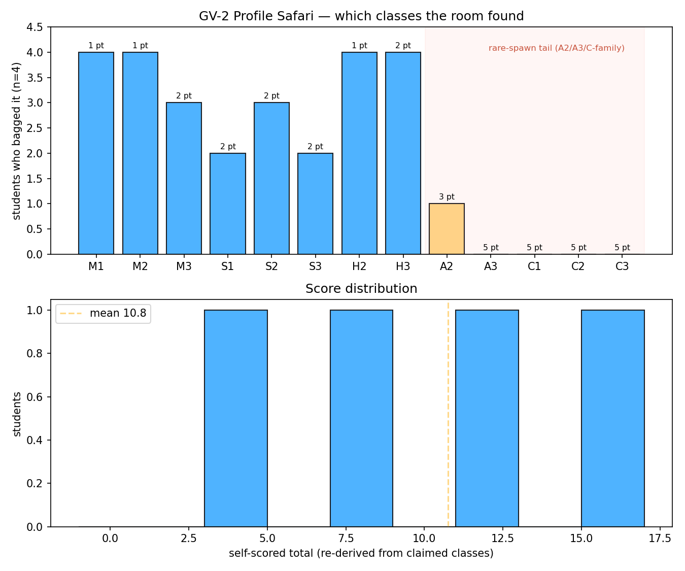

# GV-2 · Profile safari

A timed game, not a measurement exercise. Sandbox, labels on, score card in
hand: in 20 minutes, draw as many **distinct**, correctly-labelled
surface-profile classes as you can and screenshot the overlay's own orange
chip as proof. It forces exactly the exam's classification reasoning — read
the bed slope, compare the depth with `d_n` and `d_c`, name the zone —
disguised as a collecting game. A2 and the whole C family are deliberately
rare: nobody is expected to clear the board, and the pooled "who found what"
chart is the payoff, not any one student's score.

**Open it:** press **E** in the [app](https://barneydobson.github.io/hydraulician/)
and pick **GV-2**, or use the direct link
[`?ex=GV-2`](https://barneydobson.github.io/hydraulician/?ex=GV-2).
How to run any exercise: see the [teaching pack index](../INDEX.md#running-an-exercise).

## Theory

The chip drawn over a reach is `classify(h, d_n, d_c, S₀)`, and it is the
whole game:

    letter — from the BED:    S₀ > 0 → M if d_n > d_c, S if d_n < d_c
                              (inside ±5% → C) · S₀ ≈ 0 → H · S₀ < 0 → A
    zone   — from the WATER:  1 above both d_n and d_c · 2 between them
                              3 below both  (H and A have no d_n:
                              2 if h > d_c, else 3)

Thirteen chips exist — M1 M2 M3 · S1 S2 S3 · C1 C2 C3 · H2 H3 · A2 A3. A
reach only earns one if it holds about **0.46 m** of contiguous same-class
columns, standing on solid bed (a falling nappe is not a profile) and clear
of the guard band either side of any gate, weir or brink.

## Score card

No digit on this one: every rig is drawn by hand, and that is the
personalisation — two visibly identical screenshots (same geometry, same wave
phase) count as one submission between the pair who produced them.

| points | classes |
|---|---|
| **1** | M1 · M2 · H2 |
| **2** | M3 · S1 · S2 · S3 · H3 |
| **3** | A2 |
| **5** | A3 · C1 · C2 · C3 |

The 1-pointers fall out of almost any control standing on the right bed — a
pool behind a gate, a drawdown to a free brink. The 2s need a gate opening
small enough not to drown, a real tailwater, or a bed truncated short of the
domain edge. A2 is priced for the adverse bed itself, not for any one trick.
The 5s are open bounties: the pack's own play-through bagged nine of the
thirteen, never reached A3, and could not hold the C family still.

## What to do

1. Draw a rig — Wall (`1`) and Erase (`2`) for beds, gates and weirs
   (`[`/`]` size the brush, shift-drag snaps the angle), Measure (`8`) to
   check a slope — then turn on the reservoir and/or tailwater in the panel.
2. Let it fill. The sandbox starts **dry**, so a steep rig with a tailwater
   can want a couple of minutes of simulated time before it settles, and
   shipped-scene numbers (gate openings especially) often drown from a dry
   start — go smaller.
3. A chip counts only if it holds **~10 s** without flickering to another
   letter or zone. Screenshot the chip *and* your geometry in the same frame,
   one shot per class.
4. Score yourself against the card and submit your **total, the classes
   claimed and the screenshots**. Pairs are recommended: most of the clock
   goes on judgement calls, and a second person doubles the hypotheses you
   can try.

One trap worth knowing before you start: a bed drawn all the way to the
domain edge with nothing downstream floods the whole box to about 1.5 m and
classifies nothing. Truncate it short of the edge with the bottom open, or
give it a real tailwater.

## For the instructor — pooling the class

Collect one row per student (`student,minutes,score,classes`), where
`classes` is a quoted comma-separated list like `"M1,M2,H2,H3"`; export the
CSV and run:

```bash
python3 collect_plot.py class.csv                # -> plots/pooled-demo.png
python3 collect_plot.py data/simulated-class.csv # the shipped dry-run class
```

The script re-derives every score from the claimed list against the point
table above, printing any mismatch, then plots the per-class bag rate with
the rare-spawn tail tinted, over a histogram of the totals.



### Discussion points

- **Nobody has to bag a C for the lesson to land.** A tail sitting at zero
  *is* the finding: a channel at critical slope is the least stable
  configuration in open-channel hydraulics. Show it live — load
  `?scene=c13` and switch **Profile labels** on (that scene ships with them
  off for exactly this reason): the chip flickers C1/C3/M1 from one second to
  the next on a tuned, shipped scene, never mind a hand-drawn one.
- **Adjudicating a suspicious chip.** A drowned control flips the *letter*,
  not just the zone: `d_c` is local and collapses with the local discharge,
  while `d_n` comes from a domain-wide median that goes stale — so a fully
  drowned gate on an unmistakably 1-in-4 bed reads **M1** end to end. Ask a
  claimant for the local `Fr`, and treat any chip centred within ~0.3 m of a
  structure as suspect.

The full verification record — the play-through log, a recipe card per bagged
class, the not-achievable list with everything that was tried, the
critical-slope flicker measurement and the raw panel numbers — is kept locally, out of version control, at `exercises/GV-2-profile-safari/_archive/README-full.md`.
