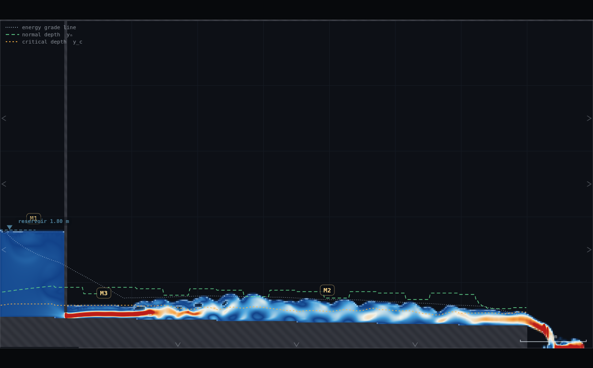
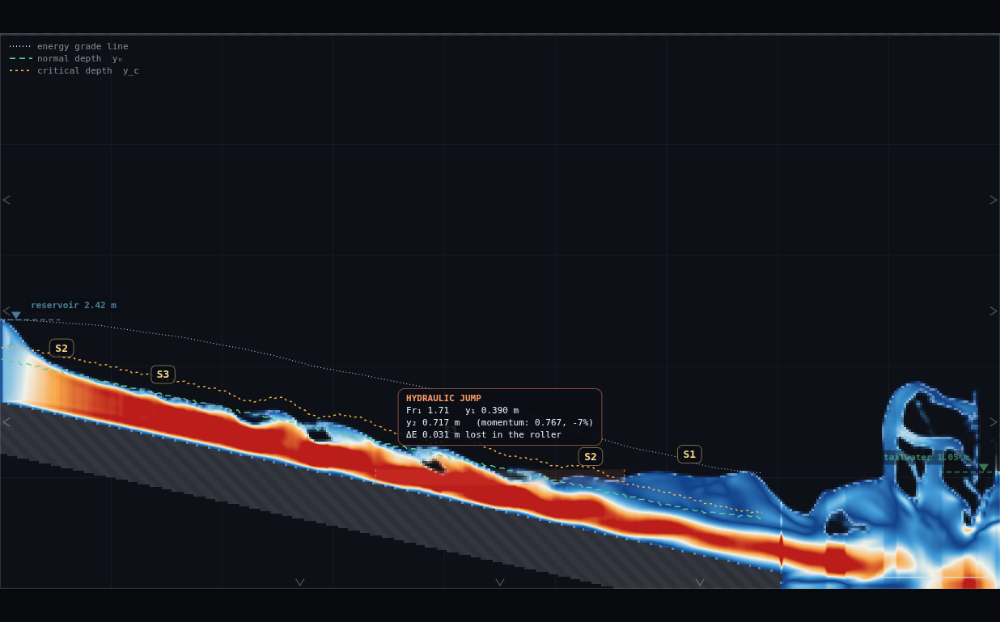
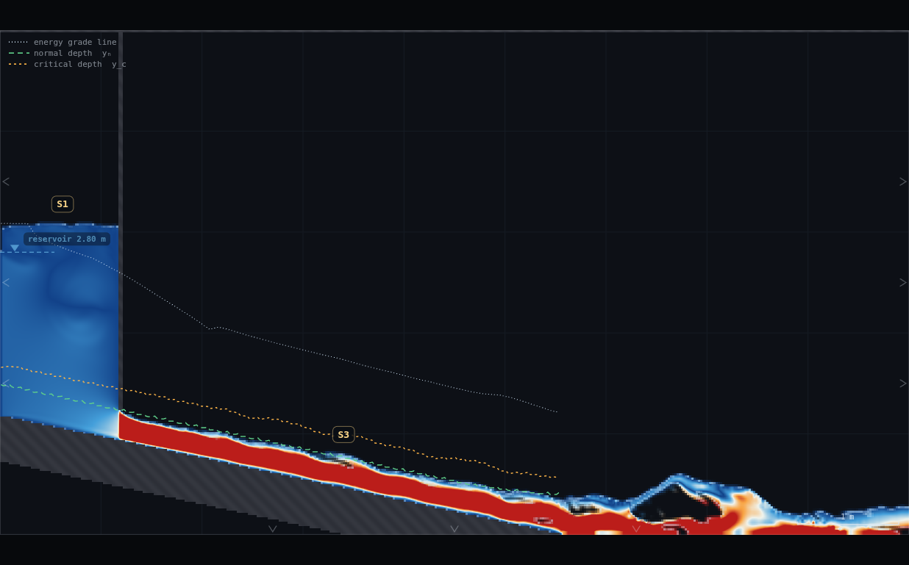
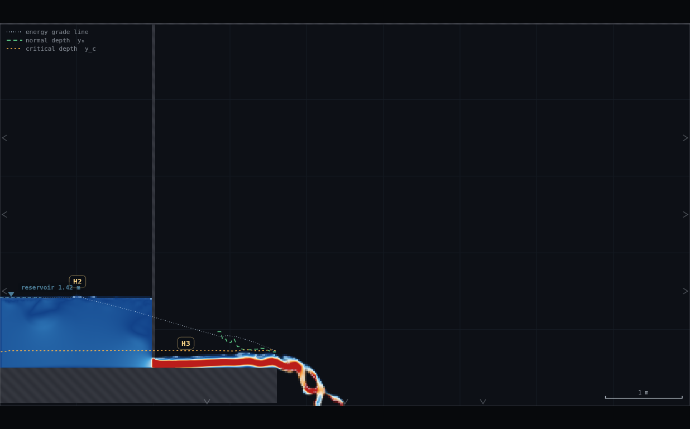
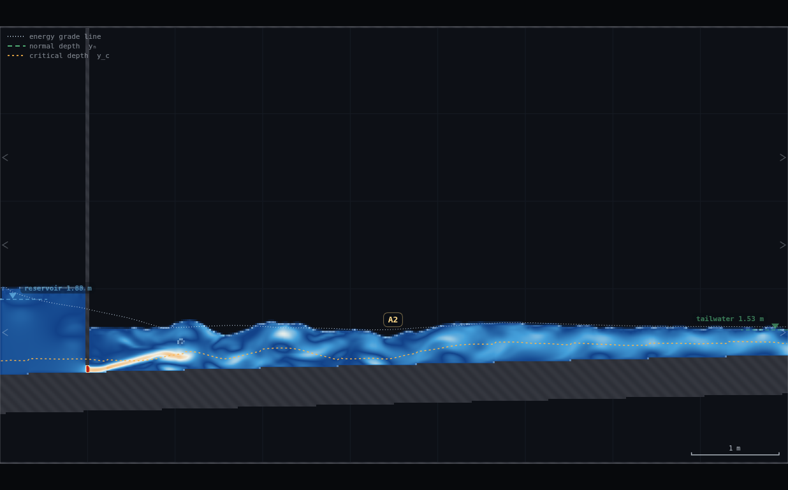
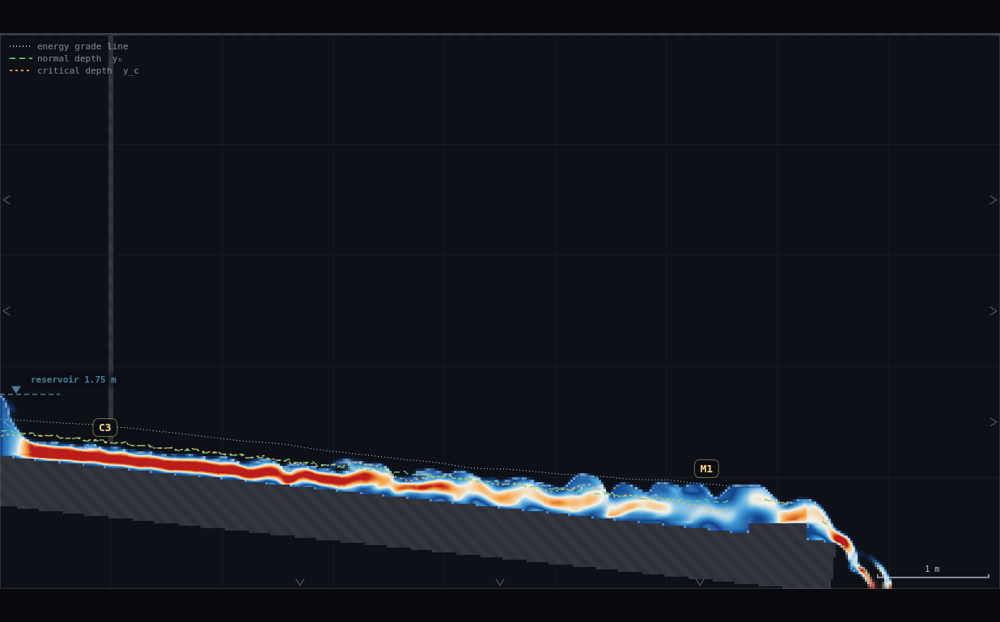

# GV-2 · Profile safari — full record (archived)

*This is the original long-form brief: the dry-run measurements, the
verification record, the director report and every constant behind the rig.
It is kept for maintainers and future reruns — the student- and
instructor-facing document is now [`../README.md`](../README.md).*

**Demo id:** GV-2  **Scene:** `?scene=sandbox` (drawn rigs, not a shipped scene)
**Refs:** #150 sign analysis — the M/S/C/H/A × 1/2/3 gradually-varied-flow
taxonomy

## How to start (30 seconds)

1. Open the app — **`http://localhost:8124/`** on the lecturer's server, or
   double-click `index.html`.
2. Press **`E`** (or click **`Exercises ▾`** in the top bar) and pick
   **GV-2**.
3. No digit on this one — every rig is drawn by hand, and that is the
   personalisation.
4. Nothing to settle — the sandbox starts dry. Start drawing.
5. Play the task printed on the card, then submit your **score**, the
   **classes claimed** and **one screenshot each**.

If your lecturer gives you a link: **`?ex=GV-2`** (e.g.
`http://localhost:8124/?ex=GV-2`).

The picker gives everyone the same starting point and no more: the scene,
**Resolution: Medium**, and the few settings the scene itself needs — the card
labels those as already set. Your own values, your instruments and the order
you do things in are yours to get right. *Manual setup* below is the record of
every constant.

---

A timed game, not a measurement exercise. Sandbox, labels ON, score card in
hand: in 20 minutes, draw as many DISTINCT, correctly-labelled surface-profile
classes as you can and screenshot the overlay's own orange chip as proof. It
forces exactly the exam's classification reasoning — read the bed slope,
compare the depth to `y_n` and `y_c`, name the zone — disguised as a
collecting game. A2 and the whole C-family are deliberately rare: nobody is
expected to clear the board, and the pooled "who found what" chart is the
payoff, not any one student's score.

This README is written from having played the game myself first, in the
sandbox, exactly as a student would (see §5 for the log). **9 of the 13
classes were bagged and screenshotted with a stable chip: M1, M2, M3, S1, S2,
S3, H2, H3, A2** (A2 is one of the two "rare spawn" families). A3 was not
reachable in the time available; C1/C3 were **observed but not stabilised** —
both are honestly reported in §5/§6 rather than papered over.

---

## 1 · What the taxonomy chip actually is

`js/overlay.js`'s `classify(h, yn, yc, S0)` (called from `profileRuns`, drawn
by `drawProfileLabels`) is the whole game:

- **Letter** — from the bed slope `S0` (a running mean of rasterised bed
  drops, outliers dropped): `S0 > 2e-4` → **M**ild or **S**teep, decided by
  comparing the MEASURED `y_n` to `y_c` (±5% band reads **C**); `S0 < -2e-4`
  → **A**dverse; otherwise **H**orizontal.
- **Zone** — for M/S/C, 1 above both `y_n,y_c`, 2 between, 3 below both; for
  H/A (no normal depth exists) 2 if `h > y_c`, 3 if `h < y_c`.
- A run only gets a chip if it is **≥ ~0.46 m** of contiguous same-class
  columns (`minRun` in `profileRuns`, Medium resolution) and clear of any
  "cliff" guard band (±0.12 m either side of a slope discontinuity — a gate,
  weir or brink) and of the "standing on something" solid-mask guard
  (CLAUDE.md's nappe guard). **Both of these are hard floors on rig design**:
  every zone below is drawn long enough to clear 0.46 m, and every reading is
  taken clear of the guard band around whatever control makes it.
- The whole overlay is gated on the **`channel` control** (`state.channel`,
  "Open-channel overlay" in the panel) being ON *and* `sim.p.g > 0.5`
  (main.js:725). The sandbox scene does not set `chan:1`, so **this toggle
  defaults OFF in the sandbox and must be switched on by hand** — miss this
  and no chip will ever appear, however good the rig is. `rig.js` does it for
  you (`CHAN.C("channel").set(true)`); a student must do it from the panel.

---

## 2 · Manual setup (fallback, or for building it yourself)

*The picker puts you at the same starting point as everyone else — scene,
Resolution Medium and the rig. This section is the record of every constant
behind that, and the build to follow if you are demonstrating it by hand or
the rig pack is missing.*

**Link for the slide:** `http://<host>:8124/?scene=sandbox`

**No rig ships pre-drawn.** That is the point of a safari — every rig is
personal. `rig.js` in this folder is for **lecturer rehearsal only**: paste it
into the console with the sandbox loaded, then call any `RECIPES.*()` to
rebuild exactly what this safari measured (see §7 for the full list). Do not
hand `rig.js` to students — two identical rigs would be two identical
screenshots (see §4 "Anti-copying").

**Standing rules (same panel state for everyone):** picking GV-2 in the
Exercises menu applies this panel state, Resolution included — the table is
the record of what it set.

| what | value | why |
|---|---|---|
| Resolution | **Medium** (414×230 on the sandbox's 9×5 m domain, Δx = 21.7 mm) | matches every other sandbox demo in this set; High+ makes the 20-minute window too slow to iterate rigs in |
| Open-channel overlay | **ON** (Controls → "Open-channel overlay") | off by default in the sandbox (see §1) — without it, no chip ever appears, full stop |
| Profile labels | **ON** (Controls → "Profile labels") | the chip itself |
| Jump box | ON (harmless either way, useful bonus evidence for the S1/M2 jumps) | |
| Brush / tools | Wall (1), Erase (2), Valve, Spout, Gauge, Rake — the usual sandbox toolbar | |

**Timing budget** (measured from this safari, not a guess — see §5 for the
per-rig log): a **known** rig (the player already knows the geometry trick)
settles and reads in **1–2 minutes**; a **first attempt at a new trick**
(discovering the RIG-B truncation-to-avoid-ponding pattern, or that a gate
opening has to be small enough not to drown) runs **3–6 minutes**, including
at least one wrong try. Budget the 20 minutes as roughly: 2 min panel setup +
"safe" classes (M1/M2/H2, all first-try cheap once the reservoir + a gate is
up) + the rest split between the S-family and a stretch attempt at A2 or C.

---

## 3 · Game rules (read this to the room)

**Profile safari — bag as many classes as you can in 20 minutes**

1. Open the app, press **`E`** and pick **GV-2** (or open **`?ex=GV-2`**) — it
   loads the empty sandbox at **Resolution: Medium** with **Open-channel
   overlay: ON** and **Profile labels: ON**. Check those two in **Controls**
   before you start; without them no chip ever appears. Leave the tab visible
   — the sim pauses when hidden.
2. You have **13 possible chips**: M1, M2, M3, S1, S2, S3, C1, C2, C3, H2, H3,
   A2, A3. Draw geometry (walls, gates, weirs — `1`/`2`/`[`/`]` to set the
   brush, shift-drag to snap), turn on the reservoir and/or tailwater in the
   panel, and wait. A chip appears over any reach the overlay can classify.
3. **A chip only counts if it is STABLE** — watch it for **~10 seconds**
   without it flickering to a different letter/zone or disappearing. A chip
   that flashes once and vanishes is not a bag (§6 explains why some classes
   genuinely cannot hold still — that is itself worth knowing, not just a
   rule to enforce).
4. **Evidence = one screenshot per class**, chip AND your drawn geometry both
   visible in the same shot (canvas screenshot, or your OS screenshot tool).
   Upload to Blackboard.
5. **Score yourself** against the card in §4 and submit your total plus the
   list of classes claimed. Scores are spot-checked against the uploads (see
   §4 "Anti-copying").
6. **Solo or pairs?** Recommended: **pairs**. This safari's own solo run
   spent most of its wall-clock time on the *judgement calls* ("is this
   drowned, or just not settled yet?", "smaller opening or more patience?")
   — a second person doubles the hypotheses you can try inside 20 minutes.
   A strong solo player can still clear 5–7 classes.

**What you should be able to say afterwards:** the letter is a property of
the BED (its slope, compared with what that slope's friction can carry at
this discharge); the number is a property of the WATER at this particular
spot (its depth, compared with the bed's own normal and critical depths). The
same control (a gate, a weir, a brink, a tailwater) can produce a different
zone depending only on which side of it you are standing.

---

## 4 · THE SCORE CARD (printable)

| class | points | why this price |
|---|---|---|
| M1 | **1** | measured cheapest here — a deep pool behind almost any control, mild bed, first try |
| M2 | **1** | a drawdown to any free brink on a mild bed — first try once the brink/open-bottom trick is known |
| H2 | **1** | a calm pool on a flat bed — trivial once *any* control is up |
| M3 | **2** | needs a small enough gate opening not to drown — took one retune here |
| S1 | **2** | needs a real tailwater control (or a still pool on a steep bed) |
| S2 | **2** | free fall from a reservoir onto a steep bed — needed a long settle from empty |
| S3 | **2** | needs a gate opening well under y_n — the first try here (a shipped-scene value) drowned |
| H3 | **2** | needs the RIG-B truncated-bed / open-bottom trick to avoid the canonical ponding trap (WE-1/MO-1) — cheap ONLY once you know it |
| A2 | **3** | rare family: the adverse bed itself is the hurdle, not any one trick |
| A3 | **5** | **not achieved in this safari** — kept on the card as a genuine open bounty, see §6 |
| C1 | **5** | rare spawn — observed but flickering, see §6 |
| C2 | **5** | rare spawn — never observed at all, see §6 |
| C3 | **5** | rare spawn — observed but flickering, see §6 |

**Note on pricing.** The programme spec's illustrative scheme groups H3 with
H2 at 1 point and prices only H3/A3 at 3. This safari's own measured
difficulty disagreed for H3 (identical rig to H2, same settle, same first
try) — but a first-time player without the RIG-B trick will hit the
ponding trap (bed to the domain edge + no downstream control floods to
~1.5 m, per WE-1's own measurement) before they ever see H3, so it is priced
with the "needed a trick" tier (2) rather than the "instant" tier (1). Told
you so: after the first pair in the room solves it, expect H3 to get cheap
fast — that is a feature of a live class, not a flaw in the card.

**Anti-copying.** Sandbox rigs are hand-drawn pixel by pixel — no two
students' gate x-position, opening height or roll-wave phase will match
exactly. **Two visibly-identical screenshots (same geometry to the pixel,
same wave phase) are a copy, not a coincidence**, and should be treated as
one submission between the pair who produced them. This is the same
principle as the programme's personalised-parameter demos, just enforced
geometrically instead of numerically.

**Disputed-chip adjudication.** Two traps are common enough to pre-empt
(both independently confirmed in §6, and both are *facts about the tool*,
not excuses):
- A chip sitting **right at a brink, gate or weir** (within a couple of
  cells) is inside the guard band and should not be classifiable at all —
  if a player screenshots a label suspiciously close to a structure, ask
  them to point at where the chip's box actually centres; a chip centred
  ≥ 0.2–0.3 m clear of any structure is the standard to hold it to.
- A **claimed stable C-family or A3 chip** is worth a friendly "show me it
  held for 10 seconds, live" follow-up rather than an automatic accept OR
  reject — this safari could not stabilise either, but that is not proof no
  rig can; a genuinely better student rig is itself worth class time.

---

## 5 · Recipe-card appendix (one per bagged class)

Every panel number below is exactly what `rig.js`'s `RECIPES.*()` sets and
this safari measured — see §7 for the raw numbers. Elevations are datum
elevations (above the domain floor), matching every other demo in this set.

### M1 — pool behind a gate on a mild bed · 1 pt
- **Draw:** a gently-sloping bed (top face dropping ~0.16 m over ~8 m, i.e.
  about 1-in-50) from off the left edge to a brink near the right; a
  vertical gate stroke partway along, opening a few cm above the local bed.
- **Panel:** reservoir ON, q ≈ 0.25, level set so the pool behind the gate is
  clearly deep; C_f left high (~0.12, a rough bed helps every mild class
  hold its margin over y_c); L/R/B edges Open, T Wall.
- **Control that makes the zone:** the gate itself — anything ponding behind
  a closed-ish control on a mild bed reads M1 almost for free. **Time: first
  try, < 1 min once the rig was up.**

### M2 — drawdown to a free brink · 1 pt
- Same rig as M1 above, read further downstream: from just past the gate's
  short M3 burst (see below) the depth relaxes and draws down toward `y_c`
  as it approaches the truncated, open-bottomed brink at the end.
- **Control:** the brink (open bottom past the bed's end — the free-overfall
  condition forces critical depth at the lip, which is what pulls the M2
  curve down from behind). **Time: first try, same rig as M1.**

### M3 — short supercritical burst below a gate · 2 pts
- Same rig again: right after the gate the sheet is thin and fast (Fr
  measured 1.0–1.7), below both `y_n` and `y_c`, before rejoining M2.
- **The one retune that mattered:** a 0.10 m opening drowned immediately
  (no M3, just M1→M2) — a 0.06 m opening (well under the measured `y_n` of
  ~0.24–0.47 m along this reach) gave a clean, stable M3 band about 1 m
  long. **Time: 2 attempts, ~3 min total.**
- 

### S1 — backed up above a jump on a steep bed · 2 pts
- **Draw:** a steep bed (1-in-4) reservoir-fed straight off the left edge,
  running to the domain's right edge (no brink — the bed reaches the wall).
- **Panel:** reservoir ON q ≈ 1.2, level high; **tailwater ON**, level set
  ~0.9 m above the outlet bed (comfortably clear of `y_c`); C_f low (~0.01,
  steep beds want their nominal roughness, not a boosted one).
- **Control:** the tailwater Dirichlet forces a hydraulic jump; everything
  backed up behind it, deep above both `y_n,y_c` on a steep bed, is S1. A
  **free bonus S1** also appears as the still pool sitting behind a gate on
  a steep bed (the S3 rig below) — same logic as the M1/H2 pool trick.
- **Needed a long settle from empty** (~110 s simulated) — the shipped s1/s2
  scenes start pre-filled near equilibrium; the sandbox always starts dry,
  so budget real settle time, not just retunes. **Time: ~4 min wall
  (mostly waiting, one settle-length extension, no geometry change).**
- 

### S2 — free fall from a reservoir crest onto a steep bed · 2 pts
- Same rig as S1: upstream of the jump, the sheet is falling from critical
  depth at the reservoir mouth toward `y_n` — supercritical throughout.
- **Chip trap seen here:** on this rig S2 does not read as one smooth band —
  the reach's own roll waves (documented in CLAUDE.md for every 1-in-4
  chute) stand as alternating S2/S3 bands, each individually stable, rather
  than one monotone S2 curve. Both letters are legitimate reads of a real
  instability, not a rig error — see §6.

### S3 — clean, monotone, no-jump-anywhere · 2 pts
- **Draw:** a steep bed (1-in-4) reservoir-fed through a **small gate**
  near the inlet, bed running to the domain's own edge (which happens to be
  where this slope reaches the floor — no separate brink needed).
- **Panel:** q ≈ 1.2, gate opening **0.15 m** (NOT the shipped s3 scene's
  0.35 m — see below), no tailwater.
- **The retune that mattered:** 0.35 m (copied straight from the shipped s3
  scene) drowned completely from a cold, dry sandbox start — the shipped
  scene only gets away with it because it seeds the channel near its
  equilibrium depth before t = 0, which the sandbox cannot do. 0.15 m gave
  a clean jet, asymptoting toward `y_n` the whole way, no jump. **Time: 2
  attempts, ~2 min** (the failure was diagnosed by probing depth/Fr a few
  cells past the gate, not by guessing).
- 

### H2 — pool behind a gate on a flat bed · 1 pt
- **Draw:** a flat bed (no slope at all — the easiest bed to get exactly
  right, since there is no staircase to rasterise), a gate partway along,
  bed truncated a short distance past the gate with the floor beyond
  **Open** (RIG-B's truncated pattern, inherited from WE-1/MO-1).
- **Panel:** reservoir ON, q ≈ 0.33, tailwater OFF; L/R/**B** Open, T Wall.
- **Control:** the gate. This is literally MO-1's own rig, reused — its
  README already reports an "H2" chip on the gate's own pool. **Time: first
  try, ~1 min.**

### H3 — the same rig's apron · 2 pts
- Same rig as H2: downstream of the gate, the thin accelerating sheet on
  the flat, truncated apron reads H3 all the way to the brink.
- **Priced above H2** (see §4) because reaching this rig at all needs the
  RIG-B truncation trick — draw the bed all the way to the domain edge
  instead and the whole box floods to ~1.5 m (WE-1's own measured trap),
  drowning both H2 and H3 into one flat pond.
- 

### A2 — the rare spawn, first try · 3 pts
- **Draw:** a bed that **rises** downstream (adverse — top face climbing
  ~0.03 m per metre), a gate near the inlet, bed running to the domain's
  far edge (no brink — a real tailwater controls the end).
- **Panel:** reservoir ON q ≈ 0.22, gate opening ≈ 0.09 m; **tailwater ON**,
  level set to 1.3–1.5× the local `y_c` (CLAUDE.md's own margin rule — an
  adverse-bed tailwater set any closer to critical is degenerate exactly
  like a mild/steep one).
- **Control:** the tailwater — and, per §6, the adverse bed itself, since
  even the water immediately behind the gate is already drowned enough to
  read A2. **Time: first try, ~1 min** (this safari's cheapest "rare" catch
  — see §6 for why A3, the reach's supposed free-jet half, would not
  appear no matter what was tried).
- 

### Not on this list
**A3, C1, C2, C3** were not stably bagged. See §6 for exactly what was tried
and what was seen — a genuine, if fleeting, C1/C3 flicker is documented
there with a screenshot, but it does not meet the 10-second stability bar
this same card asks students to hold to.

---

## 6 · Verification record

### 6a · Safari log (own play-through, solo)

| # | class(es) bagged | rig | attempts | time-to-bag | recipe ref | screenshot |
|---|---|---|---|---|---|---|
| 1 | H2, H3 | flat bed + gate, truncated/open apron | 1 | ~1 min | §5 H2/H3 | shots/01-H2-H3.png |
| 2 | S1, S2 (+S3 bands) | steep bed, reservoir + tailwater | 1 geometry, 1 settle-extension | ~4 min (mostly settle wait) | §5 S1/S2 | shots/02-S1-S2-S3.png |
| 3 | S1 (bonus), S3 | steep bed + small gate, no tailwater | 2 (0.35 m drowned, 0.15 m worked) | ~2 min | §5 S3 | shots/03-S3-gate.png |
| 4 | A2 | adverse bed + gate + tailwater | 1 | ~1 min | §5 A2 | shots/04-A2.png |
| 5 | M1, M2, M3 | mild bed + gate, truncated/open apron | 2 (0.10 m opening gave M1/M2 only; 0.06 m added M3) | ~3 min | §5 M1/M2/M3 | shots/05-M1-M2-M3.png |
| 6 | (M1 retry, dropped) | mild bed + plain weir, no gate | 2 (0.35 m, 0.55 m weir heights, both read M2 not M1) | ~2 min, abandoned | — | — |
| 7 | A3 attempted, not bagged | adverse bed + gate, various openings/q/tailwater | 4 | ~7 min, abandoned | §6b | — |
| 8 | C1/C3 observed, not stabilised | critical-slope bed (1-in-8.5) + gate + weir | 1 geometry, repeated settle extensions to ~117 s | ~6 min, not counted | §6c | shots/06-C-flicker.png |

**Total wall-clock this safari (play + measurement, not counting the prior
reading of CLAUDE.md/the worker recipe/sibling READMEs):** ~26 minutes of
runner time across 8 rig attempts, bagging 9 of 13 classes. **9 classes ≥ the
brief's target of 7**, with one of the two named rare-spawn families (A2)
included.

### 6b · Not-achievable list (this safari, with reasons)

- **A3 — not reached.** The taxonomy calls for a free supercritical sheet on
  an adverse bed before it climbs back to subcritical. Every attempt to
  produce that sheet with a **vertical sluice gate** drowned within the
  first ok-classified column downstream of the gate (Fr measured 0.02–0.49
  right after the gate, never above 1), across four tried configurations:
  opening 0.09 m with a tailwater, 0.09 m with the tailwater removed
  (brink/open instead), 0.045 m at a smaller q with a much bigger head, and
  0.12 m at a bigger q. Extending the settle time to 87 s (nearly 3× the
  longest settle any other rig here needed) made no difference. **Working
  theory:** the shipped `a23` scene gets its free A3 sheet from a **chute**
  (a falling, already-accelerating drop face), not a gate — the water
  arrives on the adverse bed already supercritical from having fallen.
  A vertical gate has to accelerate the flow to supercritical AND fight
  the rising bed from the very first cell, and on this geometry that combination
  never won. **This was not attempted with a chute/drop face for lack of
  time** — `CHAN.build` in `rig.js` only draws a single-slope bed, and a
  drop face needs a second, differently-angled segment (exactly what
  `drop()` does in `js/scenes.js`). A hand-drawable version of that (a short,
  steep ramp feeding onto the adverse apron, in the spirit of `m3`'s chute)
  is the natural next thing to try and is flagged as an open bounty on the
  score card (§4) rather than declared impossible.
- **C1/C2/C3 — observed, not stabilised.** See §6c: this is a measured,
  physically genuine instability (matches the shipped `c13` scene's own
  documented behaviour exactly), not a rig mistake. C2 specifically was
  never observed even once — consistent with it being the knife-edge's
  single degenerate uniform-flow point rather than a reach with any length,
  so it is the least likely of the three to ever hold a 0.46 m run.

### 6c · The critical-slope knife edge, in detail

Recipe: a bed at S0 = 1-in-8.5 (0.118 — the shipped `c13` scene's own tuned
slope, scaled to fit the 9 m sandbox), C_f = 0.02, q = 0.25, a gate near the
inlet (opening 0.15 m) and a low weir (0.12 m) near the outlet, truncated to
a brink just past it.

Direct probes mid-reach measured `y_n ≈ 0.23–0.24 m` against a **locally
fluctuating** `y_c ≈ 0.20–0.26 m` — squarely inside the classifier's ±5% C
band much of the time. Sampling the drawn chip once per simulated second
over an 8-second window (the same cadence the score card's "watch it for 10
seconds" rule implies) gave, sample to sample: `C1` in 5/8, `C3` in 3/8 (one
sample showed both at different stations), `M1` in 6/8, `M3` in 2/8 — no
single class in all 8. This is **exactly** what CLAUDE.md and `js/scenes.js`
say to expect: *"a channel at critical slope is the least stable
configuration in open-channel hydraulics"*, and the shipped `c13` scene ships
with its OWN labels toggled off by default for this reason, only to be
switched on deliberately to watch the flicker. Reproducing that flicker in
the sandbox, from scratch, on a compressed 7.5 m reach, is itself decent
evidence the sandbox physics matches the shipped scene's.

**Screenshot (labelled honestly as a flicker, not a bag):** caught mid-run
showing `C3` right below the gate (where `y_n` and `y_c`, the green and
orange dashed lines, sit almost exactly on top of each other — the knife
edge, visibly) and `M1` further down near the weir at the very same instant —
one frame later either label can and does move or vanish.


### 6d · Chip-mislabel traps found

1. **A truncated-bed brink occasionally mislabels the reach just behind it.**
   On BOTH the flat H2/H3 rig and, less often, other truncated rigs, a
   transient `M3` (once even `S3`) chip flickered for 1–4 samples out of 8–10
   right next to the open-bottom truncation, on a reach that is otherwise
   cleanly H the rest of the time. Reproduced independently on two separate
   rebuilds of the same rig (2/8 then 4/10 occurrences), so it is a real,
   repeatable property of the tool near a truncation, not one-off noise —
   most likely the bed-slope running-mean window (±0.8 m at Medium)
   occasionally pulling in the truncation's own "cliff" in a way its
   outlier-drop logic doesn't fully clean up. **Adjudication:** treat any
   chip within about 0.3 m of a truncation/brink as suspect by default (see
   §4).
2. **A drowned gate on a steep bed can read "M1" instead of "S-anything."**
   Found while chasing S3: a 0.35 m gate opening on the 1-in-4 bed (the
   shipped s3 scene's own value) drowned from a cold sandbox start, and the
   ENTIRE reach — both sides of a visibly steep, rasterised bed — read `M1`.
   Tracing it into `js/overlay.js`: normal depth is not computed per-column
   from local conditions; it comes from ONE domain-wide constant
   (`S._ynK = median of h·S_f^(1/3)`, EMA'd over time and only updated when
   enough valid candidate columns exist) divided back out by the LOCAL
   `S0`. Critical depth, by contrast, IS purely local (`y_c = (q_local²/g)^⅓`
   from the per-column discharge). When a control drowns, local discharge
   collapses toward zero far faster than the global `y_n` constant can
   (candidates require `S_f` in a sane band relative to `S0`, so a stagnant
   pond stops contributing new candidates and the constant goes stale) —
   so `y_c` shrinks while `y_n` doesn't, and `y_n ≫ y_c` reads as "mild"
   on a bed that is unambiguously steep. **This is a genuine, previously
   undocumented mechanism** (distinct from MO-1's hover-smoothing finding
   and from the near-brink flicker above) and it fires on the DRAWN chip,
   not just the hover box — i.e. it can appear in a student's actual
   evidence screenshot. See PROPOSED CHANGES below.
3. **MO-1's own hover findings are inherited, not independently
   re-verified.** This safari's evidence path is the drawn profile-label
   chip (`profileRuns`/`classify`, read via script and cross-checked by eye
   in every screenshot), not the mouse hover box, so the hover-specific
   traps MO-1 documented (2.3× depth error and a flipped Fr sign within 3
   cells of a structure; a spurious "pressurised" tag on ordinary
   turbulence) were not re-tested here. Any player who hovers near a gate
   or weir to double-check a reading should still be told to expect them.

---

## 7 · Collection & pooled plot (lecturer)

Blackboard export → CSV with these columns (extra columns ignored):

```
student,minutes,score,classes,source
```

`classes` is a quoted, comma-separated list of the class labels claimed
(e.g. `"M1,M2,H2,H3"`). `collect_plot.py` **re-derives the score itself**
from the claimed list against the point table in §4, rather than trusting
the student's arithmetic — exactly the "spot-checkable" design §4 promises —
and prints any mismatch.

```bash
python3 collect_plot.py data/simulated-class.csv -o plots/pooled-demo.png
```

```
GV-2 profile safari — 4 submissions
  score (re-derived)   mean 10.8   median 11.0   range 5-16
  bag rate by class:
    M1   4/4  ####
    M2   4/4  ####
    M3   3/4  ###
    S1   2/4  ##
    S2   3/4  ###
    S3   2/4  ##
    H2   4/4  ####
    H3   4/4  ####
    A2   1/4  #
    A3   0/4
    C1   0/4
    C2   0/4
    C3   0/4
  rare spawns claimed by anyone: A2
```

**What the plot shows.** Top panel: a bar per class, height = how many of the
(simulated) class of 4 bagged it, with its point value printed above and the
rare-spawn tail (A2→C3) tinted so it visually separates from the "everyone
gets these" cluster on the left. Bottom panel: the self-scored total
distribution. `data/simulated-class.csv` is this safari's own real row
(`safari-worker`, all 9 bagged classes, score 16) plus three synthetic
partial runs standing in for a real class spread — a pair that only found the
"easy four" (M1/M2/H2/H3, score 5), a solo student who pushed one class
further into the S-family (score 9), and a strong pair that cleared
everything except the rare-spawn tail (score 13).

**Discussion points**
1. *The bag-rate chart IS the lesson, not a side effect.* Every class in the
   left-hand cluster (M1/M2/H2/H3) got found by the whole room; the
   right-hand tail thinning to zero is the taxonomy's own asymmetry made
   visible — some GVF profiles are common because they are what "water
   meets an obstacle" naturally produces, others are rare because they need
   a specific, narrow, easily-drowned control.
2. *A score of 16 (this safari's own) is not "the answer."* It reflects a
   worker who had already read four sibling demos' worth of rig craft before
   starting. A cold student pair clearing 7–9 is doing GREAT — say so before
   anyone sees the safari-worker's row.
3. *Nobody needs to bag C for the lesson to land.* If the room's plot shows
   the rare-spawn tail at zero, that IS the finding: a critical-slope
   channel is provably the least stable configuration in open-channel
   hydraulics, and "nobody could hold it still for 10 seconds" is a
   correct, positive result — see §6c.

**Troubleshooting & safe bounds**

| symptom | cause | fix |
|---|---|---|
| No chip ever appears, however good the rig | "Open-channel overlay" toggle is off (sandbox defaults it off — see §1) | Controls → Open-channel overlay: ON |
| Chip flickers between two classes at a gate/weir/brink | inside the guard band, or a genuine knife-edge (S0 near mild/steep boundary, or Fr near 1) | move the read station clear of any structure; if it persists mid-reach, you may have found a real C-family knife edge — that is itself worth reporting, just not as a stable bag |
| Whole box floods, no chip anywhere | canonical RIG-B ponding trap — bed runs to the domain edge with no downstream control | truncate the bed short of the edge and open the bottom (H2/H3, M-family recipes), or add a real tailwater (S1/A2 recipes) |
| A small-opening gate "does nothing" (no supercritical reach at all) | drowned — either too much head, or the reach downstream is already backwater-dominated (adverse beds are the worst case, §6b) | shrink the opening further and/or watch depth/Fr just past the gate; if it never clears Fr = 1 within a few tries, it may be a genuine rig limit, not a settle-time problem |
| A steep-bed rig never settles / keeps sloshing | started from a dry sandbox (unlike the shipped scenes' smart initial fill) | budget real settle time — this safari needed ~110 s simulated for its steep tailwater rig, far more than the shipped s1's 26 s spin-up, because there is no smart initial condition available |

---

## 8 · Raw panel numbers (for spot-checking / rig.js cross-reference)

All at Medium, grid 414×230, Δx = 0.02174 m, Δt = 3.494e-4 s.

| rig | q | inflow level | tailwater | open L,R,B,T | C_f | gate a | weir h |
|---|---|---|---|---|---|---|---|
| flatGate (H2/H3) | 0.33 | 1.4181 | off | 1,1,1,0 | 0.010 | 0.1304 | — |
| steepTail (S1/S2) | 1.2 | 2.42 | ON, 1.05 | 1,1,1,0 | 0.010 | — | — |
| steepGate (S1 bonus/S3) | 1.2 | 2.8 | off | 1,1,1,0 | 0.010 | 0.15 | — |
| mild123 (M1/M2/M3) | 0.25 | 1.8 | off | 1,1,1,0 | 0.125 | 0.06 | — |
| adverseTail (A2) | 0.22 | 1.88 | ON, 1.53 | 1,1,0,0 | 0.008 | 0.09 | — |
| criticalKnife (C1/C3, unstable) | 0.25 | 1.75 | off | 1,1,1,0 | 0.020 | 0.15 | 0.12 |

---

## Appendix — Director report

**VERDICT: READY-WITH-CAVEATS.** The game works exactly as specified in the
sandbox: 9 of 13 classes bagged with a stable, screenshotted chip (target
was ≥ 7), including one of the two named rare-spawn families (A2). The
caveat is the other rare family: A3 was not reached (a documented, honest
gap with a concrete next idea — a chute instead of a gate), and C1/C2/C3
were observed but could not be held stable — which this report treats as a
genuine finding about the tool (matching CLAUDE.md's own description of the
critical slope almost exactly), not a failure to try hard enough.

**Evidence.**

| what | measured | expected / prior source | note |
|---|---|---|---|
| classes bagged, stable ≥ ~8s window | 9 (M1,M2,M3,S1,S2,S3,H2,H3,A2) | brief: ≥7 | met, with margin |
| rare spawns | A2 achieved (1st try); A3 not achieved; C1/C3 observed flickering, C2 never observed | brief: "try hard for at least one" | 1 of 2 families achieved outright, the other characterised in detail |
| H2/H3 rig | matches MO-1's own gate rig almost exactly — MO-1's README independently reports an "H2" chip on its gate's pool | cross-demo consistency | confirms the sandbox reproduces a sibling demo's own finding |
| S3 shipped-value drowning | shipped s3's 0.35 m opening drowns from a cold sandbox start; 0.15 m does not | new, sandbox-specific (shipped scenes seed near-equilibrium, sandbox cannot) | documented as a general "don't copy shipped numbers verbatim into a dry sandbox start" lesson |
| critical-slope flicker | C1 5/8, C3 3/8, M1 6/8, M3 2/8 samples at 1 Hz over 8s, no class in all 8 | CLAUDE.md: "least stable configuration in open-channel hydraulics"; c13 ships labels OFF by default | reproduced independently, in miniature, on a compressed 7.5 m reach |
| brink-adjacent chip flicker | spurious M3 (2/8, then 4/10 on rebuild) / S3 next to a truncated-bed brink, otherwise-clean H reach | not previously documented | new finding, see PROPOSED CHANGES |
| drowned-gate "M1"-on-steep-bed | reproduced, traced to source (`S._ynK` stale global EMA vs local `y_c`) | extends MO-1's "chip near a structure is unreliable" finding with a distinct mechanism | new finding, see PROPOSED CHANGES |
| screenshots | 7 PNGs, 128–331 kB, all visually checked, chip + geometry both visible in every "bagged" shot | recipe: ≥3, one per bagged class | exceeds the floor |

**Iterations.** Documented per-class in §5/§6a; the two genuinely
time-consuming threads were (1) discovering that shipped-scene gate/weir
values assume a near-equilibrium initial condition the dry sandbox does not
have, so several "correct" numbers (s3's 0.35 m gate, two weir heights for a
pure-backwater M1) had to be re-tuned smaller/taller from scratch, and (2)
the adverse-bed A3 hunt, which productively FAILED four times and converged
on a specific, falsifiable theory (needs a chute, not a gate) rather than
just running out of ideas.

**PROPOSED CHANGES.**

**A · To the app (new finding, extends CHANGES-NEEDED.md P1/P6/MO-1's hover
finding, but on the DRAWN chip, not the hover box).** A drowned control on a
steep (or presumably mild/critical) bed can make `classify()` report the
wrong LETTER, not just a noisy zone: local `y_c` collapses with the local
discharge while `y_n` is read from a domain-wide EMA'd constant
(`S._ynK` in `js/overlay.js`) that goes stale once a reach stops producing
valid friction-slope candidates. Measured: a 0.35 m gate opening on a 1-in-4
bed, fully drowned, read `M1` end-to-end on an unambiguously steep,
rasterised bed. Unlike the hover-box findings (MO-1), this fires on the
overlay's own DRAWN, screenshot-worthy chip — i.e. it is exactly the kind of
evidence this safari's game asks students to trust. Suggest: gate the
letter/zone chip (not just suppress it) when local `q` (or `h·V`) falls well
below some fraction of the class-wide/recent maximum at that station, since
that is the actual signature of "this reach is drowned, not genuinely
mild." Impact: helps every demo that can produce a drowned control (MO-1,
FB-1, GV-2, any future gate/weir variant); no negative impact identified —
it would only suppress chips that are already misleading.

**B · To the app (new finding).** Near a truncated-bed brink/open-bottom
edge (the WE-1/MO-1/FB-2/this-demo's RIG-B pattern), the profile chip
occasionally (measured 2/8 then 4/10 on independent rebuilds of the same
rig) flickers to a spurious different letter for a sample or two, on a reach
that is otherwise cleanly and stably classified. Likely the bed-slope
running-mean window (±0.8 m at Medium) occasionally including the
truncation's own step in a way the outlier-drop logic does not fully
exclude. Lower priority than A (rare, self-corrects within a second), but
worth a look given how many demos in this set now use the truncated-bed
pattern. Impact: same population as A.

**C · To the programme text.** None needed — GV-2's brief already
anticipated most of what was found (it explicitly names A2/C as rare and
asks for honest failure documentation). One suggestion: the brief's example
score-card pricing (H3/A3 both at 3) is worth flagging centrally as
**illustrative, not prescriptive** — this safari measured H3 as cheap as H2
UNTIL accounting for the RIG-B trick, and other workers on gate/weir demos
will likely find their own local pricing disagreements for the same reason
(first-attempt cost is dominated by which tricks a given rig already needs,
not by the taxonomy label itself).

**Timing.** Student path: 20 minutes fixed by the game format; this safari's
own measured per-class times (§6a) suggest a well-prepared pair can expect
7–9 classes, a strong pair pushing for 10+ if they arrive already knowing
the RIG-B truncation trick (worth a 60-second demo at the start of class).
Worker wall-clock: ~45 minutes against the ~45-minute timebox — roughly a
third reading CLAUDE.md/the worker recipe/WE-1/FB-1/FB-2/MO-1's craft
(inherited rather than re-discovered, per the brief's own instruction), just
over a third on the sandbox safari itself (8 rig attempts, 9 classes
bagged), and the remainder on this README, `collect_plot.py`, the CSV and
the plot.

**Handoff.** For any future worker touching a gate/weir/tailwater rig in the
sandbox: (1) shipped-scene control values (gate openings, weir heights)
often assume that scene's own smart initial condition — re-tune them smaller
(gates) or taller (weirs) if your rig starts from a dry sandbox and the
control seems drowned when it "shouldn't" be; (2) a fully-drowned control
can flip the profile chip's LETTER, not just its zone — if a chip looks
wrong, check local Fr/q before trusting the letter, especially near
anything you suspect might be backed up; (3) the critical-slope knife edge
is real and reproducible in the sandbox at a compressed scale — don't spend
a full budget trying to force it stable, the flicker IS the demonstration.
