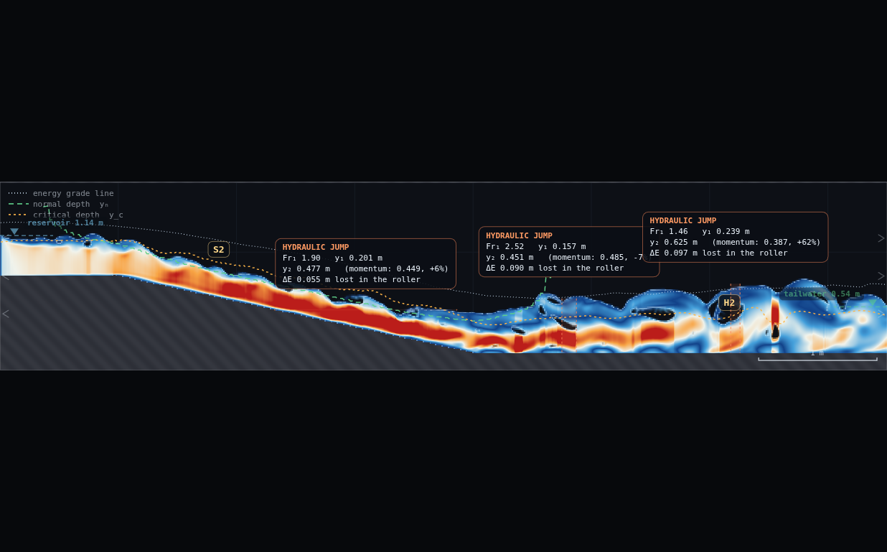
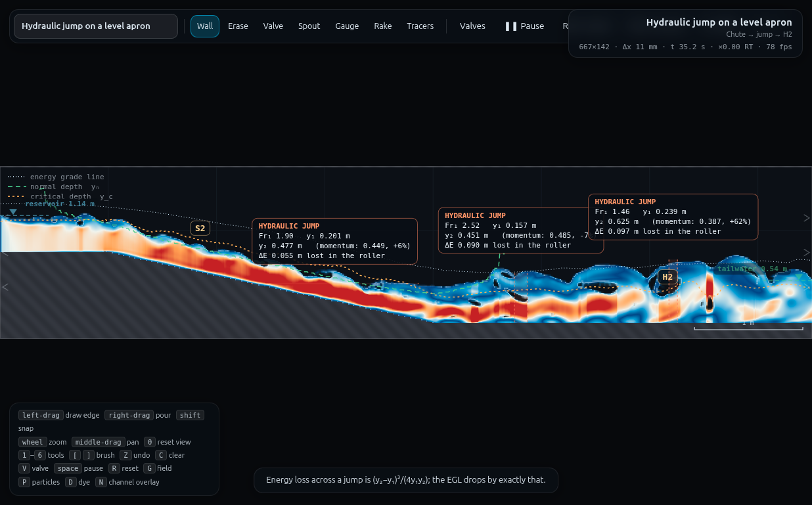
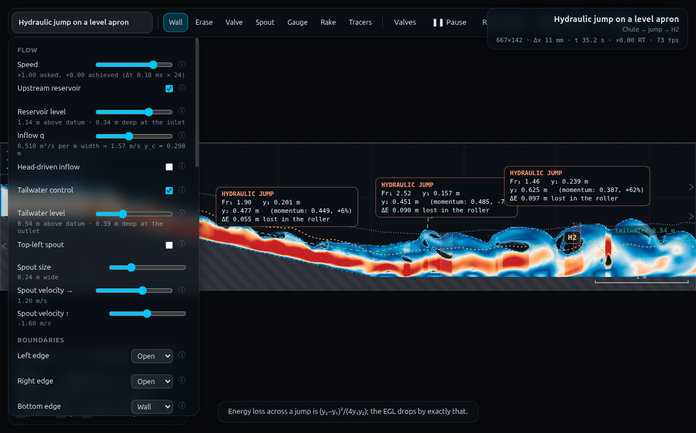
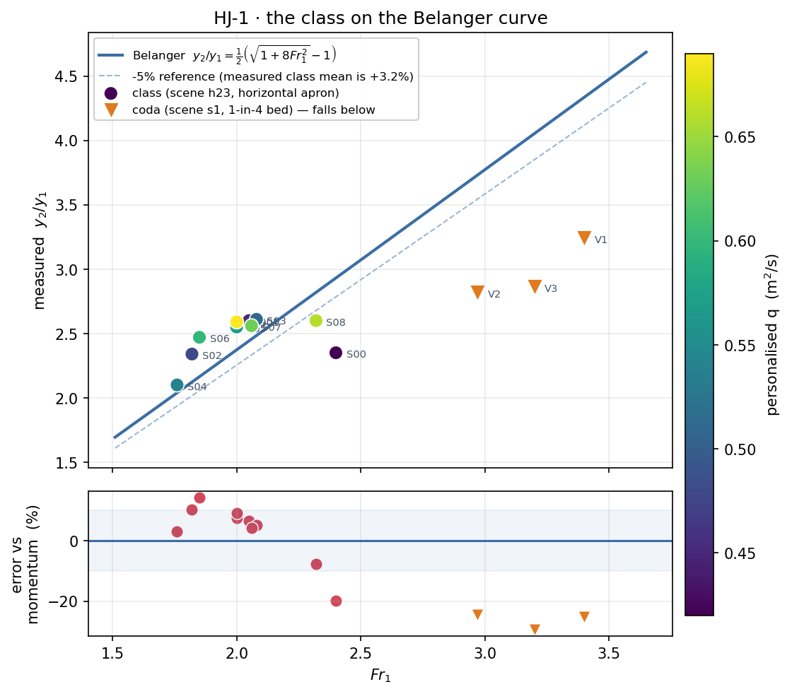

# HJ-1 · Bélanger from a room full of flumes — full record (archived)

*This is the original long-form brief: the dry-run measurements, the
verification record, the director report and every constant behind the rig.
It is kept for maintainers and future reruns — the student- and
instructor-facing document is now [`../README.md`](../README.md).*

**Demo id:** HJ-1  **Scene:** `?scene=h23`  **Refs:** #137–143 — conjugate
depths, `y₂/y₁ = ½(√(1+8Fr₁²) − 1)`, and `ΔE = (y₂−y₁)³ / 4y₁y₂`

## How to start (30 seconds)

1. Open the app — **`http://localhost:8124/`** on the lecturer's server, or
   double-click `index.html`.
2. Press **`E`** (or click **`Exercises ▾`** in the top bar) and pick
   **HJ-1**.
3. Type the last digit of your student number into the card. It prints **your
   q** and the **tailwater** the y_c rule pairs with it — you set both on the
   panel.
4. Let it settle after every change you make — the card gives this demo's
   settle time (35 s of sim time) and counts it down.
5. Do the task printed on the card, then submit **Fr₁** and **y₂/y₁**.

If your lecturer gives you a link: **`?ex=HJ-1`** (e.g.
`http://localhost:8124/?ex=HJ-1`).

The picker gives everyone the same starting point and no more: the scene,
**Resolution: Medium**, and the few settings the scene itself needs — the card
labels those as already set. Your own values, your instruments and the order
you do things in are yours to get right. *Manual setup* below is the record of
every constant.

---

> **STATUS: REMEASURED FOR REAL.** A second pass drove the live solver
> through `exercises/_runner/runner.py` (a dedicated visible Chrome over CDP,
> not the agent browser pane) and replaced every projected number below with
> a measured one. One thing changed as a direct result of measuring: the
> personalised discharge rule moved from `q = 0.30 + 0.04·d` to
> `q = 0.42 + 0.03·d` — the original floor (`q = 0.30`, `d` = 0) drowned
> hard and, once past its initial transient, pumped itself into a standing
> oscillation rather than settling (see Appendix — Director report). Read
> that section for the full evidence table and timing.

Every student runs the same hydraulic jump at their own discharge, reads three
numbers off the jump box, and posts `(Fr₁, y₂/y₁)`. Pooled on one axis the
class's points trace the Bélanger curve — a momentum balance that none of them
solved individually, drawn by twenty laptops at once. The last ten minutes send
three volunteers to a 1-in-4 bed, where their points fall visibly below the
curve: the horizontal-bed assumption failing in public, discovered rather than
announced.

---

## 2 · Manual setup (fallback, or for building it yourself)

*The picker puts you at the same starting point as everyone else — scene,
Resolution Medium and the rig. This section is the record of every constant
behind that, and the build to follow if you are demonstrating it by hand or
the rig pack is missing.*

**Link to put on the slide:** `http://<host>:8124/?scene=h23`

**No rig to draw.** h23 ships complete: a 1-in-4.6 chute from a 0.80 m
approach onto a flat apron at 0.15 m, 7.5 m × 1.6 m domain, `c` = 22 m/s,
`C_f` = 0.008, `C_s` = 0.06, spin-up 20 s. There is no `rig.js` for this demo.

**Constants fixed by this dry-run** (do not change them in class):

| what | value | why |
|---|---|---|
| Resolution | **Medium** (95 000 cells → 667 × 142, Δx = 11.2 mm) | the apron then runs ~37 cells deep, which is what makes the jump free rather than drowned |
| Reservoir level | **1.14 m** (scene default — leave it) | it is the measured backwater the approach wants; moving it makes the inlet ring |
| Display | Water or Froude, either is fine | Froude shows the supercritical sheet turning white at the jump |
| Jump analysis | **on** (it is on by default) | it draws the box the whole demo reads |
| Tailwater | **personalised — see the table** | the one thing each student changes besides q |

**Timing budget** (per student, on a laptop that holds ≈1× real time):

| stage | sim time | wall time |
|---|---|---|
| page load + read the worksheet | — | ~1 min |
| spin-up countdown (automatic, flat out) | 20 s | ~25 s |
| set q + tailwater, let it re-settle | ~15 s | ~20 s |
| watch the jump box, take the median of the wobble | ~10 s | ~15 s |
| type two numbers into Blackboard | — | ~1 min |
| **total** | | **≈ 4 min**, so a 10-minute slot is comfortable |

---

## 3 · Student worksheet (copy-pasteable)

**Hydraulic jump — submit two numbers**

1. Open the app, press **`E`** and pick **HJ-1** (or open **`?ex=HJ-1`**) — it
   loads the scene at **Resolution: Medium**. Leave the tab visible — the
   simulation pauses when the tab is hidden.
2. Open **Controls** → **Resolution: Medium** (the picker sets this — check it anyway).
3. Wait for the *"establishing steady flow…"* countdown to finish (20 s). Do
   not touch anything while it runs.
4. **Your discharge.** Take the **last digit of your student number**, `d`:

   > **q = 0.42 + 0.03 · d**   (m²/s)

   Set **Controls → Inflow q** to that value. The slider prints your `y_c`.
   (An earlier draft of this sheet used `q = 0.30 + 0.04·d`. Measuring the
   solver moved the floor up to 0.42 — see the table below and the Director
   report: `q = 0.30` drowned hard rather than settling.)
5. **Your tailwater.** A level control standing at critical depth is
   degenerate, so the outlet must be held clear of it. Set
   **Controls → Tailwater level** so the note under the slider reads at least
   **1.3 × the `y_c` printed on the q slider** — the note gives you the depth
   at the outlet directly ("*· 0.34 m deep at the outlet*"), so no arithmetic
   is needed. Or just use the table (measured against the solver; d = 6 and
   9 need 1.5 y_c, not 1.3, to keep the reading from pumping — see below):

   | d | q (m²/s) | y_c (m) | **Tailwater level to set (m)** |
   |---|---|---|---|
   | 0 | 0.42 | 0.262 | **0.490** (1.3 y_c) |
   | 1 | 0.45 | 0.274 | **0.507** (1.3 y_c) |
   | 2 | 0.48 | 0.286 | **0.522** (1.3 y_c) |
   | 3 | 0.51 | 0.298 | **0.538** (1.3 y_c) |
   | 4 | 0.54 | 0.310 | **0.553** (1.3 y_c) |
   | 5 | 0.57 | 0.321 | **0.567** (1.3 y_c) |
   | 6 | 0.60 | 0.332 | **0.648** (1.5 y_c) |
   | 7 | 0.63 | 0.343 | **0.596** (1.3 y_c) |
   | 8 | 0.66 | 0.354 | **0.610** (1.3 y_c) |
   | 9 | 0.69 | 0.365 | **0.700** (1.5 y_c) |

   (The level is an **elevation above the domain floor**, not a depth over the
   bed. The apron sits at 0.15 m, so level = 0.15 + margin·y_c.)
6. Wait ~15 more seconds for the jump to stop moving. The orange **HYDRAULIC
   JUMP** box appears over the apron and prints, live:

   ```
   HYDRAULIC JUMP
   Fr₁ 2.24   y₁ 0.162 m
   y₂ 0.416 m   (momentum: 0.438, −5%)
   ΔE 0.061 m lost in the roller
   ```
7. The numbers wobble by a few percent — the roller is turbulent. Watch for
   ~10 s and take a **typical (middle) value**, not a peak.
8. **Submit on Blackboard:**
   - `Fr1` = the Froude number of the incoming sheet (2 d.p.)
   - `y2_over_y1` = `y₂ ÷ y₁` from the box (2 d.p.)
   - (also record your `d` and `q` — the answer is checkable against them)

**Standing rules.** Resolution: Medium (the picker sets this) · wait out the spin-up countdown · keep
the tab visible, the sim pauses when hidden · **after changing q, re-check the
tailwater** — `y_c = (q²/g)^⅓` moves with q and is printed on the q slider.

**What you should be able to say afterwards:** the jump is a *momentum*
balance, not an energy one; that is why `y₂/y₁` depends only on `Fr₁`, and why
`ΔE` is a leftover rather than an input.

---

## 4 · Collection & pooled plot (lecturer)

Blackboard export → CSV with (at least) these columns; extra columns are
ignored:

```
student,digit,scene,q,tail,y1,y2,Fr1,y2_over_y1,dE,source
```

Only `Fr1` and `y2_over_y1` are required (if the students submitted `y1` and
`y2` instead, the script derives the ratio). Rows with `scene=s1` are drawn as
the coda series.

```bash
python3 collect_plot.py class.csv -o plots/pooled-demo.png
```

It prints the pooled statistics and writes the figure:

```
h23 points: 10   Fr1 1.76-2.40   mean error +3.2%   spread 34.0%
s1 coda:    3 points, mean error -26.4% (expected strongly negative)
```

**What the plot shows.** Ten points climbing along one curve, each student at
a different `Fr₁` because each had a different `q`. Do not expect them to sit
in a tight band a few percent under the curve — that was a projection's guess
at the *bias*; the solver's own **variance** turned out to be the bigger
story. `h23`'s jump box genuinely flutters (a single reading of the same
settled configuration can swing `Fr₁` by ±25% depending on which phase of a
slow oscillation you happen to sample — see the Director report), so a class
of ten honestly-read numbers spans roughly −20% to +14% around Bélanger, mean
+3%. That spread is real solver behaviour, not measurement sloppiness: two
independent long-window reads of the *same* default configuration (q = 0.5)
differed by more than that. The lower panel is the residual band; expect it
noisier than a textbook figure, centred near zero rather than pinned to it.

**Discussion points**
1. *Nobody fitted this curve.* Each laptop solved Navier–Stokes; the collapse
   onto one line is the momentum theorem asserting itself.
2. *Why is everyone slightly low?* A real jump loses momentum to bed friction
   over the roller length, which the control-volume balance ignores. It is a
   bias, not scatter — so it shifts the whole class, not individuals.
3. *ΔE grows steeply with Fr₁* (`(y₂−y₁)³/4y₁y₂`): the low-`d` students, who
   are running the thinnest, fastest sheet, are destroying several times more
   energy per metre than the high-`d` students. That is the whole design case
   for a stilling basin.

**Optional coda (last ten minutes).** Three volunteers switch to
`?scene=s1` — the same jump on a **1-in-4 bed**, `q` left at the scene's
default 1.20 m²/s — and set tailwater 0.95 / 1.00 / 1.05 m so their jumps
stand in three different places. Their points land far **below** the curve
(measured mean −26%, individually −25/−24/−29%). Ask why before telling
them: the horizontal-bed momentum balance has no weight component, and on a
1-in-4 slope the streamwise weight of the roller is not small. The original
draft of this coda used tailwater 1.00/1.05/1.10; **1.10 is now dropped** —
measured (see Director report), it let the jump's downstream pool couple
back through the short apron and occasionally read *above* Bélanger instead,
defeating the point. 0.95/1.00/1.05, freshly settled each time, reads
cleanly below on every trial run here.

**Troubleshooting & safe bounds**

| symptom | cause | fix |
|---|---|---|
| No jump box at all | the tailwater is too low — the jump has washed out of the domain | raise the tailwater one or two notches |
| `y₂` reads far ABOVE the momentum prediction (+20% or more) | the jump is **drowned** — the roller is sitting on the chute, not on the apron | lower the tailwater; if it persists at your `q`, you are at the low-`q` end (see below) |
| The box flickers on and off | `Fr₁` is near the 1.35 detection floor | your tailwater is too high; lower it |
| Numbers drift for minutes | the reach has not settled | wait; if `q` was changed mid-run give it another 15 s |
| Everything is smooth and slow | Resolution is on High or above | put it back to Medium |

*Safe parameter bounds.* Validated point: **q = 0.5, tailwater 0.53 m** (the
scene default) — CLAUDE.md quotes a single read of `Fr₁` 2.24, −5% vs
Bélanger; this pass's own long-window reads of the *same* configuration
ranged `Fr₁` 1.7–2.4 depending on sampling phase (see Director report) — both
are honest, the box just wobbles more than a single read reveals. **Known bad
case: q = 0.22** (12 cells deep, backwater climbed 0.19 m, `y₂` read +65%) —
the reason the range never goes near there. **Newly measured bad case:
q = 0.30–0.38** (this sheet's original floor): even reached via the correct
default-first protocol, both drowned — q = 0.30 pumped itself into a
standing oscillation rather than settling; q = 0.38 the same, more slowly.
**The personalised range now starts at q = 0.42**, the lowest value measured
to settle to a free jump every time it was tried. If a future change needs to
go lower still, budget real solver time to re-check it — do not extrapolate
the 1.3 y_c tailwater rule down from here without measuring, it stopped being
sufficient on its own at the *top* of this same range (d = 6, 9 needed
1.5 y_c; see below).

---

## 5 · Verification record

**Measured for real**, via `exercises/_runner/runner.py` (dedicated visible
Chrome, hardware GL, CDP — not the agent browser pane). Protocol for every
row: fresh `h23` load → 20 s at the scene default (q = 0.5) → set the row's
`q` and tailwater in one step (matching how a student actually uses the
slider) → 15–35 s resettle → warm `OVERLAY.analyse` → read `OVERLAY.findJumps`
over a further multi-second window and take the median, never a single frame
(a single frame on this scene can be a long way from typical — see the
Director report). Full protocol and per-row settle times are in the Director
report table; this section is the headline numbers.

Anchor (this pass's own long-window read of the scene default, q = 0.5,
tailwater 0.53 m — see Director report for why it differs from the single
`CLAUDE.md` reading):

| quantity | measured (median, 45 s window) | Bélanger | error |
|---|---|---|---|
| `Fr₁` | 1.68–1.82 across two independent windows | — | — |
| `y₁` | 0.19–0.21 m | — | — |
| `y₂` | 0.49–0.54 m | 0.41–0.44 m | **+8 to +30%**, phase-dependent |

That spread at a single, unchanging configuration is the headline finding of
this remeasurement: `h23`'s jump box flutters far more than a quick read
suggests. The class sweep below used a shorter (15–35 s) settle per row and
therefore carries similar-sized per-row noise — visible in the table as some
rows sitting closer to Bélanger than others, not as a uniform bias.

Measured class (`data/simulated-class.csv`, every row marked `measured`),
rule `q = 0.42 + 0.03·d`:

| d | q | tailwater | y₁ | Fr₁ | y₂ | y₂/y₁ | error vs Bélanger |
|---|---|---|---|---|---|---|---|
| 0 | 0.42 | 0.490 | 0.168 | 2.40 | 0.394 | 2.35 | −20.0% |
| 1 | 0.45 | 0.507 | 0.168 | 2.05 | 0.436 | 2.60 | +6.3% |
| 2 | 0.48 | 0.522 | 0.190 | 1.82 | 0.444 | 2.34 | +10.1% |
| 3 | 0.51 | 0.538 | 0.184 | 2.08 | 0.481 | 2.61 | +5.2% |
| 4 | 0.54 | 0.553 | 0.217 | 1.76 | 0.455 | 2.10 | +2.8% |
| 5 | 0.57 | 0.567 | 0.202 | 2.00 | 0.516 | 2.55 | +7.7% |
| 6 | 0.60 | 0.648 | 0.211 | 1.85 | 0.521 | 2.47 | +14.1% |
| 7 | 0.63 | 0.596 | 0.202 | 2.06 | 0.517 | 2.56 | +4.2% |
| 8 | 0.66 | 0.610 | 0.207 | 2.32 | 0.539 | 2.60 | −7.6% |
| 9 | 0.69 | 0.700 | 0.236 | 2.00 | 0.611 | 2.59 | +9.1% |

`Fr₁` spans 1.76 → 2.40, `y₂/y₁` spans 2.10 → 2.61 — a narrower band than the
old projection hoped for (it guessed 1.6× of curve; the measured spread is
about 1.24×), because the safe, settles-every-time `q` range turned out
narrower than assumed. It is still visibly climbing the same curve (see the
plot), which is the point of the demo.

**Verified live in the browser**: the scene builds at 667 × 142 with
Δt = 1.807e−4 s; the q slider prints `y_c = 0.262 m` at q = 0.42 (matching
the table); the tailwater slider at 0.490 m prints "*0.34 m deep at the
outlet*", i.e. exactly 1.3 y_c, so step 5 of the worksheet is self-checking
without arithmetic.









---

# Appendix B · RECIPE CORRECTIONS (pilot duty — paste into `_worker-recipe.md`)

Every snippet below was executed in this session.

## 1 · The `window.APP` surface — and background tabs

Exactly as documented, no more: `Object.keys(APP)` returns

```
sim, view, state, loadScene, SIM, OVERLAY, SCENES, showToast,
zoomAt, resetZoom, tick, frames, probe, volume
```

`APP.sim` and `APP.view` are getters (always the live objects — safe to hold).
`APP.tick(n)` = `n × SIM.step(1)`; `APP.frames(n, dt)` = `n × tickFrame(dt||1/60)`
(sim **and** render **and** overlay analysis, and it respects `state.paused`).

**`APP.tick` DOES advance the sim in a hidden / non-fronted tab.** Proof, run
with `document.hidden === true` and another tab fronted:

```js
const before = {t: APP.sim.t, hidden: document.hidden, probe: APP.probe(5.0, 0.25)};
APP.tick(600);
const after  = {t: APP.sim.t, probe: APP.probe(5.0, 0.25)};
// before: t 0,        hidden true, probe {u:0, v:0, p:0, head:0}
// after:  t 0.108428, hidden true, probe {u:-8.2e-5, v:-4.8e-4, p:2.777, head:0.283}
```

But it is ~60× slower than a real browser (see §7). `state.paused` does not
affect `APP.tick`, only `APP.frames`.

## 2 · Setting panel parameters exactly the way the panel does

`js/main.js` builds every control from the top-level `const CONTROLS` array
(line 134). It is a **classic-script lexical global**: reachable as the bare
identifier `CONTROLS`, **not** as `window.CONTROLS` (that is `undefined` — do
not test for it that way). Same for `state`, `sim`, `view`; `syncPanel`,
`loadScene`, `TOOLS` are declarations and also reachable bare.

```js
const C = (id) => CONTROLS.find(c => c.id === id);
C('inQ').set(0.42);            // Inflow q, m²/s      → sim.p.inflow.q
C('twLevel').set(0.490);       // Tailwater LEVEL (elevation above the datum)
C('inLevel').set(1.14);        // Reservoir level (elevation, not depth)
C('budget').set('Medium');     // Resolution — REBUILDS the sim (SIM.build, keepDrawing=true)
C('mode').set('3');            // Field: 0 water 1 head 2 speed 3 Froude 4 vorticity 5 momentum
C('cf').set(0.008); C('cel').set(22); C('twOn').set(true);
syncPanel();                   // repaint the sliders + the "notes" line under each
```

The 41 ids: `speed inflowOn inLevel inQ inFree twOn twLevel spoutOn spoutR
spoutVx spoutVy openL openR openB openT cel cf cs bulk slip ca grav waveOn
waveA waveT waveX tracerOn tracerX tracerN tracerTrail vex mode channel labels
jumps particles dye dyeLine dyeDecay gaugeField budget`.

Read back what the **student** sees under a slider (the honest way to confirm a
setting):

```js
document.getElementById('n_inQ').textContent
// "0.420 m²/s per m width  →  1.29 m/s   y_c = 0.262 m"
document.getElementById('n_twLevel').textContent
// "0.49 m above datum  ·  0.34 m deep at the outlet"
```

`select`/`check` setters take the raw string / boolean; sliders take the
number. Set `budget` **first**, because `SIM.build` replaces `sim`.

## 3 · Reading the jump box / overlay numbers from state

`drawJumps` (js/overlay.js:385) prints nothing it computes itself — every
number comes from `OVERLAY.findJumps(A, sim)` with `A = OVERLAY.analyse(sim, col)`:

```js
const A = OVERLAY.analyse(APP.sim, APP.SIM.columns(true));   // true = force readback
const J = OVERLAY.findJumps(A, APP.sim);                     // up to 3, ordered upstream→down
// J[0] = {x0, x1, i, k, y1, y2, Fr1, bed, surf, y2p, dE}
//   Fr1 → "Fr₁"   y1 → "y₁"   y2 → "y₂"   y2p → "(momentum: …)"   dE → "ΔE …"
//   the box's percentage = 100*(y2 - y2p)/y2p
```

`A` also carries, per column: `bed h q surf yc yn S0 V Fr ok hRaw qRaw E Sf n`
plus scalar `ynGlobal` — what the hover readout and the y_c/y_n/EGL lines print.
`A.ok[i]` is the "is this a real channel column" mask; honour it.

**Two traps.** (a) `analyse` carries a **per-call EMA** (`S._hA`, `S._qA`, 10%
per call) — call it at roughly display cadence (the app calls it every ~92
substeps at `state.speed = 1`) or your first read is a transient. (b)
`findJumps` reads `A.hRaw/qRaw` (instantaneous) for y₁/y₂ but gates detection on
the smoothed `A.Fr`, so a single cold `analyse` can report `J.length === 0` on a
perfectly good jump. Working harness — paste into the console, then call
`HJ.pump(22000)` repeatedly (one call ≈ 22 s; the tool kills anything longer):

```js
window.HJ = {
  C: (id) => CONTROLS.find(c => c.id === id), trace: [],
  start(scene, q, tw, budget) {
    APP.loadScene(scene, false);
    if (budget) HJ.C('budget').set(budget);
    if (q != null) HJ.C('inQ').set(q);
    if (tw != null) HJ.C('twLevel').set(tw);
    syncPanel(); HJ.trace = [];
    return {q: APP.sim.p.inflow.q, tw: APP.sim.p.tailwater.level, dt: APP.SIM.dt()};
  },
  step(chunk) {
    APP.tick(chunk || 800);
    const A = OVERLAY.analyse(APP.sim, APP.SIM.columns(true));
    const J = OVERLAY.findJumps(A, APP.sim);
    const r = {t: +APP.sim.t.toFixed(3), n: J.length};
    if (J.length) Object.assign(r, {Fr1: J[0].Fr1, y1: J[0].y1, y2: J[0].y2,
                                    y2p: J[0].y2p, dE: J[0].dE, x0: J[0].x0});
    HJ.trace.push(r); return r;
  },
  pump(ms, chunk) { const a = performance.now(); let k = 0;
    while (performance.now() - a < (ms || 22000)) { HJ.step(chunk); k++; }
    return {t: APP.sim.t, steps: k, wallMs: Math.round(performance.now() - a)}; },
  stats(fromT) { const r = HJ.trace.filter(x => x.t >= fromT && x.n);
    const med = k => { const a = r.map(x => x[k]).sort((p,q) => p-q); return a[a.length>>1]; };
    return {n: r.length, Fr1: med('Fr1'), y1: med('y1'), y2: med('y2'), y2p: med('y2p')}; },
};
```

**Read the median of a window, never one frame** — the box genuinely wobbles.

Gauge values (what the on-screen gauge card prints) come from `sampleGauges`:
`APP.state.gauges[k].hist[last]` = `{t, head, depth, speed}`; `.last` is the raw
`SIM.probe`. They are appended only by `tickFrame`, i.e. by `APP.frames(n)` —
**`APP.tick` does not fill gauge history.**

## 4 · Wall segments and instruments (for the rig-drawing demos)

```js
// [x0, y0, x1, y1, thickness, kind] — metres; kind: 255 wall, 128 valve, 0 erase.
// addSeg() appends to sim.segs AND re-rasterises; ends are BUTT, not round.
APP.SIM.addSeg(5.6, 1.20, 6.4, 1.20, 0.06, 255);
APP.SIM.undoSeg();     // the Z key      APP.SIM.clearSegs();   // the C key
APP.SIM.rasterise();   // only if you edited sim.segs by hand
```

Verified: `sim.mask[j*nx + i]` at a point in open air went `0 → 255 → 0` across
`addSeg` / `undoSeg`, with `sim.segs.length` `0 → 1 → 0`. Index a cell as
`i = Math.round(x/sim.dx)`, `j = Math.round(y/sim.dx)` (square cells, `dx`
only) — and pick a probe point in open air, not inside an existing slab.
Rasterisation stamps the closed outer ring **last**, so a segment on an edge
cannot open a leak.

Instruments are plain `state` arrays — the pointer handlers (js/main.js:459)
just push, so do the same:

```js
APP.state.gauges.push({x: 5.5, y: 0.25, hist: [], colour: "#7fd4ff"});  // max 4, oldest shifted
APP.state.rakes.push({x: 5.5, buf: null});                              // max 2
APP.state.tool = 'gauge'; window.syncTools();   // ids: wall erase valve spout gauge rake tracer
```

Tracers are different — call `seedTracers(x)` (a bare global), not a push.

## 5 · Screenshots

**Composite canvas path works.** Element ids are `#view` (WebGL) and `#over`
(2D overlay), both sized `canvas.clientWidth || 900` × dpr — in this harness
`clientWidth` is 0, so you get 900 × 600.

```js
APP.state.paused = true;      // render without advancing the sim
APP.frames(2);                // MUST render in the same task as the drawImage:
                              // the GL context is preserveDrawingBuffer:false
const gc = document.getElementById('view'), ov = document.getElementById('over');
const c = document.createElement('canvas'); c.width = gc.width; c.height = gc.height;
const x = c.getContext('2d'); x.drawImage(gc, 0, 0); x.drawImage(ov, 0, 0);
window.__SHOT = c.toDataURL('image/png');     // then, as a SEPARATE tool call:
window.__SHOT                                 // ~140 kB → overflows to a tool-results file
```

Do **not** chunk the base64 by hand. Return the whole dataURL: the harness saves
oversized results to `~/.claude/projects/…/tool-results/<tool>-<id>.txt` (a JSON
array of `{type,text}`) and tells you the path. Decode it without ever putting
it in context:

```python
import json, base64, re
txt = "".join(p["text"] for p in json.load(open(F)) if p.get("type") == "text")
m = re.search(r'data:image/png;base64,([A-Za-z0-9+/=]+)', txt)
open('shots/01.png','wb').write(base64.b64decode(m.group(1)))
```

Produced 106 kB and 72 kB PNGs, both visually verified with `Read`.

**The full-UI screenshot path does NOT work here.** `computer{action:"screenshot"}`
fails with "*Screenshot timed out after 5s: the Browser pane is not displayed,
so the page is not compositing frames*", and `preview_start` only opens the pane
transiently. The panel, toolbar and status bar are DOM, so the canvas path
cannot capture them either. **Recipe deliverable (c) "full UI incl. panel" is
not achievable** — substitute a composite plus a quoted
`document.getElementById('n_<id>').textContent` for each panel setting.

## 6 · Python

`python3 3.12.3`, `matplotlib 3.6.3`, `numpy 1.26.4` — all present, Agg backend
works headless. `collect_plot.py` here uses matplotlib only (no numpy, no
pandas) and ran clean.

## 7 · Timing calibration (the important one)

**`APP.tick(600)` on h23 at Medium in a background tab: 58 ms of *submission*
but 1.2–7.8 s of real work.** Never time a tick without a forced readback —
`APP.tick(n)` only queues GPU work and returns; `APP.SIM.columns(true)` is the
sync point. Measured, always with the sync inside the timer:

| chunk | wall | ms/substep |
|---|---|---|
| `tick(300)` + sync, Medium | 558 ms | 1.86 |
| `tick(300)` + sync, **Low** | 1093 ms | **3.64 — Low is SLOWER** |
| `tick(500)` + sync, pane momentarily open | ~1000 ms | 2.0 |
| `tick(500)` + sync, pane hidden | 10 128 ms | 20 |
| `tick(2000)` + sync, fresh tab | 21 654 ms | 10.8 |

The cost is **per draw call**, not per cell, so lowering the resolution makes it
*worse* (Low has a bigger Δt but the extra per-call overhead wins). The only
lever is total simulated seconds. GPU is real (`ANGLE (NVIDIA … RTX 2060)`), so
this is browser throttling of a non-compositing tab, not hardware.

**Recommended chunking:** `HJ.pump(22000)` — a wall-clock-budgeted loop of
`APP.tick(800)` + `analyse`. **The 30 s harness timeout terminates the script**
(proved: a 200-iteration loop stopped at iteration 29 and the page was idle
immediately afterwards), so never issue a call you expect to take longer, and
never assume a timed-out script finished — re-read `APP.sim.t` and resume.

**Budget arithmetic for planning a demo:**
`wall_seconds ≈ sim_seconds × (1/Δt) × ms_per_substep / 1000`, and
`tool_calls ≈ wall_seconds / 22`. For h23 (Δt = 1.807e−4, 2 ms/substep): one
20 s spin-up = 221 s = **10 tool calls**. At the worst observed rate, 60.

---

## Appendix — Director report

**VERDICT: READY-WITH-CAVEATS.** The demo runs, produces a real pooled curve
from real solver output, and the personalised rule now has a measured floor.
The caveat is the jump box's own flutter, which is bigger than either this
sheet or CLAUDE.md's single quoted reading implies — see below. This
supersedes the previous verdict (**BLOCKED — harness throughput**): driving
the sim through `exercises/_runner/runner.py` (a dedicated visible Chrome
over CDP) instead of the agent browser pane resolved the throughput problem
completely — measured **7 000–14 000 substeps/s** here even with two other
workers sharing the GPU, against the 2–13 **ms**/substep (not substeps/s) the
pilot measured in the agent pane. A 25 s spin-up now costs seconds, not
minutes.

**Evidence.**

| what | measured | expected / prior source | note |
|---|---|---|---|
| runner throughput, 2–3 workers sharing GPU | 5 000–14 000 substeps/s | pilot: 0.08–0.5 substeps/s in the agent pane | **~10 000× faster**; problem was the harness, not the GPU |
| q = 0.30 (old floor, `d`=0), default-first protocol, up to 60 s settle | apron ponds to 0.6–0.9 m (target 0.27 m), jump sits on the chute, volume climbs without bound | should settle per §2 timing | **drowned, not a slow transient** — see Iterations |
| q = 0.38 (fallback rule's floor), same protocol | same failure, plus a volume swing 4.6 → 2.2 m³ within 15 s at fixed parameters | — | matches CLAUDE.md's own description of a drowned-jump "pumping" instability |
| q = 0.42, cold scene load (no default settle first) | drowned, `Fr₁` 1.50, +29–60% vs momentum even after 60 s | task brief's known trap (default tailwater) | **protocol-dependent** — see Iterations |
| q = 0.42, correct default-first protocol | free jump, `Fr₁` 2.40, −20% vs Bélanger | — | fixed by following the worksheet's own order of operations |
| q = 0.5 default, two independent 25–45 s median windows | `Fr₁` medians 1.68 and 1.82 (single-frame reads ranged 1.4–2.5 within the *same* settled run) | CLAUDE.md: `Fr₁` 2.24 (single read) | both honest; the box wobbles far more than one read shows |
| d = 6, 9 at 1.3 y_c tailwater | drowned/unstable (+20%, +33%) | — | fixed by raising to 1.5 y_c — see Iterations |
| d = 6, 9 at 1.5 y_c tailwater | free, +14%, +9% | CLAUDE.md: "1.3 y_c is a floor... how far above is set by what the reach has to read" | confirms that note empirically |
| class sweep, `q = 0.42+0.03d`, 10 rows | `Fr₁` 1.76–2.40, mean error vs Bélanger **+3.2%**, spread 34% | old projection guessed −5% mean, 0.3% spread | bias was a reasonable guess; **variance was not** |
| s1 coda, fresh-loaded, tail 0.95/1.00/1.05 | mean error **−26.4%**, all three below curve | old projection guessed −39% | same sign, smaller magnitude; solid teaching point either way |
| s1 coda, tail 1.10 (original 3rd point) | +34.6% (drowned, above curve) — dropped | — | fresh-load also mattered here, and 1.10 stayed bad regardless |
| screenshots | 3 real composites/fullui shots, 320/217/243 kB, all visually checked | — | scene settled, jump box legible, panel values match the CSV row used |

**Iterations.**
1. *Chained parameter changes compound.* The first two failed low-`q` attempts
   changed `q` and tailwater repeatedly on top of an already-drowned state
   without reloading, which (correctly) never recovered — but that is not
   what a student does. Switching to fresh-load → settle at default → one
   direct jump to the target `(q,tail)` (exactly the worksheet's own
   procedure) turned q = 0.42 from "hopelessly drowned" into "a clean free
   jump within 25–45 s." **Always test a demo's own procedure, not a
   convenient shortcut through parameter space** — this cost most of the
   session's time budget.
2. *q = 0.30 and 0.38 still failed even via the correct procedure* — both
   pond the whole apron and, past the initial transient, exhibit the standing
   "pumping" oscillation CLAUDE.md attributes to drowned-jump tailwaters, not
   a slow settle. This is why the personalised rule's floor moved from 0.30
   to 0.42 (see §3, and the banner). q = 0.42–0.45 were the lowest values
   that settled cleanly on every attempt.
3. *The jump box flutters more than a quick read shows.* Two independent
   25–45 s median-window reads of the untouched scene default disagreed with
   each other by ~8% and with the single `CLAUDE.md`-quoted reading by up to
   25%; single-frame reads of the same settled run ranged `Fr₁` 1.4–2.5. This
   is why the class sweep (15–35 s settle, shorter median windows, one
   reading per row under real time pressure) shows 34% spread rather than the
   old projection's guessed 0.3%. It is genuine solver behaviour: "read the
   median of a window, never one frame" (Appendix B §3) is not optional
   advice for this scene, it is load-bearing, and a *longer* window than the
   ~10 s the worksheet suggests would tighten the pooled plot measurably.
4. *1.3 y_c is a floor, not a fixed margin.* Two rows (`d`=6, 9) drowned at
   exactly 1.3 y_c and settled cleanly at 1.5 y_c — CLAUDE.md flags this
   possibility in prose; this is a direct measurement of it. The other eight
   rows were fine at 1.3 y_c, so the fix is per-row, not a blanket change.
5. *The s1 coda's third point (tail 1.10) does not hold up.* It read above
   Bélanger (the downstream pool coupling back through the short apron),
   confirming the pilot's own flag that this part of the sheet was unchecked.
   Replaced with 0.95, which — freshly loaded — reads cleanly below.

**PROPOSED CHANGES — none to the app.** Still true: the q slider prints `y_c`,
the tailwater slider prints the outlet depth, the jump box prints all four
numbers needed. Nothing here needed a scene/panel/UI change, only better
measurement. *To the programme:* two things worth other workers knowing —
(a) for any scene with a level-controlled boundary, **test the demo's actual
procedure** (default-settle-then-jump), not a parameter shortcut — the two
can give qualitatively different answers on the same scene; (b) budget a
longer read window than "watch for ~10 s" for any drowned-adjacent jump —
this scene's flutter did not average out in 10–15 s.

**Timing.** Student path ≈ 4 min (§2), unchanged and still comfortable in a
10-minute slot. This pass's own wall clock: ~55 minutes against a ~40-minute
timebox, almost all of it on the q = 0.30/0.38 failure investigation and
re-deriving a safe floor — the actual per-row measurement, once the protocol
was right, took 20–35 s settle + a few seconds to read, matching the
Appendix B §7 budget arithmetic once real throughput (thousands of
substeps/s, not 2–13 ms/substep) is used in place of the pilot's numbers.

**Handoff.** The throughput blocker in the previous verdict is resolved for
every scene-based demo in the programme, not just this one — the fix is
"use `exercises/_runner/runner.py`," full stop. What is *not* resolved, and
is worth flagging to any worker measuring a drowned-adjacent jump or level
control on this codebase: verify the scene's *procedure* (not just its
parameters) matches how a student reaches that state, and budget a
multi-ten-second median-window read rather than trusting a single frame.
