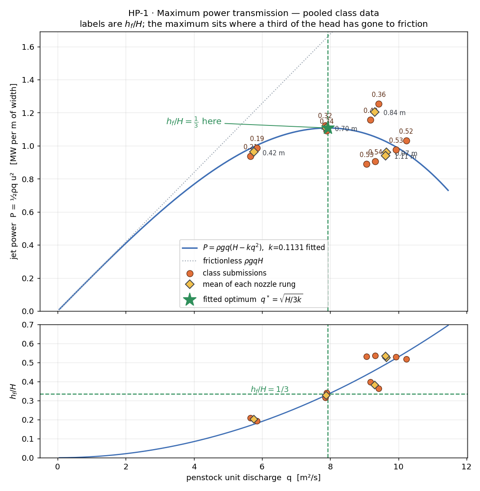

# HP-1 · Maximum power transmission

A hydro scheme feeds a 49 m penstock from a reservoir about 21 m above it and
throws the water out of a nozzle. A big nozzle passes lots of water slowly; a
small nozzle throws a fast, thin jet. Somewhere in between the jet carries the
most power — and the class finds where, one nozzle each.

**Open it:** press **E** in the [app](https://barneydobson.github.io/hydraulician/)
and pick **HP-1**, or use the direct link
[`?ex=HP-1`](https://barneydobson.github.io/hydraulician/?ex=HP-1).
How to run any exercise: see the [teaching pack index](../INDEX.md#running-an-exercise).

## Theory

The penstock loses head to friction as the square of the discharge, and what
is left arrives as jet velocity:

    h_f = k·q²        v = √(2g(H − h_f))   ⇒   h_f = H − v²/2g

so the jet's power per metre of width is

    P = ρ·g·q·(H − k·q²)  =  ½·ρ·q·v²

Set dP/dq = 0 and the maximum lands at **h_f = H/3**, *whatever* k is: at
peak power, one third of the head is burned in the pipe. That design rule is
what the class measures. Here the static head is **H = 21.35 m** (measured:
reservoir surface above the pipe axis).

## Your nozzle gap

**d** is the **last digit of your student number** — your lecturer will
explain the assignment in class. Look up **d mod 5**:

| d mod 5 | 0 | 1 | 2 | 3 | 4 |
|---|---|---|---|---|---|
| **gap (m)** | 0.42 | 0.70 | 0.84 | 0.97 | 1.10 |

## What to do

1. Resize the nozzle at x = 56.5 m to **your gap**, centred on the pipe
   axis — Erase (`2`), Wall (`1`) and Measure (toolbar).
2. Press `R` and let it reach steady state — about **50 s**; the card counts
   it down.
3. Measure the flow **q** (hover the pipe) and the jet speed **v** just past
   the nozzle (**Field → Speed**, hover the bright core), and submit
   **gap, q, v**.

## For the instructor — pooling the class

Collect one row per student (`student_id,digit,gap_m,q,v`), export the CSV
and run:

```bash
python3 collect_plot.py class.csv                # -> plots/pooled-demo.png
python3 collect_plot.py data/simulated-class.csv # the shipped dry-run class
```

The script computes h_f = H − v²/2g and P = ½ρqv² per point (H = 21.35 m),
fits h_f = k·q², and plots P against q with the frictionless ρgqH line
running away above; the lower panel plots h_f/H against q with the ⅓ line
across it.



### Discussion points

- **Where did the head go?** Switch Field → Pressure head: the drop is
  concentrated at the throttle plate at x = 8 m — the stand-in for 49 m of
  distributed pipe friction. A real penstock spreads the same loss along its
  whole length.

The full verification record — why the friction must be a drawn plate, the
measured five-gap ladder, settle-time evidence, safe bounds and
troubleshooting — is archived in the repository at
`exercises/HP-1-penstock-power/_archive/README-full.md`.
