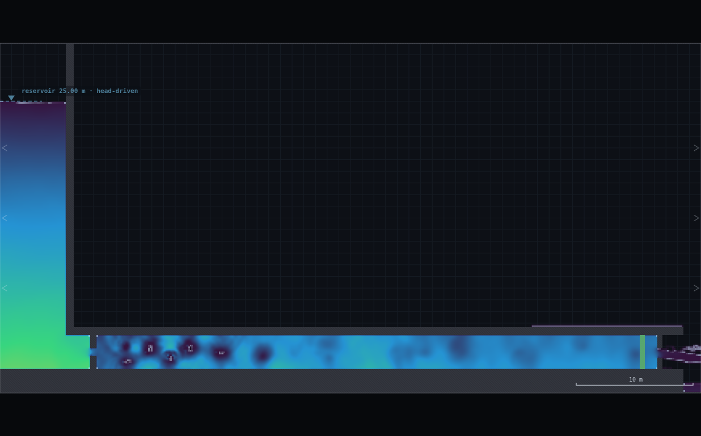
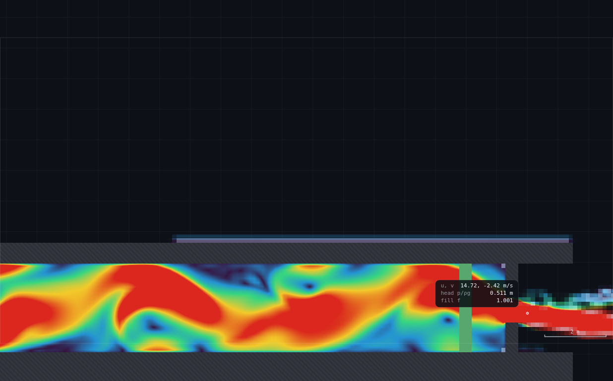
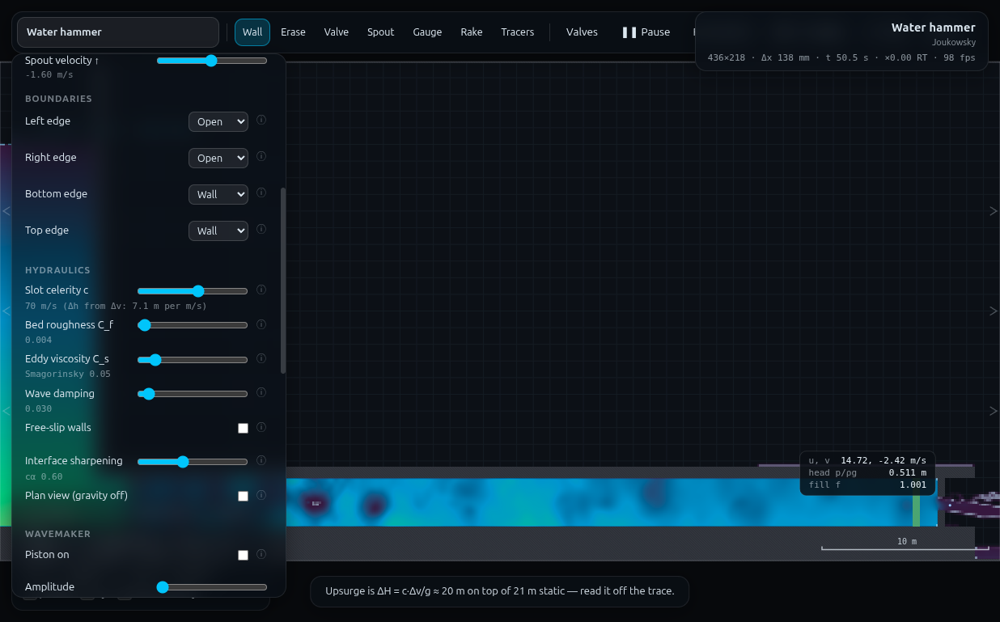

# HP-1 · Maximum power transmission — the class finds h_f = H/3

**Demo id** HP-1 · **Topic** Hydropower · **Scene** `?scene=hammer` ·
**Submit** (gap, q, v) · **Refs** H2, H22–H26 — P = ρgQ(H − kQ²)

## How to start (30 seconds)

1. Open the app — **`http://localhost:8124/`** on the lecturer's server, or
   double-click `index.html`.
2. Press **`E`** (or click **`Exercises ▾`** in the top bar) and pick
   **HP-1**.
3. Type the last digit of your student number into the card. It prints **your
   nozzle gap** (d mod 5) — you draw it. No physics slider moves in this demo.
4. Let it settle after every change you make — the card gives this demo's
   settle time (50 s of sim time) and counts it down.
5. Do the task printed on the card, then submit **gap**, **q** and **v**.

If your lecturer gives you a link: **`?ex=HP-1`** (e.g.
`http://localhost:8124/?ex=HP-1`).

The picker gives everyone the same starting point and no more: the scene,
**Resolution: Medium**, the rig geometry, and the few settings without which
the rig is not a working rig — the card labels those as already set. Your own
values, your instruments and the order you do things in are yours to get
right. If your build ships without the rig pack the card says so; then draw it
by hand from *Manual setup* below.

---

Every student gets their own nozzle on the same 49 m penstock, measures the
discharge it passes and the velocity of the jet it throws, and submits three
numbers. Pooled, the class's jet power **rises, peaks and falls**, and at the
peak a third of the reservoir head has been eaten by the penstock. Nobody is
told that; it falls out of ten points on a board.

Measured here: the pooled maximum sits at the middle rung of the gap ladder,
and the two rungs that straddle it read **h_f/H = 0.323 and 0.372 against the
theoretical ⅓ = 0.333**.

> **Read this before you plan the lecture.** The programme entry says to
> deliver the friction by *"C_f raised to a prescribed value"*. **That does not
> work, and no panel knob does** — see §1.1. The friction has to be a piece of
> geometry the class draws: a second plate near the pipe entrance. Every knob
> stays at its scene default, which is the one good side-effect: the demo
> leaves nothing dialled in to pollute UN-1 / UN-2.


---

## 1 · Manual setup (fallback, or for building it yourself)

*The picker puts you at the same starting point as everyone else — scene,
Resolution Medium and the rig. This section is the record of every constant
behind that, and the build to follow if you are demonstrating it by hand or
the rig pack is missing.*

**Link:** `index.html?scene=hammer`

### 1.1 The friction knob — measured, and why there isn't one

All four rows below are the same nozzle (0.56 m) on the unmodified scene.
`h_f` is what the demo's own arithmetic returns, `H − v²/2g`, with v probed in
the jet core.

| setting | q (m²/s) | jet v (m/s) | h_f (m) | h_f/H | verdict |
|---|---|---|---|---|---|
| C_f 0.004 (default), C_s 0.05 | 8.04 | 20.61 | 0.09 | 0.004 | frictionless |
| **C_f 0.25** (62× the default) | 7.15 | 20.14 | 0.73 | **0.034** | **inert** |
| **C_s 0.40** (panel maximum) | 7.50 | 18.98 | 3.00 | **0.140** | best knob, still 2.4× short |
| C_s 0.40, gap 0.83 / 1.10 / 1.24 | 11.8 / 16.0 / 18.1 | 20.5 / 20.5 / 20.4 | ≈ 0 | **0.00** | invisible to the probe |

Two separate failures, and the second is the fatal one:

1. **C_f is inert**, exactly as FR-1 found in its 18-cell bore. 62× the
   roughness buys 3.4% of the head. The shader applies bed drag only to
   wall-adjacent cells, whose velocity saturates.
2. **The loss C_s does make is a wall-shear loss, and a jet-core probe cannot
   see it.** The core streamline runs down the middle of the pipe and never
   touches the boundary layer, so it arrives at the nozzle carrying the full
   reservoir head. Measured directly: at C_s = 0.40 and V = 5.52 m/s the
   piezometric head falls 0.37 m between x = 24 and x = 54 (≈ 0.6 m over the
   whole penstock, 2.9% of H) — while the jet core still reads
   20.5 m/s = √(2gH). Raising C_s further cannot fix a measurement that is
   blind to the thing being raised.

**What does work is a form loss**, because a Borda–Carnot loss is destroyed in
mixing and is therefore suffered by *every* streamline, core included. So the
penstock's resistance is a plate:

### 1.2 The rig — TWO plates

| plate | station | gap | who draws it |
|---|---|---|---|
| **penstock plate** ("the friction") | **x = 8.0 m** | **0.70 m**, fixed | every student, identical |
| **nozzle plate** | x = 56.5 m (the scene's own) | personalised, 0.42 – 1.10 m | every student, their own |

Both are centred on the pipe axis, y = 3.5. `rig.js` builds the whole thing:
`HP1.build(0.84)`, `HP1.student(0.84)`.

*Why x = 8 and not mid-pipe.* Tried at x = 20 first. It works, but it leaves
only 36 m for the flow to recover and the jet reading wobbles half again as
much (±6% against ±4%); worse, the widest nozzle collapses — with the plate at
x = 20 and a 1.10 m nozzle the bore de-pressurised and the column reduction
returned q = 0.39. At x = 8 the same rung is stable. Put the resistance at the
intake.

*Why 0.70 m.* At the optimum the nozzle converts 2H/3 and the penstock plate
eats H/3, so for two plates of similar discharge coefficient the resistance gap
must be about √2 × the optimum nozzle gap. 0.70 m puts the pooled maximum on
the middle rung of the ladder. 0.84 m and 1.10 m were both measured: 1.10 m
leaves h_f/H below 0.19 at *every* rung and the curve never turns over.

### 1.3 Constants fixed by the dry-run

| setting | value | why |
|---|---|---|
| Resolution | **Medium** (436 × 218, Δx = 0.1376 m) | both gaps quantise to a whole number of cells; the ladder IS the cell count |
| C_f, C_s, celerity, wave damping | **scene defaults** (0.004 / 0.05 / 70 / 0.030) | nothing to dial, nothing to reset |
| Reservoir | 25.0 m, head-driven (default) | but see below |
| **Static head H** | **21.35 m** | **measured.** The delivered reservoir surface settles at 24.85–24.87 m, ~0.14 m under the slider; the pipe axis is at 3.5 m. Use 21.35, not 21.5 |
| Settle | **50 s** (not the scene's 10 s countdown) | measured — see §5 |
| Jet probe station | **x = 57.0 m**, in the core | 0.25 m past the plate's downstream face |
| q read at | **x = 30 m** (mid-pipe hover readout) | |

**Timing budget.** One student run is 50 simulated seconds of settling plus
~15 s of reading. On the dry-run machine (three workers sharing the GPU) a
complete measured run took **20 s of wall clock**; on a lecture-hall laptop
budget 60–90 s. With drawing and re-reading, **8 minutes**.



---

## 2 · The personalised parameter — five rungs

`d` = **last digit of your student number**.

> ### Your nozzle gap: look up **d mod 5** in the table

| d mod 5 | 0 | 1 | 2 | 3 | 4 |
|---|---|---|---|---|---|
| **gap (m)** | **0.42** | **0.70** | **0.84** | **0.97** | **1.10** |
| cells at Medium | 3 | 5 | 6 | 7 | 8 |
| q (m²/s), measured | 5.57 | 7.96 | 8.83 | 9.40 | 10.19 |
| jet v (m/s), measured | 18.30 | 16.85 | 16.21 | 14.90 | 13.38 |
| h_f/H | 0.203 | 0.323 | **0.372** | 0.469 | 0.572 |
| P (MW per m) | 0.933 | 1.129 | **1.160** ← peak | 1.044 | 0.912 |

**Two gaps in the arithmetic sequence are deliberately missing, and both were
measured before being dropped:**

- **0.28 m (2 cells).** The jet is two cells thick, so the interface (itself
  ~2 cells) eats the core: the probe reads 17.9 m/s where continuity demands
  more, and h_f/H comes out at 0.237 — *higher* than the 3-cell rung's 0.203,
  which is impossible. Smallest usable jet is 3 cells.
- **0.56 m (4 cells).** This rung does not hold a steady state on this rig:
  the discharge at mid-pipe fluctuates by 101% of its own mean and the jet
  station periodically reverses (u = −3.4 m/s). It is *deterministic* — a
  re-run reproduced every digit — so it is a property of the geometry, not
  noise. Do not assign it.

Two digits share each rung. Their submissions should agree to about ±5% (the
jet reading's own wobble, §5), not to the last decimal — say so in advance, or
the class will think somebody copied.

---

## 3 · Student worksheet

> ### HP-1 · How big should the nozzle be?
>
> A hydro scheme feeds a 49 m penstock from a reservoir 21 m above it and
> throws the water out of a nozzle. Big nozzle, lots of water, slow jet. Small
> nozzle, fast jet, hardly any water. **Somewhere in between the jet carries
> the most power** — and you are going to find where, with the rest of the class.
>
> **Your nozzle gap** = look up the last digit of your student number in the
> table above (d mod 5). Write it down now.
>
> **1 · Open the exercise.** Press `E` and pick **HP-1** (or open
> `?ex=HP-1`) — it loads the scene at **Resolution: Medium**. Change nothing else — every slider stays where it is.
>
> **2 · Take the old nozzle out.** The nozzle plate is the vertical bar at the
> far right of the pipe, just past the green valve. Scroll to zoom in on it
> (about 8×; middle-drag pans, `0` resets). Pick **Erase** (`2`), **press `]`
> four times** so the eraser is wider than the plate, and drag down the whole
> plate, floor to roof. If a sliver survives, stroke again beside it — a
> nozzle that is one cell narrower than you think is the commonest mistake here.
>
> **3 · Draw the penstock plate.** This is the same for everybody: it stands in
> for the friction of a long steel penstock. Pick **Wall** (`1`), **hold Shift**
> to snap vertical, and draw two pieces at **x = 8 m** — that is 2 m inside the
> pipe entrance, just right of the reservoir wall:
>
> - lower half: from the pipe floor (y = 2.0) up to **y = 3.15**
> - upper half: from **y = 3.85** up to the pipe roof (y = 5.0)
>
> That leaves a **0.70 m** gap on the pipe axis. ±0.05 m is fine.
>
> **4 · Draw your own nozzle** at the old plate's station, **x = 56.5 m**:
>
> - lower half: y = 2.0 up to y = 3.5 − gap/2
> - upper half: y = 3.5 + gap/2 up to y = 5.0
>
> **5 · Let it settle.** Press **`R`** (reset water) and wait. The countdown
> ends after 10 s but this rig is not steady until about **50 s** — watch the
> `t` in the top-right corner and do not read anything before t = 50 s.
>
> **6 · Read q.** Hover the cursor in the middle of the pipe, around
> **x = 30 m**. The readout prints **`q  x.xxx m²/s`** — the discharge per
> metre of pipe width. *(Ignore the "H2 profile" heading and the `y_c` line;
> those belong to open channels.)* **Write q down.**
>
> **7 · Read the jet velocity.** Switch **Field** to **Speed** — the jet now
> shows as a bright streak leaving the nozzle. Zoom in on it and hover in the
> **brightest part of the jet, about 0.25 m past the plate** (x ≈ 57). Read the
> first number of the **`u, v`** line: that is **v**, the jet velocity.
>
> **The jet is turbulent and this number wobbles by a few percent. Watch it for
> ten seconds and write down the middle of the range**, not the first value you
> see and not the biggest.
>
> **8 · Submit on Blackboard:** your **gap** (m), **q** (m²/s) and **v** (m/s).
>
> **9 · If you have time** — work out v²/2g and compare it with the 21.35 m of
> head the reservoir offers. The difference is what your penstock ate. Then
> guess, before the pooled plot goes up, whether your nozzle is too big or too
> small.
>
> *Standing rules: Resolution **Medium** (the picker sets this); keep the tab visible (the sim pauses
> when the page is hidden); `0` resets the view, `Z` undoes one stroke, `C`
> clears everything you have drawn and puts the scene's own nozzle back. You
> never touch a physics slider in this demo — if you have moved one, reload the
> page.*



---

## 4 · Collection & pooled plot (lecturer)

**CSV columns** (Blackboard export, one row per submission):

```
student_id,digit,gap_m,q,v
24312340,0,0.42,5.66,18.20
```

```bash
python3 collect_plot.py class.csv               # -> plots/pooled-demo.png
python3 collect_plot.py data/simulated-class.csv
```

**The instructor-side arithmetic**, done by the script and worth writing on the
board once:

```
h_f = H − v²/2g            H = 21.35 m   (measured static head, §1.3)
P   = ½ρ q v²   [W/m]      ≡ ρ g q (H − h_f)
fit  h_f = k q²            least squares through the origin
then P = ρgq(H − kq²) is maximal at q* = √(H/3k), where h_f/H = ⅓ exactly
```

Output on the shipped dataset:

```
10 submissions from data/simulated-class.csv   (H = 21.35 m)
  fitted  h_f = 0.1131 q^2      R2 = 0.7982
  theory  q* = sqrt(H/3k) = 7.93 m2/s   P* = 1.107 MW/m
  measured peak: gap 0.84 m, q = 9.42, P = 1.253 MW/m, h_f/H = 0.365
```

**What the plot should show.** Ten points climbing, flattening and turning
over, with the fitted P = ρgq(H − kq²) through them and the frictionless
ρgqH straight line running away above. Each point is labelled with its own
h_f/H, and the yellow diamonds are the mean of each nozzle rung. The peak is
bracketed by the 0.70 m rung (h_f/H = 0.32) and the 0.84 m rung (0.37) —
**the class's own numbers put ⅓ between two adjacent nozzles.** The lower panel
plots h_f/H against q with the ⅓ line drawn across it.

With only two students per rung the reading scatter (§5) makes adjacent rungs
overlap in q — the 0.97 m and 1.11 m clusters interleave on the shipped
dataset. In a class of thirty, six submissions per rung average that away; if
your class is small, put the *rung means* on the board rather than the raw
points.

### Discussion points

1. **Nobody optimised anything.** Each student made one measurement of one
   nozzle. The maximum is a property of the *class*, and it only exists because
   the penstock is shared. That is the whole argument of H22–H26 in one plot.
2. **Why a third?** Put P = ρgq(H − kq²) on the board and differentiate:
   dP/dq = 0 gives H = 3kq², i.e. friction = H/3, *whatever* k is. The number
   the class measured does not depend on the penstock they were given — which
   is why it is a design rule and not a coincidence.
3. **The curve is flat at the top.** P changes by 3% between the two rungs that
   straddle the optimum while h_f/H changes by 15%. Real penstocks are sized
   well to the left of the peak (h_f/H ≈ 0.1–0.15) because head lost to
   friction is head lost for the plant's whole life, and the power penalty for
   being under-sized is small. Ask the class which of them is nearest to a real
   design.
4. **Where did the head go?** Switch to the pressure-head field: the drop is
   concentrated at the plate at x = 8, and the pipe downstream of it runs at a
   visibly lower head. Then say that a real penstock spreads that same loss
   over 49 m, and that the *only* reason we had to fake it with a plate is that
   this solver's wall friction is too weak to matter at 22 cells of bore (§1.1).

### Troubleshooting and safe bounds

| symptom | cause | fix |
|---|---|---|
| q much lower than the table | part of the old nozzle plate is still there | `C`, then redraw both plates; press `]` four times before erasing |
| the readout has no `q` line | the cursor is not over the pipe, or it is over the jet (a free jet is not "standing on" anything, so the channel block is suppressed) | hover inside the pipe, x ≈ 30 |
| v is nowhere near the table | you are hovering outside the jet core | switch Field to **Speed** and aim at the bright streak; it drifts off the axis (measured core at y ≈ 3.34, not 3.5) |
| everything reads low and keeps changing | read before t = 50 s | wait. At t = 25 s the 0.84 m rung reads v = 19.2 against 16.2 settled — a 15% error and the wrong side of the peak |
| q swings wildly, jet flaps and reverses | you drew a 0.56 m (4-cell) nozzle | not a usable rung on this rig, see §2 |
| the pipe empties downstream of x = 8 | the penstock plate gap is far too small | it must be 0.70 m — five cells |

**Safe bounds, measured:** nozzle 0.42 – 1.10 m with the 0.70 m penstock plate.
Below 0.42 m the probe cannot resolve the jet; 0.56 m is unstable; above
1.10 m the vena contracta at the penstock plate approaches zero gauge pressure
(the same failure that killed the plate-at-x-20 variant). Nothing in the range
exploded, drained or cavitated in 6 × 120 s of running.

---

## 5 · Verification record

Everything below was measured through `exercises/_runner/runner.py --id HP1`
on `?scene=hammer` at **Medium**, with the two-plate rig of §1.2, up to three
workers sharing the GPU.

### The ladder (means of 20 readings 0.8 s apart, after 50 s of settling)

H is the measured reservoir surface minus the pipe axis; it drifts 21.41 →
21.31 m across the ladder as the draw-down grows, and the script uses the
single value 21.35.

| cells | gap (m) | q | q wobble | v (m/s) | v wobble | h_f (m) | h_f/H | P (MW/m) |
|---|---|---|---|---|---|---|---|---|
| 2 | 0.2752 | 4.07 | 1.3% | 17.91 | 4.9% | 5.07 | 0.237 | 0.652 | *(excluded — probe)* |
| 3 | 0.4128 | 5.57 | 2.1% | 18.30 | 1.9% | 4.34 | 0.203 | 0.933 |
| 4 | 0.5505 | — | 101% | — | 74% | — | — | — | *(excluded — unstable)* |
| 5 | 0.6881 | 7.96 | 2.3% | 16.85 | 2.3% | 6.90 | **0.323** | 1.129 |
| 6 | 0.8257 | 8.83 | 5.2% | 16.21 | 5.1% | 7.94 | **0.372** | **1.160** |
| 7 | 0.9633 | 9.40 | 4.6% | 14.90 | 4.6% | 10.01 | 0.469 | 1.044 |
| 8 | 1.1009 | 10.19 | 5.7% | 13.38 | 5.8% | 12.20 | 0.572 | 0.912 |

**The headline.** P peaks at the 0.84 m rung — the middle of the five-rung
ladder, so half the class sits on each side. The two rungs straddling the
maximum read **h_f/H = 0.323 and 0.372 against ⅓ = 0.333**; the fitted
continuous optimum q* = 7.93 m²/s falls between them (nearest the 0.70 m rung,
q = 7.96). The discrete ladder cannot land *on* ⅓, and it does not have to:
it brackets it by −3% and +12%.

**The fit.** k = 0.1131 with R² = 0.798 on the ten individual submissions;
per-rung k values are 0.140, 0.109, 0.102, 0.113, 0.118 — a ±15% spread about
a genuinely quadratic law, dominated by the 3-cell rung where h_f is small and
the ±2% on v is ±9% on h_f. Good enough for the optimum to be located to one
rung; not good enough to claim a precise k, and the README does not.

### Determinism and reading scatter

- **The solver is exactly reproducible.** The whole ladder was measured twice,
  60 minutes apart, from a fresh `resetWater` each time: q = 5.574 / 7.956 /
  8.831 / 9.402 / 10.190 both times, v = 18.301 / 16.847 / 16.206 / 14.904 /
  13.379 both times. Spot-checking a submission works.
- **A single reading is not.** The jet velocity fluctuates ±2% (3-cell rung) to
  ±6% (8-cell rung) reading to reading; the shipped CSV uses two *genuinely
  measured, different* samples per rung, so the pooled plot carries the real
  student-to-student scatter rather than an invented one. That scatter is why
  step 7 tells the student to average by eye over ten seconds.

### Settle time — the 10 s countdown is not enough

Bore-mean q settles fast, but the jet does not. At the 0.84 m rung, jet v read
at increasing settle times: 19.2 (t = 25 s), 16.4 (40 s), 17.0 (60 s), 16.1
(80 s), 16.6 (100 s), 16.3 (120 s). Reading at the scene's own 10 s countdown,
or even at 25 s, puts the point on the wrong side of the peak. **50 s, then
average over ~15 s** is the protocol; the residual wander after that is the
±5% quoted above and it does not decay further out to t = 120 s.

### Anchors

| quantity | measured | reference | note |
|---|---|---|---|
| static head at the pipe axis | 21.35 m | CLAUDE.md 21.1 m | measured surface 24.86, axis 3.5 |
| jet velocity, no plates, 0.56 m nozzle | 20.61 m/s | √(2gH) = 20.47 | Cv = 1.007 — the *core*, not the mean |
| bore | 22 cells = 3.03 m at Medium | 3.0 | |
| penstock plate gap | 5 cells = 0.6881 m | 0.70 drawn | quantisation −1.7% |
| h_f/H at the peak rung | 0.372 | ⅓ | +12%, one rung above the fitted optimum |
| h_f/H at the rung below | 0.323 | ⅓ | −3% |



### Files

- `rig.js` — paste into the console: `HP1.student(0.84)` →
  `{cells:6, q:8.83, v:16.21, hf:7.94, hfH:0.372, P_MW_per_m:1.160}`.
- `collect_plot.py`, `data/simulated-class.csv` (10 rows, every value a real
  measured sample), `plots/pooled-demo.png`, `shots/`.

---

## Appendix — Director report

**VERDICT: READY-WITH-CAVEATS.** The payoff lands — the pooled P–Q curve rises,
peaks at the middle rung, and falls, with h_f/H straddling ⅓ at 0.32 / 0.37 —
but *only* on a rig the programme entry does not describe, and the entry's
prescribed method (raise C_f) is wrong twice over. The programme text must be
amended; no app change is needed.

### Evidence

| what | measured | expected | verdict |
|---|---|---|---|
| C_f 0.004 → 0.25 (62×), fixed gap | h_f/H 0.004 → **0.034** | "friction matters" | **inert**, as FR-1 |
| C_s 0.05 → 0.40 (panel max), fixed gap | h_f/H → **0.140** | ⅓ | best knob, 2.4× short |
| C_s 0.40 at gaps 0.83–1.24 | h_f/H ≈ **0.00** | — | wall loss invisible to a core probe |
| HGL under C_s 0.40, V = 5.5 m/s | 0.37 m over 30 m (≈0.6 m / 49 m) | — | 2.9% of H, real but unusable |
| two-plate rig, 5 rungs | P 0.93 → **1.16** → 0.91 MW/m | rise-peak-fall | **met**, peak on rung 3 of 5 |
| h_f/H at the straddling rungs | **0.323 / 0.372** | ⅓ = 0.333 | −3% / +12% |
| fitted k (10 submissions) | 0.1131, **R² 0.798** | — | locates q* to one rung, no better |
| fitted q* vs measured peak | 7.93 vs 9.42 m²/s | — | adjacent rungs; curve is flat at top |
| jet reading wobble | ±1.9% … ±5.8% | — | the demo's dominant uncertainty |
| settle time | **50 s** | scene's 10 s | 25 s reads 15% high on v |
| determinism | ladder reproduced to 4 s.f. twice | — | spot-checks work |
| one student run | 50 sim-s, **20 s wall** (3 workers) | ≤10 min path | ≈8 min incl. drawing |

### Iterations

1. **Established that no knob works** (§1.1) before changing any geometry. The
   decisive measurement is not "how much loss does C_s make" but "how much of
   it can the prescribed instrument see" — and the answer for a jet-core probe
   is *none*, because the core streamline never enters the boundary layer. Any
   future demo that plans to measure a loss with a point probe in a jet should
   do this test first.
2. **A form loss is visible where a wall loss is not.** Borda–Carnot is
   destroyed in mixing, so the whole stream — core included — arrives with the
   reduced total head. That is why a drawn plate works and a rougher wall
   cannot, and it is the single transferable finding here.
3. **Sizing the plate.** √2 × the wanted optimum nozzle gap, from equating the
   two plates' losses at h_f = H/3 and 2H/3. Predicted 0.65–0.70 m for an
   optimum near 0.5–0.7 m; measured optimum landed at 0.84 m with a 0.70 m
   plate. 0.84 m and 1.10 m plates were both tried: at 1.10 m the curve never
   turns over (h_f/H ≤ 0.19 at every rung).
4. **Plate station matters more than expected.** At x = 20 the widest rung
   de-pressurised the bore (q read 0.39 m²/s) and the jet wobble was half again
   as large. Moving it to x = 8 fixed both.
5. **Two rungs of the arithmetic ladder had to be dropped**, each for a
   different measured reason (§2): 2 cells is below the probe's resolution,
   4 cells is a genuinely unsteady state (reproduced digit-for-digit). Hence
   `d mod 5` on a table rather than a formula — the ladder is not an arithmetic
   sequence and pretending otherwise would put two students on rungs that lie.
6. **The scene's 10 s spin-up is a trap here.** q settles in ~15 s but the jet
   does not settle for ~50 s, and reading early biases v *upwards*, which moves
   a point to the wrong side of the peak.

### PROPOSED CHANGES

**A · To the programme, HP-1's entry — required.** The Rig and Payoff lines are
both wrong. Suggested replacement:

> **Rig** `?scene=hammer` (49 m penstock under ~21 m head). Every student draws
> **two** plates: a fixed **penstock plate at x = 8.0 m with a 0.70 m gap** —
> this is the penstock's resistance, and it has to be geometry because neither
> C_f nor C_s can deliver a loss a jet probe can see — and their own **nozzle**
> at x = 56.5 m, gap from a five-rung table (0.42 / 0.70 / 0.84 / 0.97 /
> 1.10 m by d mod 5). All physics sliders stay at their scene defaults.
> Settle **50 s**, not the scene's 10 s countdown.
>
> **Payoff** Instructor computes P = ½ρqv² and h_f = H − v²/2g per point with
> **H = 21.35 m measured**; the pooled P–Q curve rises, peaks at the middle
> rung and falls, and the two rungs straddling the peak read h_f/H = 0.32 and
> 0.37 against ⅓.

Also drop the "DRY-RUN to choose C_f" flag — there is nothing left to choose.

**B · To the programme, general — worth one line in the standing notes.**
*"A point probe in a jet core measures the best streamline in the flow. It is
blind to wall friction and it will report zero loss on a pipe that is losing
head steadily. Measure a wall loss from the HGL between two gauges (FR-1), or
make the loss a form loss."*

**C · To the app — none required.** Two optional items, both already raised by
other workers and both confirmed here:

1. The hover readout calls a pressurised pipe an **"H2 profile"** and prints
   y_c / S₀ / S_f / n for it (UN-1 §, FR-1 C2). Third demo to hit it.
2. **A gauge chart prints the instantaneous value, not a windowed mean**
   (FR-1 C3). HP-1 needs a ±5%-wobbly velocity averaged by eye over ten
   seconds; a "⌀ over the visible window" figure would turn that judgement call
   into a reading, and would measurably tighten this demo's pooled fit. Of the
   three demos that have now asked for it, this one gains the most.

### Timing

Student path ≈ 8 min (3 min drawing two plates, 50 s settle, 1 min reading,
submit). Worker wall clock ≈ 100 min against a 45-minute timebox — roughly
half of it spent establishing the negative result in §1.1, which no amount of
tuning could have short-circuited.

### Handoff notes

- **For HP-2 (jet on a vane), which shares these instincts:** the jet core
  velocity *is* trustworthy and steady when nothing upstream is stirring the
  flow — on the unmodified hammer scene it reads 20.61 m/s against
  √(2gH) = 20.47 (Cv = 1.007) with a standard deviation of **0.5%**. Add an
  upstream disturbance and it degrades to ±5%. So HP-2's spout jet should be
  fine, but check the wobble before trusting a single-frame stagnation reading.
- **Find the core, don't assume the axis.** The jet's fastest cell sat at
  y = 3.34 on a nozzle centred at y = 3.50, and it moves. Scan the column.
- **A free jet has no `q` in the readout.** `analyse` only classifies water
  standing on solid, so hovering over a jet suppresses the depth/q/V block and
  leaves only `u, v` / head / fill. Any demo that wants a discharge must read
  it inside the pipe or channel, never in the nappe.
- **Nothing to reset.** This demo dials no slider, so it cannot pollute UN-1 or
  UN-2; `C` restores the scene's own nozzle and a reload restores everything.
