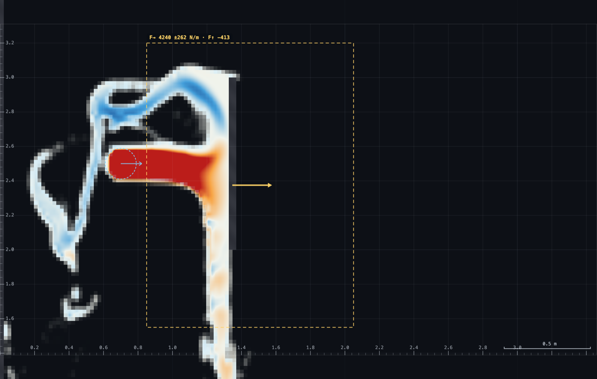
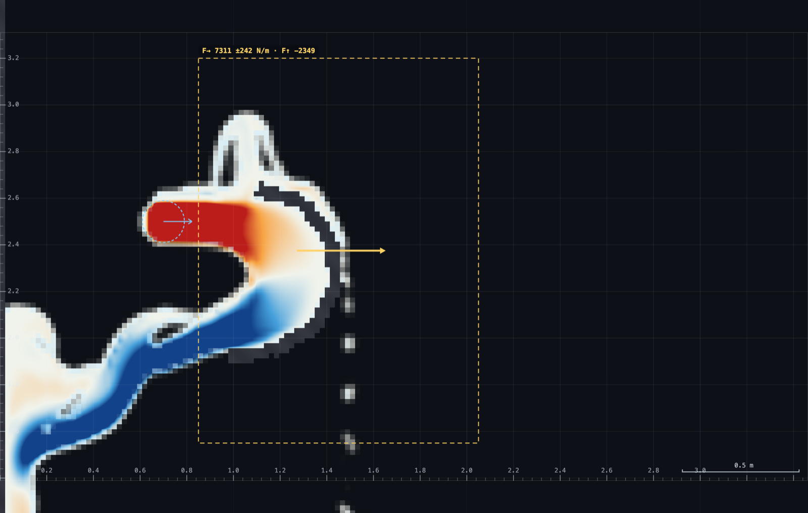
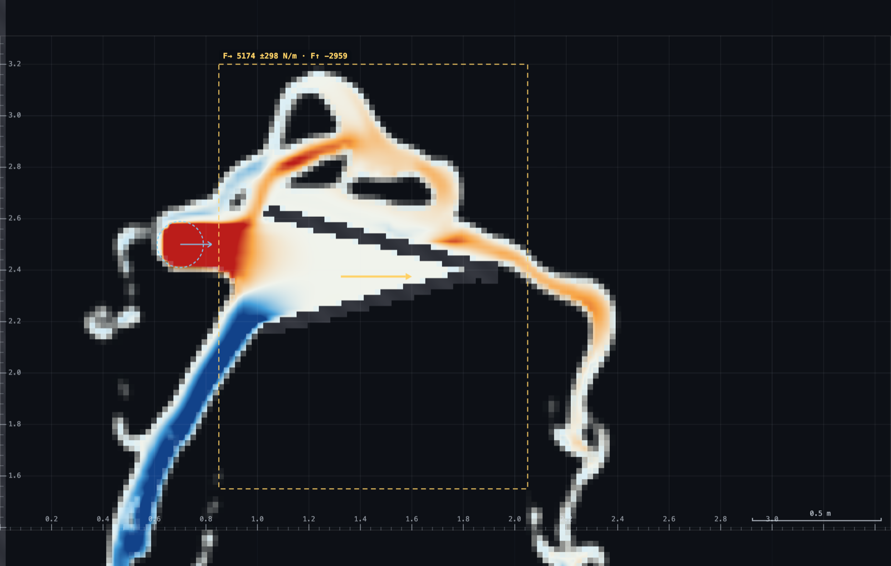

# HP-2 · The Pelton principle without the wheel

A spout fires a free jet across open air onto a drawn deflector, and a
**control-volume force box** reads the force on whatever it encloses — live,
in newtons per metre of width. The demo is three deflectors against the same
jet and the same box: a flat plate, a Pelton-style cup that turns the jet back
through ~165°, and the deep-V a textbook figure would suggest. The plate reads
≈4.3 kN/m, the cup ≈7.3 — the near-doubling a bucket collects, **measured
rather than asserted** — and the V reads barely 1.2× the plate, because in a
vertical plane it floods. Velocity triangles and u/v₁ = ½ stay on the slides;
this rig's job is to make ρQΔv a number the class watches change.

**Open it:** press **E** in the [app](https://barneydobson.github.io/hydraulician/)
and pick **HP-2**, or use the direct link
[`?ex=HP-2`](https://barneydobson.github.io/hydraulician/?ex=HP-2).
How to run any exercise: see the [teaching pack index](../INDEX.md#running-an-exercise).

## Theory

A vane that turns a jet through θ takes the whole change in momentum flux, and
a control volume drawn around the vane must read exactly that on its faces:

    F = ρ·q·v·(1 − cos θ)        per metre of width

The **Force box** (tool 9) computes the momentum theorem on the box you drag:
`F = −∮ ρf[u(u·n) + P·n] dA` over the four faces, minus the weight of the
enclosed water in the vertical. F→ is the honest headline — gravity never
enters the horizontal budget. Two things make it an instrument rather than a
display: it is time-averaged (τ = 1 s) with the raw flutter printed after the
±, and it is **box-independent** — drag a different box around the same
deflector and the number holds (measured: two boxes agree to 0.1% on the
plate and the cup). Move it and see; that invariance *is* the control-volume
theorem, and it is the whole reason CVs are all over fluids.

Measured on this rig, the free jet carries **q ≈ 0.78 m²/s** at
**v ≈ 4.4 m/s** where it crosses the box's upstream face — a momentum flux of
**≈3.5 kN/m** (which is ρqv; the board's number).

| deflector | θ drawn | 1 − cos θ | ideal ρqv(1−cosθ) | **F→ measured** |
|---|---|---|---|---|
| flat plate | 90° | 1.00 | 3.5 kN/m | **4.3 ± 0.3** |
| Pelton cup (this rig) | ~168° | 1.98 | 6.9 kN/m | **7.3 ± 0.2** |
| deep-V | 165° | 1.97 | 6.9 kN/m | **5.2 ± 0.4** |

The gaps are the physics worth saying out loud, not errors to hide — each one
is explained under its step below.

## What to do

Lecturer demonstration — nothing is submitted, the arithmetic goes on the
board. Runs at real time or faster; allow ~10 min for all three acts.

1. The rig arrives on the **flat plate**. Pick the **Force box** tool (`9`)
   and drag a box from **(0.85, 1.55) to (2.05, 3.20)** — the rulers along
   the frame are there to hit stations with. The card settles in a few
   seconds: **F→ ≈ 4.3 kN/m**. Now drag a *different* box around the same
   plate and watch the number hold — any control volume enclosing the same
   hardware reads the same force. (Keep the upstream face right of x ≈ 0.8:
   swallow the spout and the box encloses a *source* — mass appears inside
   it and the budget stops being a force.)
2. Hover the jet just inside the box's upstream face: **u ≈ 4.4 m/s**, and
   with q ≈ 0.78 m²/s the board says ρqv ≈ 3.5 kN/m. The box reads ~20% more
   than the plate's ideal 1.00 × ρqv. Switch **Field → Momentum flux** and
   the reason is on screen: the sheet thrown up the plate rains back onto the
   jet and is driven into the plate a second time. A control volume doesn't
   care how the momentum arrives — it counts everything that crosses.
3. **Act two — the bucket.** Erase (`2`) the plate and draw the cup with
   Wall (`1`): six strokes through these points, in order —

   | from | to |
   |---|---|
   | (1.10, 2.64) | (1.30, 2.58) |
   | (1.30, 2.58) | (1.42, 2.42) |
   | (1.42, 2.42) | (1.44, 2.22) |
   | (1.44, 2.22) | (1.34, 2.04) |
   | (1.34, 2.04) | (1.16, 1.94) |
   | (1.16, 1.94) | (0.98, 1.92) |

   It is one half of a Pelton bucket in section: the jet enters under the
   upper lip, wraps the inside of the cup, and leaves **down-and-back** so
   gravity clears the spent water away under the spout — the same reason a
   real runner discharges downward into the tailrace. Press `R`, let the
   card's countdown run, and read the same box: **F→ ≈ 7.3 kN/m — 1.7× the
   plate**. The doubling arrives as the force arrow visibly doubling.
4. Do the closing arithmetic on the board. Probing the exit sheet where it
   crosses the box face: 5.3–5.9 m/s at ~18° below horizontal (it left the
   lip *faster* than it arrived — the jet fell ~0.5 m through the bucket,
   and √(4.4² + 2g·0.5) ≈ 5.5 m/s). Then ρq(v_in + v_out·cos 26°) =
   0.78 × (4.4 + 5.5×0.9) ≈ **7.3 kN/m** — the box's number, rebuilt from
   the velocities the class just measured.
5. **Act three (optional) — why the shape matters.** Erase the cup and draw
   the textbook deep-V: apex at **(1.90, 2.40)**, two 0.9 m arms 15° either
   side of the jet axis (ends at (1.03, 2.63) and (1.03, 2.17)), plus one
   short capping stroke across the apex — butt-ended arms meeting at a point
   do not seal. The board says θ = 165° should collect 1.97 × ρqv. The box
   reads **≈5.2 kN/m — barely 1.2× the plate** — and the momentum-flux view
   shows why: in a vertical plane the wedge cannot drain, the cavity floods
   (the box's F↑ is holding ~290 kg of standing water per metre of width),
   and the "return" is a slow spill instead of a fast sheet. This is why
   real Pelton buckets curl the exit *downward* and notch the lip: a bucket
   only works while its spent water gets out of the way.

**If you want the head as well as the force**, put a gauge in the free jet and
another on the stagnation point (MO-2's two stations). Expect the ratio to
read **1.15–1.30, not 1**, and say why: the jet keeps accelerating under
gravity over its last stretch of flight, and the solver's compressible
equation of state adds a stagnation response scaling with M = v/c ≈ 0.20.
Read gauges, not the raw hover box, for any head comparison — the gauge adds
the elevation back. The force box's +20% on the plate is the same family of
honesty: the model's jet really does deliver more than the slide's ρqv.

**Sibling demo MO-2** (`exercises/MO-2-jet-vane/`) runs the turning series —
flat, 45°, 90°, deep-V — on this same rig with the momentum-flux *colours*
carrying the story, and has the poolable stagnation-ratio submission. Its
deep-V figures show the sign reversal well; the force numbers above are the
caution against reading those colours as magnitudes.

The full verification record — the box-independence and mass-closure checks,
the wall-pressure cross-check on the plate (+8%), the cup design trail (deep-V
variants, why plan-view g = 0 is unusable, the exit-sheet measurements) — is
kept locally, out of version control, at
`exercises/HP-2-pelton/_archive/README-full.md`.
