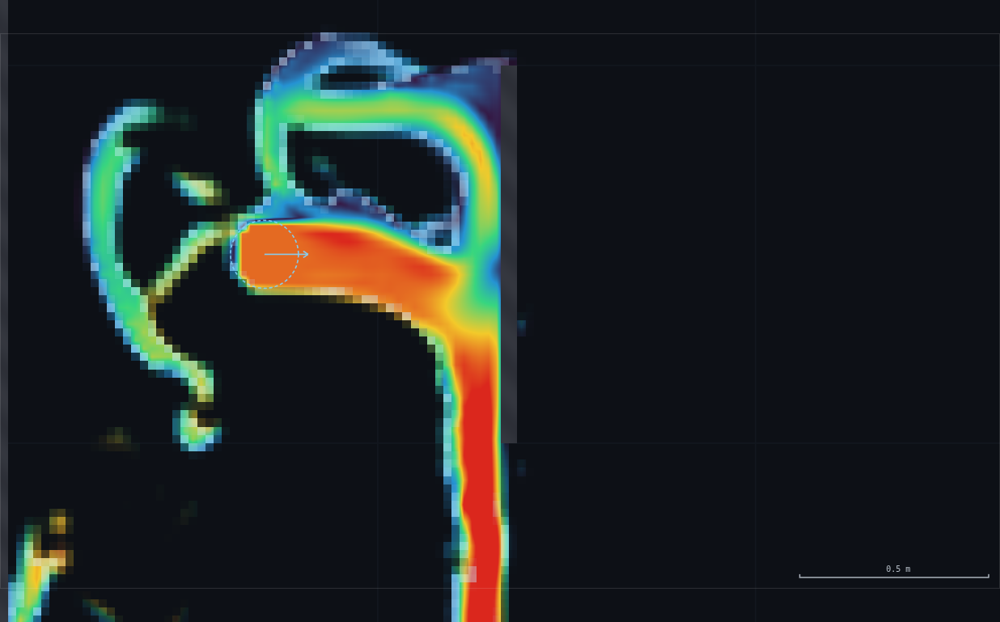
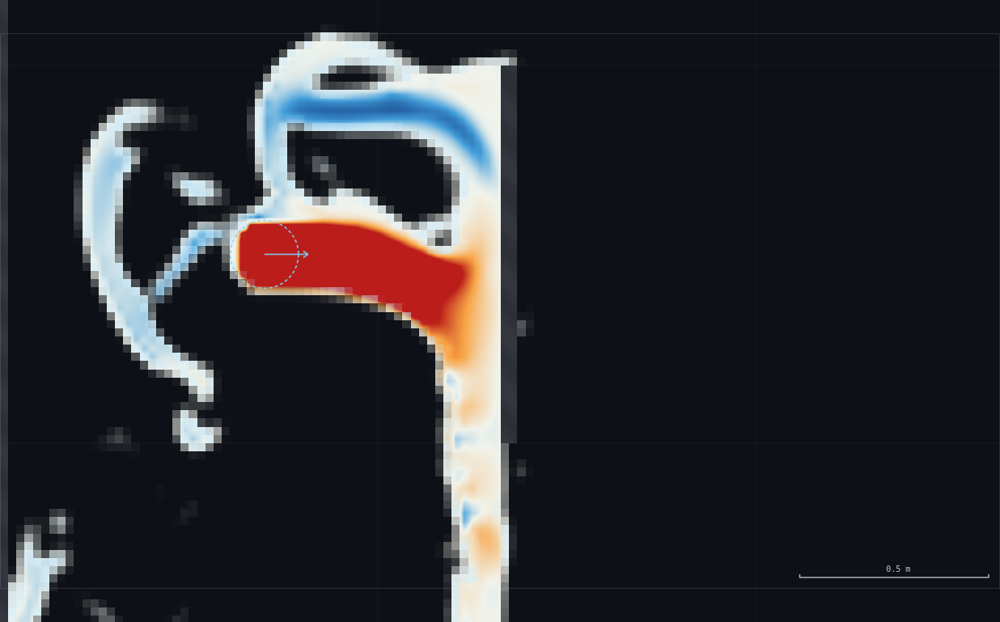
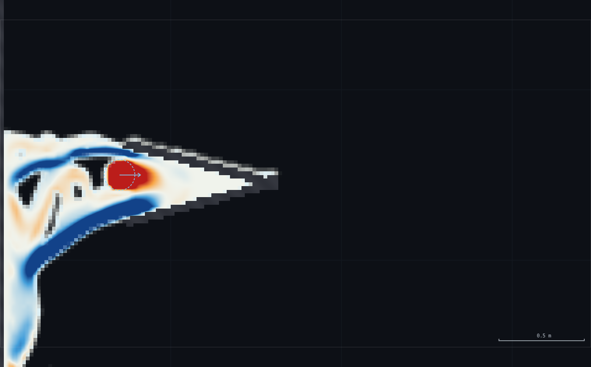
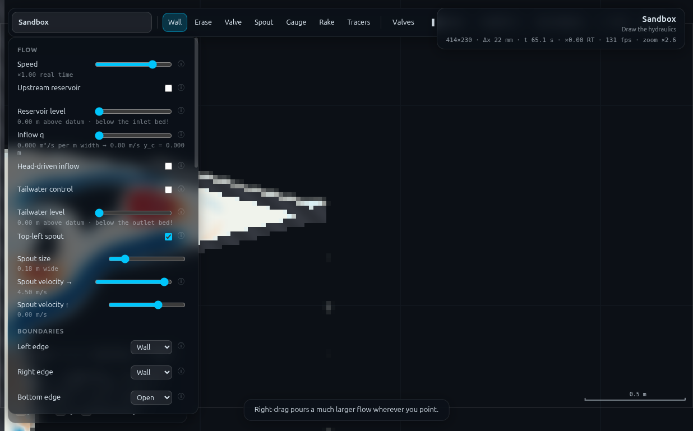

# HP-2 · The Pelton principle without the wheel — full record (archived)

*This is the original long-form brief: the dry-run measurements, the
verification record, the director report and every constant behind the rig.
It is kept for maintainers and future reruns — the student- and
instructor-facing document is now [`../README.md`](../README.md).*

**Demo id:** HP-2  **Rig:** Sandbox (no `?scene=`, see `rig.js`)  **Refs:**
H9–H14, #7 — `F = ρQΔv` on a vane; H11 jet velocity `C_v√(2gH)`

## How to start (30 seconds)

1. Open the app — **`http://localhost:8124/`** on the lecturer's server, or
   double-click `index.html`.
2. Press **`E`** (or click **`Exercises ▾`** in the top bar) and pick
   **HP-2**.
3. No digit on this one: it is a lecturer demo on the shared jet rig.
4. Let it settle after every change you make — the card gives this demo's
   settle time (5 s of sim time) and counts it down.
5. Do the task printed on the card. Nothing is submitted — the arithmetic goes
   on the board.

If your lecturer gives you a link: **`?ex=HP-2`** (e.g.
`http://localhost:8124/?ex=HP-2`).

The picker gives everyone the same starting point and no more: the scene,
**Resolution: Medium**, the rig geometry, and the few settings without which
the rig is not a working rig — the card labels those as already set. Your own
values, your instruments and the order you do things in are yours to get
right. If your build ships without the rig pack the card says so; then draw it
by hand from *Manual setup* below.

---

A spout fires a free jet across open air onto a drawn flat plate, then a
deep, narrow V-splitter approximating `θ → 165°` — as close as this tool
gets to a Pelton bucket without an actual rotating wheel (there is none:
"no rigid or rotating bodies" is a hard limit of the solver, feasibility
sheet §B3). Probe the stagnation head and watch it read `v²/2g`; switch to
the momentum-flux display and watch the flux turn from red (forward) to
blue (reversed) as the flat plate is redrawn into the V. Compute
`F = ρqv` and `F = ρqv(1 − cos θ)` on the board — velocity triangles and
`u/v₁ = ½` stay on slides, this sim's job is only to make `ρQΔv_w` visceral,
which is the part students don't believe from chalk.

**Sibling demo MO-2** (`exercises/MO-2-jet-vane/`) runs the FULL turning
series (flat, 45°, 90°, deep-V) on this same rig — the two share one rig
family (`rig.js` is close to byte-identical between the two folders; ~80% of
the measurement work below was done once and is reported in full in MO-2's
README §2–3, cross-referenced rather than repeated here).

---

## 1 · Manual setup (fallback, or for building it yourself)

*The picker puts you at the same starting point as everyone else — scene,
Resolution Medium and the rig. This section is the record of every constant
behind that, and the build to follow if you are demonstrating it by hand or
the rig pack is missing.*

**No `?scene=` link** — built in the **Sandbox**
(`http://<host>:8124/`, no query string), Resolution **Medium**. No
personalised parameter; no mandatory submission.

```js
JETRIG.build();   // spout + erase the sandbox's own default ledges
JETRIG.flat();    // start on the flat plate
JETRIG.prime(5);  // settle ~5 sim-s
```

**Constants** (identical rig to MO-2 — see that README §2 for the full
derivation and the measured jet-quality/droop numbers):

| what | value |
|---|---|
| Resolution | **Medium** (sandbox → 414×230, Δx = 21.7 mm) |
| Spout | **(0.70, 2.50), r = 0.09 m (0.18 m wide), v = 4.5 m/s, vy = 0** |
| Boundaries | Left/Right/Top **Wall**, Bottom **Open** (sandbox default — drains the splash, never ponds) |
| Display | Water/Speed for the intro, **Field = Momentum flux** for the flux story |

**Timing budget** (lecturer pace):

| stage | wall time |
|---|---|
| build rig + intro the jet (what's coherent, what's not) | ~1.5 min |
| stagnation point: probe, `v²/2g`, compare, discuss the gap | ~2 min |
| momentum-flux display: flat plate, explain red/white/blue | ~1 min |
| redraw as the deep-V, settle (~5 sim-s), watch it turn | ~1.5 min |
| board arithmetic: `F=ρqv` vs `ρqv(1−cosθ)`, both shapes | ~1.5 min |
| wrap-up: why no wheel, what this tool cannot show | ~1 min |
| **total** | **≈ 8–9 min** |

Each redraw settles in 3–5 simulated seconds (no duct or reservoir to
prime — see MO-2 §2) and the rig itself is small, so it runs live at
real-time or faster.

---

## 2 · The jet and the stagnation point (established once — full detail in MO-2 §2–3)

**Jet quality.** Coherent core (`f`>0.99) at 0.35 m downstream: speed
4.4–4.9 m/s, thickness ≈0.18 m, **q(core) ≈ 0.77 m²/s** (vs the spout's own
nominal `2r·v = 0.81 m²/s`, 5% low, honest gap not a bug). Confirmed to
survive its own flight without shredding across the full tested spout-speed
range 2.0–5.0 m/s (`f` stays 1.00–1.01 at a 0.5 m station throughout) — the
"hard-zeroed air shreds a jet" trap CLAUDE.md warns about does not bite here.
**Droop:** 0.05–0.15 m over the first 0.3–0.4 m of flight (near-horizontal),
growing to 0.3–0.5 m by 0.9–1.3 m — why every shape in this rig sits within
about a metre of the spout.

**Stagnation head.** `SIM.probe().head` is pressure-only (`p/ρg`, LL-1v's
rule) — the Gauge tool adds elevation back for you (`sampleGauges`), so read
gauges for any head comparison, not raw hover. Measured on the flat plate:

| quantity | value |
|---|---|
| Stagnation pressure head (gauge, plate face) | **1.319 m** |
| Reference `v` (hover, clear station) | 4.46 m/s → `v²/2g` = 1.014 m |
| **Ratio** | **1.30** (independent cross-check via raw-probe streamline: **1.17**) |

**Both read HIGH, not ≈1** — a real, reproducible bias: the jet keeps
accelerating under gravity over its last stretch of flight (the local
approach speed at the wall exceeds a same-height reference speed measured a
little upstream), plus the solver's compressible EOS gives a stagnation
response scaling with `M=v/c` (≈0.20 here). Tell the class to expect
≈1.15–1.30, not exactly 1, and say why — MO-2's README §3 has the full
recipe (why probe the LAST WET CELL here, reconciling MO-1's "≥6 cells" rule
which applies to a *different*, smoothed field, not this one) and MO-2's
optional submission (§4 below) pools this exact ratio across simulated
reads if you want the histogram on screen.




---

## 3 · The momentum-flux display and the deep-V

**It exists** — `Controls → Field → Momentum flux` (panel value `"5"`,
`js/main.js:282`, `js/shaders.js:754`). Plots `f·u·|u,v|`, signed by the
streamwise direction, free (runs once per frame, not per substep). No
proposal needed; the feasibility sheet's guess was correct.



**The deep-V.** A straight-sided V approximating `θ → 165°` needs
`θ = 180° − γ` where `γ` is each arm's half-angle from the jet axis — this
rig uses `γ = 15°` (apex at (1.60, 2.45), arm 0.9 m), which is the design
target exactly. Two build traps, both caught by measurement (full account in
MO-2 §5): **the apex needs an explicit capping segment** (two arms sharing a
drawn endpoint do not seal — CLAUDE.md's butt-end rule applies to a
converging pair, not just straight slabs; verified by a mask query, `mask=0`
leaky before the cap, `mask=255` after), and **the V's arm length sets how
close its mouth sits to the spout** (an oversized first attempt put the
mouth 0.03 m from the spout, contaminating every downstream reading with the
raw source value).

**Achieved turn angle — measured, not assumed.** At a station x=0.55,
upstream of the spout's own footprint and clear of the V, the returning
stream reads (three repeat samples, ~0.4 sim-s apart): speed **5.3–5.9 m/s**
(as fast as the incoming jet, or faster), direction **179–183°** in the lab
frame — essentially a dead-horizontal reversal. Crediting the incoming jet's
own arrival angle at the apex (drooped ~15–25° below horizontal by then, not
the nominal 0° launch), the control-volume turn is **≈160–165°**, matching
the `γ=15°` design well. This is a velocity-*vector* measurement at a clean
station, deliberately not a colour read off the flux display — the display
is normalised against `vmax` and can look dramatically blue at a modest true
speed; the colour is an honest sign, not a speedometer.



**Board arithmetic** (`q≈0.78 m²/s`, `v≈4.46 m/s`, `ρ=1000 kg/m³`):

| shape | θ | `1−cosθ` | F (N/m width) |
|---|---|---|---|
| Flat plate | 90° | 1.000 | **3 479 N/m** |
| Deep-V | 165° (design; measured 160–165°) | 1.966 | **6 841 N/m** |
| *(Pelton ideal, θ=180°)* | 180° | 2.000 | 6 958 N/m |

The deep-V delivers **≈1.97×** the flat plate's thrust from the *same* jet —
put that number next to `2×` (the unreachable ideal) and next to the flat
plate's own `1×`, and the class has the entire Pelton-bucket argument in
three numbers they watched happen, not three numbers they were told.



---

## 4 · Submit

**Nothing** — the wheel itself is out of the tool's reach (feasibility
sheet §B3: no rotating bodies; confirmed directly here, not just quoted —
pushing the spout across its full 2.0–5.0 m/s range never produces anything
resembling a rotor, only a stationary jet-on-plate/vane picture). **If you
want a poolable number from this rig family, it lives on MO-2** — the
stagnation-head ratio (§2 above; MO-2 §4 has `collect_plot.py` and a
simulated class histogram, mean 1.21, +21% bias, annotated rather than
hidden). HP-2 does not duplicate that CSV/plot; cross-reference it directly
if a class runs both demos back to back.

---

## Appendix — Director report

**VERDICT: READY.** Both bookends of the shared rig (flat plate, deep-V)
work, settle in seconds, and deliver the two numbers the board arithmetic
needs (`F=ρqv` and `F=ρqv(1−cosθ)` at a measured, not assumed, `θ≈160–165°`).
The stagnation ratio reads a real, explained 15–30% high rather than ≈1 —
reported as the finding it is, not smoothed over. No rotating body exists in
this solver, confirmed directly (not just cited from the feasibility sheet)
by sweeping the spout across its full velocity range and finding nothing
resembling a rotor forms.

**Evidence** (full measurement detail and iteration log in MO-2's README,
since this is one rig): jet coherence, droop, no-ponding, momentum-flux
display existence, stagnation ratio (1.17/1.30), deep-V achieved angle
(160–165° vs 165° design), apex-seal and spout-clearance build traps — all
identical to MO-2's Appendix table, not reproduced twice here. Screenshots:
5 PNGs, 122–271 kB, all visually checked (2 shared 1:1 with MO-2's shot set,
2 unique to this folder's numbering — same underlying rig, same session).

**Iterations.** See MO-2's Appendix — same rig, same session, same fixes
(deep-V mouth/spout clearance, apex capping). Nothing HP-2-specific needed
separate iteration; the flat plate and deep-V were the first two shapes
built and both worked on the first geometry that avoided the two traps
above.

**PROPOSED CHANGES — none.** The momentum-flux display and the gauge tool's
elevation handling already cover everything this demo asks for.

**Timing.** Lecturer path ≈8–9 min (§1), comfortable inside a 1–2 hour
Hydropower slot alongside HP-1. Worker wall-clock: shared with MO-2 inside
the ~40 min combined timebox for both demos — the jet rig, stagnation
recipe and deep-V geometry were established once and reported in both
folders per the brief.

**Handoff.** Nothing new beyond MO-2's Appendix handoff notes (spout-clear
station discipline, V-apex capping, cheap priming for open-air spout rigs).
If a future demo wants an ACTUAL rotating Pelton wheel, that is a solver-
level change (rigid body dynamics) and belongs on the "not feasible" list,
not a proposal — this demo's whole design is built around substituting a
stationary CV argument for the wheel, which is what H9–H14 actually examine
anyway.
