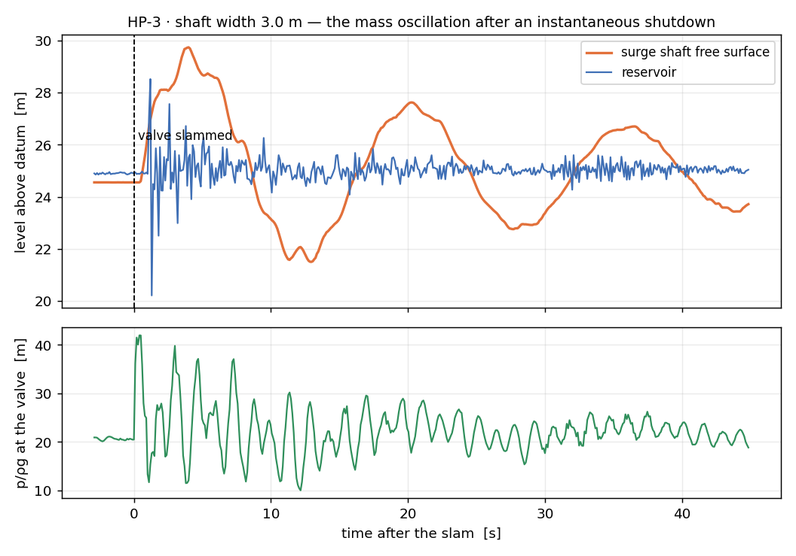
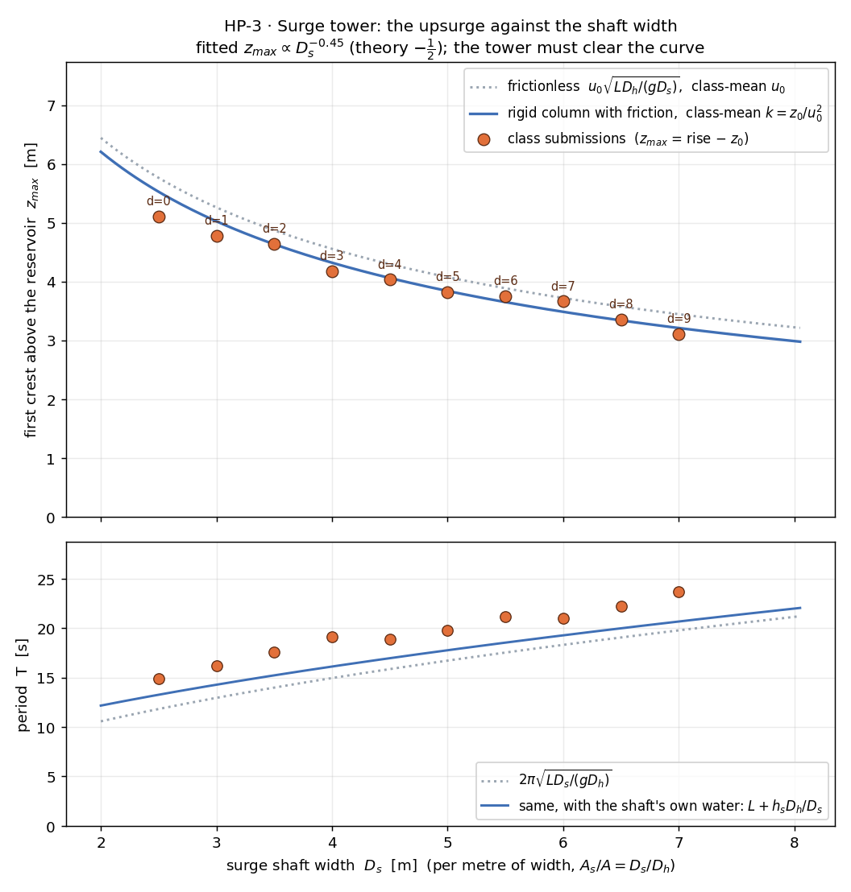

# HP-3 · Design the surge tower: the class measures the upsurge

A reservoir feeds a level headrace; at the knee a surge shaft rises off the
pipe, and a penstock drops to a nozzle at the power house. Slam the valve
and the headrace column has nowhere to go but up the shaft. Each student
runs a different shaft width and reads how high the water rises; pooled,
the class traces the curve a surge tower is sized from. The tutorial sheet
sets the same calculation on this scheme, so every answer on it can be
checked on screen.

**Open it:** press **E** in the [app](https://barneydobson.github.io/hydraulician/)
and pick **HP-3**, or use the direct link
[`?ex=HP-3`](https://barneydobson.github.io/hydraulician/?ex=HP-3).
How to run any exercise: see the [teaching pack index](../INDEX.md#running-an-exercise).
The hand calculation to do before the session is
[`tutorial-sheet.docx`](tutorial-sheet.docx) in this folder.

## Theory

Rigid column, free surface in the shaft, losses ∝ u². With z the shaft
level measured DOWN from the reservoir and A/A_s = D_h/D_s (a slice one
metre wide, so areas are heights):

    (L/g)·du/dt = z − k·u|u|          dz/dt = −(A/A_s)·u

Steady running: z₀ = k·u₀². Instantaneous closure without friction:

    z_max = u₀·√(L·A/(g·A_s))         T = 2π·√(L·A_s/(g·A))

With friction (the tutorial sheet's solution): u² = C·e^(z/Z) + (z + Z)/k,
with Z = L·A/(2·g·k·A_s) and C = −(Z/k)·e^(−z₀/Z); the crest is where
u = 0, found by trial. Here z₀/Z is small and the crest lands close to
u₀√(LA/gA_s) − z₀: the shaft starts z₀ below the reservoir and rises by
about the frictionless amount.

Rig constants (measured at Medium): **L = 42.4 m** (reservoir wall to
shaft centre), **D_h = 3.05 m**, **u₀ ≈ 2.5 m/s**, reservoir level
**≈ 24.9 m** (the slider says 25.0; the free surface by the wall stands
0.1 m lower under draw), **z₀ ≈ 0.35 m**. Nearly all of z₀ is velocity
head (u₀²/2g = 0.32 m): this headrace is 14 bores long, so friction is a
tenth of the drawdown, where in a real headrace a thousand bores long it
is all of it.

## Your shaft width

**d** is the **last digit of your student number** — your lecturer will
explain the assignment in class. Your shaft width is **2.5 + 0.5·d**
metres, set on the **Surge shaft width D_s** slider (Controls →
Geometry, or the field on the card). Nothing is drawn.

| d | 0 | 1 | 2 | 3 | 4 | 5 | 6 | 7 | 8 | 9 |
|---|---|---|---|---|---|---|---|---|---|---|
| **D_s (m)** | 2.5 | 3.0 | 3.5 | 4.0 | 4.5 | 5.0 | 5.5 | 6.0 | 6.5 | 7.0 |

## What to do

1. Set **Surge shaft width D_s** to your own value and press `R`. Let it
   reach steady state — about **60 s**; the card counts it down. The scene
   opens near its steady flow; what is left to settle is a ±0.1 m wobble
   of the shaft level.
2. Gauge (`5`) the reservoir at **x = 6.6 m, z = 20 m** and the shaft at
   **x = 50 m, z = 18 m**. Gauges plot is on **h**. Read each as the centre
   of its trace over ten seconds: **z₀ = reservoir − shaft**. Hover the
   headrace at x ≈ 27 m and read **V**: that is **u₀**.
3. Controls → **Gauges plot → d**. Press `V` to slam the valve and watch
   the shaft. On the shaft trace (expand its card, ⤢) read the flat level
   before the slam d₀ and the first crest d_max: **rise = d_max − d₀**. The
   depth moves in whole cells of 0.16 m; take the crest as the highest
   step. **T** is the time from the first crest to the second.
4. Submit **D_s, u₀, z₀, rise, T**.

Why d and not h for the crest: under the crest the shaft's water is
decelerating at about 1 m/s², so the pressure 12 m down is not hydrostatic
and a gauge on h there reads the crest about a metre low. The depth
channel is counted from the fill, not the pressure.
The reservoir gauge jumps by metres for a second or two after the slam
as the pressure wave reaches the mouth; that is not the reservoir moving,
and its level before the slam is the one every reading uses.



### Optional: the Darcy friction factor

Two more gauges on the headrace axis, at **x = 22 m** and **x = 44 m**,
both at **z = 14 m**, then press `A` (Average) and wait 30 s: the heads
wobble ±0.3 m frame to frame against a drop of about 0.04 m, so the
averaged reading is the only one worth having. Then

    f = 2·g·D_H·(h₁ − h₂) / (L₁₂·u₀²)      D_H = 2·D_h = 6.1 m,  L₁₂ = 22 m

f comes out near 0.03. D_H is the hydraulic diameter of a slot one metre
wide (R_h = D_h/2): the solver's pipe is a slice, not a circle. The
stations matter: over the first 15 m the entry vena contracta depresses the
head and then recovers, and gauges placed in it read a negative slope.

## For the instructor — pooling the class

Collect one row per student (`student_id,digit,Ds_m,u0_ms,z0_m,rise_m,T_s`),
export the CSV and run:

```bash
python3 collect_plot.py class.csv                # -> plots/pooled-demo.png
python3 collect_plot.py data/simulated-class.csv # the shipped dry-run class
```

The script takes z_max = rise − z₀ and k = z₀/u₀² per row, plots z_max
against D_s with the frictionless curve and the rigid-column-with-friction
curve at the class-mean u₀ and k, prints the log–log slope (−0.45 on the
dry-run class against the −½ of the design law), and plots T against the
textbook period underneath.



### Running it in a 40-minute session

- 0–5 min: the sheet's answers on the board — z₀ = k·u₀², the frictionless
  upsurge, what friction did to it, whether the shaft clears the roof.
- 5–10 min: everyone opens HP-3, types their digit, sets D_s, waits out
  the settle.
- 10–25 min: steps 2–4; submit. The optional friction factor is for those
  who finish early.
- 25–35 min: the pooled plot. Each point is one tower; the curve is the
  design rule. Read a required height off it for a shaft of any width.
- 35–40 min: the discussion points below, or the water hammer in the
  penstock.

### Discussion points

- **The period runs 20–25% long.** Measured T sits above 2π√(L·A_s/(g·A))
  on every rung. The shaft's own water (9 m of it) has inertia the formula
  leaves out — L + h_s·A/A_s closes half the gap — and the slot's
  compressibility at c = 60 m/s stores a little of the swing as well.
- **Narrow shafts throttle.** Below the ladder the entry into the shaft
  costs head: a 2.0 m shaft reads 16% under the curve and 1.5 m reads 21%
  under — the throttled surge tank, which real designs use on purpose.
  Widen past 7 m (the slider goes to 8) and the penstock's water hammer
  reflects off the shaft in full: the downsurge at the valve is down to
  1 m of head at 8 m.
- **The penstock still takes the hammer.** Gauge x = 62.5 m, z = 3 m on h
  and slam again: +21 m at the valve at c = 60 m/s, a period of 4L_p/c, on
  top of the slow swing in the shaft — the two time scales the tower keeps
  apart.
- **The knee sliders.** Knee x sets L: z_max ∝ √L and T ∝ √L. Knee z
  moves the whole headrace up or down and changes nothing in the surge —
  only the static head at the knee. The two bores do what A/A_s says.
- **Maximum power (h_f = H/3) stays on the sheet.** The nozzle gap is a
  slider (0.16–1.2 m), and the jet speed stays at √(2gH) all the way up it
  (measured 20.6–21 m/s against 20.7): this model's pipe losses are too
  small to bend the power curve over. HP-1 puts a throttle plate in its
  penstock for exactly that reason; run the coda there.
