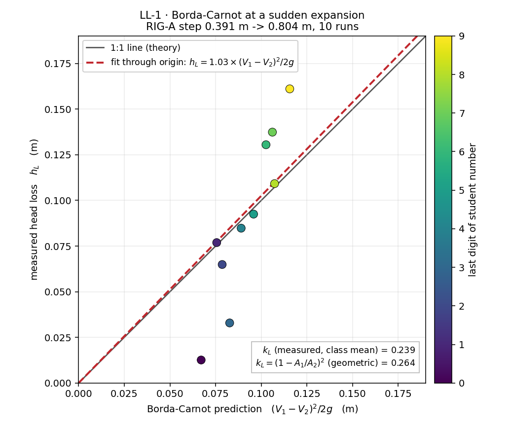

# LL-1 · Borda–Carnot at a sudden expansion

Every student drives the *same* pipe — a 0.40 m bore that steps suddenly to
0.80 m part-way along — at a *different* reservoir head. Two gauges, one just
before the step and one well past it, let each student measure the velocity
drop, the pressure recovery, and hence the head lost to the corner eddy that
sits, visibly, in the vorticity display. Pooled, the class's (measured h_L,
Borda–Carnot prediction) points sit on the 1:1 line — a loss coefficient
predicted from geometry alone, and confirmed one head at a time.

**Open it:** press **E** in the [app](https://barneydobson.github.io/hydraulician/)
and pick **LL-1**, or use the direct link
[`?ex=LL-1`](https://barneydobson.github.io/hydraulician/?ex=LL-1).
How to run any exercise: see the [teaching pack index](../INDEX.md#running-an-exercise).

## Theory

An abrupt expansion cannot recover all of the velocity head it gives up: the
jet has to mix out into the wider pipe, and what it spends doing that is gone.
Measure the shortfall against a frictionless Bernoulli recovery,

    ideal recovery = (V₁² − V₂²)/2g        measured recovery = H₂ − H₁
    h_L = ideal recovery − measured recovery

and compare it with Borda–Carnot, which needs nothing but the two velocities:

    h_L = (V₁ − V₂)²/2g = k_L·V₁²/2g       k_L = (1 − A₁/A₂)²

The step here is **0.3913 → 0.8043 m** (18 → 37 cells at Medium) at
**x = 3.80 m**, and in a 2D per-metre-width duct the area ratio *is* the
height ratio, so **k_L = 0.264** — computable on paper before anything runs.
The wide leg is held full by a tailwater at 2.95 m, so the expansion has a
pressure to recover into.

## Your reservoir level

**d** is the **last digit of your student number** — your lecturer will
explain the assignment in class.

> **level = 3.45 + 0.035·d   metres**

(d = 0 → 3.450, d = 5 → 3.625, d = 9 → 3.765.) Set it to the nearest 0.005 m.

## What to do

1. Raise **Reservoir level** to your own value — the bench idles with the
   reservoir level equal to the tailwater, so nothing flows until you do.
2. Drop two gauges — Gauge (`5`) — at **x = 3.40 m, y = 2.20 m** (mid-height
   of the narrow bore, just before the step) and at **x = 7.60 m, y = 2.10 m**
   — **low in the wide pipe, near the invert**, not mid-height: a centreline
   tap reads the still-mixing jet core and can sign-flip the recovery.
3. Press `R` and let it reach steady state — about **20 s**; the card counts
   it down, then watch the traces for another 20 s or so.
4. Hover either side of the step for **V₁** and **V₂** (the readout's **V** is
   already the bore mean), read **H₁** and **H₂** as the value each gauge
   trace is *centred* on, do the arithmetic above, and submit **h_L** and your
   **Borda–Carnot** prediction with **V1, V2, H1, H2** for the record.

h_L is a small difference between two larger ones, so the longer you watch,
the steadier your answer — and do not be alarmed if your single point sits off
the line. The pooled cloud is the result, not any one pair of numbers.

## For the instructor — pooling the class

Collect one row per student
(`student,digit,level_m,V1_ms,V2_ms,H1_m,H2_m,hL_m,bordaCarnot_m` — the last
two are derived from the rest if a student leaves them out), export the CSV
and run:

```bash
python3 collect_plot.py class.csv                # -> plots/pooled-demo.png
python3 collect_plot.py data/simulated-class.csv # the shipped dry-run class
```

The script plots measured h_L against the Borda–Carnot prediction with the
1:1 line, fits a line through the origin, and prints the class-mean k_L
against the geometric (1 − A₁/A₂)².



### Discussion points

- **The eddy is not free.** Before anyone touches a number, switch Field to
  Vorticity and point at the corner just past the step: that shed train of
  red/blue recirculation *is* where (V₁−V₂)²/2g goes. It is not friction —
  the pipe is short and the bore generous — it is pure turbulent dissipation,
  over almost as soon as it starts.
- **Where you tap matters as much as what you read.** Live: drop a third gauge
  at bore mid-height, **x = 7.60 m, y = 2.40 m**, and compare its trace with
  the near-invert one. It sits nearly 0.3 m lower — enough to sign-flip the
  measured recovery — because y = 2.40 m is exactly the old narrow-bore
  soffit, and that jet boundary has still not mixed out four metres past the
  step. A pressure reading only means something once you say where in the
  section it was taken, and how far downstream.

The full verification record — why the step is 0.40 → 0.80 m and not
0.40 → 1.00 m, why it sits at x = 3.80 m, the vertical head profile behind
the near-invert gauge, the measured ten-level ladder, safe bounds and
troubleshooting — is kept locally, out of version control, at
`exercises/LL-1-borda-carnot/_archive/README-full.md`.
