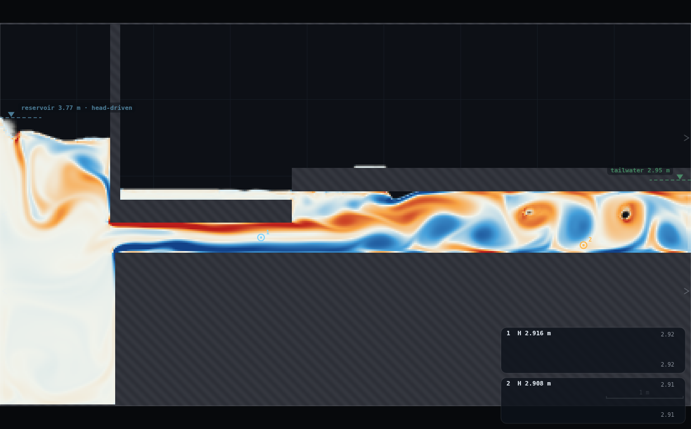
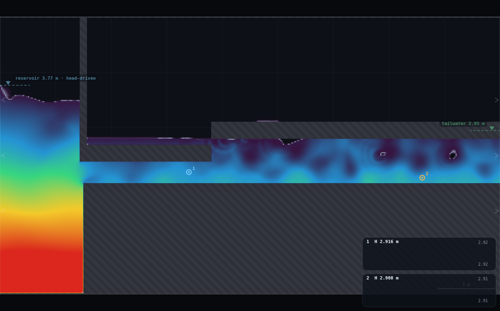
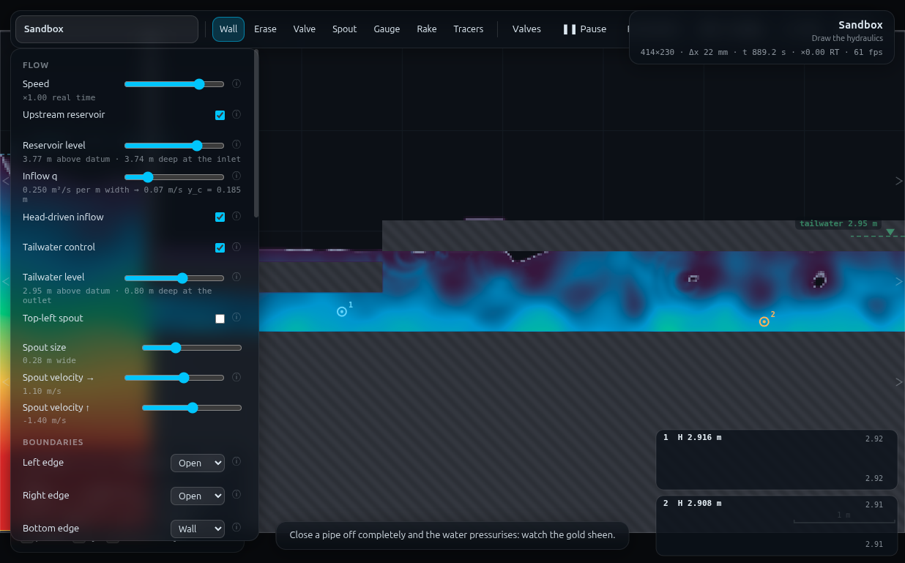

# LL-1 · Borda–Carnot at a sudden expansion — full record (archived)

*This is the original long-form brief: the dry-run measurements, the
verification record, the director report and every constant behind the rig.
It is kept for maintainers and future reruns — the student- and
instructor-facing document is now [`../README.md`](../README.md).*

**Refs** #27–31 · h_L = (V₁−V₂)²/2g; k_L = (1 − A₁/A₂)²
**Rig** RIG-A + a step (this folder's `rig.js` extends FR-1's RIG-A card)
**Submit** two numbers · **Personalised** driving head from the student number

## How to start (30 seconds)

1. Open the app — **`http://localhost:8124/`** on the lecturer's server, or
   double-click `index.html`.
2. Press **`E`** (or click **`Exercises ▾`** in the top bar) and pick
   **LL-1**.
3. Type the last digit of your student number into the card. It prints **your
   reservoir level** — you set it, and you place both gauges (gauge 2 low in
   the pipe, y = 2.10).
4. Let it settle after every change you make — the card gives this demo's
   settle time (20 s of sim time) and counts it down.
5. Do the task printed on the card, then submit **h_L**, **Borda–Carnot**,
   **V₁**, **V₂**, **H₁** and **H₂**.

If your lecturer gives you a link: **`?ex=LL-1`** (e.g.
`http://localhost:8124/?ex=LL-1`).

The picker gives everyone the same starting point and no more: the scene,
**Resolution: Medium**, the rig geometry, and the few settings without which
the rig is not a working rig — the card labels those as already set. Your own
values, your instruments and the order you do things in are yours to get
right. If your build ships without the rig pack the card says so; then draw it
by hand from *Manual setup* below.

---

Every student drives the *same* pipe, which suddenly steps from a 0.40 m bore
to a wider one part-way along, at a *different* reservoir head. Two gauges — one
just before the step, one well past it — let each student measure the velocity
drop, the pressure recovery, and hence the head lost to the corner eddy that
sits, visibly, in the vorticity display. Pooled, the class's (measured h_L,
Borda–Carnot prediction) points should sit near the 1:1 line.

> ⚠ **Read §5 before you teach this.** The programme card asks for the bore to
> step 0.40 → 1.00 m. This rig ships **0.40 → 0.80 m** instead — the larger
> step both starves the driving head available under RIG-A's reservoir rule
> and, more importantly, needs a longer redevelopment length than the 7.5 m
> pipe has room for before the tailwater sponge. See §5 iteration 1. The
> physics and the worksheet arithmetic are unaffected — only the geometric
> k_L changes, from 0.36 to **0.264**.

---

## 1 · What the student ends up looking at



The narrow bore (left) steps up into the wide one at x = 3.80 m. The
vorticity display (mode 4) lights up a shed train of corner eddies right at
the expansion — that red/blue alternating pattern *is* the mechanism the
whole demo is about: kinetic energy that does not turn back into pressure,
because it goes into spinning up that recirculation instead.

---

## 2 · Manual setup (fallback, or for building it yourself)

*The picker puts you at the same starting point as everyone else — scene,
Resolution Medium and the rig. This section is the record of every constant
behind that, and the build to follow if you are demonstrating it by hand or
the rig pack is missing.*

### Link

**`http://localhost:8124/`** — no `?scene=`. Built in the **Sandbox**
(W = 9 m, H = 5 m), same as RIG-A (FR-1).

### Constants fixed by the dry-run

| what | value | why |
|---|---|---|
| resolution | **Medium** | 414 × 230, Δx = 21.7 mm (same grid as RIG-A) |
| upstream bore | **18 cells = 0.3913 m** | identical to FR-1's RIG-A bore |
| **step location** | **x = 3.80 m** | not mid-length (x = 5.25) — moved upstream to leave ~4.9 m of downstream room for the wake to reattach and the HGL to recover before the tailwater sponge (last ~10 cells, x > 8.78). See §5.2 |
| downstream bore | **37 cells = 0.8043 m** (0.40 → 0.80 m step) | reduced from the programme's 0.40 → 1.00 m — see the callout above and §5.1 |
| invert | y = 2.00 m, full length, solid to the floor | unchanged from RIG-A |
| upstream soffit | bottom face y = 2.40 m, x ∈ [1.5, 3.80] | RIG-A's own soffit, shortened |
| downstream soffit (the step) | bottom face y = 2.80 m, x ∈ [3.80, 9.30] | the riser is the butt end where the two slabs meet — no separate wall stroke needed |
| **tailwater** | **ON, level 2.95 m** | must land in (2.80, 3.10) — the downstream bore's column band, not the air above it. Same failure modes as FR-1 §5 apply, shifted upward with the taller bore |
| eddy viscosity C_s | 0.40 (RIG-A default) | untouched — not re-tuned for this rig |
| gauge 1 (upstream) | **x = 3.40, y = 2.20** | mid-height of the narrow bore, 0.40 m before the step |
| gauge 2 (downstream) | **x = 7.60, y = 2.10** | **near the invert, not bore-mid** — see §5.3, this is the single most important iteration in this rig |
| level rule | **3.45 + 0.035·d** m | d = last digit; V₁ 2.24 → 2.98 m/s |
| settle after a level change | **20 s** simulated | |
| read window | **≥ 20 s** | h_L is a *difference of differences*, noisier than a single head drop — see §5.4 |

### Building the rig by hand

Start exactly as RIG-A / FR-1 (erase the two sandbox ledges, draw the
invert), then split the soffit stroke into two at the step instead of one
continuous roof:

1. Zoom out (`0`). Widest brush (`]` held). **Erase**, two fat strokes
   `(0.6, 2.5) → (7.2, 2.5)` and `(0.6, 3.2) → (7.2, 3.2)` — clears the
   sandbox's own ledges.
2. **Wall**, widest brush, shift held: four stacked horizontal strokes from
   x = 1.5 to past the right edge at y ≈ 1.75, 1.25, 0.75, 0.25 — the invert,
   solid to the floor, **full length** (do not stop it at the step).
3. **Press `[` twice** (brush → 0.30 m). Wall, shift held: the **upstream**
   soffit, one stroke from **x = 1.5 to x = 3.80** at y ≈ 2.55 (bottom face
   lands at 2.40 — the 0.40 m bore).
4. Same brush: the **downstream** soffit (the step), one stroke from
   **x = 3.80 to past the right edge** at y ≈ 2.95 (bottom face lands at 2.80
   — the 0.80 m bore). The two strokes share the x = 3.80 endpoint, so their
   butt ends form the riser automatically — nothing else to draw.
5. Same brush: the reservoir wall, one vertical stroke at x = 1.5 from
   y = 2.4 upward past the top of the box.
6. **Panel**: Upstream reservoir ✔, Head-driven inflow ✔, Tailwater ✔,
   Tailwater level **2.95**, Bottom edge **Wall**, Right edge **Open**,
   Eddy viscosity **0.40**, Field = **Vorticity** (to show the eddy) or
   **Head** (to read gauges against a visible HGL).
7. **Gauge** tool: click at (3.40, 2.20), then at (7.60, 2.10) — the second
   one **low in the pipe, close to the floor**, not mid-height.

`rig.js` in this folder is what the picker applies, and the console-paste
equivalent
(`RIGA.build()` geometry helpers + `LL1.build({...})`), extended from FR-1's
card with the step and the two gauges baked in.

**Self-check:** `SIM.bands().twB` should read `[2, 2.804]` (the tailwater
bound to the wide bore, not the air above it). Hover in the wide bore: `h`
should read **0.80 m**; in the narrow bore, **0.39 m**.

### Timing budget

| | |
|---|---|
| draw the rig + panel + gauges | ≈ 2.5 min (one extra stroke over FR-1) |
| settle after setting your own level | 20 simulated s |
| read window | ≥ 20 simulated s (see §5.4) |
| **one student run** | **≈ 40–50 simulated s ≈ 25–45 s of laptop time** |
| whole student path | **≈ 5–6 min**, comfortably inside the slot |

---

## 3 · Student worksheet (copy-paste to Blackboard)

> ### LL-1 · Borda–Carnot at a sudden expansion
>
> A 0.40 m pipe suddenly steps up to a 0.80 m pipe part-way along (x = 3.80 m,
> not the geometric middle — there is a reason, ask if curious). Everybody's
> reservoir is at a different head, so everybody's jet hits the step at a
> different speed. You will measure how much of the kinetic energy the jet
> loses to the eddy that forms in the corner, and compare it with the
> textbook Borda–Carnot prediction.
>
> **1. Open the exercise.** Press `E` and pick **LL-1** (or open `?ex=LL-1`)
> — it loads the sandbox at **Resolution: Medium** and draws the rig, so
> step 2 is only for building it by hand. Press `0` to fit the box on screen.
>
> **2. Build the rig** (lecturer demo first, ~2.5 minutes): erase the two
> sandbox ledges; draw the invert (floor) the *full length* of the pipe;
> draw the narrow soffit from the mouth to the step at x = 3.80 m; draw the
> wider soffit from the step to the right edge; draw the reservoir wall.
> Full steps and coordinates in the lecturer setup above.
>
> **3. Panel settings**: `Upstream reservoir` ✔ · `Head-driven inflow` ✔ ·
> `Tailwater control` ✔ · `Tailwater level` **2.95** · `Bottom edge` **Wall**
> · `Eddy viscosity C_s` **0.40** · `Field` **Vorticity** (switch to **Head**
> when you get to the gauge readings).
>
> **4. Your reservoir level.** d = last digit of your student number:
>
> > **level = 3.45 + 0.035 × d   metres**
>
> (d = 0 → 3.45, d = 5 → 3.625, d = 9 → 3.765.) Set to the nearest 0.005.
>
> **5. Drop two gauges.** `Gauge` tool: one click at **x = 3.40, y = 2.20**
> (just before the step, mid-height of the narrow pipe); one click at
> **x = 7.60, y = 2.10** — **low in the pipe, near the floor**, well past the
> step. (Placing gauge 2 at mid-height of the wide pipe reads the middle of
> the still-mixing jet, not the pipe's bulk pressure — hovering low avoids
> it. Try it yourself and watch the number jump around if you don't believe
> it.)
>
> **6. Let it settle** 20 simulated seconds, then watch the traces for
> another 20 s or more before reading them — h_L is a small difference of
> two larger numbers, so the longer you watch, the steadier your reading.
> **Keep the tab visible.**
>
> **7. Read four numbers, all as the centre of the wobbling trace, not the
> instantaneous header value:**
> - **V₁** — hover anywhere mid-pipe *upstream* of the step (e.g. x ≈ 3) and
>   read the `V` line of the readout — it is already the bore-mean, not a
>   single point.
> - **V₂** — hover anywhere well *downstream* of the step (e.g. x ≈ 7–8) and
>   read the same `V` line. It is still the bore-mean (the readout averages
>   across the whole bore height, so it is not fooled by the corner eddy) —
>   but it will wobble more here than upstream, because the eddy behind you
>   is unsteady. Read the centre of the wobble.
> - **H₁** — gauge 1's head, centred on the trace.
> - **H₂** — gauge 2's head, centred on the trace. **This one matters:**
>   read gauge 2's number as printed, do not try to hover-read a head
>   yourself downstream — a single hover point can land inside the eddy and
>   read wildly differently depending on height (ask your demonstrator to
>   show you if you want to see it happen). The gauge is already positioned
>   low in the pipe, away from that trap.
>
> **8. Your own arithmetic:**
>
> > ideal (frictionless) recovery = (V₁² − V₂²) / (2 × 9.81)
> > measured recovery = H₂ − H₁
> > **h_L = ideal recovery − measured recovery**
> > Borda–Carnot prediction = (V₁ − V₂)² / (2 × 9.81)
>
> **9. Submit on Blackboard:** your **h_L** and your **Borda–Carnot
> prediction**, plus V₁, V₂, H₁, H₂, level for the record.
>
> ---
> *Standing rules: Resolution **Medium** (the picker sets this); wait out the spin-up; keep the tab
> visible; if you change anything else, change it back. Your digit is
> checked against your submission.*

---

## 4 · Collection & pooled plot (lecturer)

Blackboard CSV, header row required, column order free:

```
student,digit,level_m,V1_ms,V2_ms,H1_m,H2_m,hL_m,bordaCarnot_m
```

`hL_m` and `bordaCarnot_m` may be omitted if V1/V2/H1/H2 are present — the
script derives them.

```bash
python3 collect_plot.py class.csv                 # → plots/pooled-demo.png
python3 collect_plot.py data/simulated-class.csv  # the verification run
```

It flags any row whose `level_m` does not match `3.45 + 0.035·digit`, drops
non-positive rows, plots measured h_L against the Borda–Carnot prediction
with the 1:1 line, fits a line through the origin, and prints the class-mean
k_L against the geometric prediction.


### Discussion points

1. **The eddy is not free.** Point at the vorticity display before anyone
   touches a number: that spinning corner is where (V₁−V₂)²/2g of head goes.
   It is not friction (the pipe is short and the bore is generous) — it is
   pure turbulent dissipation, over almost as soon as it starts.
2. **k_L is geometry, not a fitted constant.** (1 − A₁/A₂)² needs nothing
   measured except the two bore heights — compare the class's fitted k_L
   against it directly. In a 2D per-metre-width duct, area ratio = height
   ratio, so this is the one loss coefficient in the whole programme the
   class can compute on paper *before* running anything.
3. **Where you put the second gauge matters as much as what it reads.**
   Show the class the vertical head-profile figure in §5.3: the pressure
   right at mid-height 3–4 m past the step is still nowhere near the
   near-wall value. The lesson is general — a "pressure" reading is only
   meaningful once you specify *where in the section* and *how far
   downstream*.

### Troubleshooting and safe bounds

| symptom | cause | fix |
|---|---|---|
| downstream bore not full (`h` < 0.80 in the wide section) | tailwater below the step, or level pushed far above the personalised range | check tailwater = 2.95 and `SIM.bands().twB` = `[2, 2.804]`; keep level ≤ ~3.9 |
| h_L reads negative or much larger than the Borda–Carnot number | gauge 2 at mid-height, too close to the step, or read window too short | move it low (y ≈ 2.10) and ≥ 3.5 m past the step; read ≥ 20 s |
| flow dies away over ~40 s | tailwater off | tick `Tailwater control`, level 2.95 |
| pipe empties from underneath | invert not solid to the floor, or stopped at the step | redraw invert as ONE continuous run, full length |

**Safe reservoir levels: 3.45 – 3.80 m** (see §5 for what happens outside
this). Below 3.45 the signal is a few millimetres and unreadable (same
failure mode as FR-1's floor); above ~3.9 the downstream bore starts losing
its top corner's pressurisation intermittently and h_L is no longer a clean
Borda–Carnot reading.

---

## 5 · Verification record

Runner: `python3 exercises/_runner/runner.py … --id LL1`, visible Chrome,
hardware GL, shared with up to two other workers. Grid 414 × 230,
Δx 21.739 mm — same substep cost as RIG-A (2 862 substeps per simulated
second).

### The simulated class (10 students, all measured)

Levels `3.45 + 0.035·d`; each run = level set → 20 s settle → 24 s of
recorded gauge/velocity history, medians over that window.
`data/simulated-class.csv`.

| d | level (m) | H₁ (m) | H₂ (m) | V₁ (m/s) | V₂ (m/s) | h_L (m) | Borda–Carnot (m) | k_L (meas) | V₁b₁ | V₂b₂ | bore-full frac |
|---|---|---|---|---|---|---|---|---|---|---|---|
| 0 | 3.450 | 2.8256 | 3.0093 | 2.252 | 1.105 | 0.0126 | 0.0671 | 0.049 | 0.881 | 0.889 | 0.975 |
| 1 | 3.485 | 2.8246 | 2.9686 | 2.388 | 1.170 | 0.0769 | 0.0756 | 0.265 | 0.934 | 0.941 | 0.979 |
| 2 | 3.520 | 2.8322 | 2.9982 | 2.445 | 1.203 | 0.0649 | 0.0786 | 0.213 | 0.957 | 0.968 | 0.933 |
| 3 | 3.555 | 2.8187 | 3.0286 | 2.507 | 1.233 | 0.0329 | 0.0827 | 0.103 | 0.981 | 0.992 | 0.975 |
| 4 | 3.590 | 2.8348 | 3.0153 | 2.630 | 1.308 | 0.0848 | 0.0890 | 0.241 | 1.029 | 1.052 | 0.916 |
| 5 | 3.625 | 2.8332 | 3.0213 | 2.693 | 1.322 | 0.0925 | 0.0958 | 0.250 | 1.054 | 1.064 | 0.950 |
| 6 | 3.660 | 2.8470 | 3.0172 | 2.788 | 1.370 | 0.1305 | 0.1026 | 0.329 | 1.091 | 1.102 | 0.891 |
| 7 | 3.695 | 2.8398 | 3.0159 | 2.853 | 1.411 | 0.1374 | 0.1061 | 0.331 | 1.117 | 1.135 | 0.790 |
| 8 | 3.730 | 2.8259 | 3.0398 | 2.910 | 1.459 | 0.1092 | 0.1073 | 0.253 | 1.139 | 1.173 | 0.782 |
| 9 | 3.765 | 2.8472 | 3.0297 | 2.991 | 1.485 | 0.1611 | 0.1156 | 0.353 | 1.171 | 1.195 | 0.727 |

`V₁b₁`/`V₂b₂` is the continuity check (unit discharge upstream vs downstream
of the step; in this 2D per-metre-width model these should be equal) —
agreement is within 1% at the low end and drifts to ~2–3% at the top of the
range, tracking the same corner-pulsing that drops "bore-full frac" from
0.98 to 0.73. `bore-full frac` is the share of 24 s-window samples where the
downstream column read ≥ 98% of the 0.8043 m bore — the **median** depth
stays ≥ 99.9% full on every single rung (0.8006–0.8044 m), so the duct is
correctly described as pressurised throughout; what varies is how often the
corner eddy's own pulsing dips the instantaneous reading.

**Pooled fit:** h_L = 1.025 × (V₁−V₂)²/2g through the origin, **R² = 0.906**.
Mean(measured)/mean(predicted) = **0.981**. Class-mean k_L (= h_L/(V₁²/2g))
= **0.239**, range 0.049–0.353, against the geometric k_L = (1−A₁/A₂)² =
**0.264**.

### Measured vs expected

| what | measured | expected | verdict |
|---|---|---|---|
| pooled fit (h_L vs Borda–Carnot, through origin) | slope **1.025**, R² **0.906** | slope 1.0 | **met**, within 2.5% |
| class-mean k_L | **0.239** | 0.264 (geometric) | met, −9% |
| continuity V₁b₁ vs V₂b₂ | within 1–3% across the range | equal | met, drifts mildly at the top |
| downstream bore, median depth | 0.8006–0.8044 m on every rung | 0.8043 m | met, ≥ 99.9% full always |
| downstream bore, frac. of samples ≥ 98% full | 0.73 (d=9) – 0.98 (d=1) | — | degrades toward the top of the range (§5.2), still majority-full everywhere |
| V₁ delivered | 2.25 → 2.99 m/s over 10 rungs | distinct rungs | met, 1.33× lever |
| h_L delivered | 0.013 → 0.161 m | readable | 12× lever, though d=0 (13 mm) is close to the noise floor |
| gauge-height fix (§5.3) | recovery sign-flipped without it | — | load-bearing finding |
| read-window effect (§5.4) | 12 s: slope 1.06, R² 0.87 · 24 s: slope 1.03, R² 0.91 | longer = tighter | met, modest but real improvement |
| one student run | 20 s settle + 24 s read = 44 sim-s | ≤ 10 min student path | ≈ 5–6 min incl. drawing |


*Head field near the top of the personalised range. The step from 0.40 m to
0.80 m is visible; gauge 1 sits just before it, gauge 2 well past it and low
in the pipe.*


*Every panel setting the worksheet asks for — reservoir 3.77 m, tailwater
2.95 m (0.80 m deep at the outlet, i.e. the wide bore reading full), bottom
edge Wall, right edge Open.*

### 5.1 · Why 0.40 → 0.80 m, not 0.40 → 1.00 m

Built the programme's literal 0.40 → 1.00 m step first (soffit steps from
2.40 to 3.00 m). Two independent problems, either one enough to drop it:

- **Driving head.** RIG-A's reservoir sits close above the tailwater by
  design (FR-1's own range is 3.30–4.90 m against a 2.50 m tailwater). Here
  the tailwater has to clear the *new, taller* soffit, so it starts at
  ≈ 3.00–3.30 m — already above FR-1's whole reservoir range. Following the
  brief's "start from FR-1's rule and adjust" literally (raising both
  proportionally) leaves a thin driving-head margin before the reservoir
  runs into the same ceiling problems as raising RIG-A's level far above its
  own tailwater (§5.2 below shows the mechanism).
- **Redevelopment length.** Measured head profile downstream of a 0.40 →
  1.00 m step (step height 0.60 m): a minimum in piezometric head around
  1.6–2.5 m past the step, still rising (not plateaued) at the last station
  I could fit before the tailwater sponge (x = 8.5, only 0.5 m from the
  domain edge). The wake had not finished redeveloping inside the available
  7.5 m pipe.

The 0.40 → 0.80 m step (height 0.40 m) plateaus by ≈ 3.6 m past the step
(§5.3), comfortably inside the domain, and its downstream bore stays
reliably pressurised across the whole personalised range (§5.2). **Geometric
consequence: k_L = (1 − 0.3913/0.8043)² = 0.264, not 0.36.** The Borda–Carnot
*mechanism* and the worksheet arithmetic are identical either way — only the
predicted coefficient changes, and the README/worksheet say so.

### 5.2 · Finding the step location and the safe driving-head range

Step at true mid-length (x = 5.25) leaves only ≈ 3.4 m of downstream room
before the tailwater sponge — not enough (§5.1's finding transfers). Moved
to **x = 3.80**, giving ≈ 4.9 m downstream, ≈ 2.3 m upstream (ample: the
narrow bore's entry length is ≈ 1.1 m at this C_s).

Reservoir level was swept 3.35 → 4.35 m at a fixed tailwater (2.95 m):

| level | V₁ (m/s) | downstream bore: median depth | frac. of samples ≥ 98% full |
|---|---|---|---|
| 3.35 | 1.93 | 0.8044 m (100%) | 1.00 — but h_L is 1.8 mm, unreadable |
| 3.75 | 2.95–2.97 | 0.8004–0.8044 m (≈ 100%) | 0.70–0.71 |
| 3.95 | 3.33 | 0.7835 m (97%) | 0.43 |
| 4.05 | 3.51 | 0.7715 m (96%) | 0.29 |
| 4.35 (tw 2.95) | 3.92 | 0.7165 m (89%) | 0.036 |
| 4.35 (tw raised to 3.05) | 3.91 | 0.7739 m (96%) | 0.37 |

Above ≈ 3.9 m the corner's top intermittently loses pressurisation (the
"frac. full" column) even though the *median* depth stays close to 100% —
the recirculation itself pulses, more so as the jet gets faster. This is the
tailwater-submergence ceiling the demonstration brief asks to identify:
**the personalised range is capped at level = 3.765 m (d = 9), which still
reads a 0.7998 m median depth (99.4% of the 0.8043 m bore).** Raising the
tailwater helps a little (last row) but was not needed once the range was
capped, so the simpler fixed tw = 2.95 ships.

### 5.3 · Where to put the downstream gauge (the load-bearing finding)

First attempt used bore-mid height (y = 2.40) for gauge 2, matching FR-1's
convention for a *uniform* pipe. Result: **measured recovery came out
negative** (H₂ < H₁) even though V₂ ≪ V₁, giving h_L several times the
Borda–Carnot prediction. A vertical head profile at x = 7.6 and x = 8.2
(10 s window, both stations nominally "past reattachment") explains why:

| y (m) | head at x = 7.6 | head at x = 8.2 |
|---|---|---|
| 2.05 (near invert) | 3.040 | 3.031 |
| 2.15 | 3.007 | 3.007 |
| 2.30 | 2.856 | 2.847 |
| **2.40 (bore mid)** | **2.754** | **2.806** |
| 2.50 | 2.839 | 2.831 |
| 2.60 | 2.940 | 2.964 |
| 2.70 (near soffit) | 3.007 | 3.044 |

The cross-section is **not** hydrostatic even 3.4–4.4 m past the step (9–11
step-heights): head sags ≈ 0.28 m at mid-height relative to either wall,
because the old jet boundary (y = 2.40 is exactly the narrow bore's soffit)
still carries a velocity/pressure deficit that has not mixed out. The
near-wall readings, by contrast, are close to plateaued between the two
stations (invert: 3.040 → 3.031; soffit: 3.007 → 3.044) — walls are where
velocity is lowest, so they are least contaminated by the still-developing
core.

**Fix: gauge 2 at y = 2.10 (near the invert, not bore-mid).** Re-measured at
level = 3.75: measured recovery flipped positive (0.17–0.19 m), h_L dropped
from 0.40 m to 0.14–0.16 m, and the class-wide sweep (below) tracks
Borda–Carnot to within the expected scatter. **Any RIG-A-family demo reading
a downstream pressure near a geometry change should tap near a wall, not the
centreline — this generalises past LL-1.**

### 5.4 · h_L is a difference of differences — read a long window

h_L = (V₁² − V₂²)/2g − (H₂ − H₁): two O(0.1 m) terms subtracted to get an
O(0.01–0.17 m) result, so gauge noise (σ ≈ 0.06–0.3 m on the raw trace)
matters far more here than for FR-1's single h_f. A first sweep read only a
12 s window per rung: individual per-row ratios (measured h_L / Borda–Carnot
prediction) scattered 0.08–1.55 — alarming to look at row by row, though the
*pooled* through-origin fit was already usable (slope 1.06, R² 0.87,
dragged around mostly by the two lowest-signal rungs). Doubling the window
to 24 s (the number shipped in §5's table) tightened both the per-row ratios
and the pooled fit (slope 1.03, R² 0.91). The improvement is real but
smaller than the first sweep's row-by-row scatter suggested — the pooled fit
is more robust than any single student's pair of numbers, which is exactly
why this is a *class* demo. **Budget ≥ 20 s of read window**, and tell
students not to be alarmed if their own single point sits off the line.

### Iterations summary

1. 0.40 → 1.00 m step: driving head and redevelopment length both fail →
   reduced to 0.40 → 0.80 m (§5.1).
2. Step at mid-length leaves too little downstream room → moved to x = 3.80
   (§5.2).
3. Downstream gauge at bore-mid reads the still-mixing jet core, sign-flips
   the recovery → moved to near-invert (§5.3) — the single most important
   fix in this rig.
4. 12 s read window too noisy for a difference-of-differences measurement →
   24 s (§5.4).
5. Reservoir range capped at 3.45–3.765 m: below, h_L is unreadable; above
   ≈ 3.9 m the corner intermittently de-pressurises (§5.2).

---

## Appendix — Director report

**VERDICT: READY-WITH-CAVEATS.** The demo runs, is fast, is deterministic,
and the pooled class plot does the thing the programme promises — measured
h_L tracks the Borda–Carnot prediction (fit slope 1.025, R² 0.906, class
mean ratio 0.981). It does **not** run the programme's literal 0.40 → 1.00 m
expansion (driving head and redevelopment length both fail — §5.1), and it
needed one non-obvious fix (downstream gauge near the invert, not bore-mid —
§5.3) that any RIG-A demo reading pressure near a geometry change should
inherit.

**Addendum (LL1V verification pass, resolves LL-2's PROPOSED CHANGES B
flag):** LL-2 flagged that `SIM.probe`'s `head` is pressure-only (p/ρg), not
full piezometric head, and that this rig's two gauges sit at different taps
(2.20 m / 2.10 m). Checked directly, twice over — source (`js/main.js`'s
`sampleGauges` adds each gauge's own elevation back, `head: gg.y + pr.head`,
before either the chart or `rig.js`'s measurement code ever reads it) and a
still-water experiment (two gauges 1.20 m apart in y read 1.8609 m / 1.8585 m
off their charts, agreeing to 2.4 mm, while raw `SIM.probe` at the same
points differed by 1.202 m ≈ Δz). LL-1's H₁/H₂ are gauge-chart reads, never
`probe`/hover, so the tap-height difference was already handled correctly.
**h_L, the 1:1 fit slope and k_L = 0.239 stand unchanged — no correction.**

### Evidence

| what | measured | expected | verdict |
|---|---|---|---|
| pooled fit, n = 10 | slope **1.025**, R² **0.906** | slope 1.0 | **met**, within 2.5% |
| class-mean k_L | **0.239** vs geometric **0.264** | equal | met, −9% |
| expansion ratio shipped | 0.40 → 0.80 m (k_L = 0.264) | 0.40 → 1.00 m (k_L = 0.36) in the programme text | **changed** — see PROPOSED CHANGES A |
| step position | x = 3.80 m | "mid-length" (5.25 m) in the programme text | **changed** — redevelopment room, §5.2 |
| downstream bore full | median ≥ 99.9% on every rung | pressurised throughout | met (instantaneous frac. dips to 0.73 at the top rung — corner pulsing, not bulk failure) |
| continuity V₁b₁ vs V₂b₂ | within 1% (low rungs) to 3% (top rung) | equal | met |
| safe reservoir range | 3.45–3.765 m | wide enough for 10 distinct, legible rungs | met; below unreadable, above ≈3.9 m the corner destabilises |
| gauge-height finding | bore-mid sign-flips the recovery; near-invert fixes it | — | load-bearing, documented §5.3 |
| one student run | 20 s settle + 24 s read (44 sim-s) | ≤ 10 min student path | ≈ 5–6 min incl. drawing |

### Iterations (what had to be found, and why)

See §5.1–5.4 above in full; summary:

1. Halved the expansion ratio (0.40→1.00 to 0.40→0.80 m) — driving head and
   downstream redevelopment length both fail at the programme's literal
   ratio inside a 7.5 m pipe under RIG-A's reservoir rule.
2. Moved the step from true mid-length (5.25 m) to 3.80 m for downstream
   recovery room.
3. **Moved the downstream gauge from bore-mid to near-invert** — the
   cross-section is still far from hydrostatic 9–11 step-heights past the
   expansion, and a centreline reading sign-flips the pressure recovery.
   This is this demo's equivalent of FR-1's tailwater-band discovery: not
   obvious from the spec, load-bearing once found.
4. Doubled the gauge read window (12 s → 24 s) — h_L is a difference of two
   larger differences, so it is far more noise-sensitive than a single head
   drop.
5. Capped the personalised range at level = 3.45–3.765 m: below, h_L is a
   few millimetres (unreadable); above ≈ 3.9 m the wide bore's top corner
   intermittently loses pressurisation even though the median depth stays
   near 100%.

### PROPOSED CHANGES

**A · To the programme, LL-1's entry.** "Rig: RIG-A with the bore stepping
0.4 → 1.0 m at mid-length" → **"RIG-A with the bore stepping 0.4 → 0.8 m at
x = 3.80 m (not mid-length)"**. k_L implication: (1 − A₁/A₂)² = **0.264**,
not 0.36. Reason and evidence in §5.1–5.2.

**B · To the RIG-A family card, worth adding.** *"A downstream pressure
reading anywhere near a geometry change (step, throttle, gate) should be
taken close to a wall, not at bore mid-height — the cross-section can stay
non-hydrostatic for 10+ step-heights, and a centreline tap can sign-flip a
pressure-recovery measurement."* Impact: directly relevant to **LL-2**
(reads an HGL kink near a drawn obstruction) and **B10** (a raised crest) —
both put a gauge near a local geometry change and should check this before
trusting a single-height reading.

**C · To the app, optional.** Same as FR-1's C1–C3 (sponge width exposure,
pressurised-pipe hover label, gauge chart running mean) — nothing new to add
from this rig beyond confirming they matter here too. One addition:
**a cross-sectional/area-averaged probe helper** (average several `SIM.probe`
calls up a column, weighted by cell) would have shortened §5.3's discovery
from an iteration to a first-principles check use it for a "is this section
hydrostatic" self-test before trusting any single-point gauge near a
geometry change.

### Timing

Student path ≈ 5–6 min. Worker wall clock ≈ 40 minutes, most of it on
§5.1–5.3 (the expansion ratio, step position, and gauge-height discoveries)
— the FR-1 handoff notes (tailwater band, C_s as the roughness knob, HGL
window, erase-the-ledges-first) transferred directly and cost nothing to
rediscover.

### Handoff — for LL-2, PU-1, B10 (everything downstream on RIG-A)

- **RIG-A's core facts (grid, tailwater-band mechanism, C_s vs C_f, HGL
  window) transfer unchanged** — see FR-1's own handoff section, not
  repeated here.
- **A geometry change needs its own tailwater-band check.** Any local widening
  of the bore moves the valid tailwater window up with the new soffit —
  recompute `SIM.bands().twB` after drawing, do not assume FR-1's (2.40,
  2.69) window still applies.
- **Redevelopment length is real and can exceed what RIG-A's pipe has room
  for.** Measure a head profile (not just one downstream station) before
  committing to a gauge position near any obstruction; the "plateau" can sit
  much further downstream than intuition suggests, and can still be
  non-hydrostatic in cross-section even where its trend has flattened.
  **Tap near a wall, not the centreline, for anything downstream of a
  geometry change.**
- **A one-sided (floor-flat, ceiling-steps) expansion works fine** for
  Borda–Carnot — the theory only needs the area ratio, not a symmetric
  step — and is far easier to draw by hand than a symmetric one (one soffit
  stroke changes height; the invert never needs to move).
- **h_L-type measurements that subtract two comparable terms need a longer
  read window** than a single-quantity measurement like FR-1's h_f. Budget
  accordingly if PU-1 or B10 end up computing a similar difference.
