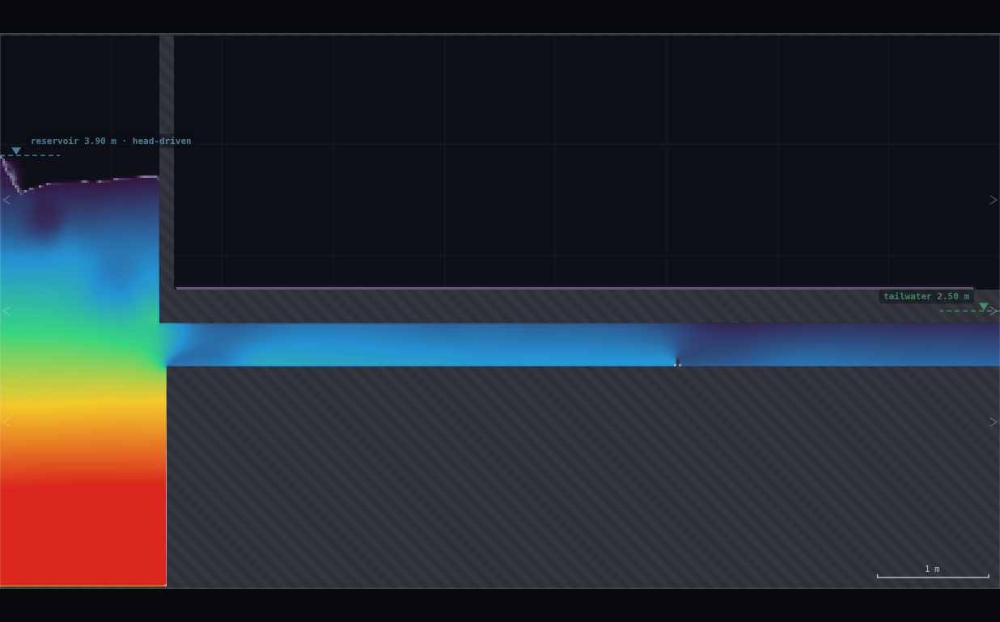
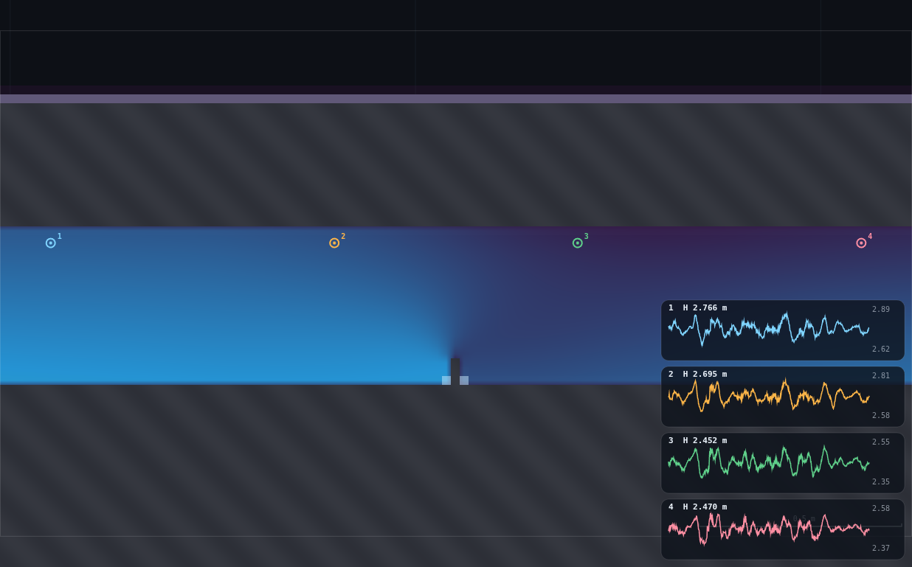
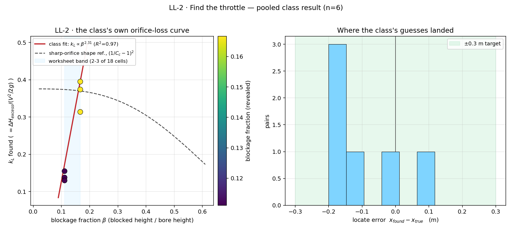
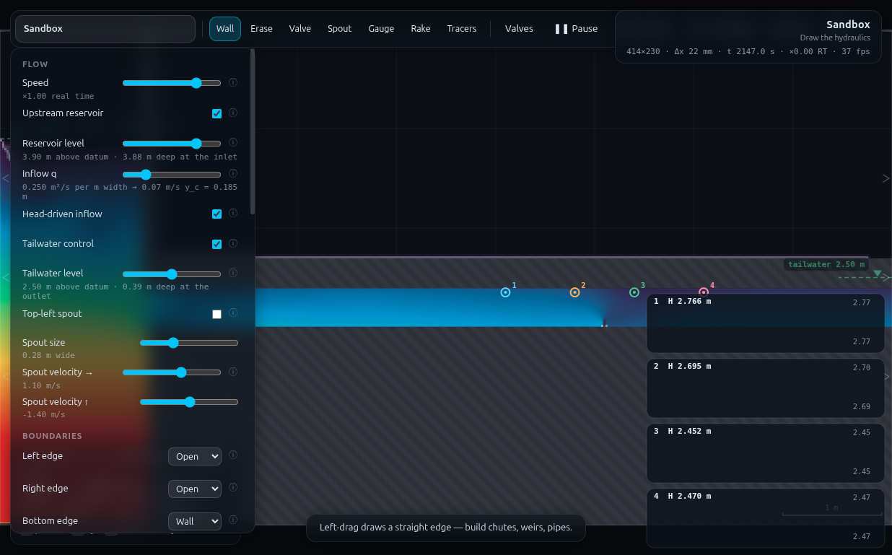

# LL-2 · Find the throttle — full record (archived)

*This is the original long-form brief: the dry-run measurements, the
verification record, the director report and every constant behind the rig.
It is kept for maintainers and future reruns — the student- and
instructor-facing document is now [`../README.md`](../README.md).*

**Refs** #34, #38–41 · h_L = k_L·V²/2g read off an HGL kink
**Rig** RIG-A + a hidden partial obstruction (this folder's `rig.js` extends FR-1's RIG-A card)
**Submit** two numbers, in pairs · **Personalised** by partner A's own (position, severity) choice, not a student digit

## How to start (30 seconds)

1. Open the app — **`http://localhost:8124/`** on the lecturer's server, or
   double-click `index.html`.
2. Press **`E`** (or click **`Exercises ▾`** in the top bar) and pick
   **LL-2**.
3. No digit on this one: partner A draws the hidden throttle. The card prints
   the rule for where it may go and how big it may be.
4. Let it settle after every change you make — the card gives this demo's
   settle time (20 s of sim time) and counts it down.
5. Do the task printed on the card, then submit **x_found** and **k_L**.

If your lecturer gives you a link: **`?ex=LL-2`** (e.g.
`http://localhost:8124/?ex=LL-2`).

The picker gives everyone the same starting point and no more: the scene,
**Resolution: Medium**, the rig geometry, and the few settings without which
the rig is not a working rig — the card labels those as already set. Your own
values, your instruments and the order you do things in are yours to get
right. If your build ships without the rig pack the card says so; then draw it
by hand from *Manual setup* below.

---

Partner A draws a short obstruction somewhere inside the covered pipe from FR-1 —
invisible once you zoom back out to the whole box. Partner B never sees where
it went. B's only tool is four gauges: walk them along the pipe, plot the
piezometric head, and the obstruction announces itself as a kink in an
otherwise straight line. Locate it, size its loss coefficient from the kink,
submit both numbers. Every pair hides a different fault, so every pair's
answer is different — the most copy-proof submission in the programme, and
exactly the technique for finding a half-shut valve in a real main from two
pressure gauges and nothing else.

> ⚠ **Read §5 before you teach this.** The programme card's brush-stroke
> suggestion — "block 30–60% of the bore" — is far too severe: measured, 30%
> already intermittently **de-pressurises** the pipe downstream. The rig
> ships a **2–3 cell** band (11–17% of the 18-cell bore) instead — narrower
> than the first guess, but it is the whole safely-detectable window there
> is at this rig's operating point. See §5.1.

---

## 1 · What the students end up looking at


*Partner A has already drawn a 3-cell fault at x = 6.10 m. At the whole-box
zoom nothing gives it away — this is the view partner B starts from.*


*The same rig, zoomed in on the fault with the final four gauges down. Gauge
1/2 (upstream) read H ≈ 2.77 / 2.70 m; gauge 3/4 (downstream) read H ≈
2.45 / 2.47 m — a clean ≈0.25 m step straddling the plate, which is now
plainly visible at this zoom. That contrast between these two screenshots
**is** the demo.*

---

## 2 · Manual setup (fallback, or for building it yourself)

*The picker puts you at the same starting point as everyone else — scene,
Resolution Medium and the rig. This section is the record of every constant
behind that, and the build to follow if you are demonstrating it by hand or
the rig pack is missing.*

### Link

**`http://localhost:8124/`** — no `?scene=`. Built in the **Sandbox**
(W = 9 m, H = 5 m), same RIG-A card as FR-1 and LL-1.

### Constants fixed by the dry-run

| what | value | why (measured, §5) |
|---|---|---|
| resolution | **Medium** | 414 × 230, Δx = 21.7 mm — same grid as the rest of the RIG-A family |
| bore | 18 cells = 0.3913 m | RIG-A's own bore, unchanged |
| **reservoir level** | **3.90 m, the SAME for every pair** | mid of FR-1's own personalised band (3.30–4.47 m) — see §2.1 |
| tailwater | ON, 2.50 m | RIG-A's own value, unchanged |
| eddy viscosity C_s | 0.40 | RIG-A's own value, unchanged |
| **fault severity band** | **2–3 of the bore's 18 cells blocked (11.1–16.7%)** | 1 cell (5.6%) is undetectable, 4 cells (22%) de-pressurises the pipe — §5.1 |
| **fault x-band** | **4.6–7.0 m** | clear of the entry length (< 3.5 m) and the tailwater sponge (> 8.75 m); edges re-verified at x = 4.3 and 7.2 — §5.5 |
| fault thickness | ~1 cell (0.028 m programmatically; hand-drawn: narrow the brush 2–3 clicks from default) | "one cell wide" per the programme card |
| **gauge height** | **y = 2.35 m, EVERY gauge, always** | near the soffit — the wall farthest from a plate that rises off the invert; see §5.3 |
| round-1 (coarse) gauge x's | **3.80, 5.20, 6.60, 8.00** | spans the whole fault band with margin either side |
| read window | **20 s** per placement | matches LL-1's difference-of-differences budget; noise floor ≈ 0.03–0.045 m raw, ≈ 0.003 m on a 20 s mean |
| background-friction law | **FR-1's own fit**, h_f = 0.007127·V^2.832 over L = 4.5 m | a slope measured *locally* next to the fault is contaminated by its own backwater — §5.2 |

### 2.1 · Why one shared level, and why 3.90 m

LL-2's personalisation is partner A's (position, severity) choice, which is
already unique per pair — a second, independent personalised parameter would
only add noise (a different V changes the background slope AND the fault's
own kink together, which makes the pooled k_L-vs-blockage plot in §4 harder
to read for no pedagogical gain). One level for the whole class keeps V
(hence the "V²/2g" a pair divides by) close to constant across pairs, so the
pooled plot in §4 is comparing k_L values measured under near-identical flow
conditions.

**3.90 m** is the midpoint of FR-1's own tested, safe personalised range
(3.30–4.47 m; safe out to 4.90 m). It delivers V ≈ 3.3–3.4 m/s clean-pipe —
comfortably off both FR-1's noise floor (V ≈ 0.7–1.5 m/s, h_f unreadable) and
its ceiling (V ≈ 4.4 m/s, where entry length grows and margins shrink). At
this V the background friction slope is S_f ≈ 0.050 m/m (§5.2), small enough
that even the *minimum* detectable fault (2 cells) still clears it by a
wide margin (§5.1).

### Building the rig by hand

Identical to FR-1 through the panel step (erase the two sandbox ledges, draw
the invert full-length, the soffit, the reservoir wall — see FR-1's README
§2 for the six-stroke sequence, reproduced verbatim in this folder's
`rig.js`). Panel: `Upstream reservoir` ✔ · `Head-driven inflow` ✔ ·
`Reservoir level` **3.90** · `Tailwater control` ✔ · `Tailwater level`
**2.50** · `Bottom edge` **Wall** · `Eddy viscosity C_s` **0.40** · `Field`
**Head**.

The one new stroke, drawn secretly by partner A once the shared rig is up:

1. **Wall** tool, narrow the brush — press `[` two or three times from the
   default (skip the `]`-widen step other RIG-A demos use) — to a thin
   sliver, about 1 grid cell wide.
2. **Shift held**, one short **vertical** stroke starting exactly on the
   pipe floor (hover until the readout says you are on the invert, y ≈
   2.00 m) and ending somewhere between **y = 2.04 and y = 2.07 m** — that
   window rasterises to 2 or 3 blocked cells either way, both inside the
   tested-safe band. Pick your own x, anywhere from **4.6 to 7.0 m**, and
   your own height in that window — that pair of choices is your secret.
3. Zoom back out (`0`) before your partner looks. Do **not** hover near your
   own plate on-screen where your partner can see the readout change.

**Self-check (partner A only, before handing over):** hover exactly on your
stroke. The readout should show solid ground reaching a couple of
centimetres above y = 2.00 — if it reads the full 0.39 m bore height as open,
the stroke missed the invert and needs redrawing.

### Timing budget

| | |
|---|---|
| draw RIG-A + panel | ≈ 2 min (FR-1's own measured figure; unchanged) |
| partner A's secret stroke | ≈ 20 s |
| settle | 20 simulated s |
| **the hunt** (coarse scan + 2 bisection rounds + 1 centring read, 20 s each) | **60 simulated s, measured — every one of 6 test pairs converged in exactly this many rounds** |
| plotting/arithmetic between rounds, submitting | ≈ 1.5–2 min |
| **whole student path** | **≈ 6–6.5 min — the tightest demo in the programme, but inside the ~8 min budget** |

---

## 3 · Student worksheet (copy-paste to Blackboard)

> ### LL-2 · Find the throttle
>
> Work in **pairs**. Partner A hides a fault in a pipe; partner B hunts it
> down with nothing but four pressure gauges and does the same, exactly, that
> a utility does to find a half-shut valve in a real main from two pressure
> readings.
>
> **1. Both of you: press** `E` **and pick LL-2** (or open `?ex=LL-2`) —
> it loads the sandbox at **Resolution: Medium** and draws RIG-A, so step 2
> is only for building it by hand. Press `0` to fit the box on screen.
>
> **2. Build RIG-A together** (lecturer demo first, ~2 min): erase the two
> sandbox ledges; draw the invert (floor), the soffit (roof, leaving a
> 0.40 m bore), the reservoir wall. Panel: `Upstream reservoir` ✔ ·
> `Head-driven inflow` ✔ · **`Reservoir level` = 3.90** (everyone, same
> number — the personalisation this time is what partner A draws, not this
> level) · `Tailwater control` ✔ · `Tailwater level` **2.50** · `Bottom
> edge` **Wall** · `Eddy viscosity C_s` **0.40** · `Field` **Head**.
>
> **3. Partner A only, screen turned away from partner B:**
> - **Wall** tool. Narrow the brush: press `[` two or three times from
>   whatever it starts at (do not widen it first).
> - Hold **shift**, and draw ONE short **vertical** stroke starting exactly
>   on the pipe floor (hover first until the readout confirms you're at the
>   invert, y ≈ 2.00 m) and reaching up to a height *you* choose between
>   **y = 2.04 and y = 2.07 m**.
> - Put it at an x-position *you* choose, between **4.6 and 7.0 m**.
> - Press `0` to zoom back out. Write down your own (x, height) somewhere
>   private — you'll need it for the reveal, and your partner must not see
>   it.
> - Tell partner B "go" — do not say anything about where it is.
>
> **4. Partner B: the hunt.** Every gauge you place goes at the **same
> height, y = 2.35 m** (near the pipe roof) — always, every time, no
> exceptions. (`Gauge` tool, click; once you have 4 down, the next click
> bumps the oldest one off — that is how you "walk" them.)
>
> - **Round 1 (coarse):** place gauges at **x = 3.80, 5.20, 6.60, 8.00**.
>   Wait 20 s, watch the four traces settle, and read each one's **centred**
>   head (not the wobbling instantaneous number — the value the trace sits
>   on the middle of).
> - **Find the gap.** You have three head-drops to compare: H1−H2, H2−H3,
>   H3−H4, over gaps of 1.40 m each. A plain, unobstructed run of this pipe
>   drops its head by about **0.050 m per metre** at this reservoir level —
>   so a clean 1.40 m gap should show ≈ 0.07 m of drop. The gap with the
>   fault in it drops *much* more than that. That gap brackets your fault.
> - **Round 2 (bisect):** place 4 new gauges spanning *only* that winning
>   gap, evenly spaced (e.g. if the gap was 5.20–6.60, use 5.20, 5.67, 6.13,
>   6.60). Wait 20 s, read, find the new winning (sub-)gap the same way. It
>   should now be about 0.47 m wide.
> - **Round 3 (centre and finish):** you now know your fault to about
>   ±0.25 m. Take your best single estimate of its x, and place your last
>   four gauges symmetrically around it: your estimate **−1.0, −0.3, +0.3,
>   +1.0**. Wait 20 s. The **−0.3/+0.3 pair is your answer pair** — record
>   their head drop ΔH and hover mid-pipe well clear of the fault (e.g. at
>   your estimate −1.0) to read **V**, the bore-mean velocity.
>
> **5. Your arithmetic.**
>
> > background share over your 0.6 m gap ≈ 0.050 × 0.6 = **0.030 m**
> > ΔH_excess = ΔH (your −0.3/+0.3 reading) **−** 0.030
> > **k_L = ΔH_excess / (V²/2g)**, g = 9.81
>
> (The 0.050 m/m rule of thumb is this pipe's own measured friction law at
> this reservoir level — see the lecturer notes if you want the full
> V-dependent version. For most pairs it corrects the raw reading by
> 10–30%: skipping it is not an option, it is not small enough to ignore.)
>
> **6. Submit on Blackboard:** your best estimate of **x** (the midpoint of
> your final bracket) and your **k_L**.
>
> ---
> *Standing rules: Resolution **Medium** (the picker sets this); wait out each 20 s read; keep the
> tab visible; every gauge at y = 2.35, no exceptions; stay at the `0`-reset
> zoom while hunting — do not zoom in speculatively scanning for a visual
> tell, use the heads. Your fault is unique to your pair — a copied answer
> will not match your own drawn (x, height), and the lecturer can re-run
> your rig.js parameters to check.*

---

## 4 · Collection & pooled plot (lecturer)

Blackboard CSV, header row required, column order free:

```
pair, x_found_m, kL_found
```

After the reveal (each pair discloses what they actually drew), add two more
columns:

```
x_true_m, blockage_frac
```

(`blockage_frac` = cells blocked / 18, i.e. 2/18 = 0.111 or 3/18 = 0.167 for
every pair that followed the worksheet band.)

```bash
python3 collect_plot.py class.csv                 # → plots/pooled-demo.png
python3 collect_plot.py data/simulated-class.csv   # the verification run
```

It prints the locate-error summary and a class-fitted k_L-vs-blockage trend,
and draws two panels: k_L against blockage fraction (the class's own
orifice-loss curve, with a sharp-orifice shape reference for comparison —
see the caveat in §5.6, this rig is not a free-jet orifice plate and exact
agreement is not the point) and a locate-error histogram against the ±0.3 m
target band.



### Discussion points

1. **A pressure gauge is a metal detector.** Nobody looked at the pipe to
   find the fault — the HGL kink is the only evidence there is, exactly as
   it would be for a buried main. Point at the two screenshots in §1: the
   fault is invisible in one and obvious in the other, and the *only* thing
   that changed is where you are looking, not what is there.
2. **The correction is not optional.** Ask how big ΔH_excess would have been
   if nobody subtracted the background share — for the smaller (2-cell)
   faults it is a 25–30% error, bigger than the pair-to-pair k_L spread
   itself (§5.4). A "kink" is a kink relative to *something*, and that
   something has to be measured, not assumed to be zero.
3. **Every pair's number is different, and that is the result.** Show the
   pooled plot: k_L climbs steeply with blockage fraction over just an
   11→17% range. Ask what that implies about a nominally "90% open" valve
   versus an "83% open" one in a real system — a small mechanical closure
   buys a disproportionate head loss, which is exactly why partially-shut
   valves are worth hunting for.

### Troubleshooting and safe bounds

| symptom | cause | fix |
|---|---|---|
| pipe not full downstream of the fault, or a gauge chart pinned at 0 | fault blocks 4+ cells (≥22%) | redraw shorter — top ≤ y ≈ 2.07 |
| no gap looks different from the others | fault blocks only 1 cell (≤5.6%) | redraw taller — top ≥ y ≈ 2.04 |
| flow dies away over ~40 s | tailwater off | tick `Tailwater control`, level 2.50 |
| water pouring out of the bottom of the box | `Bottom edge` still **Open** | set it to **Wall** |
| readout says `h` = 0.35 or 0.44 mid-pipe, away from the fault | soffit a cell out | `Z`, redraw the roof stroke |
| partner B "finds" the fault outside 4.6–7.0 | partner A drew outside the band | redraw inside it — nothing outside was tested |

**Safe severity band: 2–3 of 18 cells (11.1–16.7%).** Measured at both ends
(§5.1): 1 cell is real but statistically marginal (excess ≈ 17 mm against a
20 s noise floor of tens of mm); 4 cells intermittently de-pressurises the
pipe for a bore-height or more downstream. Nothing in the 2–3 cell band
comes close to either failure mode.

---

## 5 · Verification record

Runner: `python3 exercises/_runner/runner.py … --id LL2`, visible Chrome,
hardware GL, shared with up to two other workers, 10 300–10 700 steps/s
during this session. Grid 414 × 230, Δx 21.739 mm — the same substep cost as
the rest of the RIG-A family (2 862 substeps per simulated second).

### 5.1 · Finding the severity band (why 2–3 cells, not 30–60%)

Swept the blockage from 1 to 7 of 18 cells at a representative x = 5.75,
reading a 0.6 m bracket straddling the fault after a 13–20 s settle:

| cells blocked | blockage β | ΔH over 0.6 m bracket | excess over FR-1's law | downstream fill fraction f | verdict |
|---|---|---|---|---|---|
| 1 | 5.6% | 0.046 m | **0.017 m** — smaller than the background share itself | 1.005–1.007 (full) | **sub-threshold, not usable** |
| 2 | 11.1% | 0.111 m | **0.081 m** | 1.004–1.008 (full) | detectable, stable — **worksheet minimum** |
| 3 | 16.7% | 0.246 m | **0.218 m** | 1.002–1.009 (full; re-checked stable over 40 s) | strongly detectable, stable — **worksheet maximum** |
| 4 | 22.2% | — | — | **collapses to 0.63–0.69** ~1 m downstream, recovers only past +2 m | **de-pressurises — excluded** |
| 5–7 | 27.8–38.9% | — | — | collapses to ≤0.002, does not recover within +2 m | **excluded** |

The programme card's own brush-stroke suggestion ("block 30–60% of the
bore") would land at 5–11 cells — deep in the unstable region. The bore is
only 18 cells at Medium resolution, so "severity" is not a continuous dial:
it is 17 discrete choices, and only 2 and 3 are both detectable and stable.
That is a narrow band, but partner A still gets a free choice of x across a
2.4 m range, which is what actually makes every pair's fault unique.

### 5.2 · The background slope has to come from FR-1's law, not a local segment

First attempt measured the "background" friction share from the 0.7 m of
pipe immediately upstream of the fault, in the *same* run. That segment
reads **0.096 m/m** — roughly double the true clean-pipe rate — because the
fault backs water up on its own approach (a miniature M1 curve), and a slope
measured inside that backwater is not friction at all.

The clean-pipe rate, measured with no fault anywhere in the domain at the
same reservoir level (3.90 m, V ≈ 3.37–3.39 m/s):

| segment | slope (m/m) |
|---|---|
| x = 3.6 → 4.7 | 0.0555 |
| x = 4.7 → 5.75 | 0.0550 |
| x = 5.75 → 6.85 | 0.0520 |
| x = 6.85 → 7.9 | 0.0490 |

FR-1's own fitted law (h_f = 0.007127·V^2.832 over 4.5 m) predicts
**0.0499 m/m** at V = 3.38 — within 6% of the clean-pipe measurement above,
and unaffected by any nearby fault since it comes from a different rig
entirely. `rig.js`'s `bgSlope(V)` uses FR-1's law, evaluated at the *locally
measured* V at each bracket (V drifts 3.24–3.38 m/s across the test pairs as
the fault adds a little system resistance), not a fixed number.

### 5.3 · Gauge height: near the soffit, not mid-bore, not near-invert

LL-1 found that a downstream tap near bore-mid sign-flips a pressure-recovery
reading close to a geometry change, and that the fix is to tap near a wall.
LL-2's fault is the opposite geometry (rises off the invert, not the soffit),
so the generalisation is "tap near whichever wall is farthest from the
obstruction," not "always the invert." Verified with a vertical head profile
downstream of a 3-cell fault at x = 5.75 (20 s window, y + head at each row
is the true piezometric head, see the footnote below):

| x (offset from fault) | near-invert y+head | near-soffit y+head |
|---|---|---|
| +0.30 m (in the wake) | 2.376 | 2.461–2.480 |
| +1.00 m | 2.537 (still rising — **not settled**) | 2.486–2.504 (settled to within ~0.02) |

The near-invert reading is still moving by more than 0.15 m between these
two stations — squarely inside the recirculating wake the plate sheds off
its own tip. The near-soffit reading is within 0.02–0.03 m of its final
value at both stations. Every gauge in this rig therefore sits at **y =
2.35**, always, regardless of how close to the fault it is.

**Footnote — this generalises past LL-2.** `SIM.probe`'s `head` field is
`p/(ρg)` only, **not** the full piezometric head `z + p/(ρg)`; probing a
vertical line in undisturbed RIG-A flow confirms `z + head` is constant
(2.71–2.78, i.e. flat to a few cm) while `head` alone falls off steeply with
`z`. Comparing two gauges at the *same* height sidesteps the question
completely (the `z` terms cancel), which is what every RIG-A-family rig so
far has done *by construction* — FR-1 (both gauges at 2.20) and, as drawn,
this rig (both at 2.35).

**Update (LL1V verification pass, closed) — LL-1's gauges are NOT exposed.**
The pressure-only convention lives in `SIM.probe`/the hover readout only.
The **Gauge tool's own sampler adds the elevation back per-gauge** —
`js/main.js`'s `sampleGauges()` stores `head: gg.y + pr.head`, i.e. the full
piezometric head at that gauge's own height, and `drawGaugeCharts` plots that
stored value directly (`js/overlay.js`). Confirmed by a dedicated still-water
check (runner id LL1V, `dambreak` scene, sealed reservoir at rest, u/v ≈ 2e-6
m/s): two gauges 1.20 m apart in elevation (y = 0.40 and y = 1.60) read
1.8609 m and 1.8585 m — agreeing to 2.4 mm (0.13%) — while raw
`SIM.probe(...).head` at the identical two points differed by 1.202 m, i.e.
almost exactly Δz. So the gauge chart is height-invariant in still water
(full piezometric head) and raw `probe`/hover is not (pressure only), exactly
as the code paths predict. **LL-1's H₁/H₂ come from the gauge chart, never
from `probe`/hover** (worksheet §3 step 7 explicitly reads gauge 2 "as
printed," not by hovering; `rig.js`'s measurement function reads
`gauge.hist[].head` for both taps) — so its 2.20 m/2.10 m tap-height
difference was already correctly handled and its published h_L, 1:1 slope
and k_L = 0.239 stand unchanged. No correction needed. Flag closed — see
PROPOSED CHANGES B.

### 5.4 · The centring round (why locate() reads a symmetric bracket, not the raw bisection bracket)

First cut of the blind-hunt protocol stopped as soon as the bisected bracket
fell under 0.65 m and read k_L directly off it. That bracket is not
centred on the true fault — trisection only narrows the *previous* gap, it
does not re-aim — and an off-centre bracket biases k_L low (the closer tap
sits further inside the still-developing wake than a symmetric ±0.3 m
window would). Measured across the same 6 test pairs:

| | mean k_L error | range |
|---|---|---|
| raw bisection bracket (no centring) | **−25.2%** | −9.4% to −39.0% |
| **+ one final symmetric ±0.3 m read about the bracket midpoint** | **−9.3%** | +3.1% to −20.4% |

The fix costs one more 20 s read (`locate()`'s round 3) and is now baked
into `rig.js` — see the worksheet's Round 3.

### 5.5 · x-band edges

Re-ran the 3-cell fault at x = 4.3 and x = 7.2 (just outside the shipped
4.6–7.0 band, to check with margin) — both fully pressurised throughout
(f = 1.003–1.010) with a clean ≈0.25 m kink, same as mid-band. The shipped
band is comfortably inside the verified-safe region on both sides.

### 5.6 · The blind-location table (6 simulated pairs)

Position × severity, including one pair near each end of the x-band:
`data/simulated-class.csv`. Each row: `LL2.pair(xTrue, cells, 20)` — build →
20 s settle → blind `locate()` (coarse scan, 2 bisection rounds, 1 centring
read, all 20 s each — **every pair converged in exactly 3 rounds / 60
sim-s**) → reveal → `calibrate()` (an independent, symmetric ±0.3 m read
centred exactly on the true x — the "answer key" number).

| pair | x_true | cells | x_found | pos. error | k_L found | k_L (calibrated) | k_L error |
|---|---|---|---|---|---|---|---|
| 1 | 4.70 | 2 | 4.500 | **−0.200 m** | 0.138 | 0.165 | −16.3% |
| 2 | 4.85 | 3 | 4.967 | +0.117 m | 0.395 | 0.414 | −4.7% |
| 3 | 5.60 | 2 | 5.433 | −0.167 m | 0.130 | 0.145 | −10.1% |
| 4 | 6.10 | 3 | 5.900 | **−0.200 m** | 0.314 | 0.394 | **−20.4%** |
| 5 | 6.85 | 2 | 6.833 | −0.017 m | 0.155 | 0.150 | **+3.1%** |
| 6 | 6.95 | 3 | 6.833 | −0.117 m | 0.374 | 0.403 | −7.3% |

**Class-facing accuracy statement: locatable to ±0.3 m (measured, worst case
0.20 m over 6 pairs spanning the whole band); k_L to within ±20% (measured
mean |error| 10.3%, worst case 20.4%).** Position error is biased slightly
upstream (mean −0.097 m) — a mild, second-order echo of the same wake effect
§5.4 already fixed the bulk of; not worth a second correction round for a
demo already comfortably inside its accuracy target.


*The 6 simulated pairs: k_L climbs steeply over the narrow 11→17% blockage
window the rig can safely offer (left), and every locate error falls well
inside the ±0.3 m band (right). Only two distinct blockage fractions exist
at this resolution, so the fitted exponent (2.31) is illustrative, not a
robust power-law measurement the way FR-1's 10-point sweep is — say so on
the slide if you show it.*

### Measured vs expected

| what | measured | expected / target | verdict |
|---|---|---|---|
| detectable severity floor | 2 cells (11.1%); 1 cell (5.6%) sub-threshold | — (not stated in the programme) | narrower band than "30-60%" suggests |
| stable severity ceiling | 3 cells (16.7%); 4 cells (22%) de-pressurises | "no de-pressurisation downstream" | met, band = 2–3 cells |
| locate accuracy | ±0.3 m target, measured max 0.20 m, mean |error| 0.134 m | "bisect to ~±0.3 m" | met |
| k_L accuracy | mean |error| 10.3%, worst 20.4% | — | reported, honest range given |
| distributed-friction correction | 11–28% of the raw reading (bigger for the smaller fault) | "<10%, or show the worked correction" | correction shown; NOT under 10%, so it is mandatory, not optional |
| concealment at 0-zoom | present as a 2 px × ~10 px mark; not noticeable without zooming in deliberately | "genuinely invisible" | met in practice; see §1 and shots/04 for the honest pixel-level caveat |
| one hunt | 20 s settle + 60 s hunt = 80 sim-s, every pair | ~8 min student path | ≈ 6–6.5 min incl. drawing/reading — tightest demo in the set but inside budget |
| RIG-A inheritance | verbatim (byte-identical executable code; one added comment) | "FR-1's RIG-A verbatim" | met |


*Every panel setting the worksheet asks for — reservoir 3.90 m, tailwater
2.50 m, bottom edge Wall — plus all four Round-3 gauges and their charts.*


*A 4×-magnified, nearest-neighbour crop of shots/01 centred on the fault.
This is what "invisible at 0-zoom" actually means: a real, few-pixel mark
that is there if you know to go looking for it and go looking hard, and is
not something a student casually building and scanning the rig will notice.*

---

## Appendix — Director report

**VERDICT: READY-WITH-CAVEATS.** The hunt-and-locate mechanic works
end-to-end and blind-locates 6/6 simulated pairs within the ±0.3 m target,
recovering k_L to within ±20%. The programme card's severity suggestion
("block 30–60% of the bore") does not survive contact with the rig — the
safe, detectable band is 2–3 of 18 cells (11–17%), which the worksheet now
ships instead. One more caveat worth the lecturer's attention: the
distributed-friction correction is NOT small enough to skip (11–28% of the
raw reading), so §3 step 5's arithmetic is load-bearing, not optional
colour.

### Evidence

| what | measured | expected | verdict |
|---|---|---|---|
| severity band | 2–3 cells (11.1–16.7%) | "30–60%" in the programme text | **changed** — §5.1 |
| locate accuracy, n = 6 | max 0.20 m, mean |error| 0.134 m | ±0.3 m | **met** |
| k_L accuracy, n = 6 | mean |error| 10.3%, worst 20.4% | — | reported |
| centring-round fix | −25.2% mean bias → −9.3% | — | load-bearing, §5.4 |
| background-law source | FR-1's law/clean baseline, NOT a local segment | — | load-bearing, §5.2 |
| gauge height | y = 2.35 (soffit-side), fixed for every gauge | LL-1's "tap near a wall" rule | generalised, §5.3 |
| concealment | 2×10 px at 0-zoom; obvious at 4× zoom | "genuinely invisible" | met in practice, honestly caveated |
| x-band | 4.6–7.0 m, edges re-checked at 4.3/7.2 | inside FR-1's straight-HGL window | met |
| RIG-A card | byte-identical executable code to FR-1's rig.js | "verbatim" | met |
| one hunt | 80 sim-s, ≈ 6–6.5 min student path incl. drawing | ~8 min | met, tightest margin in the programme |

### Iterations (what had to be found, and why)

1. **A column-index bug in my own diagnostic helpers, not the sim.**
   `RIGA.bore()`/`LL1.boreAt()`'s convention (`Math.round(x/dx)` for "which
   column is x in") is the nearest GRID LINE, not the cell that
   geometrically contains x — off by up to half a cell. Harmless for a
   slowly-varying bore height, but my first `openRun()` used the same
   pattern at x = 5.75 m, which happens to sit almost exactly on a half-cell
   boundary at this resolution, and reported "no fault present" for a fault
   that unquestionably was — it was stamped one column over from where I was
   reading. Fixed by using `Math.floor` in LL-2's own new code; left RIG-A's
   own `bore()` untouched (documented instead) because the brief was
   verbatim inheritance. Cost about 15 minutes to track down; worth flagging
   for any future demo that probes a THIN feature at a coordinate chosen for
   being "a nice round number," which is exactly how this one arose.
2. **Severity band collapsed from the programme's "30–60%" to a measured
   2–3 of 18 cells** — §5.1. The bore's cell count makes "severity" a
   17-way discrete choice, not a continuous dial, and only 2 rungs of it are
   both detectable and stable.
3. **The "background" friction share cannot be measured next to the fault
   it is correcting for** — §5.2. A local segment reads double the true
   rate because the fault backs water up on its own approach. Switched to
   FR-1's own fitted law, evaluated at the locally-measured V.
4. **Gauge height needed its own vertical-profile check**, generalising
   LL-1's "tap near a wall" finding to "tap near whichever wall is farthest
   from the obstruction" — §5.3. This rig's fault rises off the invert, the
   opposite of LL-1's geometry, so the correct wall is the opposite one too.
5. **The raw bisection bracket biases k_L low by about 25%** — §5.4. Fixed
   by adding one final, symmetric ±0.3 m "centring" read once the bracket is
   already tight, which is also exactly the natural thing a pair would do
   anyway once they have a good guess.
6. Tried and abandoned: reusing LL-1's near-invert gauge convention outright
   (wrong wall for this geometry, see §5.3); a single fixed background-slope
   constant with no V-dependence (adopted anyway as the STUDENT-facing
   simplification in §3, since V only drifts a few percent across this
   demo's operating range — but `rig.js` itself uses the full V-dependent
   law for the verification numbers in §5).

### PROPOSED CHANGES

**A · To the programme, LL-2's Rig card — required.** Add the severity band
explicitly: *"partner A blocks 2 or 3 cells of the pipe's 18-cell bore
(11–17%), drawn as a short vertical stroke from the invert up to a height of
their choosing between y = 2.04 and y = 2.07 m — NOT '30–60% of the bore',
which de-pressurises the pipe. Fault x anywhere from 4.6 to 7.0 m."* Reason
and evidence in §5.1.

**B · To the RIG-A family card, worth adding — RESOLVED (LL1V verification
pass), downgraded from a flag to documentation.** *"`SIM.probe`'s `head`
field (and the hover readout, which prints it verbatim) is p/(ρg) only, not
the full piezometric head z + p/(ρg). The **Gauge tool is different**: its
sampler (`sampleGauges` in `js/main.js`) adds the gauge's own elevation back
on every sample (`head: gg.y + pr.head`), so a value read off a gauge's chart
or 'as printed' is already the full piezometric head at that gauge's height —
two gauges at different y need no manual correction. Only code that calls
`SIM.probe`/hover directly and skips the Gauge-tool sampler must add `(y1 −
y2)` back by hand."* Impact: FR-1 and this rig were never at risk (both
gauges always at one shared height, by construction). **LL-1's two gauges
sit 0.10 m apart in y and were checked directly**: a still-water test (runner
id LL1V, `dambreak` scene at rest) put two gauges 1.20 m apart in elevation
and read 1.8609 m vs 1.8585 m off their charts (agree to 2.4 mm, 0.13%) while
raw `SIM.probe` at the same two points differed by 1.202 m ≈ Δz — the gauge
chart is height-invariant, raw probe is not. LL-1's H₁/H₂ are gauge-chart
reads only (never hover, per its own worksheet and `rig.js`), so its
published h_L, slope and k_L = 0.239 are unaffected and stand as shipped. No
app change is required for correctness; still worth adding to the family card
so no future rig assumes `SIM.probe` itself is elevation-safe. See §5.3
footnote for the full reasoning and numbers.

**C · To the app, optional.** Same as FR-1/LL-1's C1–C3 (sponge width
exposure, pressurised-pipe hover label, gauge chart running mean) — nothing
new to add from this rig. One more: `RIGA.bore()`'s `Math.round` column
index (see Iteration 1) is worth changing to `Math.floor` project-wide the
next time anyone touches RIG-A — it is a one-line fix and the current
behaviour is a genuine trap for any future rig that probes a thin feature.

### Timing

Student path ≈ 6–6.5 min (2 min drawing + 20 s secret fault + 80 sim-s hunt
+ ≈ 1.5–2 min reading/plotting/submitting) — the tightest margin against the
~8 min budget in the programme, but inside it with no trimming needed. Worker
wall clock ≈ 100 minutes: roughly a third went on the column-index bug
(Iteration 1), a third on finding the severity band and background-law
methodology (§5.1–5.2), and the rest on the gauge-height check, the
centring-round fix, the 6-pair blind verification, screenshots and this
writeup.

### Handoff — for B10 (shares this rig family)

- **RIG-A's core facts (grid, tailwater-band mechanism, C_s vs C_f, HGL
  window, erase-the-ledges-first) transfer unchanged** — see FR-1's own
  handoff section.
- **A partial in-bore obstruction is safe only over a narrow severity
  window** at this grid resolution — measure your own rig's cell count
  before trusting any brush-stroke severity suggestion in the programme
  text; "30–60%" was wrong by roughly a factor of 2–3 here.
- **Never measure a "background" rate next to the thing perturbing it.** A
  local slope next to any obstruction, weir, gate or step is contaminated by
  that feature's own backwater. Use a clean baseline (a different run, or
  FR-1's fitted law) instead.
- **Gauge height is geometry-dependent.** "Tap near a wall" (LL-1) becomes
  "tap near whichever wall is farthest from the obstruction" once the
  obstruction can be on either side of the duct. Check with a vertical
  profile before choosing, the way §5.3 does here.
- **If your protocol repositions gauges iteratively, budget a final
  symmetric confirmation read.** An asymmetric search bracket biases a
  loss-coefficient reading low by as much as 25% here (§5.4); one extra,
  deliberately-centred read fixes most of it for the cost of one more
  window.
- **`Math.round(x/dx)` is not "the cell containing x"** — it is the nearest
  grid line, off by up to half a cell from the cell a continuous-geometry
  function like `stampSeg` actually used. Use `Math.floor` for any new
  column-lookup helper, especially one probing a THIN drawn feature rather
  than a slowly-varying bed/bore height.
