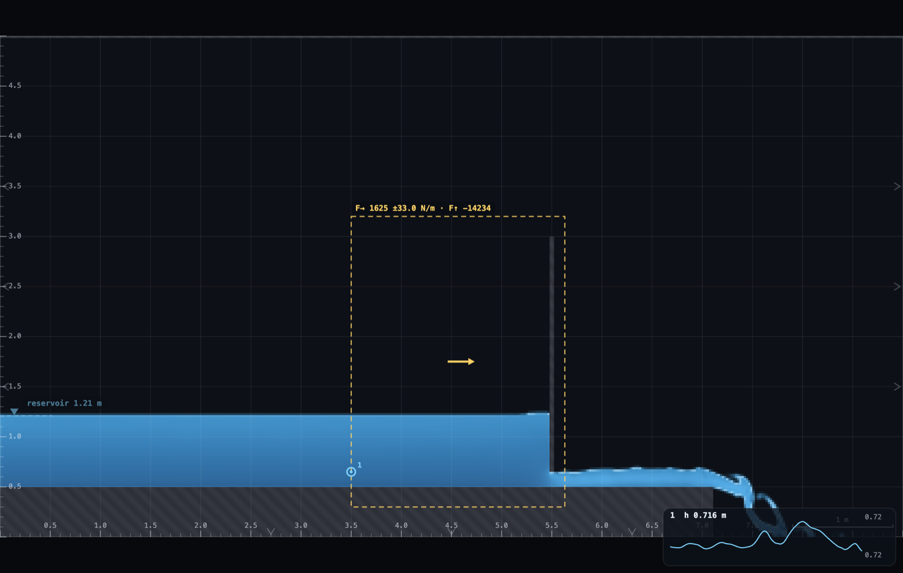
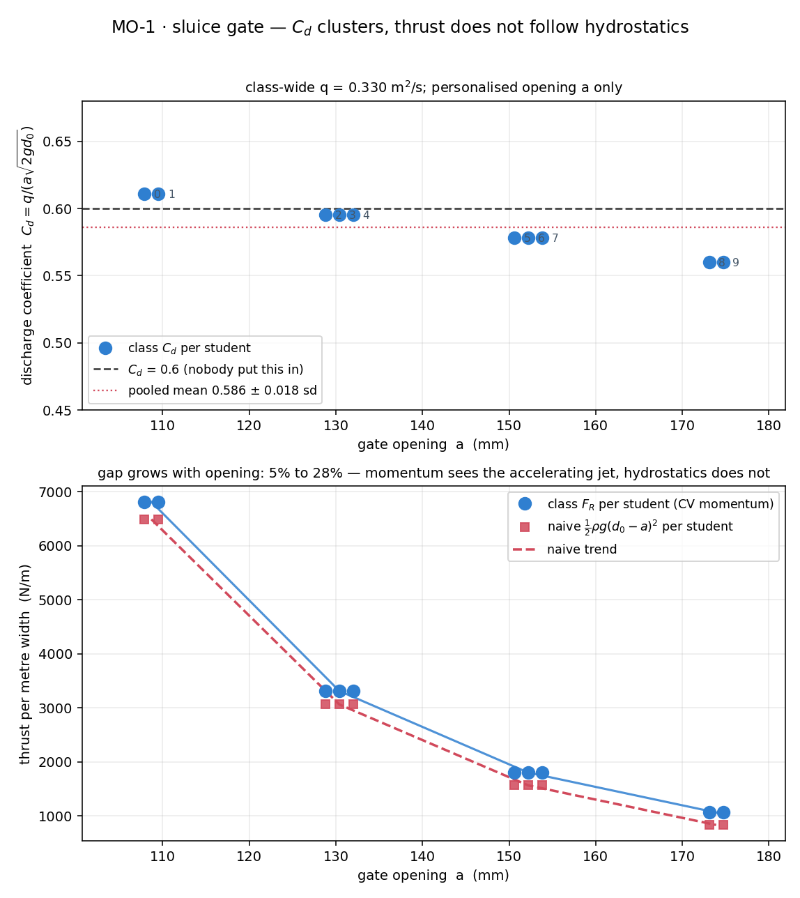

# MO-1 · Sluice gate: thrust and C_d from the control volume

Everyone runs the same vertical gate on the same flat bed at the **same
discharge**, and each student changes only **how far the gate is raised** —
the opening `a`. From two depths (a calm upstream pool, a hover reading in the
accelerating jet) and the panel's own discharge, each student computes two
numbers a first-year formula sheet already gives them: a discharge coefficient
and a control-volume thrust. Pooled, the C_d's land in a tight cluster around
0.6 across openings that differ by 60% — a constant nobody typed in anywhere.
A **Force box** then measures the thrust on the same control volume, so both
formula-sheet estimates can be compared with the force the flow delivers.

**Open it:** press **E** in the [app](https://barneydobson.github.io/hydraulician/)
and pick **MO-1**, or use the direct link
[`?ex=MO-1`](https://barneydobson.github.io/hydraulician/?ex=MO-1).
How to run any exercise: see the [teaching pack index](../INDEX.md#running-an-exercise).

## Theory

With `d₀` the upstream pool depth, `d₁` the depth at the vena contracta just
past the gate and `V = q/y` at each:

    C_d   = q / (a·√(2·g·d₀))
    F_R   = ρ·q·(V₀ − V₁) + ½·ρ·g·(d₀² − d₁²)     per metre width
    naive = ½·ρ·g·(d₀ − a)²                       the gate as a static wall

with ρ = 1000 kg/m³ and g = 9.81 m/s². The discharge is **q = 0.330 m²/s for
the whole class** — your opening and its paired reservoir level are the
personalisation. The bed's top face is at **z = 0.50 m** above the datum and
the gate stands at **x = 5.50 m**, so your opening is `a` = (gate bottom
− 0.50). Compute `naive` as well as `F_R`.

The **Force box** (tool `9`) evaluates the momentum theorem on the box you
drag: the flux and pressure integral over its four faces, time-averaged, with
the real flutter printed after the ±. **F→** is the number to read; gravity
never enters the horizontal budget. Put its upstream face at the gauge station
and its downstream face at the vena station and the box *is* the control volume
the `F_R` formula is written on — with two differences. It uses the pressure
and the velocity that are actually on those faces instead of assuming
hydrostatic pressure and uniform velocity, and it holds the bed as well as the
gate, so it carries the bed friction over the enclosed run (measured below:
1.9 – 6.3% of the reading).

## Your gate opening

**d** is the **last digit of your student number** — your lecturer will
explain the assignment in class. Your opening is `a = 5 + round(3d/9)` cells,
which you draw; the reservoir level beside it is the settled fixed point for
q = 0.330 at that opening, so it needs no iteration.

| d | opening a | gate bottom, z (m) | Reservoir level (m) |
|---|---|---|---|
| 0, 1 | 5 cells (0.109 m) | **0.609** | **1.7565** |
| 2, 3, 4 | 6 cells (0.130 m) | **0.630** | **1.4181** |
| 5, 6, 7 | 7 cells (0.152 m) | **0.652** | **1.2103** |
| 8, 9 | 8 cells (0.174 m) | **0.674** | **1.0791** |

## What to do

1. The gate arrives drawn at the 7-cell opening (bottom at z = 0.652). Adjust
   it to your own row — Erase (`2`) to raise the bottom, Wall (`1`) to carry
   it down; zoom in first and set the height with Measure (`8`) against the
   bed's 0.50 m top face.
2. Set **Reservoir level** to your row. **Inflow q** stays at 0.330 for
   everyone.
3. Place a gauge — Gauge (`5`) — in the calm pool at **x = 3.5 m**, just above
   the bed (z ≈ 0.65 m).
4. Press `R` and let it reach steady state — about **70 s**; the card counts
   it down. The pool should look flat back to the left edge, with a clean jet
   springing out under the gate.
5. Read **d₀** off the gauge card's `d`, then hover at **x = 5.63 m** and read
   the box's *depth d* as **d₁** — do not hover closer to the gate, where the
   box smooths across the opening and reads far too deep.
6. Pick the **Force box** (`9`) and drag from **(3.50, 0.30)** to **(5.63,
   3.20)**: upstream face at the gauge station, downstream face at the vena
   station, bottom face inside the bed, top face clear of the gate. Give the
   card a few seconds to fill its average, then read **F→**. Drag a second box
   — **(4.50, 0.50) → (5.63, 2.00)** — and check the reading holds. Submit
   **a, d₀, d₁, C_d, F_R, F→** (with your digit `d`).



Face rules: top anywhere above the water, bottom on or inside the bed,
downstream clear of the gate plate, upstream clear of the reservoir edge.
Breaking them costs real percent — a top face cut through the pool reads 15%
low, a downstream face through the plate reads half a plate — the numbers are
in the archive.

## For the instructor — pooling the class

Collect one row per student (`student,digit,a_m,q,d0_m,d1_m,Cd,FR_N_per_m`,
plus the box reading), export the CSV and run:

```bash
python3 collect_plot.py class.csv                # -> plots/pooled-demo.png
python3 collect_plot.py data/simulated-class.csv # the shipped dry-run class
```

The script re-derives C_d, F_R and the naive comparator from (a, q, d₀, d₁)
rather than trusting anyone's calculator, plots C_d against opening with the
0.6 line and the pooled mean through it, and below that F_R against the naive
hydrostatic guess. Both lower-panel curves are *estimates*; the box measures
the thing they estimate, and the table below is where each of them lands.



### What the box reads

Expect roughly 6.5 / 3 / 1.6 / 0.9 kN/m at the four openings. At every one the
box lands within a few percent of `naive` and about 5–15% under `F_R`; moving
the box, or restarting the rig, changes the reading by a percent or two. The
full measured table is in the archive.

### Discussion points

- **Which number is the force?** F→; `F_R` and `naive` are estimates of it.
  The box reads about 5–15% under `F_R` and within a few percent of `naive`.
  Both of the formula's assumptions fail at the vena face: the pressure there
  is well above hydrostatic, and Rake (`6`) at the vena shows the jet core
  running faster than q/d₁ (about 3.2 against 2.3 m/s). `naive` does well
  here because the pool is nearly still and the gate's downstream face is
  dry, so the plate carries close to plain hydrostatic thrust.
- **The `F_R` − `naive` gap tracks d₁, not the momentum flux.** This rig's
  jet barely contracts (d₁/a ≈ 0.9 against the textbook C_c ≈ 0.61 — a
  resolution property of a 5–8 cell opening). With the textbook d₁ the
  ordering would reverse and `F_R` would sit below `naive`. Say so rather
  than teach around it.
- **C_d drifts down (about 0.61 → 0.56) rather than sitting flat** because
  d₀/a falls from about 12 to 3 across the class, and the idealised orifice
  constant is best obeyed by the smallest openings. A spread-out class
  measures the trend without being told to look for it.

The full verification record — the ponding trap and why the apron is
truncated, the boundary-strategy measurement, the hover-fidelity scan behind
the x = 5.63 m station, the safe opening band, and the force-box record (the
three-box decomposition, the wall-pressure cross-check, the face-placement
costs) — is kept locally, out of version control, at
`exercises/MO-1-gate-cv/_archive/README-full.md`.
