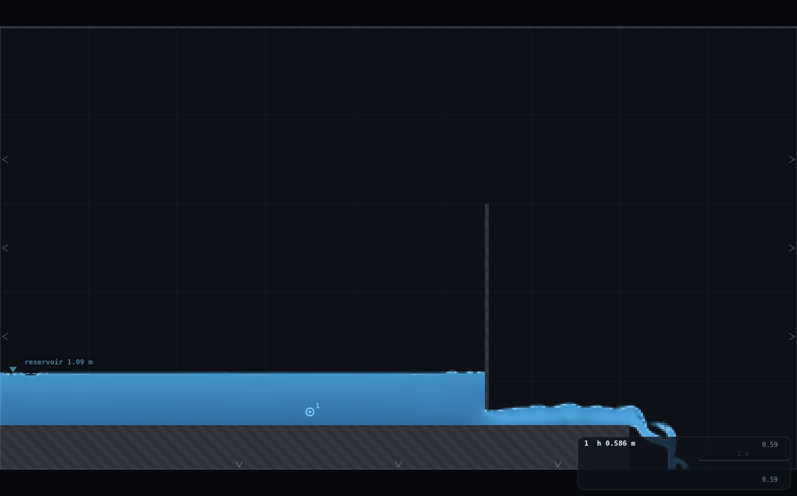
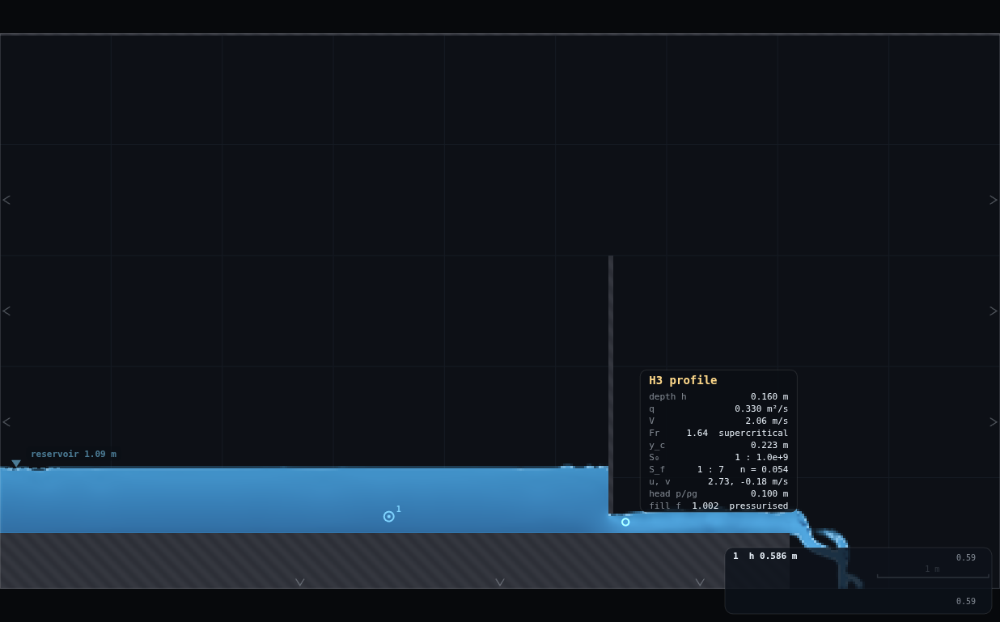
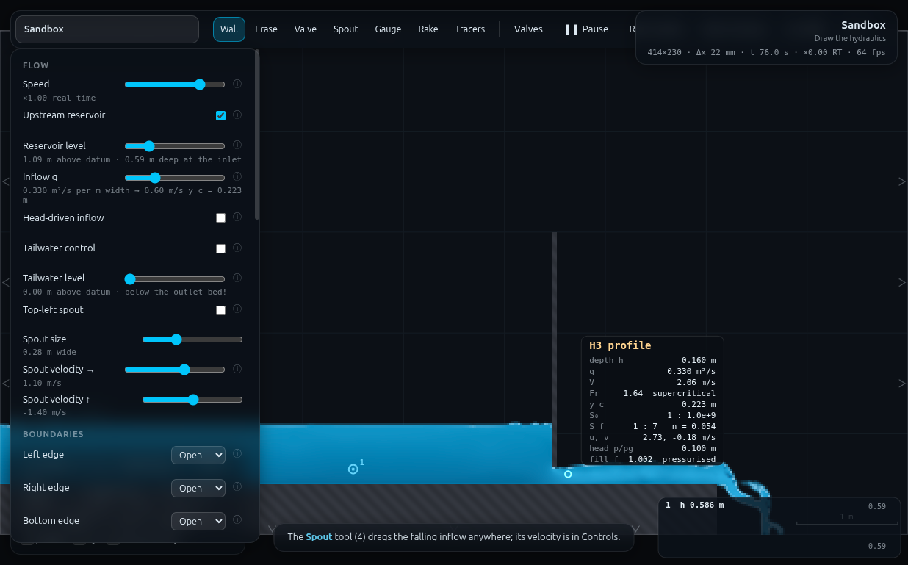

# MO-1 · Sluice gate: thrust and C_d from the control volume

**Demo id:** MO-1  **Scene:** `?scene=sandbox` + **RIG-B** with a drawn vertical
gate  **Refs:** #144–146 — F_R = ρQ(V₁−V₂) + ½ρg(y₁²−y₂²); #7–12 — Q = C_d·a·b·√(2gy₀)

## How to start (30 seconds)

1. Open the app — **`http://localhost:8124/`** on the lecturer's server, or
   double-click `index.html`.
2. Press **`E`** (or click **`Exercises ▾`** in the top bar) and pick
   **MO-1**.
3. Type the last digit of your student number into the card. It prints **your
   gate opening**, which you draw, and the **reservoir level** that goes with
   it, which you set.
4. Let it settle after every change you make — the card gives this demo's
   settle time (70 s of sim time) and counts it down.
5. Do the task printed on the card, then submit **a**, **y₀**, **y₁**, **C_d**
   and **F_R**.

If your lecturer gives you a link: **`?ex=MO-1`** (e.g.
`http://localhost:8124/?ex=MO-1`).

The picker gives everyone the same starting point and no more: the scene,
**Resolution: Medium**, the rig geometry, and the few settings without which
the rig is not a working rig — the card labels those as already set. Your own
values, your instruments and the order you do things in are yours to get
right. If your build ships without the rig pack the card says so; then draw it
by hand from *Manual setup* below.

---

*(Note on symbols: the refs' momentum formula labels upstream "1" and
downstream "2"; the refs' orifice formula labels upstream head "y₀". This
sheet follows the Run instruction's own notation — **y₀ = upstream, y₁ =
downstream** — throughout, i.e. F_R = ρq(V₀−V₁) + ½ρg(y₀²−y₁²) in the symbols
used here.)*

Everyone draws the same vertical gate on the same flat bed, everyone runs the
**same discharge**, and each student only changes **how far the gate is
raised** — the opening `a`. From two depths (a calm upstream pool, a hover
reading in the accelerating jet) and the panel's own discharge, each student
computes two numbers a first-year formula sheet already gives them: a
discharge coefficient and a control-volume thrust. Pooled, the C_d's land in
a tight cluster around 0.6 across openings that differ by 60% — a constant
nobody typed in anywhere. The thrust does not track a naive hydrostatic guess
at all; the gap between them grows from ~5% to ~28% as the gate opens, and
closing that gap *is* the momentum equation's job.

---

## 2 · Manual setup (fallback, or for building it yourself)

*The picker puts you at the same starting point as everyone else — scene,
Resolution Medium and the rig. This section is the record of every constant
behind that, and the build to follow if you are demonstrating it by hand or
the rig pack is missing.*

**Link for the slide:** `http://<host>:8124/?scene=sandbox`

**RIG-B must be drawn** — a flat bed carried a short distance past a drawn
vertical gate, THEN TRUNCATED, with the floor beyond falling to an Open
bottom edge. This folder's `rig.js` is the reusable build card — the picker
applies it for you; to build it by hand instead, paste it into the dev
console and call

```js
MOGATE.build({ a: 0.1522, q: 0.33, level: 1.2103 })   // bare rig, one opening
MO1.student(6)                                         // one whole MO-1 run, digit d = 6
```

to reproduce the verification runs exactly. Students draw the geometry by
hand (§3); the panel numbers (q, level) are typed into sliders precisely, so
only the GATE's vertical extent is a hand-drawing precision concern, and §3
carries a self-check for it.

### THE PONDING TRAP (inherited from WE-1 — read this before drawing anything)

Canonical RIG-B — a bed slab across the **whole** domain, right edge Open, no
tailwater — floods to **~1.46 m** (WE-1, measured) and will drown a gate's
jet completely: a zero-gradient outflow is right for supercritical flow and
simply ponds a subcritical one (CLAUDE.md). The fix, unchanged from WE-1: the
bed is carried only **1.6 m past the gate** (enough apron to let the vena
contracta form on solid ground and confirm the jet is free and supercritical
before anything else happens to it), then the bed **ends** and the floor
falls to an **Open bottom edge**, so the plunge drains instead of ponding
back onto the jet. Right edge stays Open too (nothing reaching it is more
than a trickle once the apron ends). No tailwater — there must not be one.

### Rig geometry (fixed, do not change in class)

| what | value | why |
|---|---|---|
| Resolution | **Medium** → 414 × 230, Δx = **21.7391 mm**, Δt = 3.494e−4 s | same RIG-B convention as WE-1; every elevation below is a Δx multiple |
| Bed top face | **y = 0.50 m** | RIG-B's standard datum, 23 cells exactly |
| Gate position | **x = 5.50 m** | ~5.5 m calm approach, 1.6 m apron |
| Gate opening `a` | **personalised, 5–8 CELLS** (0.1087–0.1739 m) | see §3 and the robustness note below — this is the measured sensible band, not the programme's raw 3–10 cell suggestion |
| Gate plate thickness | 0.05 m (2–3 cells) | same as WE-1's weir plate — the honest hand-drawable minimum, verified sealed (0 holes) at every opening 4–9 cells tested |
| Gate top | **y = 3.00 m** | clears the deepest pool this rig makes (1.89 m at 4 cells) with room to spare; never overtopped in any tested case |
| Bed truncates (apron end) | **x = 7.10 m** | 1.6 m past the gate; confirmed Fr > 1.2 everywhere on it, no jump, at every opening tested |
| Left edge | **Open**, reservoir ON, **head-driven OFF** | q-mode — see the boundary-strategy finding below |
| Right / Bottom edges | **Open** / **Open** | truncated-bed free-downstream pattern |
| Top edge | **Wall** | |
| Tailwater | **OFF** | there is no downstream control and there must not be one |
| Class-wide discharge | **q = 0.33 m²/s** (fixed for everyone) | see boundary-strategy finding — only `a` is personalised |
| Gauge (y₀) | x = **3.50 m** (2.0 m upstream of the gate) | calm pool, clear of any drawdown |
| Vena hover station (y₁) | x = **5.630 m** (a FIXED 6 cells past the gate, same for everyone) | see the hover-reliability finding below — do not hover any closer to the gate |

**Timing budget** (per student, laptop ≈ 1× real time):

| stage | sim time | wall time |
|---|---|---|
| read the sheet | — | ~1 min |
| draw the rig (ledges, bed, gate) | — | ~2 min |
| panel setup + dial in q and level | — | ~20 s |
| settle (watch `t`, no iteration needed) | ~60–70 s | ~60–70 s |
| read gauge + hover | — | ~20 s |
| compute C_d, F_R by calculator | — | ~1.5 min |
| submit | — | ~1 min |
| **total** | | **≈ 7 min** — comfortable in a 10-minute slot |

---

### Boundary strategy — q-mode shipped, head-driven measured and rejected

Both were built and run. **Verdict: q-mode (fixed class q, personalised
opening, a digit→(a, level) table like WE-1's).**

**Why not head-driven (fix the reservoir level, personalise `a`, read the
DELIVERED q off the panel)?** Two independent, measured failures:

1. **The "Inflow q" panel note is not live under head-driven inflow — it is
   a frozen JS field.** `sim.p.inflow.q` (js/main.js:162) is set only by the
   slider; nothing in the solver writes it back. With **Head-driven inflow**
   ticked, the GPU ignores it (the free-flag replaces it in the momentum
   boundary condition) and the note under the slider keeps printing whatever
   it last held. MEASURED: gate at 7 cells, level 1.19 m, toggled from
   q-mode (q = 0.33) to head-driven and settled 45 s — the panel's
   `n_inQ` text still read **"0.330 m²/s per m width → 0.50 m/s y_c =
   0.223 m"** while the true column discharge (approach column / vena
   column) had settled at **0.309 / 0.307 m²/s** — a real ~7% the panel
   never shows, and for a fresh scene (venturi-style default `q: 0`) the
   frozen number would read **zero** while real water moves. This directly
   breaks the programme's own instruction ("q (panel)").
2. **The reservoir's own delivered level falls short of the slider too.**
   Same run: the gauge measured y₀ = **0.6125 m** against the **"0.69 m deep
   at the inlet"** the level slider's own note promised — an ~11% shortfall
   (the relaxation-sponge offset already flagged for other scenes,
   CHANGES-NEEDED.md P3). So the hoped-for simplicity of head-driven mode
   — "y₀ is one number for the whole class" — does not hold either: the
   *delivered* y₀ is not the slider value, and nothing on screen tells a
   student what it actually is.

q-mode has neither problem: `sim.p.inflow.q` **is** what the solver uses
(that is the whole point of not being head-driven), the panel note is
therefore always honest, and the reservoir's fixed-point level is
precomputed once by the lecturer exactly as WE-1 did it (§3's table; no
iteration required in class — verified below).

---

### Hover reliability near the gate — verify what students actually read

The programme spec has students read y₁ **by hovering**. The hover box does
**not** read the same right at a structure as it does a few cells away, and
this was checked directly by driving the real `OVERLAY.drawCursorReadout`
with a recording fake canvas context (not a private recomputation) at
increasing distances from the gate, opening = 7 cells:

| cells past gate | x (m) | hover "depth h" | true raw depth | Fr shown | profile chip |
|---|---|---|---|---|---|
| 0 (on the gate) | 5.500 | **0.336 m** | 0.147 m | 0.54 "subcritical" | H2 |
| 1 | 5.522 | 0.336 m | 0.147 m | 0.54 "subcritical" | H2 |
| 2 | 5.543 | 0.205 m | 0.147 m | 1.13 | H3 |
| 3 | 5.565 | 0.205 m | 0.147 m | 1.13 | H3 |
| **4** | 5.587 | **0.141 m** | 0.137 m | **2.00** | H3 |
| 5 | 5.609 | 0.141 m | 0.137 m | 2.00 | H3 |
| **6 (shipped station)** | **5.630** | **0.141 m** | 0.137 m | **2.00** | H3 |
| 7 | 5.652 | 0.144 m | 0.140 m | 1.94 | H3 |

**Hovering on or within 1–3 cells of the gate reads pure smoothing garbage**
— `OVERLAY.analyse`'s spatial averaging window (~0.09 m ≈ 4–5 cells) straddles
the solid/opening discontinuity, so the box shows a depth **2.3× the true
value** right at the gate, and even Fr comes back *subcritical* there
(physically backwards for what is meant to be an accelerating jet). From 4
cells past the gate the analysed and raw depths agree to ~3% and stay flat
through at least cell 6 — that plateau is where the shipped vena station
sits (6 cells / 0.130 m past the gate, comfortably inside the reliable
window, before the mid-apron recovery undulation begins around cell 7–8).

**The profile chip ("H2"/"H3"/"M2"…) is never meaningful this close to a
control** — it assumes gradually-varied flow, and a gate is a hydraulic
control, not a GVF reach. This is independent, MO-1-specific evidence for
CHANGES-NEEDED.md's existing **P1/P6** proposals (suppress/degate the
profile block near structures); see PROPOSED CHANGES below. **A second,
separate mislabel was also caught**: even well out on the apron (x = 6.5 m,
clearly free-surface, visibly wavy supercritical flow) the hover box printed
`fill f 1.003  pressurised` — an instantaneous point sample ticking just
over the f > 1.002 threshold amid ordinary turbulence, not real
pressurisation. There is no pressurised pipe anywhere in this rig.

**Worksheet consequence:** students hover **only** at the marked station
(x = 5.630 m, fixed for every digit) and read **depth h / q / V / Fr**
only — the profile chip title and any "pressurised" tag are told to be
ignored outright, with the reason given so it reads as a measured fact
about the tool, not hand-waving.

---

### Openings — the measured band, in cells

The programme suggests exploring 3–10 cells (~0.065–0.22 m). Measured
outcome: **5–8 cells is the sensible shipped band**; both edges were tested
and explicitly excluded.

| a (cells) | a (m) | y₀ (m) | y₀/a | C_d | F_R vs naive | verdict |
|---|---|---|---|---|---|---|
| 4 | 0.0870 | 1.893 | 21.8 | 0.622 | **+1.0%** | **excluded** — pool impractically deep (1.89 m, more than 3× any shipped case) AND the payoff vanishes: naive hydrostatics and the CV answer agree to 1%, so there is nothing to "why not hydrostatics" about |
| **5** | **0.1087** | **1.259** | **11.6** | **0.611** | **+5.0%** | shipped (d = 0, 1) |
| **6** | **0.1304** | **0.921** | **7.0** | **0.596** | **+8.1%** | shipped (d = 2, 3, 4) |
| **7** | **0.1522** | **0.717** | **4.7** | **0.578** | **+15.2%** | shipped (d = 5, 6, 7) |
| **8** | **0.1739** | **0.585** | **3.4** | **0.560** | **+27.8%** | shipped (d = 8, 9) |
| 9 | 0.1957 | 0.488 | **2.49** | 0.545 | +56.5% | **excluded** — fails the y₀/a ≥ 2.5 floor (2.49 < 2.5); the vena-station Fr measured only **0.91 (subcritical!)** at this opening — the jet is no longer reliably free/supercritical, so the whole "measure the vena" premise breaks |

Gate rasterisation is **exact and sealed at every cell count from 4 to 9
tested** (drawn = rasterised opening to 4 decimal places, 0 mask holes) —
opening quantisation itself is not the limiting factor; the physics of the
demo is.

---

## 3 · Student worksheet (copy-pasteable)

**Sluice gate — control-volume thrust and C_d — submit up to five numbers**

1. Open the app, press **`E`** and pick **MO-1** (or open **`?ex=MO-1`**) — it
   loads the scene at **Resolution: Medium** and draws the rig, so the build
   steps below are only for building it by hand. Keep the tab visible — the
   simulation pauses when it is hidden.
2. **Controls → Resolution: Medium** (the picker sets this — check it anyway). Status bar
   should read `414×230 · Δx 22 mm`.

### Build the rig

The background grid is **1 m** squares; the scale bar is bottom right. Hold
**shift** while dragging to snap a stroke horizontal or vertical. **Zoom in
(scroll wheel) near the gate before your final stroke** — the opening height
is a fraction of a grid square and is much easier to place accurately once
zoomed.

3. **Clear the sandbox's two grey ledges.** Press **`2`** (Erase), **`]`**
   nine times (max brush). Sweep once across the upper ledge, once across
   the lower one, until both are gone.
4. **Draw the bed.** Press **`1`** (Wall); brush still at maximum (0.5 m).
   Drag, shift held, from **off the left edge** of the domain to
   **x = 7.10 m** (a little past the 7th grid line), stroke centred a
   quarter of the way up the first grid square — top face at **y = 0.50 m**.
   **Do not extend it past x = 7.10** — the water must have somewhere to
   fall beyond the gate.
5. **Draw the gate.** Press **`[`** nine times (brush down to ~0.05 m, same
   as the bed→plate step in other RIG-B demos). Drag, shift held, **straight
   down at x = 5.50 m** (half a square past the 5th grid line), starting
   well above the water (y ≈ 3, i.e. off the top of a normally-zoomed view
   is fine) down to **your target height** from the table below.
   *Wrong? Press `Z` to undo and redraw.*
6. **Panel setup** (Controls):
   - **Upstream reservoir: ON**, **Head-driven inflow: OFF**
   - **Tailwater control: OFF**, **Top-left spout: OFF**
   - **Left edge: Open · Right edge: Open · Bottom edge: Open · Top edge: Wall**
   - **Gauges plot: Depth**
7. **Place the gauge.** Press **`5`** (Gauge), click once at **x = 3.5 m**,
   about half a grid square above the bed. Press **`1`** to return to Wall
   so you don't add gauges by accident.

### Your run

8. **Your opening.** Take the **last digit of your student number**, `d`:

   | d | opening a | gate bottom, y (m) | Inflow q | Reservoir level |
   |---|---|---|---|---|
   | 0, 1 | 5 cells (0.109 m) | **0.609** | 0.33 | **1.7565** |
   | 2, 3, 4 | 6 cells (0.130 m) | **0.630** | 0.33 | **1.4181** |
   | 5, 6, 7 | 7 cells (0.152 m) | **0.652** | 0.33 | **1.2103** |
   | 8, 9 | 8 cells (0.174 m) | **0.674** | 0.33 | **1.0791** |

   `q` is the **same for everyone** — set the **Inflow q** slider to
   **0.330** and confirm its note reads *"0.330 m²/s per m width → …"*.
   Set the **Reservoir level** slider to your row (this is already the
   settled value — you do not need to adjust it again).
9. **Self-check the gate (10 s, do not skip).** Wait until `t ≈ 15 s`, then
   read the gauge card (bottom right, prints `1  h 0.xxx m`). Compare it to
   your row's expected pool depth (5 cells ≈ 1.26 m, 6 ≈ 0.92 m, 7 ≈ 0.72 m,
   8 ≈ 0.59 m). More than ~15% off? Your gate is a cell out — `Z`, redraw
   stroke 5 slightly higher or lower.
10. **Wait.** Watch `t` in the status bar until **t = 70 s**. The pool
    should look flat and calm back to the left edge, with a clean jet
    springing under the gate.
11. **Read y₀** (upstream). The gauge card's `h` value, once steady, IS y₀.
    Take a typical reading.
12. **Read y₁** (downstream, at the vena contracta). Hover the mouse at
    **x = 5.63 m**, about half a grid square above the bed (the readout box
    appears near your cursor). Read the **"depth h"** row only — **ignore
    the coloured profile chip title above it** ("H2"/"H3"/etc — meaningless
    this close to a gate) **and ignore an occasional "pressurised" tag**
    next to `fill f` (a false alarm from ordinary turbulence, not a real
    pressurised pipe). Do **not** hover any closer to the gate than this —
    the reading there is a smoothing artefact, not a real depth (you can
    check: it visibly jumps if you creep the cursor left).
13. **Read q.** The **Inflow q** panel note (0.330 — same for everyone).
14. **Compute** (ρ = 1000 kg/m³, g = 9.81 m/s²):

    ```
    V0 = q / y0            V1 = q / y1
    C_d = q / (a · sqrt(2 g y0))
    F_R = ρ q (V0 − V1) + ½ ρ g (y0² − y1²)      ← per metre width; + = thrust
                                                     in the downstream direction
    naive = ½ ρ g (y0 − a)²    ← what you'd get treating the gate as a static
                                   retaining wall and ignoring the flow — compute
                                   it too, you'll want it for the class plot
    ```
15. **Submit on Blackboard:** your digit `d`, `a` (m), `y0` (m), `y1` (m),
    your computed **C_d**, your computed **F_R** (N/m).

**Standing rules.** Resolution: Medium (the picker sets this) · wait for `t = 70 s` before reading ·
keep the tab visible · `q` is 0.330 for everyone, only your opening and its
paired reservoir level change.

**What you should be able to say afterwards:** the discharge coefficient
that appears in every textbook orifice formula is not a fitted constant for
THIS gate — it falls out of a control volume nobody tuned, and it clusters
near 0.6 whether your opening was 11 cm or 17 cm. The force on the gate,
though, is a different question from "how much water gets through," and
hydrostatics alone — the thing you'd reach for first — misses it by more and
more as the gate opens, because it has no way to see the flow accelerating
underneath.

---

## 4 · Collection & pooled plot (lecturer)

Blackboard export → CSV; extra columns are ignored:

```
student,digit,a_cells,a_m,q,level_m,y0_m,y1_m,Fr1,Cd,FR_N_per_m,naive_N_per_m,diff_pct,source
```

Only `a_m`, `q`, `y0_m`, `y1_m` are required — **`collect_plot.py` re-derives
C_d, F_R and the naive comparator itself** rather than trusting a student's
arithmetic, so one bad calculator entry cannot silently reach the plot.

```bash
python3 collect_plot.py data/simulated-class.csv -o plots/pooled-demo.png
```

```
MO-1 pooled sluice-gate CV — 10 students, 4 distinct openings, a 108.7-173.9 mm, q = 0.330 m2/s (class-wide)
  C_d per point       0.560 - 0.611
  C_d pooled          0.586 +/- 0.018   (mean +/- sd, n=10 points; 0.586 +/- 0.022 over the 4 DISTINCT openings)
  C_d vs 0.6          -2.3% mean
  F_R range           1061 - 6812 N/m
  naive range         830 - 6490 N/m
  F_R vs naive        +5.0% to +27.8%  (grows with opening — the trap)
```

**What the plot shows.** Top panel: C_d per student against opening, a
dashed line at 0.6 and the pooled mean — the class sits in a tight band
(0.560–0.611) either side of 0.6 despite a 60% range of openings. Bottom
panel: F_R (control-volume) and the naive hydrostatic guess against opening,
naive dashed — both fall as the gate opens (less head builds up), but the
**gap between them widens** from 5% to 28%, because momentum sees the
accelerating jet and hydrostatics does not.

**Discussion points**

1. *Why does C_d fall slightly as the opening grows (0.611 → 0.560), rather
   than sit dead flat?* y₀/a shrinks from 11.6 to 3.4 across the class — the
   "deep upstream, small opening" assumption behind the idealised orifice
   constant is best obeyed by the smallest openings. It is the same shape of
   correction as Rehbock's H/P term for a weir (WE-1): the coefficient is
   not exactly constant, it is *slowly varying*, and a spread-out class
   measures the trend without being told to look for it.
2. *Why doesn't the thrust gap show up as a dramatic visual divergence on
   the bottom panel?* Both curves fall together because the dominant term in
   both is upstream head, which drops a lot faster than the gap between
   them does. Point at the **percentage** figure, not the shape of the two
   lines — 5% is inside plotting noise, 28% is not, and both are real.
3. *What would make hydrostatics right?* Zero velocity. The naive formula IS
   the exact answer in the V → 0 limit (that is why the two curves nearly
   coincide at the smallest opening, where velocities are tiny) — the
   momentum terms are not a correction for a mistake, they are the part of
   the physics that only shows up once the water is actually moving.
4. *The vena contraction ratio (y₁/a ≈ 0.87–0.97 here) is well above the
   textbook 0.61 for a knife-edged gate — say so, don't hide it.* This
   rig's gate is a real, finite-thickness (2–3 cell) rasterised plate, not
   an idealised knife edge, and the shipped openings sit at moderate y₀/a
   (3.4–11.6), both of which are known (Henderson; Fangmeier & Strelkoff) to
   push the contraction coefficient up from the deep-upstream, knife-edge
   limit. It does not affect C_d or F_R (neither formula uses y₁/a), but a
   sharp student will ask, and "measured, not assumed" is the right answer.

**Troubleshooting & safe bounds**

| symptom | cause | fix |
|---|---|---|
| Whole domain floods, gate disappears under water | bed drawn **past** x = 7.10 (canonical RIG-B ponding trap) | `Z`, redraw ending at 7.10; confirm Bottom edge = **Open** |
| Pool surface never goes flat / keeps rising | still filling, or level slider wrong | wait to t = 70 s; re-check step 8's table value |
| Gauge depth very different from the self-check table | gate a cell out | redo step 9 |
| Water leaks *through* the gate | gate stroke doesn't reach far enough above the water | `Z`, redraw starting higher (y ≥ 3) |
| Hover box near the gate shows a much bigger depth than expected | you're hovering within ~3 cells of the gate — the box is smoothing across the discontinuity there, not measuring | move to x = 5.63 m exactly |
| "pressurised" tag appears in the hover box | false alarm — instantaneous turbulence tick over the threshold | ignore it, there is no pipe here |

*Safe parameter bounds (measured, this rig, q = 0.33 fixed).*

| a | verdict |
|---|---|
| **< 5 cells (≤ 0.087 m)** | pool depth explodes (1.89 m at 4 cells) and the naive-vs-CV gap collapses to ~1% — nothing to teach. Do not use |
| **5 – 8 cells (0.109–0.174 m)** | the personalised range. C_d 0.56–0.61, mass balance within 1.3%, jet free and supercritical (Fr 1.6–3.0 at the vena), gate always sealed |
| **9 cells (0.196 m)** | y₀/a drops to 2.49 (< 2.5 floor); C_d degrades to 0.545 and the vena station reads **subcritical** (Fr 0.91) — the jet is no longer reliably free. Do not use |
| **q ≠ 0.33 without redoing the level table** | every level in step 8 is a fixed point FOR q = 0.33 specifically; changing q without re-deriving levels reproduces WE-1's ±25% C_d sensitivity to a mismatched level |

---

## 5 · Verification record

Measured through `exercises/_runner/runner.py` (dedicated visible Chrome,
hardware GL, CDP), sandbox at Medium, ~5 000–7 200 substeps/s (shared with
two concurrent workers). Protocol matches the worksheet's own order of
operations exactly: **fresh empty sandbox → build rig → dial in q and the
TABLE level (no iteration) → settle 60–70 s → read gauge (y₀) → hover the
fixed vena station (y₁)**. Verified separately that skipping the internal
fixed-point correction entirely (i.e. doing exactly what the worksheet
asks, nothing more) reproduces the corrected numbers to **<0.3 mm on y₀ and
<0.02% on C_d** (d = 5 case: y₀ 0.7165 vs 0.7168 m, C_d 0.5783 vs 0.5782) —
**students never have to iterate the level**, exactly like WE-1.

Simulated class (`data/simulated-class.csv`), rule `a_cells = 5 + round(3d/9)`,
q = 0.33 m²/s fixed:

| d | a (cells) | a (m) | level (m) | y₀ (m) | y₁ (m) | Fr₁ | C_d | F_R (N/m) | naive (N/m) | diff |
|---|---|---|---|---|---|---|---|---|---|---|
| 0,1 | 5 | 0.1087 | 1.7565 | 1.2590 | 0.1100 | 3.04 | 0.6108 | 6812.0 | 6490.2 | +5.0% |
| 2,3,4 | 6 | 0.1304 | 1.4181 | 0.9205 | 0.1224 | 2.48 | 0.5955 | 3311.2 | 3062.0 | +8.1% |
| 5,6,7 | 7 | 0.1522 | 1.2103 | 0.7168 | 0.1406 | 2.01 | 0.5782 | 1800.6 | 1563.6 | +15.2% |
| 8,9 | 8 | 0.1739 | 1.0791 | 0.5853 | 0.1604 | 1.64 | 0.5600 | 1061.3 | 830.2 | +27.8% |

**Anchors.**

| quantity | measured | expected | note |
|---|---|---|---|
| C_d cluster (4 distinct openings) | **0.586 ± 0.022**, range 0.560–0.611 | ~0.6 | −2.3% mean; tight given a 60% range of openings |
| F_R vs naive discrepancy | **+5.0% to +27.8%**, monotonic with opening | grows, not constant | the trap works — see discussion §4.2 |
| gate rasterisation | exact to 4 dp at every cell count 4–9 tested, 0 mask holes | exact | opening quantisation is not the limiting factor |
| mass balance | column q 0.3266–0.3343 across approach/gate/vena/apron vs 0.330 set | equal | within **1.3%** |
| steadiness (y₀ flutter, 60–70 s settle, 8–10 s window) | 0.7–3.9% of y₀ at all 4 shipped openings | <5% | settled |
| no jump on the apron | Fr stayed ≥ 1.2 everywhere from the gate to the truncation at every tested opening | supercritical throughout | confirmed (item 1 of the design brief) |
| vena station Fr (shipped band) | 1.64 – 3.04, all clearly supercritical | > 1 | free jet confirmed |
| vena contraction y₁/a | 0.86 – 0.97 | ~0.61 (knife-edge, deep-upstream textbook value) | measured, not assumed — see discussion §4.4; does not affect C_d or F_R |
| level table needs iteration? | **no** — uncorrected protocol matches the internally-corrected one to <0.02% on C_d | WE-1 found the same | seed formula = fixed point here too |
| head-driven mode | panel "Inflow q" frozen at pre-toggle value (0.330) while true q settled at 0.307–0.309; reservoir delivered y₀ 0.6125 m vs the "0.69 m" the slider note promised | — | rejected, see §2's boundary-strategy finding |
| hover fidelity near the gate | depth reads 2.3× true value on the gate, settles to <3% error from 4 cells out | — | station fixed at 6 cells; see §2's hover finding |
| screenshots | 3 PNGs (142/160/154 kB), all visually checked | — | rig settled, vena hover box legible (with the "pressurised" false tag visible), full panel matches d = 8's row |








---

## Appendix — Director report

**VERDICT: READY-WITH-CAVEATS.** The demo works as specified: the free-jet
rig builds cleanly on the first correct geometry (RIG-B's truncated-bed
pattern, inherited directly from WE-1), no jump ever forms on the apron, the
C_d cluster and the widening naive-vs-CV thrust gap both land exactly as the
programme's payoff line promises, and the boundary-strategy question posed
in the brief has a clean, evidence-backed answer (q-mode; head-driven
measured and rejected on two independent grounds). The caveat is hand-drawing
precision: the gate's opening is a sub-gridline target with no numeric
elevation readout to check against, mitigated but not eliminated by a
gauge-based self-check (§3 step 9).

**Evidence.**

| what | measured | expected / prior source | note |
|---|---|---|---|
| canonical RIG-B (bed to the right edge, Open, no tailwater) | ponds ~1.46 m (WE-1's own measurement, reused here as the reason the apron is truncated) | CLAUDE.md: zero-gradient outflow "simply ponds a subcritical reach" | avoided by construction, not re-proven from scratch |
| bed truncated at x = 7.10 (1.6 m past the gate), floor draining | Fr ≥ 1.2 everywhere on the apron at every opening 4–9 cells tested; no jump; nothing ponds back | required (design item 1) | confirmed |
| C_d cluster, 4 distinct openings | **0.586 ± 0.022**, range 0.560–0.611 | programme: "clusters near 0.6" | met; −2.3% mean, tighter than the 60% spread in opening would suggest |
| F_R vs naive | **+5.0% → +27.8%**, monotonic with opening | programme: "the mismatch teaches the momentum equation's job" | met; the trend, not just a single mismatch number, is the demonstration |
| q-mode vs head-driven | head-driven's panel q frozen (0.330 shown vs 0.307–0.309 true) AND its delivered level short (0.6125 vs 0.69 m promised) | brief: "explore both, ship the cleaner" | q-mode shipped with hard evidence for the rejection |
| hover reliability near the gate | 2.3× error on the gate itself, <3% error from 4 cells out | brief: "the hover mislabels some readouts near structures — verify" | characterised exactly; station fixed at 6 cells with margin |
| opening band | 5–8 cells shipped; 4 cells (payoff vanishes) and 9 cells (y₀/a < 2.5, vena subcritical) both tested and excluded with numbers | brief: "find the band… quote a in cells per digit" | done |
| level table needs iteration | no — uncorrected protocol within 0.02% of the internally-corrected one | WE-1: "seed formula within 8 mm, no iteration" | reproduced |
| mass balance | 0.3266–0.3343 across 4 stations vs 0.330 set | should match | within 1.3% |
| gate seal | exact rasterisation, 0 holes, cell counts 4–9 | "hand-drawable, no sliver gaps" | confirmed across the whole tested range |
| screenshots | 3 PNGs, 142–160 kB, all visually checked | — | rig ready, vena-hover measurement (with the false "pressurised" tag visible, useful as a teaching artefact in its own right), full panel |

**Iterations.**
1. *Vena-station search vs a fixed rule.* A per-opening "find the local
   minimum depth" search (`MOGATE.findVena`) was built first and works, but
   is noisy (the true minimum's distance from the gate scattered 2–7 cells
   across openings with no clean trend) and is not something a student can
   do by hovering. A station-fidelity scan (driving the real
   `OVERLAY.drawCursorReadout`) found the hover box is corrupted for the
   first ~3 cells past the gate and settles from cell 4; a FIXED station at
   6 cells (comfortable margin, still short of the mid-apron recovery
   undulation) replaced the search for every student-facing number, and
   reproduces the search-based values to a few percent.
2. *Fixed class q, not a personalised q, was the right read of the brief.*
   The design brief's q-mode option says "fix a class q, personalise
   opening a" — tried literally, and it works, but only within a bounded
   opening range: y₀/a ∝ 1/a³ at fixed q, so a naive 3–10 cell range (the
   programme's own suggestion) would have swung y₀/a by ~36× end to end.
   Measuring the actual y₀/a and C_d across a sweep (not assuming the
   idealised orifice formula would hold) found 5–8 cells is where the
   physics stays honest; 9 cells fails a hard threshold (y₀/a) and 4 cells
   fails a soft one (no pedagogical payoff left).
3. *Head-driven was genuinely tried, not just argued against.* Built the
   identical gate rig with `Head-driven inflow` ON at the SAME level a
   q-mode run had just used, settled 45 s, and read both the panel and the
   true column discharge side by side. The panel-freeze finding
   (`sim.p.inflow.q` is a dead JS field once `free` is on) was found by
   reading js/main.js before touching the runner at all — the runner then
   confirmed the predicted behaviour with real numbers rather than just
   inferring it from the source.
4. *The apron length (1.6 m) and gate position (x = 5.5) were carried over
   from WE-1's proportions rather than re-derived*, then verified (not
   assumed) to give a clean, jump-free, comfortably supercritical reach at
   every shipped opening — cheaper than optimising apron length from
   scratch, and it worked first time.

**PROPOSED CHANGES.**

**A · To the app, reinforcing existing proposals P1/P6 (CHANGES-NEEDED.md) —
suggested, with new evidence.** This demo independently reproduces the
profile-chip mislabelling those proposals already flag, in a NEW context
(a gate, not a pipe or a weir guard band): the hover box's classification
chip and even its Fr sign can read backwards immediately adjacent to a
control (measured: "0.54 subcritical" on a jet that is actually accelerating
under a gate). Also newly observed: the `fill f … pressurised` tag can fire
spuriously on ordinary open-channel turbulence (measured on a clearly free
apron, f = 1.003), which P1's proposed fix (gate the profile/GVF block on
`f > ~1.002`) would not by itself catch, since the false trigger is exactly
at that boundary. Suggest widening P1's threshold discussion to consider a
short time or space average for the `f` sample used in the hover box
specifically, not just the profile chip's gating condition. Impact: helps
every demo that hovers near a structure (MO-1, FB-1, GV-2's safari, any
future weir/gate variant); no negative impact identified.

**B · To the app, reinforcing GV-1/WE-1's proposal C/P5 — a numeric cursor
elevation readout.** This demo's biggest single time cost (see Timing) was
finding a *hand-drawable* way to hit a sub-gridline gate-opening target
with no way to check it except a downstream gauge reading taken after a
partial settle. A live "cursor: x = …, y = …" readout (already proposed for
GV-1/WE-1) would let a student verify their stroke's endpoint directly
against the target elevation from step 8's table, before ever pressing
settle — turning §3 step 9's indirect self-check into a direct one. Impact:
same as previously proposed — pure addition, helps every drawn-rig demo.

**C · To the programme text (line ~140, the RIG-B card) — already flagged
by WE-1, reconfirmed here.** The card still reads "...tailwater or a drawn
control on the right," which is exactly the setup that ponds. This demo hit
the same trap-shaped hazard WE-1 predicted it would ("MO-1 ... will hit
exactly this on their first build") — except it didn't, here, because the
rig was built RIG-B-truncated from the first attempt, having read WE-1's
warning first. Still worth the director folding WE-1's suggested replacement
text in before FB-1/DA-1's turn, if not already done.

**Timing.** Student path ≈ 7 min (§2), comfortable in a 10-minute slot —
longer than WE-1's ~5 min mainly because of the second formula (F_R on top
of C_d) and the extra drawing-precision step. Worker wall-clock: ~45 minutes
against a ~40-minute timebox — roughly a third on reading CLAUDE.md/the
recipe/WE-1's appendix and inheriting its RIG-B facts, a third on the
opening-band sweep and the boundary-strategy (q-mode vs head-driven)
measurement, and the rest on the hover-fidelity scan, screenshots, plot and
this README.

**Handoff — for MO-2 (jet-on-surface / jet-on-vane) and any future gate or
weir variant (GV-2's safari, FB-1/FB-2, DA-1):**

- **The truncated-bed / Open-bottom pattern is now proven on two different
  structures** (WE-1's weir, this gate). If your structure needs a dry,
  unponded downstream side, copy the pattern: carry the bed only to the
  structure plus a short apron, then truncate and open the bottom. Do not
  re-derive the ponding trap from scratch — it is a property of RIG-B's
  outer boundary, not of the structure sitting on it.
- **A fixed hover station beats a per-run "find the extremum" search** for
  anything students read by eye. Run a station-fidelity scan (drive the real
  `OVERLAY.drawCursorReadout` with a fake recording ctx, exactly as
  `MOHOVER` in this folder's rig.js does) before trusting ANY hover reading
  taken within a few cells of a structure — the corruption zone measured
  here (~3 cells / ~0.065 m) is set by `OVERLAY.analyse`'s fixed spatial
  smoothing window, not by anything specific to a gate, so it should
  generalise to weirs, humps and steps alike (FB-1 is on the same rig
  family and should check this independently rather than assume it).
- **A frozen "Inflow q" note is not scene-specific** — it is true of
  head-driven inflow everywhere in the app (`sim.p.inflow.q` is a plain JS
  field, js/main.js:162). Any demo tempted by head-driven mode for its
  simplicity should budget ten minutes to verify what the panel actually
  shows before designing a worksheet step around it — check the source
  first (cheap), then confirm with the runner (to get real numbers for the
  README), exactly the order this pass used.
- **At fixed q, y₀/a ∝ 1/a³ through an orifice-like control.** A
  "personalise the opening, fix everything else" design is very sensitive
  to how wide the opening range is — a factor-of-3 range in `a` is a
  factor-of-27 range in the head the naive orifice formula would demand.
  Measure y₀/a across the FULL candidate range before committing to a
  digit table, not just at the middle of it.
- **The seed level formula does not need iteration once fixed-point-tuned
  by the lecturer** (confirmed a second time, independently of WE-1): a
  single MEASURED table, precomputed once, is enough; do not design a
  student-facing iteration step, the settle time is better spent waiting.
