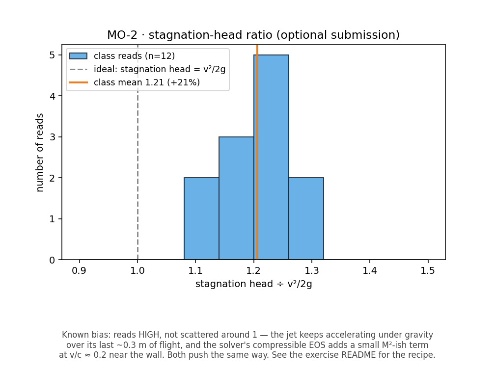

# MO-2 · Jet on a plate, jet on a vane

A spout fires a free jet across open air onto a drawn plate. Probe the
stagnation point and watch it read `v²/2g`; then switch to the momentum-flux
display and redraw the plate as a 45° ramp, a 90° corner and a deep-V, and
watch the coloured flux field turn from "forward" to "sideways" to "backward"
as the shape changes. The force is never read off a dial — it is computed on
the board from `q`, `v` and the turning angle the sim has just shown you,
which is the honest shape of every momentum exam question.

**Open it:** press **E** in the [app](https://barneydobson.github.io/hydraulician/)
and pick **MO-2**, or use the direct link
[`?ex=MO-2`](https://barneydobson.github.io/hydraulician/?ex=MO-2).
How to run any exercise: see the [teaching pack index](../INDEX.md#running-an-exercise).

## Theory

A jet turned through θ pushes back on whatever turned it, and a jet brought to
rest converts all its velocity head to pressure head:

    F = ρ·q·v·(1 − cos θ)          stagnation head = v² / 2g

Everyone reads the same rig — there is no personalised parameter. The spout
sits at (0.70, 2.50), 0.18 m wide at 4.5 m/s, and the flat plate at x = 1.35 m;
measured in the free jet, **q ≈ 0.78 m²/s** and **v ≈ 4.46 m/s**. Expect the
stagnation head to come out at **1.15–1.30 × v²/2g**, not exactly 1: the jet
keeps accelerating under gravity over its last stretch of flight, and the
solver's compressible equation of state adds a term at v/c ≈ 0.2. That gap is
the lesson, not an error to hide.

## What to do

1. Drop two gauges — Gauge (`5`) — one in the free jet, clear of both the
   spout and the plate (0.95, 2.50), and one on the stagnation point at the
   plate face (1.32, 2.46).
2. Press `R` and let it reach steady state — about **5 s**; the card counts it
   down. Re-settle 3–5 s after every redraw below.
3. Read both gauge cards' **H**, which already includes elevation: the
   stagnation pressure head is `H_stag − y_stag`, and the free-jet gauge's own
   `H_ref − y_ref` should read ≈ 0, confirming it really is in free water.
   Hover that station for **u, v** and use the full speed √(u² + v²).
4. Switch **Field → Momentum flux** and work through the four shapes below —
   the flat plate is already on the bench, so Erase (`2`) it and draw the next
   with Wall (`1`) each time. Warm colours are flow still heading the way the
   jet was fired, white is flow turned sideways, blue is flow turned back on
   itself.

| shape | draw | θ |
|---|---|---|
| flat plate | (1.35, 2.00)–(1.35, 3.00) | 90° |
| 45° ramp | (1.00, 2.90)–(1.80, 2.10) | 45° |
| 90° corner | ceiling (1.00, 2.60)–(1.35, 2.60), wall (1.35, 2.60)–(1.35, 1.60) | 90° |
| deep-V | two 0.9 m arms 15° either side of the axis from apex (1.60, 2.45) | 165° |

The V's apex needs one short capping stroke across it: butt-ended arms meeting
at a point do not rasterise sealed, and a leaky apex shows no reversal at all.

## For the instructor

Write `F = ρqv(1 − cos θ)` on the board for each shape as it is redrawn, using
the rig's measured q ≈ 0.78 m²/s and v ≈ 4.46 m/s:

| shape | θ | 1 − cos θ | F (N per m width) |
|---|---|---|---|
| flat plate / 90° corner | 90° | 1.000 | **3 479** |
| 45° ramp | 45° | 0.293 | **1 019** |
| deep-V | 165° | 1.966 | **6 841** |
| *(Pelton ideal, unreachable)* | 180° | 2.000 | 6 958 |

The 90° corner is the cleaner picture of θ = 90° — the ceiling blocks the
upward escape, so the sheet does not split as it does on the flat plate — and
it gives the same computed force, which is a good cross-check to make out
loud. Say of the deep-V that the blue is a real sign but its intensity is not
a speedometer: the display is normalised against the scene's own `vmax`.

**Optional submission.** Students can post their **stagnation-head ratio**
(stagnation pressure head ÷ v²/2g) as `student,ratio`. Nothing is
personalised, so the pooled plot is a histogram of read-to-read wobble around
the value this rig actually delivers, not a swept variable:

```bash
python3 collect_plot.py class.csv                # -> plots/pooled-demo.png
python3 collect_plot.py data/simulated-class.csv # the shipped dry-run class
```



The full verification record — the jet-quality and droop measurements, the
stagnation recipe and why both methods read high, the measured deep-V turn
angle, the build traps and troubleshooting — is archived in the repository at
`exercises/MO-2-jet-vane/_archive/README-full.md`.
