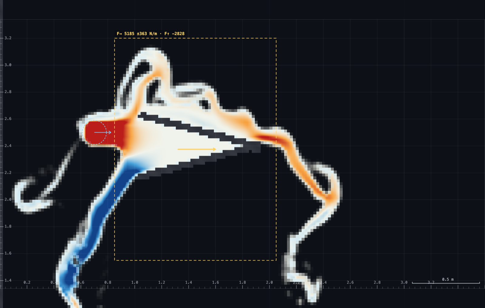

# MO-2 · Jet on a plate, jet on a vane

A spout fires a free jet across open air onto a drawn plate. Probe the
stagnation point and watch it read `v²/2g`; then switch to the momentum-flux
display and redraw the plate as a 45° ramp, a 90° corner and a deep-V, and
watch the coloured flux field turn from "forward" to "sideways" to "backward"
as the shape changes. `F = ρqv(1 − cos θ)` goes on the board from `q`, `v` and
the turning angle the sim has just shown you; a control-volume **Force box**
then reads the force the rig actually delivers, so the board number has
something to be checked against.

**Open it:** press **E** in the [app](https://barneydobson.github.io/hydraulician/)
and pick **MO-2**, or use the direct link
[`?ex=MO-2`](https://barneydobson.github.io/hydraulician/?ex=MO-2).
How to run any exercise: see the [teaching pack index](../INDEX.md#running-an-exercise).

## Theory

A jet turned through θ pushes back on whatever turned it, and a jet brought to
rest converts all its velocity head to pressure head:

    F = ρ·q·v·(1 − cos θ)          stagnation head = v² / 2g

Everyone reads the same rig — there is no personalised parameter. The spout
sits at (0.70, 2.50), 0.18 m wide at 4.5 m/s, and the flat plate at x = 1.35 m;
measured in the free jet, **q ≈ 0.78 m²/s** and **v ≈ 4.46 m/s**, so
ρqv ≈ 3.5 kN/m. Expect the stagnation head to come out at **1.15–1.30 × v²/2g**,
not exactly 1: the jet keeps accelerating under gravity over its last stretch
of flight, and the solver's compressible equation of state adds a term at
v/c ≈ 0.2. That gap is the lesson, not an error to hide.

The **Force box** (tool `9`) evaluates the momentum theorem on the box you
drag — the flux and pressure integral over its four faces, time-averaged, with
the flutter printed after the ±. `F→` is the number to read; gravity never
enters the horizontal budget. Two rules make the reading mean anything: the box
must enclose the **whole** deflector, and it must **not** contain the spout,
which is a source (footprint x 0.61–0.79) and not a force.

## What to do

1. Drop two gauges — Gauge (`5`) — one in the free jet, clear of both the
   spout and the plate (0.95, 2.50), and one on the stagnation point at the
   plate face (1.32, 2.46).
2. Press `R` and let it reach steady state — about **5 s**; the card counts it
   down. Re-settle after every redraw below: 3–5 s for the gauges, 8 s before
   the Force box's `±` means anything.
3. Read both gauge cards' **h**, which already includes elevation: the
   stagnation pressure head is `h_stag − y_stag`, and the free-jet gauge's own
   `h_ref − y_ref` should read ≈ 0, confirming it really is in free water.
   Hover that station for **u, v** and use the full speed √(u² + v²).
4. Pick the **Force box** (`9`) and drag one from **(0.85, 1.55)** to
   **(2.05, 3.20)**. That box encloses every shape in the table below and its
   upstream face clears the spout. Drag a second box around the same shape if
   you want the control-volume point made: the reading holds within a few
   percent.
5. Switch **Field → Momentum flux** and work through the four shapes below —
   the flat plate is already on the bench, so Erase (`2`) it and draw the next
   with Wall (`1`) each time. Warm colours are flow still heading the way the
   jet was fired, white is flow turned sideways, blue is flow turned back on
   itself. Let each shape settle, then read `F→` off the box.

| shape | draw | θ | ρqv(1−cos θ) | F→ measured |
|---|---|---|---|---|
| flat plate | (1.35, 2.00)–(1.35, 3.00) | 90° | 3.5 kN/m | ≈4.3 |
| 45° ramp | (1.00, 2.90)–(1.80, 2.10) | 45° | 1.0 | ≈1.3 |
| 90° corner | ceiling (1.00, 2.60)–(1.35, 2.60), wall (1.35, 2.60)–(1.35, 1.60) | 90° | 3.5 | ≈3.8 |
| deep-V | two arms from apex (1.90, 2.40) out to (1.05, 2.65) and (1.05, 2.15) | 165° | 6.8 | ≈5 |

The V's apex needs one short capping stroke across it: butt-ended arms meeting
at a point do not rasterise sealed, and a leaky apex shows no reversal at all.
Keep the apex at 1.90 and no closer: at 1.60 the mouth lands at x = 0.73,
inside the spout's own footprint, and no box face fits between source and vane.
Faces drawn through that pressurised cavity read its pressure as force and
report a much larger number that changes with the box — a number with nothing
behind it.



## For the instructor

Write `F = ρqv(1 − cos θ)` on the board for each shape as it is redrawn, using
the rig's q ≈ 0.78 m²/s and v ≈ 4.5 m/s, and read the box against it. Three
things to say:

The plate and the ramp both read about a quarter above the board figure, so
the *ratio* the board predicts survives even though the absolute values do
not: the measured ramp/plate ratio is about 0.29, against
(1 − cos 45°)/(1 − cos 90°) = 0.293. The excess is deflected water raining
back onto the jet and being driven in a second time, which the momentum-flux
field shows directly.

The 90° corner is the cleaner picture of θ = 90° — the ceiling blocks the
upward escape, so the sheet does not split as it does on the flat plate. The
board gives the corner and the plate the same force and the bench does not
(about 3.8 against 4.3 kN/m): the difference is the rain-back the ceiling
removes.

The deep-V under-delivers. The board promises 1.97 × ρqv; the box reads about
5 kN/m, barely above the plate. A wedge this deep cannot drain in the vertical
plane, so it floods and the return becomes a slow spill instead of a back-jet
— the water inside the mouth is slow, and `F↑` shows the box holding standing
water. Say of the blue on the display that it is a real sign but its intensity
is not a speedometer: the display is normalised against the scene's own
`vmax`. HP-2 (`exercises/HP-2-pelton/`) draws the shape that does deliver — a
Pelton cup, which turns the jet by the same angle but exits down-and-back so
gravity clears the spent water — and the same box reads about 7 kN/m on it.

**Optional submission.** Students can post their **stagnation-head ratio**
(stagnation pressure head ÷ v²/2g) as `student,ratio`. Nothing is
personalised, so the pooled plot is a histogram of read-to-read wobble around
the value this rig actually delivers, not a swept variable:

```bash
python3 collect_plot.py class.csv                # -> plots/pooled-demo.png
python3 collect_plot.py data/simulated-class.csv # the shipped dry-run class
```


The full verification record — the jet-quality and droop measurements, the
stagnation recipe and why both methods read high, the deep-V measurements,
the build traps and troubleshooting — is kept locally, out of version control, at
`exercises/MO-2-jet-vane/_archive/README-full.md`. The force-box numbers above
and their box-independence and mass-closure checks are recorded in this
folder's `rig.js`.
