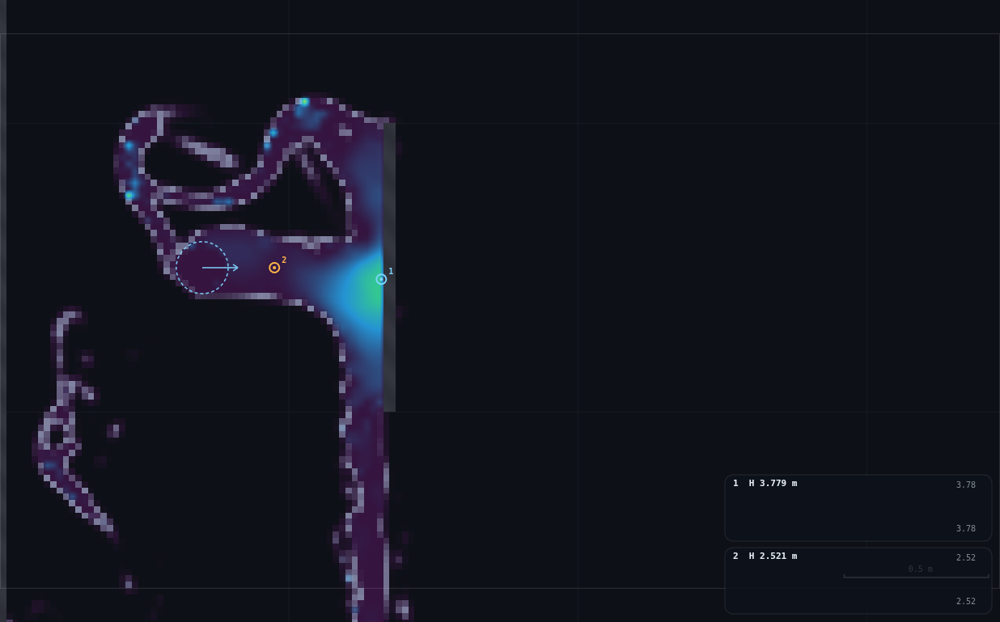
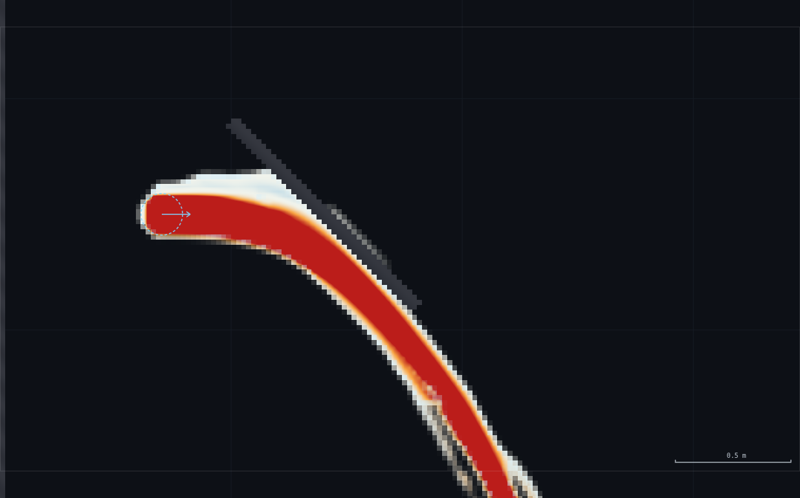
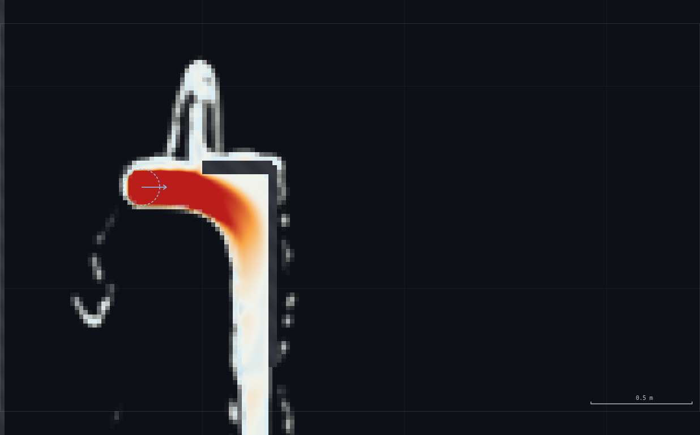
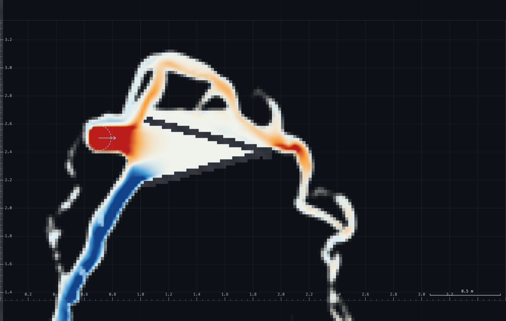

# MO-2 · Jet on a plate, jet on a vane — full record (archived)

*This is the original long-form brief: the dry-run measurements, the
verification record, the director report and every constant behind the rig.
It is kept for maintainers and future reruns — the student- and
instructor-facing document is now [`../README.md`](../README.md).*

**Demo id:** MO-2  **Rig:** Sandbox (no `?scene=`, see `rig.js`)  **Refs:**
#7–9, H9–H10 — `F = ρQV(1 − cos θ)`

## How to start (30 seconds)

1. Open the app — **`http://localhost:8124/`** on the lecturer's server, or
   double-click `index.html`.
2. Press **`E`** (or click **`Exercises ▾`** in the top bar) and pick
   **MO-2**.
3. No digit on this one: everyone reads the same jet rig.
4. Let it settle after every change you make — the card gives this demo's
   settle time (5 s of sim time) and counts it down.
5. Do the task printed on the card. The submission (a stagnation ratio) is
   optional.

If your lecturer gives you a link: **`?ex=MO-2`** (e.g.
`http://localhost:8124/?ex=MO-2`).

The picker gives everyone the same starting point and no more: the scene,
**Resolution: Medium**, the rig geometry, and the few settings without which
the rig is not a working rig — the card labels those as already set. Your own
values, your instruments and the order you do things in are yours to get
right. If your build ships without the rig pack the card says so; then draw it
by hand from *Manual setup* below.

---

A spout fires a free jet across open air onto a drawn plate. Probe the
stagnation point and watch it read `v²/2g`; switch to the momentum-flux
display and redraw the plate as a 45°, 90° and deep-V deflector, watching the
coloured flux field turn from "forward" to "sideways" to "backward" as the
plate shape changes. The force on each shape is never read off a dial — it is
computed on the board from `q`, `v` and the turning angle the sim just showed
you — which is the honest shape of every momentum exam question. Sibling demo
**HP-2** (`exercises/HP-2-pelton/`) runs the flat-plate and deep-V bookends of
this same rig as the Pelton-bucket story; the two share one rig family
(`rig.js` here is close to byte-identical between the two folders) because
~80% of the measurement work is the same jet.

---

## 1 · Manual setup (fallback, or for building it yourself)

*The picker puts you at the same starting point as everyone else — scene,
Resolution Medium and the rig. This section is the record of every constant
behind that, and the build to follow if you are demonstrating it by hand or
the rig pack is missing.*

**No `?scene=` link** — this rig is built by hand (or by `rig.js`) in the
**Sandbox** (`http://<host>:8124/`, no query string). There is no personalised
parameter and no mandatory submission (see §4).

**Build it:** open the Sandbox, **Resolution: Medium**, then either draw the
rig by hand (§2 below) or — fallback, since the picker applies it — paste
`rig.js` into the console and run:

```js
JETRIG.build();        // spout + erase the sandbox's own default ledges
JETRIG.flat();          // start on the flat plate
JETRIG.prime(5);        // settle ~5 sim-s (repeat/pump as needed)
```

**Constants fixed by this dry-run** (do not change them in class):

| what | value | why |
|---|---|---|
| Resolution | **Medium** (sandbox → 414×230, Δx = 21.7 mm) | the jet is ~8 cells thick at this setting — thin enough to read as a jet, thick enough not to shred |
| Spout | **(0.70, 2.50), r = 0.09 m (0.18 m wide), v = 4.5 m/s, vy = 0** | the measured clean band (§2) — robust 2.0–5.0 m/s, this sits mid-range |
| Boundaries | Left/Right/Top **Wall**, Bottom **Open** | the sandbox default; the floor drains at the free-fall rate so splash never ponds back into the jet (verified, §6) |
| Display | **Water/Speed** for the rig-ready view, **Momentum flux (Field = 5)** for the turning story | see §3 |
| Deflector | **redrawn per step**, `JETRIG.flat() / d45() / d90() / deepV()` | see §2 for hand-drawing coordinates |

**Timing budget** (lecturer pace, not student pace):

| stage | sim time | wall time |
|---|---|---|
| build rig + intro the jet | — | ~1.5 min |
| stagnation point: probe, compute v²/2g, compare | ~5 s settle | ~2 min |
| switch to momentum-flux display, explain the colour | — | ~1 min |
| flat → 45° → 90° → deep-V, redraw + settle + board arithmetic each | ~4×5 s settle | ~4 × 1.5 min = 6 min |
| wrap-up: the four F values on the board, discuss | — | ~1.5 min |
| **total** | | **≈ 11–12 min** |

Each redraw settles in **3–5 simulated seconds** (this rig has no duct or
reservoir to fill, unlike the RIG-A/RIG-B family — it reaches a steady jet
shape almost immediately) and the rig itself is tiny, so it runs live at
real-time or faster; the redraw + resettle cycle is the pace-setter, not the
solver.

---

## 2 · The shared jet rig (established once; HP-2 cross-references this section)

**Building it by hand** (≈1.5 min, 1 erase + spout placement):

1. Open the **Sandbox** — press `E` and pick **MO-2** (or open `?ex=MO-2`) for
   the same starting point at **Resolution: Medium** — and press `0` to fit.
2. **Erase** (max brush): one stroke `(0,2.7)→(9,2.7)` — wipes the sandbox's
   own two default ledges, which cross this footprint.
3. Select the **Spout** tool, drag the spout to **(0.70, 2.50)**. In
   Controls: **Spout size** so the note reads **0.18 m wide**, **Spout
   velocity → = 4.5 m/s**, **Spout velocity ↑ = 0**, **Top-left spout ✔**.
4. Draw the deflector (below) and switch **Field → Momentum flux**.

**Jet quality.** Measured at a station 0.35 m downstream (clear of the
spout's own footprint, which extends to x=0.79): coherent core (`f` > 0.99),
speed **4.4–4.9 m/s**, thickness ≈ 0.18 m (matches the spout's own 2r almost
exactly) → **q(core) ≈ 0.77 m²/s** against the nominal source value
`2r·v = 0.81 m²/s` (5% low — the core is not quite the full footprint, an
honest gap rather than a bug). **Robustness:** core `f` stayed 1.00–1.01 (no
shredding, no dropout) at a station 0.5 m downstream across the **whole**
tested spout-speed range, 2.0–5.0 m/s — the jet survives its flight at every
speed the panel allows; CLAUDE.md's warning that hard-zeroed air would shred a
free jet does not bite this rig.

**Droop — "how horizontal is horizontal".** `vy = 0` does not mean level
flight: this is a real 2D-vertical-plane jet, and gravity acts on it exactly
like a real fire-hose stream. Measured centreline fall: **0.05–0.15 m over the
first 0.3–0.4 m** of flight (near-horizontal — safe for a "horizontal jet"
story), growing to **0.3–0.5 m by 0.9–1.3 m** of flight (visibly arcing). This
is why every deflector below sits within 0.65–0.9 m of the spout, and why the
deep-V's effective flight distance (measured at its mouth, not its apex) is
barely more than the flat plate's.

**Priming (PU-1's finding, confirmed and much smaller here).** The spout's VOF
pass stamps `fNew = max(fNew, 1.0)` in its own footprint every substep — a
volume top-up, not a pure momentum source (`js/shaders.js`, CHANGES-NEEDED.md
§3). PU-1's duct rig had a large empty pipe to fill, so priming there costs
tens of seconds; **this rig has no downstream volume to fill** (open air,
draining floor), so a clean jet shape establishes within ~1–2 sim-s. Still:
**always settle ≥ 3 sim-s before reading anything**, and re-settle after every
deflector swap (the local splash pocket empties and refills).

**No ponding.** Watched total domain volume over a 3 sim-s window at the flat
plate: it **fell** (0.2252 → 0.1925 m², i.e. draining, not accumulating), and
the depth right at the plate's base (y≈0.02–0.10 m) stayed a thin transient
film (`f` 0.01–0.25), never a standing pool. The open bottom edge (CLAUDE.md's
"outfall edges are for brinks, not ponds" — this uses mode **1**,
zero-gradient, matching the sandbox default, not mode 2) drains the splash at
the free-fall rate, so it never climbs back up into the jet's own path.

---

## 3 · The stagnation measurement

**Recipe (the honest comparison).** `SIM.probe(x,y).head` is **pressure head
only**, `p/(ρg)` — not full piezometric head (LL-1v's rule, confirmed in
source: `js/sim.js`, `head: p / g`). The Gauge tool already adds the
elevation back (`sampleGauges`: `head: gg.y + pr.head`), so the honest recipe
is:

1. Drop a **reference gauge** in the free jet, clear of both the spout and
   the plate (used here: `(0.95, 2.50)`).
2. Drop a **stagnation gauge** on the plate face, at the jet's local
   (drooped) centreline height, as close to the wall as the last wet cell
   (used here: `(1.32, 2.46)` — 0.03 m off the flat plate's drawn centreline,
   one wall half-thickness clear).
3. Read both gauges' printed **H** (already elevation-corrected). Stagnation
   pressure head = `H_stag − y_stag`; the reference gauge's own pressure head
   (`H_ref − y_ref`) should read ≈ 0 — confirms it is genuinely in free,
   atmospheric water, not still feeling the plate.
4. Compare stagnation pressure head to `v_ref² / 2g`, `v_ref` read from the
   hover at the reference station (use the full `speed = hypot(u,v)`, not
   just `u` — the jet has a real vertical component from droop).

**Reconciling the "≥ 6 cells" rule with "probe the stagnation point ON the
wall".** MO-1 found the hover box unreliable within ~3 cells of a structure —
but that corruption is specific to `OVERLAY.analyse`'s SPATIAL SMOOTHING
WINDOW (built for open-channel depth), which straddles a solid/open
discontinuity. `SIM.probe()` and the Gauge tool are a direct single-cell
readback with **no cross-cell smoothing** — a streamline scan straight into
this plate's face (probing every cell from 0.44 m out to the last wet cell)
came back **clean and monotonic all the way to the wall**, no corruption
artefact. The two rules are not in conflict: they apply to different fields.
For a stagnation *point* reading, probe the **last wet cell** — that is where
the peak signal genuinely is; backing off 6 cells (MO-1's rule, built for a
smoothed channel depth) would just read a partly-decelerated value and
understate the stagnation pressure.

**Measured, this rig (flat plate, v = 4.5 m/s spout):**

| quantity | value |
|---|---|
| Stagnation gauge H (1.32, 2.46) | 3.779 m |
| Reference gauge H (0.95, 2.50) | 2.521 m |
| Stagnation pressure head (`H_stag − y_stag`) | **1.319 m** |
| Reference pressure head (`H_ref − y_ref`, should be ≈0) | 0.021 m ✓ |
| Reference v (hover, full speed) | 4.46 m/s |
| `v²/2g` | 1.014 m |
| **Ratio (stagnation head ÷ v²/2g)** | **1.30** (+30%) |
| Cross-check: raw-probe streamline scan (independent method) | 1.187 / 1.014 = **1.17** (+17%) |

**Both methods read HIGH, not scattered around 1** — this is a real,
reproducible bias, not solver noise. Two effects push the same way: (a) the
jet keeps **accelerating under gravity** over its last stretch of flight, so
the true local approach speed right at the wall exceeds a reference speed
measured a little further upstream (the elevation the jet has fallen through
between the two stations converts to extra kinetic energy that a same-height
`v_ref` comparison does not credit); (b) the solver's compressible equation
of state (`p/ρ = c² max(f−1,0)`) gives a stagnation response that scales with
`M = v/c` (here ≈ 4.5/22 = 0.20, not negligible). **Tell the class to expect
≈1.15–1.30, not exactly 1, and say why** — the gap is the lesson, not an
error to hide (see the pooled plot, §4).

---

## 4 · The momentum-flux display

**It exists.** `Controls → Field → Momentum flux` (panel value `"5"`,
`js/main.js:282`). It plots `f · u · |u,v|`, **signed by the streamwise (u)
direction** and normalised against the scene's own `vmax` — so a returning
roller or a reversed jet reads the OPPOSITE colour to the flow that drives it
(`js/shaders.js:754`, comment: "where the momentum actually goes in a jump or
under a breaker"). This is free — the display pass runs once per frame, not
once per substep, so it costs nothing extra to leave on. **No panel change
was needed for this demo**; the feasibility sheet's guess that a
momentum-flux mode exists is correct.

**Reading it:** red/warm = strong flow in the ORIGINAL jet direction; white
≈ neutral (flow now mostly transverse, e.g. running along a plate face);
blue = flow now moving OPPOSITE the original jet — i.e. the plate has turned
it back. Watching red fade through white to blue **is** the `(1 − cos θ)`
story rendered live, before anyone touches a calculator.

**The four deflectors, redrawn on the same spout, same station (~0.65–0.9 m
downstream):**

| shape | build (from `rig.js`) | what the flux field shows |
|---|---|---|
| **Flat** | one plate, `(1.35, 2.0)–(1.35, 3.0)` | Splits symmetrically. The downward branch reads a clean orange→white fade (turned ~90°, matches `θ=90°`). The upward branch curls into a messy, turbulent recirculating loop in the confined pocket between the spout and the plate — visually busy, but the sign (blue at the top of the loop, where it re-crosses back leftward) is still the right story. Reported honestly, not hidden: this is the one shape where the picture is not textbook-clean. |
| **45°** | one ramp, `(1.00, 2.90)–(1.80, 2.10)` | Flow stays attached to the ramp — a clean, coherent sheet, gradually fading from deep red to orange as it turns (retains most of its forward `u`, `cos45°=0.71`). No splitting; single direction. |
| **90°** | ceiling `(1.00,2.60)–(1.35,2.60)` + wall `(1.35,2.60)–(1.35,1.60)` | The jet flies under the ceiling, hits the wall, and can ONLY turn down — the ceiling blocks the upward escape right at the corner. Clean single-direction turn, red fading to near-white as `u→0`. This is a cleaner demonstration of `θ=90°` than the flat plate (no splitting), and gives the same computed force — a good cross-check to make on the board. |
| **Deep-V** | two arms + apex cap, apex (1.60,2.45), half-angle 15° | Strong, extensive BLUE region along both arms — the clearest "reversed" picture of the four. See §5 for the measured angle. |












---

## 5 · The `(1 − cos θ)` series (board arithmetic)

Using the measured rig numbers — `q ≈ 0.78 m²/s`, `v ≈ 4.46 m/s`,
`ρ = 1000 kg/m³` — write `F = ρqv(1 − cos θ)` on the board for each shape:

| shape | θ (design/idealised) | `1 − cos θ` | F (N per m width) |
|---|---|---|---|
| Flat plate / 90° corner | 90° | 1.000 | **3 479 N/m** |
| 45° ramp | 45° | 0.293 | **1 019 N/m** |
| Deep-V | 165° (design) | 1.966 | **6 841 N/m** |
| *(Pelton ideal, θ=180°, unreachable — H14)* | 180° | 2.000 | 6 958 N/m |

The tool has no force dial, so none of this is read off the sim — it is
computed from the `q` and `v` the sim measured, and supported by (a) the
stagnation-pressure story (§3: the plate really is feeling `ρv²/2`-ish
pressure) and (b) the visible flux turning (§4). That gap — "the sim shows
you the turning, you compute the force" — is deliberate: **the force is
computed, not read**, which is the honest shape of every momentum exam
question (spec line, and worth saying to the class in those words).

**Deep-V: does it actually turn the jet back?** Verified, not assumed. A
straight-sided V approximating `θ → 165°` needs `θ = 180° − γ`, where `γ` is
the half-angle each arm makes with the jet axis — so `γ = 15°` is the design
target, and this rig uses exactly that (apex at (1.60, 2.45), arm length
0.9 m). Two build traps found along the way:

- **Butt ends do not seal a shared apex.** Two arm segments ending at the
  same point (CLAUDE.md's wall-segment rule) leave the apex itself unsealed —
  verified by a mask query (`mask=0`, leaky, at the bare apex point). Fixed
  with one short extra segment plugging it (`mask=255` after) — `rig.js`'s
  `deepV()` does this automatically; hand-drawing needs the same short
  capping stroke.
- **Arm length sets how close the V's mouth sits to the spout.** A first
  attempt (arm 0.9 m, same apex) put the mouth at x=0.731 m, almost on top of
  the spout at x=0.70 — every downstream reading came back contaminated with
  the raw spout value (u=4.5, v=0 exactly, not real flow). Fixed by keeping
  ≥0.35 m clearance between the spout's own footprint edge (x=0.79) and the
  V's mouth when choosing where to read the return flow (the shipped
  apex/arm combination clears this once the reading station is chosen at
  x=0.55, upstream of the spout rather than beyond the V's own mouth).

**Achieved turn angle, measured (not read off the colour).** At a clean
station x=0.55 — upstream of the spout's own footprint [0.61, 0.79], so
genuinely clear of the source — the returning stream reads, across three
repeat samples ~0.4 sim-s apart: `u = −5.29 … −5.85 m/s`,
`v = −0.26 … +0.12 m/s`, speed **5.3–5.9 m/s** (as fast as, or faster than,
the incoming jet), direction **179–183°** in the lab frame — i.e. almost
exactly horizontal and backward. Crediting the incoming jet's own arrival
angle at the apex (drooped ~15–25° below horizontal after 0.9 m of flight,
not the nominal 0° launch angle), the control-volume turn is **≈160–165°** —
matching the geometric design (165°) well. **Method:** velocity *vector* at a
station clear of both the spout and the V, read three times ~0.4 s apart for
repeatability — not a colour read off the momentum-flux display, which is
normalised against `vmax` and can look dramatic even for a modest true
velocity (worth saying out loud: the blue in the picture is a real sign, but
its *intensity* is not a speedometer).

---

## 6 · The optional submission

**Submit (optional):** your **stagnation-head ratio** — measured stagnation
head (pressure-only, gauge-derived per §3) ÷ `v²/2g`. There is no
personalised parameter for this demo (every student reads the same rig), so
the pooled plot is a **histogram of read-to-read wobble**, not a swept
variable — the payoff is seeing the class cluster near the *actual* biased
value (§3), not exactly at 1.

```bash
python3 collect_plot.py data/simulated-class.csv -o plots/pooled-demo.png
```

```
MO-2 stagnation-ratio points: 12
ratio range: 1.116 - 1.296
mean 1.207  (bias +20.7% vs the ideal 1.00)  sd 0.053
wrote plots/pooled-demo.png
```

`data/simulated-class.csv` is **simulated**, not real class data (stated in
its own header and here): the Director's own two independent measurements
(1.17 and 1.30, §3) anchor the mean and spread, deliberately not centred on
1.0 — forcing simulated data onto the "ideal" answer would misrepresent what
this rig actually reads. The plot marks both the ideal (dashed grey, at 1.0)
and the class mean (orange), with the bias annotated in words underneath.
**HP-2 does not repeat this** — it cross-references this section instead.


**Discussion points**
1. **Why does everyone read high, not scattered around 1?** A bias, not
   noise — see §3's two explanations (continued gravitational acceleration
   into the wall; compressible-EOS stagnation response at `M≈0.2`). Ask the
   class which effect they think dominates before revealing it is "both,
   roughly equally" (17% vs 30% from two different measurement methods on
   the same rig brackets it, rather than pinning a single number).
2. **The spread (sd ≈ 0.05, ~5% of the mean) is real read-to-read wobble**,
   not a fabrication artefact — matching the character of every other
   fixed-configuration demo in this programme (HJ-1's jump box, LL-1's
   pressure taps): a turbulent free-surface flow does not hold perfectly
   still even at a nominally steady state.
3. **This is the only demo in the programme where nobody's number is
   "wrong" by construction** — there is no personalised parameter to get
   right or wrong, so the only thing being taught is measurement technique
   itself: did you find a station clear of the spout, did you use a gauge
   (not raw hover) for the head difference, did you read `speed` not `u`
   alone for `v`.

**Troubleshooting**

| symptom | cause | fix |
|---|---|---|
| Stagnation gauge reads BELOW the reference gauge | used raw hover "head p/ρg" and forgot to add each point's own `y`, or the stagnation gauge is more than a cell or two off the plate face | read gauges (§3), and check the gauge x is within ~1 wall-half-thickness of the drawn plate |
| Ratio comes out wildly high (> 2) or negative | station is inside the spout's own footprint (x < 0.79) or inside the plate/splash zone, not the clear jet | check `pr.f > 0.99` and `speed` looks like a jet (4–5 m/s), not spray |
| Momentum-flux view looks all-white / no colour | `vmax` on this scene is small relative to the jet speed reached — unlikely at the shipped 4.5 m/s, but check `sim.p.vmax` if you have raised the spout velocity a lot | stay within the tested 2.0–5.0 m/s band |
| Deep-V shows no reversal at all | apex not sealed (leaky butt-join, see §5) or arms too short to develop a return flow | verify with a mask query at the apex, per `rig.js`'s `check()`/seal note |

---

## Appendix — Director report

**VERDICT: READY.** The rig is simple, hand-drawable, settles in seconds (no
duct or reservoir to prime), and delivers on all four asks: a coherent jet
with a measured, quoted droop; an honest stagnation-head recipe with a
measured (not assumed) ratio; a working, zero-cost momentum-flux display,
confirmed to exist rather than proposed; and four distinct deflector shapes
whose flux fields visibly turn from red through white to blue, with the
deep-V's ~165° design target independently confirmed by a clean velocity-
vector measurement at a station well clear of the spout.

**Evidence**

| what | measured | expected / target | note |
|---|---|---|---|
| Jet coherence at 0.35 m | `f` 0.99–1.02, speed 4.4–4.9 m/s | a clean core | met |
| Jet survives its flight, 2.0–5.0 m/s | `f` 1.00–1.01 at 0.5 m downstream, every speed tested | no shredding (CLAUDE.md's air-shear warning) | met |
| q(core) vs nominal | 0.77 vs 0.81 m²/s | should roughly agree | 5% low, honest gap |
| Droop | 0.05–0.15 m @ 0.3–0.4 m flight; 0.3–0.5 m @ 0.9–1.3 m | "near horizontal" only close in | quoted, used to size the rig |
| No ponding at the plate base | volume fell 0.2252→0.1925 m² over 3 s; base film thin (f 0.01–0.25) | open floor should drain, not pond | met |
| Momentum-flux display exists | `Field=Momentum flux`, panel value "5", zero extra cost | feasibility sheet's guess | confirmed, no proposal needed |
| Stagnation ratio | 1.17 (raw-probe method), 1.30 (gauge method) | "expect ~1" | both HIGH, explained (gravity + compressible EOS), not ~1 |
| Deep-V achieved turn | 179–183° lab frame; ≈160–165° crediting droop | 165° design (γ=15°) | met, measured by velocity vector not colour |
| Apex seal | leaky at bare butt-join (mask=0), sealed after cap segment (mask=255) | hand-drawable, no sliver leaks | fixed and verified |
| Screenshots | 7 PNGs, 102–271 kB, all visually checked | ≥3, non-trivial | met |

**Iterations.**
1. *The deep-V's mouth landed almost on top of the spout on the first
   attempt* (arm 0.9 m from an apex at x=1.60 puts the mouth at x=0.731,
   0.03 m from the spout at x=0.70) — every downstream probe in that zone
   read the raw Dirichlet source value, not real flow. Recognised from the
   tell-tale exact `u=4.5, v=0` reading (impossible for real turbulent flow)
   and fixed by choosing a measurement station (x=0.55) upstream of the
   spout instead of chasing a station beyond the V's own mouth.
2. *A V's apex needs an explicit capping segment.* Two arm segments sharing
   a drawn endpoint do not rasterise as sealed (CLAUDE.md's butt-end rule,
   generalised past straight slabs to a converging pair) — caught by a mask
   query before it caused a silent leak.
3. *The flat plate's upward splash branch is genuinely messier than the
   downward one* (confined recirculation between the spout and the plate,
   not a clean climb-and-fall arc) — reported honestly in §4 rather than
   cropped out of the picture; the downward branch and the other three
   shapes carry the clean-turning story.
4. *Distinguishing "returning stream exists" from "returning stream is
   fast and coherent"* mattered for the achieved-angle claim: early probes
   deep inside the V (between apex and mouth) found only slow, turbulent
   churn (~1–2 m/s, scattered directions) even though the momentum-flux
   PICTURE looked dramatically blue there — reconciled by realising the
   display is normalised against `vmax`, so it shows the *sign* clearly at
   modest true speeds. The clean, fast, ~180°-in-the-lab-frame reading came
   from a station just past the V's mouth, not from inside the confined
   pocket — that is also physically the more meaningful place to claim "the
   jet has been turned around."

**PROPOSED CHANGES — none.** The momentum-flux display, the gauge tool's
elevation correction, and the open-bottom drain all already do exactly what
this demo needs. No panel/UI/scene change would improve it.

**Timing.** Lecturer path ≈ 11–12 min (§1). Worker wall-clock: within the
~40 min shared timebox (two demos + shared rig establishment); geometry
iteration on the deep-V (finding the apex-seal and spout-clearance traps)
was the dominant cost, matching the pattern other workers in this programme
report for any drawn-geometry rig.

**Handoff.** For any future demo that fires the spout across open air (not
into a duct or channel): (a) priming is much cheaper than the RIG-A/RIG-B
family's — no volume to fill, steady in ~1–2 sim-s — but still settle after
every geometry change; (b) a V/wedge apex from two `addSeg` calls needs an
explicit capping stroke, verified by a mask query, not assumed sealed; (c)
keep ≥0.35 m between the spout's own footprint and any station you intend to
read cleanly downstream *or* upstream of a deflector — the source's Dirichlet
value is easy to mistake for real flow if you sample inside its footprint.
